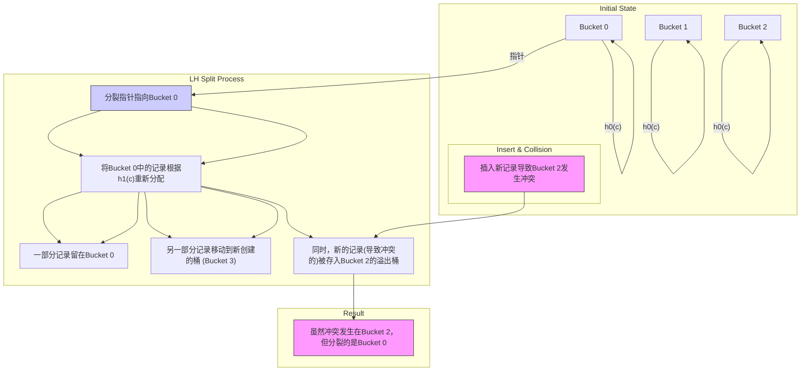
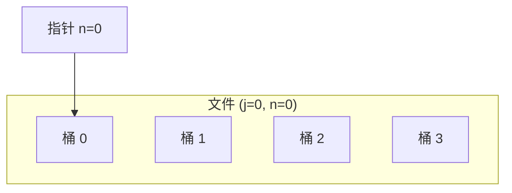
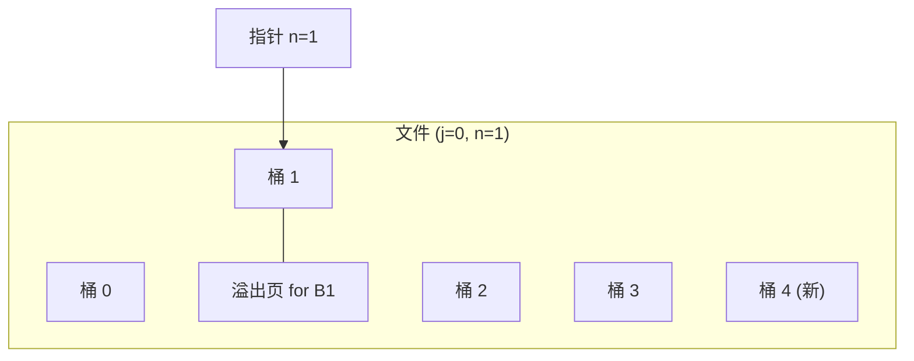
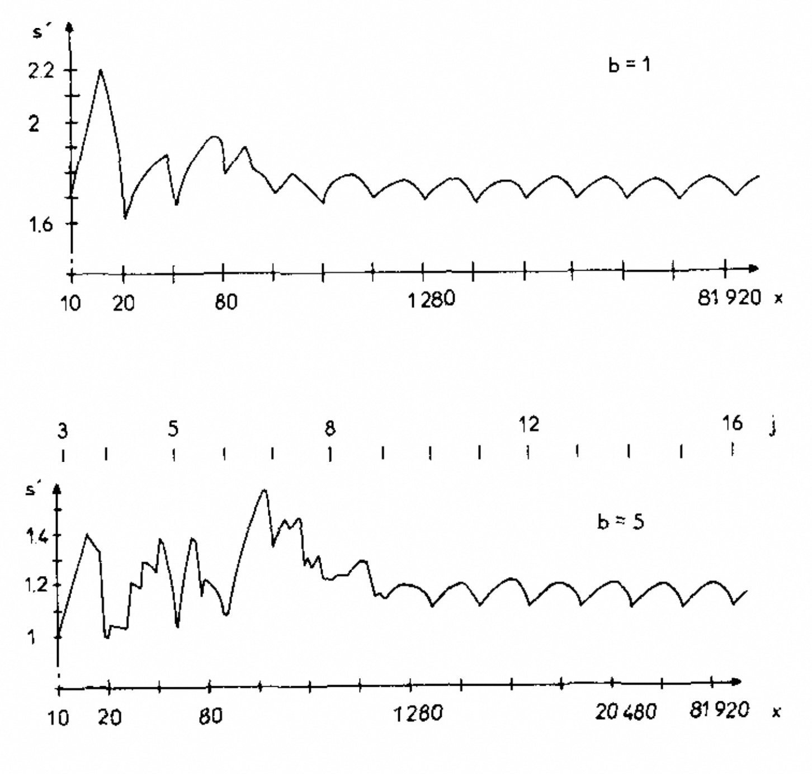
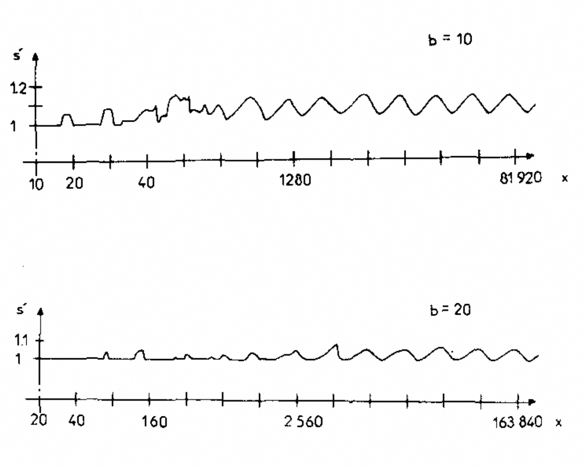
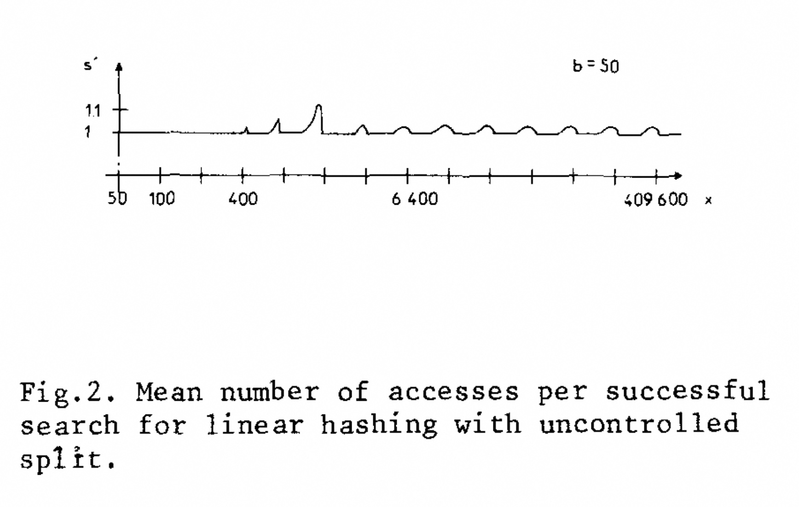
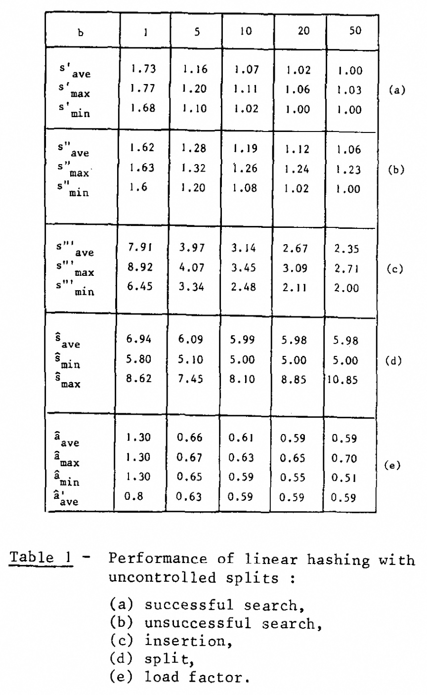
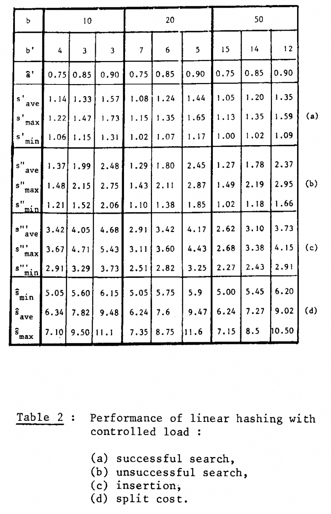
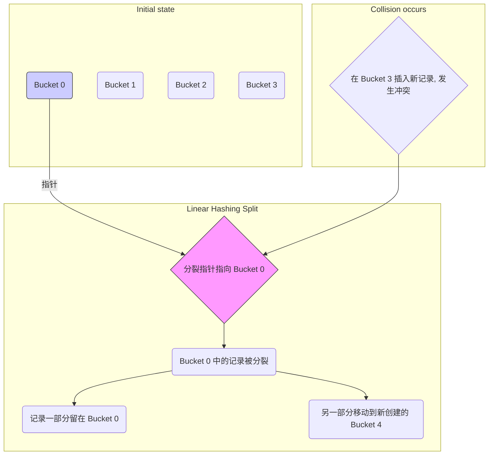

## AI论文解读 | Linear Hashing: A New Tool for File and Table Addressing
        
### 作者        
digoal        
        
### 日期        
2025-09-04       
        
### 标签        
PostgreSQL , PolarDB , DuckDB , AI , 论文解读        
        
----        
        
## 背景  
      
https://users.eecs.northwestern.edu/~peters/references/Linearhash80.pdf        
  
提示:          
```          
读懂《Linear Hashing: A New Tool for File and Table Addressing》这篇论文需要提前掌握哪些基础知识, 请使用中文通熟易懂的讲解这些基础知识, 可以引用论文中的图、表或使用Markdown支持的图形(text,mermaid等)增加解释性. 
  
使用中文通熟易懂的解读《Linear Hashing: A New Tool for File and Table Addressing》这篇论文, 其中的关键内容请着重讲解, 可以引用论文中的图、表或使用Markdown支持的图形(text,mermaid等)增加解释性. 
  
提取《Linear Hashing: A New Tool for File and Table Addressing》这篇论文中的重要术语, 使用中文对这些术语进行通熟易懂的讲解, 可以引用论文中的图、表或使用Markdown支持的图形(text,mermaid等)增加解释性. 
```     
  
## 1 前置知识 
  
你好！很高兴能帮你理解这篇论文。这篇论文介绍的“线性哈希”（Linear Hashing）是一种解决传统哈希方法痛点的先进技术。要读懂它，你需要先掌握一些基础的计算机科学概念。

## 下面我将以通俗易懂的方式，为你梳理阅读这篇论文所需的基础知识，并引用论文中的概念进行解释。

### 1\. 基础数据结构与概念 (Basic Data Structures and Concepts)

  * **文件与表 (Files and Tables)：** 论文主要讨论如何有效地存储和检索文件或表中的记录 。你可以把它们想象成一个 Excel 表格，每一行是一条记录，每一条记录都有一个唯一的**主键 (primary key)**，比如一个学号或商品ID 。
  * **桶 (Buckets)：** 在哈希的世界里，我们不把记录存放在表格行中，而是存放在一个个被称为“**桶**”的内存单元里。一个桶可以容纳多条记录 。
  * **哈希函数 (Hashing Function)：** 这是一个神奇的函数，它接收一个主键作为输入，通过一些计算（比如对一个数取模），给出一个内存地址或桶的编号作为输出 。论文中用 `h(c)` 来表示，其中 `c` 是主键 。
  * **负载因子 (Load Factor)：** 衡量哈希表使用效率的一个指标。简单来说，就是**已存储的记录数**与**所有桶能容纳的总记录数**之比 。负载因子越高，说明空间利用率越高 。

-----

### 2\. 经典哈希与动态哈希 (Classical vs. Dynamic Hashing)

  * **经典哈希 (Classical Hashing)：** 传统的哈希方法使用一个固定的哈希函数 `h(c)`。如果文件或表是**静态的**（即记录数基本不变），这种方法可以非常快地找到记录，通常只需要一次访问 。
  * **冲突 (Collision)：** 问题的关键在于，当一个文件或表是**动态的**（即需要不断插入或删除记录）时，传统哈希的性能会急剧恶化 。这是因为不同的主键可能会通过哈希函数映射到同一个桶上。当一个桶满了，新记录就无法存入，这就是发生了“**冲突**” 。
  * **冲突解决 (Collision Resolution)：** 解决冲突的一种常见方法是创建“**溢出桶**”（overflow buckets） 。当一个主桶满了，就把新记录存入一个与之相连的溢出桶中。这种方法虽然能解决问题，但会增加访问次数（因为需要额外访问溢出桶），从而降低性能 。
  * **动态哈希 (Dynamic Hashing)：** 为了解决传统哈希在动态环境中的问题，论文介绍了一种新的思想：**动态地修改哈希函数**来避免溢出记录的积累 。这篇论文将这种新方法称为“虚拟哈希”（Virtual Hashing） 。

### 3\. 线性哈希的核心思想 (The Core Idea of Linear Hashing)

线性哈希正是动态哈希的一种实现，它的核心创新在于以下两点：

1.  **动态哈希函数 (Dynamic Hashing Functions):** 线性哈希不只使用一个哈希函数 `h`，而是使用一系列哈希函数 `h₀, h₁, h₂, ...`。当文件增长时，它会从 `h₀` 切换到 `h₁`，再到 `h₂`，以此类推。这些函数都有一个特点：`hᵢ(c)` 产生的结果地址要么和 `hᵢ₋₁(c)` 相同，要么是 `hᵢ₋₁(c)` 加上一个偏移量 `2ⁱ⁻¹N` 。
2.  **预定义的分裂顺序 (Predefined Split Order):** 这也是线性哈希与之前动态哈希方法（如 VH）最主要的区别 。当发生冲突时，传统的想法是分裂发生冲突的那个桶。但线性哈希的创新在于，它**不分裂**发生冲突的桶，而是根据一个**预先定义的线性顺序**来分裂桶 。

论文中用一个“指针”（pointer）来指示下一个需要被分裂的桶。这个指针从0开始，每次发生一次冲突（或者根据负载控制条件），不管冲突发生在哪个桶，它都会移动一步并分裂指针所指向的那个桶 。

这个过程可以用下面的示意图来理解：



如图所示，当你在**桶2**中插入记录时发生了冲突，但线性哈希会按照预先的顺序分裂**桶0**。这似乎有些反直觉，但正是这种“**延迟分裂**”（delayed split）的机制，让线性哈希能够平滑地扩展文件，并最终将溢出记录重新分配到主桶中 。这样一来，无论文件有多大，都能保持很高的负载因子和非常高效的检索速度，通常只需一次磁盘访问 。
  
## 2 解读论文 
  
好的，我们来一起深入解读这篇开创性的论文——Witold Litwin的《Linear Hashing: A New Tool for File and Table Addressing》。

这篇1980年的论文介绍了一种名为**线性哈希 (Linear Hashing, LH)** 的动态文件结构算法。在它被提出的年代，如何让一个文件或哈希表在不断插入和删除数据的同时，依然保持极高的查询效率和空间利用率，是一个巨大的挑战。线性哈希优雅地解决了这个问题，直到今天，其设计思想依然影响着许多现代数据库和存储系统。

为了更好地理解，我会将解读分为以下几个部分：

1.  **核心问题：传统哈希的困境**
2.  **线性哈希的革命性思想：有序分裂与“指针”**
3.  **线性哈希如何工作：一步步图解**
4.  **性能的艺术：负载控制 (Load Control)**
5.  **惊艳的性能表现：论文数据解读**
6.  **总结与应用**

-----

### 1\. 核心问题：传统哈希的困境

我们先回顾一下传统的哈希表（论文中称为“Classical Hashing”）。

  * **工作方式**：你预先分配一个固定大小的数组（例如M个桶），然后用一个哈希函数 `h(c) = c mod M` 来决定某个键 `c` 应该存放在哪个桶里。
  * **优点**：如果数据量不大，且哈希函数设计得好，你可以在**一次**磁盘访问内就找到数据，速度极快 。
  * **致命缺点**：它是**静态的**。一旦哈希表被填满，新数据插入时就会发生“冲突”（Collision）。解决冲突通常是在主桶后面挂一个“溢出链”（Overflow Chain）。随着数据不断插入，这个链条会越来越长，查询性能会急剧恶化，从一次访问变成多次访问 。最终，你不得不暂停服务，将所有数据重新哈希到一个更大的新表中（Rehashing），这个过程成本非常高 。

**简而言之，传统哈希无法优雅地处理动态增长的数据。**

### 2\. 线性哈希的革命性思想：有序分裂与“指针”

为了解决传统哈希的静态问题，作者Litwin在此前的工作中提出了“虚拟哈希”（Virtual Hashing, VH）的概念，其核心思想是在需要时 **动态地分裂（split）** 哈希桶，而不是让溢出链无限增长 。

而**线性哈希 (Linear Hashing)** 是虚拟哈希的一种演进，它提出了一个颠覆性的创新点：

> **不再分裂发生冲突的那个桶，而是按照一个预先设定的、线性的顺序来分裂桶。** 

这个思想是线性哈希的灵魂。为了实现它，线性哈希引入了两个关键变量：

1.  **分裂指针 (Split Pointer), `n`**：这个指针指向**下一个**将要被分裂的桶 。它从地址0开始，线性地向后移动（0, 1, 2, ...）。
2.  **文件级别 (File Level), `j`**：这个变量表示文件经历了多少次“倍增”。初始级别为 `j=0`。

**为什么这个想法如此巧妙？**

因为它彻底解耦了“冲突的发生”和“桶的分裂”。一个桶满了，没关系，我们先挂上一个临时的溢出记录 ，然后我们不处理这个满的桶，而是去处理指针 `n` 指向的桶，对它进行分裂。

这个“延迟处理”的策略意味着，虽然一个冲突的桶可能暂时产生了溢出，但随着指针 `n` 最终扫过文件中的每一个桶，所有的溢出记录都会被重新分配到新的主桶中，从而被清理掉 。最重要的是，由于分裂顺序是固定的，系统不再需要一个复杂的目录结构来记录哪个桶分裂了、分裂到了哪里。只需要 `n` 和 `j` 这两个小小的变量，就能计算出任何一个键的地址，这使得线性哈希的内存开销极小，几乎可以忽略不计 。

### 3\. 线性哈希如何工作：一步步图解

我们通过一个简化的例子来理解整个过程。

**初始状态**

  * 假设文件初始大小 $N=4$ 个桶，每个桶容量为 $b$。
  * 文件级别 `j=0`。
  * 分裂指针 `n=0`。
  * 我们使用一组哈希函数：$h\_j(c) = c \\pmod{N \\times 2^j}$。
      * 当前我们使用 $h\_0(c) = c \\pmod 4$。

文件状态如下：



**步骤1：发生冲突，触发分裂**

  * 假设我们持续插入数据，直到某个桶（比如**桶1**）满了，再插入一个键`c_new`（假设 $h\_0(c\_{new})=1$）时，就发生了冲突。
  * **处理冲突**：首先，为桶1创建一个溢出页，并将`c_new`存入 。
  * **触发分裂**：冲突的发生是一个信号，告诉系统“是时候扩容了”。但我们分裂的不是桶1，而是指针 `n` 指向的**桶0** 。

**步骤2：执行分裂**

  * **分裂桶0**：
    1.  为文件追加一个新的桶，地址为 $N+n$，即 $4+0=4$。
    2.  我们使用更高级别的哈希函数 $h\_1(c) = c \\pmod{4 \\times 2^1} = c \\pmod 8$ 来重新分配**桶0**中的所有记录（包括其溢出页中的记录）。
    3.  对于原桶0中的每一个键 `c`，重新计算 $h\_1(c)$：
          * 如果 $h\_1(c)=0$，记录保留在桶0。
          * 如果 $h\_1(c)=4$，记录移动到新的桶4。
          * 根据论文中的公式，新地址要么是原地址，要么是原地址+$N \\times 2^j$ 。
  * **更新状态**：分裂完成后，将指针 `n` 向后移动一位。
      * `n` 更新为 `1`。

此时文件状态变为：



*注意：桶1的溢出问题还在，但随着指针`n`的移动，轮到它被分裂时，这个问题就会被解决。*

**步骤3：指针移动与文件级别提升**

  * 这个过程不断重复。每发生一次冲突（并满足分裂条件），就分裂指针 `n` 指向的桶，然后 `n` 加一。
  * 当 `n` 从0一直移动到3，即所有初始的4个桶都被分裂了一遍后，指针 `n` 会重新回到0。
  * 此时，文件的大小已经从4个桶变成了8个桶。我们完成了一次完整的扩展。
  * **文件级别提升**：文件级别 `j` 从0提升到1。现在，我们的基础哈希函数变成了 $h\_1(c) = c \\pmod 8$，下一次分裂将使用 $h\_2(c) = c \\pmod{16}$。

**地址计算算法**

那么，在任何一个时刻，如何确定一个键 `c` 应该在哪里呢？算法(A1)如下 ：

1.  先用上一级别的哈希函数计算地址：$a = h\_j(c)$。
2.  **判断**：这个地址 `a` 是否已经被分裂过了？
      * 判断的依据很简单：如果 `a < n`，说明指针已经越过了它，它已经被分裂了。
      * 如果 `a >= n`，说明指针还没到它，它还没被分裂。
3.  **最终地址**：
      * 如果 `a` 已经被分裂（`a < n`），那么它的真实地址应该用更高级别的哈希函数计算：$a\_{final} = h\_{j+1}(c)$。
      * 如果 `a` 还没被分裂（`a >= n`），那么 $a\_{final} = a$。

这个算法极其高效，只需要几次整数运算，完全不需要访问磁盘上的元数据。

### 4\. 性能的艺术：负载控制 (Load Control)

论文指出，如果每次冲突都触发分裂（称为“非受控分裂”），那么文件的平均空间利用率（负载因子）大约在60%左右 。这虽然不错，但还有优化的空间。

因此，作者提出了**负载控制 (Load Control)** 的概念 ：

> **当冲突发生时，我们还要检查一下当前的负载因子。只有当负载因子超过一个预设的阈值（比如75%）时，才执行分裂操作。**

这个简单的策略带来了巨大的好处：

  * **更高的空间利用率**：可以人为地将负载因子维持在一个很高的水平，比如80%甚至90% 。
  * **性能权衡**：当然，更高的负载意味着更多的冲突和更长的临时溢出链。但这篇论文通过详尽的模拟数据证明，即使负载高达90%，平均查询访问次数也仅仅从接近1次略微增加到1.35次 。这是一个非常划算的交易。

### 5\. 惊艳的性能表现：论文数据解读

这篇论文最令人信服的部分就是其详尽的性能模拟数据。

#### a. 访问性能（查询效率）

下图（源自论文中的Fig. 2）展示了在“非受控分裂”模式下，随着记录数x的不断增长，平均每次成功查找所需的磁盘访问次数`s'`的变化。

      

*(图注：源自论文Fig. 2，展示了不同桶容量b下，平均访问次数s'随记录数x的变化)*

  * **核心结论**：无论文件增长到多大（图中的x轴是对数尺度的，增长了数千倍），平均访问次数 `s'` 始终在 **1.0** 附近波动 。对于容量稍大的桶（如b=10, 50），这个值几乎就是一条直线，无限接近1 。
  * **对比**：当时最好的B-Tree技术，查询一次通常需要3-4次磁盘访问 。线性哈希的性能是压倒性的优势。

#### b. 负载因子与性能的权衡

下表（综合论文中的Table 1和Table 2）展示了负载控制带来的效果。     

| 控制策略 | 负载因子 (阈值) | 桶容量 (b) | 溢出桶容量 (b') | 平均访问次数 (s') |
| :--- | :--- | :---: | :---: | :---: |
| 非受控分裂 | \~67% | 50 | 1 | **\~1.03**  |
| 负载控制 | 75% | 50 | 15 | **\~1.05**  |
| 负载控制 | 85% | 50 | 14 | **\~1.20**  |
| 负载控制 | 90% | 50 | 12 | **\~1.35**  |

  * **核心结论**：通过负载控制，我们可以将空间利用率从67%大幅提升到90%，而付出的代价仅仅是每次查询平均多访问0.32次磁盘 。这证明了线性哈希在性能和空间之间取得了惊人的平衡。

### 6\. 总结与应用

**线性哈希的主要优点可以总结为：**

  * **极高的访问性能**：无论文件如何动态增长，平均查询时间稳定在接近1次磁盘访问 。
  * **高且可控的空间利用率**：通过负载控制，可以轻松达到80%-90%的利用率 。
  * **真正的动态性**：支持平滑地增长和收缩，无需代价高昂的整体Rehashing。
  * **极低的内存开销**：只需要存储`n`和`j`两个变量，对内存要求极低，非常适合内存有限的环境 。
  * **算法简单**：相比B-Tree等复杂的树形结构，线性哈希的插入、删除、查询算法要简单得多 。

**应用场景**：
论文指出，线性哈希非常适用于那些记录数未知或会剧烈变化的应用场景，例如：

  * 编译器和文本处理系统中的符号表 。
  * 数据库管理系统（DBMS）中用于查询的临时工作空间 。
  * 虚拟内存管理 。
  * 由于其内存开销小，也非常适合当时的微型计算机（Micro-computers）。

总而言之，线性哈希通过“线性有序分裂”这一核心思想，巧妙地解决了动态数据存储的难题，提供了一种兼具极致性能、高空间效率和极简设计的方案，是数据结构领域一个里程碑式的工作。
  
## 3 术语 
  
好的，我为你梳理了《Linear Hashing: A New Tool for File and Table Addressing》这篇论文中的几个核心术语，并用通俗的语言进行解释。理解了这些，你就能抓住线性哈希的精髓。

-----

### 1\. 哈希桶与溢出桶 (Buckets and Overflow Buckets)

  * **哈希桶 (Bucket):** 可以把它想象成一个存储数据的“容器”或“箱子”。在哈希表中，我们不是把每一条记录单独存放，而是把多条记录打包存入一个桶中。论文中提到，一个桶通常对应磁盘上的一个物理块（a physical block on a disk），这是为了减少I/O操作，提高效率。
  * **溢出桶 (Overflow Bucket):** 当一个主哈希桶存满后，新来的数据就无处可放。这时，我们会为这个桶连接一个“小箱子”，也就是溢出桶，用来存放超出的数据。虽然这解决了存储问题，但会导致访问效率降低，因为你可能需要访问多个桶才能找到一条记录。这篇论文的核心目标之一，就是尽量减少溢出桶的使用。

### 2\. 哈希函数族 (Family of Hashing Functions)

传统的哈希方法只用一个固定的哈希函数。而线性哈希为了应对文件大小的动态变化，使用了一系列相关的哈希函数：$h\_0, h\_1, h\_2, ...$。

这些函数的设计非常巧妙，它们是递增的，并且**相互关联**：

  * $h\_0(c)$ 是最基础的哈希函数。
  * $h\_1(c)$ 是在 $h\_0(c)$ 的基础上计算的，它可以将某些原本映射到同一个桶的记录，重新分配到两个不同的桶中。
  * $h\_i(c)$ 也是在 $h\_{i-1}(c)$ 的基础上演变而来。

通过这种方式，当文件需要扩展时，我们可以“升级”哈希函数，让更多的记录有各自的“新家”，从而避免拥挤。

### 3\. 分裂 (Split) 与 分裂指针 (Split Pointer)

这是线性哈希最核心、也最反直觉的部分。

  * **分裂 (Split):** 这是一个将一个桶中的所有记录重新分配到两个桶的过程。一个旧桶被“分裂”成一个新桶和一个旧桶，其中旧桶中的一部分数据会根据新的哈希函数（比如从 $h\_i$ 升级到 $h\_{i+1}$）移动到新创建的桶中。
  * **分裂指针 (Split Pointer):** 线性哈希与众不同之处在于，它不分裂发生**冲突**的那个桶，而是根据一个**固定的、线性的**顺序来分裂桶。这个顺序由一个特殊的**指针**（pointer）来追踪。你可以把这个指针想象成一个“游标”，它从第0号桶开始，每次进行一次分裂，就向前移动一步，指向下一个需要分裂的桶。

这个过程可以用下面的示意图来理解：



在图中，尽管冲突发生在**桶3**，但线性哈希会根据分裂指针的指示，去分裂**桶0**。这种“不直接处理冲突”而采用“延迟分裂”的策略，使得文件扩展的过程非常平滑和可控，从而保持了高效的性能。

### 4\. 负载因子 (Load Factor)

  * **负载因子 (Load Factor):** 简单来说，它衡量了文件或哈希表的使用效率，计算公式为：
    $\\text{负载因子} = \\frac{\\text{当前记录总数}}{\\text{所有桶能容纳的最大记录数}}$ 一个高的负载因子意味着空间被充分利用。论文提到，线性哈希能够将负载因子维持在很高的水平（最高可达90%），并且保持稳定的性能。这对于动态文件来说是一个巨大的优势，因为它既节省了空间，又保证了快速的访问。
  
## 参考        
         
https://users.eecs.northwestern.edu/~peters/references/Linearhash80.pdf    
        
<b> 以上内容基于DeepSeek、Qwen、Gemini及诸多AI生成, 轻微人工调整, 感谢杭州深度求索人工智能、阿里云、Google等公司. </b>        
        
<b> AI 生成的内容请自行辨别正确性, 当然也多了些许踩坑的乐趣, 毕竟冒险是每个男人的天性.  </b>        
    
#### [期望 PostgreSQL|开源PolarDB 增加什么功能?](https://github.com/digoal/blog/issues/76 "269ac3d1c492e938c0191101c7238216")
  
  
#### [PolarDB 开源数据库](https://openpolardb.com/home "57258f76c37864c6e6d23383d05714ea")
  
  
#### [PolarDB 学习图谱](https://www.aliyun.com/database/openpolardb/activity "8642f60e04ed0c814bf9cb9677976bd4")
  
  
#### [PostgreSQL 解决方案集合](../201706/20170601_02.md "40cff096e9ed7122c512b35d8561d9c8")
  
  
#### [德哥 / digoal's Github - 公益是一辈子的事.](https://github.com/digoal/blog/blob/master/README.md "22709685feb7cab07d30f30387f0a9ae")
  
  
#### [About 德哥](https://github.com/digoal/blog/blob/master/me/readme.md "a37735981e7704886ffd590565582dd0")
  
  

  
