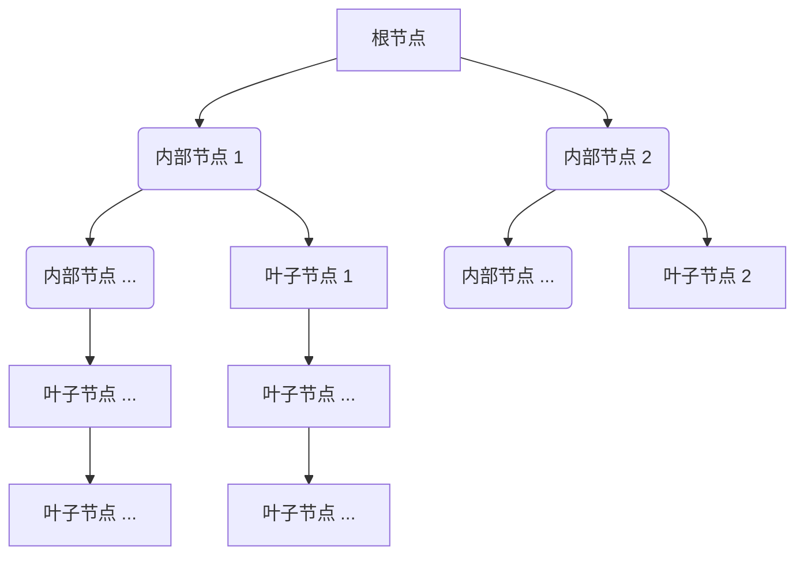
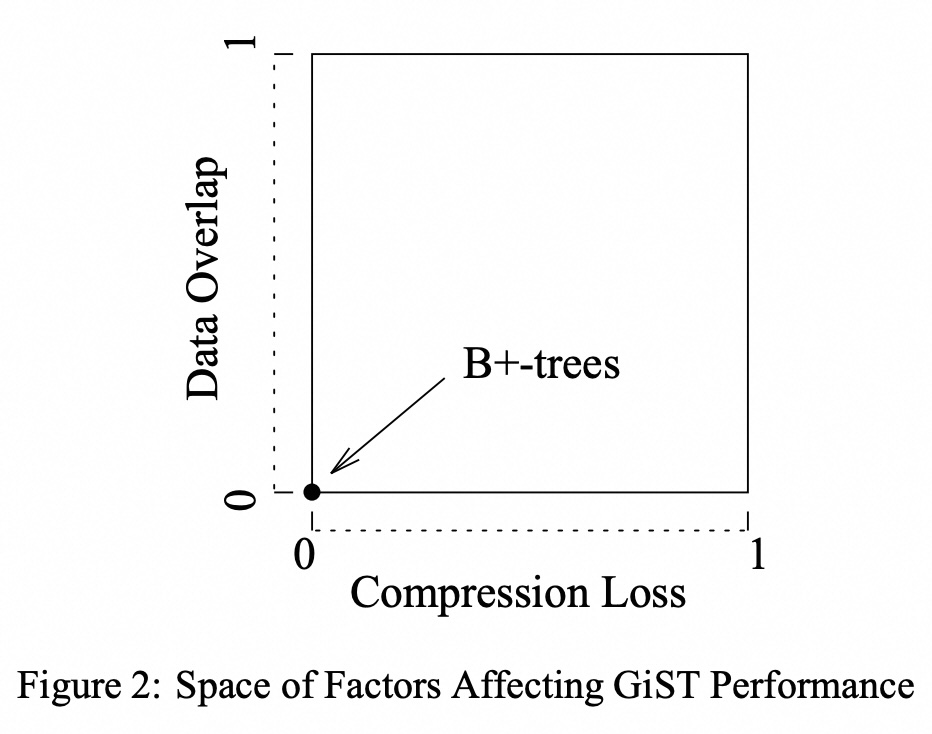
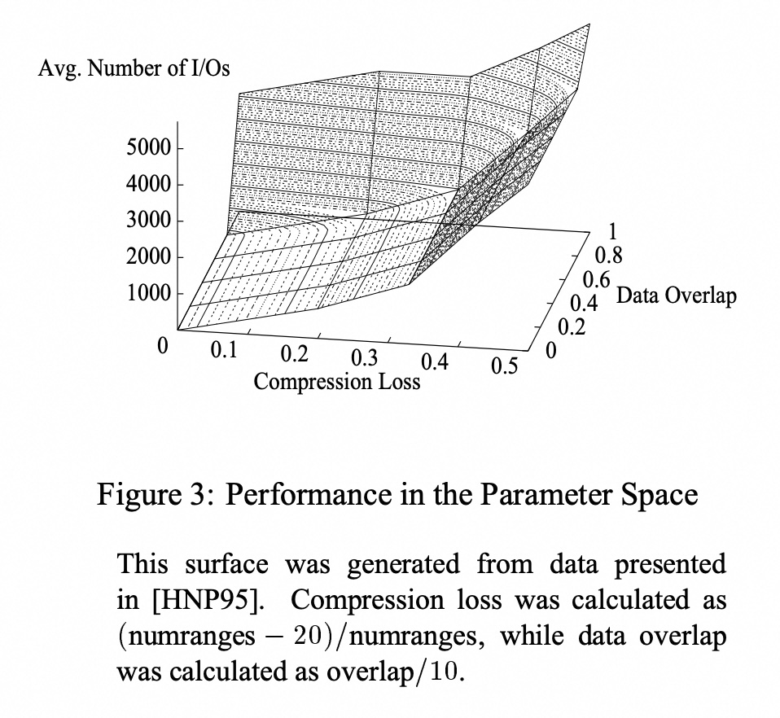

## AI论文解读 | Generalized Search Trees for Database Systems
        
### 作者        
digoal        
        
### 日期        
2025-09-04       
        
### 标签        
PostgreSQL , PolarDB , DuckDB , AI , 论文解读        
        
----        
        
## 背景  
      
https://dsf.berkeley.edu/papers/vldb95-gist.pdf        
  
提示:          
```          
读懂《Generalized Search Trees for Database Systems》这篇论文需要提前掌握哪些基础知识, 请使用中文通熟易懂的讲解这些基础知识, 可以引用论文中的图、表或使用Markdown支持的图形(text,mermaid等)增加解释性. 
  
使用中文通熟易懂的解读《Generalized Search Trees for Database Systems》这篇论文, 其中的关键内容请着重讲解, 可以引用论文中的图、表或使用Markdown支持的图形(text,mermaid等)增加解释性. 
  
提取《Generalized Search Trees for Database Systems》这篇论文中的重要术语, 使用中文对这些术语进行通熟易懂的讲解, 可以引用论文中的图、表或使用Markdown支持的图形(text,mermaid等)增加解释性. 
```     
  
## 1 前置知识 
  
要读懂《Generalized Search Trees for Database Systems》这篇论文，您需要提前掌握以下几个核心基础知识。这篇论文的核心思想是将现有的数据库索引结构（如B+树和R树）进行通用化，从而支持任意数据类型和查询方式。

-----

### 1\. 数据库索引的基本概念

首先，您需要理解数据库索引的本质：它是一种用于提高数据检索速度的数据结构。如果没有索引，数据库在查找数据时需要全表扫描，就像在没有目录的书里一页一页翻找内容一样。而索引就像书的目录，能帮助您快速定位到想要的内容。

-----

### 2\. B+树（B+-trees）

B+树是传统关系型数据库中最常用的索引结构 。要理解GiST，必须先理解B+树的工作原理。

  * **结构**：B+树是一种平衡树，它的所有数据都存储在叶子节点上，并且叶子节点通过一个链表连接起来，方便进行范围扫描。内部节点只存储索引键（key）和指向子节点的指针 。
  * **用途**：B+树主要用于一维数据的索引，例如整数、字符串等，它支持等值查询（`=`）和范围查询（`>`、`<`、`BETWEEN`）。
  * **搜索逻辑**：当您在B+树中进行范围查询时，它会从根节点开始，沿着一条路径下降到最左侧满足条件的叶子节点，然后通过叶子节点的链表向右遍历，直到找到所有满足条件的记录 。

-----

### 3\. R树（R-trees）

R树是一种专门用于多维空间数据的索引结构，例如地理信息系统中的点、线和多边形 。

  * **结构**：与B+树类似，R树也是一棵平衡树。它的内部节点存储的是“**最小边界框（MBR）**”，这个边界框包含了其所有子节点所代表的数据对象的最小矩形区域 。
  * **搜索逻辑**：当您在R树中查询一个区域时，它会检查查询区域是否与节点中的最小边界框重叠。只要存在重叠，就遍历该子树，直到找到所有匹配的数据 。
  * **核心差异**：与B+树不同，R树的节点边界框可以相互重叠 。这意味着一个查询可能需要同时遍历多个子树才能找到结果，这是R树比B+树更复杂的原因之一。

### 4\. 抽象数据类型（ADT）和面向对象编程

GiST被定义为一个抽象数据类型（ADT）或“对象”。理解面向对象编程中的**封装**概念非常重要，因为GiST的通用性正是通过**将核心逻辑与具体数据类型解耦**来实现的。

这篇论文的核心贡献在于，它将所有搜索树的通用操作封装在GiST的核心算法中，而将与特定数据类型相关的逻辑抽象为一组用户必须实现的方法 。

-----

### 5\. GiST的核心：六个可扩展方法

这篇论文最重要的部分是它定义的六个可扩展方法。这六个方法构成了GiST的“**策略**”，决定了索引的行为。通过为这六个方法提供不同的实现，GiST就可以模拟出B+树、R树或其他任何自定义的索引结构 。

以下是这六个方法的通俗解释（所有方法都需要用户自己实现）：

1.  **Consistent(E, q)**：**一致性检查**。给定一个索引项E（包含谓词p）和一个查询q，该方法返回一个布尔值，表明q与p是否“一致”。简单来说，就是判断查询是否可能在当前索引项所指向的子树中找到匹配的数据 。这是搜索算法的基础。
2.  **Union(P)**：**聚合**。给定一组索引项，返回一个**新的谓词**，该谓词能“包含”或“描述”这组索引项所指向的所有数据 。例如，在B+树中，Union操作会返回一个包含所有数值的最小范围；在R树中，它会返回一个包含所有几何对象的最小边界框。
3.  **Compress(E)**：**压缩**。对索引项E中的谓词进行压缩 。例如，在B+树中，可以只存储每个范围的起始值，而省略结束值。
4.  **Decompress(E)**：**解压缩**。将压缩后的谓词恢复成可用的谓词 。
5.  **Penalty(E1, E2)**：**惩罚**。该方法用于帮助插入算法决定将新的索引项E2插入到哪个子树E1下最合适 。它返回一个衡量“不好”程度的惩罚值。例如，在R树中，惩罚值可以是最小边界框面积的增加量 。
6.  **PickSplit(P)**：**分裂**。当一个节点满时，该方法将节点中的所有索引项（包括新插入的）分割成两组 。理想的分裂策略是使得两组数据的Union聚合后，其“惩罚值”最小 。

-----

### 总结

您只需将GiST想象成一个高度可定制的索引引擎。它提供了树形结构的基本框架和核心算法（如搜索、插入），而把与数据类型和查询相关的具体逻辑（那六个方法）留给了用户。因此，要读懂这篇论文，您最需要掌握的是**B+树和R树的结构与工作原理**，以及**如何将这些原理抽象为GiST的六个可扩展方法**。

下图是论文中对数据库搜索树的通用示意图 ，它形象地展示了GiST的通用性：

  * **内部节点（目录）**：包含索引键和指向子节点的指针。
  * **叶子节点（链表）**：包含指向实际数据的指针，并连接成一个链表方便扫描。



  
## 2 解读论文 
  
好的，我们来通俗易懂地解读一下这篇经典的数据库领域论文——《Generalized Search Trees for Database Systems》。

这篇论文的核心思想是：我们不需要为每一种新的数据类型（比如地理信息、集合、指纹等）都从零开始发明一种全新的索引结构。我们可以提炼出所有搜索树（如B+树、R树等）的“共同骨架”，然后把那些针对特定数据类型的“特殊逻辑”做成可插拔的模块。这个“共同骨架”就是论文提出的**通用搜索树（Generalized Search Tree, 简称 GiST）**。

-----

### 1\. 问题的根源：为什么需要 GiST？

在 GiST 出现之前，数据库索引领域有点像“一个萝卜一个坑” 。

  * 要给普通的数字、字符串排序和范围查找，我们用 **B+树** 。但它只能处理有线性顺序的数据 。
  * 要给地图上的点、线、面做空间查询（比如“查找附近500米内的所有餐厅”），我们用 **R树** 。但它也只擅长处理空间“包含”、“重叠”这类查询 。

随着数据库要存储的数据类型越来越五花八门（例如指纹、基因序列、文档集合等），为每一种都重新设计、实现和维护一套新的索引结构，工作量巨大且毫无必要 。

GiST 的目标就是解决这个问题：提供一个统一的、可扩展的索引框架，用一套代码库，就能支持像B+树、R树等各种索引，并且还能轻松创造出新的索引类型 。

### 2\. 核心思想：GiST 的“万能钥匙”

GiST 认为，所有搜索树的本质都是一样的：**它是一个关于数据集的分层划分结构** 。

想象一下，一个大城市的行政区划图：

  * 根节点是“整个城市”。
  * 下一层节点是各个“区”。
  * 再下一层是各个“街道”。
  * 叶子节点是具体的“门牌号”（指向实际数据）。

在这个结构中，每个非叶子节点（如“区”）都会有一个“钥匙”，这个“钥匙”描述了它所管辖的范围。比如，一个区的“钥匙”就是这个区的地理边界。当你找一个地址时，你会先看它属于哪个区（与区的“钥匙”进行匹配），然后再到那个区里去找对应的街道，层层递进。

GiST 的精髓在于，它把这个“钥匙”的概念进行了通用化和抽象化。在 GiST 中，**一个“钥匙”不再是简单的数值或边界框，而是一个可以返回“真”或“假”的任意“谓词（Predicate）”** 。

  * 在 B+树里，一个节点的钥匙可以是一个谓词，如 `“数值 v 满足 100 ≤ v < 200”`。
  * 在 R树里，一个节点的钥匙可以是 `“多边形 v 与此矩形框重叠”` 。
  * 在为“学生选课”数据设计的索引里，一个钥匙甚至可以是 `“学生 v 的已选课程包含 {‘数据库’, ‘操作系统’}”`。

通过将“钥匙”抽象为谓词，GiST 成功地将所有搜索树的核心逻辑统一起来。

### 3\. GiST 的“六大心法”：实现扩展性的关键

GiST 框架本身提供了树的搜索、插入、删除、节点分裂等通用算法 。用户如果想让 GiST 支持一种新的数据类型和查询，只需要实现以下六个核心方法（函数），告诉 GiST 如何处理你自定义的“钥匙”（谓词）即可 。

| 方法名 | 通俗解释 | 举例 (以R树的矩形范围为例) |
| :--- | :--- | :--- |
| `Consistent(E, q)` | 判断查询 `q` 和节点 `E` 的范围是否 **“有交集”** 。如果有，才需要继续搜索这个分支。这是搜索效率的关键 。 | 查询一个点 `q`，节点范围 `E` 是个大矩形。如果点 `q` 在大矩形 `E` 内部，就返回“真”，否则返回“假”。 |
| `Union(P)` | 当一个节点分裂，或子节点范围变化时，需要更新父节点的范围。此方法就是将一系列子节点的范围 `P` **合并成一个更大的范围** 。 | 把一堆小矩形合并成一个能把它们全都包住的最小大矩形。 |
| `Compress(E)` | 将一个“钥匙”`E` **压缩**以节省存储空间。这是一种性能优化 。 | 原始数据可能是一个复杂的多边形，我们把它压缩成一个简单的“最小外接矩形”来存储。 |
| `Decompress(E)` | 将压缩后的钥匙 `E` **解压**回原来的形式，以便进行运算 。 | 将“最小外接矩形”直接作为谓词使用（因为原始多边形一定在矩形内），解压函数可以是原样返回。 |
| `Penalty(E1, E2)` | 当要插入一个新数据 `E2` 时，衡量把它放进哪个已存在的节点 `E1` “代价”最小。通常代价是指 `E1` 的范围需要扩大多少 。 | 把一个新矩形 `E2` 放进节点 `E1`，计算 `E1` 的外接矩形需要增大的面积。选择面积增加最小的那个分支插入。 |
| `PickSplit(P)` | 当一个节点 `P`（包含M+1个条目）满了之后，定义如何将它“一分为二”。分裂的好坏直接影响后续的查询性能 。 | 将 M+1 个矩形分成两组，目标是让分裂后的两个新矩形的面积之和最小，且重叠面积也最小。 |

只要实现了这六个方法，你就能把 GiST “变身”成你想要的任何一种搜索树，而无需关心并发控制、恢复、页面管理等复杂的底层细节 。

### 4\. 实战演练：GiST 如何“变身”？

论文展示了 GiST 如何通过实现不同的“六大心法”来模拟三种索引：

1.  **变身 B+树** ：

      * **钥匙**: `[min, max)` 这样左闭右开的数值区间。
      * **Consistent**: 判断查询的数值或范围是否与节点的区间重叠。
      * **Union**: 将多个子区间合并成一个能包含它们的最小区间。
      * **Penalty**: 新插入一个值，计算哪个区间需要扩张得最少（理想情况是无需扩张）。

2.  **变身 R-树** ：

      * **钥匙**: `(x_min, y_min, x_max, y_max)` 这样的矩形边界框。
      * **Consistent**: 判断查询的区域是否与节点的边界框重叠 。
      * **Union**: 计算能包含所有子边界框的最小边界框 。
      * **Penalty**: 计算插入新区域后，父节点的边界框面积会增加多少 。

3.  **创造 RD-树 (套娃树)** ：

      * 这是一个全新的索引，用于索引**集合类型**的数据（比如，学生选了哪些课）。
      * **钥匙**: 一个集合（比如 `{'数据库', 'OS', '网络'}`）。
      * **父节点的钥匙**是其所有**子节点钥匙的并集** 。就像俄罗斯套娃一样，外层的集合“包含”内层的集合 。
      * **查询**: 可以支持“查找选了课程A和课程B的所有学生”（集合包含查询）或“查找选了课程C的学生”（集合重叠查询）。

### 5\. 性能的关键：什么决定了 GiST 的效率？

对于 B+树这类“钥匙”范围互不重叠的索引，查询性能稳定在 $O(log N)$ 。但对于 R树或 GiST 这类“钥匙”范围可能重叠的索引，性能好坏就不一定了，因为一次查询可能需要探索树的多个分支 。

论文指出了影响 GiST 性能的两个关键因素，并用下图（论文中的图2）清晰地展示了出来：   

  * **X轴 - 压缩损失 (Compression Loss)** : 指的是 `Compress` 方法为了节省空间而造成的信息损失。比如，用一个很大的矩形（压缩后的钥匙）去代表一个很小的、不规则的多边形（原始数据）。压缩损失越大，钥匙代表的范围就越不精确，查询时就可能访问很多不必要的分支 。
  * **Y轴 - 数据重叠 (Data Overlap)** : 指的是数据对象本身在逻辑上的重叠程度。比如，一个城市地图上，如果所有餐厅都集中在一个很小的区域，那么代表它们的边界框就会严重重叠，导致索引效率下降 。

**理想的性能点在左下角的原点 (0,0)** 。一个在无重复数据上建立的 B+树就处于这个位置，因为它的数据无重叠，钥匙也无压缩损失，所以性能极好 。当数据本身的重叠度很高，或者为了存储而使用的“钥匙”谓词过于粗糙（压缩损失大），索引的性能就会向右上角移动，逐渐退化，最终可能还不如全表扫描 。

论文通过在 RD-树上的实验（论文中的图3）验证了这一点，结果显示，无论是增加数据重叠还是增加压缩损失，查询所需的 I/O 次数都显著上升 。   

### 总结

《Generalized Search Trees for Database Systems》是一篇具有里程碑意义的论文。它不仅仅是提出了一个新的数据结构，更是提供了一个**统一和简化索引设计**的哲学思想和工程框架。

  * **统一性**: 将 B+树、R树等多种看似不同的结构统一到一个框架下 。
  * **扩展性**: 允许开发者通过实现六个简单的方法，就能为新的数据类型和查询需求快速构建高效的索引 。
  * **深刻洞见**: 揭示了影响通用索引性能的两个核心维度（数据重叠和压缩损失），为后续的索引研究和设计提供了理论指导。

GiST 的思想影响深远，并已被集成到像 PostgreSQL 这样的主流开源数据库中，成为了其可扩展索引功能的核心基石。
  
## 3 术语 
  
《Generalized Search Trees for Database Systems》（GiST）这篇论文的核心在于其对现有数据库索引结构的通用化。为了帮助您理解这篇论文，以下是其中几个重要的术语及其通俗易懂的中文解释。

---

### 1. 广义搜索树（Generalized Search Tree, GiST）

这是论文的核心概念。您可以将 **GiST** 想象成一个高度可定制的、通用的“索引模板”。它本身不是一个具体的索引，而是一套规则和算法，允许您基于它创建各种各样的索引，比如传统的B+树或用于空间数据的R树。

论文的目标是让数据库开发者不再需要为每一种新的数据类型（如多边形、DNA序列等）从头编写索引代码，而只需实现一套特定的“策略方法”，GiST就能自动构建和维护索引。

---

### 2. 谓词（Predicate）

在论文中，**谓词** 是指用于描述树节点或索引项所包含的数据范围的条件。它比我们通常理解的数据库查询条件（如 `age > 30`）更广义。

* **通俗理解**：你可以把谓词看作是索引节点的一张“名片”。这张名片告诉我们这个节点下的所有数据都符合什么条件。
    * 在 **B+树** 中，谓词通常是数据的数值范围，例如 `(50, 100]`。
    * 在 **R树** 中，谓词是包含所有子对象的最小边界框（MBR）。

---

### 3. GiST的六个可扩展方法（The Six Extensible Methods）

这是GiST实现通用性的关键。论文将索引操作（如搜索、插入、分裂）分解为六个抽象的、必须由用户实现的方法。通过提供不同的实现，GiST可以模拟不同的索引行为。

1.  **`Consistent` 方法（一致性检查）**
    * **作用**：在查询时使用。它检查一个查询谓词（查询条件）是否与某个节点的谓词相容。
    * **通俗理解**：这就像在图书馆找书。`Consistent` 检查的作用是判断“我想找的书”是否可能在“这个书架”上。如果可能，就继续深入到这个书架去找。

2.  **`Union` 方法（聚合）**
    * **作用**：创建一个新的谓词，它能包含一组现有谓词所代表的所有数据。
    * **通俗理解**：想象你有几个不同的盒子，每个盒子上都贴着标签（谓词）说明里面装的东西。`Union` 的作用就是找一个更大的盒子，并给它贴上一个更大的标签，这个标签能涵盖所有小盒子里面的东西。在R树中，这通常是计算一个包含所有子节点的最小边界框。

3.  **`Penalty` 方法（惩罚）**
    * **作用**：在插入新数据时使用。它返回一个数值，用来衡量将新数据插入到某个节点后，这个节点的谓词会“变坏”多少。
    * **通俗理解**：当您要放一件新衣服到一个装满的行李箱里时，`Penalty` 衡量的是您需要多用力才能把它塞进去，或者说为了装下它，需要让行李箱膨胀多少。GiST的插入算法会选择“惩罚”最小的节点来放置新数据。

4.  **`PickSplit` 方法（分裂选择）**
    * **作用**：当一个节点满时，必须将其中的数据分割成两个新的节点。`PickSplit` 负责决定如何进行这种分割。
    * **通俗理解**：这就像您要将一篮子水果分成两篮。`PickSplit` 的目标是找到一种最佳的分法，使得分完后两篮水果的“乱糟糟”程度（例如，占据的空间）最小。

5.  **`Compress` 和 `Decompress` 方法（压缩与解压缩）**
    * **作用**：这两个方法用于对谓词进行压缩和解压缩，以减少存储空间。
    * **通俗理解**：`Compress` 就像是给文件打包，`Decompress` 则是解压。这使得索引节点可以存储更多的谓词信息，从而提高效率。

---

### 4. B+树和R树的统一

论文的一个重要成果是证明了GiST可以**统一**B+树和R树。

* **B+树**：当您用 GiST 实现 B+树时，**谓词** 可以是数据的数值范围，`Union` 操作是计算数值的并集，`Penalty` 衡量范围增大的幅度。
* **R树**：当您用 GiST 实现 R树时，**谓词** 是最小边界框（MBR），`Union` 操作是计算所有子边界框的并集，`Penalty` 衡量边界框面积增大的幅度。

通过这种方式，论文证明了 GiST 的框架足以概括和统一这些看似截然不同的索引结构。

---

### 5. RD-Tree

**RD-Tree** 是论文中用来展示GiST可扩展性的一个新索引结构。它是一种用于索引具有“集合值”属性（如文档中的关键词集）的数据的树。这个例子证明了 GiST 能够轻松扩展到新的、非传统的数据类型和查询模式。
  
## 参考        
         
https://dsf.berkeley.edu/papers/vldb95-gist.pdf    
        
<b> 以上内容基于DeepSeek、Qwen、Gemini及诸多AI生成, 轻微人工调整, 感谢杭州深度求索人工智能、阿里云、Google等公司. </b>        
        
<b> AI 生成的内容请自行辨别正确性, 当然也多了些许踩坑的乐趣, 毕竟冒险是每个男人的天性.  </b>        
    
#### [期望 PostgreSQL|开源PolarDB 增加什么功能?](https://github.com/digoal/blog/issues/76 "269ac3d1c492e938c0191101c7238216")
  
  
#### [PolarDB 开源数据库](https://openpolardb.com/home "57258f76c37864c6e6d23383d05714ea")
  
  
#### [PolarDB 学习图谱](https://www.aliyun.com/database/openpolardb/activity "8642f60e04ed0c814bf9cb9677976bd4")
  
  
#### [PostgreSQL 解决方案集合](../201706/20170601_02.md "40cff096e9ed7122c512b35d8561d9c8")
  
  
#### [德哥 / digoal's Github - 公益是一辈子的事.](https://github.com/digoal/blog/blob/master/README.md "22709685feb7cab07d30f30387f0a9ae")
  
  
#### [About 德哥](https://github.com/digoal/blog/blob/master/me/readme.md "a37735981e7704886ffd590565582dd0")
  
  

  
