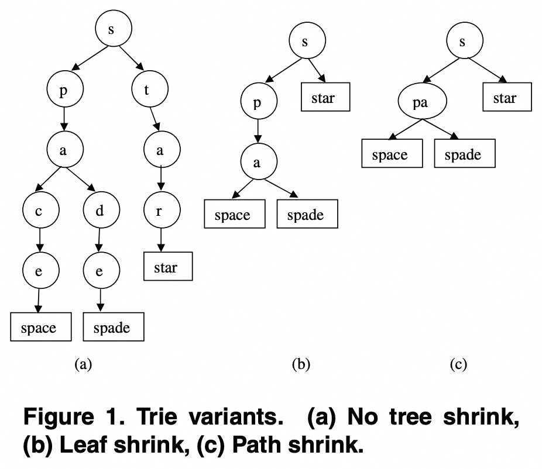
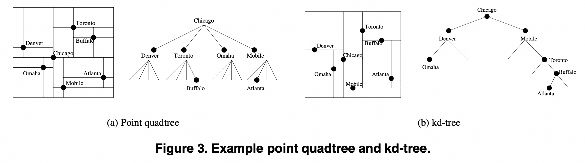
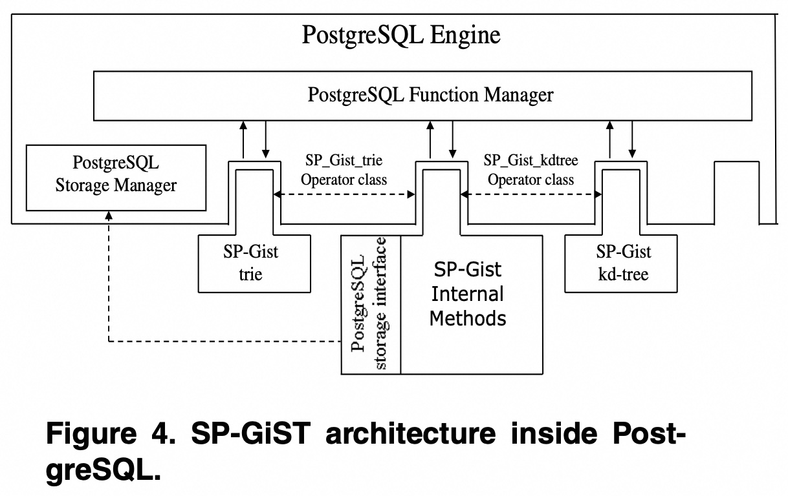
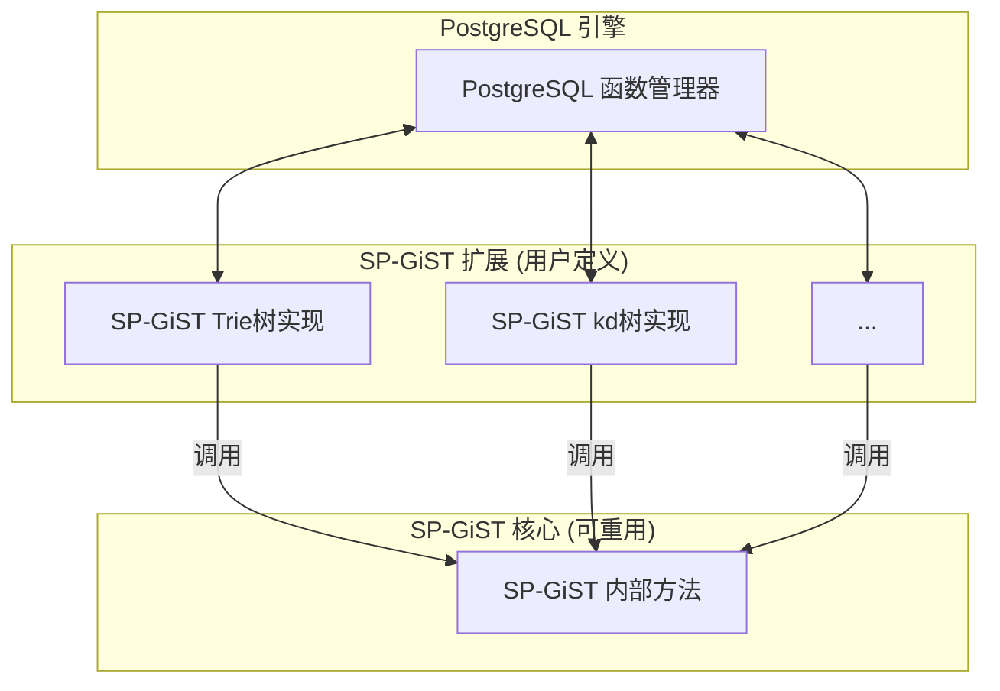

## AI论文解读 | Space-Partitioning Trees in PostgreSQL: Realization and Performance
        
### 作者        
digoal        
        
### 日期        
2025-09-04       
        
### 标签        
PostgreSQL , PolarDB , DuckDB , AI , 论文解读        
        
----        
        
## 背景  
      
https://www.researchgate.net/publication/220967109_Space-Partitioning_Trees_in_PostgreSQL_Realization_and_Performance        
  
提示:          
```          
读懂《Space-Partitioning Trees in PostgreSQL: Realization and Performance》这篇论文需要提前掌握哪些基础知识, 请使用中文通熟易懂的讲解这些基础知识, 可以引用论文中的图、表或使用Markdown支持的图形(text,mermaid等)增加解释性. 
  
使用中文通熟易懂的解读《Space-Partitioning Trees in PostgreSQL: Realization and Performance》这篇论文, 其中的关键内容请着重讲解, 可以引用论文中的图、表或使用Markdown支持的图形(text,mermaid等)增加解释性. 
  
提取《Space-Partitioning Trees in PostgreSQL: Realization and Performance》这篇论文中的重要术语, 使用中文对这些术语进行通熟易懂的讲解, 可以引用论文中的图、表或使用Markdown支持的图形(text,mermaid等)增加解释性. 
```     
  
## 1 前置知识 
  
《Space-Partitioning Trees in PostgreSQL: Realization and Performance》这篇论文主要探讨了如何在 PostgreSQL 数据库中实现和优化**空间分区树（Space-Partitioning Trees）**这种特殊类型的索引，并通过实验验证了其性能。为了更好地理解这篇论文，您需要提前掌握以下几个核心基础知识：

---

### 1. 数据库索引（Database Indexing）
首先，您需要理解什么是数据库索引。简单来说，索引就像一本书的目录，它能帮助数据库系统快速找到所需的数据，而不需要从头到尾扫描整张表。如果没有索引，查询数据就像在没有目录的书里找某一页内容，效率会非常低。

这篇论文中提到了几种常见的索引类型，它们都是为了解决不同类型的数据查询问题而设计的：
* **B+-tree（B+ 树）**：这是最常见的数据库索引类型，特别适用于处理有序数据，比如字符串、数字等。它擅长处理等于（`=`）、大于（`>`）、小于（`<`）等查询。论文将它作为对比基准，用来衡量新索引的性能 。
* **R-tree（R 树）**：这是一种专门用于处理多维空间数据的索引，比如地理坐标（经纬度）、图形对象等。它擅长处理范围查询（比如“找到地图上某个区域内的所有餐馆”）。

### 2. 空间分区树（Space-Partitioning Trees）
这是论文的核心概念。与 B+-tree 这种线性数据结构不同，空间分区树通过将多维空间划分为互不重叠的子区域来组织数据 。这使得它非常适合索引多维数据，例如：
* **Trie（字典树）**：一种用于字符串的树形结构。它通过共享字符串前缀来节省存储空间。论文中提到了它的变体，并将其用于处理字符串数据集 。
    * **路径压缩（Path Shrinking）**：Trie 树的一个变体，通过合并只有一个子节点的长路径来减少树的深度，从而提高效率。论文中的图1展示了三种不同的路径压缩方式（不压缩、叶子节点压缩、路径压缩）。   
* **Quadtree（四叉树）**：一种将二维空间递归地划分为四个象限的树形数据结构。常用于对二维点或区域数据进行索引。论文中的图3(a)展示了一个点四叉树的例子 。   
* **k-d-tree（k-d 树）**：一种将 k 维空间递归地沿坐标轴切分成两个半空间的树形结构。论文将其用于索引二维点数据 。论文中的图3(b)展示了一个 k-d 树的例子 。

空间分区树的划分方式有两种：
* **空间驱动（Space-driven）**：根据空间本身进行划分，与数据分布无关 。
* **数据驱动（Data-driven）**：根据数据分布进行划分 。

### 3. 可扩展索引框架（Extensible Indexing Frameworks）
这是一类用于快速创建和集成新型索引的软件工程框架 。论文中提到了两种：
* **GiST（Generalized Search Trees）**：用于支持 B+-tree 等平衡树结构的通用框架 。
* **SP-GiST（Space-Partitioning Generalized Search Trees）**：这篇论文的重点，是一个专门用于空间分区树的通用框架。它将索引结构分为两部分：
    * **内部方法（Internal Methods）**：由框架本身提供的通用功能，比如通用的插入、搜索、删除算法。这些方法对所有基于 SP-GiST 的索引都是通用的 。
    * **外部方法（External Methods）**：需要开发者根据具体的索引类型（比如 Trie、k-d 树）来实现的特定功能，例如如何进行空间划分（`PickSplit`）和如何遍历树（`Consistent`）。

SP-GiST 的优势在于，开发者只需要实现这些相对简单的外部方法，就可以快速地在 PostgreSQL 中创建一种新的索引类型，而无需从头编写所有代码或重新编译 PostgreSQL 引擎 。这大大降低了开发成本。

### 4. PostgreSQL 扩展机制（PostgreSQL Extensibility）
PostgreSQL 是一个高度可扩展的数据库系统。论文中提到的 SP-GiST 正是利用了它的可扩展特性。了解这些特性有助于您理解论文中关于实现的部分（第4节）：
* **系统目录表（System Catalog Tables）**：PostgreSQL 将数据类型、操作符和访问方法等信息存储在系统目录表中。通过在 `pg_am` 表中插入一条新记录，SP-GiST 就被注册为 PostgreSQL 的一个新的“访问方法” 。
* **操作符类（Operator Classes）**：操作符类将索引访问方法与特定的数据类型和操作符关联起来 。这使得您可以为不同的数据类型（如字符串、点）定义不同的索引行为 。

希望这些基础知识能帮助您更好地阅读和理解这篇论文。如果您对其中的任何一个概念有进一步的疑问，请随时提出。
  
## 2 解读论文 
  
好的，我们来通俗易懂地解读一下《PostgreSQL中的空间分区树：实现与性能》这篇学术论文。

这篇论文的核心思想是：**在著名的开源数据库PostgreSQL中，引入一种名为“空间分区树”的新型索引框架（SP-GiST），使得数据库不仅能高效处理传统数据，还能轻松支持和加速对更复杂数据类型（如字符串、地理空间点、线段）的查询。**

-----

### **1. 问题背景：为什么需要新的索引？**

我们知道，数据库索引是提升查询速度的关键。传统的数据库主要使用 **B+树** 和 **哈希表** 这两种索引。

  * **B+树**：非常适合处理“范围查询”（比如，查找所有年龄在20到30岁之间的用户）。
  * **哈希表**：非常适合处理“等值查询”（比如，通过用户ID精确查找某个用户）。

然而，随着应用的发展，数据库需要处理越来越多样化的数据，例如：

  * **字符串数据**：进行前缀匹配（如`'abc%'`）、模糊匹配（如`'a?c'`）。
  * **地理空间数据**：查找一个点、一个区域内的所有目标。
  * **多维数据**：同时根据多个属性进行筛选。

在这些场景下，传统的B+树和哈希表就显得力不从心了。数据库开发者们意识到，需要一种更灵活、更通用的索引框架来应对这些挑战。

-----

### **2. 解决方案：GiST 与 SP-GiST 框架**

为了解决这个问题，学术界提出了“通用搜索树”（Generalized Search Trees）的概念，这是一种可扩展的索引框架。开发者只需定义少量与特定数据类型相关的规则，就能快速构建出一种新的高性能索引，而无需从头编写所有复杂的数据库底层代码。

这篇论文重点关注两种框架：

  * **GiST (Generalized Search Tree)**：它主要支持**平衡树**结构，比如著名的**R树**（常用于地理空间索引），可以看作是B+树的扩展。
  * **SP-GiST (Space-Partitioning Generalized Search Tree)**：这是本文的主角，它支持的是另一大类索引——**空间分区树**。

#### **什么是空间分区树？**

空间分区树的核心思想是**不断地将整个数据空间递归地分割成更小的、互不重叠的区域**。常见的空间分区树包括：

  * **Trie树（字典树）**：非常适合处理字符串。例如，通过树的路径来表示字符串的前缀。
  * **kd树**：常用于多维空间数据索引，它轮流沿着不同维度对数据进行切分。
  * **四叉树（Quadtree）**：常用于二维空间数据，每次将一个区域切分成四个象限。

**一个形象的比喻**：
想象一下你在管理一个大图书馆的图书。

  * **B+树** 就像是按照书的ISBN号排序，找一个范围内的书很方便。
  * **SP-GiST** 则像是按照图书分类法（如中图法）来组织书架。先分出“A-马列主义”、“B-哲学”等大类，然后在“B”类下再分出“B0-哲学理论”、“B1-世界哲学”等子类，不断细分。这种结构天然适合进行层层递进的查找。

-----

### **3. 论文的核心贡献：在PostgreSQL中实现SP-GiST**

这篇论文的主要工作，就是首次系统性地将SP-GiST框架在PostgreSQL数据库中实现出来，并验证了其性能。

#### **3.1 实现方法：可插拔、免编译**

作者们实现SP-GiST时，充分利用了PostgreSQL强大的扩展性。他们没有去修改数据库的内核代码，而是通过定义新的“访问方法”、“操作符”和“操作符类”，将SP-GiST实现为一个**动态加载的模块** 。

这意味着：

  * **可移植性强**：用户或开发者可以像安装插件一样，将SP-GiST功能添加到现有的PostgreSQL数据库中，而无需重新编译整个数据库 。
  * **易于扩展**：基于SP-GiST框架，开发者只需要编写少量（约占总代码量的10% ）与特定数据结构相关的“外部方法”（如如何分裂节点、如何判断查询条件），就能快速创建出一种全新的索引类型，如Trie树索引、kd树索引等。

下面的架构图（源自论文图4）清晰地展示了这种模块化的设计：   



> **图解**：PostgreSQL的引擎通过函数管理器统一调度。当用户创建一个Trie树索引时，管理器会调用Trie树的特定实现代码（用户扩展部分）。而这些特定代码内部，又会调用SP-GiST框架提供的通用核心功能（如插入、搜索算法）。

#### **3.2 性能对比实验**

论文的另一大亮点是通过大量实验，将基于SP-GiST实现的新索引与PostgreSQL中已有的B+树和R-树进行了性能对比。

##### **实验一：Trie树 vs B+树 (处理字符串数据)**

  * **精确匹配查询 (如 `name = 'random'`)**

      * **结果**：Trie树的查询速度比B+树快了超过**150%** 。随着数据量的增大，Trie树的优势更加明显。
      * **原因**：Trie树的结构使得查找路径的长度取决于字符串的长度，而不是总数据量的大小，因此更稳定高效。

  * **前缀匹配查询 (如 `name LIKE 'abc%'`)**

      * **结果**：B+树表现更好 。
      * **原因**：B+树的叶子节点是按键值有序存储的，对于前缀查询，它可以快速定位到起始点，然后顺序读取所有匹配项，效率非常高。

  * **正则表达式/模糊查询 (如 `name ?= 'r?nd?m'`)**

      * **结果**：Trie树取得了压倒性胜利，性能比B+树高出**两个数量级**（即100倍以上）。
      * **原因**：B+树对查询字符串开头的通配符（如`_andom`）非常敏感，一旦前缀不确定，索引就可能失效，退化为全表扫描 。而Trie树可以充分利用字符串中任何位置的非通配符字符来缩小搜索范围，表现得更加稳健和高效 。

##### **实验二：kd树 vs R-树 (处理二维点数据)**

  * **点查询 (精确查找一个坐标点)**

      * **结果**：kd树的性能比R-树高出 **300%** 以上 。
      * **原因**：kd树采用严格的空间分割，区域不重叠，这使得在查找特定点时路径非常明确，避免了R-树可能需要搜索多个重叠子树的问题。

  * **范围查询 (查找一个矩形区域内的所有点)**

      * **结果**：kd树依然有优势，性能增益约为**125%** 。

  * **插入性能和索引大小**

      * **结果**：R-树在插入时间和空间占用上表现更优 。
      * **原因**：论文中实现的kd树是二叉树，每次插入都可能导致节点分裂，从而产生大量的小节点。这不仅增加了插入开销，也降低了磁盘页的利用率，导致索引体积更大 。

##### **实验三：后缀树 (处理子串匹配)**

  * **结果**：后缀树在进行子串匹配查询时，比传统的顺序扫描快了**三个数量级**（1000倍）以上 。这是一个巨大的性能提升，因为B+树和R-树根本不支持这类查询 。

-----

### **4. 总结与意义**

这篇论文的价值可以总结为以下几点：

1.  **工程实践典范**：它成功地将一个先进的理论框架（SP-GiST）在工业级数据库系统（PostgreSQL）中实现，并证明了其可行性和巨大潜力。
2.  **展示了SP-GiST的强大能力**：
      * **快速原型开发**：开发者可以快速、低成本地为新数据类型创建高性能索引 。
      * **显著的性能优势**：在特定场景下（如字符串模糊查询、精确点查询），SP-GiST索引的表现远超传统索引。
      * **支持高级查询**：轻松实现了如最近邻（NN）搜索、子串匹配等复杂查询功能 。
3.  **指出了改进方向**：论文也坦诚地指出了SP-GiST索引在当前实现下的一些弱点，例如插入开销较大和索引体积偏大，为后续的研究指明了方向 。

总而言之，这篇论文不仅为PostgreSQL贡献了一个强大的新功能，也为整个数据库领域展示了如何通过可扩展的索引框架来应对未来多样化的数据管理挑战。今天，SP-GiST已经成为PostgreSQL的标准内置索引之一，被广泛应用于全文搜索、地理信息系统等领域。
  
## 3 术语 
  
《Space-Partitioning Trees in PostgreSQL: Realization and Performance》这篇论文的核心在于探讨如何在 PostgreSQL 中实现和优化一种特殊的索引结构——**空间分区树**。以下是论文中几个重要的术语及其通俗易懂的讲解。

-----

### 1\. 空间分区树 (Space-Partitioning Trees)

这是论文的核心概念。它是一种用于组织多维数据的树状索引结构，与传统的 B+-tree 索引不同，它不是基于数据值的大小来排序，而是通过将多维空间（如二维地图）递归地划分为更小的区域来组织数据。这种结构特别适合处理地理位置、图像等需要进行范围查询的数据。

### 2\. SP-GiST (Space-Partitioning Generalized Search Trees)

这是 PostgreSQL 数据库中一个非常重要的**可扩展索引框架**。你可以把它想象成一个“工具包”或“模板”。这个框架提供了一套通用的索引算法（例如如何遍历树、如何插入数据），开发者只需要根据特定的数据类型（比如点、线、字符串）实现几个简单的“外部方法”，就能快速地在 PostgreSQL 中创建出一种全新的空间分区树索引。这极大地简化了新索引的开发工作。

### 3\. Trie (字典树)

Trie 是一种特殊类型的空间分区树，主要用于索引字符串数据。它的特点是能通过共享字符串的前缀来节省存储空间。例如，如果你的数据集中有 "apple" 和 "application"，它们的索引路径会共享 "app" 这个部分。

  * **路径压缩 (Path Shrinking)**：为了优化 Trie 的性能，论文中提到了一种“路径压缩”的技术。当树中某条路径上的节点只有一个子节点时，可以把它们合并成一个节点，从而减少树的深度，提高查询效率。论文中的图1展示了三种不同的压缩方式。   

      * **普通 Trie (Trie)**

        ```
        root
        |
        a
        |
        p
        |
        p
        |
        l
        |
        e (leaf node)
        ```

      * **路径压缩 Trie (Path-Shrinking Trie)**

        ```
        root
        |
        apple (merged node)
        ```

    这种压缩后的结构能让搜索过程更快。

### 4\. Quadtree (四叉树)

四叉树是一种常用于处理二维空间数据（比如地图上的点）的空间分区树。它的基本思想是：从一个大的矩形区域开始，如果这个区域内的数据点数量超过某个阈值，就把它递归地划分为四个更小的象限（左上、右上、左下、右下），直到每个象限内的点数都足够少。

  * **示意图：**
    ```mermaid
    graph TD
        A[二维空间]
        A --> B[左上]
        A --> C[右上]
        A --> D[左下]
        A --> E[右下]
        B --> F[B的左上]
        B --> G[B的右上]
    ```
    这个过程会一直重复，直到所有数据点都被有效地组织起来。论文中的图3(a)展示了一个具体的四叉树例子。   

### 5\. k-d-tree (k-d 树)

k-d 树是另一种处理多维数据的空间分区树。它的划分方式是：每次只沿一个维度（比如 x 轴或 y 轴）进行切分。每次切分后，交替选择下一个维度进行切分。

  * **示意图：**
    ```mermaid
    graph TD
        A[二维空间]
        A --> B[左半区, x轴切]
        A --> C[右半区, x轴切]
        B --> D[B的上半区, y轴切]
        B --> E[B的下半区, y轴切]
    ```
    论文中的图3(b)展示了一个 k-d 树的例子。这种交替切分的方式使得 k-d 树能够有效地组织和搜索多维数据。

### 6\. B+-tree (B+ 树) 与 R-tree (R 树)

这两种是论文中用于与空间分区树进行性能对比的**传统索引**：

  * **B+-tree (B+ 树)**：最常见的数据库索引类型，擅长处理一维数据的有序查询，比如数字或字符串的相等或范围查询。
  * **R-tree (R 树)**：另一种专门用于多维空间数据的索引，但它不像空间分区树那样严格划分空间，而是使用最小边界矩形来组织数据。论文将 R-tree 和 B+-tree 作为基准，来展示 SP-GiST 实现的空间分区树在某些查询场景下的性能优势。
  
## 参考        
         
https://www.researchgate.net/publication/220967109_Space-Partitioning_Trees_in_PostgreSQL_Realization_and_Performance    
        
<b> 以上内容基于DeepSeek、Qwen、Gemini及诸多AI生成, 轻微人工调整, 感谢杭州深度求索人工智能、阿里云、Google等公司. </b>        
        
<b> AI 生成的内容请自行辨别正确性, 当然也多了些许踩坑的乐趣, 毕竟冒险是每个男人的天性.  </b>        
    
#### [期望 PostgreSQL|开源PolarDB 增加什么功能?](https://github.com/digoal/blog/issues/76 "269ac3d1c492e938c0191101c7238216")
  
  
#### [PolarDB 开源数据库](https://openpolardb.com/home "57258f76c37864c6e6d23383d05714ea")
  
  
#### [PolarDB 学习图谱](https://www.aliyun.com/database/openpolardb/activity "8642f60e04ed0c814bf9cb9677976bd4")
  
  
#### [PostgreSQL 解决方案集合](../201706/20170601_02.md "40cff096e9ed7122c512b35d8561d9c8")
  
  
#### [德哥 / digoal's Github - 公益是一辈子的事.](https://github.com/digoal/blog/blob/master/README.md "22709685feb7cab07d30f30387f0a9ae")
  
  
#### [About 德哥](https://github.com/digoal/blog/blob/master/me/readme.md "a37735981e7704886ffd590565582dd0")
  
  

  
