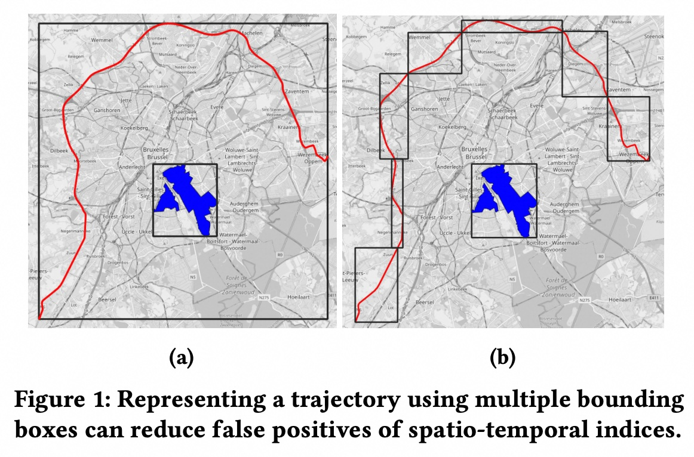
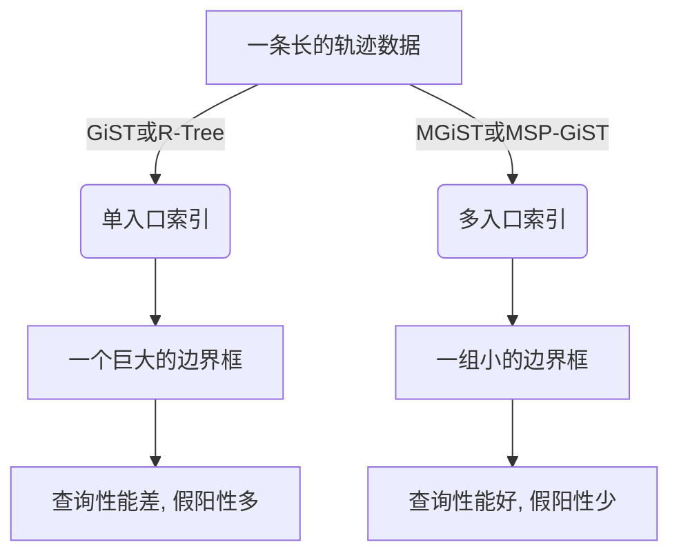
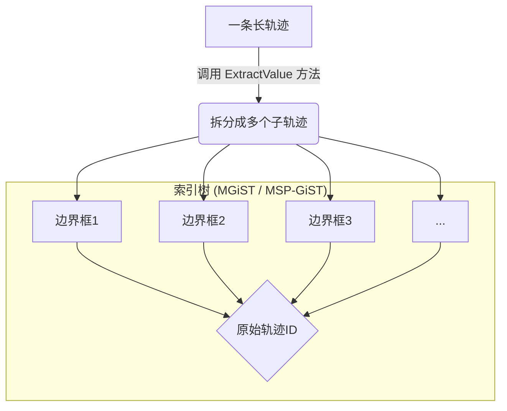
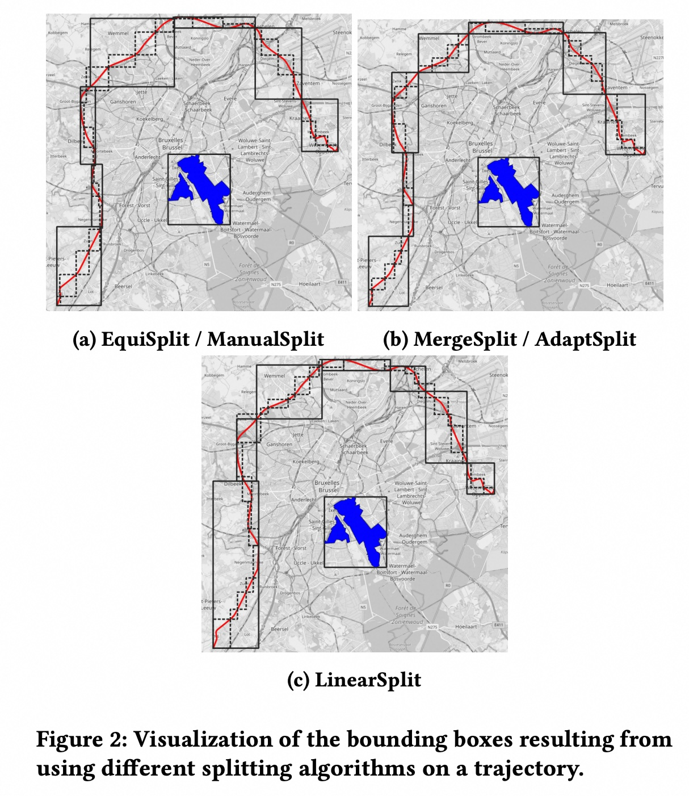
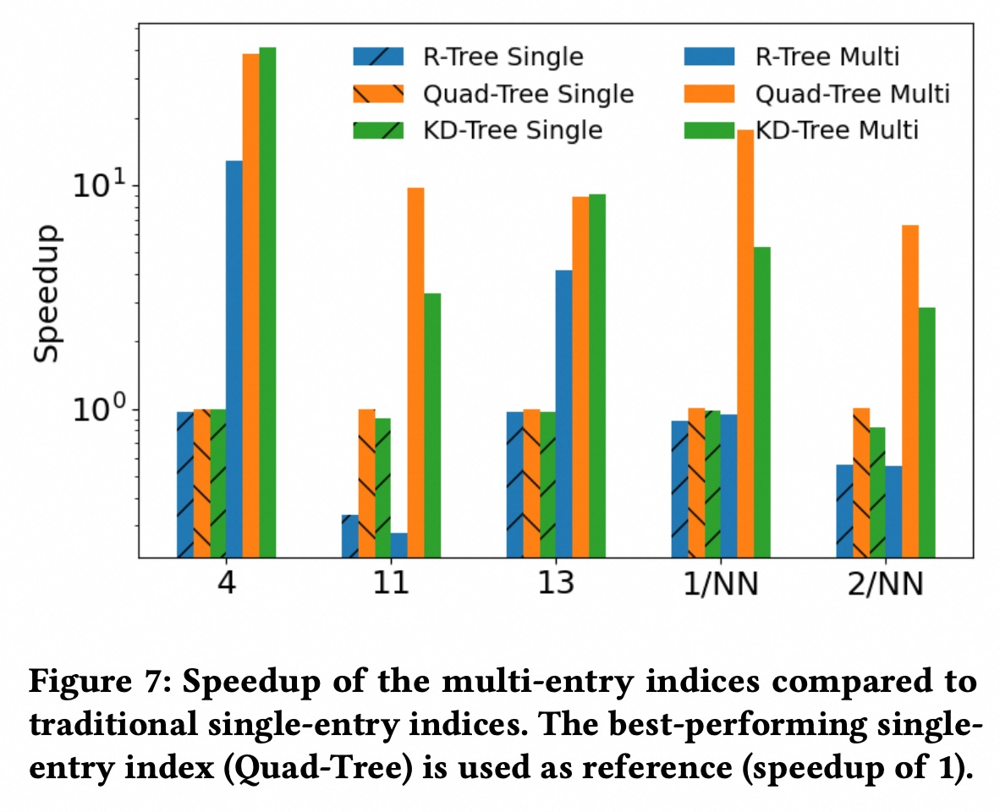
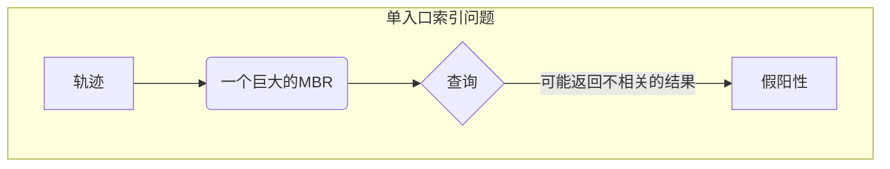

## AI论文解读 | Multi-Entry Generalized Search Trees for Indexing Trajectories
        
### 作者        
digoal        
        
### 日期        
2025-09-04       
        
### 标签        
PostgreSQL , PolarDB , DuckDB , AI , 论文解读        
        
----        
        
## 背景  
      
https://arxiv.org/pdf/2406.05327v1        
  
提示:          
```          
读懂《Multi-Entry Generalized Search Trees for Indexing Trajectories》这篇论文需要提前掌握哪些基础知识, 请使用中文通熟易懂的讲解这些基础知识, 可以引用论文中的图、表或使用Markdown支持的图形(text,mermaid等)增加解释性. 
  
使用中文通熟易懂的解读《Multi-Entry Generalized Search Trees for Indexing Trajectories》这篇论文, 其中的关键内容请着重讲解, 可以引用论文中的图、表或使用Markdown支持的图形(text,mermaid等)增加解释性. 
  
提取《Multi-Entry Generalized Search Trees for Indexing Trajectories》这篇论文中的重要术语, 使用中文对这些术语进行通熟易懂的讲解, 可以引用论文中的图、表或使用Markdown支持的图形(text,mermaid等)增加解释性. 
```     
  
## 1 前置知识 
  
《Multi-Entry Generalized Search Trees for Indexing Trajectories》这篇论文主要讨论了如何通过一种更灵活的索引结构来高效地处理复杂的移动对象轨迹数据。为了读懂这篇论文，您需要提前了解以下几个关键的数据库和索引基础知识，这些知识在论文中被多次提及。

-----

### 1\. 什么是索引（Index）

索引就像书的目录，它是一种数据结构，可以帮助数据库系统快速找到所需的数据，而无需扫描整个表。对于空间或时空数据（例如地理位置、轨迹），传统的B-Tree等索引结构并不适用，因此需要专门的索引结构。

### 2\. R-Tree

R-Tree（R树）是一种用于多维空间数据（如矩形、多边形）的索引结构。它的核心思想是用一个最小边界矩形（Minimum Bounding Rectangle, MBR）来包围一个空间对象或一组子对象。所有被包围在同一个MBR内的对象都会被索引到R-Tree的同一个节点中。

**R-Tree的局限性**：
当处理像轨迹这样又长又复杂的对象时，如果只用一个MBR来表示整条轨迹，这个MBR会变得非常大，并且会包含很多轨迹没有经过的“空”区域（见下图**图1(a)**）。这会导致索引的过滤效果很差，查询时会产生大量的“**假阳性（false positives）**”结果，即索引返回了不相关的对象，需要数据库系统进行二次过滤，从而降低查询效率 。   

### 3\. GiST (Generalized Search Tree)

GiST（广义搜索树）是一个可以用来创建各种平衡搜索树（如B+-Tree、R-Tree等）的通用框架 。它不是一种具体的树结构，而是一种软件工程解决方案，提供了一套可扩展的接口和方法，让开发者可以轻松地实现自己的索引结构 。

GiST框架要求开发者实现以下几个核心方法 ：

  * **Consistent(E, q)**：在查询时使用，判断索引项`E`的谓词（predicate）是否与查询谓词`q`一致。
  * **Union(P)**：给定一组索引项`P`，计算一个能够包含所有这些项的新谓词。对于空间数据，这通常是计算包含所有子MBR的最小边界矩形 。
  * **Penalty(E1, E2)**：计算将新项`E2`插入到以`E1`为根的子树中会产生的“惩罚”值，通常与MBR面积的增加量有关 。
  * **PickSplit(P)**：当一个节点满时，将一组索引项`P`分成两组，以创建两个新的子节点。对于空间数据，目标通常是最小化新创建的两个MBR的总面积或重叠面积 。
  * **Compress(E) & Decompress(E')**：用于存储和恢复索引项的压缩表示 。

### 4\. SP-GiST (Space-Partitioned Generalized Search Tree)

SP-GiST（空间分区广义搜索树）是GiST的另一个变体，它专门用于构建**空间分区**类的树结构，比如KD-Tree、Quad-Tree等 。与GiST主要基于MBR的“包围”思想不同，SP-GiST通过将空间递归地划分为更小的区域来进行索引 。

-----

### 5\. 单入口 vs. 多入口

传统的GiST和SP-GiST索引都遵循 **单入口（Single-Entry）** 原则，即数据库中的一个对象（例如，一条完整的轨迹）在索引中只对应一个索引条目 。

然而，这篇论文的核心贡献在于提出了 **多入口（Multi-Entry）** 的概念 。它允许将一个复杂的对象（如一条长轨迹）在插入索引前分解成多个子对象或“子轨迹”，然后将每个子轨迹作为独立的条目插入到索引中 。

**多入口的优势**：
通过将长轨迹分解成多个小段并分别用MBR表示，可以更精确地近似轨迹的形状。这使得每个MBR都更小，更贴近实际的轨迹，从而显著减少了查询时的假阳性，提高了查询性能。

**图1：单入口与多入口的区别**   

  * **图(a)**：使用一个巨大的边界框（单入口）来代表整条轨迹，这个边界框包含了大量的空白区域。当进行范围查询（图中蓝色小方框）时，索引会认为轨迹与查询区域重叠，但实际上轨迹并没有经过那里。这就是假阳性。
  * **图(b)**：将同一条轨迹分解成多个小边界框（多入口），每个边界框只代表轨迹的一小部分。这种方式能更准确地表示轨迹的路径，减少了空白区域。进行相同的查询时，索引可以更准确地判断轨迹是否与查询区域有重叠，从而减少假阳性，提高查询效率 。




### 6\. ExtractValue 方法

为了实现多入口索引，论文在GiST和SP-GiST的基础上，增加了一个新的核心方法：`ExtractValue` 。
这个方法负责将一个复杂的对象（例如一条轨迹）分解成多个索引条目（例如多个子轨迹的MBR） 。开发者可以根据不同的需求，自定义这个分解算法，例如，可以按时间、距离或形状来分割轨迹 。

### 7\. 轨迹（Trajectory）

轨迹是时空数据的一种特殊形式，它记录了物体在时间和空间中的运动路径 。论文以轨迹为例来证明多入口索引的有效性。轨迹通常由一系列带有时间戳的位置点组成，这些点之间通过线性插值连接形成轨迹段 。

掌握了这些基础知识后，您将能更好地理解论文中关于MGiST和MSP-GiST框架如何工作，以及它们如何通过多入口的方法来解决传统索引在处理长轨迹时所面临的挑战。

如果您对其中任何一个概念还有疑问，或者想了解论文中具体实现的细节，请随时告诉我。
  
## 2 解读论文 
  
好的，我们来通俗易懂地解读一下《用于索引轨迹的多入口广义搜索树》这篇论文。

### 论文核心思想概览

想象一下，你要在地图上给一条很长很曲折的公交车路线建立一个索引，方便快速查找它是否经过某个特定区域。

传统的做法是，用一个巨大的矩形框把整条路线都框起来（如下图a所示）。这样做很简单，但问题也很明显：这个框太大了，包含了大量公交车根本没经过的区域。当你查询某个区域时（比如图中的蓝色区域），索引会告诉你“可能经过”，但实际上公交车离得很远，这就是“假阳性”（False Positive）。当数据量很大时，这种“假阳性”会严重拖慢查询速度。    

*图解：(a) 使用一个大矩形框索引整条轨迹，容易产生误判。(b) 将一条轨迹拆分成多个小矩形框进行索引，定位更精确，减少误判。 (参考论文图1)*

这篇论文的核心思想就是解决这个问题。它提出了一种 **“多入口”（Multi-Entry）** 的索引机制，**允许将一个复杂的对象（比如一条长轨迹）拆分成多个小部分，为每个小部分建立独立的索引条目，但所有这些条目都指向同一个原始对象** 。就像上图(b)那样，用一串小矩形框来更精确地描述公交车路线。这样一来，索引的过滤效果大大增强，查询效率自然就高了 。

为了实现这个想法，作者们扩展了数据库中已有的两种广义索引框架——GiST和SP-GiST，提出了它们的多入口版本：**MGiST** 和 **MSP-GiST** 。

-----

### 关键内容深度解析

#### 1\. 什么是 GiST 和 SP-GiST？

在深入MGiST之前，我们先要理解它的“前辈”：

  * **GiST (Generalized Search Tree - 广义搜索树)**: 这是一个通用的索引框架，你可以把它想象成一个“索引模板” 。数据库开发者不需要从零开始写一个全新的索引结构，只需要定义几个关键的操作方法（比如如何判断两个对象是否重叠、如何合并区域等），GiST框架就能自动帮你构建、管理一个高效的平衡树索引 。比如，著名的R-Tree（用于空间数据）就可以通过GiST轻松实现 。

  * **SP-GiST (Space-Partitioned Generalized Search Tree - 空间分区广义搜索树)**: 这是GiST的补充，专门用于实现那些“非平衡”的空间分区树 。比如我们熟知的四叉树（Quad-Tree）和KD树（KD-Tree）就是这类索引 。

一个核心的限制是，**传统的GiST和SP-GiST都遵循“一个对象，一个索引入口”的原则** 。这对于处理像轨迹这样的复杂对象来说，效率不高 。

#### 2\. MGiST 和 MSP-GiST：从“一对一”到“多对一”

作者提出的MGiST和MSP-GiST打破了上述限制，实现了从“一个对象一个入口” (1-1) 到“多个入口对应一个对象” (m-1) 的转变 。

这个转变的核心在于增加了一个新的、可由用户定义的关键方法：

  * **`ExtractValue` (提取值) 方法** : 这是整个机制的灵魂。当你向数据库插入一个复杂对象（如一条轨迹）时，这个方法会被调用 。它的任务就是**决定如何将这个对象“切分”成一组更小的部分（比如多个子轨迹的边界框）** 。框架随后会将这些小部分作为独立的条目插入到底层的索引树中，但它们都带有一个指向原始轨迹的相同指针 。




*图解：`ExtractValue` 方法将一条轨迹拆分成多个边界框，每个框在索引中都是一个独立的“入口”，但它们都指向同一个原始轨迹。*

#### 3\. 如何“切分”轨迹？—— 多种拆分算法

既然“怎么切”是关键，那么论文就研究并实现了多种轨迹拆分算法，作为`ExtractValue`方法的具体实现 。这些算法各有优劣：

| 算法名称 | 拆分策略 | 优点/特点 |
| :--- | :--- | :--- |
| **EquiSplit** | 将每条轨迹固定切分成 `k` 个等长的部分 。 | 简单直接，但对不同长度的轨迹不公平。 |
| **ManualSplit** | 将轨迹按照固定的**段数** `m` 来切分，比如每100个轨迹点切成一块 。 | 逻辑与EquiSplit相反，长轨迹会被切成更多块 。 |
| **MergeSplit** | 一种优化算法，它会迭代地合并相邻的最小边界框，直到达到预设的 `k` 个框为止，目标是让最终所有框的总“体积”最小 。 | 理论上更优，但计算开销大（ $O(n \\log n)$ ） 。 |
| **AdaptSplit** | MergeSplit的变体，结合了ManualSplit的思想。先根据轨迹长度和参数 `m` 动态计算出目标框数 `k`，再应用MergeSplit算法 。 | 比MergeSplit更灵活，能适应不同长度的轨迹。 |
| **LinearSplit** | 一种启发式算法，线性扫描轨迹点，以最小化查询I/O成本为模型来决定切分点 。 | 速度快（线性时间复杂度），且考虑了查询成本 。 |

  

*图解：同一条轨迹在不同拆分算法下的结果。可以看出，不同的算法生成的边界框集合在形状和大小上存在差异。 (参考论文图2)*

#### 4\. 实验结果与性能提升

论文通过在合成数据集（BerlinMOD）和真实数据集（AIS船舶轨迹）上进行的大量实验，验证了多入口索引的有效性 。

  * **性能提升显著**：实验表明，与传统的单入口索引相比，使用MGiST和MSP-GiST实现的多入口索引在点查询、范围查询和K-最近邻（KNN）查询上，**性能提升可高达一个数量级（10倍以上）** 。

  * **索引类型对比**：

      * **多入口四叉树（Quad-Tree）** 表现最为出色和稳定，在大多数查询场景下都优于多入口R-Tree和KD-Tree 。
      * 多入口R-Tree在某些查询（特别是那些索引扫描成本占主导的简单查询）中，性能甚至会因为索引变大而下降 。

  

*图解：与表现最好的单入口索引（Quad-Tree Single，基准为1）相比，多入口索引（尤其是Quad-Tree Multi）在各类查询（4, 11, 13, 1/NN, 2/NN）中都获得了显著的速度提升。注意纵坐标是对数刻度。 (参考论文图7)*

  * **拆分算法对比**：

      * `MergeSplit` 因为对所有轨迹都切成固定数量的块，在处理长度差异大的轨迹时表现最差 。
      * `ManualSplit`, `AdaptSplit`, 和 `LinearSplit` 这三种能够根据轨迹自身特性调整拆分数量的算法，表现更好且效果相近 。

  * **并非拆得越碎越好**：实验还发现，当每条轨迹平均被拆分成5到10个边界框时，性能提升达到一个“拐点”，之后再增加拆分数量对查询速度的改善不大，但索引的存储成本会持续增加 。

-----

### 结论与价值

这篇论文的主要贡献是：

1.  **提出了MGiST和MSP-GiST框架**：将成熟的GiST/SP-GiST索引机制从“单入口”扩展到了“多入口”，为索引复杂对象提供了通用的、可扩展的解决方案 。
2.  **引入`ExtractValue`可插拔模块**：用户可以根据不同的数据类型和应用场景，自定义对象的拆分逻辑，具有很高的灵活性 。
3.  **成功应用于轨迹数据索引**：通过详实的实验证明，多入口索引能显著提升时空轨迹数据的查询性能，解决了传统方法的瓶颈 。

这项工作的意义不止于轨迹数据。论文最后也指出，任何可以被分解成更小部分的复杂数据类型，如复杂的地理多边形（例如，一个包含多个岛屿的群岛）、几何集合、甚至时间序列数据，都可以从MGiST和MSP-GiST框架中受益 。它为数据库系统如何高效处理日益复杂的现代数据提供了新的思路和强大的工具。
  
## 3 术语 
  
《Multi-Entry Generalized Search Trees for Indexing Trajectories》这篇论文提出了新的索引方法来解决轨迹数据索引的痛点。为了理解这篇论文，需要掌握以下几个关键术语：

-----

### 1\. 轨迹（Trajectory）

**轨迹**是指一个移动对象（例如汽车、行人、飞机）在一段时间内所经过的路径。它通常由一系列带有时间戳的地理坐标点组成，这些点按时间顺序连接起来，形成了运动的完整历史。

### 2\. 单入口索引（Single-Entry Indexing）

在传统的索引方法中，例如R-Tree或常规的GiST，一个数据库对象（比如一条完整的轨迹）在索引中只对应一个**单一的入口**。这意味着无论这条轨迹有多长、多复杂，它都会被一个 **最小边界矩形（Minimum Bounding Rectangle, MBR）** 所包围，并以此MBR作为一个条目插入到索引树中。

**问题：**
当轨迹很长或形状不规则时，这个单一的MBR会变得非常大，包含了大量的轨迹未经过的空白区域。这导致索引的过滤效果很差，查询时会返回许多实际上不相关的结果。这些不相关的结果就是**假阳性（False Positives）**。

如下图所示，如果用一个大的MBR来表示一条蜿蜒的轨迹，当用户查询一个很小的范围时，索引会返回这个大MBR，但轨迹本身可能完全不在查询范围内。



-----

### 3\. 多入口索引（Multi-Entry Indexing）

这是论文的核心思想。**多入口索引**打破了“一个对象只对应一个索引条目”的限制。它允许在将一个复杂的对象（如一条完整的轨迹）插入到索引中时，先将其分解成多个更小的、更简单的**子对象（或子轨迹）**。然后，将每个子对象作为一个独立的条目插入到索引中。

**优势：**
通过分解，每个子轨迹可以用一个更小、更紧凑的MBR来表示。这些更小的MBR能更精确地匹配轨迹的实际路径，从而显著减少了不必要的空白区域和查询时的假阳性，大大提高了查询性能。

-----

### 4\. GiST (Generalized Search Tree) 与 MGiST (Multi-Entry GiST)

  * **GiST (广义搜索树)**：GiST是一个通用的框架，可以用来构建各种类型的索引树。它定义了一套接口（如`Penalty`、`Union`等），开发者只需实现这些接口就可以创建自己的索引。R-Tree就是GiST的一个应用。
  * **MGiST (多入口GiST)**：这是论文提出的新框架，它在GiST的基础上进行了扩展，专门用于支持**多入口索引**。它引入了一个名为`ExtractValue`的新方法，允许开发者自定义如何将一个复杂对象分解成多个子条目。

-----

### 5\. SP-GiST (Space-Partitioned GiST) 与 MSP-GiST (Multi-Entry SP-GiST)

  * **SP-GiST (空间分区GiST)**：这是GiST的另一个变体，它通过递归地将空间划分为更小的区域来构建索引树，而不是像R-Tree那样基于MBR。例如，KD-Tree和Quad-Tree都可以用SP-GiST框架实现。
  * **MSP-GiST (多入口SP-GiST)**：与MGiST类似，这是针对SP-GiST框架的多入口扩展。它同样利用`ExtractValue`方法，来处理轨迹等复杂数据，并将其分解成更小的部分，以适应空间分区索引的结构。

### 6\. ExtractValue 方法

这是实现多入口索引的关键。`ExtractValue`是论文在GiST和SP-GiST框架上新增的一个方法。它的作用就是**将一个复杂的对象（例如一条轨迹）分解成多个独立的索引条目**。开发者可以根据不同的需求（例如按时间、按距离、或按轨迹形状的变化）来定制这个分解逻辑，从而实现最高效的索引效果。
  
## 参考        
         
https://arxiv.org/pdf/2406.05327v1    
        
<b> 以上内容基于DeepSeek、Qwen、Gemini及诸多AI生成, 轻微人工调整, 感谢杭州深度求索人工智能、阿里云、Google等公司. </b>        
        
<b> AI 生成的内容请自行辨别正确性, 当然也多了些许踩坑的乐趣, 毕竟冒险是每个男人的天性.  </b>        
    
#### [期望 PostgreSQL|开源PolarDB 增加什么功能?](https://github.com/digoal/blog/issues/76 "269ac3d1c492e938c0191101c7238216")
  
  
#### [PolarDB 开源数据库](https://openpolardb.com/home "57258f76c37864c6e6d23383d05714ea")
  
  
#### [PolarDB 学习图谱](https://www.aliyun.com/database/openpolardb/activity "8642f60e04ed0c814bf9cb9677976bd4")
  
  
#### [PostgreSQL 解决方案集合](../201706/20170601_02.md "40cff096e9ed7122c512b35d8561d9c8")
  
  
#### [德哥 / digoal's Github - 公益是一辈子的事.](https://github.com/digoal/blog/blob/master/README.md "22709685feb7cab07d30f30387f0a9ae")
  
  
#### [About 德哥](https://github.com/digoal/blog/blob/master/me/readme.md "a37735981e7704886ffd590565582dd0")
  
  

  
