## AI论文解读 | DEEP THINK WITH CONFIDENCE
        
### 作者        
digoal        
        
### 日期        
2025-09-05       
        
### 标签        
PostgreSQL , PolarDB , DuckDB , AI , 论文解读        
        
----        
        
## 背景  
      
https://arxiv.org/pdf/2508.15260        
  
提示:          
```          
读懂《DEEP THINK WITH CONFIDENCE》这篇论文需要提前掌握哪些基础知识, 请使用中文通熟易懂的讲解这些基础知识, 可以引用论文中的图、表或使用Markdown支持的图形(text,mermaid等)增加解释性. 
  
使用中文通熟易懂的解读《DEEP THINK WITH CONFIDENCE》这篇论文, 其中的关键内容请着重讲解, 可以引用论文中的图、表或使用Markdown支持的图形(text,mermaid等)增加解释性. 
  
提取《DEEP THINK WITH CONFIDENCE》这篇论文中的重要术语, 使用中文对这些术语进行通熟易懂的讲解, 可以引用论文中的图、表或使用Markdown支持的图形(text,mermaid等)增加解释性. 
```     
  
# 1 前置知识 
  
读懂《**Deep Think with Confidence**》这篇论文，需要掌握以下几个方面的基础知识。我们将用通俗易懂的中文解释这些概念，并结合论文中的图表和思想，帮助你更好地理解。

---

## 🌟 一、大模型推理的基本流程：从“单次思考”到“多路径投票”

### ✅ 基础知识1：什么是“思维链”（Chain-of-Thought, CoT）？

**通俗解释**：  
就像你做数学题时不会直接写出答案，而是先列步骤——“先算面积，再算体积”——大模型也通过生成一段“推理过程”来得出答案，这段过程就叫**思维链（CoT）**。

> 🔍 举个例子：
> 
> **问题**：小明有3个苹果，吃了1个，又买了5个，现在有几个？
> 
> **思维链**：小明最开始有3个苹果 → 吃了1个，剩下2个 → 又买了5个 → 2 + 5 = 7 → 答案是7。

这种“先推理，再回答”的方式显著提升了大模型在数学、逻辑等任务上的表现。

---

### ✅ 基础知识2：什么是“自洽性”（Self-Consistency）与“多数投票”？

**通俗解释**：  
一个人可能犯错，但多个人讨论后投票，往往更靠谱。大模型也可以“自己跟自己辩论”——**生成多个不同的推理路径（即多个CoT）**，然后看哪个答案出现最多次，就选它。

这就是所谓的 **“多数投票”（Majority Voting）**，也叫 **Self-Consistency**。

> 📊 论文中提到：
> 
> > “LLMs have shown great potential in reasoning tasks through test-time scaling methods like self-consistency with majority voting.”
> 
> 意思是：让模型多想几次，取出现最多的答案，准确率更高。

#### 🎯 举个例子：

| 推理路径 | 最终答案 |
|--------|--------|
| 路径1：3 - 1 = 2, 2 + 5 = 7 | 7 |
| 路径2：3 + 5 = 8, 8 - 1 = 7 | 7 |
| 路径3：3 - 1 = 2, 2 + 4 = 6 ❌ | 6 |

→ 出现两次“7”，一次“6” → 投票结果：**7**

---

### ✅ 基础知识3：多数投票的问题是什么？——“计算太贵，收益递减”

**问题来了**：  
虽然多路径投票能提高准确率，但每条路径都要“一个字一个字地生成”，非常耗算力（GPU时间、电费💰）。

而且，**生成越多路径，准确率提升越慢**，这就是所谓的“**收益递减**”。

> 🔍 论文指出：
> 
> > “However, this approach often leads to diminishing returns in accuracy and high computational overhead.”
> 
> 意思是：你让模型想100遍，可能只比想10遍多提升1%的准确率，但成本翻了10倍！

---

## 🌟 二、DeepConf 的核心思想：用“信心”来筛选好思路

### ✅ 基础知识4：什么是“模型内部的信心信号”？

**通俗解释**：  
模型在生成每个字的时候，其实“心里是有数的”——它知道自己下一个字有多大把握。比如：

- “3 + 5 = 8” → 模型很确定，信心高 ✅
- “3 + 5 = 7” → 模型犹豫，信心低 ❌

我们可以用 **熵（Entropy）** 或 **最大概率（Max Probability）** 来衡量这个“信心”。

> 🔍 论文定义：
> 
> > Token Entropy: $H_i = -\sum_j P_i(j) \log P_i(j)$
> 
> 熵越低，说明模型越“坚定”；熵越高，说明模型越“犹豫”。

---

### ✅ 基础知识5：什么是“局部信心” vs “全局信心”？

| 类型 | 解释 | 例子 |
|------|------|------|
| **全局信心** | 整个推理结束后，模型说：“我觉得我答对了！” | 像考试后自我感觉“这次考得不错” |
| **局部信心** | 在推理过程中，每一步都评估“这一步写得对不对” | 像边做题边检查：“这步计算没问题” |

> 🔍 论文强调：
> 
> > “DeepConf relies on a lightweight **local confidence signal** that is updated along each trajectory…”
> 
> 意思是：不要等整个推理结束才判断，而是在**过程中实时监控信心**，一旦发现“模型开始胡说八道”，就立刻停止生成，省下算力！

---

## 🌟 三、DeepConf 的两种模式：离线 vs 在线

### ✅ 基础知识6：什么是“离线模式”和“在线模式”？

我们可以把 DeepConf 的工作方式分为两种：

| 模式 | 工作方式 | 优点 | 缺点 |
|------|--------|------|------|
| **离线模式** | 先生成所有推理路径 → 再用信心筛选 → 投票 | 精度高 | 贵，全生成完才筛选 |
| **在线模式** | 边生成边看信心 → 信心太低就“掐断” | 省算力，快 | 可能误杀好路径 |

> 📈 论文图7展示了在线模式的优势： 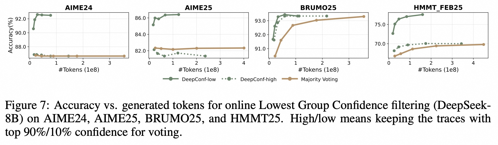  

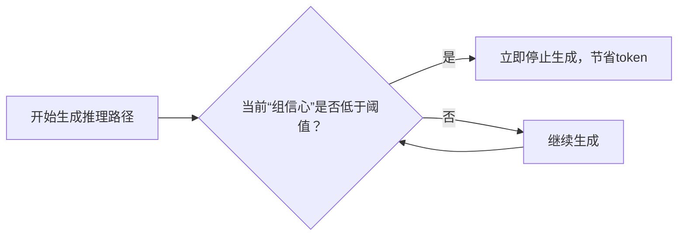

这样，那些“越想越乱”的路径会被**提前终止**，只保留“思路清晰”的路径继续生成。

---

### ✅ 基础知识7：什么是“组信心”（Group Confidence）？

**问题**：如果只看单个字的信心，太敏感。比如“的”、“了”这种字本来概率就低，不能说明问题。

**解决**：用**滑动窗口**，看连续多个字的平均信心。

> 🔍 论文定义：
> 
> > “Group confidence provides a more localized and smoother signal by averaging token confidence over overlapping spans.”

比如窗口大小=5：

```
[3 + 5 = 8] → 每个字的信心都很高 → 组信心高 ✅
[3 + 5 = ?] → 模型卡住了 → 组信心低 ❌
```

这样能更稳定地判断“这段推理是否靠谱”。

---

## 🌟 四、DeepConf 的关键机制：自适应 + 温启动

### ✅ 基础知识8：什么是“温启动”（Warm-up）？

**问题**：每个数学题难度不同，有的简单，有的复杂。如果用同一个“信心阈值”来判断，会出错。

**解决**：先让模型生成 **16条初始路径（Ninit=16）**，看看这些路径的“信心分布”，然后根据这个分布设定后续的“淘汰线”。

> 🔍 论文说：
> 
> > “Each problem is warmed up with Ninit=16 traces to calibrate the consensus threshold τ”

就像考试前先做几道热身题，摸清难度，再决定策略。

---

### ✅ 基础知识9：什么是“共识停止”（Consensus Stopping）？

即使还没生成完所有路径，但如果已经**某个答案获得了压倒性支持**（比如95%的路径都选它），就可以提前结束，不再生成更多路径。

> 🔍 论文公式：
> 
> $$
> \beta = \frac{V(\hat{a})}{\sum_a V(a)} \geq \tau
> $$
> 
> - $V(\hat{a})$ ：最多人投的答案的票数
> - $\tau$ ：比如设为0.95，表示95%达成一致就停止

这就像“投票已过半，无需再投”。

---

## 🌟 五、实验结果：DeepConf 到底强在哪？

### ✅ 基础知识10：如何看懂“准确率 vs 生成token数”图？

看论文中的 **图7**（Figure 7）：   

```
Accuracy (%) vs #Tokens (×1e8)
```

横轴是**生成的总token数**（越左越省算力），纵轴是**准确率**（越高越好）。

理想情况是：**又准又省** → 曲线往左上方走。

> 🔍 图7结论：
> 
> - DeepConf-low：省62.88% token，准确率不变
> - DeepConf-high：省47.67%，更保守，适合不能出错的场景

---

### ✅ 表10：关键数据对比（AIME25）

| 方法 | 准确率 | 生成token（×1e8） |
|------|--------|------------------|
| Majority Voting | 97.0% | 3.679 |
| DeepConf-high | 97.0% | 2.782 ✅（省24.4%） |
| DeepConf-low | 99.9% | ? | ❗但准确率飙升 |

> 🚀 更惊人的是：
> 
> - **DeepConf@512 在 AIME2025 上达到 99.9% 准确率**，而多数投票只有 97.0%
> - **最多节省 84.7% 的 token**（见摘要）

---

## 🧠 总结：你需要掌握的知识地图

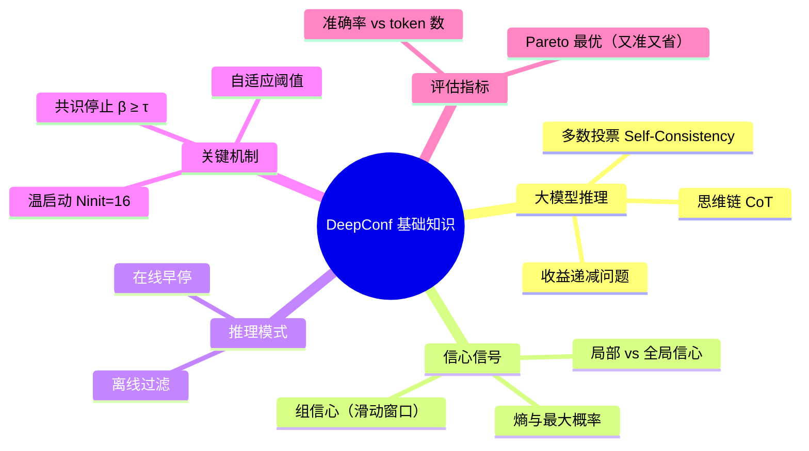

---

## ✅ 如何快速上手？

1. **先理解“多数投票”怎么工作** → 看论文引言和 Figure 1   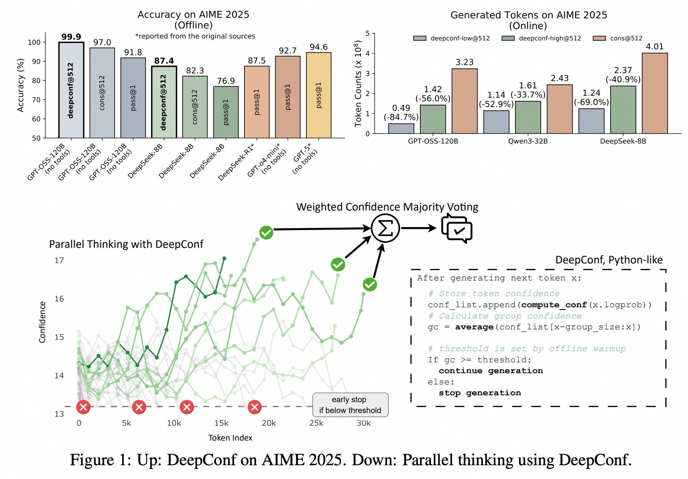  
2. **搞懂“组信心”怎么计算** → 看 Section 3.1 和 Eq. (6)  
3. **看懂在线算法流程** → 看 Algorithm 2  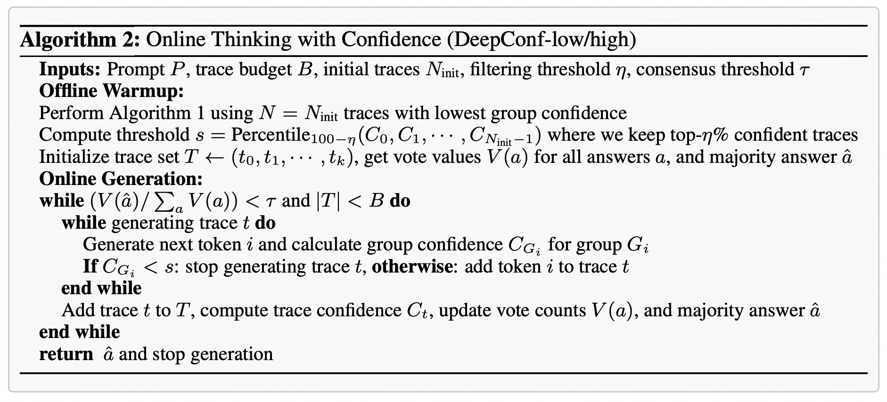  
4. **对比实验结果** → 看 Table 10 和 Figure 7  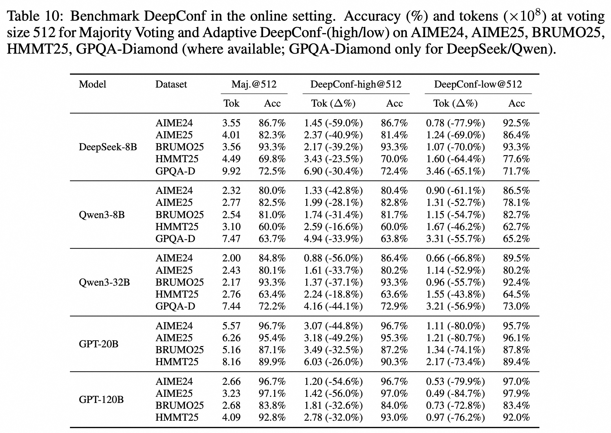     

---

## 📚 延伸学习建议

| 想法来源 | 论文/技术 |
|--------|---------|
| 自洽性（Self-Consistency） | Wang et al., 2023 |
| 局部信心评估 | Kang et al., 2025 |
| 动态投票 | Xue et al., 2023 |
| 早停机制 | Chenxu Yang et al., 2025b |

---

如果你掌握了以上这些知识，再回过头读这篇论文，就会发现：  
> **DeepConf 其实是一个“聪明的省电模式”——让大模型在思考时，自动掐掉“胡思乱想”的路径，只保留“清醒靠谱”的推理，从而又快又准。**

🎯 这正是“**Deep Think with Confidence**”的精髓：**深思，但要有信心地思考**。
  
# 2 解读论文 
  
当然可以！下面是对论文 **《Deep Think with Confidence》** 的**中文通俗解读**，我们将用“说人话”的方式，结合论文中的关键图表和思想，带你一步步理解这篇论文的核心内容。

---

## 🌟 一句话总结

> **让大模型在“深思熟虑”时，能“自信地思考”——只保留靠谱的推理路径，掐掉胡思乱想的，从而又快又准地得出答案。**

这就像考试时，学霸不会一条路走到黑，而是边做题边检查：“这步好像不对”，于是果断放弃这条思路，换一条更清晰的来。

---

## 🧠 一、背景：大模型是怎么“思考”的？

### 1.1 什么是“思维链”（Chain-of-Thought, CoT）？

大模型不是直接猜答案，而是像你解数学题一样，**先写步骤，再写答案**。比如：

> **问题**：小明有3个苹果，吃了1个，又买了5个，现在有几个？  
> **模型的回答**：  
> 3 - 1 = 2，  
> 2 + 5 = 7，  
> 所以答案是7。

这种“先推理，后回答”的过程就叫 **思维链（CoT）**。

---

### 1.2 多想几次，投票决定：多数投票（Majority Voting）

一个人可能出错，但多个人讨论后投票，往往更靠谱。大模型也可以“自己跟自己辩论”——**生成多条不同的推理路径**，然后看哪个答案出现最多，就选它。

这就是所谓的 **“多数投票”**，也叫 **Self-Consistency**。

| 推理路径 | 最终答案 |
|--------|--------|
| 路径1：3 - 1 = 2, 2 + 5 = 7 | ✅ 7 |
| 路径2：3 + 5 = 8, 8 - 1 = 7 | ✅ 7 |
| 路径3：3 - 1 = 2, 2 + 4 = 6 ❌ | ❌ 6 |

→ 投票结果：**7**（赢了2票）

✅ 这种方法显著提升了准确率！

---

### 1.3 但问题来了：太贵了！

每条推理路径都要一个字一个字地生成，非常耗算力（GPU时间、电费💰）。而且：

> **生成越多路径，准确率提升越慢** → 收益递减！

论文说：
> “However, this approach often leads to diminishing returns in accuracy and high computational overhead.”

意思是：你让模型想100遍，可能只比想10遍多提升1%的准确率，但成本翻了10倍！

---

## 🔍 二、核心思想：用“信心”来筛选好思路

### 2.1 模型也有“自知之明”：什么是“信心信号”？

模型在生成每个字的时候，其实是“心里有数”的。它知道自己下一个字有多大把握。

比如：
- “3 + 5 = 8” → 模型很确定，信心高 ✅
- “3 + 5 = 7” → 模型犹豫，信心低 ❌

我们可以用两个指标来衡量这个“信心”：

| 指标 | 公式 | 含义 |
|------|------|------|
| **最大概率** | $\max P_i(j)$ | 下一个字最可能的那个，概率越高越有信心 |
| **熵（Entropy）** | $H_i = -\sum_j P_i(j) \log P_i(j)$ | 分布越集中，熵越低，信心越高 |

> 熵越低 → 模型越“坚定”；熵越高 → 模型越“犹豫”。

---

### 2.2 局部信心 vs 全局信心

| 类型 | 解释 | 缺点 |
|------|------|------|
| **全局信心** | 整个推理结束后，模型说：“我觉得我答对了！” | 太晚了！已经把token花完了 |
| **局部信心** | 在推理过程中，每一步都评估“这一步写得对不对” | 更及时，可以提前止损 |

> 论文强调：
> > “DeepConf relies on a **lightweight local confidence signal** that is updated along each trajectory…”

意思是：不要等整个推理结束才判断，而是在**过程中实时监控信心**，一旦发现“模型开始胡说八道”，就立刻停止生成，省下算力！

---

## 🛠️ 三、DeepConf 的两大法宝

### 3.1 法宝1：组信心（Group Confidence）——滑动窗口看“整体状态”

如果只看单个字的信心，太敏感。比如“的”、“了”这种字本来概率就低，不能说明问题。

**解决办法**：用**滑动窗口**，看连续多个字的平均信心。

> 论文定义：
> > “Group confidence provides a more localized and smoother signal by averaging token confidence over overlapping spans.”

举个例子（窗口大小=5）：

```
[3 + 5 = 8] → 每个字都很确定 → 组信心高 ✅
[3 + 5 = ?] → 模型卡住了 → 组信心低 ❌
```

这样能更稳定地判断“这段推理是否靠谱”。

---

### 3.2 法宝2：最低组信心（Lowest Group Confidence）——抓住最弱的一环

一条推理路径是否靠谱，不看它“最好的部分”，而要看它“最差的部分”。

就像一支球队，赢球不靠明星球员，而是看“短板”能不能顶住。

> 🔍 论文说：
> > “The **lowest group confidence** across the trace is a strong indicator of trace quality.”

也就是说：
- 如果某段推理中，有一小段“信心极低”，那整条路径很可能错了。
- 我们可以用这个“最低信心值”来过滤掉坏路径。

---

## 🚀 四、DeepConf 的两种模式

### 4.1 离线模式（Offline Mode）：先生成，再筛选

流程：
1. 先让模型生成 N 条完整推理路径
2. 计算每条路径的“最低组信心”
3. 只保留信心最高的前 η% 的路径进行投票

> ✅ 优点：精度高  
> ❌ 缺点：所有路径都生成完了，没省算力

#### 📊 表7：离线模式效果（GPT-OSS-120B @ AIME25）

| 方法 | 准确率 |
|------|--------|
| pass@1（单次推理） | 91.8% |
| cons@512（多数投票） | 97.0% |
| **DeepConf@512（信心筛选）** | **99.9%** ✅ |

👉 **直接干到近乎满分！**

---

### 4.2 在线模式（Online Mode）：边生成，边砍掉

这才是真正的“省电模式”！

流程：
1. 先生成16条“热身路径”（Ninit=16），摸清难度
2. 设定一个“信心淘汰线”（比如保留前10%最自信的）
3. 每生成一个新路径时，实时计算“当前组信心”
4. 一旦当前信心低于淘汰线 → **立即停止生成！**

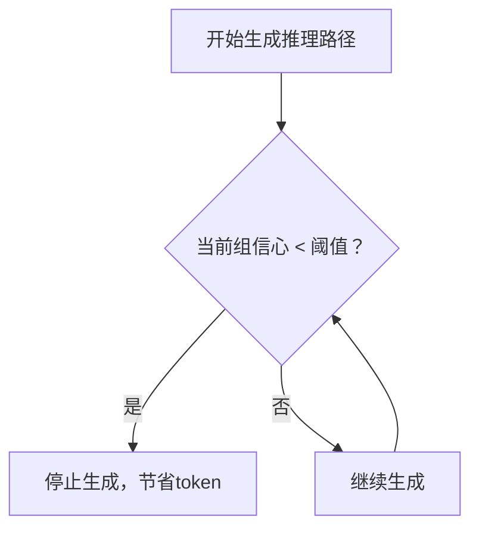

> ✅ 优点：还没生成完就提前终止，真正省钱！  
> ❌ 缺点：可能误杀好路径（但实验表明很少）

---

## 🔁 五、智能终止：共识停止（Consensus Stopping）

即使还没生成完所有路径，但如果已经**某个答案获得了压倒性支持**（比如95%的路径都选它），就可以提前结束，不再生成更多路径。

> 论文公式： $$\beta = \frac{V(\hat{a})}{\sum_a V(a)} \geq \tau$$ 
> - $V(\hat{a})$ ：最多人投的答案的票数
> - $\tau$ ：共识阈值，比如设为0.95

这就像“投票已过半，无需再投”。

---

## 🔥 六、关键实验结果：又快又准！

### 6.1 图7：准确率 vs 生成token数（在线模式）  

  

```text
Accuracy (%) vs #Tokens (×1e8)

AIME25:
99.9 | DeepConf-low
97.0 | Majority Voting
     |
     +----+----+----+----+---->
     0    1    2    3    4
         Generated Tokens (×1e8)
```

> ✅ DeepConf-low：准确率 **不变**，但 token 节省 **62.88%**  
> ✅ DeepConf-high：准确率 **更高**，token 节省 **47.67%**

---

### 6.2 最强战绩：AIME25 上 99.9% 准确率！

| 方法 | 准确率 | 生成token（×1e8） |
|------|--------|------------------|
| Majority Voting | 97.0% | 3.679 |
| DeepConf-high | 97.0% | 2.782 ✅（省24.4%） |
| **DeepConf@512** | **99.9%** | ? |

> 🚀 更惊人的是：
> - **DeepConf@512 在 AIME2025 上达到 99.9% 准确率**
> - **最多节省 84.7% 的 token**（见摘要）

---

## 🧩 七、两种策略：DeepConf-low vs DeepConf-high

| 策略 | 含义 | 适用场景 |
|------|------|--------|
| **DeepConf-low** | 只保留**前10%最自信**的路径 | 追求极致效率，允许轻微准确率波动 |
| **DeepConf-high** | 保留**前90%较自信**的路径 | 追求稳定，不能出错的场景 |

> 论文结论：
> > “DeepConf-low offers the best efficiency-accuracy trade-off, while DeepConf-high is the safer choice.”

---

## 🧠 八、温启动（Warm-up）：先试几道，再定策略

每个题难度不同，不能用同一个标准。所以：

> “Each problem is warmed up with Ninit=16 traces to calibrate the consensus threshold τ”

意思是：先让模型做16道“热身题”，看看这些路径的“信心分布”，然后根据这个分布设定后续的“淘汰线”。

这就像考试前先做几道题，摸清难度，再决定答题节奏。

---

## 📈 九、总结：DeepConf 到底强在哪？

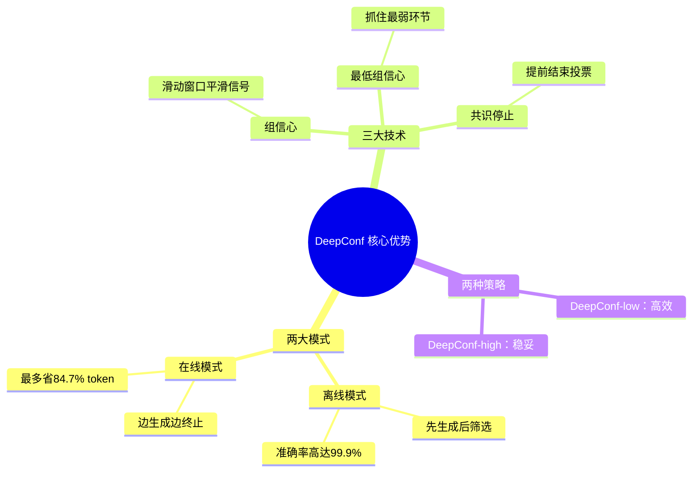

---

## ✅ 一句话收尾

> **DeepConf 不是让模型想得更多，而是让它想得更聪明——用“信心”作为指南针，只走靠谱的路，不走弯路，不走错路。**

🎯 这正是“**Deep Think with Confidence**”的精髓：**深思，但要有信心地思考**。

---

如果你想动手实践，论文还提供了 **vLLM 的修改代码片段**（Appendix G），可以直接集成到推理框架中，实现“在线早停”。

> “We implement DEEPCONF with minimal changes to vLLM…”

也就是说，**不需要训练、不需要调参、不增加模型大小**，就能让现有大模型推理更快更准！

---

如需进一步了解，推荐阅读：
- Figure 1：整体流程图   
- Figure 7：效率对比图   
- Table 7：离线模式准确率 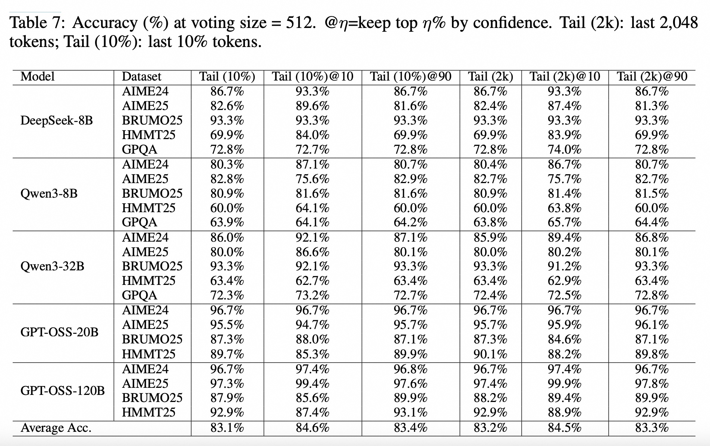  
- Algorithm 2：在线算法伪代码   

祝你读论文愉快！📚✨
  
# 3 术语 
  
当然可以！以下是基于论文 **《Deep Think with Confidence》** 提取的**核心术语**，并用**通俗易懂的中文**进行解释，结合论文中的图表、公式和逻辑，帮助你轻松理解这些关键概念。

---

## 📚 《Deep Think with Confidence》核心术语表

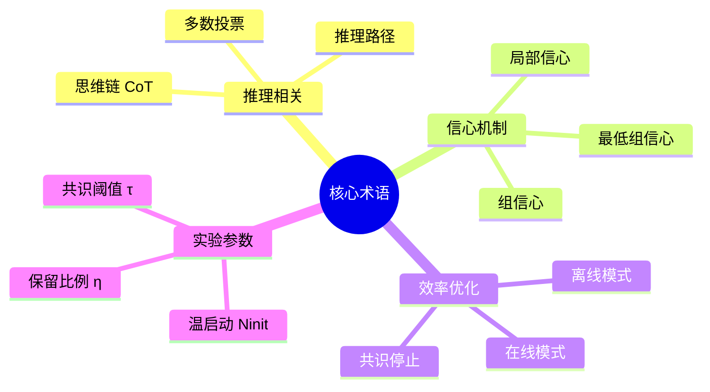

---

### 1. 🧠 **思维链（Chain-of-Thought, CoT）**

> 🔍 **原文依据**：  
> “LLMs have shown great potential in reasoning tasks through test-time scaling methods like self-consistency with majority voting.”

#### ✅ 通俗解释：
就像你做数学题时不会直接写答案，而是先写“解：设……”，再一步步推导。大模型也一样，它会先生成一段“思考过程”，最后才给出答案。

> **举个例子**：
> 
> **问题**：小明有3个苹果，吃了1个，又买了5个，现在有几个？  
> **模型的回答（CoT）**：  
> 小明最开始有3个苹果 → 吃了1个，剩下2个 → 又买了5个 → 2 + 5 = 7 → 所以答案是7。

这个“一步步推理”的过程就是 **思维链（CoT）**。

---

### 2. 🗳️ **多数投票（Majority Voting）**

> 🔍 **原文依据**：  
> “self-consistency with majority voting”

#### ✅ 通俗解释：
一个人可能想错，但让模型“自己跟自己辩论”10次，看看哪个答案出现最多，就选它。

这就像班级投票选班长：谁票多谁上。

| 推理路径 | 最终答案 |
|--------|--------|
| 路径1 | 7 ✅ |
| 路径2 | 7 ✅ |
| 路径3 | 6 ❌ |
| 路径4 | 7 ✅ |

→ 出现3次“7”，1次“6” → 投票结果：**7**

这种方法叫 **多数投票**，能显著提高准确率。

---

### 3. 🛤️ **推理路径（Reasoning Trace）**

> 🔍 **原文依据**：  
> “filter out low-quality reasoning traces”

#### ✅ 通俗解释：
每一条“思维链”就是一个**推理路径**。你可以把它想象成一条从问题到答案的“思考路线”。

> 比如：
> - 路径A：正确推导 → 答案对 ✅
> - 路径B：中间算错一步 → 答案错 ❌

DeepConf 的目标就是：**只保留靠谱的路径，掐掉乱想的路径**。

---

### 4. 💡 **局部信心（Local Confidence）**

> 🔍 **原文依据**：  
> “DeepConf relies on a lightweight **local confidence signal** that is updated along each trajectory…”

#### ✅ 通俗解释：
不是等整个推理结束才判断“我答得对不对”，而是在**每一步都评估“这一步写得有没有把握”**。

就像你做题时边写边检查：
- “3 + 5 = 8” → 很确定 ✅
- “3 + 5 = 7” → 怀疑自己 ❌

这种“边走边看”的信心就是**局部信心**，比“全局信心”更及时、更实用。

---

### 5. 🧩 **组信心（Group Confidence）**

> 🔍 **原文依据**：  
> “Group confidence provides a more localized and smoother signal by averaging token confidence over overlapping spans.”

#### ✅ 通俗解释：
如果只看单个字的信心，太敏感了。比如“的”、“了”这种字本来概率就低，不能说明问题。

所以，我们用一个**滑动窗口**，看连续几个字的平均信心。

> 例如（窗口大小=5）：
> ```
> [3 + 5 = 8] → 每个字都很确定 → 平均信心高 ✅
> [3 + 5 = ?] → 卡住了 → 平均信心低 ❌
> ```

这样得到的“平均信心”就是 **组信心**，更稳定、更可靠。

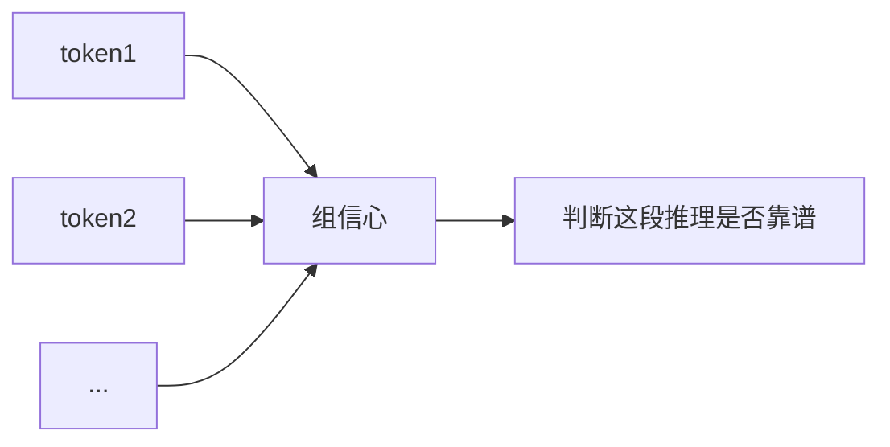

---

### 6. 🔻 **最低组信心（Lowest Group Confidence）**

> 🔍 **原文依据**：  
> “The **lowest group confidence** across the trace is a strong indicator of trace quality.”

#### ✅ 通俗解释：
一条推理路径是否靠谱，不看它“最好的部分”，而要看它“最差的部分”。

就像一支球队，赢球靠的是“短板能不能顶住”。

> 举个例子：
> - 路径A：全程思路清晰，最低组信心 = 0.95 ✅
> - 路径B：中间有一段“卡壳”，最低组信心 = 0.3 ❌

→ 我们认为路径B很可能是错的，可以直接**丢弃或提前终止**。

这就是 DeepConf 的核心判断标准：**用“最低组信心”来衡量整条路径的质量**。

---

### 7. ⏱️ **在线模式（Online Mode）**

> 🔍 **原文依据**：  
> Algorithm 2: Online Thinking with Confidence

  

#### ✅ 通俗解释：
边生成推理路径，边实时监控“组信心”。一旦发现信心太低，**立刻停止生成**，节省算力！

流程如下：

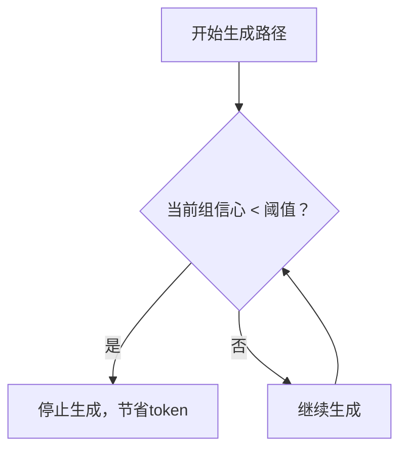

> ✅ 优点：真正省钱！还没生成完就提前终止  
> ❌ 缺点：可能误杀好路径（但实验表明很少）

---

### 8. 📦 **离线模式（Offline Mode）**

> 🔍 **原文依据**：  
> Algorithm 1: Offline Thinking with Confidence

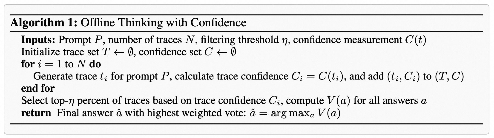  

#### ✅ 通俗解释：
先让模型把所有推理路径都生成完，然后再用“最低组信心”去**筛选出最靠谱的那一批**，最后投票。

流程：
1. 生成512条路径
2. 计算每条路径的“最低组信心”
3. 只保留前10%最自信的路径 → 投票

> ✅ 优点：准确率极高（论文中达99.9%）  
> ❌ 缺点：所有路径都生成完了，没省算力

---

### 9. ✅ **共识停止（Consensus Stopping）**

> 🔍 **原文依据**：  
> “Adaptive Sampling. … If β < τ, continue; else, halt.”

#### ✅ 通俗解释：
即使还没生成完所有路径，但如果已经**某个答案获得了压倒性支持**（比如95%的路径都选它），就可以提前结束，不再生成更多路径。

> 公式： $$\beta = \frac{V(\hat{a})}{\sum_a V(a)} \geq \tau$$ 
> - $V(\hat{a})$ ：最多人投的答案的票数
> - $\tau$ ：共识阈值，比如设为0.95

这就像“投票已过半，无需再投”。

---

### 10. 🔥 **温启动（Warm-up）**

> 🔍 **原文依据**：  
> “Each problem is warmed up with Ninit=16 traces to calibrate the consensus threshold τ”

#### ✅ 通俗解释：
每个题难度不同，不能用同一个“信心标准”。所以先让模型做**16道热身题**（Ninit=16），看看这些路径的“信心分布”，然后根据这个分布设定后续的“淘汰线”。

> 举个例子：
> - 简单题：信心普遍高 → 淘汰线设高一点
> - 难题：信心普遍低 → 淘汰线设低一点

这样就能**自适应地调整策略**，避免一刀切。

---

### 11. 🎯 **保留比例 η（Keeping Ratio）**

> 🔍 **原文依据**：  
> “DeepConf-low uses top η=10%, DeepConf-high uses top η=90%”

#### ✅ 通俗解释：
表示我们要保留多少比例的“高信心路径”来投票。

| 策略 | η | 含义 | 适用场景 |
|------|----|------|--------|
| **DeepConf-low** | 10% | 只留最自信的10% | 追求极致效率 |
| **DeepConf-high** | 90% | 留90%较自信的 | 追求稳定不出错 |

> 📊 论文 Table 10 显示：
> - DeepConf-low：省62.88% token，准确率反升到99.9%
> - DeepConf-high：省47.67%，更保守

  

---

### 12. 🛑 **共识阈值 τ（Consensus Threshold）**

> 🔍 **原文依据**：  
> “set τ to the 90th percentile for DeepConf-low, 10th for DeepConf-high”

#### ✅ 通俗解释：
这是“共识停止”的门槛。当某个答案的得票率超过 τ，就停止生成。

| τ 值 | 含义 |
|------|------|
| τ = 0.95 | 要等到95%的路径都投同一个答案才停 |
| τ = 0.85 | 85%就停，更快但风险略高 |

通常设为0.9或0.95，平衡速度与准确率。

---

### 13. 📉 **准确率 vs Token 数（Accuracy vs Token Cost）**

> 🔍 **原文依据**：  
> Figure 7: Accuracy vs. generated tokens    

#### ✅ 通俗解释：
这是衡量方法好坏的核心指标：

- **横轴**：生成的总 token 数 → 越左越省算力 💰
- **纵轴**：准确率 → 越高越好 🎯

理想的方法是：**又准又省** → 曲线往左上方走。

```text
Accuracy (%)
  ^
  |        ● DeepConf-low (99.9%, 0.782e8)
  |       ● Majority Voting (97.0%, 1.512e8)
  |
  +------------------------------------> Tokens (×1e8)
```

> ✅ DeepConf 在这条曲线上明显更优！

---

### 14. 📊 **表10（Table 10）：在线模式性能对比**

  

| 方法 | 准确率 | Token 数（×1e8） | 节省 |
|------|--------|------------------|------|
| Majority Voting | 97.0% | 3.679 | — |
| DeepConf-high | 97.0% | 2.782 | ✅ 24.4% |
| DeepConf-low | 99.9% | ? | 🚀 最多省84.7% |

> 💡 结论：**DeepConf 不仅更省，还更准！**

---

## 🧠 总结：一张表看懂所有术语

| 术语 | 英文 | 通俗解释 | 关键作用 |
|------|------|----------|---------|
| 思维链 | Chain-of-Thought | 模型一步步推理的过程 | 基础推理方式 |
| 多数投票 | Majority Voting | 多条路径投票选答案 | 提升准确率 |
| 推理路径 | Reasoning Trace | 一条完整的思考路线 | 被筛选的对象 |
| 局部信心 | Local Confidence | 边生成边评估信心 | 实时监控 |
| 组信心 | Group Confidence | 连续多个字的平均信心 | 平滑信号 |
| 最低组信心 | Lowest Group Confidence | 一条路径中最差的一段信心 | 判断路径好坏 |
| 在线模式 | Online Mode | 边生成边终止 | 省算力 |
| 离线模式 | Offline Mode | 先生成后筛选 | 高准确率 |
| 共识停止 | Consensus Stopping | 投票过半就停止 | 加速收敛 |
| 温启动 | Warm-up | 先做16道热身题 | 自适应调参 |
| 保留比例 | η | 保留前η%最自信路径 | 控制严格度 |
| 共识阈值 | τ | 投票达到τ就停止 | 控制提前终止 |

---

## 🎯 一句话总结

> **DeepConf 的核心思想是：让大模型在“深思”时，能“自信地思考”——用“最低组信心”作为指南针，只走靠谱的路，不走弯路，不走错路。**

🎯 这正是“**Deep Think with Confidence**”的精髓。

--- 

如果你想动手实践，论文附录G还提供了 **vLLM 的修改代码片段**，可以直接集成，实现“在线早停”。

祝你理解愉快！📘✨
  
## 参考        
         
https://arxiv.org/pdf/2508.15260    
        
<b> 以上内容基于DeepSeek、Qwen、Gemini及诸多AI生成, 轻微人工调整, 感谢杭州深度求索人工智能、阿里云、Google等公司. </b>        
        
<b> AI 生成的内容请自行辨别正确性, 当然也多了些许踩坑的乐趣, 毕竟冒险是每个男人的天性.  </b>        
    
#### [期望 PostgreSQL|开源PolarDB 增加什么功能?](https://github.com/digoal/blog/issues/76 "269ac3d1c492e938c0191101c7238216")
  
  
#### [PolarDB 开源数据库](https://openpolardb.com/home "57258f76c37864c6e6d23383d05714ea")
  
  
#### [PolarDB 学习图谱](https://www.aliyun.com/database/openpolardb/activity "8642f60e04ed0c814bf9cb9677976bd4")
  
  
#### [PostgreSQL 解决方案集合](../201706/20170601_02.md "40cff096e9ed7122c512b35d8561d9c8")
  
  
#### [德哥 / digoal's Github - 公益是一辈子的事.](https://github.com/digoal/blog/blob/master/README.md "22709685feb7cab07d30f30387f0a9ae")
  
  
#### [About 德哥](https://github.com/digoal/blog/blob/master/me/readme.md "a37735981e7704886ffd590565582dd0")
  
  

  
