## AI论文解读 | A Framework for Supporting the Class of Space Partitioning Trees
        
### 作者        
digoal        
        
### 日期        
2025-09-05       
        
### 标签        
PostgreSQL , PolarDB , DuckDB , AI , 论文解读        
        
----        
        
## 背景  
      
https://www.cs.purdue.edu/homes/bb/cs641/cs641/papers/gist.pdf        
  
提示:          
```          
读懂《A Framework for Supporting the Class of Space Partitioning Trees》这篇论文需要提前掌握哪些基础知识, 请使用中文通熟易懂的讲解这些基础知识, 可以引用论文中的图、表或使用Markdown支持的图形(text,mermaid等)增加解释性. 
  
使用中文通熟易懂的解读《A Framework for Supporting the Class of Space Partitioning Trees》这篇论文, 其中的关键内容请着重讲解, 可以引用论文中的图、表或使用Markdown支持的图形(text,mermaid等)增加解释性. 
  
提取《A Framework for Supporting the Class of Space Partitioning Trees》这篇论文中的重要术语, 使用中文对这些术语进行通熟易懂的讲解, 可以引用论文中的图、表或使用Markdown支持的图形(text,mermaid等)增加解释性. 
```     
  
## 1 前置知识 
  
好的，读懂这篇关于 **SP-GiST** 的论文，需要理解几个关键的基础知识。我会用通俗易懂的中文，并结合论文中的内容来为你讲解。

这篇论文的核心思想是：**为数据库设计一个“万能插座”（框架），让各种不同的“插头”（空间划分树）都能轻松地接入，而不需要为每个“插头”都重新设计一个“插座”。**

为了理解这个“万能插座”是如何工作的，你需要先了解以下几个基础概念：

---

### 1. 数据库索引 (Database Index)：为什么需要它？

想象一下，你有一个包含一百万个学生记录的Excel表格，现在你想找“张三”的信息。

*   **没有索引 (No Index)**：你只能从第一行开始，一行一行地往下看，直到找到“张三”。这个过程非常慢，尤其是在数据量巨大的数据库中。
*   **有索引 (With Index)**：这就像是给你的表格加了一个“目录”。这个目录按照“姓名”排序，你可以用“二分查找”法，先看中间的名字，如果“张三”比它小，就去前半部分找，反之去后半部分。这样，你可能只需要看20次左右就能找到“张三”，效率极高。

**核心作用**：索引的核心作用就是**加速数据的查找（查询）**，避免全表扫描。

论文中提到的 **B+树** 就是数据库中最经典、最常用的索引结构，它就像一个为“字典顺序”优化的、非常平衡的目录。

---

### 2. 空间划分树 (Space-Partitioning Trees)：处理复杂数据的“特殊目录”

传统的B+树擅长处理像“姓名”、“年龄”这样的**一维、线性数据**。但现代数据库需要处理更复杂的**多维数据**，比如：

*   **地理位置**：地图上的一个点（经度, 纬度）。
*   **图像特征**：一张图片的“颜色直方图”或“纹理特征”，可以看作一个高维向量。
*   **文本**：一个单词可以看作一个由字母组成的序列。

对于这些数据，我们需要更复杂的索引结构，它们被称为“空间划分树”。它们的共同特点是：**像切蛋糕一样，不断地把整个“数据空间”分割成更小的部分。**

论文中提到了几种典型的例子：

#### a. **k-D 树 (k-Dimensional Tree)**

*   **比喻**：想象你在玩“猜数字”游戏，但这次是猜一个二维平面上的点。
*   **工作原理**：
    1.  首先，选择一个点，用一条**垂直线**把它左边和右边的点分开。
    2.  然后，对左边和右边的两个区域，分别用**水平线**再进行划分。
    3.  接着，再用垂直线、水平线...如此交替进行，直到所有点都被分好。
*   **特点**：它的划分是**数据驱动 (Data-Driven)** 的，划分线的位置取决于当前区域里点的位置。这导致树的结构可能很“瘦长”，效率不高。
*   **看图**：论文中的 **Figure 4** 展示了一个k-D树的例子。你可以看到，根节点用垂直线（基于x坐标）划分了“Denver”和“Mobile”等点，然后子节点再用水平线（基于y坐标）进行划分。

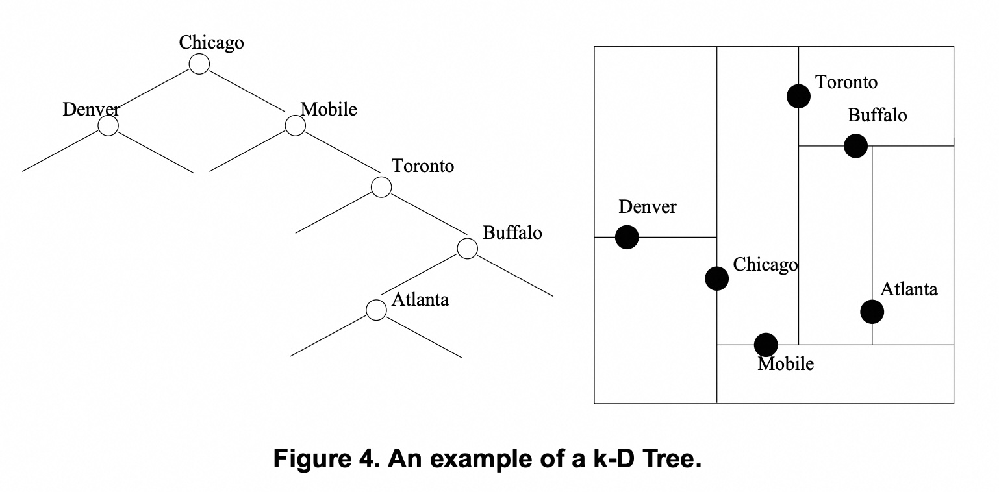  

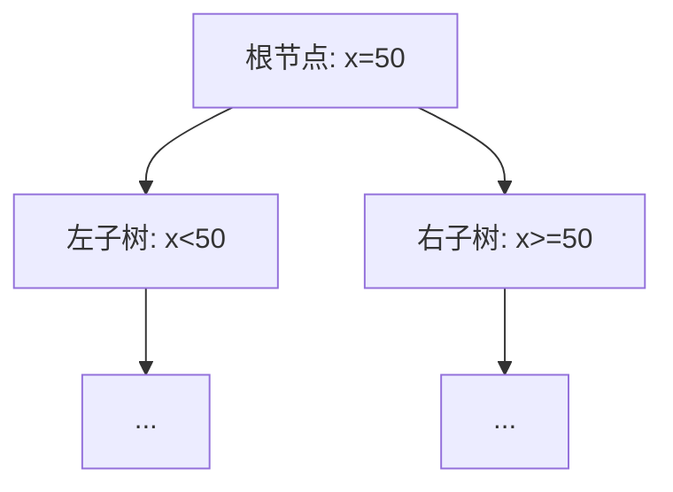


#### b. **四叉树 (Quadtree)**

*   **比喻**：把一张地图不断地“四等分”。
*   **工作原理**：
    1.  把整个地图分成左上、右上、左下、右下四个象限。
    2.  如果某个象限里有多个点，就把这个象限再分成四个更小的象限。
    3.  重复这个过程，直到每个小格子里的点数足够少（比如只有一个点）。
*   **特点**：它的划分是**空间驱动 (Space-Driven)** 的，划分线的位置是固定的（在中心），与数据无关。论文中提到了多种变体，如 **MX Quadtree**（分辨率固定，树高固定）和 **PR Quadtree**（根据数据动态停止划分）。
*   **看图**：论文中的 **Figure 5** (MX) 和 **Figure 6** (PR) 展示了四叉树如何分割空间。

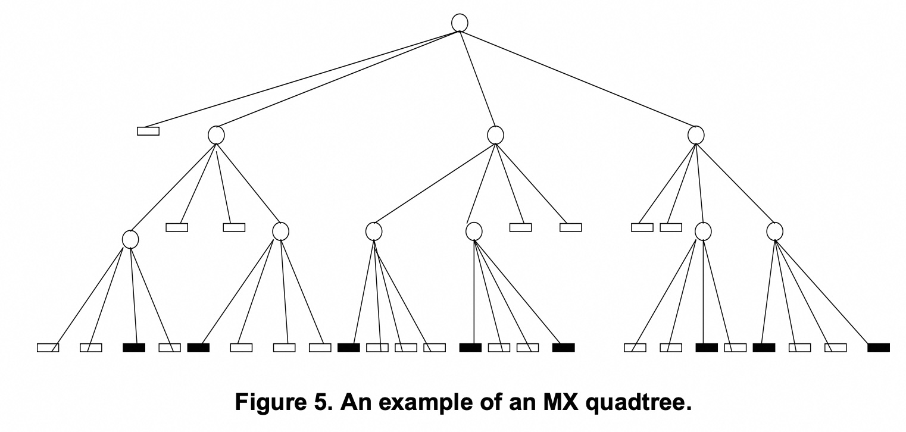  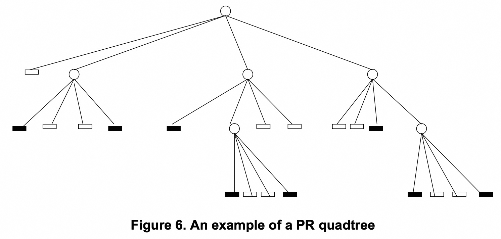  

#### c. **字典树 (Trie)**

*   **比喻**：一个巨大的、按字母顺序排列的“电话簿”。
*   **工作原理**：
    1.  第一层按单词的**第一个字母**分叉（A, B, C, ..., Z）。
    2.  在A分支下，再按**第二个字母**分叉（Aa, Ab, Ac, ...）。
    3.  如此往复，直到一个分支下只有一个单词。
*   **特点**：它也是**空间驱动**的，因为划分完全基于字母表的顺序，与存入的单词无关。
*   **看图**：论文中的 **Figure 8** 和 **Figure 9** 清晰地展示了Trie和它的优化版本Patricia Trie的结构。

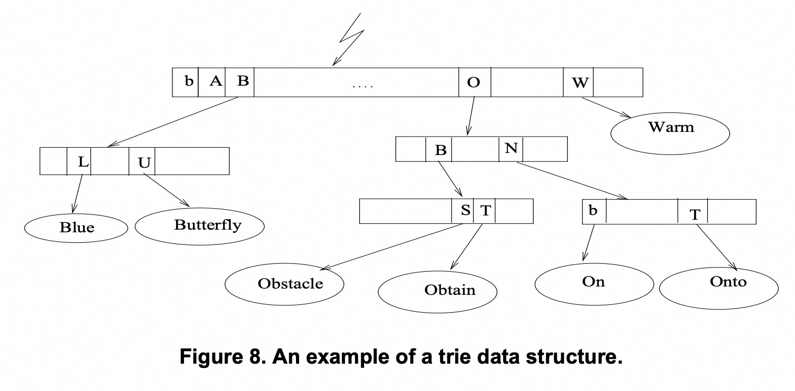  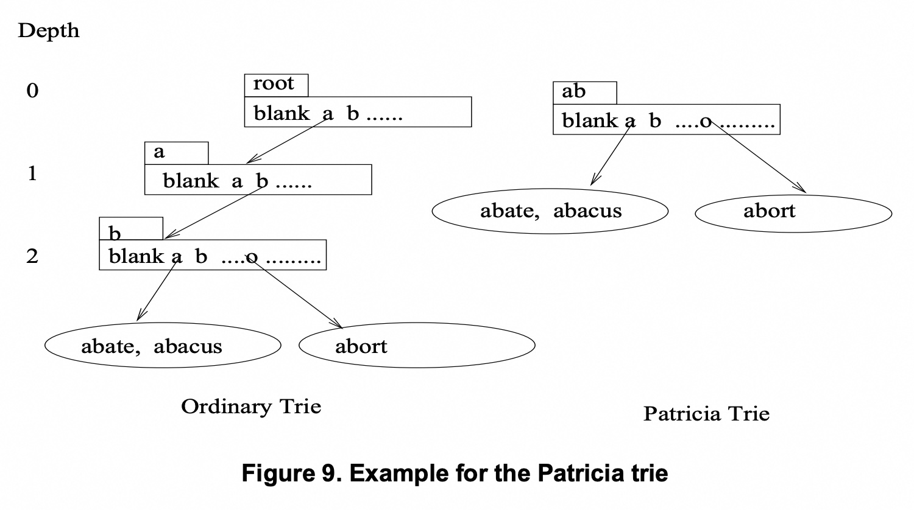  

---

### 3. GiST (Generalized Search Tree)：第一个“万能插座”

在SP-GiST之前，已经有学者提出了 **GiST** 框架。它的思想非常伟大：**定义一套通用的接口（方法），任何满足这些接口的树结构都可以被数据库系统支持。**

*   **核心方法**：GiST要求你实现几个关键函数，比如 `Consistent()`（判断一个查询是否可能匹配某个子树）和 `Union()`（计算一个节点下所有子树的“范围”）。
*   **局限性**：论文在第1节就指出了GiST的不足：它主要适用于像B+树、R树这样**相对平衡**的树。而对于k-D树、Trie、Quadtree这些**天生不平衡、可能非常瘦长**的树，GiST的框架就不太适用了。

你可以把GiST看作是一个为“标准方形插头”设计的插座，而k-D树、Trie这些是“异形插头”，插不进去。

---

### 4. SP-GiST：专为“异形插头”设计的新“万能插座”

这就是这篇论文要解决的问题。SP-GiST（**S**pace-**P**artitioning **GiST**）是一个专门为“空间划分树”这类不平衡树设计的新框架。

它的核心思想是：**抓住所有空间划分树的共性，然后提供一个灵活的“插槽”来适应它们的个性。**

#### 共性 (Commonalities)

所有空间划分树都有以下共同点，SP-GiST的“插座”就是为此设计的：
1.  **递归划分**：一层一层地把空间切分。
2.  **两种节点**：内部节点（Index Node，负责划分）和叶子节点（Data Node，存放实际数据）。
3.  **不平衡性**：树的深度可能不一致。

#### 个性 (Differences) - 通过“插件”实现

不同的树之所以不同，是因为它们的“形状”和“行为”不同。SP-GiST用 **参数 (Parameters)** 和 **方法 (Methods)** 作为“插件”来定义这些差异。

*   **参数 (Parameters)** - 定义树的“形状”：
    *   `NumberOfSpacePartitions`：每次划分成几份？Quadtree是4，Trie是26（字母），k-D树是2。
    *   `BucketSize`：一个叶子节点能装多少个数据？可以是1，也可以是多个。
    *   `ShrinkPolicy`：树的“瘦身”策略，决定了树的最终形态。论文的 **Table 1, 2, 3, 4, 5, 6, 7** 都展示了如何通过设置这些参数来“变”出不同的树。

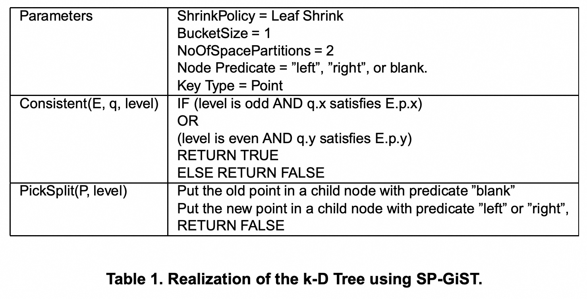 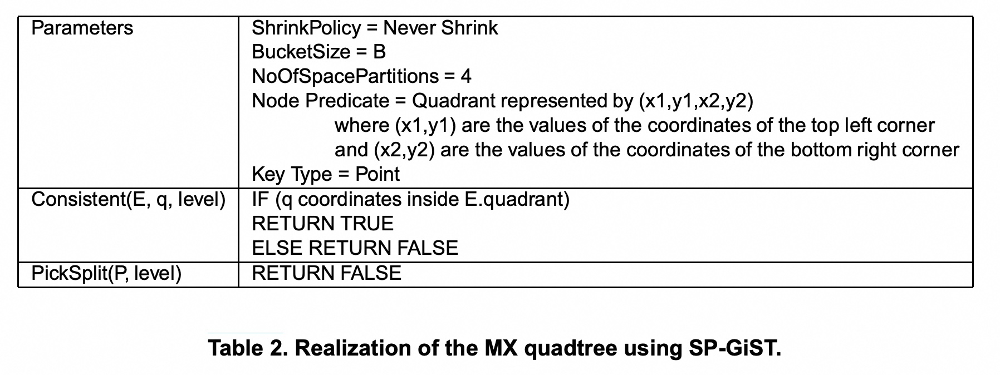 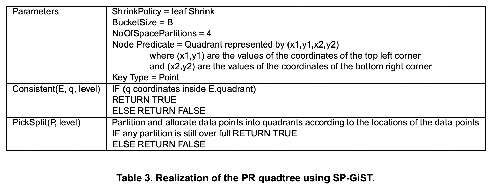  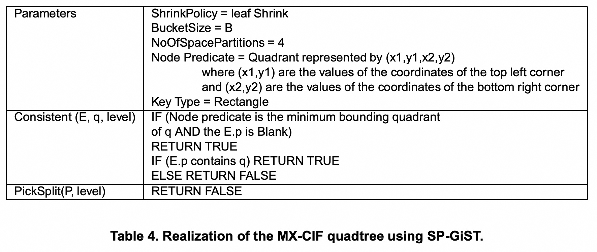  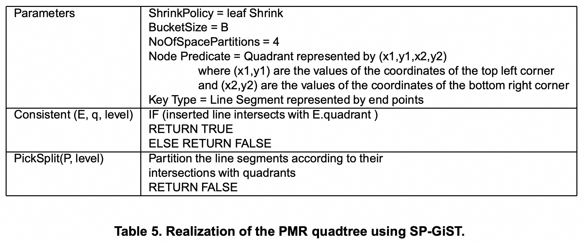   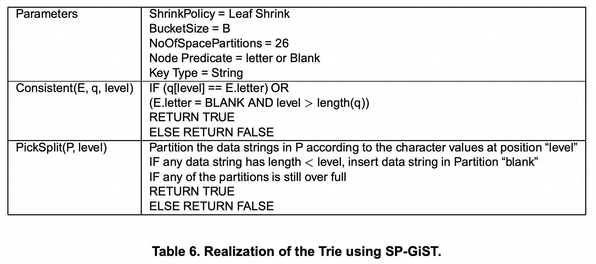 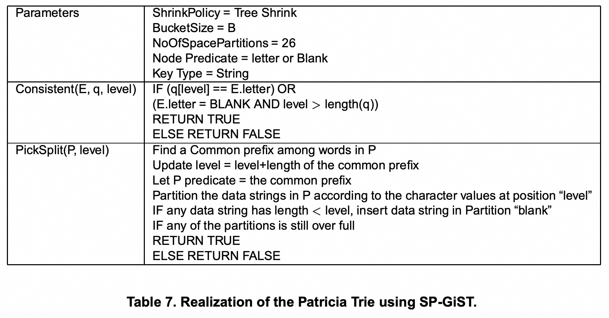 

*   **方法 (Methods)** - 定义树的“行为”：
    *   `Consistent(E, q, level)`：**导航函数**。当我要找一个查询`q`时，这个函数告诉我，应该沿着节点`E`的哪个子节点往下走。这是树搜索的核心。
        *   对于 **k-D树**，它比较查询点的坐标和划分点的坐标。
        *   对于 **Trie**，它比较查询单词的第`level`个字母和节点的字母。
    *   `PickSplit(P, level)`：**分裂函数**。当一个叶子节点装不下了（数据太多），这个函数决定如何把数据分到新的子节点里。

通过实现这两个方法，并设置好参数，你就可以“告诉”SP-GiST框架：“我要的是一个Trie！”或者“我要的是一个PR Quadtree！”。框架会自动处理插入、删除、查询等底层操作。

---

### 5. 聚类 (Clustering)：让“插座”更高效

即使有了“万能插座”，如果插上去的“插头”内部线路杂乱无章，效率也会很低。在数据库中，数据是存储在“页”（Page）这种固定大小的磁盘块里的。

*   **问题**：一个“瘦长”的树，如果每个节点都单独占一个页，那么查找一个数据可能需要访问很多个分散在磁盘不同位置的页，I/O开销巨大。
*   **解决方案**：**聚类 (Clustering)**。就是把逻辑上相邻的树节点，尽量安排在同一个磁盘页里。这样，一次I/O就能把一个“小分支”都读进内存，大大减少访问次数。
*   **看论文**：第6节专门讨论了聚类。论文采用了 **[14] 中的最小高度聚类算法**，其目标是让从根节点到叶子节点的**路径经过的页数最少**，从而最小化I/O。  `A. A. Diwan, S. Rane, S. Seshadri, and S. Sudarshan. Clustering techniques for minimizing external path length. In VLDB’96, Mumbai (Bombay), India, pages 342–353, September 1996`

---

### 总结

要读懂这篇论文，你需要理解：

1.  **索引是数据库的“加速器”**。
2.  **B+树**是处理一维数据的经典索引。
3.  **k-D树、Quadtree、Trie** 是处理多维/复杂数据的空间划分树，它们通过递归分割空间来组织数据。
4.  **GiST** 是一个通用框架，但它不擅长处理不平衡的树。
5.  **SP-GiST** 是GiST的“升级版”，它通过定义 `参数` 和 `方法` 这两个“插件”，让数据库能灵活地支持各种空间划分树。
6.  **聚类** 是保证这些树在磁盘上高效存储和访问的关键技术。

理解了这些，你就能明白论文中 **Table 1** 到 **Table 7** 的意义：它们展示了如何用简单的“参数配置”和“方法实现”，就把SP-GiST这个“万能插座”变成了一个具体的k-D树或Trie。
  
   

## 2 解读论文 
  
好的，我们来用通俗易懂的中文，深入解读这篇关于 **SP-GiST** 的论文。我会像讲故事一样，把核心思想和关键技术讲清楚。

---

### 故事的开始：数据库的“老古董”和“新难题”

想象一下，你有一个巨大的图书馆（数据库），里面有几百万本书（数据）。你想找一本叫《三体》的书。

*   **传统方法（B+树）**：图书馆用一个超级详细的**字母序目录**。你从“A”找到“S”，再到“S-T”，最后找到“三体”。这个目录非常平衡，无论找哪本书，最多翻3-4页就能找到。这就是数据库里最常用的 **B+树**。
*   **新难题**：现在，图书馆不光有书，还有**地图、照片、音乐**。你想找“所有位于北京天安门附近的餐馆”或者“和《三体》风格相似的科幻小说”。这种“复杂”的查询，B+树的“字母序”目录就无能为力了。

为了解决这些新问题，科学家们发明了很多新的“索引目录”，比如：

*   **k-D树**：像个“猜坐标”的游戏，不断地用横线和竖线把地图切成两半。
*   **四叉树 (Quadtree)**：像个“俄罗斯套娃”，把地图不断切成4个更小的方块。
*   **字典树 (Trie)**：像个“电话簿”，按单词的第一个字母、第二个字母...一级一级分下去。

这些新索引有个共同点：它们都在**不断地把一个大的“空间”切分成更小的部分**，所以论文把它们统称为“**空间划分树 (Space-Partitioning Trees)**”。

---

### 核心问题：为什么这些“新目录”在图书馆里用不起来？

虽然这些新索引很强大，但直接放进数据库这个“图书馆”里，会遇到两个大麻烦：

1.  **效率太低，I/O开销巨大**：
    *   这些树（尤其是k-D树和Trie）很容易长得“又瘦又长”（论文Figure 4, 8）。想象一下，你要找一本在第100层楼的书，就得坐电梯上下100次！      
    *   数据库的“电梯”就是**磁盘I/O**。一次I/O操作很慢，如果查一个数据要访问几十个分散的磁盘块（页），那速度就慢得没法用了。
    *   **对比**：B+树只有2-3层，I/O开销小。

2.  **实现太难，每个都要重写**：
    *   想象一下，每发明一种新目录（比如Trie），图书馆管理员就得把整个图书馆的管理规则重写一遍，还要处理并发、故障恢复等复杂问题。
    *   论文说，为每个新树结构“硬编码”（hard wiring）到数据库引擎里，是个“非平凡的工程”（non-trivial process）。

之前的 **GiST** 框架想解决这个问题，但它主要适合B+树这种“矮胖”的树，对于k-D树、Trie这种“瘦长”的树，GiST也无能为力。

---

### SP-GiST：一个万能的“插座”和“插头”系统

这就是这篇论文的**核心贡献**：提出了 **SP-GiST** 框架。它的思想非常巧妙，可以理解为一个**万能插座**和**可插拔的插头**系统。

*   **SP-GiST 是“万能插座”**：它定义了一套通用的、底层的“供电和通信标准”（插入、删除、查询、并发控制、磁盘I/O优化等）。这个“插座”只做一次，就一劳永逸。
*   **不同的树是“插头”**：k-D树、Trie、Quadtree...它们就是不同的“插头”。你只需要按照“插座”的标准，给它们设计一个合适的“插头”（实现几个简单的函数和参数），就能插上去用了！

这样一来，数据库开发者就不用再为每个新索引重写底层代码了。只需要为新索引设计一个“插头”，就能让它在数据库里高效运行。

---

### 关键内容一：SP-GiST 的“插座”标准（Interface）

SP-GiST 定义了两部分标准：**参数 (Parameters)** 和 **方法 (Methods)**。这两部分共同决定了“插头”的形状和行为。

#### 1. 参数 (Parameters) - 定义“插头”的形状

这是一些配置项，用来描述你想要的树长什么样。

*   **`NumberOfSpacePartitions` (划分扇出数)**：
    *   **问**：每次切蛋糕，切成几份？
    *   **答**：
        *   四叉树：切成 **4** 份。
        *   二叉树/k-D树：切成 **2** 份。
        *   英文字典树：按26个字母分，切成 **26** 份。
    *   **看表**：Table 2 (MX Quadtree), Table 6 (Trie) 都设置了这个参数。      

*   **`BucketSize` (桶大小)**：
    *   **问**：一个“叶子节点”能装多少本书（数据）？
    *   **答**：可以是1本（如Table 1的k-D树），也可以是多本（如Table 3的PR Quadtree）。这就像一个抽屉，满了才需要拆分成更多小抽屉。

   

*   **`ShrinkPolicy` (瘦身策略)**：这是论文里一个**极其重要**的概念，它决定了树的“高度”和“胖瘦”。
    *   **`Never Shrink` (从不瘦身)**：一定要切到最细的粒度。
        *   **例子**：MX Quadtree (Table 2)。不管一个格子里有没有点，都要切到1x1的像素大小。这棵树会非常“矮”但“宽”。    
    *   **`Leaf Shrink` (叶子瘦身)**：只要能装下，就不再切了。
        *   **例子**：PR Quadtree (Table 3)。一个格子里有两个点，才需要切。这棵树的高度是“可变的”，效率更高。    
    *   **`Tree Shrink` (树瘦身)**：不仅叶子要瘦身，中间的“瘦长”路径也要压缩！
        *   **例子**：Patricia Trie (Table 7)。普通Trie里，`abacus` 和 `abate` 要走 `a` -> `b` 两条路，但它们前面都是`ab`。Patricia Trie会把`a`和`b`两个节点合并成一个叫`ab`的节点，大大缩短了路径。   
        *   **看图**：Figure 3 和 Figure 9 生动地展示了 `Tree Shrink` 如何把“瘦长”的Trie变成“矮胖”的Patricia Trie。

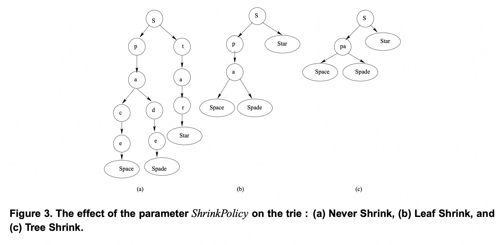    

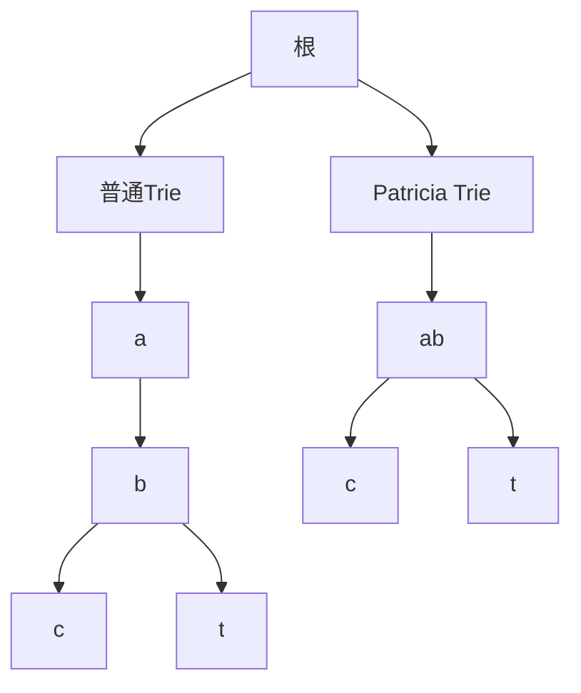

#### 2. 方法 (Methods) - 定义“插头”的行为

这是两个关键函数，决定了树如何工作。

*   **`Consistent(E, q, level)` (一致性函数)**：这是树的“导航仪”。
    *   **问**：当我要找一个东西 `q`（比如一个坐标或一个单词）时，应该从当前节点 `E` 的哪个子节点往下走？
    *   **答**：
        *   **k-D树 (数据驱动)**：看 `q` 的坐标是大于还是小于当前节点的划分点坐标。
        *   **Trie (空间驱动)**：看 `q` 的第 `level` 个字母是哪个。
    *   **看表**：Table 1 和 Table 6 的 `Consistent` 函数逻辑完全不同，这正是它们行为差异的体现。      

*   **`PickSplit(P, level)` (分裂函数)**：这是树的“分家”规则。
    *   **问**：一个“抽屉”（叶子节点）装不下了（数据太多），该怎么把它里的东西分到新的“小抽屉”里？
    *   **答**：根据当前的 `level`（深度），按照某种规则（通常是`Consistent`函数的规则）把数据分到 `NumberOfSpacePartitions` 个新桶里。
    *   **看表**：Table 3 (PR Quadtree) 的 `PickSplit` 会根据数据点的位置把它们分到4个象限里。  

---

### 关键内容二：动态聚类 (Dynamic Clustering) - 让“插座”更高效

即使有了“万能插座”，如果“插头”内部的线路是乱的，效率还是不高。在数据库里，就是**如何把树的节点存到磁盘页里**。

*   **简单做法**：一个节点占一个页。对于“瘦长”的树，这意味着一次查询要访问很多个分散的页，I/O开销巨大。
*   **SP-GiST 的聪明做法**：使用 **动态最小高度聚类 (Dynamic Minimum-Height Clustering)** 技术。

它的核心思想是：**尽量把一条“长路径”上的节点，存到同一个磁盘页里！**

*   **为什么？** 因为查询时，我们通常是从根节点沿着一条路径走到叶子节点。如果这条路径上的几个节点都在同一个页里，那么只需要一次I/O就能把它们全部读进内存，后续的查找都在内存里进行，速度飞快。
*   **论文贡献**：SP-GiST 内置了这种聚类算法（引用了[14]的工作），并且在每次插入/删除后**动态地**重新调整节点的存储布局，保证树的高度（I/O次数）最小。    `A. A. Diwan, S. Rane, S. Seshadri, and S. Sudarshan. Clustering techniques for minimizing external path length. In VLDB’96, Mumbai (Bombay), India, pages 342–353, September 1996`

---

### 总结：SP-GiST 到底是什么？

SP-GiST 就是一个**聪明的框架**，它解决了空间划分树在数据库中应用的两大难题：

1.  **实现难题**：通过“参数+方法”的插件式设计，让开发者能轻松地将k-D树、Trie、Quadtree等各种树接入数据库，而无需重写底层引擎。
2.  **性能难题**：通过“动态最小高度聚类”技术，将逻辑上相关的树节点物理上聚集在一起，极大地减少了磁盘I/O，让这些“瘦长”的树也能高效运行。

**一句话总结**：SP-GiST 是一个让数据库能轻松、高效地支持各种“空间划分树”索引的“万能插座”系统。它通过标准化接口降低了开发难度，通过智能聚类克服了性能瓶颈，为多媒体、GIS等新兴应用提供了强大的索引支持。
  
## 3 术语 
  
好的，我们来提取这篇SP-GiST论文中的关键术语，并用通俗易懂的中文进行讲解，帮助你理解这篇论文的核心思想。

---

### 核心概念：空间划分树 (Space-Partitioning Trees)

这是整篇论文要解决的“主角”们。你可以把它们理解为**专门为复杂数据设计的“地图”或“目录”**。

*   **比喻**：想象你要在一张巨大的、没有街道名的地图上找一个朋友。B+树就像是一个按字母顺序排列的地址簿，但这张地图上没有字母。空间划分树则像是一套“切蛋糕”的规则。
*   **定义**：一类通过**递归地将一个大的“数据空间”切割成互不重叠的小块**来组织数据的树形结构。
*   **例子**：
    *   **k-D树**：像玩“猜坐标”游戏，用横线和竖线交替切割平面。
    *   **四叉树 (Quadtree)**：像俄罗斯套娃，把一个区域不断切成4个更小的方块。
    *   **字典树 (Trie)**：像电话簿，按单词的第一个字母、第二个字母...一级一级分下去。

论文的Figure 4, 5, 6, 8, 9 都是这些树的具体例子。

  
  
  
  
  

---

### 问题根源：为什么需要SP-GiST？

#### 1. **数据驱动 vs. 空间驱动 (Data-Driven vs. Space-Driven Decomposition)**

这是理解不同空间划分树行为差异的关键。

*   **数据驱动 (Data-Driven)**：
    *   **解释**：切割线的位置**取决于当前数据点的位置**。数据变了，切割方式也会变。
    *   **例子**：**k-D树**。当你插入一个新点时，它会根据这个点的坐标来决定在哪里画分割线。
    *   **比喻**：你有一块蛋糕，要分给在场的人。你根据每个人的位置，把蛋糕切成两半，确保两边人数差不多。

*   **空间驱动 (Space-Driven)**：
    *   **解释**：切割线的位置是**固定的、预设的**，完全由空间本身决定，与存进去的数据无关。
    *   **例子**：**四叉树**和**字典树**。四叉树总是把区域切成4个相等的象限；字典树总是按26个字母来分。
    *   **比喻**：你有一块蛋糕，不管有多少人，你都机械地把它切成4块完全相等的正方形。

> **论文依据**：第2节明确区分了这两类，并指出k-D树是数据驱动，而Trie、Quadtree是空间驱动。

---

### 解决方案：SP-GiST框架

SP-GiST (Space-Partitioning Generalized Search Tree) 就是论文提出的“万能插座”，让数据库能轻松支持各种空间划分树。

#### 2. **ShrinkPolicy (瘦身策略)**

这是SP-GiST框架中**最核心、最精妙**的参数，它决定了树的“胖瘦”和效率。

*   **解释**：当树越长越高（层数越来越多）时，如何“瘦身”以避免它变得又细又长，从而减少查询时的磁盘I/O次数。
*   **三种策略**：    

    *   **从不瘦身 (Never Shrink)**：
        *   **解释**：一定要切到最细的粒度，不管有没有数据。
        *   **例子**：**MX Quadtree** (Table 2)。一个100x100的地图，即使只有一个点，也要一直切到1x1的像素大小。这棵树会非常“矮”但“宽”。   
        *   **看图**：Figure 3(a) 展示了这种策略。  

    *   **叶子瘦身 (Leaf Shrink)**：
        *   **解释**：只要一个“格子”里还能装下数据，就不再切了。只有当格子满了，才进行切割。
        *   **例子**：**PR Quadtree** (Table 3) 和 **k-D树** (Table 1)。效率更高，树的高度是“可变的”。     
        *   **看图**：Figure 3(b) 展示了这种策略。

    *   **树瘦身 (Tree Shrink)**：
        *   **解释**：这是最高级的策略。不仅叶子要瘦身，连中间的“瘦长路径”也要压缩！它会把只有一个子节点的中间节点“合并”掉。
        *   **例子**：**Patricia Trie** (Table 7)。普通Trie里，`abacus` 和 `abate` 要走 `a` -> `b` 两条路，但它们前面都是`ab`。Patricia Trie会把`a`和`b`两个节点合并成一个叫`ab`的节点，大大缩短了路径。    
        *   **比喻**：就像把一条“`去超市 -> 走A路 -> 走B路 -> 到达`”的导航指令，简化成“`去超市 -> 走AB路 -> 到达`”。
        *   **看图**：Figure 3(c) 和 Figure 9 生动地展示了 `Tree Shrink` 如何把“瘦长”的Trie变成“矮胖”的Patricia Trie。    


> **论文依据**：3.1节详细定义了`ShrinkPolicy`，Figure 3 是其最直观的图解。

#### 3. **Consistent (一致性函数)**

这是树的“导航仪”或“路标”。

*   **解释**：当你想找一个东西（查询）时，这个函数告诉你，应该从当前节点的哪个子节点往下走。
*   **工作原理**：
    *   **k-D树**：比较查询点的坐标和划分点的坐标，决定走“左”还是“右”。
    *   **Trie**：比较查询单词的第N个字母和节点的字母，决定走哪个分支。
*   **重要性**：这是所有树搜索算法的核心逻辑。没有它，树就无法导航。
*   **看表**：Table 1, 6, 7 的 `Consistent` 函数定义了不同树的导航规则。

   

#### 4. **PickSplit (分裂函数)**

这是树的“分家”规则。

*   **解释**：当一个“抽屉”（叶子节点）装不下了（数据太多），这个函数决定如何把里面的东西分到新的“小抽屉”里。
*   **工作原理**：它会调用 `Consistent` 函数，根据划分规则，把超载的数据分配到 `NumberOfSpacePartitions` 个新桶里。
*   **看表**：Table 3 (PR Quadtree) 的 `PickSplit` 会根据数据点的位置把它们分到4个象限里。

 

#### 5. **NumberOfSpacePartitions (划分扇出数)**

*   **解释**：每次切割，把空间分成几份？
*   **例子**：
    *   四叉树：**4**份。
    *   二叉树/k-D树：**2**份。
    *   英文字典树：**26**份（按26个字母分）。
*   **看表**：Table 1, 2, 3, 6, 7 都设置了这个参数。

     

#### 6. **BucketSize (桶大小)**

*   **解释**：一个“叶子节点”能装多少个数据？可以是1个，也可以是多个。
*   **作用**：这是一个性能调优参数。桶越大，树的节点越少，但单个节点查找数据可能越慢（因为要在一个桶里找）。
*   **看表**：Table 1 中k-D树的 `BucketSize=1`，而其他树的 `BucketSize=B`（B是一个可变的数）。

 

---

### 性能保障：动态聚类 (Dynamic Clustering)

这是让SP-GiST真正“高效”的关键技术。

*   **问题**：数据库的数据是存在“磁盘页”（Page）里的。如果一个“瘦长”的树，它的节点在磁盘上东一个西一个，那么查询一次就要访问很多个分散的页，速度会非常慢。
*   **解决方案**：**动态最小高度聚类 (Dynamic Minimum-Height Clustering)**。
*   **解释**：SP-GiST会智能地安排树节点在磁盘上的存储位置。它的核心思想是：**尽量把一条查询路径上的几个节点，存到同一个磁盘页里！**
*   **比喻**：就像你坐电梯，如果10层楼的按钮都在一个电梯里，你按一次就能上去；但如果每层楼的按钮在不同的电梯里，你就得换乘10次。
*   **效果**：一次磁盘I/O就能把查询路径上的多个节点都读进内存，后续操作都在内存中进行，速度飞快。
*   **论文依据**：第6节专门讨论聚类，并引用了[14]的算法作为默认实现。 `A. A. Diwan, S. Rane, S. Seshadri, and S. Sudarshan. Clustering techniques for minimizing external path length. In VLDB’96, Mumbai (Bombay), India, pages 342–353, September 1996`

---

### 总结：术语关系图

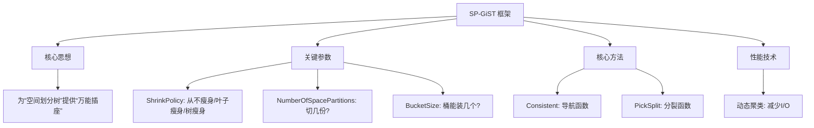

理解了这些术语，你就掌握了这篇论文的精髓：SP-GiST通过定义`参数`和`方法`，提供了一个灵活的框架，并通过`动态聚类`技术，让各种“空间划分树”都能在数据库中高效、便捷地运行。
  
## 参考        
         
https://www.cs.purdue.edu/homes/bb/cs641/cs641/papers/gist.pdf    
        
<b> 以上内容基于DeepSeek、Qwen、Gemini及诸多AI生成, 轻微人工调整, 感谢杭州深度求索人工智能、阿里云、Google等公司. </b>        
        
<b> AI 生成的内容请自行辨别正确性, 当然也多了些许踩坑的乐趣, 毕竟冒险是每个男人的天性.  </b>        
    
#### [期望 PostgreSQL|开源PolarDB 增加什么功能?](https://github.com/digoal/blog/issues/76 "269ac3d1c492e938c0191101c7238216")
  
  
#### [PolarDB 开源数据库](https://openpolardb.com/home "57258f76c37864c6e6d23383d05714ea")
  
  
#### [PolarDB 学习图谱](https://www.aliyun.com/database/openpolardb/activity "8642f60e04ed0c814bf9cb9677976bd4")
  
  
#### [PostgreSQL 解决方案集合](../201706/20170601_02.md "40cff096e9ed7122c512b35d8561d9c8")
  
  
#### [德哥 / digoal's Github - 公益是一辈子的事.](https://github.com/digoal/blog/blob/master/README.md "22709685feb7cab07d30f30387f0a9ae")
  
  
#### [About 德哥](https://github.com/digoal/blog/blob/master/me/readme.md "a37735981e7704886ffd590565582dd0")
  
  

  
