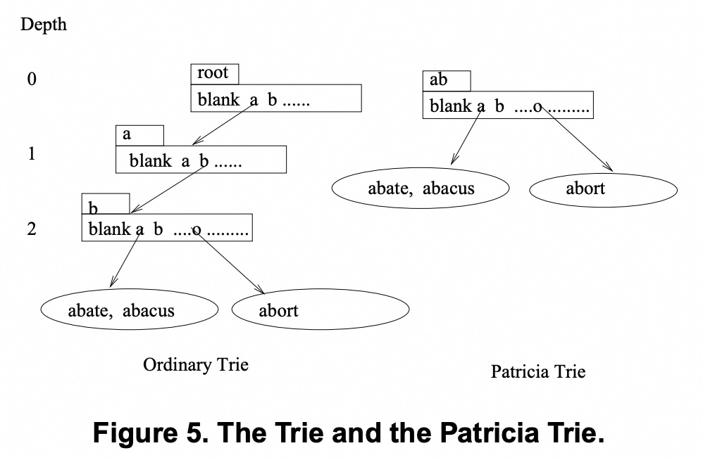

## AI论文解读 | An Extensible Index for Spatial Databases
        
### 作者        
digoal        
        
### 日期        
2025-09-05       
        
### 标签        
PostgreSQL , PolarDB , DuckDB , AI , 论文解读        
        
----        
        
## 背景  
      
https://www.cs.purdue.edu/homes/aref/papers/ssdbm01.pdf        
  
提示:          
```          
读懂《An Extensible Index for Spatial Databases》这篇论文需要提前掌握哪些基础知识, 请使用中文通熟易懂的讲解这些基础知识, 可以引用论文中的图、表或使用Markdown支持的图形(text,mermaid等)增加解释性. 
  
使用中文通熟易懂的解读《An Extensible Index for Spatial Databases》这篇论文, 其中的关键内容请着重讲解, 可以引用论文中的图、表或使用Markdown支持的图形(text,mermaid等)增加解释性. 
  
提取《An Extensible Index for Spatial Databases》这篇论文中的重要术语, 使用中文对这些术语进行通熟易懂的讲解, 可以引用论文中的图、表或使用Markdown支持的图形(text,mermaid等)增加解释性. 
```     
  
## 1 前置知识 
  
您好，根据您提供的论文内容，要读懂《An Extensible Index for Spatial Databases》这篇论文，需要提前掌握以下基础知识：

### 空间数据库和索引结构
---
* **空间数据库（Spatial Databases）**：论文主要讨论的是空间数据库中的索引问题，这类数据库用于存储和管理地理信息系统（GIS）、计算机辅助设计（CAD/CAM）和多媒体应用（如图像、视频）等数据 。与传统数据库不同，空间数据库需要处理多维数据和复杂的空间查询 。

* **B+-tree 和 R-tree**：论文将新提出的索引结构与传统的 B+-tree 和 R-tree 进行了对比 。B+-tree 是一种平衡树结构，主要用于一维数据的索引，而 R-tree 及其变体（如 R*-tree 和 R+-tree）则是空间数据库中重要的索引方法 。理解这些传统索引的工作原理，特别是它们如何组织和访问数据，有助于理解新方法的创新之处。

### 空间划分树（Space-Partitioning Trees）
---
这篇论文的核心是“空间划分树”这个概念，它是指一类递归地将空间划分为不相交分区的分层数据结构 。理解以下几种具体的空间划分树非常重要：

* **Quadtree（四叉树）**：将一个二维空间递归地划分为四个象限（子空间），每个节点分解成四个不相交的块 。
* **k-D Tree（k维树）**：根据数据驱动的原则将空间划分成两个不相交的区域 。
* **Trie（字典树）和 Patricia Trie**：Trie 是一种用于字符串（词语）索引的树结构，每个节点的分支由键（key）的一部分决定 。Patricia trie 是 Trie 的一种特殊形式，它会合并只有一个子节点的内部节点，从而减少树的高度 。

论文中引用了图 2 和图 5 来展示 Trie 和 Patricia Trie 的结构差异，图 4 展示了 k-D 树的结构。

    

### 空间划分的两种原则
---
论文强调了两种不同的空间划分原则 ：

* **数据驱动（data-driven）**：划分空间的原则依赖于输入数据 。例如，k-D 树就是数据驱动的，它根据已有的数据点来确定划分线 。
* **空间驱动（space-driven）**：划分空间的原则完全依赖于空间本身，与数据无关 。Trie 和四叉树（如区域四叉树）都是空间驱动的例子 。

理解这两种原则有助于区分不同的空间划分树，并理解 SP-GiST 如何通过用户自定义方法来实现这两种行为 。

### 广义搜索树（Generalized Search Tree, GiST）
---
论文提到的 **GiST** 是一个通用的索引框架，用于实现类似 B-tree 的索引 。SP-GiST 正是基于这个思想，但专门针对不平衡的空间索引结构 。理解 GiST 的可扩展接口和基本概念，例如一致性（Consistent）和拆分（PickSplit）方法，将有助于你理解 SP-GiST 是如何通过这些“插件”来实现不同树结构的 。

总而言之，读懂这篇论文，需要先了解空间数据索引的背景和挑战，然后深入理解几种具体的空间划分树（尤其是四叉树、k-D树和Trie），以及“数据驱动”和“空间驱动”这两种划分原则。最后，对 GiST 框架的理解将帮助你更好地掌握 SP-GiST 作为通用框架的核心思想。
  
## 2 解读论文 
  
好的，我们来通俗易懂地解读一下《An Extensible Index for Spatial Databases》这篇经典论文。

### 论文核心思想：解决什么问题？

想象一下数据库的索引就像一本书的目录，能让你快速找到想要的数据。对于传统数据（比如员工工号、年龄），一种叫做 `B+-tree` 的“目录”结构效果非常好，几乎所有关系型数据库都在用它 。

但是，随着应用的发展，数据库里开始存储各种各样的新数据，比如：

  * **地理信息系统 (GIS)** 中的地图坐标 。
  * **计算机辅助设计 (CAD)** 中的零件图形 。
  * **数据挖掘**中的多维度特征数据 。

对于这些复杂的“空间”数据，老式的 `B+-tree` 目录就不太好用了。学术界为此设计了很多新的目录结构，比如 **k-D 树、四叉树 (Quadtree)、字典树 (Trie)** 等 。

然而，这些新的目录结构在实际应用到数据库系统中时，面临两大难题：

1.  **I/O 性能差**：这些树结构可能长得又高又瘦 (skinny and long) 。查询一条数据可能需要从磁盘读取很多个节点，导致磁盘 I/O 次数过多，速度很慢 。
2.  **实现成本高**：每一种新的索引结构，都需要数据库开发人员从头到尾重写一遍，并要处理好并发、事务恢复等复杂问题，这是一项非常耗时耗力的工作 。

**这篇论文的核心贡献就是提出了一个名为 SP-GiST (Space-Partitioning Generalized Search Tree) 的可扩展索引框架，旨在用一套统一的、通用的代码，来支持一大类被称为“空间分区树”的索引结构，从而一举解决上述两个难题 。**

你可以把 SP-GiST 理解成一个“索引模板”或者一个“万能锅架”。数据库内核开发者只需要把这个“锅架”实现一次，以后业务开发者想用 k-D 树、四叉树还是字典树，只需要往这个锅架上“挂”上对应的数据结构定义和几个关键规则即可，而无需关心底层的磁盘读写、并发控制等复杂问题 。


### 什么是“空间分区树 (Space-Partitioning Trees)”？

SP-GiST 专门为一类树形结构服务，这类树的共同特点是：**它们通过不断地将一个空间递归地分割成若干个互不重叠的子区域来组织数据** 。

比如，一个二维的四叉树，每次都把一个矩形区域“一分为四”，切成四个一样大的小矩形 。一个存储英文单词的字典树，每次都把当前节点按26个字母分割成26个分支 。

虽然原理相似，但这些树在分割时有两种不同的驱动方式：

  * **空间驱动 (Space-driven)**：分割方式是固定的，与数据无关。例如字典树，无论你插入什么单词，它总是有26个字母分支 。
  * **数据驱动 (Data-driven)**：分割方式依赖于插入的数据。例如 k-D 树，分割线的位置是由当前插入数据点的坐标决定的 。论文中的图4就是一个 k-D 树的例子，你可以看到分割线都是穿过某个数据点（城市）的 。   

除了驱动方式，这些树还有很多其他差异，比如：每次分割成几块？叶子节点能存多少个数据？树的高度是否可变？ SP-GiST 的设计目标就是要能灵活配置这些差异。

### SP-GiST 的“魔法”：如何实现可扩展性？

SP-GiST 的精髓在于它的**用户接口**。它把索引的通用逻辑（如树的遍历、节点的磁盘管理）封装在内核里，然后暴露出一系列“参数”和“方法”让用户来定义一个具体索引的行为 。

#### 1\. 接口参数 (Interface Parameters) - 定义树的“形状”

用户通过设置这些参数，就能像搭积木一样，组合出不同索引的静态结构。

  * `NumberOfSpacePartitions`：每次分裂产生多少个子分区 。比如四叉树设为4，k-D 树设为2 。
  * `BucketSize`：一个叶子节点最多能装多少个数据项 。当超过这个数量时，节点就需要分裂 。
  * `ShrinkPolicy`：这是一个非常关键的参数，用于控制树的“压缩策略”，直接影响树的高度和性能 。它有三种策略，论文中的图3用字典树生动地展示了其效果 ：    
      * `Never Shrink` (不压缩)：最原始的方式，严格按照空间分解逻辑，即使中间有很多节点只有一个孩子，也照样保留，这会导致树很深 。对应图3(a)。
      * `Leaf Shrink` (叶级压缩)：数据会插入到第一个能容纳它的叶子节点，只有当叶子节点满了才进行分裂 。这避免了不必要的深层路径，是很多索引（如PR四叉树）的实现方式。对应图3(b)。
      * `Tree Shrink` (树级压缩)：最激进的压缩方式，它会把所有“单孩子”的中间节点都合并掉，使得路径变得非常短 。著名的 Patricia 树就是采用这种策略 。对应图3(c)。

#### 2\. 外部方法 (External Methods) - 定义树的“行为”

用户需要实现几个核心函数，来告诉 SP-GiST 在关键时刻应该“怎么做”。

  * `Consistent()`：**导航函数**。当查询一个数据时，这个函数用来判断应该沿着树的哪个分支继续往下走 。比如在 k-D 树里，它会根据当前层级是按 x 轴还是 y 轴划分，来比较查询点的坐标 。
  * `PickSplit()`：**分裂函数**。当一个节点因为数据装不下了需要分裂时，这个函数定义了如何将节点里的数据重新分配到新的子节点中 。例如，在字典树中，分裂是根据每个单词在特定位置的字母来进行的 。

通过组合这些参数和方法，开发者就能“拼”出想要的任何空间分区树。

### 实践案例：如何用 SP-GiST 实现 k-D 树和 Patricia 树

论文给出了两个非常具体的例子，展示了 SP-GiST 的强大能力。

#### 1. 实现 k-D 树 (见论文表1 )
  

  * **参数设置**:
      * `NoOfSpacePartitions` = 2，因为 k-D 树是二叉树，每次将空间一分为二 。
      * `BucketSize` = 1，因为传统的 k-D 树每个节点只存储一个数据点 。
      * `ShrinkPolicy` = `Leaf Shrink`，因为分裂是数据驱动的，只有当新数据点落入一个已有数据点的区域时才发生分裂 。
  * **方法实现**:
      * `Consistent()` 方法会检查当前树的层级是奇数还是偶数，从而决定是比较 x 坐标还是 y 坐标来导航 。
      * `PickSplit()` 方法定义了当一个节点分裂时，老数据点和新数据点如何被分配到左右子节点。

#### 2. 实现 Patricia 树 (见论文表2 )
  

  * **参数设置**:
      * `NoOfSpacePartitions` = 26 (假设是英文字母) 。
      * `BucketSize` = B (可自定义，比如8)，允许一个叶子节点存储多个单词 。
      * `ShrinkPolicy` = `Tree Shrink`，这是 Patricia 树的精髓，它会合并单分支的节点以压缩树的高度 。
  * **方法实现**:
      * `PickSplit()` 的实现非常巧妙，它会先找出节点中所有单词的**共同前缀**，这个前缀成为父节点的谓词，然后根据前缀后的第一个字母进行分裂 。这完美地实现了 Patricia 树的路径压缩逻辑。

### 解决核心难题：性能与工程化

SP-GiST 不仅仅是一个理论框架，它还解决了现实世界中的工程问题。

  * **解决 I/O 性能问题**：针对空间分区树“又高又瘦”的缺点，SP-GiST 引入了**节点聚类 (Node Clustering)** 的概念 。它不再是一个树节点就占用一个磁盘页，而是允许将多个逻辑上相邻的节点（比如父子节点、兄弟节点）打包存放在同一个物理磁盘页上 。这样，一次磁盘读取就能加载树的一大块，大大减少了 I/O 次数 。
  * **解决并发与恢复问题**：论文指出，SP-GiST 的结构使得并发控制比 B-tree 更简单。因为分裂总是纵向的（一个数据节点分裂成一个索引节点和几个新的数据子节点），搜索操作不会像在 B-tree 中那样因为 பக்க节点分裂而“跟丢”目标，所以不需要复杂的“兄弟指针”（B-link） 。这使得 SP-GiST 可以更容易地集成到生产级数据库中 。

### 实验与结论

论文最后通过实验证明了其设计的有效性。论文中的图6和图7展示了 `BucketSize` 和 `ShrinkPolicy` 这两个参数对不同树（Trie 和 Quadtree）的性能（树的高度和占用的磁盘页数）有显著影响 。    

  * 对于 Trie 和 Patricia Trie，增加 `BucketSize` 可以有效减少分裂次数，从而降低树的高度和磁盘占用 。
  * 不同的 `ShrinkPolicy` 产生了行为完全不同的树，证明了框架的灵活性和表达能力 。

**总而言之，SP-GiST 是数据库索引领域一个里程碑式的工作。它通过一个高度可扩展的框架，优雅地解决了将大量非传统但十分有用的空间分区索引集成到数据库系统中的核心难题，极大地降低了开发成本，并保证了良好的性能。** 这项工作后来也被著名的开源数据库 PostgreSQL 采纳，成为了其核心索引方法之一。
  
## 3 术语 
  
根据您提供的论文《An Extensible Index for Spatial Databases》，我为您整理了以下重要的核心术语，并用通俗易懂的中文进行了讲解：

---

### **1. SP-GiST (Spatial Partitioning Generalized Search Tree)**

这是论文的核心，可以理解为一种 **“可插拔、可扩展”** 的通用空间索引框架。它不是一种全新的索引结构，而是一个“模板”，允许你根据需要插入不同的空间划分算法，从而创建出多种多样的空间索引，比如四叉树、k-D树或字典树。

**简单来说，SP-GiST就像一个多功能工具箱**：
* **工具箱本体**：SP-GiST 框架，负责管理树的结构、页面的存储、数据的读写等通用操作。
* **可替换的工具**：各种空间划分算法（如四叉树、k-D树算法），它们决定了数据在树中如何被组织和划分。

这样设计的好处是，开发者无需从头开始写一个全新的索引，只需为 SP-GiST 框架提供特定的算法，就可以快速创建一个专用的空间索引。

---

### **2. 空间划分树 (Space-Partitioning Trees)**

这类树结构是一组将多维空间**递归地**划分成不相交区域的数据结构。论文指出，这类索引的核心思想就是不断地对空间进行细分。

可以想象一个二维平面：
* 你先用一条线把它分成左右两部分。
* 再用另一条线把左右两部分各自上下再分。
* 以此类推，直到每个区域都足够小或满足某个条件。

SP-GiST 就是为了支持和管理这类树而设计的通用框架。论文提到了几个重要的空间划分树：

* **四叉树 (Quadtree)**：这是一种**空间驱动**的划分方式。它将一个二维空间递归地划分成四个相等的象限，就像把一个正方形不断地切成四块小正方形。
* **k-D 树 (k-D Tree)**：这是一种**数据驱动**的划分方式。它根据数据点的位置，交替地使用不同的维度（如 x 轴、y 轴）来将空间划分成两个区域。
* **字典树 (Trie)**：这是一种用于字符串索引的树，每个节点代表一个字符串的前缀。在空间数据库中，它可以用来将空间坐标编码成一串数字（例如用 Z 阶曲线），然后用字典树来组织这些坐标。

---

### **3. 数据驱动 vs. 空间驱动 (Data-driven vs. Space-driven)**

这是论文中区分不同空间划分树的重要概念。

* **数据驱动 (Data-driven)**：划分空间的边界和方式**取决于数据点的位置**。例如，k-D 树就是数据驱动的，它会根据数据点的中位数来确定划分线。
    * **优点**：划分更适应数据的分布，树可能更平衡。
    * **缺点**：每次插入或删除数据时，可能需要调整划分方式。

* **空间驱动 (Space-driven)**：划分空间的边界和方式**与数据点的位置无关**，完全由固定的空间划分规则决定。例如，四叉树就是空间驱动的，它总是将一个区域切成大小相同的四个部分。
    * **优点**：结构固定，易于管理和理解，不会因为数据变化而频繁重构。
    * **缺点**：如果数据分布不均匀，可能导致一些区域非常密集，而另一些区域几乎为空，造成树结构不平衡。

论文指出，SP-GiST 能够通过配置不同的“分裂算法”同时支持这两种不同的划分方式。

---

### **4. 广义搜索树 (Generalized Search Tree, GiST)**

GiST 是 SP-GiST 的前身，由 Joseph Hellerstein 等人提出，是一个**通用的索引框架**。它提供了一套可以被重载的抽象接口，允许开发者通过实现这些接口来创建类似 B-tree 的新型索引。

**GiST 的核心思想是**：将索引的通用逻辑（如页面的管理、搜索、插入、删除）与具体的索引结构（如 B-tree 的有序性）分离。SP-GiST 正是借鉴了这一思想，并将其扩展，使其能更好地支持**不平衡**的空间划分树。

**你可以这样理解**：GiST 是一个通用的索引模板，而 SP-GiST 是一个专门为空间数据设计的、更强大的“GiST”版本。
  
## 参考        
         
https://www.cs.purdue.edu/homes/aref/papers/ssdbm01.pdf    
        
<b> 以上内容基于DeepSeek、Qwen、Gemini及诸多AI生成, 轻微人工调整, 感谢杭州深度求索人工智能、阿里云、Google等公司. </b>        
        
<b> AI 生成的内容请自行辨别正确性, 当然也多了些许踩坑的乐趣, 毕竟冒险是每个男人的天性.  </b>        
    
#### [期望 PostgreSQL|开源PolarDB 增加什么功能?](https://github.com/digoal/blog/issues/76 "269ac3d1c492e938c0191101c7238216")
  
  
#### [PolarDB 开源数据库](https://openpolardb.com/home "57258f76c37864c6e6d23383d05714ea")
  
  
#### [PolarDB 学习图谱](https://www.aliyun.com/database/openpolardb/activity "8642f60e04ed0c814bf9cb9677976bd4")
  
  
#### [PostgreSQL 解决方案集合](../201706/20170601_02.md "40cff096e9ed7122c512b35d8561d9c8")
  
  
#### [德哥 / digoal's Github - 公益是一辈子的事.](https://github.com/digoal/blog/blob/master/README.md "22709685feb7cab07d30f30387f0a9ae")
  
  
#### [About 德哥](https://github.com/digoal/blog/blob/master/me/readme.md "a37735981e7704886ffd590565582dd0")
  
  

  
