## AI论文解读 | SP-GiST: An Extensible Database Index for Supporting Space Partitioning Trees
        
### 作者        
digoal        
        
### 日期        
2025-09-05       
        
### 标签        
PostgreSQL , PolarDB , DuckDB , AI , 论文解读        
        
----        
        
## 背景  
      
https://www.cs.purdue.edu/spgist/papers/W87R36P214137510.pdf        
  
提示:          
```          
读懂《SP-GiST: An Extensible Database Index for Supporting Space Partitioning Trees》这篇论文需要提前掌握哪些基础知识, 请使用中文通熟易懂的讲解这些基础知识, 可以引用论文中的图、表或使用Markdown支持的图形(text,mermaid等)增加解释性. 
  
使用中文通熟易懂的解读《SP-GiST: An Extensible Database Index for Supporting Space Partitioning Trees》这篇论文, 其中的关键内容请着重讲解, 可以引用论文中的图、表或使用Markdown支持的图形(text,mermaid等)增加解释性. 
  
提取《SP-GiST: An Extensible Database Index for Supporting Space Partitioning Trees》这篇论文中的重要术语, 使用中文对这些术语进行通熟易懂的讲解, 可以引用论文中的图、表或使用Markdown支持的图形(text,mermaid等)增加解释性. 
```     
  
## 1 前置知识 
  
SP-GiST 是一篇关于数据库索引的论文，要理解它，你需要掌握以下几个关键的基础知识：

### 1. 数据库索引的基础概念
首先，你需要理解数据库索引的基本作用。索引是一种数据结构，用于快速定位和访问数据库表中的数据。最常见的索引是 **B+树（B+-tree）**，它是一种平衡树，能够高效地处理磁盘 I/O，非常适合主键查询和范围查询。这篇论文提到，SP-GiST 索引正是为了解决 B+树和 R 树（R-tree）等传统索引无法有效支持新兴应用（如地理信息系统、数据挖掘等）而提出的 。

### 2. 空间数据结构
SP-GiST 论文的核心是支持“空间分区树”（Space-Partitioning Trees）。这类树结构的核心特点是“递归地将空间划分为不相交的分区”。理解以下几种空间分区树是读懂论文的关键：

* **k-D 树（k-D tree）**：这是一种数据驱动（data-driven）的空间划分方法 。它通过在不同维度上交替地选择一个数据点作为划分点，将空间递归地分成两半。论文中的图 5 展示了一个 k-D 树的示例 。 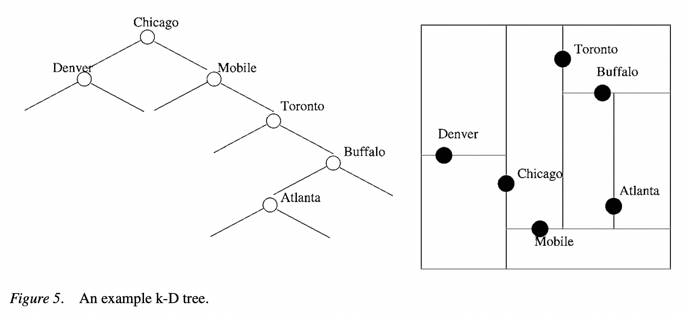  
* **四叉树（Quadtree）**：这是一种空间驱动（space-driven）的划分方法 。它将二维空间递归地划分为四个相等的象限（西北、东北、西南、东南），直到每个象限满足特定条件为止。论文中提到了 PR 四叉树（PR quadtree）和 MX 四叉树（MX quadtree）等变体 。
* **Trie 树（Trie）**：又称前缀树，这是一种用于存储字符串集合的树形数据结构 。它通过共享字符串的公共前缀来减少存储空间。Trie 树也是一种空间驱动的划分方式 ，每个节点根据下一个字符（例如，英文字母的 26 个分区）来划分空间 。论文中的图 2 和图 3 展示了 Trie 树的不同变体 。 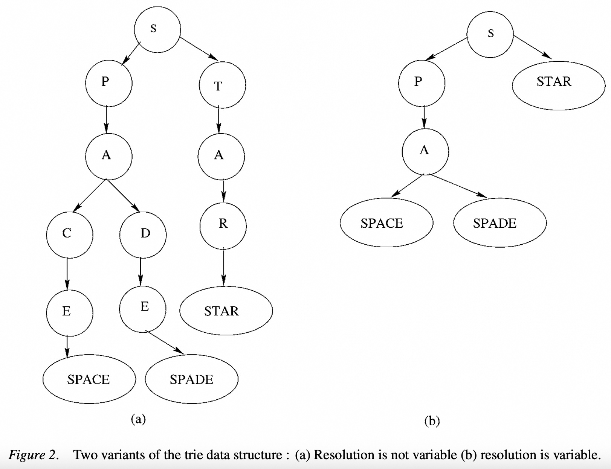  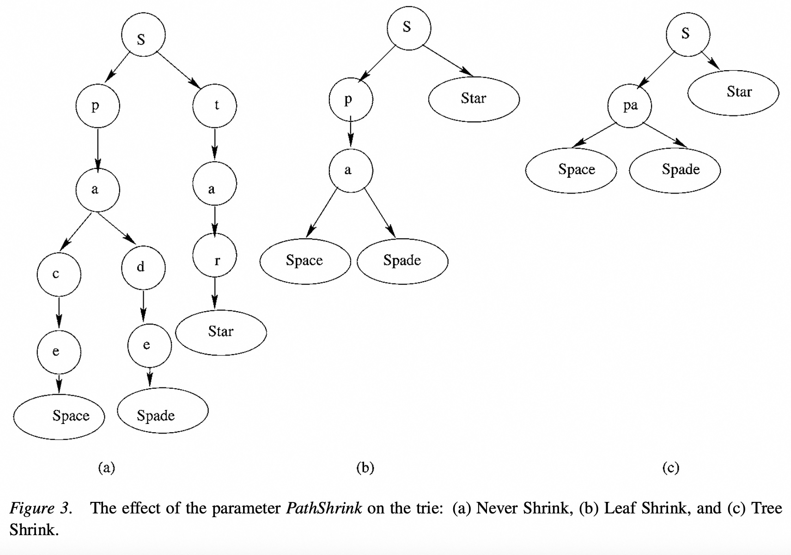  

### 3. GiST（Generalized Search Tree）框架
SP-GiST 是 GiST 的一个扩展。因此，了解 GiST 的基本思想非常重要。GiST 的目标是提供一个通用的框架，让用户能够通过实现特定的方法（如插入、删除、搜索）来构建各种不同的索引，而无需修改数据库内核代码 。然而，论文指出，GiST 框架无法很好地支持像 Trie 和 Quadtree 这类非平衡的空间分区树，因为它们有不同的结构特性 。SP-GiST 正是为了填补这一空白而设计的 。

### 4. 磁盘 I/O 和节点聚类
由于空间分区树可能会“又长又细”，如果不对树节点进行适当的聚类（Clustering），可能会导致大量的磁盘 I/O 操作，从而影响数据库性能 。因此，你需要理解为什么磁盘 I/O 是数据库系统中的一个关键性能问题，以及论文中提到的“节点聚类”（Node Clustering）是如何解决这个问题的 。

### 5. 论文中的图例和参数
论文使用了一些图表来解释概念，这些图例本身就是重要的信息：

* **图 1 (Figure 1)**：PR 四叉树的示例 。 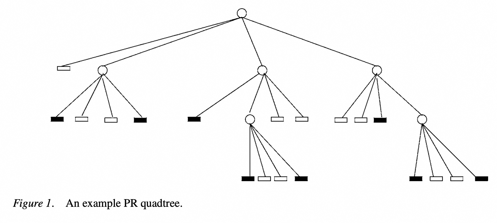  
* **图 2 (Figure 2)**：Trie 树的两种变体（变长与非变长分辨率）。   
* **图 3 (Figure 3)**：`PathShrink` 参数对 Trie 树的影响 。这个参数用于控制递归分解的次数，以避免树变得过高 。   
* **图 4 (Figure 4)**：`NodeShrink` 参数对 Trie 树的影响 。这个参数用于决定是否保留空分区，从而影响树的结构 。  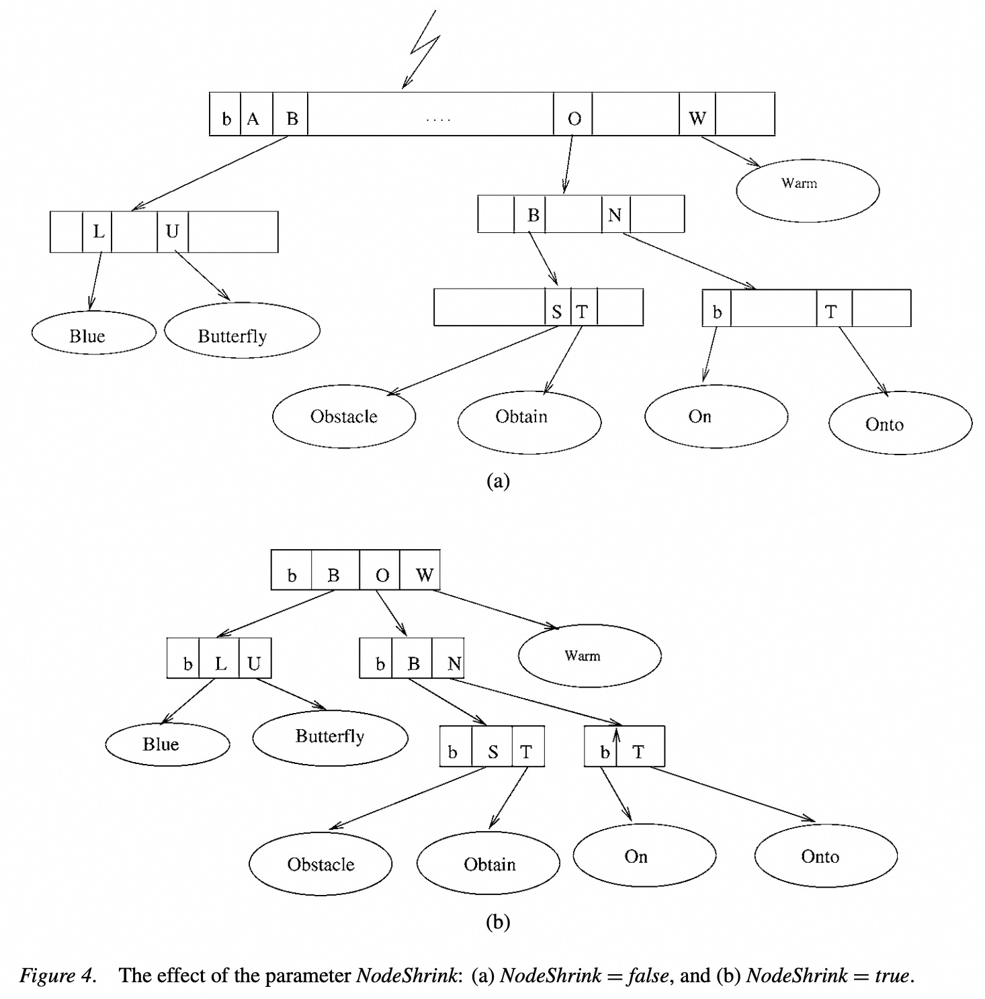  
* **表 1、2、3、4、5、6、7 (Table 1, 2, 3, 4, 5, 6, 7)**：这些表格通过具体的参数设置，展示了如何用 SP-GiST 框架来“实现”k-D 树、四叉树和 Trie 树等不同索引 。这部分是论文的核心，理解这些参数（如 `PathShrink`、`NodeShrink`、`BucketSize`、`NumberOfSpacePartitions`）以及外部方法（`Consistent`、`PickSplit`）的含义，是理解 SP-GiST 框架如何工作的基础 。 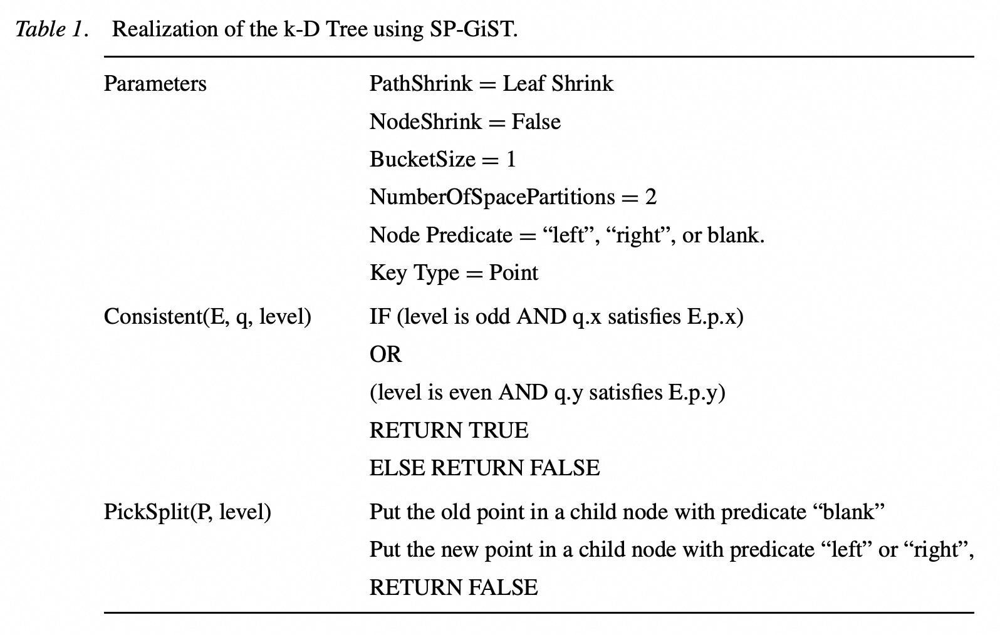  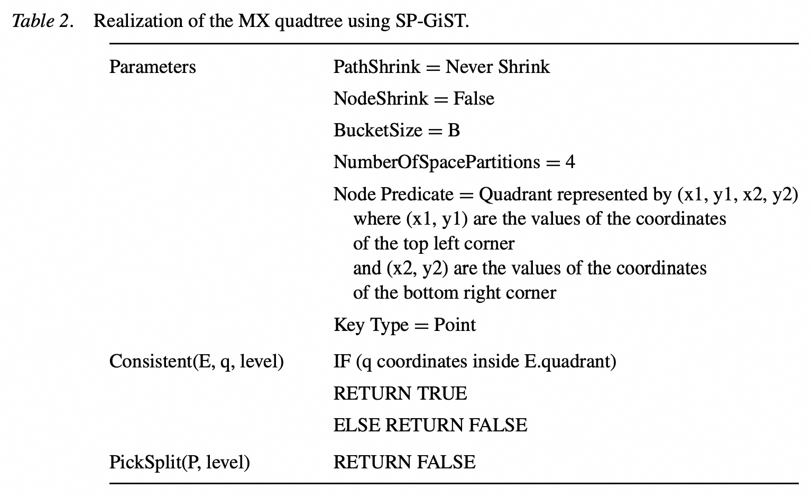  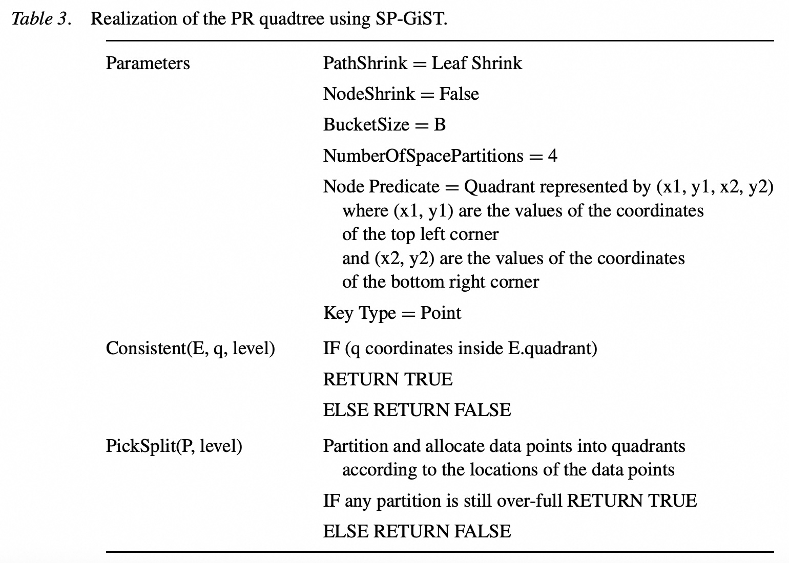  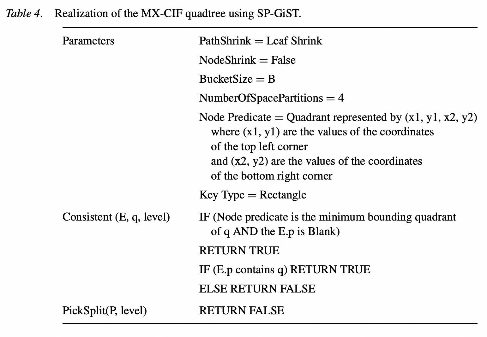  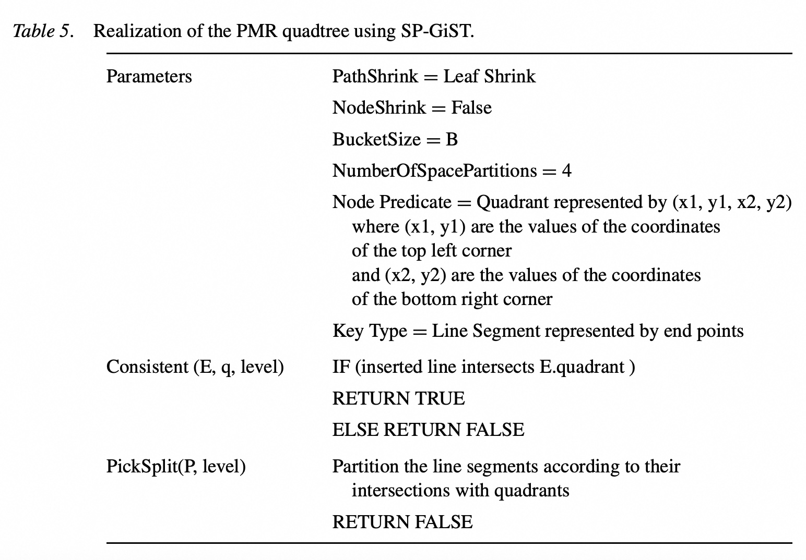  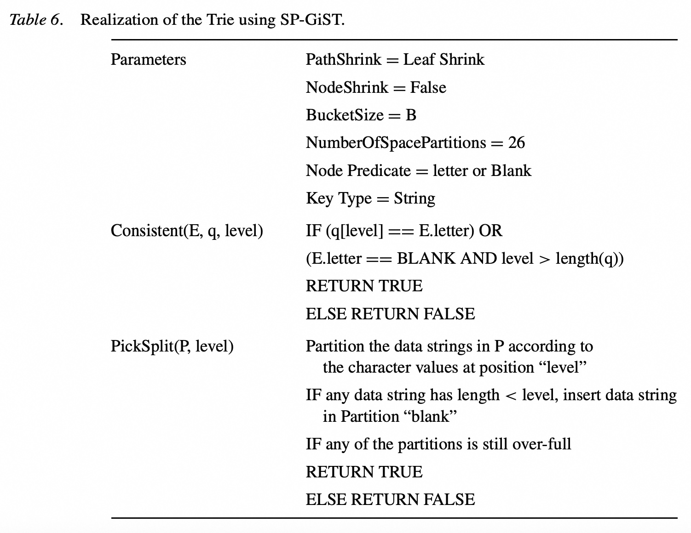 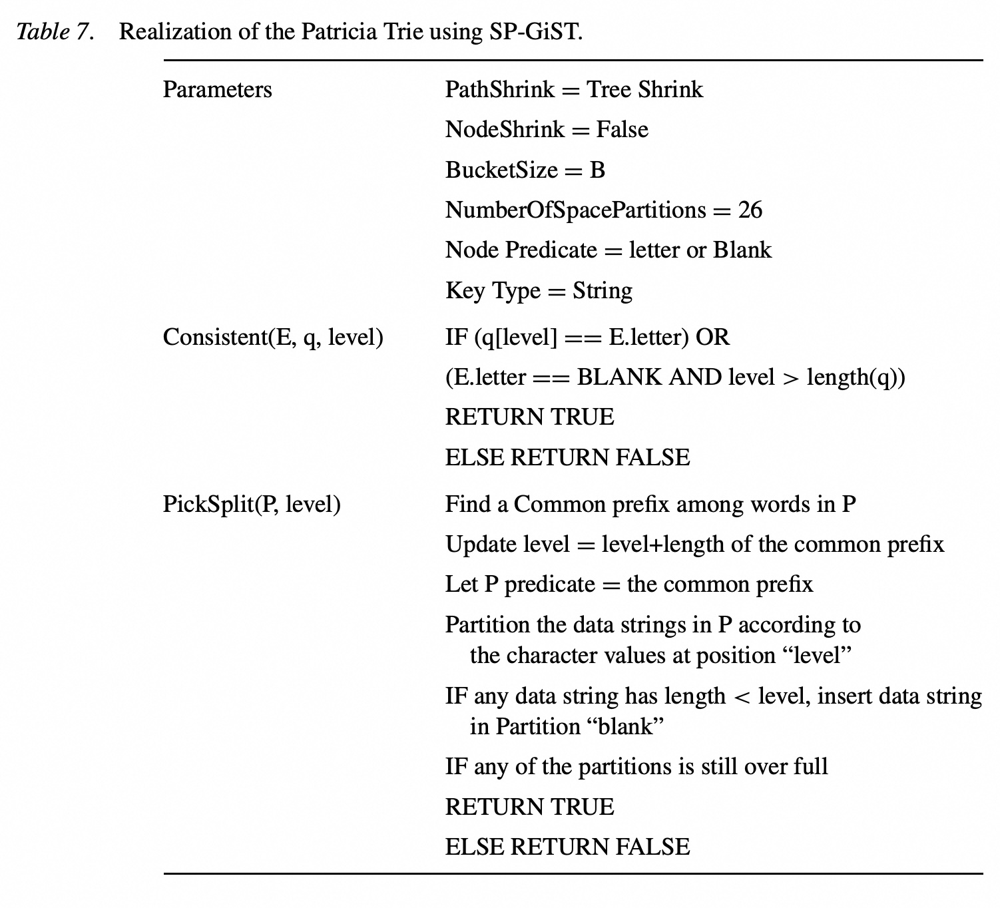   

这些基础知识涵盖了数据结构、数据库索引以及空间数据处理等领域，是理解 SP-GiST 论文如何作为一个通用框架，来支持不同空间分区树索引的关键。
  
## 2 解读论文 
  
好的，我们来通俗易懂地解读一下这篇相当有影响力的数据库索引论文——《SP-GiST: An Extensible Database Index for Supporting Space Partitioning Trees》。

我会将论文的核心内容拆解成几个关键问题，并结合论文中的图表进行讲解。

### 1\. 核心思想：这篇论文到底解决了什么问题？

想象一下，一个数据库系统就像一个巨大的工具箱。对于不同的任务，你需要不同的工具。B+树索引就像一把万能的螺丝刀，能解决很多问题（比如按ID查找用户），但如果你想拧一个六角螺母，它就不太好用了。

在现代数据库应用中，我们经常处理复杂的数据，比如地理位置（GIS）、图像（CAD/CAM）、数据挖掘等 。这些应用需要一些特殊的索引结构，比如：

  * **k-D树 (k-D tree)**：用于多维数据点搜索。
  * **四叉树 (Quadtree)**：用于二维空间数据划分，常用于地图和图像。
  * **字典树 (Trie)**：用于字符串或前缀匹配，比如搜索提示。

**面临的痛点是：**

1.  **实现成本高**：每一种新的索引结构，都需要数据库内核开发人员从头开始编写，并处理复杂的并发控制、事务恢复等问题，这是一项巨大的工程 。
2.  **I/O性能差**：很多这类树形结构（如k-D树、字典树）在理论上很高效，但在数据库中可能变得又“高”又“瘦” 。这意味着从树根走到叶子节点需要访问很多个磁盘页，导致I/O开销巨大，性能急剧下降。

**SP-GiST的解决方案：**

论文作者发现，k-D树、四叉树、字典树等虽然用途不同，但有一个共同的本质特征：它们都是**递归地将一个空间划分成多个互不重叠的子空间** 。作者将这类索引统一称为“**空间分区树 (Space-Partitioning Trees)**”。

SP-GiST (Space-Partitioning Generalized Search Tree) 的目标就是为这一整类“空间分区树”提供一个**统一的、可扩展的实现框架** 。数据库开发者只需要实现SP-GiST这一个核心框架，应用程序开发者则通过提供几个简单的“插件”（参数和方法），就能轻松地让SP-GiST“变身”成k-D树、四叉树、字典树或它们的各种变体 。这就好比提供了一个乐高积木的核心底座，用户可以用不同的积木块拼出各种想要的模型。

-----

### 2\. 什么是空间分区树 (Space Partitioning Trees)？

为了设计一个统一的框架，首先要理解这类树的共性和差异。论文将它们的区别归纳为两大类：

  * **结构性差异 (Structural Differences)** ：

      * `SD₁`: 它们处理的数据类型不同（点、单词、矩形等）。
      * `SD₂`: 每次空间分裂时，产生的子空间数量（分支数）不同（k-D树是2，四叉树是4，字典树是26个字母）。
      * `SD₃`: 空间分解的“分辨率”或停止条件不同 。
      * `SD₄`: 是否允许只有一个子节点的“单链”节点存在 。
      * `SD₅`: 叶子节点是否可以像“桶”一样存放多个数据项 。

  * **行为性差异 (Behavioral Differences)** ：

      * `BD₁`: 空间划分的原则不同。分为**数据驱动 (data-driven)** 和 **空间驱动 (space-driven)** 。
          * **数据驱动**：如何划分空间取决于已经插入的数据。例如，k-D树的分裂线是通过某个数据点来确定的 。
          * **空间驱动**：划分方式是预设好的，与数据无关。例如，四叉树总是将一个正方形“田”字形地切成四等份 。

SP-GiST框架的设计正是为了让用户能够通过配置来描述这些差异。

-----

### 3\. SP-GiST框架的核心：如何实现“可扩展性”？

SP-GiST的“可扩展性”主要通过两部分实现：**接口参数**和**外部方法**。这就像是填写一张配置表单，告诉SP-GiST你想要什么样的树。

#### A. 接口参数 (Interface Parameters)：像“积木”一样配置树的形态 

用户可以通过设置以下参数来定义树的基本结构：

1.  **`NumberOfSpacePartitions`**: 每次分裂产生的分区数 。例如，四叉树设为4，k-D树设为2。

2.  **`BucketSize`**: 叶子节点（桶）能容纳的最大数据项数量 。当超过这个数量时，节点需要分裂。

3.  **`PathShrink`**: 这是**一个非常关键的参数**，用于控制树的高度和路径压缩策略，直接影响树的形态和性能 。它有三个选项：

      * **`Never Shrink` (从不收缩)**：严格按照空间的最大分辨率进行划分，即使中间很多层都没有数据。这会导致树很高很稀疏 。
      * **`Leaf Shrink` (叶级收缩)**：数据被插入到第一个可用的叶子节点上，只在必要时才进行分裂 。这是最常见的策略。
      * **`Tree Shrink` (树级收缩)**：更进一步，将所有只有一个子节点的内部节点都合并掉，最大限度地压缩树的高度 。

    ***图解 `PathShrink` 对字典树的影响 (类似论文图3 )***

    假设我们要插入 "Space", "Spade", "Star" 这几个词：   

      * **(a) Never Shrink**: 严格按字母分裂，路径很长。
      * **(b) Leaf Shrink**: "Space" 和 "Spade" 在第三层 "a" 节点下就可以区分开，所以在这里分裂成叶子。
      * **(c) Tree Shrink**: "Space" 和 "Spade" 的共同前缀是 "spa"，但由于只有一个孩子，"s" -\> "p" -\> "a" 的路径被压缩成一个节点 "spa"。这就是**Patricia Trie**的实现方式。

    

    ```mermaid
    graph TD
        subgraph "(a) Never Shrink"
            S1 --> P1 --> A1 --> C1 --> E1[Space]
            A1 --> D1 --> E2[Spade]
            S1 --> T1 --> A2 --> R1[Star]
        end
        subgraph "(b) Leaf Shrink"
            S2 --> P2 --> A3
            A3 --> L_Space[Space]
            A3 --> L_Spade[Spade]
            S2 --> L_Star[Star]
        end
        subgraph "(c) Tree Shrink"
            S3 --> PA[pa]
            PA --> L_Space2[Space]
            PA --> L_Spade2[Spade]
            S3 --> L_Star2[Star]
        end
    ```

4.  **`NodeShrink`**: 决定是否要存储那些没有任何数据的“空”分区 。设为`true`可以节省存储空间，但节点会变成变长的 。如下图所示（类似论文图4 ），(a) `false`时保留了所有字母的槽位，(b) `true`时只保留有数据的分支，结构更紧凑。   

*(a) NodeShrink = false (保留所有分区槽位) (b) NodeShrink = true (只保留有数据的分区)*

#### B. 外部方法 (External Methods)：定义树的“行为” 

用户需要提供以下几个函数的具体实现，来定义树在搜索和分裂时的具体逻辑：

1.  **`Consistent(E, q, level)`**: 这是树的**导航员**。当进行搜索或插入时，它判断查询`q`是否与节点中的条目`E`（指向一个子空间）“一致”。如果一致，就需要进入这个子空间继续查找。例如，在四叉树中，`Consistent`会判断一个点的坐标是否落在某个象限内 。
2.  **`PickSplit(P, level)`**: 这是树的**分裂策略师**。当一个节点因为数据太多（超过`BucketSize`）而需要分裂时，这个函数决定如何将节点中的数据项`P`分配到`NumberOfSpacePartitions`个新的子节点中去 。例如，在k-D树中，它会根据当前层级的维度（x或y）来选择一个点作为分裂点 。
3.  **`Cluster()`**: 这是树的**物理存储规划师**。它定义了如何将逻辑上的树节点打包（聚类）到物理的磁盘页中，以减少I/O 。我们稍后会详细讲。

通过组合这些参数和方法，SP-GiST框架就能“扮演”各种不同的空间分区树。

-----

### 4\. 实践出真知：用SP-GiST实现具体的树

论文给出了用SP-GiST实现多种知名索引的“配置表”。这里我们看几个典型的例子：

| 索引类型 | 关键参数设置 | `Consistent` & `PickSplit` 逻辑 |
| :--- | :--- | :--- |
| **k-D 树**  | `PathShrink = Leaf Shrink` \<br\> `BucketSize = 1` \<br\> `NumPartitions = 2` | **数据驱动**。`Consistent`根据当前层级是奇数还是偶数，比较查询点的x或y坐标 。`PickSplit`将新旧两个点按规则放入左右子节点 。|
| **PR 四叉树**  | `PathShrink = Leaf Shrink` \<br\> `BucketSize = B` \<br\> `NumPartitions = 4` | **空间驱动**。`Consistent`判断查询点是否在象限内 。`PickSplit`将节点内的所有点按其所在的象限位置重新分配到4个子节点中 。|
| **字典树 (Trie)**  | `PathShrink = Leaf Shrink` \<br\> `BucketSize = B` \<br\> `NumPartitions = 26` | **空间驱动**。`Consistent`比较查询字符串在当前`level`的字符 。`PickSplit`根据当前`level`的字符将节点内的所有字符串分配到26个字母对应的子节点中 。|
| **Patricia 树**  | `PathShrink = Tree Shrink` \<br\> (其他与Trie类似) | **空间驱动**。与Trie类似，但`PickSplit`会先计算所有字符串的**共同前缀**，并将其作为父节点的谓词，从而实现路径压缩 。|

从上表可以看出，仅仅通过改变`PathShrink`等几个参数和`PickSplit`的逻辑，SP-GiST就能从一个普通的字典树摇身一变，成为更高效的Patricia树。

-----

### 5\. 数据库系统中的关键问题

除了可扩展性，SP-GiST还解决了两个在真实数据库系统中至关重要的问题。

#### A. 节点聚类 (Node Clustering) 与 I/O 优化

正如之前提到的，空间分区树很容易变得“又高又瘦”，如果一个节点对应一个磁盘页，查询性能会很差 。

SP-GiST通过`Cluster`方法解决了这个问题。它的核心思想是：**将树中逻辑上相邻且经常被一同访问的多个小节点，打包存放在同一个物理磁盘页中** 。

论文采用了一种**动态最小高度聚类算法**作为默认实现 。该算法的目标是尽可能地将一条从根到叶的路径上的节点放在一个页里，从而使得一次磁盘I/O就能遍历树的更多层级，大大减少了I/O次数，优化了查询性能 。同时，SP-GiST也允许用户根据自己的应用场景，提供自定义的聚类策略（如深度优先或广度优先聚类）。

#### B. 并发控制 (Concurrency Control)

在多用户同时读写数据库时，必须保证索引的正确性。SP-GiST指出，其独特的“数据节点分裂成索引节点”的特性，简化了并发控制 。当一个搜索操作路径上的节点被另一个插入操作分裂时，搜索操作不会像在B+树中那样需要复杂的“向右链接指针”来找到兄弟节点，而是自然地继续向下深入到新的子节点中，因为原来的叶子节点已经变成了索引节点 。这使得并发控制的设计比传统索引更为简单。

-----

### 6\. 总结与意义

《SP-GiST》这篇论文的重大贡献在于：

1.  **抽象与统一**：它识别并抽象了“空间分区树”这一大类数据结构的共同特征，为它们提供了一个统一的实现框架。
2.  **高度可扩展**：通过简洁的参数和方法接口，极大地降低了在数据库系统中引入新型索引的门槛，开发者不再需要“重复造轮子”。
3.  **实用性**：它不仅仅是一个理论框架，还通过节点聚类和并发控制等机制，解决了这类树在实际数据库环境中面临的I/O性能和多用户访问等核心问题，使其从“理论上的好结构”变成了“工程上可用的好索引”。

SP-GiST后来被著名的开源数据库 **PostgreSQL** 采纳为核心索引类型之一，这足以证明其理论的先进性和工程的实用性。它完美地诠释了计算机科学中“增加一个中间抽象层来解决几乎所有问题”的思想。
  
## 3 术语 
  
在《SP-GiST: An Extensible Database Index for Supporting Space Partitioning Trees》这篇论文中，有几个非常重要的核心术语，理解它们是掌握这篇论文精髓的关键。

### 1. SP-GiST (Space-Partitioning Generalized Search Tree)
**SP-GiST** 是这篇论文提出的一个新型数据库索引结构。可以把它理解为一个“通用工具箱”，专门用来高效地支持那些**递归地将空间进行划分**的树状数据结构。

* **为什么要发明它？** 传统的数据库索引（比如 B+树）主要用于一维数据（如数字、字符串），而面对像地理信息、数据挖掘等应用中的多维数据或复杂数据类型（如点、多边形），它们效率低下。SP-GiST 填补了这一空白，它通过提供一个可扩展的框架，让开发者能轻松构建各种空间索引，而不需要从头开始写代码。

---

### 2. 空间分区树 (Space-Partitioning Trees)
这是 SP-GiST 索引支持的核心对象。这类树的共同特点是**将一个大的空间不断地分割成越来越小的区域**，直到每个区域都包含少量或一个数据点。论文中提到了几种典型的空间分区树：

* **Trie 树 (Trie)**：又叫前缀树，主要用于存储字符串。它根据字符串的字符序列来划分空间。例如，可以想象一个字典，所有以"A"开头的单词都在一个分支下，所有以"B"开头的在另一个分支下。论文的**图 2** 形象地展示了这种结构。   

* **四叉树 (Quadtree)**：主要用于二维空间（例如地图）。它将一个正方形区域递归地划分为四个相等的子区域（左上、右上、左下、右下）。这种划分方式非常直观，论文的**图 1** 就是一个典型的四叉树示例。   

* **k-D 树 (k-D tree)**：这是一种根据数据点来划分空间的树。它交替地在不同维度上（例如，先按 x 轴，再按 y 轴）选择一个点作为中位线，将空间一分为二。论文的**图 5** 展示了一个二维 k-D 树如何划分数据点。   

---

### 3. GiST (Generalized Search Tree)
**GiST** 是 SP-GiST 的“前身”。它是一个更早提出的通用索引框架，旨在让用户能为各种数据类型创建自定义索引，比如 R 树。但是，GiST 的设计假定树是平衡的，并且每个节点的分裂操作相对简单。

* **SP-GiST 与 GiST 的区别**：空间分区树（特别是四叉树和 Trie 树）通常是**非平衡**的，有的分支可能非常深，有的则很浅。GiST 很难有效地处理这种不平衡的结构，因为它可能导致性能问题。SP-GiST 正是为了克服 GiST 的这一局限性而诞生的。

---

### 4. 节点聚类 (Node Clustering)
这是一个性能优化技术。在数据库中，数据是存储在磁盘上的，每次读取一个节点（即一个页面）都需要一次磁盘 I/O。如果树的节点在磁盘上是分散的，那么遍历树时会产生大量的随机磁盘 I/O，非常耗时。

* **作用**：**节点聚类**的目标是把树中经常被一起访问的节点（比如父节点和它的子节点）物理地存储在磁盘上相邻的位置。这可以显著减少磁盘 I/O 次数，从而提高索引的查询效率。论文特别强调，对于非平衡树，节点聚类是其在数据库系统中高效运行的关键。

---

### 5. 调优参数 (Tuning Parameters)
SP-GiST 框架之所以灵活，是因为它允许开发者通过设置一系列参数来控制索引的行为。这使得同一个 SP-GiST 框架能够“模拟”出不同的空间分区树。论文中的表格（如**表 1 至表 7**）详细列举了这些参数，并展示了如何通过它们来配置四叉树、k-D 树和 Trie 树。

* **`PathShrink`**：这个参数用于控制树的路径长度。如果一个路径太长，它会让这个路径上的节点收缩（shrink），从而避免树变得过深。
* **`NodeShrink`**：这个参数决定了是否保留空的分区。例如，在四叉树中，一个节点可能只有两个子区域有数据，`NodeShrink` 就可以决定是否要为另外两个空的子区域创建节点。
  

              

## 参考        
         
https://www.cs.purdue.edu/spgist/papers/W87R36P214137510.pdf    
        
<b> 以上内容基于DeepSeek、Qwen、Gemini及诸多AI生成, 轻微人工调整, 感谢杭州深度求索人工智能、阿里云、Google等公司. </b>        
        
<b> AI 生成的内容请自行辨别正确性, 当然也多了些许踩坑的乐趣, 毕竟冒险是每个男人的天性.  </b>        
    
#### [期望 PostgreSQL|开源PolarDB 增加什么功能?](https://github.com/digoal/blog/issues/76 "269ac3d1c492e938c0191101c7238216")
  
  
#### [PolarDB 开源数据库](https://openpolardb.com/home "57258f76c37864c6e6d23383d05714ea")
  
  
#### [PolarDB 学习图谱](https://www.aliyun.com/database/openpolardb/activity "8642f60e04ed0c814bf9cb9677976bd4")
  
  
#### [PostgreSQL 解决方案集合](../201706/20170601_02.md "40cff096e9ed7122c512b35d8561d9c8")
  
  
#### [德哥 / digoal's Github - 公益是一辈子的事.](https://github.com/digoal/blog/blob/master/README.md "22709685feb7cab07d30f30387f0a9ae")
  
  
#### [About 德哥](https://github.com/digoal/blog/blob/master/me/readme.md "a37735981e7704886ffd590565582dd0")
  
  

  
