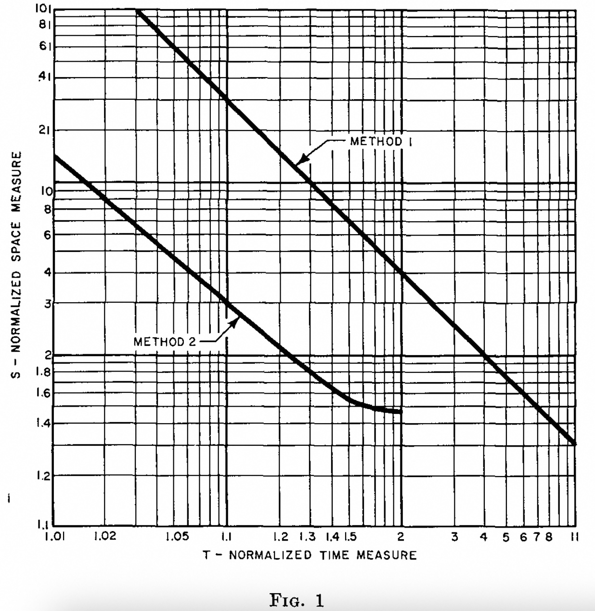
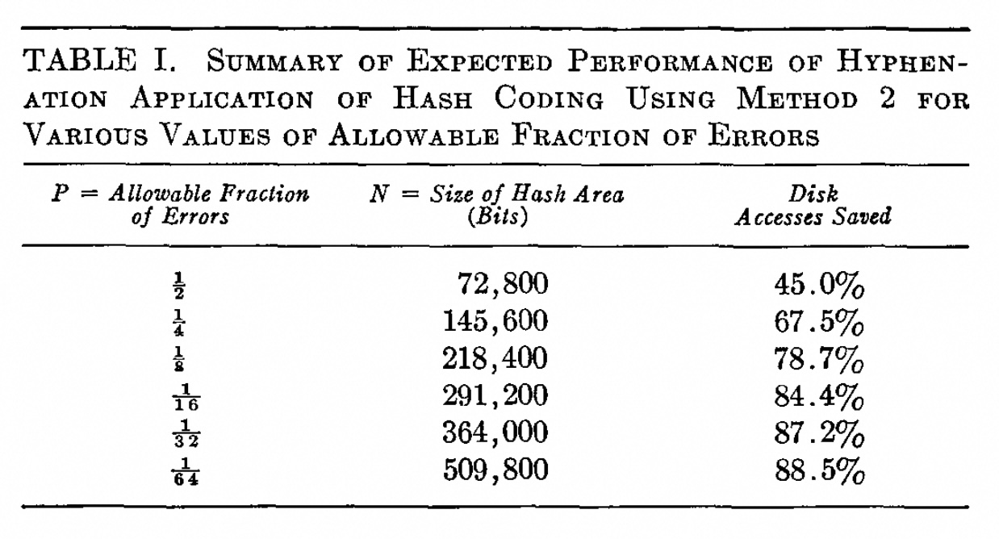
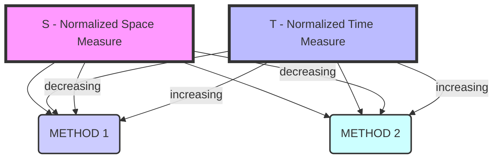

## AI论文解读 | Space/Time Trade-offs in Hash Coding with Allowable Errors
        
### 作者        
digoal        
        
### 日期        
2025-09-05       
        
### 标签        
PostgreSQL , PolarDB , DuckDB , AI , 论文解读        
        
----        
        
## 背景  
      
https://dl.acm.org/doi/pdf/10.1145/362686.362692        
  
提示:          
```          
读懂《Space/Time Trade-offs in Hash Coding with Allowable Errors》这篇论文需要提前掌握哪些基础知识, 请使用中文通熟易懂的讲解这些基础知识, 可以引用论文中的图、表或使用Markdown支持的图形(text,mermaid等)增加解释性. 
  
使用中文通熟易懂的解读《Space/Time Trade-offs in Hash Coding with Allowable Errors》这篇论文, 其中的关键内容请着重讲解, 可以引用论文中的图、表或使用Markdown支持的图形(text,mermaid等)增加解释性. 
  
提取《Space/Time Trade-offs in Hash Coding with Allowable Errors》这篇论文中的重要术语, 使用中文对这些术语进行通熟易懂的讲解, 可以引用论文中的图、表或使用Markdown支持的图形(text,mermaid等)增加解释性. 
```     
  
## 1 前置知识 
  
读懂这篇关于哈希编码的论文，你需要先了解以下几个关键的基础概念。

### 1\. 哈希编码 (Hash Coding)

哈希编码，也称为散列寻址（hash addressing）或散列存储（scatter storage），是一种数据存储和检索技术，旨在快速查找信息 。

想象一下，你有一大堆文件，需要把它们按某个规则整理好，以便日后能迅速找到某一份。传统的做法可能是按字母顺序排序，或者放到一个很长的列表里逐一查找。但哈希编码提供了一种更高效的思路：

1.  **哈希函数 (Hash Function):** 这是一个特殊的函数，可以将你想要存储的任何信息（比如论文中提到的“消息”或“单词”）转换成一个唯一的、或接近唯一的数字地址 。
2.  **哈希区域 (Hash Area):** 这是一块专门用于存储哈希编码信息的内存区域，它被组织成一个个“单元格”（cells） 。
3.  **存储过程:** 当你有一个新的信息要存储时，哈希函数会计算出一个地址。然后，系统会把这个信息放到哈希区域里对应的那个单元格里 。

论文中提到的**传统哈希编码方法**就是这种思路 。它通过一个迭代的伪随机计算过程，为每个信息生成哈希地址，并把信息存储在哈希区域的空单元格中 。

### 2\. 传统哈希编码的查找过程

当你需要检查一个信息是否在你的文件堆里时，你会使用相同的哈希函数计算出它的哈希地址，然后去对应的单元格里查找 。

  * 如果这个单元格是空的，那说明你要找的信息肯定不在那里，因为如果它在，这个单元格就不会空 。查找结束，这个信息被“拒绝”（rejected） 。
  * 如果这个单元格不空，系统会比较单元格里的内容和你正在查找的信息。如果两者完全匹配，说明信息找到了，它被“接受”（accepted） 。
  * 如果单元格里的内容不匹配，说明发生了“哈希冲突”（hash collision），即不同的信息被哈希到同一个地址了。这时，系统会生成下一个哈希地址，继续查找，直到找到匹配项或空单元格为止 。

### 3\. 权衡取舍 (Trade-offs)

这篇论文的核心思想是探讨哈希编码中的几种“权衡取舍”关系 。你可以把这看作一个天平：当你试图优化某一方面时，可能需要牺牲另一方面。论文主要分析了三个因素之间的关系：

1.  **空间 (Space):** 指的是哈希区域的大小 。
2.  **时间 (Time):** 指的是查找一个信息并确定其不在给定集合中所需的平均时间，论文称之为“拒绝时间”（reject time）。
3.  **允许的错误率 (Allowable Errors):** 指的是允许一小部分信息被错误地识别为集合成员的频率 。这被称为“假阳性”（false positive）或“允许的错误”（allowable error）。

这篇论文认为，在某些应用中，如果允许一定程度的假阳性错误，就可以大幅减少所需的哈希区域空间，而且不会增加查找时间 。

### 4\. 论文中提出的两种新方法

这篇论文提出了两种新的哈希编码方法，其目的都是为了通过允许少量的错误来减少所需的空间 。

  * **方法1 (Method 1):** 这是对传统方法的修改 。它不是将整个消息存储在单元格中，而是只存储一个更小的“代码”（code），这个代码是从原始消息生成的 。由于代码比原始消息短，可能会有不同的消息生成相同的代码，从而导致错误 。通过调整代码的大小，可以在错误率和空间之间进行权衡 。

  * **方法2 (Method 2):** 这种方法完全摒弃了“单元格”的概念，而是将哈希区域视为一个巨大的、由可寻址的单个比特（bits）组成的数组 。

      * **存储过程:** 对于每个要存储的消息，哈希函数会生成多个（比如 $d$ 个）不同的比特地址 。然后，系统会把这些地址上的比特值都设为1 。
      * **查找过程:** 当你查找一个新消息时，同样生成多个（ $d$ 个）比特地址 。如果这些地址上的所有比特值都是1，则该消息被“接受” 。只要有一个比特是0，则该消息被“拒绝” 。

**为什么方法2能够减少空间？**
因为你不需要存储完整的消息或代码，你只需要存储一堆1或0的比特。论文通过数学分析证明，在相同的错误率和时间下，方法2比方法1需要的空间更少，因为它能更有效地利用哈希区域 。论文中用了一个名为“S-归一化空间测量”的指标来比较这两种方法的空间效率，图1清楚地展示了这一点：方法2的曲线（"METHOD 2"）明显在方法1的曲线（"METHOD 1"）之下，这意味着在相同的“T-归一化时间测量”下，方法2所需的空间更小。    

### 5\. 应用场景

论文中讨论了新方法的一个具体应用场景：自动连字程序 。

  * **问题:** 假设一个程序需要对50万个单词进行连字。其中90%的单词可以通过简单的规则处理，但有10%（5万个）需要查字典 。如果字典太大，无法装入主存（core memory），就需要放在速度较慢的磁盘上 。
  * **传统方法的问题:** 如果使用传统方法，整个哈希区域可能太大，无法放入主存，从而导致频繁的磁盘访问，影响性能 。
  * **新方法的解决方案:** 通过使用方法2并允许一定的错误率（比如 $P = 1/16$），所需的哈希区域可以大幅减小，小到可以放入主存 。这样一来，对于绝大多数单词，程序可以直接通过哈希查找来确定它们是否属于那需要查字典的10%，而无需访问磁盘。只有当哈希查找结果显示该单词“可能属于”那10%时（包括了少数的假阳性错误），程序才会去访问磁盘进行二次确认 。这种方法显著减少了磁盘访问次数，从而提升了整体性能 。

-----

通过理解这些概念，你就能更好地掌握这篇论文的核心论点：**通过在某些特定应用中允许少量的假阳性错误，可以在不牺牲查找时间的前提下，显著减少哈希编码所需的存储空间。**
  
## 2 解读论文 
  
好的，我们来一起解读这篇发表于1970年的经典论文——《Space/Time Trade-offs in Hash Coding with Allowable Errors》（允许错误的哈希编码中的空间/时间权衡）。这篇论文的作者是 Burton H. Bloom，他提出的其中一种方法后来被称为“布隆过滤器”（Bloom Filter）。

这篇论文的核心思想是：**在某些场景下，我们可以通过容忍非常小概率的“误判”（False Positive），来极大地节省存储空间，同时又不牺牲处理速度**。

-----

### **1. 论文要解决的问题是什么？**

想象一个场景：你需要判断一个数据（比如一个单词、一个网址或一个用户名）是否存在于一个非常庞大的集合中。

  * **常规做法**：最直接的方法是把这个集合的所有数据都存起来（例如放在数据库或一个巨大的哈希表里），然后每次都去查找。
  * **问题所在**：当这个集合非常大时，存储它需要海量的内存或硬盘空间。如果数据量大到内存放不下，就必须存储在硬盘上，每次查询都会涉及缓慢的I/O操作，导致性能急剧下降 。

这篇论文探讨的就是如何解决这个 **“空间”** 和 **“时间”** 的矛盾，并引入了第三个维度—— **“可容忍的错误率”** 。

### **2. 论文提出了两种创新的哈希方法**

为了与新方法进行对比，论文首先回顾了一种传统的、无错误的哈希编码方法。这种方法是将完整的数据存储在哈希表的单元格（cell）中 。如果发生哈希冲突，则继续寻找下一个空的单元格 。

在此基础上，作者提出了两种允许错误的新方法，旨在显著减少存储空间 。

#### **方法一：使用“编码”代替“原文”**

这种方法是对传统哈希方法的直接改进。

  * **核心思想**：我们不在哈希表的单元格里存储完整的数据原文，而是存储一个由数据原文生成的、长度较短的“编码”（code） 。
  * **工作流程**：
    1.  当要存储一个数据时，先计算它的哈希地址，找到对应的单元格。
    2.  然后，为这个数据生成一个固定长度的短编码（例如，将一个很长的网址缩短为16位的编码）。
    3.  将这个短编码存入单元格。
  * **如何产生错误**：因为编码比原文短，所以不同的原文可能会生成相同的编码。这就导致了“误判”：当查询一个**不存在**的数据时，它的编码可能恰好与集合中某个数据的编码相同，系统会错误地认为它“存在” 。
  * **空间节省**：单元格大小从存储整个消息（例如b位）缩小到只存储一个c位的编码（c \< b），从而节省了空间 。错误率P越低，c就需要越大 。

#### **方法二：颠覆性的“位数组”思想（布隆过滤器的雏形）**

这是本文最具创新性的方法，它完全抛弃了“单元格”和“存储原文/编码”的概念 。

  * **核心思想**：使用一个很长的位数组（bit array），所有位初始都为0 。对于集合中的每一个数据，我们用多个不同的哈希函数计算出多个位置，并将这几个位置的二进制位都设置为1 。

  * **工作流程**：

      * **存储**：

        1.  准备一个长度为N的位数组，全部初始化为0。
        2.  对于集合中的每一个数据（例如 `m1`），用d个不同的哈希函数（`hash1`, `hash2`, ..., `hashd`）计算出d个不同的位置（`a1`, `a2`, ..., `ad`）。
        3.  将位数组中这d个位置的 bit 全部置为 `1` 。
        4.  对集合中所有的数据重复此操作。最终，这个位数组就成了该数据集合的“摘要”或“指纹”。

      * **查询**：

        1.  当要查询一个新数据（例如 `m_test`）是否存在时，同样用那d个哈希函数计算出d个位置（`a'1`, `a'2`, ..., `a'd`）。
        2.  检查位数组中这d个位置的 bit 是否**全部**为 `1` 。
        3.  **如果全部为1**，则认为该数据**可能存在**于集合中（被接受） 。
        4.  **如果其中任何一个不为1**，则可以**100%确定**该数据**绝对不存在**于集合中（被拒绝） 。

  * **如何产生错误**：误判（False Positive）发生在这里：一个**不存在**的数据，经过d个哈希函数计算出的位置，可能因为之前存储其他数据时，恰好都被置为了1。这时系统会误判它“存在”。但反过来，如果一个数据真的**存在**，那么查询时对应的d个位必然都是1，所以**不会发生漏判**（False Negative）。

### **3. 关键因素的权衡：空间、时间与错误率**

论文对这三种方法进行了数学分析，引入了几个标准化的度量：

  * **标准化时间 (T)**：指拒绝一个不存在于集合中的数据平均需要测试多少个 bit 。T越小，拒绝速度越快。
  * **标准化空间 (S)**：为了消除数据集大小(n)和错误率(P)的影响，作者定义了一个标准化的空间度量 `S = N / (-n * log₂P)` 。S越小，代表空间效率越高。
  * **错误率 (P)**：指被错误地识别为集合成员的数据占所有非成员数据的比例 。

#### **方法一 vs. 方法二**

通过数学推导和图表分析，论文得出了一个非常重要的结论：**在相同的时空效率要求下，方法二通常优于方法一** 。

我们可以通过论文中的`图1`直观地看到这一点：

```text
            ▲ S (标准化空间)
            │
         10 ┼─────────┬─────────┬──
            │        /          │
          8 ┼       / Method 1  │
            │      /            │
          4 ┼     /             │
            │    /              │
          2 ┼───/───────────────┼────
            │  / \              │
        1.4 ┼─/───` Min Point   │
            │/     \ Method 2   │
          1 ┼┴─────────┴─────────┴──► T (标准化时间)
            1         2         4
```

  

**图1解读**:

  * **坐标轴**: 横轴(T)代表时间，越往右时间越长；纵轴(S)代表空间，越往上空间越大 。理想的方法应该在左下角。
  * **曲线对比**: 明显可以看出，`Method 2`的曲线完全在`Method 1`的左下方 。这意味着在**任何给定的时间(T)下，方法二所需的空间(S)都更小**；或者在**任何给定的空间(S)下，方法二的查询时间(T)都更短**。
  * **方法二的最佳点**: 方法二的曲线在 `T=2` 时达到了空间最优（S最小） 。此时对应的位数组中，`0`和`1`的数量恰好各占一半 。

### **4. 实际应用案例：自动断词**

为了让读者理解这种方法的实际价值，论文举了一个自动断词（Hyphenation）的例子 。

  * **场景**: 假设一个程序需要处理50万个英文单词的断词。其中90%（45万个）可以通过简单的规则处理，但剩下10%（5万个）是例外，需要查询一个巨大的、无法完全加载到内存的磁盘字典 。
  * **传统方法的痛点**: 如果每次都去查字典，即使大部分时候查不到，也会产生大量的磁盘访问，性能极差。
  * **使用方法二的解决方案**:
    1.  将那5万个需要查字典的“例外词”用方法二构建一个布隆过滤器，并将其放入内存。这个过滤器很小，内存完全可以容纳。
    2.  当来一个新单词时，先用这个内存中的过滤器判断。
    3.  如果过滤器说“不存在”，那么就100%确定它不属于那5万个例外词，直接用简单规则处理即可，**避免了磁盘访问**。
    4.  如果过滤器说“可能存在”，我们才去访问磁盘上的字典做最终确认 。由于存在一定的误判率，这次访问磁盘后可能会发现字典里其实没有这个词（这就是“可容忍的错误”），但这种情况发生的频率是可控的。

论文中的`表I`展示了不同错误率(P)下的性能表现：   

| P (可容忍的错误率) | N (哈希区大小/比特) | 节省的磁盘访问 |
| :--- | :--- | :--- |
| 1/16 (约6.25%) | 291,200 | 84.4% |
| 1/32 (约3.13%) | 364,000 | 87.2% |
| 1/128 (约0.78%) | 509,800 | 88.5% |

**表格解读**:

  * 相比传统方法需要约2,000,000比特的空间 ，即使我们只容忍很小的错误率，例如`1/16`，也只需要不到30万比特的空间就可以构建过滤器 。
  * 在这种情况下，原本需要对45万个“好词”也进行磁盘查询的流程，现在被大大优化了。最终，可以**减少84%的磁盘访问次数** 。这是一个巨大的性能提升。

### **结论**

这篇论文在计算机科学领域具有里程碑式的意义。它开创性地提出，通过接受一个可控的、极小的“单向错误”（只存在误判，不存在漏判），可以在处理大规模数据集的成员资格问题时，实现空间和时间效率的巨大优化。文中所描述的“方法二”就是今天被广泛应用于网络安全、数据库、大数据系统等领域的**布隆过滤器**。
  
## 3 术语 
  
根据你提供的论文内容，以下是一些重要的术语及其通俗易懂的中文解释：

-----

### 哈希编码 (Hash Coding)

哈希编码是一种将数据（论文中称为“消息”）映射到特定存储地址的技术，目的是为了快速查找信息 。想象一下，你有一堆书，不是按书名排序，而是根据一个规则（哈希函数）把它们放在不同的书架位置上。当你需要找某本书时，你用同样的规则计算出它应该在哪个位置，然后直接去那个位置找 。这比一本本翻找要快得多。

-----

### 哈希区域 (Hash Area)

哈希区域是专门用于存储哈希编码信息的内存区域 。它就像是你的图书馆，被划分成一个个单元格（cells）来存放数据 。论文中讨论的核心问题之一，就是如何通过改变哈希区域的大小（空间）来影响查找效率（时间）和允许的错误率 。

-----

### 空间/时间权衡 (Space/Time Trade-offs)

这是论文的核心概念 。它指的是在计算中，存储空间（space）和处理时间（time）之间的取舍关系 。通常情况下，如果你想节省空间，可能需要花更多的时间来处理；反之，如果你想加快处理速度，可能需要更多的存储空间。这篇论文探讨了通过引入“允许的错误”这一新因素，如何改变这种传统的权衡关系 。

-----

### 拒绝时间 (Reject Time)

拒绝时间是指在哈希查找过程中，确定一个测试消息不属于给定集合所需的平均时间 。这个术语非常重要，因为它定义了论文中衡量“时间”效率的标准。论文提出，在许多实际应用中，绝大多数被测试的消息都不属于给定的集合，因此，衡量哈希方法优劣的关键在于它处理这些“非成员”消息的速度 。

-----

### 允许的错误 (Allowable Errors)

允许的错误，也称为“错误频率”，指的是一小部分不属于给定集合的消息，被错误地识别为集合成员的频率 。论文指出，在一些数据量巨大且哈希区域无法完全放入主存的应用中，允许这些错误的发生可以显著减小哈希区域的大小 。

例如，论文中讨论的自动连字程序，有90%的单词可以通过简单规则处理，只有10%需要查字典 。如果允许少量不属于这10%的单词被错误地识别为需要查字典，那么哈希区域就可以做得足够小，从而常驻在内存中 。

-----

### 两种新方法 (Two New Hash-coding Methods)

为了实现空间和时间上的新权衡，论文提出了两种方法：

  * **方法1 (Method 1):** 在传统哈希方法的基础上进行修改。它将每个消息编码成一个比消息本身更小的**代码**，然后存储和测试这个代码 。由于不同的消息可能产生相同的代码，这就会导致错误 。通过调整代码的大小，可以控制错误率和哈希区域大小 。

  * **方法2 (Method 2):** 这种方法完全不同于传统的基于单元格的组织方式 。它将整个哈希区域看作是一个巨大的比特（bit）数组 。对于每个消息，哈希函数会生成多个比特地址，并将这些地址上的比特值都设为1 。在测试时，如果一个新消息生成的所有比特地址上的值都是1，则被接受；只要有一个比特是0，则被拒绝 。

### 归一化空间测量 (Normalized Space Measure, S) 和归一化时间测量 (Normalized Time Measure, T)

为了更公平地比较不同方法，论文引入了这两个归一化指标：

  * **S (归一化空间测量):** 定义为 $S=N/(-n \\cdot \\log\_2 P)$ 。这个指标消除了消息集合大小 $n$ 和允许错误率 $P$ 的影响，只反映哈希区域大小 $N$ 和这些因素的关系 。
  * **T (归一化时间测量):** 定义为 $T = \\text{mean}\_{m\_i \\in \\hat{a}}(t\_i)$ 。这个指标代表了拒绝一个消息所需的平均时间，单位是计算和访问一个比特地址的时间 。

通过这两个指标，论文的图1（如下所示）清晰地展示了方法1和方法2在空间和时间上的权衡关系。

  



图1显示，在任何给定的时间测量 $T$ 下，方法2所需的归一化空间 $S$ 总是小于方法1 。这证明了方法2在空间效率上的优越性 。
  
## 参考        
         
https://dl.acm.org/doi/pdf/10.1145/362686.362692    
        
<b> 以上内容基于DeepSeek、Qwen、Gemini及诸多AI生成, 轻微人工调整, 感谢杭州深度求索人工智能、阿里云、Google等公司. </b>        
        
<b> AI 生成的内容请自行辨别正确性, 当然也多了些许踩坑的乐趣, 毕竟冒险是每个男人的天性.  </b>        
    
#### [期望 PostgreSQL|开源PolarDB 增加什么功能?](https://github.com/digoal/blog/issues/76 "269ac3d1c492e938c0191101c7238216")
  
  
#### [PolarDB 开源数据库](https://openpolardb.com/home "57258f76c37864c6e6d23383d05714ea")
  
  
#### [PolarDB 学习图谱](https://www.aliyun.com/database/openpolardb/activity "8642f60e04ed0c814bf9cb9677976bd4")
  
  
#### [PostgreSQL 解决方案集合](../201706/20170601_02.md "40cff096e9ed7122c512b35d8561d9c8")
  
  
#### [德哥 / digoal's Github - 公益是一辈子的事.](https://github.com/digoal/blog/blob/master/README.md "22709685feb7cab07d30f30387f0a9ae")
  
  
#### [About 德哥](https://github.com/digoal/blog/blob/master/me/readme.md "a37735981e7704886ffd590565582dd0")
  
  

  
