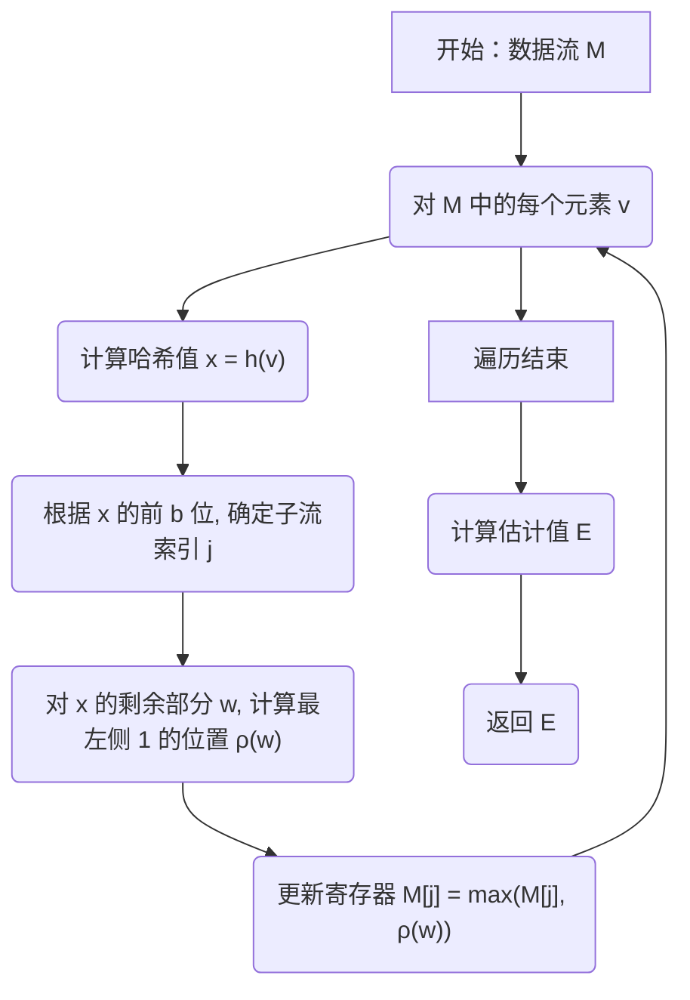
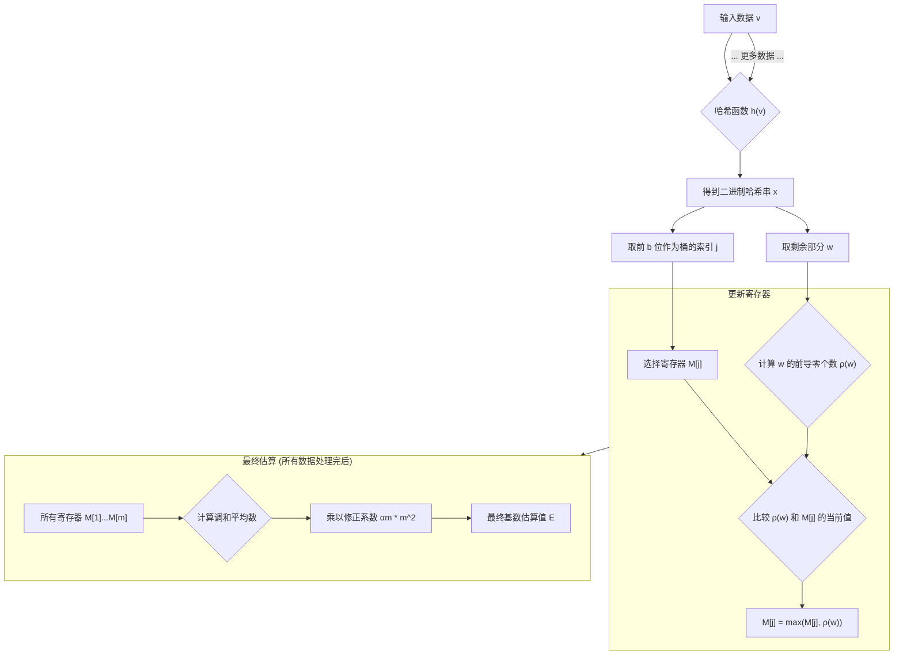
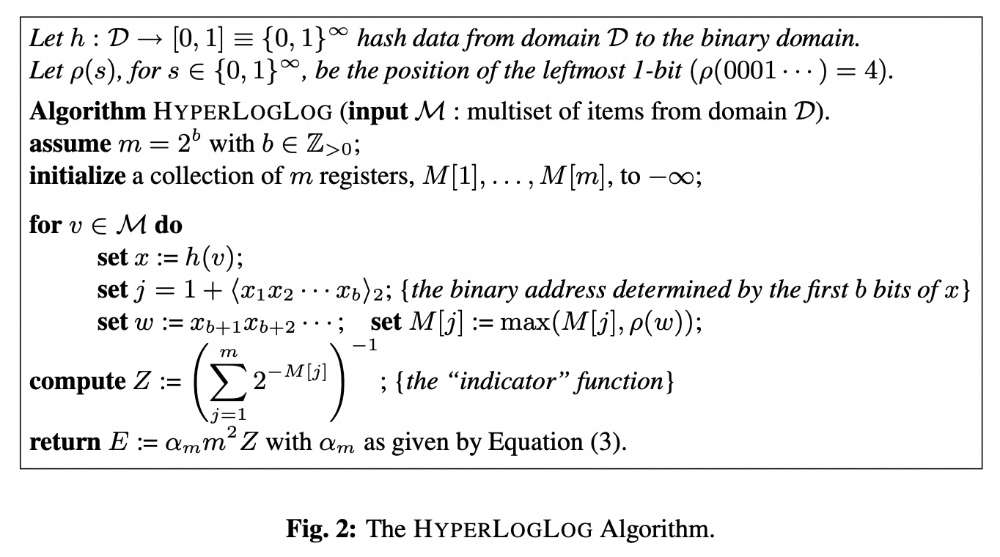
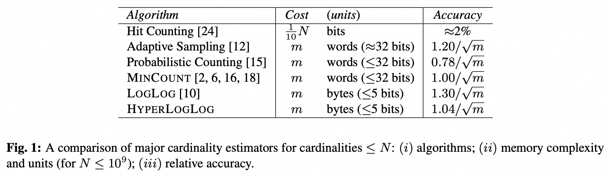
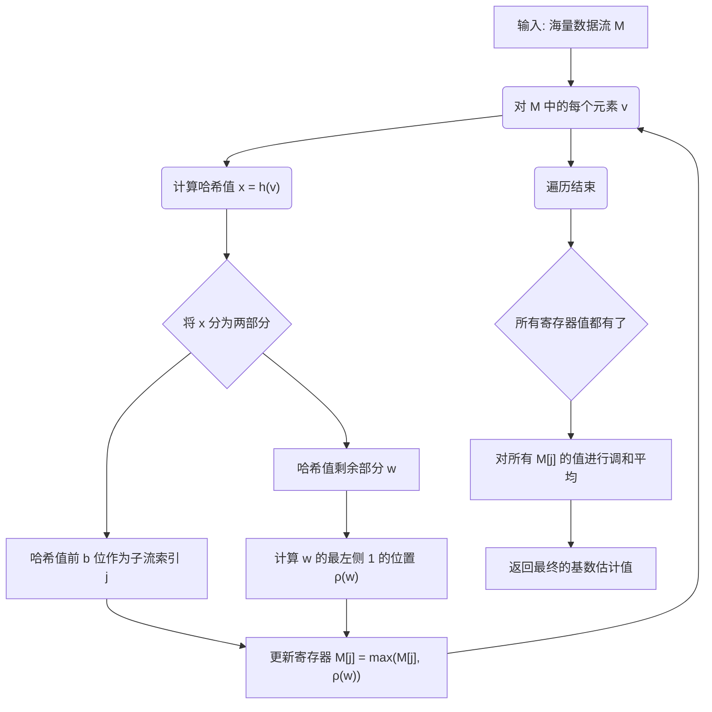

## AI论文解读 | HyperLogLog: the analysis of a near-optimal cardinality estimation algorithm
        
### 作者        
digoal        
        
### 日期        
2025-09-05       
        
### 标签        
PostgreSQL , PolarDB , DuckDB , AI , 论文解读        
        
----        
        
## 背景  
      
https://algo.inria.fr/flajolet/Publications/FlFuGaMe07.pdf        
  
提示:          
```          
读懂《HyperLogLog: the analysis of a near-optimal cardinality estimation algorithm》这篇论文需要提前掌握哪些基础知识, 请使用中文通熟易懂的讲解这些基础知识, 可以引用论文中的图、表或使用Markdown支持的图形(text,mermaid等)增加解释性. 
  
使用中文通熟易懂的解读《HyperLogLog: the analysis of a near-optimal cardinality estimation algorithm》这篇论文, 其中的关键内容请着重讲解, 可以引用论文中的图、表或使用Markdown支持的图形(text,mermaid等)增加解释性. 
  
提取《HyperLogLog: the analysis of a near-optimal cardinality estimation algorithm》这篇论文中的重要术语, 使用中文对这些术语进行通熟易懂的讲解, 可以引用论文中的图、表或使用Markdown支持的图形(text,mermaid等)增加解释性. 
```     
  
## 1 前置知识 
  
您好！为了读懂《HyperLogLog: the analysis of a near-optimal cardinality estimation algorithm》这篇论文，您需要掌握以下几个方面的基础知识。论文的难点在于其严谨的数学分析，但核心思想是相对直观的。

-----

### 1\. 核心问题：基数（Cardinality）估计

  * **什么是基数？** 简单来说，基数就是一个集合中不重复元素的数量 。比如，集合 `{1, 2, 2, 3, 4, 4}` 的基数是 4。
  * **为什么要估计？** 当数据量（例如网络数据流或大规模数据库）非常庞大时，将所有不重复的元素都存储下来以获取精确基数是不现实的，因为这需要巨大的内存 。因此，需要一种节省内存、但能给出近似结果的**概率性算法** 。
  * **HyperLogLog 的目标：** 论文介绍的 HyperLogLog (HLL) 算法，就是为了以极小的内存代价，高效地估计海量数据集的基数 。论文指出，它只需要一次遍历数据，并且估计精度很高 。

-----

### 2\. 概率性算法与哈希函数

  * **随机化（Randomization）**：所有高效的基数估计算法都依赖于随机化技术，这通常是通过哈希函数来实现的 。
  * **哈希函数（Hash Function）**：将任意输入数据转换成一个固定长度的二进制字符串。论文假设这个哈希函数是理想的，即产生的哈希值近似于均匀随机分布 。
  * **哈希值与随机数**：在论文中，一个数据项经过哈希函数处理后，其哈希值被视为一个在 `[0, 1]` 区间内的无限长二进制字符串或实数 。这个哈希值越随机，算法的估计就越准确。

-----

### 3\. 核心思想：位模式（Bit-pattern）观察

HyperLogLog 算法属于“位模式观察”这一类算法 。它的核心思想是：

  * **最左侧 1 的位置（`ρ(s)`）**：对于一个哈希值（二进制字符串 `s`），`ρ(s)` 表示其最左侧 `1` 出现的位置 。例如：
      * `0001...` 的 `ρ(s)` = 4
      * `1...` 的 `ρ(s)` = 1
      * `01...` 的 `ρ(s)` = 2
  * **直观解释**：如果一个哈希值需要经过很长的 `0` 序列才出现第一个 `1`，这说明这个哈希值非常小，出现的概率也极小。根据概率论，如果随机数是均匀分布的，那么观察到 `ρ(s) = k` 的概率大约是 `1/2^k`。因此，如果我们在一个数据流中观察到的最大 `ρ(s)` 值是 `k`，则可以推断我们看到的元素数量大约是 `2^k`。
  * **随机平均（Stochastic Averaging）**：仅仅通过一次观察（即一个哈希值）来估计基数是不准确的 。为了提高精度，HLL 算法将哈希值流分成 `m` 个子流，并为每个子流维护一个单独的寄存器来记录其观察到的最大 `ρ(s)` 值 。通过对这 `m` 个寄存器的值进行“平均”，可以大大降低误差 。

以下是算法的大致流程（引用论文中的伪代码）：



  * `b` 是一个预设的常数，`m = 2^b`。算法使用哈希值的前 `b` 位来确定这个元素属于哪一个子流 。
  * 核心的估计值 `E` 是通过对所有 `m` 个寄存器的值进行**调和平均**（Harmonic Mean）得到的 。论文提到，这比标准的 LOGLOG 算法使用的几何平均更能减少方差，提高精度 。

-----

### 4\. 严谨的数学分析：渐近分析

论文的分析部分需要更高级的数学工具。这些工具主要是为了证明算法在理论上是**近似无偏**（asymptotically almost unbiased）的，并且其标准误差（standard error）可以被精确量化 。您需要了解的概念包括：

  * **泊松分布（Poisson Distribution）和泊松化（Poissonization）**：
      * **泊松分布**：一种描述在固定时间或空间内随机事件发生次数的概率分布。
      * **泊松化**：在分析算法时，有时假设输入数据流的总元素数量 `N` 服从泊松分布，而不是一个固定的值 `n` 。这样做可以使分析过程中的变量（例如每个子流的元素数量）相互独立，从而大大简化数学推导 。
  * **去泊松化（Depoissonization）**：这是一个将泊松化模型下的分析结果，转换回原始固定数量 `n` 的模型下的技术 。论文使用了一种称为“鞍点法”（saddle point method）的分析去泊松化技术来完成这一步 。
  * **梅林变换（Mellin Transform）**：这是一种在分析算法领域常用的数学变换。论文使用它来分析某些复杂级数的渐近行为 。简单来说，它能将某些求和问题转换为积分问题，从而更容易进行渐近分析。
  
## 2 解读论文 
  
好的，我们来通俗易懂地解读这篇重量级的论文——《HyperLogLog: the analysis of a near-optimal cardinality estimation algorithm》。

这篇论文在2007年由计算机科学家 Philippe Flajolet 等人发表 ，它介绍了一种名为 **HyperLogLog** 的概率算法，用于解决一个非常棘手的问题：**如何在内存极小的情况下，快速估算一个巨大数据集中不重复元素的数量（即“基数”）** 。

-----

### 1\. HyperLogLog 要解决什么问题？

想象一下，你正在管理一个热门网站，想知道今天有多少个独立访客（UV），而不是总浏览量（PV）。或者作为一个网络安全工程师，你想知道在1秒内有多少个不同的IP地址在攻击你的服务器 。

这个问题就是**基数估计 (Cardinality Estimation)** 。

  * **最笨的方法**：用一个列表或哈希集合（Hash Set）把所有见过的元素（访客ID、IP地址）都存起来，最后查看集合的大小。
  * **问题所在**：当数据量达到数十亿甚至更多时，比如谷歌的搜索日志、大型社交网络的用户活动，这种方法会消耗掉天文数字的内存，根本不现实 。例如，要精确统计10亿个不同的用户ID，每个ID占8字节，就需要大约8GB内存。

HyperLogLog 的目标就是，用极小的内存（比如仅1.5KB）来估算上亿甚至百亿级别的基数，同时还能保证一个相当不错的准确率（比如2%的误差）。它允许我们牺牲一点点准确性，来换取巨大的内存和效率优势 。

### 2\. 核心思想：概率计数的魔法

HyperLogLog 的神奇之处在于它不“存储”元素本身，而是通过观察和记录元素的“某种特征”来推断总共有多少不同元素。这个过程主要依赖两个关键思想：**哈希函数** 和 **比特模式观察**。

#### a. 哈希函数：一切随机化

首先，算法会使用一个高质量的哈希函数（如 SHA1、MurmurHash），将每一个到来的数据项（如IP地址 "192.168.1.1"）转换成一个足够长的、看起来完全随机的二进制串（比如 `001011...1010`）。

哈希函数在这里的作用是：

1.  **统一格式**：无论原始数据是什么，都变成固定长度的二进制数。
2.  **随机均匀**：保证转换后的二进制串在空间中均匀分布，就像随机抛硬币一样 。这是所有概率算法的理论基础。

#### b. 比特模式观察：从偶然中发现必然

这是最核心的直觉。假设我们的哈希结果是随机且均匀的。那么：

  * 看到一个以 `1` 开头的哈希值，概率是 1/2。
  * 看到一个以 `01` 开头的哈希值，概率是 1/4。
  * 看到一个以 `001` 开头的哈希值，概率是 1/8。
  * 看到一个以 `k` 个 `0` 再加一个 `1` 开头的哈希值，概率是 $1/2^{k+1}$。

这个“**开头连续0的个数**”就是一个非常重要的“**观察值**” 。

**直觉**：如果你看到了一个以 `00000000001...` (10个0开头) 这种极其罕见的模式，就好像你买彩票中了大奖。这强烈暗示你已经尝试了非常非常多次（即，你已经见过了非常多的**不同**元素）。具体来说，如果你观察到的最大前导零个数是 `k`，那么一个合理的猜测是，数据流中不同元素的数量大约在 $2^{k+1}$ 这个量级。

#### c. 随机平均 (Stochastic Averaging)：消除偶然性

只靠单次观察（比如整个数据流中出现的最长前导零）来进行估算，波动性会非常大 ，就像只买一次彩票就判断中奖概率一样不可靠。

为了解决这个问题，HyperLogLog 采用了一种名为**随机平均**的聪明策略 。它把数据流“虚拟地”切分成 `m` 个不同的桶（或称为子流），然后对每个桶分别进行观察，最后将所有桶的结果平均一下，以得到一个更稳定、更准确的估算。这个过程如下：

1.  取哈希值的前 `b` 个比特，用这 `b` 比特的值（范围是 $0$ 到 $2^b - 1$）来决定这条数据应该分到哪个桶里。设 $m = 2^b$ 。
2.  对哈希值剩下的部分，计算其前导零的个数 `ρ(w)` 。
3.  每个桶（用一个寄存器 `M[j]` 表示）只需要记住自己见过的**最大**的前导零个数 。

通过这种方式，算法用一个哈希函数就达到了模拟 `m` 次独立实验的效果，大大提高了估算的精度，并且标准误差会随着 `m` 的增加而减小，约为 $1/\\sqrt{m}$ 。

### 3\. 算法详解：HyperLogLog 是如何运作的？

下图展示了单个数据项被 HyperLogLog 处理的全过程。



**算法步骤 (基于论文图2) ：**

  

1.  **初始化**：准备 `m` 个寄存器 (可以看作一个数组 `M` )，并将它们的值全部初始化为 0 。`m` 通常是2的幂，比如1024。

2.  **处理数据流**：对数据流中的每一个元素 `v`：

      * 计算其哈希值 `x = h(v)` 。
      * 根据 `x` 的前 `b` 位确定桶的索引 `j` 。
      * 令 `w` 为 `x` 除去前 `b` 位后的剩余部分 。
      * 计算 `w` 的 leftmost 1-bit 的位置 `ρ(w)` (这等价于前导零数量+1) 。
      * 更新对应桶的寄存器值：`M[j] = max(M[j], ρ(w))` 。

3.  **最终估算**：当所有数据都处理完毕后，使用以下公式进行估算：

      * 首先，计算一个指标 `Z`，它是所有寄存器观察值的**调和平均数**的倒数 。

        $Z = \\left( \\sum\_{j=1}^{m} 2^{-M[j]} \\right)^{-1}$

        然后，通过一个修正公式得到最终的估算值 `E` 。

        $E = \\alpha\_m \\cdot m^2 \\cdot Z$

        这里的 $\\alpha\_m$ 是一个根据 `m` 的大小而定的修正常数，用于修正估算中的系统性偏差 。

**关键点：为什么用调和平均数？**
这是 HyperLogLog 相对于其前身 LogLog 算法的一个核心改进 。论文指出，使用调和平均数能够有效地“驯服”那些因为数据倾斜而产生的异常大（离群）的观察值，起到**减小方差**的作用，从而让最终的估算结果更加稳定和精确 。

### 4\. 性能与优化：为什么说它是“近乎最优”的？

#### a. 精度与内存占用

论文给出了一个非常简洁的结论：HyperLogLog 的相对标准误差约为 $1.04/\\sqrt{m}$ 。这意味着：

  * 如果使用 `m = 256` 个寄存器，误差大约是 $1.04 / 16 = 6.5%$。
  * 如果使用 `m = 1024` 个寄存器，误差大约是 $1.04 / 32 = 3.25%$。
  * 如果想把误差降到 1% 左右，需要 `m` 约等于 $1.04^2 \\times 100^2 \\approx 10816$ 个寄存器。

每个寄存器需要存储的最大值大约是 $log\_2(N)$，`N`是基数上限。对于百亿级别的基数，用5-6个比特就足够存储一个寄存器了 。因此，该算法的内存效率极高。

下表（根据论文图1重制）对比了 HyperLogLog 与其他主流基数估计算法：

  

| 算法 | 内存开销 (单位) | 相对精度 |
| :--- | :--- | :--- |
| Probabilistic Counting | m (words) | $0.78/\\sqrt{m}$ |
| LogLog | m (5-bit bytes) | $1.30/\\sqrt{m}$ |
| **HyperLogLog** | **m (5-bit bytes)** | $1.04/\\sqrt{m}$ |
| MinCount | m (words) | $1.00/\\sqrt{m}$ |

从表中可以看出，HyperLogLog 在使用和 LogLog 同样廉价的内存单元（5比特字节）时，精度有了显著提升 。论文指出，HyperLogLog 只需消耗 LogLog **64%** 的内存即可达到同等精度 。

#### b. 现实世界的修正

理论算法在实际应用中需要处理一些边界情况。论文的第4节详细讨论了程序实现中的修正 。

  * **小基数修正 (Small Range Correction)**：当估算出的基数 `E` 非常小（例如小于 $2.5 \\cdot m$）时，原始公式的偏差较大 。此时，算法会检查有多少个寄存器仍然保持着初始值0（称为`V`）。一个更准确的估算可以通过公式 $E^\* = m \\cdot \\log(m/V)$ 得到，这个思想借鉴了经典的“赠券收集问题” 。
  * **大基数修正 (Large Range Correction)**：当估算的基数 `n` 接近哈希函数输出空间的大小时（例如32位哈希最多能表示 $2^{32}$ 个不同值），哈希碰撞的概率会显著增加，导致估算偏低 。此时需要一个公式来修正碰撞带来的影响，即 $E^\* = -2^{32} \\log(1 - E/2^{32})$ 。

这些修正使得 HyperLogLog 算法在从0到非常大的一个宽广范围内都能保持高精度和稳定性 。

#### c. “近乎最优”的理论依据

论文标题中的“近乎最优”主要基于两点 ：

1.  **信息论下限**：任何基数估计算法，要在一定范围内区分不同的基数，其所需的信息量（内存）有一个理论下限 $\\Omega(\\log\\log N)$ 。HyperLogLog 的内存需求符合这个下限。
2.  **精度下限**：对于一大类基于观察值统计的算法，有研究证明其能达到的最佳精度受限于一个与 $1/\\sqrt{m}$ 成正比的常数 。HyperLogLog 的精度常数1.04非常接近这个理论上的最优值 。

### 5\. 总结

HyperLogLog 算法是一个里程碑式的工作，它巧妙地结合了哈希、概率观察和随机平均思想，并创造性地使用调和平均数来提升稳定性。

它的主要优点包括：

  * **极低的内存占用**：仅需KB级别的内存即可处理海量数据。
  * **出色的精度**：误差可预测且可控，仅与所用寄存器数量 `m` 有关。
  * **高效且易于实现**：整个过程只需对数据进行一次扫描，计算速度极快 。
  * **可并行化**：可以轻松地将数据分片，在不同机器上并行计算，最后只需对各机器的寄存器数组取逐位的最大值即可合并结果 。

由于这些优异的特性，HyperLogLog 已成为大数据领域的一项基础技术，被广泛应用于数据库（如 Redis、PostgreSQL）、流处理框架（如 Spark、Flink）以及各种数据分析平台中，用于进行快速、低成本的独立访客数统计、在线广告点击去重等任务。
  
## 3 术语 
  
好的，我已经为您提取了《HyperLogLog: the analysis of a near-optimal cardinality estimation algorithm》论文中的几个重要术语，并用中文进行通俗易懂的讲解。

-----

### 1\. 基数估计 (Cardinality Estimation)

  * **通俗解释**：基数，简单来说，就是一个集合中**不重复**元素的个数。例如，一个列表 `[苹果, 香蕉, 苹果, 橘子]` 的基数是 3，因为不重复的元素有三种。在处理海量数据时，精确计算基数需要巨大的内存来存储所有不重复的元素，这在实际中是不可行的。
  * **论文中的意义**：论文的核心目标就是用一种高效、节省内存的方法来**近似**（而不是精确）地估计这个不重复元素的数量，即使数据量达到百亿甚至更高。

-----

### 2\. 概率性算法 (Probabilistic Algorithm)

  * **通俗解释**：这类算法不会给出100%准确的答案，而是给出一个带有可控误差的近似值。它们的优势在于，通常比精确算法在时间和空间上要高效得多。
  * **论文中的意义**：HyperLogLog (HLL) 算法就是一种典型的概率性算法。它通过牺牲一小部分精度来换取极大的内存节省，论文中提到，只需要大约 1.5KB 的内存，就能估计出超过 $10^9$ 的基数，且误差率仅为 2% 左右。

-----

### 3\. 哈希函数 (Hash Function)

  * **通俗解释**：哈希函数是一种把任意输入数据（比如一段文字、一个数字）转换成一个固定长度的随机数（通常是二进制串）的工具。
  * **论文中的意义**：在 HyperLogLog 算法中，哈希函数是核心的第一步。论文假设这个哈希函数是**理想的**，这意味着它能把不同的输入数据随机、均匀地映射到所有可能的哈希值上。这样，我们就能把一个复杂的基数问题，转化为对这些随机哈希值进行统计的问题。

-----

### 4\. 最左侧 1 的位置 (Position of the Most Significant Bit)

  * **通俗解释**：这是 HyperLogLog 算法最核心的观察点。对于一个哈希值（想象它是一个很长的二进制串），我们从左到右数，遇到的第一个 `1` 在哪个位置。比如：
      * `01001...` → 第一个 `1` 在第 2 位。
      * `00010...` → 第一个 `1` 在第 4 位。
  * **论文中的意义**：如果哈希值是完全随机的，那么出现第一个 `1` 在第 `k` 位的概率大约是 $1/2^k$。如果我们在一个数据流中，观察到的最长前缀 `0` 的长度是 `k-1`（即第一个 `1` 在第 `k` 位），那么我们可以推断，我们大概已经处理了 $2^k$ 个元素。这个观察是 HLL 算法进行基数估计的基础。

-----

### 5\. 随机平均 (Stochastic Averaging)

  * **通俗解释**：仅仅根据一个最长前缀 `0` 的长度来估计基数是极不准确的。随机平均是一种通过将数据分成许多小份，对每份独立进行观察，最后再将所有结果汇总起来，以大大降低误差的方法。
  * **论文中的意义**：HLL 算法将哈希值分成 `m` 个子流，并为每个子流维护一个寄存器，记录该子流观察到的“最左侧 1 的位置”的最大值。最终的基数估计值，是通过对这 `m` 个寄存器的值进行**调和平均**（Harmonic Mean）得到的。

-----

### 6\. 调和平均 (Harmonic Mean)

  * **通俗解释**：这是一种特殊的平均数计算方法，其公式为 $H = n / (1/x\_1 + 1/x\_2 + ... + 1/x\_n)$。
  * **论文中的意义**：论文证明，使用调和平均来结合各个子流的观察结果，可以比之前的算法（如 LogLog 算法中的几何平均）更有效地减少估计的方差，从而提高算法的准确性。

-----

以下是基于论文核心思想的算法流程图，帮助您更好地理解各部分是如何协同工作的：


  
## 参考        
         
https://algo.inria.fr/flajolet/Publications/FlFuGaMe07.pdf    
        
<b> 以上内容基于DeepSeek、Qwen、Gemini及诸多AI生成, 轻微人工调整, 感谢杭州深度求索人工智能、阿里云、Google等公司. </b>        
        
<b> AI 生成的内容请自行辨别正确性, 当然也多了些许踩坑的乐趣, 毕竟冒险是每个男人的天性.  </b>        
    
#### [期望 PostgreSQL|开源PolarDB 增加什么功能?](https://github.com/digoal/blog/issues/76 "269ac3d1c492e938c0191101c7238216")
  
  
#### [PolarDB 开源数据库](https://openpolardb.com/home "57258f76c37864c6e6d23383d05714ea")
  
  
#### [PolarDB 学习图谱](https://www.aliyun.com/database/openpolardb/activity "8642f60e04ed0c814bf9cb9677976bd4")
  
  
#### [PostgreSQL 解决方案集合](../201706/20170601_02.md "40cff096e9ed7122c512b35d8561d9c8")
  
  
#### [德哥 / digoal's Github - 公益是一辈子的事.](https://github.com/digoal/blog/blob/master/README.md "22709685feb7cab07d30f30387f0a9ae")
  
  
#### [About 德哥](https://github.com/digoal/blog/blob/master/me/readme.md "a37735981e7704886ffd590565582dd0")
  
  

  
