## AI论文解读 | New cardinality estimation algorithms for HyperLogLog sketches
        
### 作者        
digoal        
        
### 日期        
2025-09-05       
        
### 标签        
PostgreSQL , PolarDB , DuckDB , AI , 论文解读        
        
----        
        
## 背景  
      
https://arxiv.org/pdf/1702.01284        
  
提示:          
```          
读懂《New cardinality estimation algorithms for HyperLogLog sketches》这篇论文需要提前掌握哪些基础知识, 请使用中文通熟易懂的讲解这些基础知识, 可以引用论文中的图、表或使用Markdown支持的图形(text,mermaid等)增加解释性. 
  
使用中文通熟易懂的解读《New cardinality estimation algorithms for HyperLogLog sketches》这篇论文, 其中的关键内容请着重讲解, 可以引用论文中的图、表或使用Markdown支持的图形(text,mermaid等)增加解释性. 
  
提取《New cardinality estimation algorithms for HyperLogLog sketches》这篇论文中的重要术语, 使用中文对这些术语进行通熟易懂的讲解, 可以引用论文中的图、表或使用Markdown支持的图形(text,mermaid等)增加解释性. 
```     
  
## 1 前置知识 
  
你好！为了理解《New cardinality estimation algorithms for HyperLogLog sketches》这篇论文，你需要掌握以下几个核心基础知识。这篇论文在原有的**HyperLogLog**算法基础上，提出了新的基数估计方法，尤其是基于**最大似然估计**的方法，以解决原始算法在基数（即集合中不重复元素的数量）过小或过大时出现偏差的问题 。

-----

### 1\. 基数估计与概率算法

首先，你需要理解什么是**基数估计** (Cardinality Estimation)。简单来说，就是在处理大数据流或大型数据集时，快速计算出其中不重复元素的数量。这篇论文提到，精确地计算需要`O(n)`的空间，这在处理海量数据时是不可行的 。

因此，人们转向使用**概率算法** (Probabilistic Algorithms) 。这类算法通过牺牲一定的精度来换取极大的空间效率。`HyperLogLog`就是其中一种，它只需要极小的内存（例如，相对于数据量来说几乎可以忽略不计）就能实现对基数的精确估计 。

-----

### 2\. HyperLogLog (HLL) 算法基础

HyperLogLog 算法是这篇论文的基石。你需要理解它的工作原理和数据结构。

#### **核心思想**

HLL 的核心思想源于一个简单的概率观察：在一个均匀分布的随机哈希值中，如果一个元素越多，那么其哈希值开头出现连续零的概率就越大。具体来说：

  * 哈希值以一个零开头的概率是 $1/2$。
  * 哈希值以两个连续的零开头的概率是 $1/4$。
  * 哈希值以`k`个连续的零开头的概率是 $1/2^k$。

如果你记录所有元素哈希值中出现过的最长连续零的长度`k_{max}`，就可以粗略地估计出元素的数量`n`大约是 $2^{k\_{max}}$。

#### **数据结构**

HLL 并没有只使用一个最长连续零的长度，而是将哈希值分成两部分：

  * **前`p`位**：用于选择一个**寄存器** (register) 。HLL 算法使用了 $m = 2^p$ 个寄存器 。
  * **后`q`位**：用于记录这个寄存器中目前出现过的最长连续零的长度（加上一个1） 。

上图是 HLL 算法的插入过程 ：

1.  对数据元素 D 进行哈希计算，得到一个 `(p+q)` 位的哈希值。
2.  哈希值的前`p`位用于确定要更新哪个寄存器 `i`。
3.  哈希值的后`q`位用于计算**最长连续零的长度** `k`。
4.  如果 `k` 大于寄存器 `i` 的当前值，则更新寄存器 `i` 的值为 `k`。

这个过程在论文中被称为**随机平均** (stochastic averaging)，它将原来需要 `O(m)` 的操作简化为 `O(1)`，大大提高了效率 。

-----

### 3\. 原始基数估计方法与其局限性

在理解了 HLL 的数据结构后，你需要了解如何从这些寄存器值中估算出基数。

#### **调和平均数**

原始的 HLL 算法使用**调和平均数** (harmonic mean) 来汇总所有寄存器值，并计算出一个初步的基数估计值 $\\hat{n}*{raw}$ 。
$\\hat{n}*{raw} = \\frac{\\alpha\_m m^2}{\\sum\_{i=1}^m 2^{-K\_i}}$ 
其中， $m$ 是寄存器数量， $K\_i$ 是第`i`个寄存器的值， $\\alpha\_m$ 是一个修正因子。这个方法对异常值不敏感，能提供一个相对稳健的估计 。

#### **偏差与修正**

论文指出，原始的 `raw` 估计器在**基数过小或过大时会产生偏差** 。

  * **小基数时的偏差**：当基数很小，很多寄存器的值都为零。此时，HLL 的估计效果不佳。为了解决这个问题，需要使用**线性计数** (Linear Counting) 进行修正 。线性计数基于一个简单的位图（bit array），通过计算未被设置的位来估计基数 。

  * **大基数时的偏差**：当基数非常大时，很多寄存器会达到其最大值，导致估计值低于真实基数 。原始论文提出了一个经验性的公式进行修正 。

论文的**图 1**和**图 3**直观地展示了原始估计器和修正后的算法在不同基数范围内的相对误差分布 。 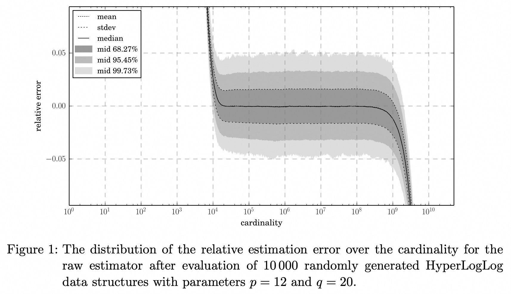   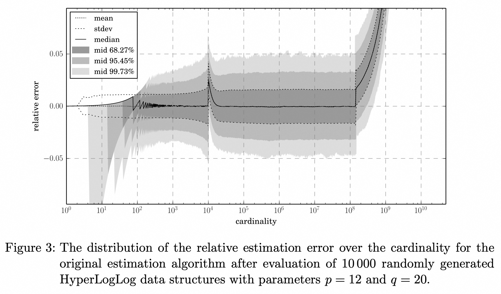  

  * **图 1**显示了原始估计器在小基数和接近 `2^(p+q)` 的大基数时误差剧增 。
  * **图 3**展示了结合线性计数和原始算法的修正版本，但你可以看到在两个方法过渡的区域，误差仍然较大 。

-----

### 4\. 最大似然估计 (MLE)

这篇论文的核心创新点是使用**最大似然估计** (Maximum Likelihood Estimation) 来解决上述偏差问题 。

**最大似然估计**是一种寻找参数估计值的方法，它使得观察到的数据出现的概率最大化。简单来说，就是“哪个参数值最有可能产生我们现在看到的结果”。

论文通过**泊松近似** (Poisson Approximation) ，假设基数服从泊松分布，从而简化了对寄存器值联合概率分布的分析 。在泊松近似下，寄存器值可以被视为独立同分布的随机变量 。这种简化使得最大似然估计方法变得可行 。

-----

### 5\. 集合操作的基数估计

除了对单个集合进行更精确的基数估计，这篇论文还展示了如何将**最大似然估计**应用于**两个 HLL 集合草图的联合基数估计**，例如计算**交集、并集或相对补集**的基数 。

传统的做法是使用**容斥原理** (inclusion-exclusion principle) ，但这种方法在某些情况下非常不准确 。这篇论文的**最大似然估计**方法利用了更多的统计信息，给出了更精确的估计 。

通过掌握上述知识点，特别是HLL算法的工作原理、原始估计器的局限性，以及最大似然估计和泊松近似在论文中的作用，你将能够更好地理解这篇论文提出的新算法和其所带来的改进。

希望这个解释对你有帮助！
  
## 2 解读论文 
  
好的，我们来通俗易懂地解读一下这篇在 HyperLogLog 领域具有重要影响的论文——《New cardinality estimation algorithms for HyperLogLog sketches》。

这篇论文的核心贡献在于，它指出了经典 HyperLogLog (HLL) 估计算法存在的理论缺陷，并提出了两种全新的、更为精确的估计算法。这些新算法不仅在全范围内（无论基数大小）都表现优异，而且还将高精度估计的能力扩展到了集合的交集、并集等复杂运算中。

-----

### 第一部分：HyperLogLog 是什么？经典算法有什么问题？

在我们深入论文之前，先简单回顾一下 HyperLogLog 是如何工作的。

#### HLL 的工作原理

想象一下，你要统计一个网站一天内有多少独立访客（UV），数据量可能有几十亿。最直接的方法是用一个巨大的集合（Set）来存储所有用户ID，但这会消耗大量内存。HLL 就是为了解决这个问题而生的。

它的核心思想非常巧妙，可以概括为以下几步：

1.  **哈希 (Hashing)**：为每一个到来的数据项（比如用户ID）计算一个哈希值，得到一个长长的二进制串。
2.  **分桶 (Bucketing)**：取哈希值的前 `p` 位，用来决定这个数据项应该放入 `m = 2^p` 个桶（在HLL中称为“寄存器”）中的哪一个。
3.  **观察稀有事件 (Observing Rare Events)**：在哈希值剩下的部分中，从左到右查找第一个“1”出现的位置，记为 `k`。（例如，`...0001...` 的 `k` 就是4）。这个 `k` 值越大，说明这个哈希值的前导零越多，这是一个越“稀有”的事件。
4.  **记录最大值 (Recording the Maximum)**：对于每个桶，我们只记录所有落入该桶的数据项中，出现过的最大的 `k` 值。

**插入流程图示 (类似论文中的 Algorithm 1 )**

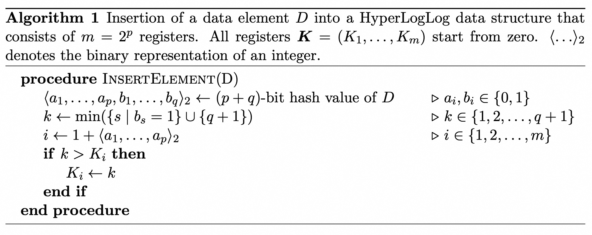  

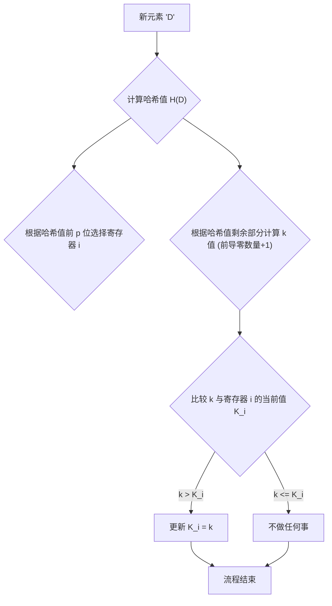

当所有数据都处理完毕后，HLL 会根据所有寄存器里记录的值，通过一个基于**调和平均数**的公式来“猜”出总共有多少个不同的元素。

#### 经典 HLL 算法的缺陷

经典 HLL 算法虽然高效，但它的估计算法存在一个显著问题：**在基数（也就是独立访客数）很小或非常大时，估计结果是有偏差的**。

  * **小基数偏差**：当独立访客数很少时，很多寄存器都是空的（值为0），此时经典公式会严重高估结果。
  * **大基数偏差**：当独立访客数非常大，接近 HLL 设计的上限时，很多寄存器的值达到了最大值（饱和了），此时经典公式又会低估结果。

论文中的 **图1** 非常清晰地展示了这个问题 。   

> **对图1的解读**: 这张图展示了经典原始估计算法 (raw estimator) 的相对误差。横轴是真实的基数（从 10^0 到 10^10），纵轴是相对误差。可以看到，在左侧（小基数），误差曲线明显上翘，表示**高估**。在右侧（大基数），误差曲线急速下坠，表示**低估**。只有在中间一段区域，估计结果才比较准确和稳定。

为了解决这个问题，原论文提出了一些“补丁”方法 ：

  * 当估计值很小时，切换到一种叫做 `Linear Counting` 的算法 。
  * 当估计值非常大时，使用一个基于对数的公式进行修正 。

但这些“补丁”是经验性的，导致算法像打了好几块补丁的衣服，不仅不优雅，而且在不同算法的切换区域会产生更大的误差，如论文中的 **图3** 所示 。这篇论文的作者认为，这些方法只是“治标不治本” 。   

-----

### 第二部分：论文贡献一：一个优雅且精准的“改进型”估计算法

作者首先深入分析了偏差产生的根本原因：经典 HLL 估计算法的数学推导，是基于一个理想化的概率模型，这个模型假设寄存器的值可以无限大 。但现实中，寄存器的值被限制在 `[0, q+1]` 这个范围内。当大量寄存器的值为0（小基数）或 `q+1`（大基数）时，这个理想假设就被打破了，偏差因此产生 。

#### 解决方案：从源头修正

作者提出了一个绝妙的思路：我们不直接使用观测到的0值寄存器数量 `C_0` 和饱和寄存器数量 `C_{q+1}`，而是**反向估计**，如果是在理想模型下，需要一个什么样的值分布才能产生我们观测到的 `C_0` 和 `C_{q+1}` 。

为此，论文引入了两个关键的修正函数 `σ(x)` 和 `τ(x)` ，分别用来对0值寄存器和饱和寄存器的影响进行理论上的修正。最终，作者提出了一个全新的、统一的估计算法（论文中的 **Algorithm 6** ）。

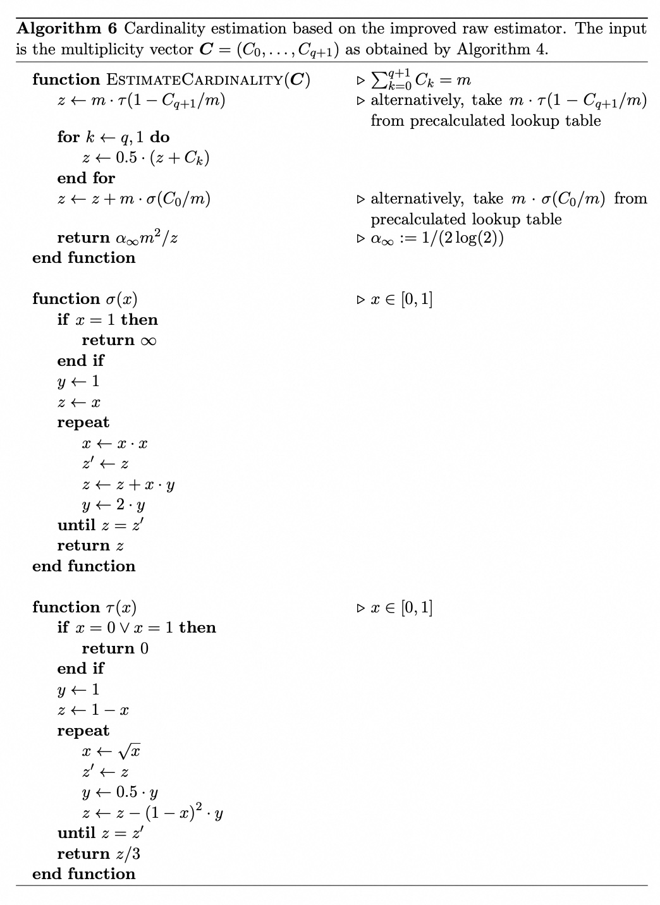  

#### 算法优势

这个新的“改进型原始估计算法” (Improved Raw Estimator) 具有以下巨大优势：

1.  **理论完备，无需“补丁”**：它是一个单一、平滑的公式，适用于所有范围的基数，没有任何需要经验性调整的“魔法数字”或切换逻辑 。
2.  **全范围无偏估计**：它彻底消除了在小基数和大基数下的偏差。这一点在论文的 **图5** 中得到了完美的验证 。 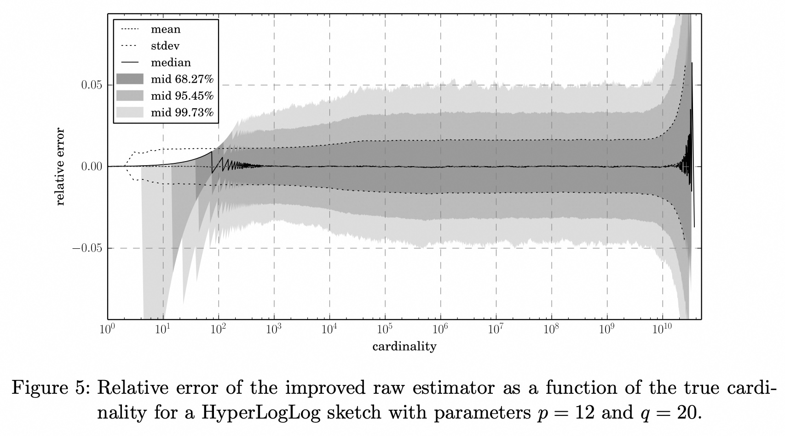  

> **对图5的解读**: 这张图展示了“改进型”算法的相对误差。可以看到，无论基数大小，中间那条代表平均误差的黑线几乎完美地贴合在0.00水平线上，证明该算法在全范围内都是**无偏的**。这与图1形成了鲜明的对比。

3.  **更高的精度**：如 **图6** 所示，新算法的误差标准差（衡量估计稳定性的指标）在很多区域都低于传统“打补丁”方法所能达到的最好水平 。 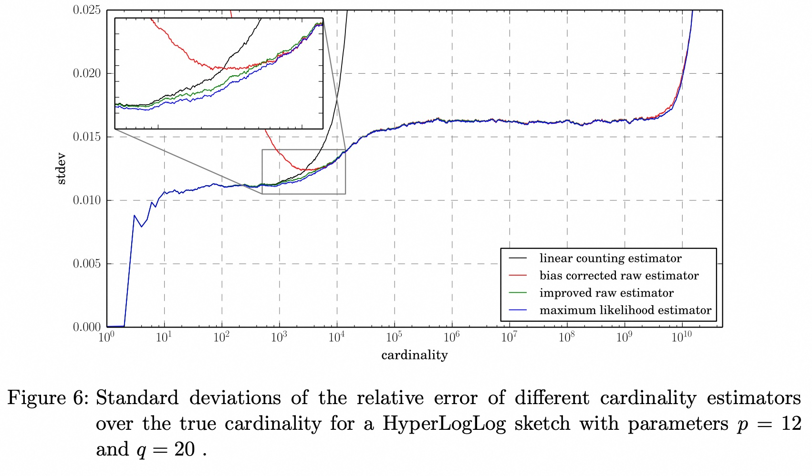  

-----

### 第三部分：论文贡献二：更进一步，基于“最大似然”的终极算法

如果说“改进型”算法已经非常优秀了，那么作者还提出了一个理论上更优、精度更高的算法——基于**最大似然估计 (Maximum Likelihood Estimation, MLE)** 的算法。

#### 什么是最大似然？

它的思想可以这样理解：“现在我们已经观测到了这些寄存器的值，那么反过来推断，多大的原始基数（UV数）最有可能导致我们观测到当前这个结果？”

作者将这个思想应用到了 HLL 的统计模型中，构建了一个似然函数 。求解这个函数的最大值，就能得到理论上最精确的基数估计。

#### 算法与结果

由于求解过程复杂，需要使用数值优化方法（如论文中提到的割线法）来迭代计算 。这构成了论文中的 **Algorithm 8** 。

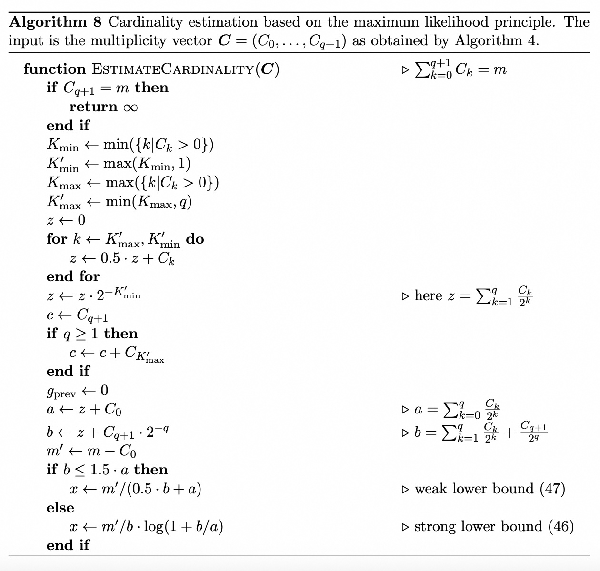  

这个 MLE 算法的结果如何？

  * **精度之王**：从 **图6** 中可以看到，MLE 算法的误差标准差曲线（图中未明确标出，但作者在文中描述其略优于改进型算法）是所有方法中最低的 。这意味着它的估计结果最稳定、最可靠。   
  * **完全无偏**：它的无偏性比“改进型”算法还要好，即使在极高精度设置下，改进型算法会暴露出微小的周期性偏差，而 MLE 算法依然稳如泰山 。
  * **性能权衡**：唯一的代价是计算速度稍慢一些。但如 **图20** 所示，单次估计的耗时仍在纳秒级别（几百纳秒），对于绝大多数应用场景来说，这个速度完全可以接受 。 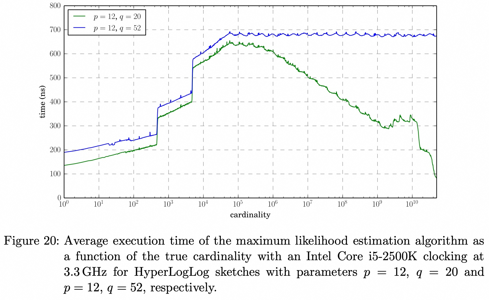  

-----

### 第四部分：论文的杀手锏应用：集合运算的高精度估计

这篇论文最令人惊艳的部分，是它将 MLE 方法扩展到了对两个 HLL sketch 进行集合运算的场景，比如计算交集 (`A ∩ B`) 和差集 (`A \ B`) 的大小。

#### 传统方法的困境

传统的计算方法依赖于**容斥原理**，例如：
`|A ∩ B| = |A| + |B| - |A U B|`

这种方法有一个致命缺陷：当 `A` 和 `B` 的交集很小时，`|A|`、`|B|` 和 `|A U B|` 都是非常大的数。用两个带有噪声的大数相减来得到一个小得多的数，会导致误差被急剧放大 。结果可能非常不准，甚至算出负数。

#### MLE 的降维打击

作者的方法则完全不同。它将 `|A \ B|`, `|B \ A|`, 和 `|A ∩ B|` 这三个未知量作为参数，为两个 HLL sketch 建立一个**联合似然函数** 。然后通过优化算法，一次性地找出最可能产生当前观测结果的这三个值。

这个方法充分利用了两个 HLL sketch 内部更详细的统计信息（例如，哪些寄存器的值在 sketch1 中更大，哪些在 sketch2 中更大，哪些相等），而不仅仅是三个孤立的基数估计值 。

#### 惊人的效果

**表格2, 3, 4**  中的数据雄辩地证明了新方法的优越性。我们重点看**表4（交集估计 |X|）**：

| \#   | 传统方法误差 (rmse) | MLE 方法误差 (rmse) | **提升倍数 (rmse ratio)** |
| --- | ------------------- | ------------------- | ----------------------- |
| 1   | 0.3264              | 0.1116              | **2.926** |
| 2   | 0.1198              | 0.04017             | **2.982** |
| 16  | 0.1020              | 0.04869             | **2.096** |
| 31  | 0.06231             | 0.02689             | **2.317** |

> **对表格的解读**: “提升倍数”一栏显示了新方法的均方根误差 (rmse) 比传统方法小多少倍。**2.9倍**的提升意味着，要达到同样的精度，传统方法可能需要 `2.9^2 ≈ 8.4` 倍的内存（寄存器数量）。这是一个巨大的飞跃！

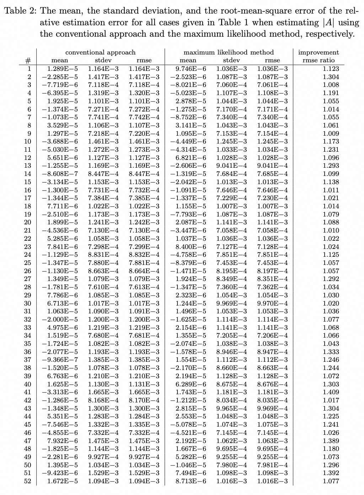 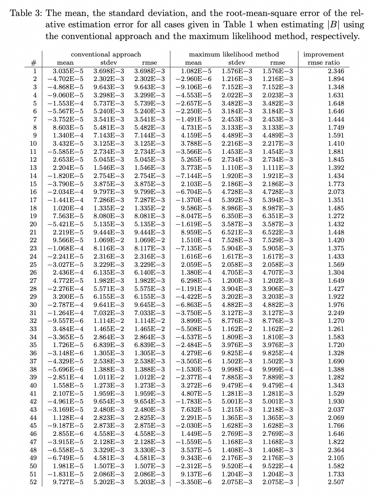 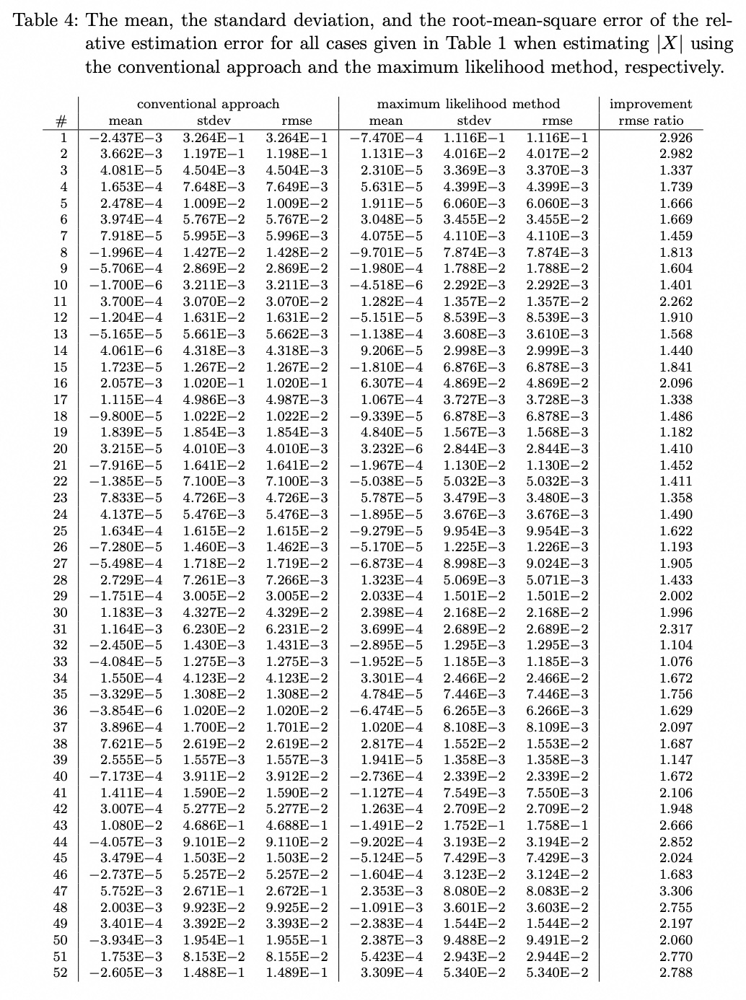 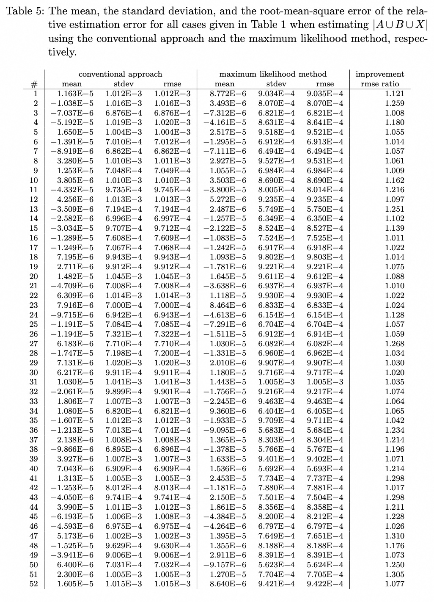  

更令人惊讶的是，如**表5**所示，即便是对于 HLL 原本就支持的**并集**运算，这种联合估计方法得到的结果 `|A \ B| + |B \ A| + |A ∩ B|`，其精度也比直接合并两个 sketch 后再估计要更高 。

### 总结

这篇论文是 HyperLogLog 算法发展史上的一个里程碑。它不仅深入剖析了经典算法的理论缺陷，还给出了两个堪称完美的解决方案：

1.  **改进型原始估计算法**：一个优雅、高效、全范围无偏的替代方案，非常适合作为 HLL 的新“标准”实现。
2.  **最大似然估计算法 (MLE)**：精度更高，是追求极致准确性的不二之选。

最重要的是，它开创性地将 MLE 应用于**集合运算**，将 HLL 的能力从单一集合的基数估计，扩展到了多个集合之间关系的高精度量化，极大地提升了该算法在数据分析和数据库领域的实用价值。
  
## 3 术语 
  
你好！我已阅读《New cardinality estimation algorithms for HyperLogLog sketches》这篇论文，并为你提取了其中几个重要的核心术语，用通俗易懂的方式进行讲解。

---

### 1. 基数估计 (Cardinality Estimation)
**基数**指的是一个集合中**不重复元素的数量**。例如，集合 `{苹果, 香蕉, 苹果}` 的基数是 2。在处理海量数据流时，如果要把所有不重复的元素都存储下来，会占用巨大的内存。**基数估计**就是一种解决这个问题的技术，它使用极小的内存来快速、近似地计算出不重复元素的数量。这篇论文研究的就是如何让这种近似计算更精确。

---

### 2. HyperLogLog (HLL)
**HyperLogLog**是一种非常高效的**概率基数估计算法**。它的核心思想是利用哈希函数和概率学的规律来估计基数。

想象一下，你用一个哈希函数给每个元素生成一个随机的二进制串。根据概率，一个完全随机的二进制串以一个0开头的概率是 $1/2$，以两个连续0开头的概率是 $1/4$，以此类推。一个集合中如果元素越多，就越有可能出现一个开头有很长一串0的哈希值。

HLL 算法并没有只记录一个最长的零串，而是将所有元素的哈希值分散到多个**“桶”**（或称为**寄存器**）中，每个桶只记录它所见过的哈希值中最长连续零串的长度。最后，通过汇总这些桶的信息来估算总基数。这个方法比只用一个最长零串的估计更稳定、更准确。

### 3. 调和平均数 (Harmonic Mean)
在原始的 HLL 算法中，**调和平均数**是用来汇总所有**寄存器**值并计算最终基数估计值的核心数学工具。

其基本思想是，如果你有 $m$ 个寄存器，每个寄存器记录了它所见过的最长连续零串的长度 $K_i$，那么最终的估计值 $\hat{n}_{raw}$ 可以通过一个公式得到：
$\hat{n}_{raw} = \frac{\alpha_m m^2}{\sum_{i=1}^m 2^{-K_i}}$

这个方法对异常值（即某个寄存器值特别大或特别小）不敏感，能提供一个相对稳健的估计。然而，论文指出，它在基数很小或很大的情况下会产生偏差。

---

### 4. 偏差与修正 (Bias and Corrections)
论文中讨论了原始 HLL 算法在两种情况下的**偏差**：

* **小基数时的偏差**：当集合中的元素很少时，很多寄存器都是空的（值都为零）。这时，原始的调和平均数公式会产生一个不准确的估计。为了修正这个偏差，原始算法引入了**线性计数 (Linear Counting)** 方法：通过计算还有多少个寄存器是空的，来更精确地估算小基数。

* **大基数时的偏差**：当集合中的元素非常多时，很多寄存器都达到了它们能记录的最大值。这会导致估计值偏低，无法准确反映真实基数。

---

### 5. 最大似然估计 (Maximum Likelihood Estimation, MLE)
这篇论文的核心创新点是引入了**最大似然估计**来解决上述偏差问题。

**最大似然估计**是一种统计学方法，它旨在找到一个**参数值**（在这里就是我们想估计的基数 $n$），使得我们**观察到的数据**（在这里就是所有 HLL 寄存器的值）出现的概率最大。

你可以把这个过程想象成一个侦探游戏：你知道 HLL 算法是如何工作的，也观察到了所有寄存器的值。现在，你想找出“最可能”导致这些观察结果的基数是多少。最大似然估计提供了一种数学方法，帮助你系统性地找到这个“最可能”的答案。论文证明，这个方法比原始的调和平均数在各种基数范围内都更加精确和稳定。

---

### 6. 联合基数估计 (Union Cardinality Estimation)
论文的另一个重要贡献是展示了**最大似然估计**如何用于计算两个**HLL 集合草图（sketches）**的并集基数。

传统的方法使用**容斥原理 (Inclusion-Exclusion Principle)**，即 `|A U B| = |A| + |B| - |A ∩ B|`。但这种方法对于近似算法来说并不精确。这篇论文展示了，基于最大似然估计，可以直接从两个 HLL 草图的寄存器值中，更精确地估计出它们并集、交集或相对补集的基数。

通过理解这些术语，你就能掌握这篇论文的核心思想：它用更高级、更严谨的统计学方法（最大似然估计），来替代原始 HLL 算法中经验性的修正方法，从而实现了更准确、更鲁棒的基数估计。
  
## 参考        
         
https://arxiv.org/pdf/1702.01284    
        
<b> 以上内容基于DeepSeek、Qwen、Gemini及诸多AI生成, 轻微人工调整, 感谢杭州深度求索人工智能、阿里云、Google等公司. </b>        
        
<b> AI 生成的内容请自行辨别正确性, 当然也多了些许踩坑的乐趣, 毕竟冒险是每个男人的天性.  </b>        
    
#### [期望 PostgreSQL|开源PolarDB 增加什么功能?](https://github.com/digoal/blog/issues/76 "269ac3d1c492e938c0191101c7238216")
  
  
#### [PolarDB 开源数据库](https://openpolardb.com/home "57258f76c37864c6e6d23383d05714ea")
  
  
#### [PolarDB 学习图谱](https://www.aliyun.com/database/openpolardb/activity "8642f60e04ed0c814bf9cb9677976bd4")
  
  
#### [PostgreSQL 解决方案集合](../201706/20170601_02.md "40cff096e9ed7122c512b35d8561d9c8")
  
  
#### [德哥 / digoal's Github - 公益是一辈子的事.](https://github.com/digoal/blog/blob/master/README.md "22709685feb7cab07d30f30387f0a9ae")
  
  
#### [About 德哥](https://github.com/digoal/blog/blob/master/me/readme.md "a37735981e7704886ffd590565582dd0")
  
  

  
