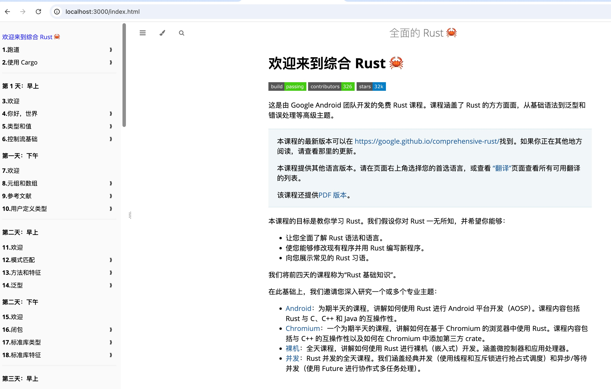

## google 发布最强 RUST 学习教程  
            
### 作者            
digoal            
            
### 日期            
2025-09-06           
            
### 标签            
PostgreSQL , PolarDB , DuckDB , rust , google , 教程      
            
----            
            
## 背景    
google 发布最强 RUST 学习教程  
  
这是由 Google Android 团队开发的免费 Rust 课程。课程涵盖了 Rust 的方方面面，从基础语法到泛型和错误处理等高级主题。  
  
本课程的目标是教你学习 Rust。我们假设你对 Rust 一无所知，并希望你能够：  
- 让您全面了解 Rust 语法和语言。  
- 使您能够修改现有程序并用 Rust 编写新程序。  
- 向您展示常见的 Rust 习语。  
  
我们将前四天的课程称为“Rust 基础知识”。  
  
在此基础上，我们邀请您深入研究一个或多个专业主题：  
- Android：为期半天的课程，讲解如何使用 Rust 进行 Android 平台开发（AOSP）。课程内容包括 Rust 与 C、C++ 和 Java 的互操作性。  
- Chromium：一个为期半天的课程，讲解如何在基于 Chromium 的浏览器中使用 Rust。课程内容包括与 C++ 的互操作性以及如何在 Chromium 中添加第三方 crate。  
- 裸机：全天课程，讲解如何使用 Rust 进行裸机（嵌入式）开发。涵盖微控制器和应用处理器。  
- 并发：Rust 并发的全天课程。我们涵盖经典并发（使用线程和互斥锁进行抢占式调度）和异步/等待并发（使用 Future 进行协作式多任务处理）。  
    
开始部署学习环境吧  
```  
# 装上 Rust（官网 rustup.rs）  
curl --proto '=https' --tlsv1.2 -sSf https://sh.rustup.rs | sh  
  
# 手动应用环境变量一次即可, 已添加到对应的shell profile  
. "$HOME/.cargo/env"  
  
# 拿源码  
git clone --depth 1 https://github.com/google/comprehensive-rust.git  
cd comprehensive-rust  
  
# 装一把工具  
cargo xtask install-tools  
  
# 启动本地教程服务  
cargo xtask serve  
  
# 浏览器打开URL, 开始学习  
http://localhost:3000  
```  
  
    
  
  
  
  
#### [期望 PostgreSQL|开源PolarDB 增加什么功能?](https://github.com/digoal/blog/issues/76 "269ac3d1c492e938c0191101c7238216")
  
  
#### [PolarDB 开源数据库](https://openpolardb.com/home "57258f76c37864c6e6d23383d05714ea")
  
  
#### [PolarDB 学习图谱](https://www.aliyun.com/database/openpolardb/activity "8642f60e04ed0c814bf9cb9677976bd4")
  
  
#### [PostgreSQL 解决方案集合](../201706/20170601_02.md "40cff096e9ed7122c512b35d8561d9c8")
  
  
#### [德哥 / digoal's Github - 公益是一辈子的事.](https://github.com/digoal/blog/blob/master/README.md "22709685feb7cab07d30f30387f0a9ae")
  
  
#### [About 德哥](https://github.com/digoal/blog/blob/master/me/readme.md "a37735981e7704886ffd590565582dd0")
  
  

  
