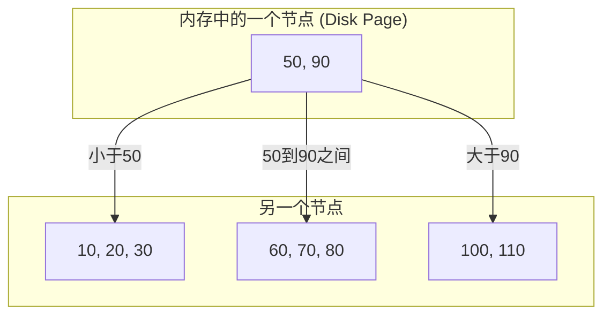
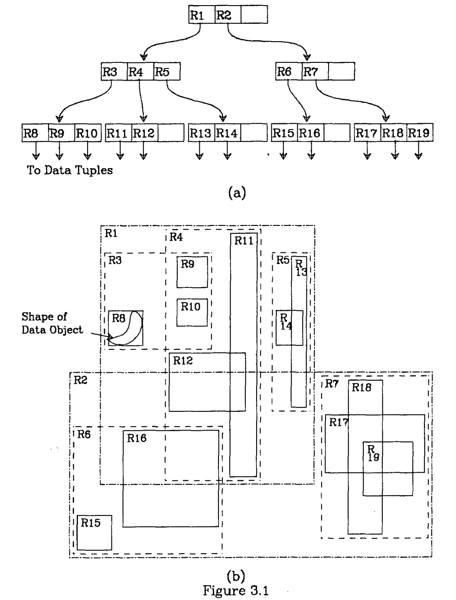
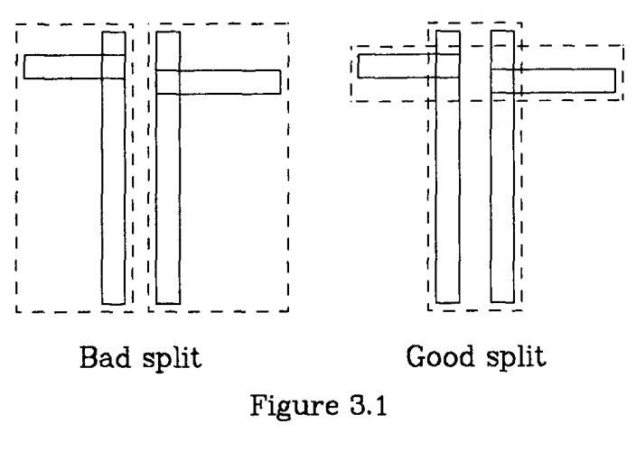
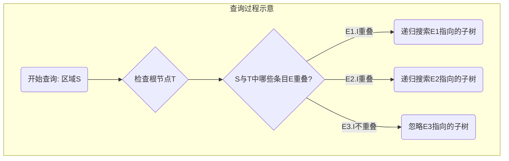
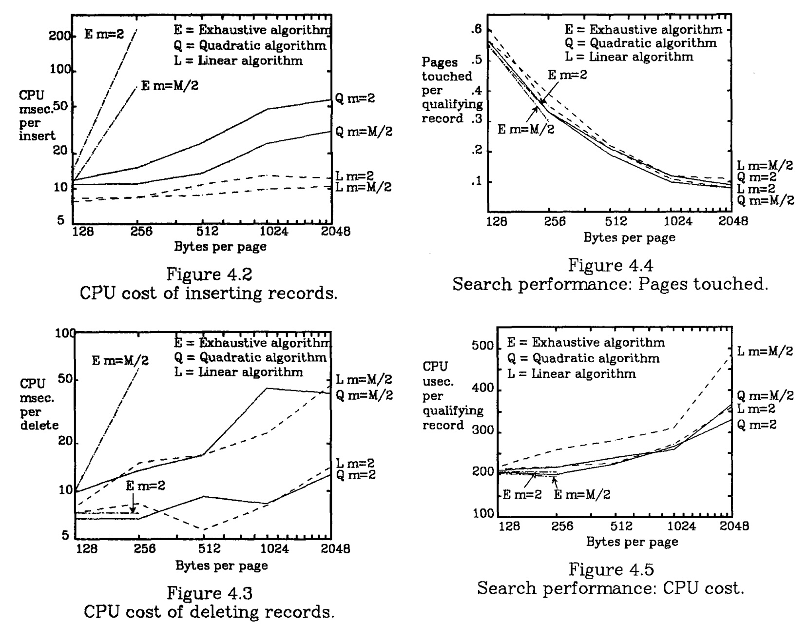
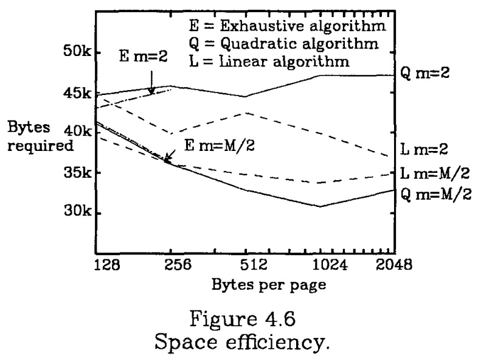
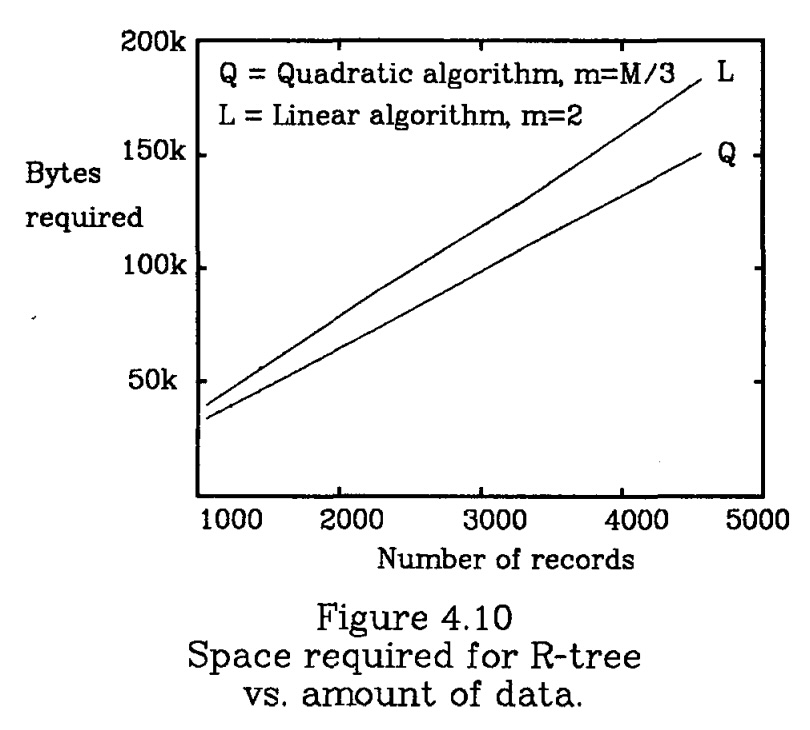

## AI论文解读 | R-TREES: A DYNAMIC INDEX STRUCTURE FOR SPATIAL SEARCHING
        
### 作者        
digoal        
        
### 日期        
2025-09-06        
        
### 标签        
PostgreSQL , PolarDB , DuckDB , AI , 论文解读        
        
----        
        
## 背景  
      
https://dl.acm.org/doi/pdf/10.1145/971697.602266        
  
提示:          
```          
读懂《R-TREES: A DYNAMIC INDEX STRUCTURE FOR SPATIAL SEARCHING》这篇论文需要提前掌握哪些基础知识, 请使用中文通熟易懂的讲解这些基础知识, 可以引用论文中的图、表或使用Markdown支持的图形(text,mermaid等)增加解释性. 
  
使用中文通熟易懂的解读《R-TREES: A DYNAMIC INDEX STRUCTURE FOR SPATIAL SEARCHING》这篇论文, 其中的关键内容请着重讲解, 可以引用论文中的图、表或使用Markdown支持的图形(text,mermaid等)增加解释性. 
  
提取《R-TREES: A DYNAMIC INDEX STRUCTURE FOR SPATIAL SEARCHING》这篇论文中的重要术语, 使用中文对这些术语进行通熟易懂的讲解, 可以引用论文中的图、表或使用Markdown支持的图形(text,mermaid等)增加解释性. 
```     
  
## 1 前置知识 
  
好的，为了帮助您顺利读懂这篇经典的《R-TREES: A DYNAMIC INDEX STRUCTURE FOR SPATIAL SEARCHING》论文，我将为您梳理所需的基础知识。

这篇论文的核心是介绍一种名为 **R-Tree** 的数据结构，专门用于高效地索引和查询**空间数据**。要理解它，我们需要从以下几个方面入手：

1.  **“问题”是什么：为什么要发明 R-Tree？(空间数据索引的挑战)**
2.  **“巨人”的肩膀：R-Tree 的设计基础是什么？(B-Tree)**
3.  **“核心”思想是什么：R-Tree 如何组织空间数据？(最小边界矩形 MBR)**
4.  **“关键”操作是什么：R-Tree 如何保持高效？(节点分裂策略)**

-----

### 1\. 基础知识一：空间数据索引的挑战

我们首先要理解 R-Tree 想要解决的问题。

  * **什么是空间数据？**
    简单说，就是具有空间位置和形状信息的数据。论文中提到了例子：计算机辅助设计（CAD）中的电路布局、地理信息系统（GIS）中的县区、河流等 。这些数据不是一个简单的点，而是在二维（或更高维度）空间中占据一定区域的对象 。

  * **为什么传统索引方法不行？**
    传统的数据库索引，比如我们常用的 B-Tree，非常擅长处理一维数据，例如整数、字符串等。我们可以很方便地对年龄进行排序和范围查询（\>30岁且\<40岁）。

    但空间数据是多维的。一个矩形由 `(x_min, y_min, x_max, y_max)` 四个值定义，我们无法简单地用“大于”或“小于”来对一堆矩形进行排序。论文明确指出，传统的一维索引结构不适用于多维空间搜索 。

    **核心挑战**：如何组织这些多维度的空间对象，以便能快速执行类似“查找所有与指定区域重叠的对象”这样的查询？

### 2\. 基础知识二：B-Tree (R-Tree 的设计蓝本)

论文开篇就说 "An R-tree is a height-balanced tree similar to a B-tree" 。所以，理解 B-Tree 是理解 R-Tree 的关键。

  * **B-Tree 是什么？**
    B-Tree 是一种为磁盘等慢速存储设备优化的自平衡树。它的主要特点是：

    1.  **平衡性**：所有叶子节点都在同一层  (对应 R-Tree 的性质 6)。这保证了任何查询的路径长度都差不多，性能稳定。
    2.  **多路分支**：一个节点可以有很多个子节点（几十到几百个）。由于磁盘读取是按“页”或“块”进行的，我们将一个节点的大小设计成和页大小差不多。这样一次磁盘 I/O 就能读取一个完整的节点，大大减少了 I/O 次数。
    3.  **节点容量**：每个节点存储的键（key）的数量有上限（M）和下限（m）。这保证了树的平衡和空间利用率。

  * **B-Tree 的操作（以插入为例）**
    当向 B-Tree 插入一个新数据时：

    1.  从根节点开始，找到应该插入该数据的叶子节点。
    2.  如果叶子节点没满，直接插入。
    3.  如果叶子节点满了，就需要 **分裂 (Split)**。节点会从中间分裂成两个，中间的那个键会被“提升”到父节点中。这个分裂过程可能会一直向上传播，直到根节点。

下面是一个简化的 B-Tree 示意图，帮助您理解其结构：



> **小结**：请记住 B-Tree 的这几个核心概念：**高度平衡、节点容量（M和m）、按页存储、插入时可能发生节点分裂**。R-Tree 几乎完全继承了这些特性。

### 3\. 基础知识三：最小边界矩形 (MBR) - R-Tree 的核心

B-Tree 用一维的键来组织数据，R-Tree 则需要一种方式来组织二维（或多维）的空间对象。它采用的核心思想就是 **最小边界矩形 (Minimum Bounding Rectangle, MBR)**，在论文中简称为 **rectangle (I)** 。

  * **MBR 是什么？**
    就是一个能恰好包围一个空间对象或一组空间对象的、各边都与坐标轴平行的最小矩形。

  * **R-Tree 如何使用 MBR？**
    R-Tree 将 B-Tree 的“键”替换成了“矩形”：

      * **叶子节点**：包含的条目是 `(I, tuple-identifier)`，其中 `I` 是某个具体空间对象（比如一个湖）的 MBR，`tuple-identifier` 是指向这个真实数据的指针 。
      * **非叶子节点**：包含的条目是 `(I, child-pointer)`，其中 `I` 是一个能包围其所有子节点中所有矩形的 MBR，`child-pointer` 是指向子节点的指针 。

这听起来可能有点抽象，但论文中的 **Figure 2.1** 完美地解释了这一点。让我们结合图来理解：   

  * **看右边的图 (b)**：像 R8, R9, ..., R19 这些是叶子节点里的条目，它们的矩形直接包围了最底层的数据对象（比如 R8 包围的那个不规则图形）。
  * **看左边的树状图 (a)**：R3, R4, R5 是 R1 的子节点。回到图 (b)，你可以看到，矩形 R3 恰好是 R8, R9, R10 这三个矩形的 MBR。同理，R1 又是 R3, R4, R5 的 MBR 。
  * **查询过程**：假设你要查找一个区域 `S` 内的所有对象。你从根节点开始，看 `S` 是否与 R1 或 R2 重叠。如果 `S` 只与 R1 重叠，那么 R2 分支下的所有数据都可以被安全地忽略，从而极大地提高了查询效率。这就是 R-Tree 的精髓。

### 4\. 基础知识四：节点分裂 (Node Splitting) - R-Tree 的关键操作

和 B-Tree 一样，当一个节点满了（包含 M+1 个条目）之后，R-Tree 也需要将其分裂成两个节点 。但这里的挑战远大于 B-Tree。

  * **挑战**：对于 B-Tree，我们只需找到中间的键，小的放左边，大的放右边，很简单。但对于一堆矩形，哪个是“中间”的？我们有无数种方法把 `M+1` 个矩形分成两组。

  * **分裂的目标**：论文指出，一个好的分裂，应该让分裂后的两个新节点的 MBR **总面积最小化** 。为什么？因为 MBR 面积越小，它在未来被搜索区域命中的概率就越低，查询时需要检查的路径就越少。

论文中的 **Figure 3.1** 非常直观地说明了这一点：   

  * **Bad split**：分裂产生的两个 MBR（虚线框）面积很大，而且互相重叠区域也大。
  * **Good split**：分裂产生的两个 MBR 面积更紧凑，重叠更小。

显然，"Good split" 在未来查询时性能会更好。为了找到这种好的分裂方式，论文提出了几种算法，比如**穷举法**（太慢）、**二次方成本算法 (Quadratic-Cost Algorithm)**  和 **线性成本算法 (Linear-Cost Algorithm)** 。读论文时，您会发现很大一部分篇幅都在讨论如何实现一个既快又好的分裂算法。

-----

### 总结

在阅读论文之前，请确保您对以下知识点有一个清晰的理解：

| 核心概念 | 通俗解释 | 对应论文章节/图示 |
| :--- | :--- | :--- |
| **空间数据** | 地图上的区域、CAD设计图等，不是简单的点或线。 | Section 1  |
| **B-Tree** | 一种平衡的、为磁盘设计的多路查找树，是R-Tree的“原型”。 | Section 2  |
| **MBR** | R-Tree的核心，用一个简单的矩形来“代表”和“包围”复杂的空间对象。 | Section 2, Figure 2.1      |
| **节点分裂** | R-Tree 插入和维护的关键，其目标是最小化分裂后 MBR 的面积。 | Section 3.5, Figure 3.1     |

掌握了这些基础知识后，您再去阅读论文原文，就会发现作者的思路和设计选择都变得顺理成章，能够更好地理解 R-Tree 的精妙之处。祝您阅读顺利！
  
## 2 解读论文 
  
好的，这篇由 Antonin Guttman 在1984年发表的论文是空间数据库领域里程碑式的作品。我将为您详细解读其核心思想、关键算法和重要结论，并严格遵循引用规范。

### 《R-TREES: A DYNAMIC INDEX STRUCTURE FOR SPATIAL SEARCHING》论文解读

这篇论文的核心目标是设计一种高效的数据结构，用于处理**多维空间数据**（例如地图上的区域、芯片上的电路等），并能快速响应“空间查询”（例如，“找出所有与这块区域重叠的建筑”） 。

-----

### 1\. 背景：为什么需要 R-Tree？

传统的数据库索引（如B-Tree）非常擅长处理一维数据（如年龄、薪水），因为这些数据可以被轻松地排序 。然而，空间数据是多维的、有大小的（非零尺寸），无法用简单的一维顺序来组织 。

当时已存在的一些多维数据结构各有缺陷：

  * **Cell Methods**：单元格边界需要预先设定，不适合动态变化的数据 。
  * **Quad Trees / k-d Trees**：没有充分考虑磁盘分页（Paging）机制，在大型数据库中效率不高 。
  * **K-D-B Trees**：虽然考虑了分页，但只适用于“点”数据，而非有面积的“区域”数据 。

因此，作者提出了一种全新的、动态的、基于磁盘分页的索引结构——**R-Tree** 。

-----

### 2\. 核心结构：R-Tree 是什么样子的？

R-Tree 的设计思想很大程度上借鉴了广为人知的 B-Tree，它是一棵**高度平衡的树** 。

  * **节点与条目 (Entry)**
    R-Tree 的节点分为叶子节点和非叶子节点。

      * **叶子节点**：包含的条目形式为 `(I, tuple-identifier)` 。
          * `I`：是一个n维矩形，也称为**最小边界矩形 (Minimum Bounding Rectangle, MBR)**，它恰好能包围住一个真实的空间数据对象 。
          * `tuple-identifier`：是一个指针，指向数据库中存储的那个真实的空间数据对象 。
      * **非叶子节点** (内部节点)：包含的条目形式为 `(I, child-pointer)` 。
          * `I`：是一个覆盖性矩形，它能恰好包围其**子节点**中所有条目的矩形 。
          * `child-pointer`：是一个指针，指向下一层的子节点 。

  * **结构图解 (Figure 2.1)**
    论文中的 Figure 2.1 是理解 R-Tree 结构最直观的方式。   

      * **图(b)** 展示了空间对象的分布。例如，R8、R9 等是真实数据对象的 MBR 。
      * **图(a)** 展示了这些对象在 R-Tree 中的组织形式 。你可以看到，内部节点的矩形 `R3` 恰好包围了其子条目 `R8`, `R9`, `R10`。根节点的矩形 `R1` 则包围了 `R3`, `R4`, `R5`。这种层层嵌套的包围关系是 R-Tree 的核心。

  * **R-Tree 的 6 个核心性质**

    1.  每个叶子节点包含 `m` 到 `M` 个索引记录（根节点除外） 。`M` 是一个节点能容纳的最大条目数，`m` 是最小条目数，通常 $m \\le M/2$ 。
    2.  叶子节点中的每个矩形 `I` 都是能包围真实数据对象的最小矩形 。
    3.  每个非叶子节点拥有 `m` 到 `M` 个子节点（根节点除外） 。
    4.  非叶子节点中的每个矩形 `I` 都是能包围其所有子节点矩形的最小矩形 。
    5.  根节点至少有两个子节点，除非它本身就是叶子节点 。
    6.  所有的叶子节点都出现在同一层上（这就是“高度平衡”） 。

-----

### 3\. 关键算法：R-Tree 如何工作？

R-Tree 的动态性体现在它的查询、插入和删除算法上。

#### 3.1 查询 (Searching)

查询算法的目标是：给定一个搜索矩形 `S`，找到所有与之重叠的数据对象 。
过程如下：

1.  从根节点开始 。
2.  **在非叶子节点中**：检查当前节点里的每一个条目 `E`，判断其矩形 `E.I` 是否与 `S` 重叠 。如果重叠，则递归地进入该条目指向的子树进行搜索 。
3.  **在叶子节点中**：检查节点里的每一个条目 `E`，判断其矩形 `E.I` 是否与 `S` 重叠 。如果重叠，那么这个条目就是一个符合条件的结果 。

由于 R-Tree 的组织方式，查询算法可以**剪掉**大量不相关的树分支，只访问那些与搜索区域 `S` 重叠的节点，从而实现高效查询 。



#### 3.2 插入 (Insertion)

插入一个新条目 `E` 的过程与 B-Tree 类似，核心在于**为新条目选择合适的叶子节点**以及**处理节点溢出（分裂）** 。

1.  **选择叶子节点 (ChooseLeaf)**：这是 R-Tree 插入算法的灵魂。

      * 从根节点开始，遍历每一层 。
      * 在当前节点中，选择一个条目，其矩形**需要被扩展的面积最小**，就能将新条目 `E` 的矩形包含进去 。
      * 如果扩展面积相同，则选择原本面积较小的那个条目 。
      * 这个策略的目标是尽可能地保持树中矩形的“紧凑”，减少无效空间。

2.  **添加与分裂 (SplitNode)**：

      * 找到叶子节点后，如果它还有空间，直接插入新条目 。
      * 如果节点已满（已有 `M` 个条目），则需要将这 `M+1` 个条目**分裂**成两个新的节点 。

3.  **向上传播调整 (AdjustTree)**：

      * 插入或分裂后，从叶节点开始向上回溯至根节点 。
      * 调整路径上所有父节点的边界矩形，确保它们能紧密地包围其所有子条目 。
      * 如果分裂产生了新节点，也要将其插入到父节点中，这可能会引发父节点的连锁分裂，一直传播到根节点 。如果根节点也分裂了，树的高度就会增加 。

#### 3.3 关键：节点分裂 (Node Splitting)

如何分裂是 R-Tree 最具挑战性的部分。一个好的分裂策略至关重要，因为它直接影响未来的查询性能 。

  * **分裂的目标**：最小化分裂后形成的两个新矩形的**总面积** 。面积越小，未来被查询命中的概率就越低。

  * **图解好坏分裂 (Figure 3.1)**：   

    左侧的 "Bad split" 导致了两个面积巨大且严重重叠的覆盖矩形，而右侧的 "Good split" 则让两个新矩形更紧凑、重叠更少 。

  * **分裂算法**：论文提出了三种分裂算法：

    1.  **穷举法**：尝试约 $2^{M-1}$ 种组合，能找到最佳分裂，但对于 M=50 这样的典型值来说计算成本过高，不切实际 。
    2.  **二次方成本算法 (Quadratic Split)**：一种启发式算法。首先找出 `M+1` 个条目中“最不适合”放在一起的一对作为两个新组的“种子” 。然后，迭代地将其余条目分配给能使其覆盖矩形面积增长最小的那个组 。
    3.  **线性成本算法 (Linear Split)**：一种更快的启发式算法。它沿着每个维度找出分离最远的一对条目作为种子，然后随机分配其余条目 。

#### 3.4 删除 (Deletion)

删除操作首先需要找到包含目标记录的叶子节点 。删除记录后，可能会导致节点中的条目数量少于下限 `m`（即“下溢”）。

  * **处理下溢 (CondenseTree)**：与 B-Tree 的合并(merge)策略不同，R-Tree 采用了一种独特的**重插 (Re-insertion)** 策略。
      * 将下溢节点中的所有剩余条目从树中删除 。
      * 然后调用 `Insert` 算法将这些“孤儿”条目重新插入到树中 。
      * 作者认为，这种方法实现更简单，并且能动态地优化和重构树的结构，防止其性能随时间退化 。

-----

### 4\. 性能评测

作者通过一系列实验来验证 R-Tree 的性能，数据源自 VLSI 电路布局 。

  * **分裂算法对比**：

      * **插入性能 (Figure 4.2)**：线性算法最快，穷举法最慢。二次方算法居中 。   
      * **查询性能 (Figure 4.4, 4.5)**：一个**非常重要的发现**是，尽管分裂算法的成本差异巨大，但它们产生的 R-Tree 在查询性能上相差无几 。即使是廉价的线性算法，其查询效率也只比理论最优的穷举法差一点点 。     

  * **空间效率 (Figure 4.6, 4.10)**：

      * 最小填充率 `m` 设得越高（如 `m=M/2`），树的存储空间越紧凑 。
      * 索引占用的总空间与数据量呈线性关系，这符合预期 。

### 5\. 结论

  * R-Tree 被证明是一种用于索引非零尺寸空间对象的有效结构 。
  * 在合理的页面大小（如1024字节）下，R-Tree 性能良好 。
  * **线性分裂算法 (Linear Split)** 是最佳选择 。因为它在插入时速度非常快，同时其产生的索引在查询性能上几乎与更复杂的算法一样好 。

总而言之，这篇论文不仅提出了 R-Tree 这一创新的数据结构，还通过详尽的算法设计和性能对比，为后续空间数据库的发展奠定了坚实的基础。
  
## 3 术语 
  
好的，我们来一起提取并解读这篇经典论文《R-TREES: A DYNAMIC INDEX STRUCTURE FOR SPATIAL SEARCHING》中的核心术语。

-----

### 一、 基础概念

这些术语定义了 R-Tree 要解决的问题域和其高层结构。

#### 1\. Spatial Data (空间数据)

  * **讲解**: 指那些在多维空间中占据一定区域、拥有位置和形状信息的数据对象，它们无法被简化为一个点 。论文中提到的例子包括地图上的县、人口普查区 ，以及计算机辅助设计（CAD）中的电路布局 。
  * **通俗理解**: 想象一下地图APP，上面的一个城市、一个公园、一栋建筑都是空间数据。它们有面积，有边界，而不是一个简单的坐标点。

#### 2\. R-tree (R树)

  * **讲解**: R-Tree 是一种为高效处理空间数据而设计的动态索引结构 。它是一棵类似于 B-Tree 的高度平衡树 ，专门设计用于磁盘等二级存储，其节点大小通常对应一个磁盘页 。
  * **通俗理解**: 你可以把它看作是城市地图的“目录”。这个目录不是按名称（A-Z）排序，而是按地理位置组织的。如果你想找“市中心的所有餐厅”，通过这个目录可以快速定位到包含市中心的那些页面，而不用翻遍整本地图册。

#### 3\. Height-balanced tree (高度平衡树)

  * **讲解**: 这是 R-Tree 从 B-Tree 继承的一个关键特性，意味着所有的叶子节点都出现在树的同一层级上 。
  * **通俗理解**: 无论你要查找的数据在哪个角落，从树的根（目录首页）查到最终目标（具体数据）所经过的层次数都是相同的。这保证了查询性能的稳定，不会因为数据的不同而时快时慢。

-----

### 二、 核心构成

这些术语是构成 R-Tree 结构的基本单元。

#### 4\. Node (节点)

  * **讲解**: R-Tree 的基本构建模块，如果索引存放在磁盘上，一个节点就对应一个磁盘页 。分为两种：
      * **Leaf Node (叶子节点)**: 位于树的最底层，其条目直接指向数据库中的空间数据对象 。
      * **Non-leaf Node (非叶子节点/内部节点)**: 位于树的中间层和根，其条目指向树的下一层节点（即它的子节点） 。

#### 5\. Entry / Index Record (条目/索引记录)

  * **讲解**: 存储在节点内部的信息单元。
      * 在**叶子节点**中，条目形式为 `(I, tuple-identifier)` 。`I` 是数据对象的边界框，`tuple-identifier` 是指向该对象的指针 。
      * 在**非叶子节点**中，条目形式为 `(I, child-pointer)` 。`I` 是一个能覆盖其子节点中所有矩形的边界框，`child-pointer` 是指向该子节点的指针 。

#### 6\. Rectangle / Bounding Box (矩形/边界框)

  * **讲解**: 这是 R-Tree 组织空间数据的核心。它是一个能够完全包围一个或一组空间对象的最小n维矩形 。在论文中，它也被称为 **MBR (Minimum Bounding Rectangle)**。

  * **图解**: 论文的 **Figure 2.1** 完美展示了这种层级包围关系。   

    > 如图所示，`R8`, `R9`, `R10` 是最底层数据对象的边界框 。而它们上一层的 `R3` 则是包围 `R8`, `R9`, `R10` 三个矩形的最小边界框 。`R1` 又包围了 `R3`, `R4`, `R5` 。

#### 7\. M 和 m (最大与最小条目数)

  * **讲解**:
      * **M**: 一个节点能容纳的**最大**条目数 。
      * **m**: 一个节点必须保留的**最小**条目数，通常 $m \\le M/2$ 。
  * **通俗理解**: 这就像公交车的核载人数（M）和最少发车人数（m）。这些规则保证了每个节点（每页存储）的空间利用率，避免树变得过于稀疏或庞大。

-----

### 三、 关键算法与策略

这些术语描述了 R-Tree 如何进行动态的增删改查。

#### 8\. ChooseLeaf (选择叶子节点)

  * **讲解**: 这是在**插入**新数据时，用来决定应将新条目放入哪个叶子节点的算法 。其核心策略是：从根节点开始，在每一层都选择那个**因包含新条目而导致其边界框面积扩张最小**的子树 。
  * **通俗理解**: 想象你要把一个新玩具放进一堆盒子里。为了让所有盒子总体积最小，你不会把它塞进一个刚好放满的小盒（导致需要换个大得多的盒子），而是会选择一个稍大一点、还有富余空间的盒子。ChooseLeaf 就是在做类似决策，以保持树的“紧凑”。

#### 9\. SplitNode (节点分裂)

  * **讲解**: 当一个节点已经有 M 个条目，再插入一个导致其“溢出”时，就需要调用此算法将 `M+1` 个条目分配到两个新节点中 。
  * **分裂目标**: 一个好的分裂，应该使分裂后产生的两个新节点的覆盖矩形**总面积最小** 。这能有效提高未来的查询效率，因为矩形越小，被搜索区域命中的概率就越低 。
  * **图解**: **Figure 3.1** 直观地对比了分裂的好坏。   
    > **"Good split"**  产生的新边界框（虚线）更小、更紧凑，而 **"Bad split"**  则导致了巨大的无效空间和重叠。

#### 10\. Quadratic/Linear Split (二次方/线性分裂算法)

  * **讲解**: 由于暴力尝试所有分裂组合的成本过高 ，论文提出了两种实际可行的启发式分裂算法：
      * **Quadratic Split**: 成本与 `M` 的平方成正比 。它首先找到“最不适合”放在一起的一对条目作为两个新组的“种子”，然后迭代地分配剩余条目 。
      * **Linear Split**: 成本与 `M` 成线性关系，速度更快 。它沿着各个维度找到分离最远的一对条目作为种子 。
  * **重要结论**: 实验表明，虽然线性算法简单粗暴，但其构建的 R-Tree 查询性能与复杂的二次方算法几乎一样好，因此是更优的选择 。

#### 11\. Re-insertion (重插入)

  * **讲解**: 这是在**删除**数据后，处理“下溢”（节点条目数少于 `m`）的一种独特策略 。R-Tree 并不像 B-Tree 那样与兄弟节点合并，而是将下溢节点中所有剩余的条目取出来，然后调用 `Insert` 算法将它们重新插入到树中 。
  * **这么做的原因**: 作者认为，重插入更容易实现（可以直接复用插入代码） ，并且它有助于渐进地改善和优化树的整体空间结构，防止索引性能退化 。
  
## 参考        
         
https://dl.acm.org/doi/pdf/10.1145/971697.602266    
        
<b> 以上内容基于DeepSeek、Qwen、Gemini及诸多AI生成, 轻微人工调整, 感谢杭州深度求索人工智能、阿里云、Google等公司. </b>        
        
<b> AI 生成的内容请自行辨别正确性, 当然也多了些许踩坑的乐趣, 毕竟冒险是每个男人的天性.  </b>        
  
  
