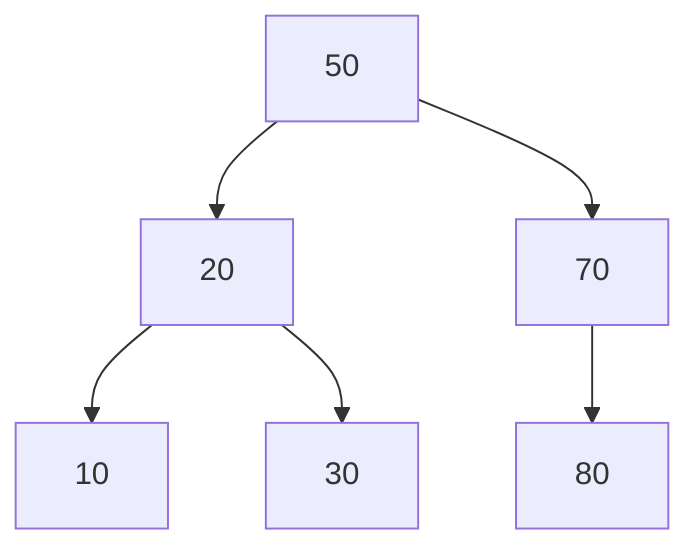
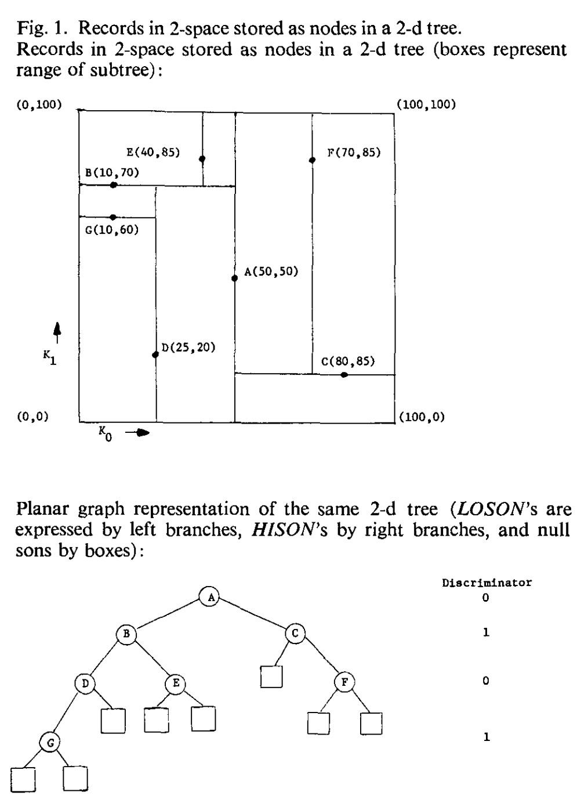
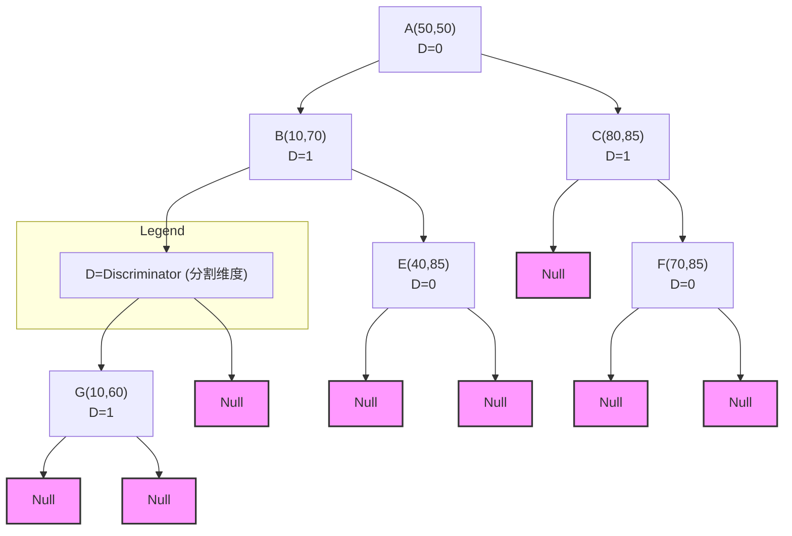

## AI论文解读 | Multidimensional Binary Search Trees Used for Associative Searching
        
### 作者        
digoal        
        
### 日期        
2025-09-06        
        
### 标签        
PostgreSQL , PolarDB , DuckDB , AI , 论文解读        
        
----        
        
## 背景  
      
https://dl.acm.org/doi/pdf/10.1145/361002.361007        
  
提示:          
```          
读懂《Multidimensional Binary Search Trees Used for Associative Searching》这篇论文需要提前掌握哪些基础知识, 请使用中文通熟易懂的讲解这些基础知识, 可以引用论文中的图、表或使用Markdown支持的图形(text,mermaid等)增加解释性. 
  
使用中文通熟易懂的解读《Multidimensional Binary Search Trees Used for Associative Searching》这篇论文, 其中的关键内容请着重讲解, 可以引用论文中的图、表或使用Markdown支持的图形(text,mermaid等)增加解释性. 
  
提取《Multidimensional Binary Search Trees Used for Associative Searching》这篇论文中的重要术语, 使用中文对这些术语进行通熟易懂的讲解, 可以引用论文中的图、表或使用Markdown支持的图形(text,mermaid等)增加解释性. 
```     
  
## 1 前置知识 
  
好的，为了完全理解 Jon Louis Bentley 的这篇经典论文《用于关联搜索的多维二叉搜索树》，您需要掌握一些核心的计算机科学基础知识。这篇论文开创性地提出了 k-d 树（k-dimensional tree）这一数据结构，我会将所需知识点逐一为您通俗地讲解清楚。

### 理解论文所需的基础知识清单

1.  **基础数据结构：节点（Node）与指针（Pointer）**
2.  **核心前置知识：二叉搜索树（Binary Search Tree, BST）**
3.  **问题背景：多维数据（Multidimensional Data）与关联搜索（Associative Searching）**
4.  **算法效率衡量：大O表示法（Big O Notation）**

下面我们来逐一详细解释。

-----

### 1\. 基础数据结构：节点（Node）与指针（Pointer）

想象一下，您要记录一个班级学生的信息。每个学生是一个“信息块”，这个块里有姓名、学号、成绩等。在数据结构中，这样的一个“信息块”就被称为 **节点 (Node)**。

光有节点还不行，我们还需要把它们组织起来。**指针 (Pointer)** 就像是一根根线，它从一个节点出发，指向另一个节点，从而将独立的节点连接成一个有特定结构的整体，比如链表或者树。

在 k-d 树的论文中，每个节点除了存储数据外，还包含两个指针，分别叫 `LOSON` (Low Son) 和 `HISON` (High Son)，它们分别指向左子节点和右子节点 。

### 2\. 核心前置知识：二叉搜索树 (Binary Search Tree, BST)

这是理解 k-d 树 **最重要** 的基础。k-d 树本质上是二叉搜索树在多维空间上的一种扩展 。

**什么是二叉搜索树？**
它是一种特殊的树形结构，用于高效地存储和查找 **一维** 数据（比如，只有一列数字）。它遵循一个简单的规则：

  * 对于树中的任意节点，其左子树中所有节点的值都 **小于** 该节点的值。
  * 其右子树中所有节点的值都 **大于** 该节点的值。

**举个例子：**
假设我们要把数字 `[50, 20, 70, 10, 30, 80]` 存入一个二叉搜索树。

1.  **插入 50**：树是空的，50 成为根节点。
2.  **插入 20**：20 \< 50，所以 20 放在 50 的左边。
3.  **插入 70**：70 \> 50，所以 70 放在 50 的右边。
4.  **插入 10**：10 \< 50，到左子节点 20；10 \< 20，放在 20 的左边。
5.  **插入 30**：30 \< 50，到左子节点 20；30 \> 20，放在 20 的右边。
6.  **插入 80**：80 \> 50，到右子节点 70；80 \> 70，放在 70 的右边。

最终形成的树如下所示：



**优点：** 这样的结构查找起来非常快。比如想找 `30`，我们从 `50` 开始，因为 `30 < 50` 往左走，到了 `20`，因为 `30 > 20` 往右走，就找到了 `30`。每次比较都能排除掉一半的数据，效率很高。

### 3\. 问题背景：多维数据与关联搜索

**多维数据 (Multidimensional Data)**
我们刚才的二叉搜索树处理的是一维数据。但现实世界的数据通常是多维的。比如，论文中举的地图上的城市的例子 ，每个城市都有经度和纬度两个维度。一个点 A 是 `(50, 50)`，这里的 50 和 50 就是它的两个 key (键) 。这篇论文里的 **k** 就是指维度的数量 。

**关联搜索 (Associative Searching)**
关联搜索指的是基于多个属性（维度）进行查询 。例如：

  * **精确匹配 (Exact Match)**: "找到位于纬度 43°3′ N，经度 88° W 的城市" 。
  * **部分匹配 (Partial Match)**: "找到所有纬度为 39° 43′ N 的城市"（只指定了一个维度） 。
  * **范围查询 (Region Query)**: "找到所有在 Oklahoma 州内的城市"（相当于在一个矩形地理范围内查找） 。

传统的二叉搜索树无法高效处理这类多维查询。这就是 k-d 树要解决的核心问题。

#### k-d 树如何扩展二叉搜索树？

k-d 树的巧妙之处在于它 **轮流** 使用不同的维度来分割空间。它引入了一个叫 **判别器 (Discriminator)** 的概念 。

  * **根节点**：使用第 0 个维度（比如 x 轴）来划分。所有 x 坐标小于根节点的点，都去左子树；大于的都去右子树。
  * **第二层节点**：使用第 1 个维度（比如 y 轴）来划分。
  * **第三层节点**：使用第 2 个维度来划分（如果是三维空间）。
  * ...
  * 维度轮流使用，循环往复 `(i+1) mod k` 。

**结合论文图1来理解：**
这篇论文的图1是理解 k-d 树的关键。左边是二维空间中的点，右边是这些点构成的 2-d 树。    
 
*图片来源：Bentley, J. L. (1975). Multidimensional binary search trees used for associative searching. Communications of the ACM, 18(9), 509-517.*

1.  **节点 A (50, 50) 是根节点**。判别器是 0 (x 轴)。它画出一条垂直线 `x = 50`。
      * 所有 x \< 50 的点 (B, D, G, E) 都在 A 的左子树。
      * 所有 x \> 50 的点 (C, F) 都在 A 的右子树。
2.  **看左子树，根是 B (10, 70)**。现在层级为 1，判别器是 1 (y 轴)。它在 `x < 50` 的区域内画出一条水平线 `y = 70`。
      * y \< 70 的点 (D, G) 在 B 的左子树。
      * y \> 70 的点 (E) 在 B 的右子树。
3.  **看右子树，根是 C (80, 85)**。层级为 1，判别器也是 1 (y 轴)。它在 `x > 50` 的区域内画出一条水平线 `y = 85`。
      * y \< 85 的点 (F) 在 C 的左子树。（原文此处 F(70,85) 与 C(80,85) 的 y 值相同，根据论文处理相等值的规则会进入右子树 HISON ，但图示为了简化，可能将F点y值视为略小或有不同处理，核心思想是y轴划分）。
      * y \> 85 的点没有，所以右子树为空。

通过这样不断地用垂直和水平线交替切割空间，k-d 树就实现了对多维空间的划分。

### 4\. 算法效率衡量：大O表示法 (Big O Notation)

论文中充满了诸如 $O(log\~n)$、 $O(n^{(k-t)/k})$ 这样的符号，它们是用来描述算法运行时间随数据量 `n` 增长的趋势的。

  * **$O(log\~n)$ (对数时间)**：非常高效。意味着即使数据量从100万增加到10亿，算法的运行时间可能只是从20步增加到30步。二叉搜索树的查找和插入通常就是这个效率 。
  * **$O(n)$ (线性时间)**：效率尚可。数据量翻倍，运行时间也大致翻倍。
  * **$O(n\~log\~n)$ (线性对数时间)**：比线性时间慢，但仍然算作高效。很多优秀的排序算法是这个效率。论文中提到的优化树的算法就是 $O(n\~log\~n)$ 。
  * **$O(n^c)$ (多项式时间)**：c 是常数。比如 $O(n^2)$。当 n 很大时，效率会变得很差。论文中分析的部分匹配查询最差情况的时间复杂度是 $O(n^{(k-t)/k})$ ，这是一个小于1的指数，所以效率远好于 $O(n)$。

理解了大O表示法，您就能读懂论文中关于各个操作（插入、删除、查询）效率的分析，并明白 k-d 树相比于其他方法的优势所在。

### 总结

在阅读这篇论文之前，请确保您：

1.  **熟悉** 节点和指针的基本概念。
2.  **深刻理解** 普通（一维）二叉搜索树的工作原理。
3.  **清楚** 论文要解决的问题：对地理位置、数据库记录等多维数据进行高效的关联搜索。
4.  **掌握** 大O表示法，以便评估算法的性能。

有了这些基础，您会发现这篇经典的论文思路清晰，论证有力，其核心思想——**通过轮换维度来递归地划分空间**——也会变得非常直观和容易理解。
  
## 2 解读论文 
  
好的，这篇由 Jon Louis Bentley 在1975年发表的论文是计算机科学领域的经典之作，它正式提出了 **k-d 树（k-dimensional tree）** 这一重要的数据结构 。下面，我将为您通俗地解读这篇论文的核心思想与关键内容。

### **论文背景：要解决什么问题？**

在数据库和信息检索中，我们经常需要在大量数据中进行查找。如果只根据一个“主键”（比如学号）来查，问题很简单。但很多时候，我们需要根据多个条件来查找，这被称为 **关联搜索（Associative Searching）** 。

**举个例子**：在一个包含全国所有城市信息的数据库中，我们可能会有这样的查询需求：

  * “找到所有纬度是北纬39°，并且经度是东经116°的城市”（指定所有维度）。
  * “找到所有纬度是北纬30°的城市”（只指定部分维度）。
  * “找到所有位于北纬30°-40°，东经110°-120°范围内的城市”（范围查询）。

在 k-d 树被提出之前，处理这类多维查询的数据结构要么效率不高，要么存储开销巨大，要么只能处理特定类型的查询 。这篇论文的目标就是设计一种**单一、高效**的数据结构，能灵活应对各种关联搜索 。

### **核心思想：k-d 树的定义与构建**

k-d 树的本质是 **二叉搜索树（Binary Search Tree）** 在 **k 个维度** 上的泛化 。

#### **1. 关键构成**

  * **节点 (Node)**：树中的每个节点都存储一条完整的数据记录，比如一个城市的坐标 `(x, y)` 。
  * **指针 (Pointers)**：每个节点有两个指针，`LOSON` 和 `HISON`，分别指向左子树和右子树 。
  * **判别器 (Discriminator)**：这是 k-d 树最核心的创新。每个节点都关联一个“判别器”，这是一个从 0 到 k-1 的整数，**它决定了当前节点应该使用哪个维度来进行比较和划分** 。

#### **2. 构建规则：轮流坐庄的维度划分**

k-d 树的巧妙之处在于，它在树的每一层轮流使用不同的维度作为划分标准 。

  * 树的根节点使用第 0 维 (例如 x 轴) 进行划分 。
  * 根节点的子节点（第 1 层）使用第 1 维 (例如 y 轴) 进行划分 。
  * 第 2 层的节点使用第 2 维进行划分（如果是3D数据的话）。
  * 这个过程循环往复，下一层的判别器是 `(当前层判别器 + 1) mod k` 。

#### **图解 k-d 树的构建 (基于论文图1)**

让我们通过论文中最经典的图1来直观理解一个 2-d 树（k=2）是如何构建和划分空间的。   

*图片来源：Bentley, J. L. (1975). Multidimensional binary search trees used for associative searching. Communications of the ACM, 18(9), 509-517.*

1.  **根节点 A (50, 50)**：

      * **层级**: 0, **判别器**: 0 (x 轴)。
      * **划分规则**: 所有 x 坐标小于 50 的点放入左子树，大于 50 的点放入右子树。
      * **空间划分**: 相当于在图上画了一条垂直线 `x = 50`，将整个空间一分为二。

2.  **节点 B (10, 70)** (A的左孩子):

      * **层级**: 1, **判别器**: 1 (y 轴)。
      * **划分规则**: 在 `x < 50` 的左半空间内，所有 y 坐标小于 70 的点放入 B 的左子树，大于 70 的点放入右子树。
      * **空间划分**: 在左半空间画了一条水平线 `y = 70`。

3.  **节点 C (80, 85)** (A的右孩子):

      * **层级**: 1, **判别器**: 1 (y 轴)。
      * **划分规则**: 在 `x > 50` 的右半空间内，所有 y 坐标小于 85 的点放入 C 的左子树，大于 85 的点放入右子树。
      * **空间划分**: 在右半空间画了一条水平线 `y = 85`。

4.  **节点 D (25, 20)** (B的左孩子):

      * **层级**: 2, **判别器**: 0 (x 轴)，又轮回到x轴。
      * **划分规则**: 在 B 的左子空间内 (`x < 50` 且 `y < 70`)，所有 x 坐标小于 25 的点放入 D 的左子树，大于 25 的点放入右子树。
      * **空间划分**: 对应图中最左下区域的一条短垂直线 `x = 25`。

通过这种方式，k-d 树的每一次插入都在递归地用 **与坐标轴平行的超平面** 将 k 维空间不断细分。

### **核心算法与效率分析**

这篇论文不仅提出了结构，还详细分析了各种操作的算法和它们的运行效率。

#### **1. 插入 (Insertion)**

  * **算法**: 类似于标准二叉搜索树，从根节点开始，根据当前节点的判别器比较对应维度的大小，决定是向左走还是向右走，直到找到一个空位插入新节点 。
  * **效率**: 对于随机插入的n个节点，平均插入时间复杂度为 **$O(log\~n)$** 。这和一维的二叉搜索树一样高效。

#### **2. 搜索 (Searching)**

k-d 树的强大之处在于它能高效支持多种查询。

  * **精确匹配 (Exact Match)**：查找一个所有维度都已知的点。算法和插入过程类似，平均时间复杂度也是 **$O(log\~n)$** 。

  * **部分匹配 (Partial Match)**：这是 k-d 树大放异彩的地方。查询时只指定 t 个维度 (t \< k) 的值 。

      * **算法**: 从根节点递归搜索。如果当前节点的判别器维度是查询**指定的**维度，那么只需往一个子树（左或右）继续搜索；如果判别器维度是查询**未指定的**维度，则 **两个子树都必须搜索** 。
      * **效率**: 论文证明，在最优情况下，其最差运行时间为 **$O(n^{(k-t)/k})$** 。例如，在 2 维空间中查找只指定了 1 个维度的点 (k=2, t=1)，效率约为 $O(n^{1/2})$，即 $O(\\sqrt{n})$，这远比遍历所有 n 个点要快。

  * **范围搜索 (Region Search)**：查找一个超矩形区域内的所有点 。

      * **算法**: `REGIONSEARCH` 算法在递归时，会判断当前节点所代表的整个空间区域是否与查询区域有交集。如果有，才继续向下搜索；如果完全没有交集，则整个子树被“剪枝”，无需访问 。这是 k-d 树处理范围查询效率高的关键。

  * **最近邻搜索 (Nearest Neighbor)**：寻找距离给定点P最近的数据点。

      * **效率**: 论文指出，经验性测试表明平均运行时间为 **$O(log\~n)$** 。

#### **3. 删除 (Deletion)**

  * **算法**: 删除操作比较复杂。如果要删除的节点不是叶子节点，需要从其子树中找到一个合适的替代节点（例如，在判别器维度上的最小值或最大值节点）来填补它的位置，然后递归地删除那个替代节点 。
  * **效率**:
      * 删除根节点的代价很高，最差情况为 **$O(n^{(k-1)/k})$** 。
      * 但幸运的是，删除一个**随机**节点的平均代价是 **$O(log\~n)$** 。

#### **4. 优化 (Optimization)**

  * **问题**: 如果插入的数据不是随机的（例如，按某种顺序插入），k-d 树可能会变得非常不平衡，导致性能下降 。
  * **算法**: 论文提出了一个 `OPTIMIZE` 算法，可以通过选取数据点在当前维度的**中位数**作为根节点，然后递归地对左右两部分数据构建子树，从而创建一棵完全平衡的 k-d 树 。
  * **效率**: 该算法的时间复杂度为 **$O(n\~log\~n)$**，与排序的效率相当 。对于静态数据集（不再增删），一次优化可以保证后续所有查询都达到最优的对数级性能 。

### **应用场景**

论文最后展望了 k-d 树的实际应用 。

1.  **信息检索系统**: 比如上文提到的地理信息系统，可以快速查找特定区域的城市或兴趣点 。
2.  **语音识别**: 将语音信号分解为多个特征（维度），每个单词的模板就是一个 k 维空间中的点。k-d 树的最近邻搜索可以高效地找到与当前语音最匹配的单词模板 。

### **结论与意义**

这篇论文的重大贡献在于：

  * **开创性**: 首次提出 k-d 树这一通用且优雅的多维数据结构。
  * **多功能性**: 证明了**单一数据结构**可以高效地处理多种不同类型的关联查询，如精确匹配、部分匹配、范围查询和最近邻搜索 。
  * **理论分析**: 提供了对各项操作严格的算法复杂性分析，证明了其在平均情况下的高效性（插入、删除为 $O(log\~n)$）以及在部分匹配等关键查询上的性能上界 。

k-d 树至今仍然是处理中低维度空间数据问题的基石算法之一，在数据库索引、计算机图形学、机器学习等领域有着广泛的应用。
  
## 3 术语 
  
好的, 这是对论文《Multidimensional Binary Search Trees Used for Associative Searching》中重要术语的提取和中文讲解。

这篇由 Jon Louis Bentley 在1975年发表的论文，开创性地提出了一种名为 **k-d 树 (k-dimensional tree)** 的数据结构，旨在高效解决 **关联搜索 (Associative Searching)** 问题 。以下是该论文中的核心术语及其通俗解释。

### 1\. k-d 树 (Multidimensional Binary Search Tree)

k-d 树是一种多维二叉搜索树 。你可以把它想象成一个专门为多维数据（例如二维平面上的坐标点、三维空间中的物体位置等）设计的普通二叉搜索树。

  * **核心思想**: 普通的二叉搜索树在每个节点上都基于同一个标准（比如数值大小）来决定走向左子树还是右子树。而 k-d 树的特别之处在于，它在树的每一层使用 **不同维度** 的坐标来分割数据 。
  * **存储结构**: 文件中的每条记录都作为树的一个节点存储 。除了记录本身的数据外，每个节点还包含两个指针，分别指向其左、右子树（论文中称为 LOSON 和 HISON） 。
  * **例子**: 假设我们有一组二维坐标点 (k=2)。
      * 根节点会使用第 0 维（比如 x 轴）来分割数据。所有 x 坐标比根节点小的点都进入左子树，所有 x 坐标比根节点大的点都进入右子树 。
      * 到了第二层，节点会使用第 1 维（y 轴）来分割。
      * 第三层则又回到第 0 维（x 轴），如此循环往复 。

论文中的图1直观地展示了这一点。左图是二维空间中的点，右图是对应的 k-d 树结构。

  

根节点 A(50,50) 以 x 轴 (Discriminator 0) 分割空间，所有 x\<50 的点（如 B, D, G, E）在左边，x\>50 的点（如 C, F）在右边。A 的子节点 B 和 C 则以 y 轴 (Discriminator 1) 分割它们各自的子空间。

下面是用 Mermaid 图形语法表示的树结构：



### 2\. 关联搜索 (Associative Searching)

关联搜索指的是基于 **多个键（或属性）** 的组合条件来查找记录 。这与传统的基于单个“主键”的搜索不同 。例如，在一个包含“城市”、“经度”、“纬度”和“人口”的数据库中，一个关联搜索可以是“查找所有纬度在30到40度之间，且人口超过100万的城市”。k-d 树这种能够处理多维数据的结构，天然适合执行关联搜索 。

### 3\. 鉴别器 (Discriminator)

鉴别器是一个与树中每个节点关联的整数（从 0 到 k-1），它决定了在该节点使用哪个维度进行数据分割 。在标准的 k-d 树中，鉴别器在树的层级之间循环 。

  * **根节点 (第0层)**: 鉴别器为 0 。
  * **第1层节点**: 鉴别器为 1 。
  * ...
  * **第k-1层节点**: 鉴别器为 k-1 。
  * **第k层节点**: 鉴别器再次回到 0 。

这个机制确保了数据在所有维度上都能被相对均匀地分割。

### 4\. 查询类型 (Query Types)

k-d 树能够高效地处理多种复杂的查询类型 。

#### 4.1. 部分匹配查询 (Partial Match Queries)

这类查询指定了 **部分（而非全部）** 键的值，要求找出所有匹配这些指定值的记录 。

  * **例子**: 在一个城市数据库中，一个部分匹配查询是“查找所有纬度为 39° 43′ N 的城市” 。这里只指定了纬度，没有指定经度。
  * **效率**: 论文证明，对于一个包含 n 个记录的 k 维数据，当指定 t 个键时，其最差查询时间为 $O(n^{(k-t)/k})$ ，远超当时已知的其他算法 。

#### 4.2. 区域查询 (Region Queries)

这是最通用的查询类型，它要求查找所有落在一个指定 **多维区域** 内的记录 。

  * **例子**: “查找所有纬度在 $36.5^{\\circ}$ 到 $37^{\\circ}$ 之间，且经度在 $100^{\\circ}$ 到 $103^{\\circ}$ 之间的城市” 。这个查询定义了一个地理上的矩形区域。
  * **灵活性**: 精确匹配（区域是一个点）和部分匹配（区域是一个超平面）都可以看作是区域查询的特例 。论文提出的 `REGIONSEARCH` 算法能够通过剪枝（即跳过那些与查询区域不相交的子树）来高效完成搜索 。

#### 4.3. 最近邻查询 (Nearest Neighbor Queries)

这类查询要求在一个数据集中，找到距离给定点 P **最近** 的一个点 。

  * **例子**: “在地图上找到离北卡罗来纳州达勒姆市最近的城市是哪个？” 。
  * **效率**: 论文指出，经验测试表明 k-d 树执行此类查询的平均时间为 $O(\\log n)$，性能非常出色 。

### 5\. 优化 (Optimization)

虽然通过随机插入节点构建的 k-d 树平均性能很好（插入和查找的平均时间为 $O(\\log n)$），但在某些情况下（如数据本身有序或数据集是静态的），树可能会变得不平衡 。

  * **优化算法**: 论文提供了一个 `OPTIMIZE` 算法，它能将一组给定的记录构建成一棵 **完全平衡** 的 k-d 树，确保所有叶子节点都出现在相邻的两层上 。
  * **工作原理**: 该算法在每个节点上都找到当前数据集在该维度的 **中位数** 作为分割点，从而保证分裂后的两个子集大小几乎相等 。
  * **成本与收益**: 构建这样一棵最优树的时间复杂度是 $O(n \\log n)$，但一旦建成，它可以保证后续的搜索性能达到对数级别 。
  
## 参考        
         
https://dl.acm.org/doi/pdf/10.1145/361002.361007    
        
<b> 以上内容基于DeepSeek、Qwen、Gemini及诸多AI生成, 轻微人工调整, 感谢杭州深度求索人工智能、阿里云、Google等公司. </b>        
        
<b> AI 生成的内容请自行辨别正确性, 当然也多了些许踩坑的乐趣, 毕竟冒险是每个男人的天性.  </b>        
  
  
