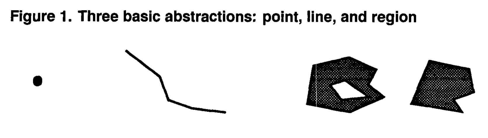
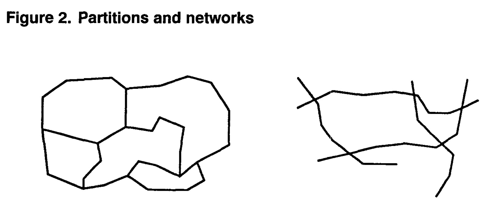
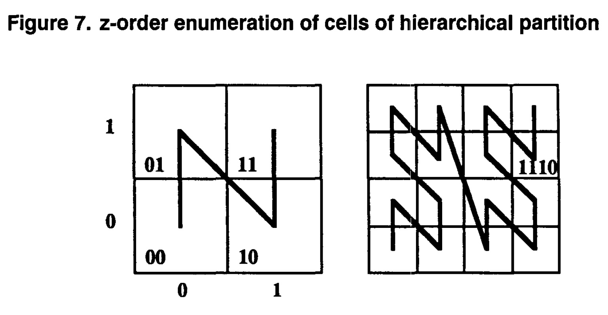
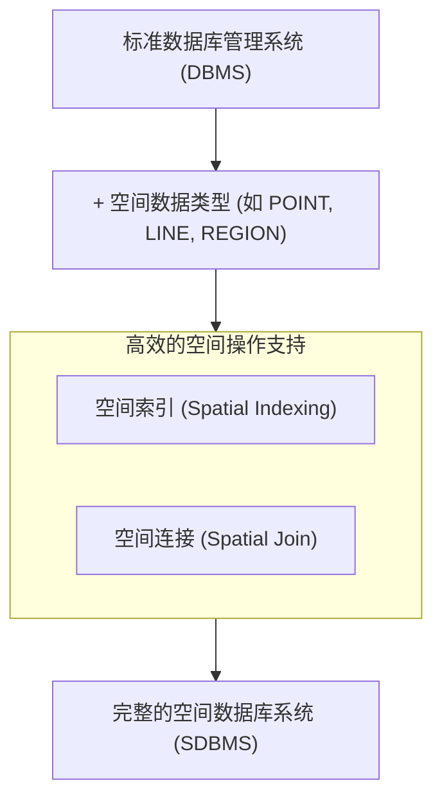
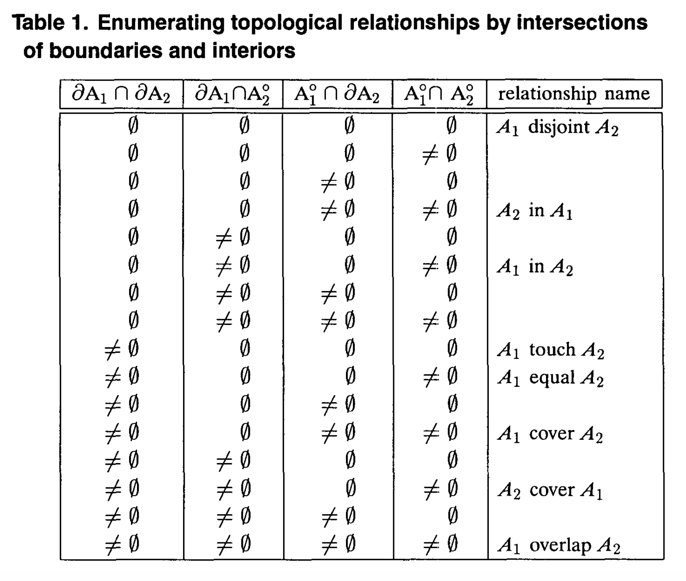
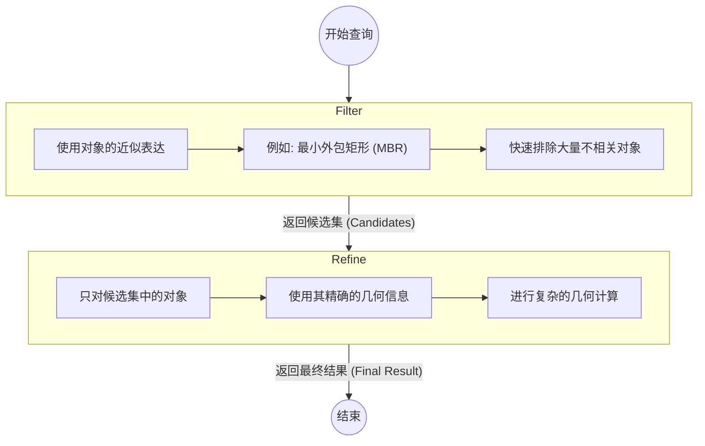
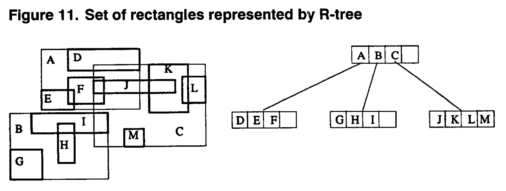
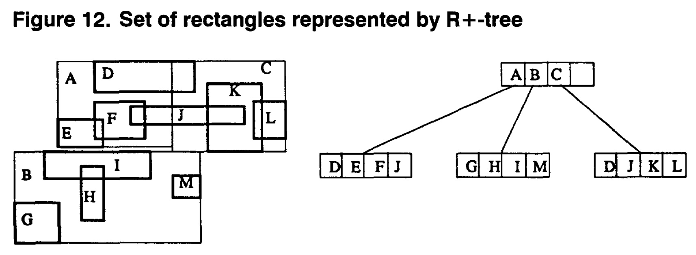
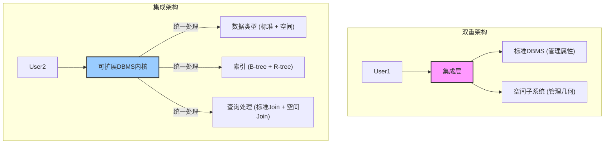
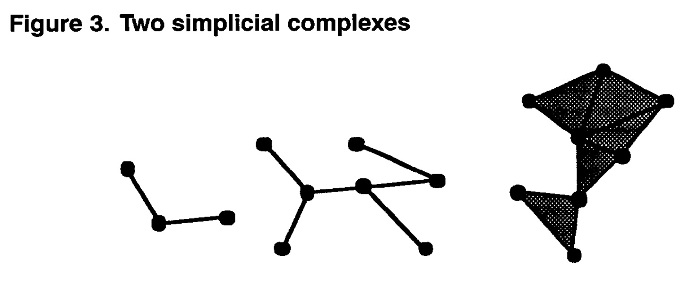

## AI论文解读 | An Introduction to Spatial Database Systems
        
### 作者        
digoal        
        
### 日期        
2025-09-06        
        
### 标签        
PostgreSQL , PolarDB , DuckDB , AI , 论文解读        
        
----        
        
## 背景  
      
https://dl.acm.org/doi/pdf/10.5555/615204.615206        
  
提示:          
```          
读懂《An Introduction to Spatial Database Systems》这篇论文需要提前掌握哪些基础知识, 请使用中文通熟易懂的讲解这些基础知识, 可以引用论文中的图、表或使用Markdown支持的图形(text,mermaid等)增加解释性. 
  
使用中文通熟易懂的解读《An Introduction to Spatial Database Systems》这篇论文, 其中的关键内容请着重讲解, 可以引用论文中的图、表或使用Markdown支持的图形(text,mermaid等)增加解释性. 
  
提取《An Introduction to Spatial Database Systems》这篇论文中的重要术语, 使用中文对这些术语进行通熟易懂的讲解, 可以引用论文中的图、表或使用Markdown支持的图形(text,mermaid等)增加解释性. 
```     
  
## 1 前置知识 
  
要读懂《An Introduction to Spatial Database Systems》这篇论文，您需要先掌握一些与空间数据和数据库相关的核心基础知识。这些知识可以概括为以下几个方面：

-----

### 1\. 空间数据类型 (Spatial Data Types)

这是理解整篇论文的基石。空间数据库系统区别于传统数据库系统的关键，在于它能够处理**空间数据类型**（SDTs）。这篇论文提出了三种最基本的空间抽象类型：

  * **点 (POINT)**：用于表示只有位置但没有范围的对象，比如在一个大尺度的地图上表示一个城市 。
  * **线 (LINE)**：用于表示空间中的连接或移动路径，比如河流、道路或电话线 。
  * **区域 (REGION)**：用于表示在二维空间中有范围的对象，比如一个国家、湖泊或公园 。一个区域可以有洞，也可以由多个不相连的部分组成 。

以下是论文中展示这三种基本抽象的图： 

   
 
图 1. 三种基本抽象类型：点、线和区域

-----

### 2\. 空间对象的建模方式

论文提到了两种看待空间数据的不同视角：

  * **空间中的对象 (Objects in space)**：关注的是空间中独立的实体，每个实体都有自己的几何描述，比如城市、森林或河流 。
  * **空间本身 (Space)**：关注的是描述空间中的每一个点，比如描述土地利用或将一个国家划分为不同区域的专题地图 。

为了表示复杂关系，论文还介绍了两种重要的空间对象集合：

  * **分区 (Partitions)**：一组不相交的区域对象，例如用于表示专题地图 。
  * **网络 (Networks)**：一个嵌入在平面中的图，由点对象（节点）和线对象（边）构成，例如公路或河流网络 。

   

图 2. 分区和网络


-----

### 3\. 空间关系与运算

了解空间对象之间的关系和可以对它们进行的操作至关重要。论文将空间关系分为三类 ：

  * **拓扑关系 (Topological relationships)**：与距离和方向无关，只关心连接性。比如“相邻 (adjacent)”、“相交 (intersects)”、“包含 (in)”和“分离 (disjoint)” 。论文中描述的“九交模型”就是一种形式化定义拓扑关系的方法 。
  * **方向关系 (Direction relationships)**：比如“在...上方 (above)”、“在...下方 (below)”或“在...东北 (north\_of)” 。
  * **度量关系 (Metric relationships)**：基于距离和尺寸，比如“距离小于 100”或“面积大于 1000” 。

此外，论文还提到了四类空间运算，例如：

  * **空间谓词 (Spatial predicates)**：返回布尔值，用于表达拓扑关系，例如 `inside`、`intersects` 。
  * **返回空间数据类型值的运算 (Operations returning SDT values)**：例如 `intersection`（相交）和 `plus`（求并集）。
  * **返回数值的运算 (Operators returning numbers)**：例如 `dist`（距离）、`perimeter`（周长）和 `area`（面积）。

-----

### 4\. 空间索引 (Spatial Indexing)

为了高效地在大型空间数据集中进行检索，必须使用空间索引，而不仅仅是扫描整个数据集 。论文中介绍了两种基本思想 ：

  * **使用近似值 (Approximations)**：不直接处理复杂的几何对象，而是使用简单的几何图形来近似表示它们，例如：
      * **边界框 (Bounding Box)**：包围空间对象的最小轴平行矩形 。
      * **网格近似 (Grid approximations)**：将空间划分为规则的网格单元，用与对象相交的网格单元集合来表示对象 。
  * **一维映射 (Mapping into 1-D)**：将多维空间对象映射到一维空间，然后可以使用传统的 B-树等一维索引结构进行管理 。

论文以 **z-order** 为例解释了这种方法 。z-order 通过交替使用坐标位的二进制表示来生成一个一维序列，这个序列保留了空间邻近性，因此可以用于高效的范围查询 。

   

图 7. 分层分区的 z-order 枚举


-----

### 5\. 空间查询 (Spatial Querying)

论文详细讨论了空间数据库中的查询类型 ：

  * **空间选择 (Spatial selection)**：根据空间谓词从一个对象集中筛选出满足条件的对象，例如“查找所有与某个矩形相交的河流” 。
  * **空间连接 (Spatial join)**：将两个不同类别的空间对象，通过它们之间的空间关系进行连接，比如“找到所有与城市相交的河流” 。
  * **其他集合操作 (Other set operations)**：例如 **`Overlay`**（叠加），它计算两个分区叠加后产生的基本区域，这在 GIS 应用中非常常见 。
  
## 2 解读论文 
  
好的，我们来通俗易懂地解读这篇空间数据库领域的经典论文《An Introduction to Spatial Database Systems》。

这篇由 Ralf Hartmut Güting 撰写的论文发表于1994年的《VLDB Journal》，是该领域的奠基性综述文章。它系统地定义了什么是空间数据库系统，并围绕**数据建模、查询、实现技术和系统架构**这四个核心方面，全面介绍了相关技术和理念。

-----

### 核心定义：到底什么是空间数据库系统？

在论文的开篇，作者就提出了一个至今仍被广泛引用的经典定义。一个真正的空间数据库系统（Spatial Database System, SDBMS）必须满足三个条件 ：

1.  **它首先是一个数据库系统 (A database system)** 。

      * **解读**：这意味着它必须具备标准数据库的所有功能，比如数据管理、事务处理、并发控制、数据恢复等 。它不能只是一个只能处理几何图形的“偏科生”，因为空间数据（如一栋建筑的位置）总是和非空间数据（如建筑的名称、年份、所有者）紧密相连的 。

2.  **它在数据模型和查询语言中提供了空间数据类型 (Spatial Data Types, SDTs)** 。

      * **解读**：就像数据库有`INTEGER`、`TEXT`等类型一样，空间数据库必须原生支持`POINT`（点）、`LINE`（线）、`REGION`（区域）这样的类型 。这使得用户可以直接在数据库层面进行空间建模，而不用费尽心思地用一堆数字坐标来间接表示一个湖泊或一条公路。

3.  **它在实现层面支持空间数据类型，至少提供空间索引和高效的空间连接算法** 。

      * **解读**：这是性能的关键。如果查询“北京市海淀区所有的星巴克”，系统不能去扫描全国所有的星巴克门店再一一判断 。它必须有**空间索引**（就像书的目录）来快速定位到海淀区这个范围。同样，在进行“找出所有穿过北京市的河流”这类查询时，它需要有高效的**空间连接**（Spatial Join）算法，而不是简单粗暴地将所有河流和北京市的边界进行比较 。

用一个流程图来总结这个定义：



-----

### 第一部分：空间数据建模 (Modeling)

这部分探讨如何在数据库中科学地表达现实世界的空间实体。

#### 1\. 我们需要表示什么？

作者认为，空间数据建模有两种主流视角 ：

  * **对象视角 (Objects in space)**：把世界看作是独立实体的集合，比如城市、河流、森林等 。
  * **空间视角 (Space)**：把空间本身作为描述对象，关心空间中每个点的属性，比如土地利用类型图、行政区划图 。

为了满足这些需求，论文提出了最基本的三种抽象：**点、线、区域** 。

  * **点 (Point)**：表示只关心位置而不在乎其范围的物体，比如一张大尺度地图上的城市 。
  * **线 (Line)**：通常指代网络或连接，如道路、河流、管线等 。
  * **区域 (Region)**：指有一定覆盖范围的实体，比如湖泊、国家公园、行政区 。一个区域可以有空洞（比如湖中岛），也可以由多个不相连的部分组成 。

   

*论文图1：点、线、区域三种基本抽象*

此外，还有两种重要的空间对象集合：**分区 (Partitions)** 和 **网络 (Networks)** 。分区代表了一组互不重叠且完全覆盖某个区域的单元（如省份划分），而网络则是由点和线构成的图结构（如公路网）。

#### 2\. 空间关系的表达

空间关系是空间查询的核心，论文将其分为三类 ：

  * **拓扑关系 (Topological)**：描述对象间的邻接、包含等关系，如`adjacent`（相邻）、`inside`（在...之内）、`disjoint`（相离）。这类关系不随对象的缩放、旋转、平移而改变 。
  * **方向关系 (Direction)**：如`above`（在...上方）、`north_of`（在...北方）。
  * **度量关系 (Metric)**：涉及距离，如`distance < 100` 。

论文重点介绍了**拓扑关系**的系统化研究。Egenhofer提出的方法是，通过比较两个区域A和B的 **边界(∂)** 和 **内部(°)** 的交集是否为空，来确定它们之间的拓扑关系 。边界与内部的组合共有4种交集（ $\\partial A \\cap \\partial B, \\partial A \\cap B^{\\circ}, A^{\\circ} \\cap \\partial B, A^{\\circ} \\cap B^{\\circ}$ ），每种交集有“空”与“非空”两种状态，理论上产生 $2^4 = 16$ 种组合 。排除掉现实中不可能出现的组合后，最终得到8种基本拓扑关系（其中`cover/covered by`和`inside/contains`是互逆的，所以本质是6种） 。

下表展示了这种判别方法：

   

*论文表1：通过边界和内部的交集来枚举拓扑关系*

> **着重讲解**：这个基于“4交集”（后来发展为包含外部的“9交集”）的模型是空间关系理论的一个里程碑。它首次提供了一种严谨、完备的方式来定义和区分拓扑关系，为后续空间查询语言的设计和实现奠定了坚实的理论基础。

-----

### 第二部分：空间查询 (Querying)

这部分讨论如何向空间数据库“提问”。

#### 1\. 核心查询操作

  * **空间选择 (Spatial Selection)**：根据空间谓词（条件）来筛选对象。例如 ：

      * `cities select[center inside Bavaria]` (查询所有位于巴伐利亚州内的城市) 。
      * `rivers select[route intersects Window]` (查询所有与指定窗口相交的河流) 。

  * **空间连接 (Spatial Join)**：根据两个对象集合之间的空间关系将它们连接起来。例如 ：

      * `cities states join[center inside area]` (将每个城市与其所在的州进行匹配) 。
      * `cities rivers join[dist(center, route) < 50]` (找出每条河流附近50公里内的所有城市) 。

#### 2\. 图形化交互的重要性

与传统数据库不同，空间查询的结果通常需要**图形化展示** 。用户希望看到的是一张地图，而不是一堆冷冰冰的坐标数据。因此，一个好的空间数据库查询系统应该支持 ：

  * **结果图形化显示**与**多图层叠加** 。
  * **提供上下文**（例如，显示一个查询出的城市时，自动带上其所在的省份边界作为背景）。
  * **通过图形界面进行交互**，如缩放、点选查询等 。
  * **自定义符号和图例** 。

-----

### 第三部分：实现工具 (Tools for Implementation)

这部分是论文的技术核心，讲解了如何高效地实现空间数据库的底层功能。

#### **空间索引 (Spatial Indexing) - 关键内容**

空间索引是解决空间查询效率问题的核心技术 。其基本思想是 **“过滤与精确求精” (Filter and Refine)策略** 。



**解读**：

1.  **过滤步骤**：直接对复杂的多边形进行计算太慢了。所以系统先用一个简单的形状（最常用的是**最小外包矩形，Minimum Bounding Rectangle, MBR**）来近似地代表每个空间对象 。查询时，先用查询区域的MBR和所有对象的MBR进行比较。这个过程非常快，可以迅速过滤掉绝大部分不相关的对象 。
2.  **精确求精步骤**：上一步得到的是一个“候选集”，它包含了所有可能满足条件的对象，但也可能包含一些“误报”（比如两个对象的MBR相交，但它们本身不相交）。这一步只对候选集中的对象，使用它们真实的、复杂的几何数据进行精确的计算，从而得到最终结果 。

为了实现高效的过滤，论文介绍了几种主流的空间索引结构：

  * **基于一维嵌入的方法**：通过某种方式（如**Z-order**或**位交叉**）将二维空间坐标映射成一维的数值或字符串，然后就可以使用像B-tree这样的传统一维索引来管理 。    
    *论文图7：Z-order，一种将二维空间递归映射到一维序列的方法*

  * **R-tree (Region Tree)**：这是管理矩形数据（即对象的MBR）最经典的索引结构 。它是一种类似于B-tree的多路平衡树。它的特点是，非叶子节点存储的是其所有子节点所代表矩形的MBR。这样查询时，如果查询窗口与某个节点的MBR不相交，那么这个节点下的整棵子树都可以被安全地跳过，从而大大提高了查询效率。

      * **R-tree** 允许节点的MBR相互重叠，这可能导致查询时需要探查多个分支 。
      * **R+-tree** 是其变体，它不允许节点重叠。为了做到这一点，当一个对象跨越多个节点范围时，它会被**切割 (Clipping)** 成多片，存储在不同的叶子节点中 。

   

*论文图11：R-tree结构，节点A、B、C的范围可以重叠*

   

*论文图12：R+-tree结构，节点A、B、C范围不重叠，对象D和J被切割存储*

-----

### 第四部分：系统架构 (System Architecture)

这部分探讨了如何构建一个完整的空间数据库系统。论文对比了三种架构：

1.  **分层架构 (Layered Architecture)**：在标准的商用数据库（如关系型数据库）之上，构建一个空间处理层 。缺点是数据库本身不理解空间数据（只当做二进制大对象或打散的坐标存储），所有空间操作都得在应用层完成，效率极低 。

2.  **双重架构 (Dual Architecture)**：这是当时很多商用GIS（如ARC/INFO）采用的架构 。它将非空间属性数据存储在标准DBMS中，而将空间几何数据存储在一个独立的文件系统或专门的子系统中，两者通过ID关联 。优点是空间数据的处理可以专门优化，但缺点是查询处理被割裂，难以进行全局优化，且系统复杂，数据一致性难以保证 。

3.  **集成架构 (Integrated Architecture) - 关键内容**：这是作者最为推崇的架构，基于**可扩展数据库系统 (Extensible DBMS)** 。其核心思想是，不应该把空间数据类型和操作看作是“二等公民”，而应将其与`INTEGER`、`STRING`等标准类型同等对待，深度集成到数据库内核的方方面面 。




**解读**：集成架构的优势是巨大的。查询优化器可以通盘考虑是使用B-tree索引（针对非空间属性）还是R-tree索引（针对空间属性）更优 ，从而生成全局最优的查询计划。整个系统浑然一体，易于维护和扩展。当时的可扩展数据库项目（如POSTGRES, Starburst）为实现这一理想架构铺平了道路 。

-----

### 总结

Ralf Hartmut Güting的这篇论文是空间数据库领域的“开山之作”。它不仅给出了一个清晰且影响深远的**定义**，还系统性地梳理了从**理论模型**到**查询语言**，再到**底层索引技术**和顶层**系统架构**的完整技术体系。

  * **核心贡献**：
    1.  提出了SDBMS的三要素定义。
    2.  系统阐述了空间数据建模，特别是拓扑关系的形式化。
    3.  强调了“过滤与精确求精”策略以及R-tree等空间索引的重要性。
    4.  高瞻远瞩地指出了基于可扩展DBMS的“集成架构”是未来发展的正确方向。

尽管发表于1994年，但这篇论文中提出的核心概念和技术路线，至今仍是现代空间数据库和地理信息系统（GIS）的基石。对于任何想要了解空间数据管理的人来说，它都是一篇必读的经典文献。
  
## 3 术语 
  
本篇论文《An Introduction to Spatial Database Systems》的核心是空间数据库系统，它在传统数据库的基础上，增加了处理和管理空间数据（如地理位置、几何图形等）的能力。以下是论文中一些重要的术语及其通俗易懂的解释：

-----

### 1\. 空间数据类型 (Spatial Data Types, SDTs)

空间数据库系统与传统数据库系统的根本区别在于它能处理**空间数据类型** 。这些数据类型为空间中的几何实体提供了基本的抽象模型 。论文中提到了三种最基本的类型：

  * **点 (POINT)**：表示只有位置但没有范围的对象 。比如，在大尺度地图上表示一个城市 。
  * **线 (LINE)**：表示空间中的连接或路径，通常由线段序列组成 。例如，道路、河流或电缆线 。
  * **区域 (REGION)**：表示在二维空间中有范围的对象 。一个区域可以有洞，也可以由不相连的多个部分组成 。比如一个国家或湖泊 。


   

图 1. 空间数据类型：点、线、区域

-----

### 2\. 空间关系与运算

空间数据库系统不仅存储空间数据，还能处理它们之间的关系和进行各种运算 。

  * **空间关系 (Spatial Relationships)**：描述空间对象之间的相互位置，可以分为三类:
      * **拓扑关系 (Topological relationships)**：与距离和方向无关，只关注连接性。例如“相邻 (adjacent)”、 “相交 (intersects)”、“包含 (inside)”和“分离 (disjoint)” 。论文提到了**九交模型**（nine-intersection method）来形式化定义这些关系 。
      * **方向关系 (Direction relationships)**：描述方向，例如“上方 (above)”或“东北方 (north\_of)” 。
      * **度量关系 (Metric relationships)**：基于距离和尺寸，例如“距离小于 100”或“面积大于 1000” 。
  * **空间运算 (Spatial Operations)**：对空间数据进行处理的操作 。
      * **空间谓词 (Spatial predicates)**：用于表达空间关系，返回布尔值（是/否）。例如，`intersects`（相交）和 `inside`（在内部）。
      * **返回空间数据类型值的运算**：运算结果仍是一个空间对象，例如 `intersection`（求交集）和 `plus`（求并集）。
      * **返回数值的运算**：运算结果是数值，例如 `dist`（距离）、`perimeter`（周长）和 `area`（面积）。

-----

### 3\. 空间索引 (Spatial Indexing)

为了在海量空间数据中高效检索，空间索引必不可少 。它避免了对整个数据集进行扫描 。论文中提到了两种基本思想：

  * **使用近似值 (Approximations)**：通过简单的几何图形来近似复杂的空间对象 。
      * **边界框 (Bounding Box)**：包围空间对象的最小轴平行矩形 。
      * **网格近似 (Grid approximations)**：用与对象相交的网格单元集合来表示对象 。
  * **一维映射 (Mapping into 1-D)**：将多维空间对象映射到一维空间，然后使用传统的B-树等索引结构进行管理 。**z-order** 是这种方法的一个著名例子 。它将多维坐标的二进制位交替组合成一个一维序列，这个序列能很好地保持空间邻近性 。

   

图 2. z-order 示例：将二维空间单元格映射为一维序列

-----

### 4\. 空间查询 (Spatial Querying)

空间查询是在空间数据库中进行的数据检索 。论文介绍了两种重要的查询类型：

  * **空间选择 (Spatial selection)**：根据一个空间谓词从对象集中筛选出满足条件的对象 。例如，“找到所有与一个特定矩形相交的河流” 。
  * **空间连接 (Spatial join)**：将两个不同类别的空间对象，通过它们之间的空间关系进行连接 。例如，“找到所有与城市相交的河流” 。

-----

### 5\. 空间对象集合

除了单一的空间对象，论文还提到了两种重要的空间对象集合 ：

  * **分区 (Partitions)**：一组不相交的区域对象，共同覆盖一个区域 。例如，表示不同土地利用类型的主题地图 。
  * **网络 (Networks)**：嵌入在平面中的图，由点对象（节点）和线对象（边）构成 。例如，公路或河流网络 。

   

图 3. 分区和网络

  
## 参考        
         
https://dl.acm.org/doi/pdf/10.5555/615204.615206    
        
<b> 以上内容基于DeepSeek、Qwen、Gemini及诸多AI生成, 轻微人工调整, 感谢杭州深度求索人工智能、阿里云、Google等公司. </b>        
        
<b> AI 生成的内容请自行辨别正确性, 当然也多了些许踩坑的乐趣, 毕竟冒险是每个男人的天性.  </b>        
  
