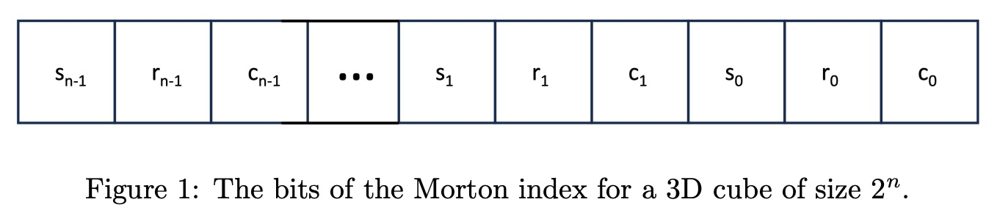
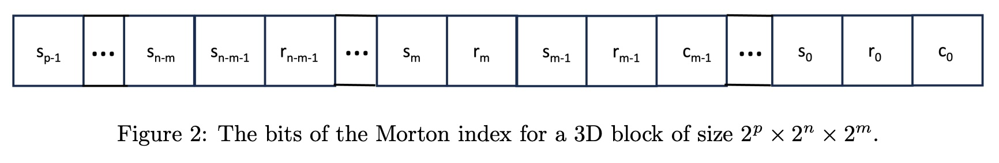
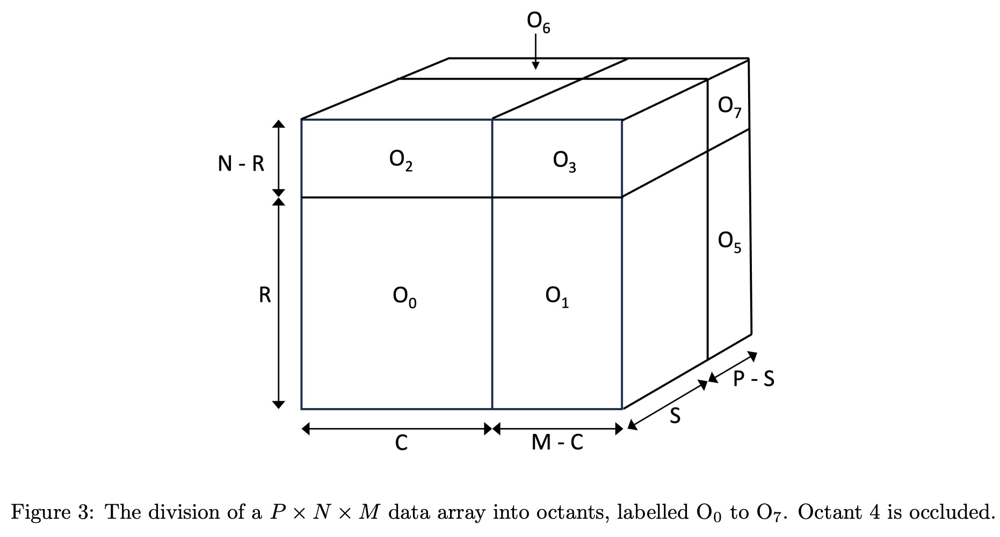
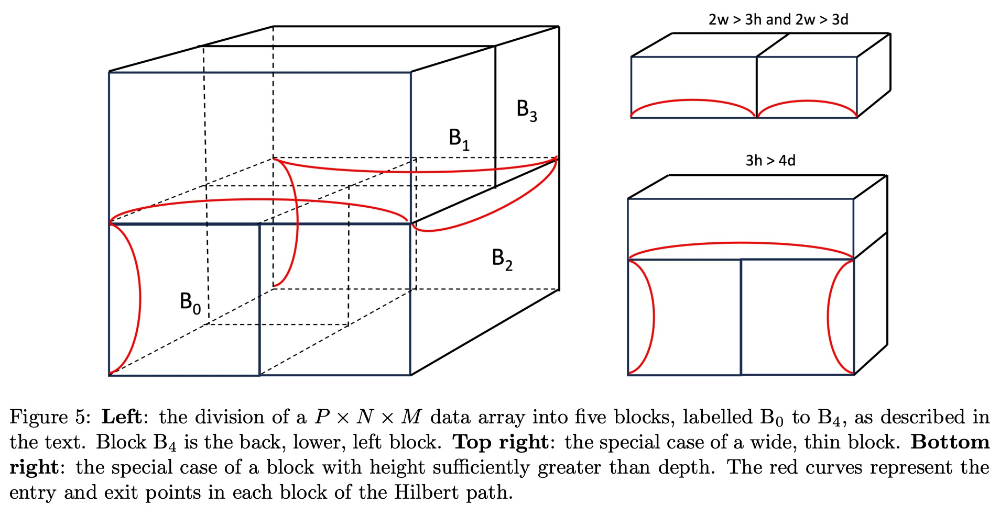
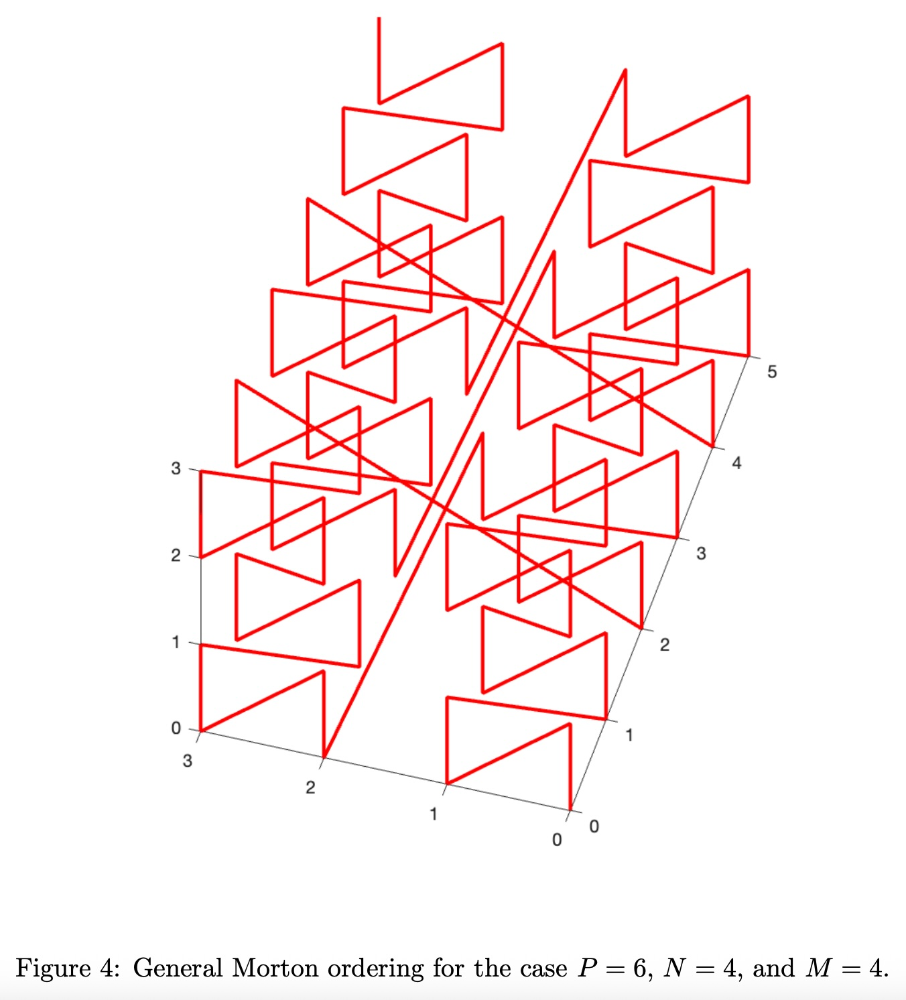
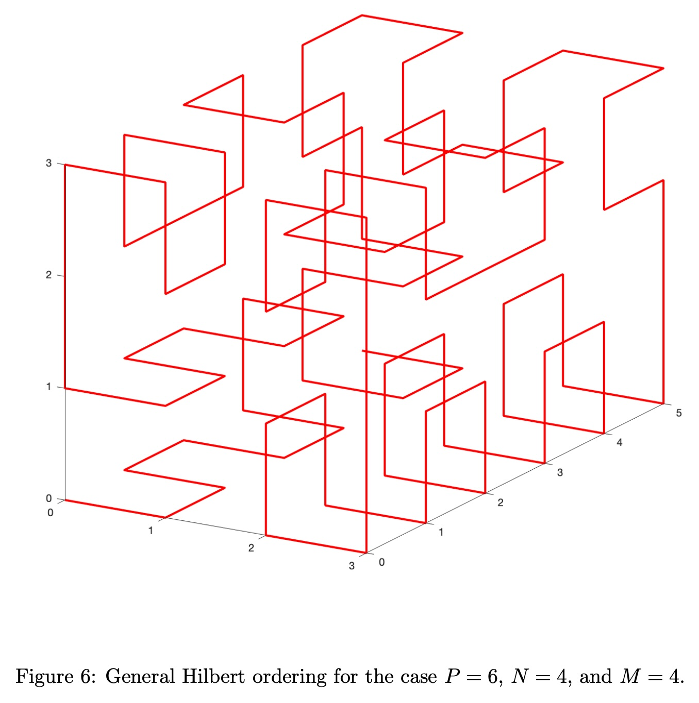

## AI论文解读 | Generalised 3D Morton and Hilbert Orderings
        
### 作者        
digoal        
        
### 日期        
2025-09-06        
        
### 标签        
PostgreSQL , PolarDB , DuckDB , AI , 论文解读        
        
----        
        
## 背景  
      
https://arxiv.org/pdf/2309.15199        
  
提示:          
```          
读懂《Generalised 3D Morton and Hilbert Orderings》这篇论文需要提前掌握哪些基础知识, 请使用中文通熟易懂的讲解这些基础知识, 可以引用论文中的图、表或使用Markdown支持的图形(text,mermaid等)增加解释性. 
  
使用中文通熟易懂的解读《Generalised 3D Morton and Hilbert Orderings》这篇论文, 其中的关键内容请着重讲解, 可以引用论文中的图、表或使用Markdown支持的图形(text,mermaid等)增加解释性. 
  
提取《Generalised 3D Morton and Hilbert Orderings》这篇论文中的重要术语, 使用中文对这些术语进行通熟易懂的讲解, 可以引用论文中的图、表或使用Markdown支持的图形(text,mermaid等)增加解释性. 
```     
  
## 1 前置知识 
  
这篇文章《Generalised 3D Morton and Hilbert Orderings》讨论了如何为任意尺寸的三维数据量生成广义的莫顿（Morton）和希尔伯特（Hilbert）排序。为了理解这篇论文，你需要掌握以下几个核心概念：

-----

### 1\. 空间填充曲线 (Space-Filling Curves)

空间填充曲线是一种可以将多维空间（如二维平面或三维体）映射到一维直线上，并且能够保持数据空间局部邻近性的曲线。简单来说，就是用一条连续的线来“填满”一个多维空间。

想象一下，你要遍历一个房间里的所有地板砖。一种方法是像扫地一样，从左到右，扫完一行再扫下一行，这叫**行主序（Row-Major Ordering）**，也就是最常见的遍历方式。

莫顿和希尔伯特排序则是另外两种更高级的遍历方式。它们的目标是让在多维空间中相邻的点，在转换为一维序列后也能尽可能地保持相邻。

这有什么用呢？在计算机中，数据是按一维线性方式存储的。当处理三维数据时，如果相邻的数据点在一维存储上也相邻，就能更好地利用CPU缓存，从而提高程序性能。

-----

### 2\. 莫顿排序 (Morton Ordering)

莫顿排序，也称为Z-阶曲线（Z-order curve），因为它的形状像字母“Z”。

#### 基础概念：位交错 (Bit Interleaving)

莫顿排序的核心思想是**位交错**。我们来举个三维立方体 $2^n \\times 2^n \\times 2^n$ 的例子。对于三维空间中的任意一点 $(x, y, z)$，它的莫顿索引是通过将 $x, y, z$ 的二进制位交错排列得到的。

  - 假设 $x, y, z$ 都是 $n$ 位的二进制数。
  - 莫顿索引的最低位是 $x$ 的最低位，第二低位是 $y$ 的最低位，第三低位是 $z$ 的最低位。
  - 接着，第四低位是 $x$ 的次低位，第五低位是 $y$ 的次低位，以此类推。

论文中的图1很好地解释了这一点，它展示了三维立方体的莫顿索引位是如何从列（c）、行（r）和层（s）索引的位中交错生成的 ：

  - $s\_0 r\_0 c\_0$ 是莫顿索引的最低三位。
  - $s\_1 r\_1 c\_1$ 是莫顿索引的下一组三位。
  - 依次类推，直到最高位 $s\_{n-1} r\_{n-1} c\_{n-1}$。


论文中的图1示意图：

   


#### 广义莫顿排序

当数据不再是完美的立方体，而是长方体 $M \\times N \\times P$ 时，常规的位交错就不适用了。论文介绍了一种广义莫顿排序算法，它将整个空间递归地划分为八个子空间（八叉树），并对每个子空间进行莫顿排序 。

论文中的图2展示了长方体 $2^p \\times 2^n \\times 2^m$ 的位交错方式 。图3则更进一步，展示了如何将任意尺寸 $P \\times N \\times M$ 的数据体划分为八个大小不等的八分体 (octants) 。莫顿排序从八分体 $O\_0$ 开始，然后递归地处理其他七个八分体 。

   

   

-----

### 3\. 希尔伯特排序 (Hilbert Ordering)

希尔伯特排序也是一种空间填充曲线，但它比莫顿曲线更擅长保持局部邻近性。它的路径看起来更像一个“迷宫”，而不是简单的“Z”形 。

  - **核心思想：分而治之 (Divide and Conquer)**
    希尔伯特排序通过递归地将数据体分解为更小的块来构建路径 。
  - **基本要求：** 为了避免对角线步进，论文中的希尔伯特排序算法要求每个维度的数据量必须是偶数 。
  - **分块策略：** 对于一个 $P \\times N \\times M$ 的数据体，通常被分为五个块（除非维度比例特别悬殊）。这五个块在论文中的图5（左侧）有详细说明 。
  - **递归终止条件：** 递归在某个块的至少两个维度尺寸为1时终止 。此时，路径会沿着最长的维度简单地添加 $k$ 个点，其中 $k$ 是该最长维度的大小 。
  - **特殊情况：** 论文还讨论了三种特殊情况，当某个维度远大于其他维度时，会采用不同的分块策略 。这些特殊情况在图5（右侧）中有所展示 。

   

-----

### 4\. 混合排序 (Hybrid Orderings)

这个概念相对简单，它结合了不同的排序方法。比如，可以将整个三维数据体划分为一个个更小的块，在这些块内部使用一种排序（如行主序），而在块与块之间则使用另一种排序（如莫顿排序）。这种方法可以根据需要调整块的大小，以优化缓存性能 。

-----

### 总结

要读懂这篇论文，你需要具备对三维空间坐标系的基本理解，并掌握**莫顿排序**（基于位交错）和**希尔伯特排序**（基于递归分块）这两种不同的空间填充曲线的原理。此外，还需要理解递归算法、分而治之的思想，以及数据在计算机中一维线性存储与三维空间位置之间的映射关系。这些基础知识能帮助你理解论文中广义算法如何处理不规则数据体，以及为何这些排序方法对提高计算机性能至关重要。
  
## 2 解读论文 
  
好的，我们来通俗易懂地解读这篇名为《Generalised 3D Morton and Hilbert Orderings》（广义三维莫顿与希尔伯特排序）的论文。

这篇论文的核心目标是：**为任意尺寸的三维数据体，提供莫顿（Morton）排序和希尔伯特（Hilbert）排序的通用算法** 。

在计算机科学中，处理三维数据（例如医学影像、气象模拟等）时，我们通常需要将三维空间中的点（体素）映射到一维内存地址上。最简单的方法是“逐行逐列逐层”地存储，这被称为“行主序”（Row-major ordering）。但这种方式在某些计算场景下效率不高，尤其是在需要频繁访问相邻区域数据的时候。

为了优化数据局部性（即让空间上邻近的数据在内存中也尽可能相邻），科学家们发明了多种“空间填充曲线”（Space-filling curves），其中最著名的就是**莫顿曲线**和**希尔伯特曲线**。这篇论文就是讲解如何将这两种曲线推广到任意长、宽、高的三维数据块中。

-----

### 1\. 关键内容一：广义三维莫顿排序 (Generalised 3D Morton Ordering)

莫顿排序，又被称为“Z阶曲线”（Z-order curve），因为它填充空间的路径在二维平面上看起来很像字母'Z'的不断重复。

#### 1.1 理想情况：边长为2的幂次方的正方体

对于一个边长为 $N \\times N \\times N$ 且 $N=2^n$ 的理想正方体，莫顿排序的实现非常巧妙 。它通过“交错”存储三个坐标轴（我们称之为列、行、层）的二进制位来实现 。

如下图所示，假设一个点的三维坐标是 $(c, r, s)$，它们的二进制表示分别是 $(c\_{n-1}...c\_0)$, $(r\_{n-1}...r\_0)$, $(s\_{n-1}...s\_0)$。那么它在一维莫顿序列中的地址就是将这些二进制位交错排列而成的：

   

**图1：理想立方体中的莫顿索引位排布** 

```text
莫顿索引: ... s₂ r₂ c₂ s₁ r₁ c₁ s₀ r₀ c₀
```

这种方式保证了局部数据的聚集性。

#### 1.2 推广一：边长为2的幂次方的长方体

当数据体是长方体，但各边长依然是2的幂次方时（例如 $2^p \\times 2^n \\times 2^m$），算法稍作修改 。假设 $p \\ge n \\ge m$，其排序规则如下 ：

1.  **最短边优先**：在最短的边（长度为 $2^m$）范围内，仍然是三轴坐标的比特位交错排列 。
2.  **中等边次之**：超出最短边但在中等边（长度为 $2^n$）范围内，只有中等边和最长边的坐标比特位进行交错 。
3.  **最长边最后**：最后，只剩下最长边（长度为 $2^p$）的剩余比特位，直接排列在最高位 。

   

**图2：$2^p \\times 2^n \\times 2^m$ 长方体中的莫顿索引位排布** 

```text
<-- 最高位                                        最低位 -->
[ s_{p-1} ... s_n ] [ s_{n-1} r_{n-1} ... s_m r_m ] [ s_{m-1} r_{m-1} c_{m-1} ... s₀ r₀ c₀ ]
      |                      |                               |
  仅最长轴的位        中等和最长轴的位交错              三轴的位交错
```

#### 1.3 最终推广：任意尺寸的长方体

这是本文的核心贡献之一。对于一个任意尺寸为 $P \\times N \\times M$ 的数据体，算法采用了一种**递归的八分法**。

**核心思想**：

1.  **找到核心区**：首先，找到一个包含在原始数据体内部、各边长均为2的幂次方的最大长方体（称之为“0号八分体”，Octant 0） 。这个核心区的大小为 $S \\times R \\times C$，其中 $S, R, C$ 分别是小于等于 $P, N, M$ 的最大2的幂次方 。
2.  **递归处理**：整个空间被这个核心区切分成了8个大小不一的“八分体”（虽然叫八分体，但尺寸各不相同，见下图3） 。算法首先对0号八分体内部进行莫顿排序，然后递归地对其余7个八分体应用相同的切分和排序逻辑 。

   

**图3：任意尺寸数据体被划分为8个八分体** 

*(这是一个根据论文图3绘制的示意图。 $O\_0$ 是核心区，其余 $O\_1$ 到 $O\_7$ 是剩余的7个子块。算法会递归地处理这些子块)* 

下面的 **图4** 展示了对一个 $6 \\times 4 \\times 4$ 的数据体进行广义莫顿排序后生成的空间填充曲线 。你可以看到曲线首先填充了一个 $4 \\times 4 \\times 4$ 的核心立方体，然后递归地填充了剩余的空间，整体路径呈现出Z形分形的特征。

   

-----

### 2\. 关键内容二：广义三维希尔伯特排序 (Generalised 3D Hilbert Ordering)

希尔伯特曲线相比莫顿曲线有更好的数据局部性，因为它总是连接最近邻的点，不会像莫顿曲线那样在Z字的拐角处产生大的“跳跃”。但其算法也更复杂。

这篇论文中介绍的广义希尔伯特算法基于 Jakub Červený 的研究成果 。

#### 2.1 算法限制与核心思想

  * **限制**：该算法要求数据体在每个维度上的边长都必须是**偶数**，以避免产生对角线连接 。
  * **核心思想**：与莫顿排序类似，该算法也采用**递归分割**的策略。但它不是将空间分为8个“八分体”，而是通常分为5个块（Block） 。

#### 2.2 递归分割策略

对于一个 $P \\times N \\times M$ 的数据体，它会被分割成5个子块（$B\_0$ 到 $B\_4$），如下图5左半部分所示 。

  * $B\_0$ 是位于中心的、尺寸约为原始数据体一半的核心块 。
  * $B\_1, B\_2, B\_3, B\_4$ 是围绕在 $B\_0$ 周边的四个块 。

   

**图5：数据体被划分为5个子块及特殊情况处理** 

*(这是一个根据论文图5绘制的示意图。左边显示了常规的五块划分法。右上和右下则展示了针对特别“瘦长”或“瘦高”的特殊块的分割方法)* 

算法会递归地处理这5个块。图中红色的曲线示意了希尔伯特曲线如何从一个块进入和离开，从而将所有子路径连接成一个完整的曲线 。

#### 2.3 特殊情况处理

当递归到一个子块时，如果这个子块的形状非常“极端”（例如，一个维度远大于另外两个维度），算法会采用特殊的分割策略 ：

1.  **极度“宽”或“长”**：如果一个维度是另外两个维度的1.5倍以上（例如 $2w \> 3h$ 且 $2w \> 3d$），则直接沿最长边将其一分为二 。
2.  **高度远大于深度**：如果高度明显大于深度（$3h \> 4d$），则会采用一种“三块”分割法 。
3.  **深度远大于高度**：同理，如果深度明显大于高度（$3d \> 4h$），也采用类似的三块分割法 。

下面的 **图6** 展示了对一个 $6 \\times 4 \\times 4$ 数据体应用广义希尔伯特排序后的曲线路径 。与图4的莫顿曲线相比，希尔伯特曲线的路径看起来更加连续，跳转更少，这正是其优势所在。

   

   

-----

### 3\. 混合排序 (Hybrid Orderings)

论文还提出了一个非常实用的概念：**混合排序** 。

这个想法很简单：可以将整个大的数据体先分割成一个个大小相同的小块。然后，**块与块之间**采用一种排序方法（如莫顿排序），而**每个小块内部**则采用另一种排序方法（如简单的行主序） 。

这种方法的优势在于，可以通过调整小块的大小来找到最佳的缓存性能平衡点 。

-----

### 总结与展望

这篇论文成功地将经典的莫顿和希尔伯特排序方法从理想的、边长为2的幂次方的立方体推广到了任意尺寸的三维长方体数据，并给出了具体的递归算法 。

  * **广义莫顿排序**：通过递归的“八分法”实现。
  * **广义希尔伯特排序**：通过递归的“五分法”以及对特殊形状的特殊处理来实现（但要求边长为偶数） 。

作者在文末提到，未来的工作将包括进一步研究和改进通用希尔伯特算法，评估这些排序方法对实际应用程序性能的影响，并探索将空间填充曲线应用到球体、金字塔等其他几何形状中 。
  
## 3 术语 
  
---
### 重要术语及其解释

#### 空间填充曲线 (Space-Filling Curves)
空间填充曲线是一种能将多维空间（例如三维数据体）中的所有点映射到一条一维线上的连续曲线。它的主要目标是保持局部邻近性，即在三维空间中相邻的点，在一维序列中也尽可能地相邻。这对于优化计算机缓存性能非常重要，因为数据在一维线性内存中存储和访问时，局部性好的数据可以被更高效地处理。

#### 莫顿排序 (Morton Ordering)
莫顿排序，也叫Z-阶曲线（Z-order curve），因为其路径形似字母“Z”而得名。其核心思想是**位交错（Bit Interleaving）** 。对于一个 $N\times N\times N$ 的三维立方体，其中 $N=2^n$，莫顿索引是通过将点的列（column）、行（row）和层（slab）坐标的二进制位交错排列而成的 。

例如，对于一个三维点 $(c, r, s)$，其莫顿索引的位如下所示：
* 最低三位是 $s_0, r_0, c_0$。
* 次低三位是 $s_1, r_1, c_1$ 。
* 依此类推，直到最高位 $s_{n-1}, r_{n-1}, c_{n-1}$ 。

论文中的**图1**展示了这种位交错的原理 。    

#### 广义莫顿排序 (Generalised Morton Ordering)
当数据体不再是边长为2的幂的立方体时，常规的位交错就不适用了 。广义莫顿排序通过将任意尺寸 $P\times N\times M$ 的数据体递归地划分为八个大小不等的**八分体 (octants)**来解决这个问题 。

论文中的**图3**详细展示了这种划分方式 。以$O_0$为例，它的大小是 $S \times R \times C$，其中 $C=2^{\lfloor \log_2 M \rfloor}$， $R=2^{\lfloor \log_2 N \rfloor}$， $S=2^{\lfloor \log_2 P \rfloor}$ 。算法首先对 $O_0$ 进行莫顿排序，然后递归地对其他七个八分体进行相同的处理 。    

---
#### 希尔伯特排序 (Hilbert Ordering)
希尔伯特排序是另一种空间填充曲线，它以其能更好地保持局部邻近性而著称，路径看起来像一个复杂的迷宫 。论文中的希尔伯特排序算法要求数据体在每个维度上的尺寸都是偶数，以避免对角线步进 。

该算法通过递归地将数据体分解成更小的块来工作 。对于一个 $P\times N\times M$ 的数据体，通常被分为五个块（除非某个维度远大于其他维度，此时会有特殊情况） 。

* **分块**：论文中的**图5**左侧展示了五块的划分 。例如，第一个块 $B_0$ 的大小为 $d \times h \times w$ 。 
* **递归终止**：当一个块的至少两个维度尺寸为1时，递归停止 。
* **特殊情况**：当某个维度（如宽度）远大于其他维度时，例如当 $2w > 3h$ 且 $2w > 3d$ 时，数据体会被一分为二，而不是五块 。论文中的**图5**右侧展示了这些特殊的分块情况 。

   

#### 混合排序 (Hybrid Orderings)
混合排序结合了不同的排序方法 。它将一个大的三维数据体划分为若干个更小的块 。然后在这些小块内部使用一种排序（例如行主序），而在块与块之间则使用另一种排序（例如莫顿排序）。通过调整块的大小，这种方法可以灵活地优化缓存性能 。
  
## 参考        
         
https://arxiv.org/pdf/2309.15199    
        
<b> 以上内容基于DeepSeek、Qwen、Gemini及诸多AI生成, 轻微人工调整, 感谢杭州深度求索人工智能、阿里云、Google等公司. </b>        
        
<b> AI 生成的内容请自行辨别正确性, 当然也多了些许踩坑的乐趣, 毕竟冒险是每个男人的天性.  </b>        
  
  
