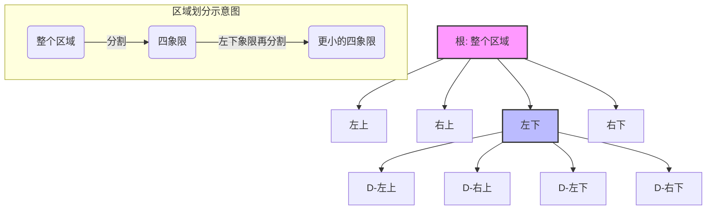

## AI论文解读 | Quadtrees and Morton Indexing
        
### 作者        
digoal        
        
### 日期        
2025-09-06        
        
### 标签        
PostgreSQL , PolarDB , DuckDB , AI , 论文解读        
        
----        
        
## 背景  
      
https://tildesites.bowdoin.edu/~ltoma/papers/chapter-2016-quadtree.pdf        
  
提示:          
```          
读懂《Quadtrees and Morton Indexing》这篇论文需要提前掌握哪些基础知识, 请使用中文通熟易懂的讲解这些基础知识, 可以引用论文中的图、表或使用Markdown支持的图形(text,mermaid等)增加解释性. 
  
使用中文通熟易懂的解读《Quadtrees and Morton Indexing》这篇论文, 其中的关键内容请着重讲解, 可以引用论文中的图、表或使用Markdown支持的图形(text,mermaid等)增加解释性. 
  
提取《Quadtrees and Morton Indexing》这篇论文中的重要术语, 使用中文对这些术语进行通熟易懂的讲解, 可以引用论文中的图、表或使用Markdown支持的图形(text,mermaid等)增加解释性. 
```     
  
## 1 前置知识 
  
好的，这是一篇关于四叉树（Quadtrees）和莫顿索引（Morton Indexing）的论文。要读懂这篇论文，你需要了解一些计算机科学和数据结构的基础概念。下面我将用通俗易懂的中文为你讲解这些基础知识，并结合论文中的内容进行说明。

### 1\. 四叉树（Quadtrees）

四叉树是一种用于组织和存储二维空间数据的树状数据结构 。你可以把它想象成一个俄罗斯套娃，只不过它是一个方块。

  * **核心思想**: 它通过递归地将一个二维空间（比如一个大正方形）分解成四个相等的子区域（四个小正方形）来组织数据 。这个过程会一直重复，直到每个小区域都满足某个特定的“停止规则”为止 。

  * **停止规则**: 决定何时停止细分区域的条件。对于不同类型的四叉树，停止规则是不同的。论文中提到了几种：

      * **点四叉树（Point Quadtree）**: 当一个区域内最多只包含一个点时，就停止细分 。
      * **边缘四叉树（Edge Quadtree）**: 存储线段（比如地图上的道路）。停止规则可能更复杂，例如当一个区域内的线段数量达到某个阈值时才停止 。
      * **压缩四叉树（Compressed Quadtree）**: 是一种特殊的四叉树，它会合并那些有三个空子节点的路径，以减少存储空间 。论文中提到，压缩四叉树的区域被称为“甜甜圈”（donut）。

  * **存储方式**: 四叉树有两种主要的存储方式：

      * **指针式（Pointer-based）**: 这就像我们常见的树形结构，每个节点都有指向其子节点的指针 。
      * **线性四叉树（Linear Quadtree）**: 这种方式不存储树的结构，只存储树的叶子节点，并按照某种特定的顺序排列 。这种方式特别适用于处理大规模数据，因为它占用更少的内存 。论文主要关注的就是这种线性四叉树的构建算法 。

-----

### 2\. 莫顿索引（Morton Indexing）与 Z 阶曲线（Z-order Curve）

莫顿索引，又称 Z 阶曲线，是一种将二维数据映射到一维的方式 。想象一下，你有一张二维的地图，你想给地图上的每个位置都编一个唯一的序号，并且希望在序号上相邻的位置，在地图上也尽可能地相邻。Z 阶曲线就是一种解决这个问题的方法。

  * **工作原理**: 它通过交错（interleaving）点坐标的二进制位来生成一个单一的索引值 。比如，一个点的坐标是 $(p\_x, p\_y)$，你可以将 $p\_x$ 的二进制位和 $p\_y$ 的二进制位交错排列，从而得到一个 Z 索引。

  * **举例**: 假设我们有一个点 $(p\_x, p\_y)$，其坐标的二进制表示为 $p\_x = 0.101...$ 和 $p\_y = 0.011...$。我们通过交错它们的位来获得 Z 索引 $Z(p)$ 。

    ```
    p_x (binary): 1 0 1 ...
    p_y (binary): 0 1 1 ...
    --------------------
    Z(p) (interleaved, starting with p_y): 0 1 1 0 1 1 ...
    ```

    论文中提到，这个 Z 阶曲线访问四叉树的四个象限的顺序是：左上、右上、左下、右下 。这给出了四叉树中任意两个区域之间一个明确的顺序 。

  * **关键特性**: Z 阶曲线的一个关键特性是，在一个四叉树的任何一个区域（canonical square）内的所有点的 Z 索引，都构成一个连续的区间 $[z\_1, z\_2)$ 。这使得线性四叉树（只存储叶子节点）可以简单地表示为一系列不重叠的、按 Z 索引排序的区间 。

-----

### 3\. I/O 模型（I/O-model）

这部分是理解论文中算法效率分析的关键。传统的算法复杂度分析通常只考虑 CPU 的计算步数，但 I/O 模型考虑的是数据从磁盘到内存的传输成本。

  * **什么是 I/O 效率**: 对于处理大规模数据集（比如几十亿个点或线段），数据通常不能全部放入内存。因此，从硬盘读取数据（I/O 操作）成为主要的性能瓶颈。一个 I/O-efficient 的算法就是尽量减少这些 I/O 操作 。

  * **论文中的术语**:

      * $O(\\text{sort}(N)) I/O$'s: 这表示算法的 I/O 成本与外部排序（external sorting）的成本相同 。外部排序是一种专门用于处理大数据的排序算法，它的效率很高，所以这个成本被认为是衡量 I/O 效率的基准。
      * $O(\\text{scan}(N)) I/O$'s: 这表示算法的 I/O 成本与扫描整个数据集一次的成本相同 。这是最基本的 I/O 操作，也是一个非常高效的指标。

  * **为什么重要**: 论文中反复提到各种四叉树算法的 I/O 效率，例如构建一个压缩点四叉树的成本是 $O(\\text{sort}(n)) I/O$'s 。这表明这些算法在处理海量数据时是高效的。

### 4\. 各种四叉树类型和它们的用途

论文的“Key Results”部分详细介绍了不同的四叉树及其应用，你可以把它们看作是四叉树的“变体”。

  * **点四叉树**: 用于存储点数据，如 LIDAR 数据集中的点 。
  * **PM 四叉树家族**: 用于存储线段，特别是用于地理信息系统（GIS），比如地图上的道路、河流等 。它们通过不同的分裂规则来优化对线段的处理 。
  * **星形四叉树（Star-quadtree）**: 专为“胖三角形”（fat triangulations）设计的一种四叉树 。
  * **卫兵四叉树（Guard-quadtree）**: 用于“低密度”非相交线段集合 。
  * **K-四叉树（K-quadtree）**: 是一种可以根据参数 $k$ 在单元格数量和每个单元格内的点数量之间进行权衡的四叉树 。

掌握了这些基础知识，特别是四叉树的递归分解思想、线性四叉树和 Z 阶曲线的结合、以及 I/O 模型对大规模数据处理的意义，你就能更好地理解这篇论文中所讨论的各种算法、它们的性能优势以及各自的应用场景了。

希望这个解释能帮助你更好地理解这篇论文！还有什么想了解的吗？
  
## 2 解读论文 
  
好的，我们来通俗易懂地解读一下 Herman Haverkort 与 Laura Toma 撰写的《Quadtrees and Morton Indexing》这篇论文。

这篇论文的核心是探讨一种名为**四叉树 (Quadtree)** 的数据结构，特别是如何在处理海量几何数据（例如地图上的点和线）时，能够高效地构建和使用它。

### 核心概念解读

想象一下，你要制作一张非常精细的电子地图。这张地图包含了数百万甚至数十亿个点（如商店位置）和线段（如街道、铁路）。如果直接把这些数据都加载到内存里，电脑肯定会不堪重负。我们需要一种聪明的方法来组织这些数据，让我们能快速地找到某个区域内的信息，而不需要一次性处理所有数据。四叉树就是解决这类问题的经典方法之一。

#### 1. 什么是四叉树 (Quadtree)？ 

四叉树是一种“分而治之”的空间划分技术。  它的基本思想很简单：

  * 从一个包含所有数据的大正方形（或三维的立方体）开始。 
  * **反复地**将这个正方形“一分为四”，切成四个大小相等的小正方形（称为象限或单元）。 
  * 这个过程会一直持续下去，直到每个小正方形满足某个 **“停止规则”** 。 

这个“停止规则”是四叉树的关键，它可以是：

  * “这个小方块里最多只能有1个点。”（适用于点数据） 
  * “这个小方块里最多只能有k条线段穿过。”（适用于线段数据） 
  * “这个小方块已经小到一定程度了。”

这个递归划分的过程，天然地形成了一棵“树”形结构。根节点代表整个区域，每个被划分的节点有四个子节点，代表其四个象限。没有被进一步划分的区域就是树的叶子节点。 



#### 2\. 线性四叉树 (Linear Quadtree) 与 莫顿索引 (Morton Indexing)

当数据量巨大时，存储上面那样的树结构（尤其是节点间的指针）本身就会占用大量空间。  于是，一种更节省空间的变种——**线性四叉树**被提了出来。 

线性四叉树的精髓在于，它**只存储叶子节点**，而抛弃了内部的树状结构。  但问题来了，没有了树结构，我们如何知道这些叶子节点（小方块）在空间上的位置关系呢？

答案就是**莫顿索引 (Morton Indexing)**，也叫**Z序曲线 (Z-order curve)**。 

Z序曲线是一种**空间填充曲线**，它能将二维（或多维）空间中的点映射到一维。  它的神奇之处在于，能以一种“之”字形的顺序遍历所有划分出的小方块，并且**空间上邻近的方块，在Z序上大概率也是邻近的**。

**工作原理简述：**
一个点 $p$ 的坐标为 $(p\_x, p\_y)$。我们将 $p\_x$ 和 $p\_y$ 的二进制表示逐位交错，形成一个新的二进制数，这个数就是该点的Z值 (z-index)。 

例如，假设一个点的坐标二进制是 `(0.10, 0.01)`。

  * $p\_x$ 的小数部分是 `10`
  * $p\_y$ 的小数部分是 `01`
  * 从 $p\_y$ 的第一位开始交错，得到 `0110`
  * 所以Z值就是 `0.0110`

通过这种方式，每个叶子节点（小方块）都可以用其左上角顶点的Z值来唯一标识。  整个四叉树的划分就可以看作是一系列连续、不重叠的一维Z值区间。  这样一来，我们只需要一个有序列表来存储所有叶子节点的信息，极大地节省了存储空间，特别适合处理超大规模数据。 

### 论文解决的核心问题

论文聚焦于为**非常大的数据集**（大到内存放不下，需要频繁读写硬盘）设计**I/O高效**的四叉树构建算法。  I/O操作（读写硬盘）远比内存操作慢得多，因此算法的设计目标是最小化I/O次数。论文中提到的 $O(sort(n))$ 复杂度，意味着构建算法的I/O开销和对n个元素进行外部排序的开销是同级别的，这在I/O高效算法领域被认为是很好的性能。 

### 关键成果：几种不同的四叉树及其构建方法

论文回顾并介绍了几种针对不同数据和应用场景的四叉树。

#### 1\. 点四叉树 (Point Quadtrees)

  * **目标**：处理点数据。 
  * **停止规则**：每个单元格最多包含一个（或k个）点。 
  * **挑战**：如果两个点离得非常近，会导致树的深度非常大，产生大量空节点。 
  * **解决方案**：
      * **压缩四叉树 (Compressed Quadtree)**：将那些只有一个非空子节点的路径压缩成一个节点，有效减少了树的规模。 
      * **高效算法**：论文提到了 De Berg 等人 [2] 和 Haverkort 等人 [4] 的工作，他们提出了能在 $O(sort(n))$ 的I/O复杂度内构建压缩点四叉树的算法，并且可以控制最终划分出的单元格数量。 

#### 2\. 边四叉树 (Edge Quadtrees)

处理线段数据（如街道、边界）比处理点更复杂，因为一条线段可能横跨多个单元格。  论文介绍了多种边四叉树，它们有不同的停止规则和适用场景。

| 四叉树类型 | 核心思想/停止规则 | 优点 | 缺点/限制 | I/O 复杂度 |
| :--- | :--- | :--- | :--- | :--- |
| **PMR 四叉树** | 如果一个单元格内的线段超过一个预设的阈值，就进行分裂。  | 概念简单，能处理动态数据插入。  | 结果依赖于线段的插入顺序 ；最坏情况性能无保证。  | 实践中接近 $O(sort(n))$  |
| **Star-quadtree** | 持续分裂，直到一个单元格内的所有线段都交于同一个端点。  | 对于“胖三角剖分”（角度不尖锐的三角形），能保证单元格数量和每个单元格内的边数都是线性的。  | 仅对特定类型的输入（如胖三角剖分）有理论保证。  | $O(sort(n))$ (对于胖三角剖分)  |
| **Guard-quadtree** | 基于线段最小包围矩形的顶点（称为“守卫”）进行划分，直到每个单元格最多包含一个守卫。  | 对于“低密度”的线段集，能保证单元格数量为 $O(n)$，且每个单元格只与 $O(1)$ 条边相交。  | 仅对低密度线段集有效。  | $O(sort(n))$ (对于低密度数据)  |
| **K-quadtree** | 基于线段端点进行划分，最终生成 $O(n/k)$ 个单元格，每个单元格包含 $O(k)$ 个端点。  | **通用性强**，对任何输入都有效，无需数据假设 ；可以通过参数 $k$ 在单元格数量和单元格内顶点数之间做权衡。  | 最坏情况下，一个单元格可能与 $O(n)$ 条边相交。  | $O(sort(n+I))$ (其中 $I$ 是总交点数)  |

#### K-quadtree的巧妙之处

K-quadtree的构建算法尤其值得关注。它分两步：

1.  **构建单元格**：使用类似于Guard-quadtree的方法，在 $O(sort(n))$ I/O复杂度内，高效地在所有线段的端点上建立一个压缩四叉树，得到 $O(n/k)$ 个单元格。 
2.  **计算线段与单元格的交点**：这是最巧妙的部分。它将所有线段按斜率分为正、负两类。  对于正斜率的线段，它们穿过四叉树单元格的顺序恰好与Z序一致。  算法可以像扫描线一样，按Z序遍历所有单元格，同时维护一个数据结构来追踪当前与“扫描线”相交的所有线段，从而高效地报告所有线段-单元格的交点。  这个过程的I/O效率极高。 

### 总结与意义

这篇论文系统地梳理了四叉树，特别是线性四叉树与莫顿索引结合的技术，在处理大规模几何数据时的重要性。它强调了**I/O效率**是衡量算法在现实世界（数据远大于内存）中是否可用的关键标准。

论文的关键贡献在于：

  * **系统化总结**：清晰地界定了不同类型的四叉树（点、PMR、Star、Guard、K-quadtree），并分析了它们的优劣和适用场景。
  * **强调通用性**：特别突出了像 K-quadtree 这样的结构，它不依赖于输入数据的特定分布（如“胖”或“低密度”），因此在实际应用中更加稳健和通用。 
  * **算法创新**：详细介绍了一些先进的、I/O高效的构建算法，例如 K-quadtree 中利用Z序和扫描线的思想，这些算法使得在个人电脑上处理亿万级别的数据成为可能。

总而言之，这篇论文为处理海量空间数据的工程师和研究者提供了一份宝贵的指南，阐明了如何利用四叉树和莫顿索引这一经典组合，设计出在存储和计算上都具有高度可扩展性的解决方案。
  
## 3 术语 
  
要理解《Quadtrees and Morton Indexing》这篇论文，掌握其中一些关键术语至关重要。下面是对这些重要术语的中文解释，希望能帮助你更好地理解论文内容。

### 四叉树 (Quadtree)
四叉树是一种用于组织和存储二维几何对象（如点、线段、多边形等）的树形数据结构。其核心思想是递归地将一个二维空间（通常是一个正方形）划分为四个相等的子区域，直到满足某个预设的“停止规则”为止 。

* **工作原理**: 想象一个大正方形区域，它被分成四个小正方形（称为“象限”或“单元格”）。如果其中任何一个小正方形里的数据仍然太多，就继续将它分成四个更小的正方形。这个过程反复进行，直到每个最小的区域（即叶子节点）都符合停止条件 。
* **应用**: 四叉树被广泛应用于处理各种数据类型，包括点、线段、多边形、矩形、曲线和图像等 。尽管在某些简单情况下其最坏情况表现不佳，但在许多实际应用中，四叉树的性能都非常好 。

### 莫顿索引 (Morton Indexing)
莫顿索引，也称为 **Z 阶曲线（Z-order curve）**，是一种将二维数据映射到一维的方式 。它通过交错点的 $x$ 和 $y$ 坐标的二进制位来生成一个单一的索引值 。

* **原理**: 论文中描述的 Z 阶曲线会递归地按“左上、右上、左下、右下”的顺序访问四个象限 。这种顺序为细分后的任何两个规范正方形（canonical squares）提供了一个明确的排序关系 。
* **关键特性**: 一个重要的特性是，在一个规范正方形内的所有点的莫顿索引构成了一个连续的区间 $[z_1, z_2)$ 。这一特性使得四叉树的叶子节点可以按莫顿索引的顺序进行存储，形成一种高效的紧凑表示。

### 线性四叉树 (Linear Quadtree)
这是一种特殊的四叉树存储方式，其主要优点是内存占用小，特别适合处理海量数据 。

* **存储方式**: 线性四叉树不存储完整的树状结构，而只存储四叉树的叶子节点。这些叶子节点按照莫顿索引的顺序进行排列 。
* **与指针式四叉树的区别**: 传统的指针式四叉树通过节点和指针来表示层次结构，而线性四叉树则通过一维的莫顿索引来隐式地表示这种层次关系，从而减少了内存需求 。

### 压缩四叉树 (Compressed Quadtree)
压缩四叉树是为了解决传统四叉树在某些情况下可能产生大量空节点的问题而设计的 。

* **工作原理**: 如果一个四叉树节点及其路径上的多个子节点有三个是空的，这些节点就会被合并成一个单一的节点 。这个合并后的区域被称为“甜甜圈”（donut），代表两个规范正方形之间的差集 。
* **优势**: 对于包含 $n$ 个点的集合，一个压缩四叉树的大小在最坏情况下为 $\Theta(n)$，并且其高度也是 $\Theta(n)$，这解决了非压缩四叉树在最坏情况下大小可能无界的问题 。

### I/O-高效算法 (I/O-efficient algorithms)
I/O 模型是一种用于分析处理大规模数据算法效率的框架，它主要关注数据在内存和外部存储（如硬盘）之间的传输成本 。

* **IO-成本**: 在处理海量数据时，数据通常无法一次性全部加载到内存中，需要频繁地从磁盘读取数据。I/O 成本衡量的是这种数据传输的开销。
* **术语**: 论文中常用 $O(\text{sort}(n))$ 来表示 I/O 成本，这指的是算法的 I/O 效率与对 $n$ 个数据进行外部排序的效率相当 。这是一个衡量处理海量数据时算法性能的重要指标，表明其在 I/O 方面是高效的。

### K-四叉树 (K-quadtree)
K-四叉树是一种特殊的边缘四叉树，它允许用户通过一个参数 $k$ 来在单元格数量和每个单元格内的顶点数量之间进行权衡 。

* **特点**: K-四叉树是一个线性、压缩的四叉树，它构建在边的端点上，总共有 $O(n/k)$ 个单元格，并且每个单元格包含 $O(k)$ 个顶点 。当 $k=1$ 时，它等同于一个压缩的、每个单元格最多包含一个顶点的线性四叉树 。
* **优势**: 论文指出，与那些旨在限制每个单元格内边数的四叉树相比，K-四叉树的优点在于：其细分后的总单元格数量更小，总的交点数量也更小，并且可以在不依赖任何输入假设的情况下高效构建 。

通过理解这些核心术语，你将能更好地把握论文中不同四叉树变体之间的区别、它们的优缺点，以及它们如何利用莫顿索引和 I/O 模型来高效处理大规模数据集。
  
## 参考        
         
https://tildesites.bowdoin.edu/~ltoma/papers/chapter-2016-quadtree.pdf    
        
<b> 以上内容基于DeepSeek、Qwen、Gemini及诸多AI生成, 轻微人工调整, 感谢杭州深度求索人工智能、阿里云、Google等公司. </b>        
        
<b> AI 生成的内容请自行辨别正确性, 当然也多了些许踩坑的乐趣, 毕竟冒险是每个男人的天性.  </b>        
  
