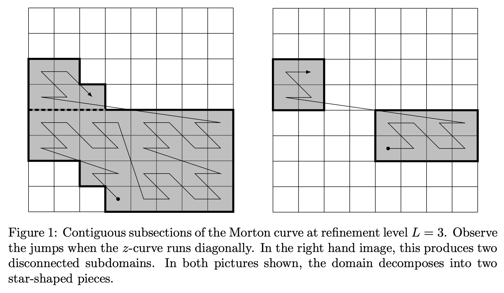
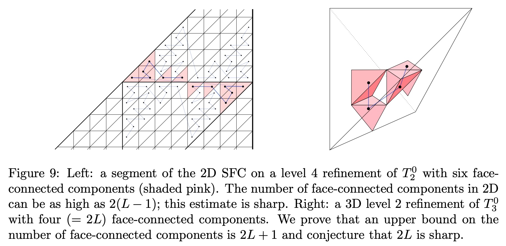
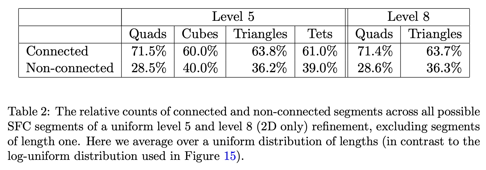

## AI论文解读 | Bounds on the number of discontinuities of Morton-type space-filling curves
        
### 作者        
digoal        
        
### 日期        
2025-09-06        
        
### 标签        
PostgreSQL , PolarDB , DuckDB , AI , 论文解读        
        
----        
        
## 背景  
      
https://arxiv.org/pdf/1505.05055        
  
提示:          
```          
读懂《Bounds on the number of discontinuities of Morton-type space-filling curves》这篇论文需要提前掌握哪些基础知识, 请使用中文通熟易懂的讲解这些基础知识, 可以引用论文中的图、表或使用Markdown支持的图形(text,mermaid等)增加解释性. 
  
使用中文通熟易懂的解读《Bounds on the number of discontinuities of Morton-type space-filling curves》这篇论文, 其中的关键内容请着重讲解, 可以引用论文中的图、表或使用Markdown支持的图形(text,mermaid等)增加解释性. 
  
提取《Bounds on the number of discontinuities of Morton-type space-filling curves》这篇论文中的重要术语, 使用中文对这些术语进行通熟易懂的讲解, 可以引用论文中的图、表或使用Markdown支持的图形(text,mermaid等)增加解释性. 
```     
  
## 1 前置知识 
  
您好，根据您提供的论文内容，我已经为您梳理了阅读这篇论文需要提前掌握的基础知识，并结合论文中的图表进行了通俗易懂的解释。

-----

### **1. 空间填充曲线（Space-Filling Curves, SFCs）**

空间填充曲线是一种能够将一维线段映射到高维空间（例如二维正方形或三维立方体）的曲线 。论文中提到了两种类型的空间填充曲线：

  * **连续曲线（Continuous SFCs）**：例如佩亚诺曲线（Peano curve）和希尔伯特曲线（Hilbert curve）。这些曲线是连续的，意味着在曲线上任意相邻的两点，在空间中也是相邻的。
  * **不连续曲线（Discontinuous SFCs）**：例如论文重点讨论的莫顿曲线（Morton- or z-curve）。莫顿曲线虽然也能将一维数据映射到高维空间，但它不是连续的，会在曲线上产生“跳跃”（jumps）。

-----

### **2. 莫顿曲线（Morton- or z-curve）**

莫顿曲线，也称为Z型曲线，是一种通过交错坐标位（interleaving coordinate bits）来为多维空间中的点进行编码的方法 。

  * **基本原理**：对于一个d维空间，一个点的坐标可以表示为 (x₁, x₂, ..., xd)。莫顿曲线将这些坐标的二进制位交错排列，形成一个一维索引。例如，在二维空间（x，y）中，莫顿曲线的索引Q是将x和y的二进制位交错排列而成的 。

      * **一个简单的二维例子：**
        假设我们要为二维空间中的一个子正方形进行编码，其坐标为(x, y)。如果x的二进制表示为`x₁x₂`，y的二进制表示为`y₁y₂`，那么莫顿曲线的索引就是`y₁x₁y₂x₂`。

        这个过程可以理解为将一个正方形递归地划分为四个子正方形（quadrants），并按照 Z 字形顺序遍历这些子正方形。

  * **不连续性**：莫顿曲线之所以不连续，是因为其跳跃（jumps）现象 。当曲线从一个区域移动到另一个区域时，即使在曲线上是相邻的，但在空间中可能并不相邻。论文中的图1很好地展示了这一点：当Z型曲线沿着对角线移动时，会产生跳跃，这可能导致一个连续的曲线段在空间中被分成两个不相连的子区域 。

下图展示了莫顿曲线的跳跃现象：

  

> **图1**：莫顿曲线在L=3细化级别下的连续子段 。右图展示了当Z型曲线沿对角线运行时产生的跳跃，导致一个子段被分解为两个不相连的子区域 。

-----

### **3. 四叉树（Quadtree）与八叉树（Octree）**

莫顿曲线在计算应用中与四叉树和八叉树数据结构密切相关 。

  * **四叉树（Quadtree）**：在二维空间中，四叉树是一种将一个正方形递归地划分为四个子正方形的数据结构。
  * **八叉树（Octree）**：在三维空间中，八叉树是将一个立方体递归地划分为八个子立方体的数据结构。
  * **联系**：莫顿曲线的索引与四叉树和八叉树的结构有着自然的对应关系 。论文将这些最小的单位称为“元素”（elements）或“子象限”（subquadrants），无论它们是什么形状或维度 。

-----

### **4. 面连接的子区域（Face-connected subdomains）**

这是论文的核心概念之一。

  * **定义**：如果一组元素可以通过它们之间的面连接（face connections）形成一个连续的整体，那么它们属于同一个“面连接子区域”。
  * **论文主要论点**：
      * **经典莫顿曲线**：论文证明，对于经典立方体莫顿曲线，一个连续的曲线段最多产生两个“面连接子区域”，并且这个结果与空间维度无关 。
      * **四面体莫顿曲线**：对于基于三角形和四面体域的莫顿曲线（tetrahedral Morton curve），不连续子区域的数量与细化级别L成正比 。在二维空间中，这个上限是 $2(L-1)$ 。在三维空间中，上限是 $2L+1$ 。

-----

### **5. 递归与归纳证明**

这篇论文的许多证明方法都依赖于递归（recursion）和归纳（induction）思想。

  * **莫顿曲线的定义**：莫顿曲线本身就是通过递归细分（subdivision）来定义的 。
  * **定理的证明**：为了证明莫顿曲线段产生的面连接子区域数量有界，论文使用了归纳法 。例如，在证明命题7时，作者通过对细化级别L进行归纳，首先证明L=0的情况，然后假设L\>0的情况成立，以此类推 。

-----

总而言之，要读懂这篇论文，您需要对以下概念有基本理解：

  * **空间填充曲线**的基本思想和分类。
  * **莫顿曲线**的编码原理和其固有的不连续性。
  * **四叉树/八叉树**等数据结构与莫顿曲线的对应关系。
  * **面连接子区域**的定义。
  * **递归与归纳**的数学证明方法。

掌握了这些基础知识，您将能更好地理解论文中关于莫顿曲线不连续性、其对计算网格划分的影响以及作者如何通过数学证明来量化这些不连续性的核心论点。

如果您还有其他问题，或者想了解论文中更具体的部分，请随时提出。
  
## 2 解读论文 
  
好的，我们来通俗易懂地解读一下这篇名为《Bounds on the number of discontinuities of Morton-type space-filling curves》（莫顿型空间填充曲线不连续数量的界限）的论文。

### 核心思想：一句话概括

想象一下，你用一根线穿过一个由许多小方块组成的大立方体，这根线的顺序就是“空间填充曲线”。如果这根线是**连续的**（像希尔伯特曲线），它总是从一个方块走到相邻的方块。但莫顿曲线是**不连续的**，它会“瞬移”，从一个方块跳到很远的另一个方块 。

这篇论文的核心工作就是回答一个问题：**如果我从莫顿这根“瞬移线”上随便剪一段下来，它所穿过的那些小方块，最多会形成多少个互不相连的“抱团”区域？**

**论文给出的答案是：**

  * 对于**正方形/立方体**，无论你怎么剪，最多只会形成**2**个分离的区域 。
  * 对于**三角形/四面体**，这个数量会随着精细程度（递归深度L）的增加而增加，大约是**2L**个 。

-----

### 1\. 什么是空间填充曲线 (SFC)？为什么它很重要？

空间填充曲线（Space-Filling Curve, SFC）是一种能将一维的线“铺满”一个二维、三维甚至更高维空间的方法 。它为空间中的每一个小单元（比如小方块或小三角形）分配一个唯一的序号，从而将高维问题转化为一维问题。

这在计算机科学，尤其是**并行计算**中非常有用 。比如，要把一个巨大的计算任务（如天气模拟）分配给成千上万个处理器，我们可以：

1.  将整个计算空间划分成亿万个小网格。
2.  用空间填充曲线给每个网格编号。
3.  将连续的编号段（例如1到100万号）分配给第一个处理器，（100万+1到200万号）分配给第二个，以此类推。

这样分配的好处是，编号相近的网格在物理空间上也可能相近，从而减少了处理器之间的通信开销。

### 2\. 莫顿曲线的“Z”字抖动与“瞬移”问题

莫顿曲线，也叫Z阶曲线（z-curve），是SFC的一种，它的生成方式非常直观，就像一个不断递归的“Z”字 。

下面是莫顿曲线在一个8x8的网格中生成的样子，左图是一整段，右图是其中的一小段：   

*(注：此图为莫顿曲线的通用示例，非直接来源于论文)*

你可以看到，曲线在大部分时候是连接到相邻格子的，但当它完成一个“Z”字形并要跳到下一个更大区域的起始点时，就会发生一次“跳跃”或“瞬移”。例如，从数字3跳到数字4。

**这就引出了论文要解决的核心担忧**：如果分配给某个处理器的任务恰好跨越了多次这种“瞬移”，会不会导致这个处理器分到的计算区域被分割成很多互不相连的“飞地”？ 如果“飞地”太多，每个区域的“表面积”相对于其“体积”就会很大，导致处理器需要和周围邻居进行大量通信，从而降低并行计算的效率 。

正如论文的 **图1** 所示，右边那段曲线就产生了两个不相连的区域。

```text
       +-------+-------+
       |       |       |
       |   A   |       |
       |  /|\  |       |
       |   |   |       |
       +-------+-------+-------+-------+
       |       |   JUMP  . . . >   B   |
       |       |       |       |  /|\  |
       |       |       |       |   |   |
       +-------+-------+-------+-------+
```

这里的曲线从区域A的末尾直接“瞬移”到了区域B的开头，导致A和B两个区域是分离的。

-----

### 3\. 论文的关键贡献与结论

#### 3.1 立方体情况：永远不超过两个！

这是论文最主要的贡献。作者通过严谨的数学证明得出结论：

> **对于任意维度（二维正方形、三维立方体等）的莫顿曲线，任意一个连续的片段所覆盖的区域，最多只会形成两个面相连的子域 (face-connected subdomains)。** 

这个结论非常强大，因为它不受维度和递归深度的影响 。这意味着，使用莫顿曲线进行任务划分时，一个处理器最多只会得到两块分离的计算区域。这就给并行计算的开发者吃了一颗“定心丸”，因为通信开销的增长是可控的，不会出现灾难性的碎片化 。

作者还证明了，这两个子域都是**星形 (star-shaped)** 的 ，这意味着这两个区域内部的形状很“规整”，没有奇怪的空洞。

#### 3.2 三角形/四面体情况：情况更复杂

近年来，为了处理更复杂的几何外形，研究人员提出了基于三角形和四面体剖分的莫顿曲线 。论文对这种情况也进行了分析，得出了不同的结论：

> **在单纯形（三角形/四面体）的情况下，不连续子域的数量上限与递归深度 L 成正比。** 

具体来说：

  * **二维三角形**：最多 **2(L-1)** 个子域 。
  * **三维四面体**：最多 **2L+1** 个子域 。

这意味着，网格划分得越精细（L越大），理论上可能产生的碎片就越多。论文的 **图9** 非常直观地展示了这一点，在一个4级细化的三角形网格上，一段曲线就产生了6个分离的区域 。

  

*(根据论文图9的示意图)*

左图显示了在L=4的三角剖分中，一段曲线（粉色部分）分成了6个互不相连的区域 ( $2(4-1)=6$ )。这与立方体情况形成了鲜明对比。

-----

### 4\. 不连续性到底有多常见？（理论与实践）

理论上的“最坏情况”分析完了，那么在实际应用中，出现多块“飞地”的概率高吗？论文的后半部分通过计算研究回答了这个问题。

**结论是：** 尽管单纯形（三角形/四面体）的理论上限很高，但在实践中，绝大多数（超过93%）的曲线段仍然只包含1个、2个或3个连通子域 。

下面的Markdown表格总结了论文 **表2** 的数据，展示了随机选取的曲线段是连通的（1个子域）和非连通的（大于1个子域）的概率：   

| 网格类型 (细化等级) | 连通的 (1个子域) | 非连通的 (\>1个子域) |
| :------------------ | :----------------- | :-------------------- |
| **二维正方形 (L=8)** | 71.4%              | 28.6%                 |
| **三维立方体 (L=5)** | 60.0%              | 40.0%                 |
| **二维三角形 (L=8)** | 63.7%              | 36.3%                 |
| **三维四面体 (L=5)** | 61.0%              | 39.0%                 |

*数据来源: *

从表中可以看出：

  * 无论是立方体还是单纯形，超过60%的随机曲线段都是完全连通的 。
  * 单纯形曲线（三角形/四面体）的连通性表现与立方体情况惊人地相似，并没有因为理论上限更高而表现得更差 。

-----

### 总结与实际意义

这篇论文的价值在于：

1.  **为立方体莫顿曲线提供了坚实的理论保障**：证明了其碎片化程度的上限为2，消除了并行计算领域对莫顿曲线可能导致严重性能问题的担忧 。
2.  **揭示了单纯形莫顿曲线的特性**：虽然其理论最坏情况会随细化层级增多而变差，但通过计算实验表明，其平均表现与立方体情况相当，在实践中同样是稳定可靠的 。
3.  **指导实践**：这项研究为需要选择空间填充曲线的开发者提供了重要参考。它表明，计算更简单、更快的莫顿曲线在许多应用中是一个非常好的选择，其“不连续”的缺点是被严格限制的，并不会失控 。
  
## 3 术语 
  
您好！根据您提供的《Bounds on the number of discontinuities of Morton-type space-filling curves》这篇论文，我已经为您提取了其中的重要术语，并用通俗易懂的方式进行了中文讲解。

-----

### **1. 空间填充曲线 (Space-filling curves, SFCs)**

**定义**：空间填充曲线是一种能将一维线段（如 `[0, 1]` 区间）连续地映射到高维空间（如二维正方形或三维立方体）的曲线。

**通俗解释**：想象一下，你有一根无限细的线，空间填充曲线就是一种能让这根线穿过一个二维平面上的每一个点，或者一个三维空间中的每一个点的路径。这听起来很神奇，因为二维平面的点比一维线上的点多得多，但数学上证明这是可行的。论文中提到了两种著名的连续空间填充曲线：**佩亚诺曲线**和**希尔伯特曲线**。

-----

### **2. 莫顿曲线 (Morton- or z-curve)**

**定义**：这是一种特殊的空间填充曲线，它通过对多维坐标的二进制位进行 **交错排列（interleaving）** 来生成一个一维索引。

**通俗解释**：莫顿曲线也被称为“Z曲线”，因为它在递归地划分空间时，其路径看起来像一个接一个的字母“Z”。

**二维示例**：假设一个点在二维空间中的坐标是 `(x, y)`，莫顿曲线的编码过程就是把 `x` 和 `y` 的二进制表示的位交替地组合起来。
比如，`x = (x₂x₁)`，`y = (y₂y₁)`，那么莫顿编码就是 `(x₂y₂x₁y₁)`。

-----

### **3. 不连续性 (Discontinuities / Jumps)**

**定义**：与希尔伯特曲线等连续曲线不同，莫顿曲线是**不连续**的。这意味着在曲线上相邻的两个点，在实际空间中可能相距很远。这些突然的“跳跃”或“断开”就是不连续性。

**通俗解释**：如果把莫顿曲线看作一条沿着格子走的路径，当它从一个大区域走到另一个相邻的大区域时，可能会突然“瞬移”到另一个角落，而不是平滑地过渡。论文研究的核心就是量化这些跳跃的数量。

下面的图引用了论文中的图1，生动地展示了这种不连续性。

  

> **图1**：左图显示了在细化级别 L=3 下，莫顿曲线的路径。右图则展示了当曲线从一个区域移动到另一个区域时产生的跳跃，导致一个连续的曲线段在物理空间中被分解成两个不相连的子区域。

-----

### **4. 面连接的子区域 (Face-connected subdomains)**

**定义**：如果一个区域内的所有元素都可以通过它们之间的“面”（即相邻的边界）互相连接起来，那么这些元素就属于同一个面连接子区域。

**通俗解释**：这是论文用来衡量不连续性的一个关键指标。当一个连续的莫顿曲线段（在曲线上没有断点）在物理空间中被这些跳跃分隔开时，它就会形成多个不相连的“子区域”。论文的目标就是证明这些子区域的数量是有限的。

-----

### **5. 细化级别 (Level of refinement, L)**

**定义**：在莫顿曲线的递归定义中，**细化级别L**指的是空间被细分的次数。L越大，空间被划分得越精细，曲线的路径也就越长。

**通俗解释**：我们可以把L看作是“网格的精细程度”。如果L=1，一个正方形会被分成4个小正方形；如果L=2，每个小正方形又会再被分成4个更小的正方形，以此类推。论文发现，对于某些类型的莫顿曲线（如四面体莫顿曲线），不连续子区域的数量会随着L的增加而增加，因此L是一个非常重要的参数。

-----

### **6. 单纯形情况 (Simplicial case) 与超立方体情况 (Hypercube case)**

**定义**：

  * **超立方体情况 (Hypercube case)**：莫顿曲线在像正方形（2D）和立方体（3D）这样的规则多边形上的应用。
  * **单纯形情况 (Simplicial case)**：莫顿曲线在像三角形（2D）和四面体（3D）这样的非规则多边形上的应用。

**通俗解释**：论文分别讨论了这两种情况。在超立方体情况下，莫顿曲线的跳跃非常少，论文证明了一个连续的曲线段最多只产生两个面连接的子区域。然而，在单纯形情况下，情况变得更加复杂，不连续子区域的数量会随着细化级别L的增加而线性增加。这是论文的一个重要发现。
  
## 参考        
         
https://arxiv.org/pdf/1505.05055    
        
<b> 以上内容基于DeepSeek、Qwen、Gemini及诸多AI生成, 轻微人工调整, 感谢杭州深度求索人工智能、阿里云、Google等公司. </b>        
        
<b> AI 生成的内容请自行辨别正确性, 当然也多了些许踩坑的乐趣, 毕竟冒险是每个男人的天性.  </b>        
  
  
