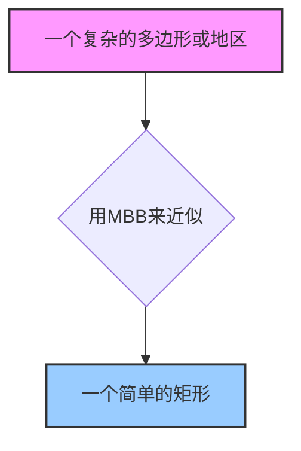
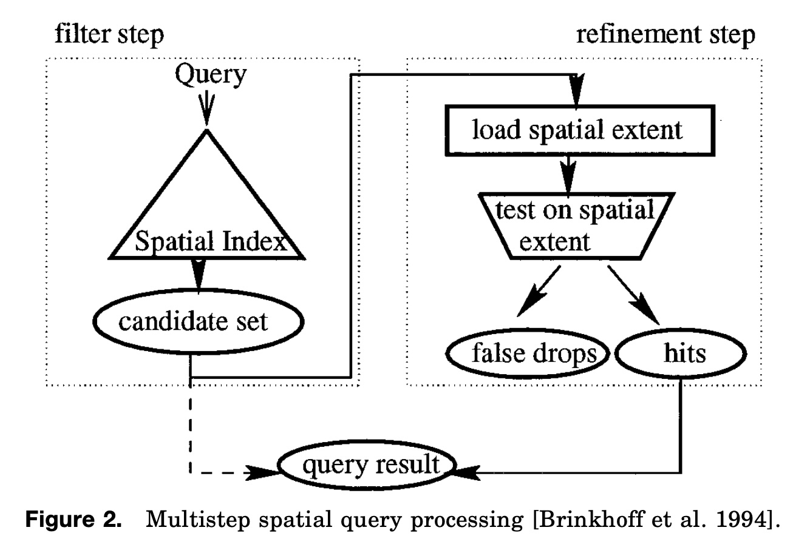
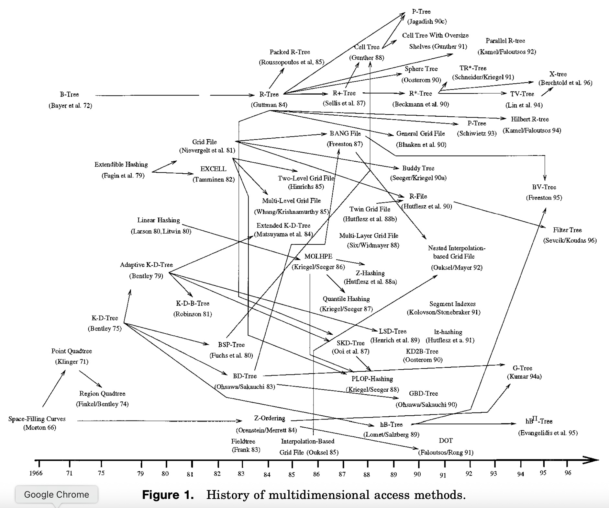
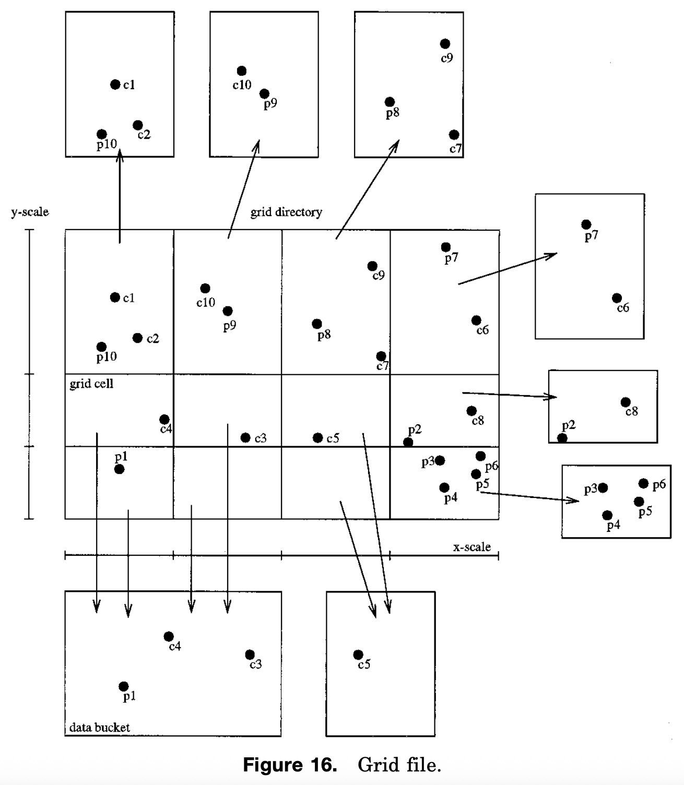
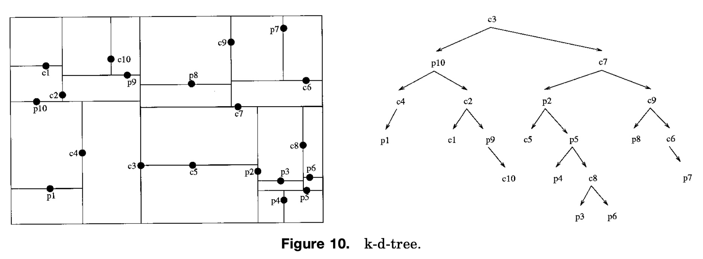
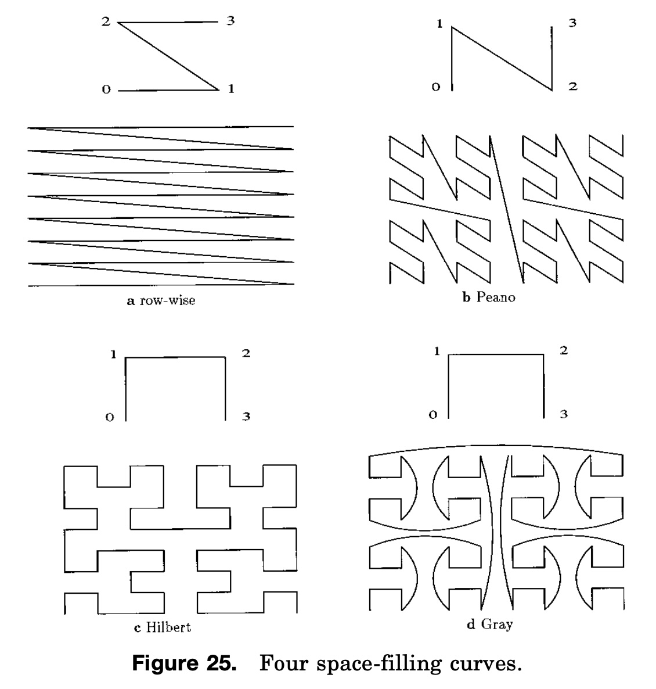
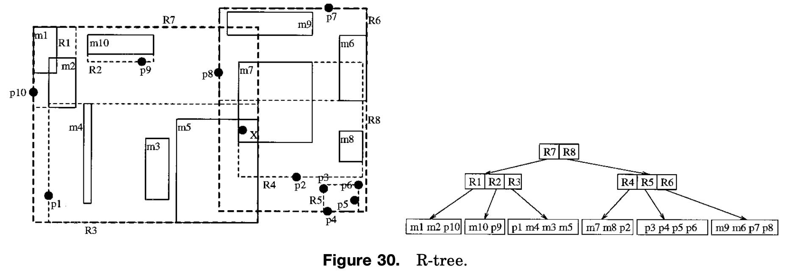
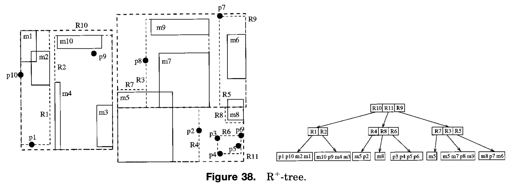

## AI论文解读 | Multidimensional Access Methods
        
### 作者        
digoal        
        
### 日期        
2025-09-06        
        
### 标签        
PostgreSQL , PolarDB , DuckDB , AI , 论文解读        
        
----        
        
## 背景  
      
https://dl.acm.org/doi/pdf/10.1145/280277.280279        
  
提示:          
```          
读懂《Multidimensional Access Methods》这篇论文需要提前掌握哪些基础知识, 请使用中文通熟易懂的讲解这些基础知识, 可以引用论文中的图、表或使用Markdown支持的图形(text,mermaid等)增加解释性. 
  
使用中文通熟易懂的解读《Multidimensional Access Methods》这篇论文, 其中的关键内容请着重讲解, 可以引用论文中的图、表或使用Markdown支持的图形(text,mermaid等)增加解释性. 
  
提取《Multidimensional Access Methods》这篇论文中的重要术语, 使用中文对这些术语进行通熟易懂的讲解, 可以引用论文中的图、表或使用Markdown支持的图形(text,mermaid等)增加解释性. 
```     
  
## 1 前置知识 
  
为了读懂《Multidimensional Access Methods》这篇论文，你需要提前掌握一些关于数据库、数据结构和空间数据处理的基础知识。这篇论文是对当时已有的多维存取方法的综述，因此它建立在这些基础概念之上。

以下是理解这篇论文所需掌握的核心基础知识，我将用通俗易懂的方式为您讲解：

-----

### 1\. 数据库和数据结构基础 (Database and Data Structures)

这篇论文的核心是**索引（index）**，它的作用是帮助我们更快地找到想要的数据。如果你把数据库想象成一个巨大的图书馆，索引就像是书籍的目录。论文中将多维存取方法与传统的**一维存取方法**（处理单个键值的索引）进行了对比，特别提到了以下两种：

  * **B-树 (B-Tree)**：一种在传统数据库中用于高效管理数据的主要索引结构 。它可以保证在处理海量数据时，查找、插入和删除操作的性能都保持在一个可预测的对数时间复杂度内。理解 B-树有助于你理解论文中各种多维树形结构（如 R-树）的设计动机。
  * **可扩展哈希 (Extendible Hashing)**：另一种动态的哈希技术 ，它允许文件随着数据的增长而动态扩展，无需完全重新组织。了解哈希的基本原理，有助于你理解论文中介绍的各种多维哈希方法。

### 2\. 什么是空间数据？ (What is Spatial Data?)

空间数据（Spatial Data）是指与空间位置和几何形状相关的数据。论文指出，与传统数据相比，空间数据有几个特殊之处 ：

  * **复杂性**：一个空间对象可能由成千上万个多边形组成，难以用固定大小的数据元组来存储 。
  * **动态性**：空间数据会频繁地进行插入和删除操作 。
  * **庞大规模**：例如，地理地图数据通常占用数 GB 的存储空间，因此需要有效地管理二级和三级存储器 。
  * **无标准总序**：这是最重要的一点。在二维或更高维空间中，不存在一种单一的排序方式可以完全保留空间上的接近性 。这意味着，两个在空间上非常接近的对象，在转换为一维排序后可能相距很远，这使得高效的索引设计变得非常困难 。

### 3\. 多维查询的两种主要类型 (Two Main Query Types)

论文将多维存取方法分为两大类 ：

  * **点存取方法 (Point Access Methods, PAMs)**：专门用于处理只包含点的数据库，比如城市中所有建筑的经纬度坐标 。
  * **空间存取方法 (Spatial Access Methods, SAMs)**：用于处理具有空间范围的对象，比如线、多边形或立体 。

### 4\. 核心概念：最小边界框 (Minimum Bounding Box, MBB)

为了简化复杂对象的索引，论文提出了一种常见的抽象方法：**最小边界框（MBB）** 。MBB 是一个包围空间对象的最小矩形，它的边与坐标轴平行。通过使用简单的 MBB 来代表复杂的对象，索引结构可以更高效地运行 。

**举个例子：**

一个不规则的区域（如一个省份或湖泊）可以用一个简单的矩形来代表。



这种抽象引出了一个重要的查询处理模型，论文称之为**两步空间查询处理**：

  * **第一步：过滤（Filter Step）**：使用索引快速筛选出所有与查询区域相交的 **MBB**。这一步会产生一个**候选集合** 。
  * **第二步：细化（Refinement Step）**：对于候选集合中的每一个对象，加载其完整的几何形状信息，并进行精确的几何测试，以确认它是否真的满足查询条件 。这一步可能会产生一些“**假阳性（false drops）**”——即 MBB 相交但实际对象不相交的情况 。

论文中的图2（下图）清晰地展示了这个过程 。

  

### 总结

要读懂这篇论文，你需要具备以下知识：

  * **基础数据库和数据结构知识**：特别是 B-树和哈希，它们是一维索引的基础，也是理解多维索引设计思想的起点。
  * **空间数据特性**：理解空间数据为什么不同于传统数据，以及为什么处理它会更具挑战性。
  * **核心概念**：掌握“最小边界框（MBB）”和“过滤-细化”两步查询处理模型，这是许多空间存取方法的基础。
  * **算法性能**：理解衡量索引性能的指标，例如磁盘存取次数和存储利用率。

一旦你掌握了这些基础知识，论文中的各种多维存取方法，如 R-树、四叉树（Quadtree）和Z-排序（Z-ordering），都会变得更容易理解。
  
## 2 解读论文 
  
好的，这是一篇对Volker Gaede和Oliver Günther的经典综述论文《Multidimensional Access Methods》的通俗易懂的中文解读。这篇1998年发表于ACM Computing Surveys的论文是空间数据库领域的里程碑之作，系统性地梳理了多维数据索引技术的发展。

### 论文概述

这篇论文是一篇全面的综述（Survey），旨在系统性地介绍和分类用于高效查询多维数据的各种**访问方法**（Access Methods），也就是我们常说的“索引结构” 。作者指出，随着地理信息系统（GIS）、计算机辅助设计（CAD）等应用的兴起，如何高效管理点、线、面等空间数据变得至关重要 。

论文的核心贡献在于：

1.  **阐明了空间数据的特殊性**：解释了为什么传统的一维索引（如B-Tree）不适用于空间数据。
2.  **建立了清晰的分类体系**：将多维索引方法主要分为两大类：**点访问方法 (Point Access Methods, PAMs)** 和 **空间访问方法 (Spatial Access Methods, SAMs)** 。
3.  **系统梳理了主流技术**：详细介绍了各类方法中的代表性结构，并分析了它们的设计思想和优缺点。

下面，我们将按照论文的结构，深入解读其中的关键内容。

### 1\. 空间数据的特殊性与挑战

为什么我们需要专门为空间数据设计索引？论文开篇就指出了空间数据的几大特性和由此带来的挑战 ：

  * **结构复杂**：空间对象（如一个多边形）的描述比简单的数字或字符串复杂得多 。
  * **数据量巨大**：地理地图等应用的数据量可达GB甚至TB级别，必须依赖外存（磁盘） 。
  * **查询类型多样**：除了精确匹配，更多的是范围查询（Region Query）、点查询（Point Query）、空间连接（Spatial Join）等 。
  * **核心难题：无自然排序**：传统数据库索引（如B-Tree）依赖于数据可以被线性排序。然而，空间数据是多维的，**不存在一种能完美保持空间邻近性的线性排序方法** 。换句话说，二维或三维空间中彼此靠近的对象，无法保证在映射到一维后仍然彼此靠近。这使得直接套用B-Tree等结构效率低下 。

#### 关键策略：过滤-精化 (Filter-Refinement)

为了解决直接处理复杂几何对象带来的巨大计算开销，几乎所有的空间索引都采用了一种两阶段查询策略，论文中的图2完美地诠释了这一点 。

  

*论文原文图2: 多步空间查询处理流程*

1.  **过滤步骤 (Filter Step)**：首先，用一个简单的几何形状（通常是**最小边界矩形 MBR/MBB**）来近似代表复杂的空间对象 。索引结构本身只管理这些简单的MBR。当一个查询（例如，查找与某个矩形相交的所有多边形）到来时，索引会快速地利用MBR进行判断，筛选出一个“**候选集 (candidate set)**” 。这个过程非常快，因为它只处理简单的矩形。
2.  **精化步骤 (Refinement Step)**：接下来，系统从磁盘中读取候选集中每个对象的**精确几何描述** ，并执行精确的几何计算（例如，多边形与多边形的相交判断）。通过这一步，排除掉那些MBR相交但实际对象不相交的“**伪命中 (false drops)**” ，最终得到准确的查询结果 。

这个“过滤-精化”架构是空间数据库查询优化的基石。一个空间索引的性能好坏，很大程度上取决于其**过滤步骤**的效率，即能否快速、准确地筛选出一个小而精的候选集。

### 2\. 核心技术分支：点访问方法 (PAMs) 与空间访问方法 (SAMs)

论文的主体部分详细介绍了多维索引的演进，并用一张经典的历史脉络图（图1）展示了各种方法之间的衍生关系。

  

*论文原文图1: 多维访问方法的历史*

#### 2.1 点访问方法 (Point Access Methods - PAMs)

PAMs主要用于索引**没有空间范围的点数据** ，例如城市经纬度坐标、传感器读数等。论文将其归为三类：

**A. 多维哈希 (Multidimensional Hashing)**

这类方法将哈希思想扩展到多维空间。

  * **Grid File (网格文件)**：它将数据空间划分为一个d维网格 。每个网格单元（Cell）映射到一个数据桶（Bucket/Page）。它的优点是精确匹配查询通常只需两次磁盘访问 ，但缺点也很明显：当数据分布不均时，其目录结构可能呈超线性增长，占用巨大空间 。   

    *论文原文图16: Grid File 示例*

**B. 层次化方法 (Hierarchical Methods)**

这类方法通常是树状结构，通过递归地划分空间来组织数据。

  * **k-d-Tree**：一种经典的主存结构，它轮流使用各个坐标轴对空间进行二分切割 。每个节点代表一个分割超平面。它的结构简单，但对数据的插入顺序敏感，容易导致树不平衡 。   

    *论文原文图10: k-d-Tree 示例，左侧为空间划分，右侧为树结构*

  * **k-d-B-Tree**：为了将k-d-Tree应用于数据库，k-d-B-Tree结合了k-d-Tree的空间划分思想和B-Tree的平衡特性 。它是一棵平衡的多路搜索树，但存在“强制分裂”（Forced Split）问题，即父节点的分裂可能强制其下层节点也进行分裂，从而无法保证最小存储利用率 。

**C. 空间填充曲线 (Space-Filling Curves)**

这是解决“无自然排序”难题的一种巧妙思路。它通过特定的曲线（如Z-order或Hilbert曲线）将d维空间映射到一维空间，从而可以将多维点数据转换成一维值，然后使用成熟的B-Tree等一维索引来管理 。

  * **Z-Ordering (或Peano Curve)**：通过位交错（bit interleaving）的方式生成一维编码 。
  * **Hilbert Curve**：相比Z-order，它具有更好的邻近保持性，即在多维空间中靠近的点，在映射到一维后也更可能靠近 。

  

*论文原文图25: 四种空间填充曲线*

-----

#### 2.2 空间访问方法 (Spatial Access Methods - SAMs)

SAMs是为处理具有**空间范围的对象**（如线、多边形）而设计的 。这是论文的重点，作者将现有的SAMs实现策略归纳为四大类 ，这个分类法影响深远。

**1. 转换 (Transformation)**

将一个d维空间对象**转换为一个更高维空间中的一个点** 。例如，一个二维矩形可以用其左下角和右上角坐标`(x1, y1, x2, y2)`来定义，这可以被看作是四维空间中的一个点。然后就可以使用上面提到的PAMs来索引这些点 。

  * **缺点**：这种方法的缺点很突出。首先，原始空间中的简单查询（如“包含某个点的所有矩形”）在转换后的高维空间中会变成非常复杂的查询区域 。其次，原始空间中邻近的对象，在转换后的空间中可能相距很远，破坏了空间局部性 。

**2. 重叠区域 (Overlapping Regions)**

这是最主流和成功的一类方法。它允许索引节点对应的空间区域（通常是MBR）**可以相互重叠**。一个空间对象被完整地存放在某一个能完全包含它的节点区域中 。

  * **R-Tree (代表作)**：R-Tree是B-Tree在空间数据领域最成功的扩展 。它是一棵由MBR构成的、高度平衡的树。每个节点对应一个MBR，该MBR包围了其所有子节点的MBR 。   

    *论文原文图30: R-Tree 示例*

  * **R\*-Tree (重要改进)**：R-Tree的性能关键在于如何最小化节点MBR的重叠和覆盖范围。R\*-Tree是R-Tree的一个重要变体，它在节点分裂和插入时采用了更优的策略，如**强制重插 (forced reinsert)** ，并综合考虑了面积、边际和重叠度最小化，从而获得了比原始R-Tree更好的查询性能 。

**3. 裁剪 (Clipping)**

与重叠区域策略相反，裁剪策略**严格禁止索引节点区域的任何重叠** 。如果一个空间对象跨越了多个区域的边界，那么这个对象就会被边界“裁剪”成多个部分，每个部分分别存储在对应的区域中 。

  * **R+-Tree (或论文中的 R1-Tree)**：是R-Tree的一个变体，它采用裁剪策略 。

  * **优点**：由于区域不重叠，点查询的效率非常高，只需沿树向下访问一条路径 。

  * **缺点**：一个对象被分割成多份存储，导致了**数据冗余** 。这不仅增加了存储空间，也使得更新和删除操作变得非常复杂。   

    *论文原文图38: R1-Tree 示例。注意对象m5和m8被分割线切成了多份*

**4. 多层 (Multiple Layers)**

这种方法为不同大小或类型的对象使用多个索引层 。一个对象会被存放在**能容纳它的最精确（即网格最细）的那一层**，前提是它不会被该层的分割线切开 。例如，大尺寸的州界多边形可能存放在一个粗粒度的网格层，而小尺寸的建筑轮廓则存放在一个细粒度的网格层。

  * **Multilayer Grid File**：是这种思想的一个典型实现 。
  * **缺点**：结构复杂，查询可能需要遍历多个层，且容易因数据分布导致某些层数据堆积 。

-----

### 3\. 关键方法对比与总结

论文的第6部分对各种方法进行了比较，虽然当时的数据和硬件环境与现在不同，但其揭示的核心权衡（Trade-off）至今仍然有效。

#### 核心权衡：重叠 vs. 裁剪

| 特性 | 重叠区域 (Overlapping Regions) | 裁剪 (Clipping) |
| :--- | :--- | :--- |
| **核心思想** | 保持对象完整性，允许区域重叠 | 保持区域独立性，允许对象分割 |
| **代表方法** | R-Tree, R\*-Tree | R+-Tree, Cell Tree |
| **优点** | 插入/删除简单，无数据冗余 | 点查询性能极高（单路径） |
| **缺点** | 区域重叠导致范围查询可能需遍历多条路径，性能随重叠度增加而下降 | 数据冗余导致存储开销大，更新/删除操作复杂，可能引起连锁反应 |

#### 论文的结论性观点

  * **没有银弹**：不存在一个在所有场景下都最优的空间索引方法 。性能表现严重依赖于**数据分布、对象类型、查询类型和操作（读/写）频率** 。
  * **R-Tree及其变体是赢家**：从大量的实验对比来看，基于**重叠区域**的R-Tree家族（特别是R\*-Tree）在处理通用空间数据时表现出了最为稳健和综合性能最优的特点 。
  * **实现很重要**：论文最后指出，在工业界，方法的**简单性、鲁棒性和易于实现**往往比微小的性能优势更受青睐 。这也是为什么我们今天在许多商业数据库中看到的空间索引实现，仍然是R-Tree、Quadtree等经典结构。

### 4\. 论文的历史价值与影响

这篇论文发表于空间数据库研究的黄金时代，它不仅是对过去工作的总结，也为后续的研究指明了方向。

  * **奠定了分类框架**：它提出的PAMs/SAMs分类法，以及SAMs的四种实现策略（转换、重叠、裁剪、多层），成为了后续讨论和研究空间索引时的标准框架。
  * **突出了核心挑战**：深刻揭示了空间数据“无自然排序”的核心难题，以及R-Tree等方法在“重叠”和“覆盖”上做优化的重要性。
  * **指导了实践应用**：通过横向比较，让开发者和研究者清晰地看到了不同方法间的利弊权衡，为在实际系统中选择和设计空间索引提供了宝贵的理论依据。

总而言之，《Multidimensional Access Methods》是一篇高屋建瓴的综述，它用清晰的结构、丰富的图例和深刻的洞察，为我们绘制了一幅多维索引技术的全景图。尽管技术在不断发展，但这篇论文所阐述的基本原理、核心挑战和设计权衡，至今仍是理解空间数据库和多维索引的基石。
  
## 3 术语 
  
好的，我已经仔细阅读了《Multidimensional Access Methods》这篇论文，并为您提取了其中的重要术语，用通俗易懂的中文进行解释。

-----

### 1\. 多维存取方法 (Multidimensional Access Methods)

  * **通俗解释**：可以把它们想象成一种特殊的“索引”，但不是用来索引传统的单维数据（比如年龄、名字），而是用来索引有多个维度的数据，比如二维地图上的经度和纬度，或者一个三维物体的位置坐标。这些方法的核心目标是让我们能够快速地在多维空间中找到数据。
  * **论文核心**：论文将这些方法分为两大类：**PAMs (Point Access Methods)** 和 **SAMs (Spatial Access Methods)**。

### 2\. 点存取方法 (Point Access Methods, PAMs)

  * **通俗解释**：这类方法专门用来管理和查询“点”数据。比如，在一个城市地图上，每个餐馆都可以被看作一个点（由经度和纬度坐标确定）。PAMs 就是用来快速回答“找到某个特定区域内的所有餐馆”这类问题的。
  * **相关术语**：
      * **K-D 树 (k-d Tree)**：一种树状结构，通过不断地交替分割维度来组织数据。比如，第一次按x轴中点分割，第二次按y轴中点分割，以此类推。
      * **四叉树 (Quadtree)**：特别针对二维空间的一种树，它每次将一个区域平均分成四个子区域，直到每个子区域只包含一个点或为空。
      * **网格文件 (Grid File)**：将多维空间划分为一个网格，每个网格单元都指向一个存储数据的数据块。

### 3\. 空间存取方法 (Spatial Access Methods, SAMs)

  * **通俗解释**：与PAMs不同，SAMs用来处理有“范围”或“形状”的对象，比如地图上的湖泊、建筑物或多边形区域。由于这些对象不是简单的点，它们可能相互重叠，这使得索引变得更复杂。
  * **核心术语**：
      * **R-树 (R-Tree)**：这是论文中介绍的非常重要的一类方法，也是当今最常用的空间索引结构之一。它的核心思想是用一个**最小边界框 (MBB)** 来代表一个复杂的空间对象，然后用树状结构来组织这些边界框。
          * **最小边界框 (Minimum Bounding Box, MBB)**：也叫**最小边界矩形**。这是一个用来包围复杂空间对象（如不规则多边形）的最小矩形。用MBB来代表对象可以大大简化索引结构，但也会引入一个问题：多个MBB可能会重叠，导致查询时需要检查多个分支。

    

  * **图片解释**：上图是论文中的图2，它展示了一个典型的 R-树结构。每个节点（Node）包含其子节点对应的所有对象的MBB。例如，节点`N_1`的MBB包围了两个子节点`N_2`和`N_3`的MBB。查询时，我们只需要检查与查询区域相交的MBB，这大大减少了需要访问的数据量。

### 4\. 关键查询类型 (Key Query Types)

  * **点查询 (Point Query)**：查找所有包含一个给定点的对象。
      * **示例**：在地图上点击一个点，查询这个点属于哪个行政区。
  * **区域查询 (Region Query)**：查找所有与一个给定区域相交或包含在这个区域内的对象。
      * **示例**：划出一个矩形区域，查询这个区域内所有的餐馆和公园。

### 5\. 性能指标 (Performance Measures)

  * **磁盘存取次数 (Disk Accesses)**：这是衡量一个方法性能的最重要指标之一。磁盘存取比CPU计算慢得多，因此一个好的存取方法应该能用最少的磁盘读取次数来完成查询。
  * **存储利用率 (Storage Utilization)**：衡量索引结构存储空间的利用效率。一个高的存储利用率意味着更少的空间浪费。
  * **查询处理的两步模型 (Two-Step Query Processing)**：
      * **过滤 (Filter Step)**：第一步，利用索引快速筛选出所有与查询区域相交的MBB。这会得到一个**候选集合**。
      * **细化 (Refinement Step)**：第二步，对候选集合中的每个对象，加载其完整数据并进行精确的几何测试，以确认它是否真的满足查询条件。论文将这个过程描述为“**假阳性（false drops）**”的消除。
        ```mermaid
        graph TD
            A[查询请求] --> B[过滤步骤];
            B --> C{索引过滤得到候选集};
            C --> D[细化步骤];
            D --> E{精确几何测试};
            E --> F[最终结果];
        ```
          * **解释**：这个流程说明了为什么MBB只是一个近似，但这个近似对于快速缩小搜索范围至关重要。
  
## 参考        
         
https://dl.acm.org/doi/pdf/10.1145/280277.280279    
        
<b> 以上内容基于DeepSeek、Qwen、Gemini及诸多AI生成, 轻微人工调整, 感谢杭州深度求索人工智能、阿里云、Google等公司. </b>        
        
<b> AI 生成的内容请自行辨别正确性, 当然也多了些许踩坑的乐趣, 毕竟冒险是每个男人的天性.  </b>        
  
