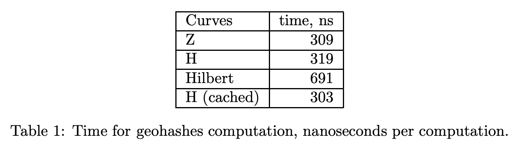

## AI论文解读 | Hashing geographical point data using the space-filling H-curve
        
### 作者        
digoal        
        
### 日期        
2025-09-06        
        
### 标签        
PostgreSQL , PolarDB , DuckDB , AI , 论文解读        
        
----        
        
## 背景  
      
https://arxiv.org/pdf/2403.16216        
  
提示:          
```          
读懂《Hashing geographical point data using the space-filling H-curve》这篇论文需要提前掌握哪些基础知识, 请使用中文通熟易懂的讲解这些基础知识, 可以引用论文中的图、表或使用Markdown支持的图形(text,mermaid等)增加解释性. 
  
使用中文通熟易懂的解读《Hashing geographical point data using the space-filling H-curve》这篇论文, 其中的关键内容请着重讲解, 可以引用论文中的图、表或使用Markdown支持的图形(text,mermaid等)增加解释性. 
  
提取《Hashing geographical point data using the space-filling H-curve》这篇论文中的重要术语, 使用中文对这些术语进行通熟易懂的讲解, 可以引用论文中的图、表或使用Markdown支持的图形(text,mermaid等)增加解释性. 
```     
  
## 1 前置知识 
  
好的，为了理解这篇关于“使用空间填充 H-曲线对地理点数据进行哈希”的论文，你需要了解几个核心概念。我会用通俗易懂的语言，结合论文内容来讲解。

### 1. 什么是空间填充曲线？

首先，想象一下你有一条无限长的线（一维空间），你想要用它来“填满”一个平面（二维空间）或者一个立方体（三维空间）。这听起来很神奇，但这就是**空间填充曲线**的核心思想。

论文中提到，空间填充曲线是一种从一维空间到多维空间的映射（一种转换）。它的神奇之处在于，在足够小的尺度下，它能填满多维空间中的一个区域，比如一个正方形或立方体。

论文特别提到了**分形空间填充曲线**，这种曲线具有**自相似性**，这意味着它们在不同尺度下都呈现出相似的图案。这种特性使得它们易于构造，并且能将多维数据映射到一维空间，同时保持**局部性** 。

### 2. 为什么要用空间填充曲线进行“地理哈希”（Geohashing）？

**地理哈希**是一种将地理坐标（如经度和纬度）转换为一个简短字符串的技术。这在地理信息系统和数据库索引等应用中非常有用。

**核心问题**：地球上的点是二维的（经度、纬度），而计算机处理和存储数据通常是一维的（比如数据库索引）。如果我们简单地将经纬度连接起来，那么在地理上相近的点在数值上可能相差很远，这会导致查询效率低下。

**空间填充曲线的解决方案**：通过使用空间填充曲线，我们可以将地理上相邻的点映射到一维曲线上相邻的位置。这样一来，我们就可以用一个单一的数字或字符串来表示一个地理位置，并且在数据库中对这些数据进行排序和查询时，能够利用“局部性”的优势。

论文中提到的 **“局部性”**（locality preserving）就是指在多维空间中相互靠近的点，在经过空间填充曲线转换后，在一维空间中仍然相互靠近。

### 3. 论文中提到的三种曲线：Z-曲线、Hilbert 曲线和 H-曲线

这篇论文主要比较了三种用于地理哈希的空间填充曲线：

* **Z-曲线**（也叫 Morton 曲线）：这是最简单的一种空间填充曲线。它的构造方式是交错地排列多维坐标的比特位。虽然它简单，但它有个问题：地理上很近的点可能被映射到很远的一维位置上（比如在 Z 形状的“转弯”处）。
* **Hilbert 曲线**：这是最常用的一种曲线。与 Z-曲线相比，它的哈希属性更优越，因为它更好地保持了局部性。但是，它的计算复杂度更高。
* **H-曲线**：这篇论文介绍的新方法，它解决了 Hilbert 曲线计算复杂的问题。论文中指出，H-曲线的计算比 Hilbert 曲线快得多。

**性能对比**：

论文的 **表1** 展示了这三种曲线在计算地理哈希时的性能对比：   

| 曲线 | 时间（纳秒） |
| :--- | :--- |
| Z | 309 |
| H | 319 |
| Hilbert | 691 |
| H (缓存) | 303 |

从表中可以看出，H-曲线的计算时间与 Z-曲线非常接近，但比 Hilbert 曲线快得多。

### 4. 什么是“聚类特性”（Clustering Property）和“编辑距离”（Levenstein Distance）？

除了计算速度，衡量一个地理哈希算法好坏的另一个关键指标是它的**聚类特性**，也就是它保持局部性的能力。

论文通过两种方式来衡量这个特性：

* **聚类数**：在数据库查询中，好的聚类特性意味着一个地理区域内的点会被映射到连续的、不间断的一维索引上。论文中，这个连续的集合被称为一个 **“簇”（cluster）** 。聚类数越少，说明算法的聚类特性越好，因为地理上相邻的点被更好地“打包”在一起了。
* **编辑距离**：也叫 Levenshtein 距离，它是衡量两个字符串之间差异的指标。在地理哈希中，编辑距离越小，意味着地理上相邻的两个点的哈希字符串就越相似。这在URL缩短等应用中很有用。

论文的结论是，H-曲线在保持局部性方面表现出色：

> “在 **74%** 的情况下，H-曲线的编辑距离比 Hilbert 曲线和 Z-曲线都要低”。

换句话说，H-曲线能够更好地确保地理上相邻的点，在哈希之后，它们的字符串也更相似。

### 总结

要理解这篇论文，你需要掌握的核心知识点如下：

* **空间填充曲线**：一种将多维数据转换为一维数据的神奇工具。
* **地理哈希**：利用空间填充曲线将地理坐标转换为一个简短的字符串，以便于在数据库中高效地索引和查询。
* **三种曲线的比较**：理解 Z-曲线、Hilbert 曲线和 H-曲线各自的优缺点，特别是 H-曲线在**计算速度**和**局部性保持**（通过编辑距离衡量）上的优势。

希望这些解释能帮助你更好地理解这篇论文。
  
## 2 解读论文 
  
好的，我们来通俗易懂地解读一下这篇名为《使用空间填充H曲线对地理空间点数据进行哈希处理》的论文。

### 论文核心思想

想象一下，我们想给地球上每一个地点一个独特的、简短的“身份证号”，这个“身份证号”就是**地理哈希（Geohash）**。这个号码有一个神奇的特性：**地理位置上相互靠近的点，它们的“身份证号”也应该很相似**。这样一来，我们就能很方便地进行附近地点的搜索和数据存储。

这篇论文的核心就是提出了一种**新的、性能更好的方法来生成这种“身份证号”**，即使用一种叫做**H曲线**的技术。作者认为，比起目前常用的方法（如希尔伯特曲线），H曲线在保证“近的地点号码也近”这一特性的同时，计算速度更快、效率更高。

### 关键概念讲解

#### 1. 什么是空间填充曲线（Space-Filling Curve, SFC）？

空间填充曲线是一种非常巧妙的数学工具。它的作用是**将一个高维空间（比如我们生活的二维地图）中的所有点，用一条一维的、连续不断的曲线全部串起来**。

* **目的**：通过这条曲线，我们可以把一个二维的坐标（经度、纬度）转换成一个一维的数值（曲线上的位置）。这个一维数值就是我们前面说的“身份证号”或其基础。
* **好处**：计算机处理一维数据远比处理多维数据要快得多。将地理位置转为一维数据后，可以极大地提高数据库的索引和查询效率。

常见的空间填充曲线有以下几种：

* **Z曲线 (Z-curve)**：最简单的一种，它的路径像字母'Z'一样不断重复。计算简单，但效果不是最优的。 
* **希尔伯特曲线 (Hilbert curve)**：这是目前公认的、效果非常好的一种曲线。它能很好地保持空间的局部性，也就是说，在地图上很近的点，在曲线上也基本是挨着的。  但它的缺点是计算起来比较复杂。 
* **H曲线 (H-curve)**：这是本文主角，作者在之前的研究中提出的一种新曲线。  作者声称，它在保持局部性方面和希尔伯特曲线一样出色，甚至更好，而且计算速度要快得多。 

#### 2. 如何衡量“身份证号”的好坏？—— 聚类特性与编辑距离

一个好的地理哈希算法，关键在于它能否很好地 **“保持局部性”**，论文中称之为 **聚类特性 (Clustering Property)** 。简单来说就是：

> 如果两个地点在地图上离得很近，那么它们的哈希值（“身份证号”）也应该很相似。

为了衡量这种“相似性”，论文引入了一个叫做 **“编辑距离” (Levenstein distance)** 的概念 。你可以把它理解为：将一个哈希字符串变成另一个哈希字符串所需要的最少修改次数（增、删、改字符）。编辑距离越小，说明两个哈希值越相似。

这篇论文通过比较不同曲线生成的哈希值的编辑距离，来判断哪种曲线的聚类特性更好。

### H曲线的优势在哪里？

作者通过实验数据证明了H曲线相比于Z曲线和希尔伯特曲线具有两大核心优势：**更好的聚类特性**和**更高的计算性能**。

#### 优势一：聚类特性更优

论文进行了一项实验，随机选取了1000个点，比较由三种不同曲线生成的地理哈希值。结果发现，在表示邻近点时，H曲线生成的哈希值拥有最短编辑距离的概率最高。

具体数据如下 ：
* **H曲线**: 在 **74.04%** 的情况下，其生成的哈希值编辑距离最短。 
* **希尔伯特曲线**: 只有 **13.42%** 的情况最优。 
* **Z曲线**: 只有 **12.47%** 的情况最优。 

这个结果强有力地说明，H曲线在“保持地理位置邻近性”这一点上，做得比另外两种传统曲线要好得多。  这对于需要频繁进行“查找附近的人”或“搜索周边的餐厅”这类应用来说，意义重大。

#### 优势二：计算速度更快

除了效果好，H曲线的计算效率也非常高。作者在一台 `Intel(R) Core(TM) i9-9900K CPU @ 3.60GHz` 的电脑上进行了基准测试 ，对比了生成单个地理哈希所需的时间。

下面的表格引用并简化了论文中的`Table 1` ：   

| 曲线类型 (Curve Type) | 平均计算耗时 (纳秒/次) |
| :--- | :--- |
| Z-curve | 309 ns |
| **H-curve** | **319 ns** |
| Hilbert-curve | 691 ns |
| **H-curve (cached)** | **303 ns** |

**表格解读**:
* **H曲线**的计算速度（319 ns）与最简单的Z曲线（309 ns）几乎一样快。 
* 它比复杂的**希尔伯特曲线**（691 ns）**快了超过一倍**。 
* 如果使用了CPU缓存（H-curve cached），H曲线的速度甚至能超过Z曲线，达到303 ns。 

这个数据说明，H曲线在性能上具有巨大优势，它解决了希尔伯特曲线效果好但计算慢的痛点。 

### 结论

这篇论文通过理论分析和实验数据，向我们展示了一种新的地理哈希生成方法——**H曲线**。

总结下来，H曲线的核心优势在于：

1.  **效果更好**：在保持地理空间局部性方面表现优异，超过74%的情况下优于希尔伯特曲线和Z曲线。 
2.  **速度更快**：计算效率极高，比希尔伯特曲线快一倍以上，几乎和最简单的Z曲线一样快，大大降低了计算开销。 

因此，作者得出结论：H曲线是一种比希尔伯特曲线更适合用于地理哈希的工具，它兼具了优异的聚类特性和出色的计算性能，在地理信息系统、数据库索引等领域具有广阔的应用前景。 
  
## 3 术语 
  
要理解这篇论文，掌握以下几个关键术语是至关重要的：

---

### 1. 空间填充曲线 (Space-filling curve, SFC)

空间填充曲线是一种将一维空间（比如一条线）映射到多维空间（比如一个平面或立方体）的数学工具 。它的神奇之处在于，在足够小的尺度上，曲线的图像可以填满多维空间中的一个非空开放区域 。

在论文中，作者主要关注的是**分形空间填充曲线**，这种曲线具有**自相似性**，即在不同的尺度上都表现出相似的图案 。这种特性使得它们能够将多维数据映射到一维空间，同时保持**局部性** 。

### 2. 地理哈希 (Geohash)

地理哈希是一种将地理坐标（如经纬度）转换为一个简短、可读的字符串的技术. 它在地理信息系统和数据库索引中非常有用 。

传统的地理坐标是二维的，如果直接用它们作为数据库索引，地理上相近的点可能在数值上相隔很远，导致查询效率低下。而地理哈希利用空间填充曲线，将地理上相邻的点映射到一维哈希值上，从而使它们在数据库中也相邻，便于高效地进行范围查询 。

### 3. 聚类特性 (Clustering property)

聚类特性是衡量空间填充曲线性能的一个重要指标，它衡量的是曲线“保留局部性”的能力 。

论文中定义了**簇 (cluster)**，它是在数据库查询中，一个最大化的、由连续编号的点组成的子集 。一个好的聚类特性意味着，地理上相近的点会被映射到一维索引中一个或几个连续的块（簇）中 。聚类数越少，说明算法的聚类特性越好 。

### 4. 编辑距离 (Edit distance)

编辑距离，也称为 **Levenshtein 距离**，是衡量两个字符串之间差异的指标 。在地理哈希的应用中，编辑距离用于衡量哈希值的相似性。

论文认为，编辑距离是衡量聚类特性的一个更合适的指标 。编辑距离越小，意味着地理上相近的两个点的哈希字符串就越相似 。

论文中通过比较三种曲线的编辑距离，得出了以下结论：

* **H-曲线**：在 **74.04%** 的情况下，H-曲线给出的距离最短 。
* **Hilbert 曲线**：在 **13.42%** 的情况下，Hilbert 曲线给出的距离最短 。
* **Z-曲线**：在 **12.47%** 的情况下，Z-曲线给出的距离最短 。

这表明，H-曲线在保持局部性方面远优于 Hilbert 和 Z-曲线 。

### 5. Z-曲线 (Z-curve)、Hilbert 曲线 (Hilbert curve) 和 H-曲线 (H-curve)

这篇论文主要比较了三种空间填充曲线在地理哈希中的性能：

* **Z-曲线**：也被称为“Morton 曲线” 。它是一种简单的曲线，但其哈希属性不如 Hilbert 曲线 。
* **Hilbert 曲线**：被认为是哈希属性最优越的曲线之一，但它的计算复杂度更高 。
* **H-曲线**：论文介绍的新曲线 。作者指出，H-曲线的计算比 Hilbert 曲线更简单，并且具有更好的聚类特性 。

**性能对比**：

论文的 **表1** 比较了三种曲线的哈希计算时间，单位是纳秒 (ns) ：   

| Curves | time, ns |
| :--- | :--- |
| Z | 309 |
| H | 319 |
| Hilbert | 691 |
| H (cached) | 303 |

这个表格直观地展示了 H-曲线在计算速度上的显著优势 。
  
## 参考        
         
https://arxiv.org/pdf/2403.16216    
        
<b> 以上内容基于DeepSeek、Qwen、Gemini及诸多AI生成, 轻微人工调整, 感谢杭州深度求索人工智能、阿里云、Google等公司. </b>        
        
<b> AI 生成的内容请自行辨别正确性, 当然也多了些许踩坑的乐趣, 毕竟冒险是每个男人的天性.  </b>        
  
  
