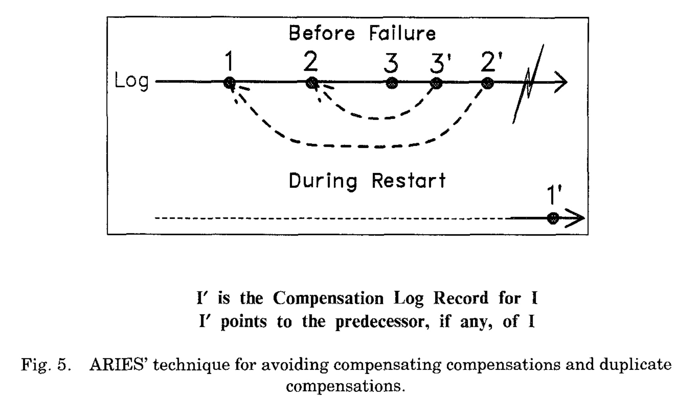
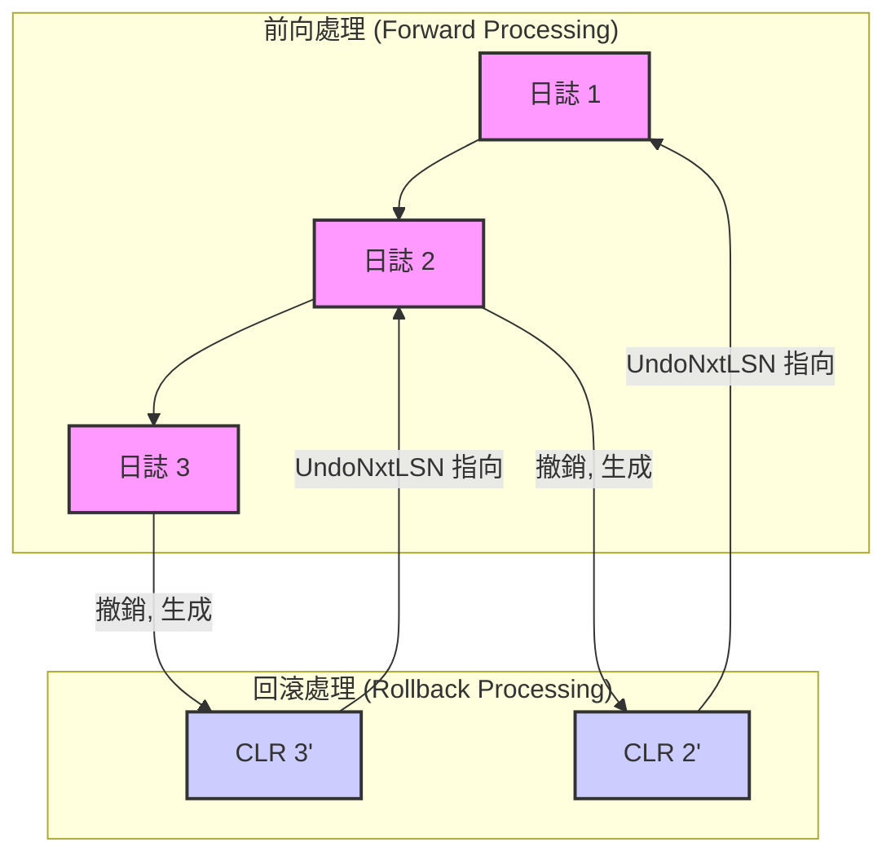
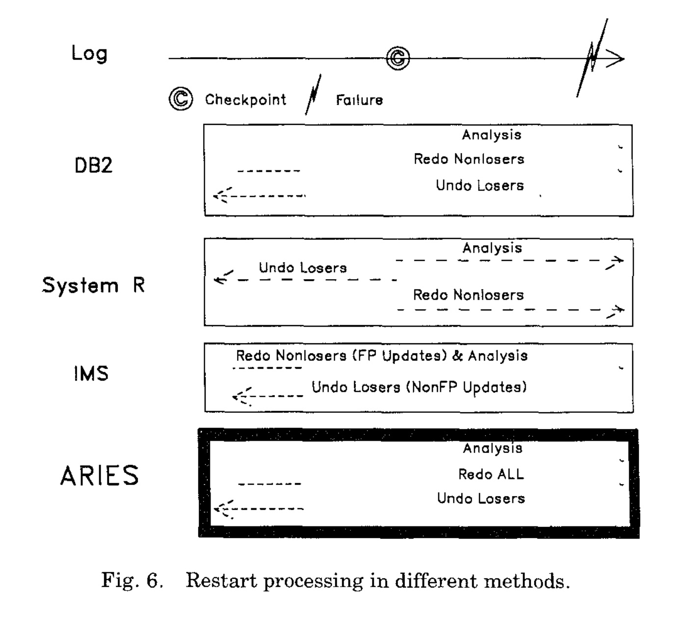
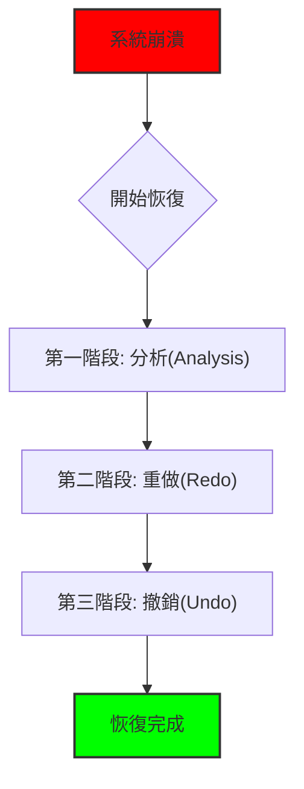
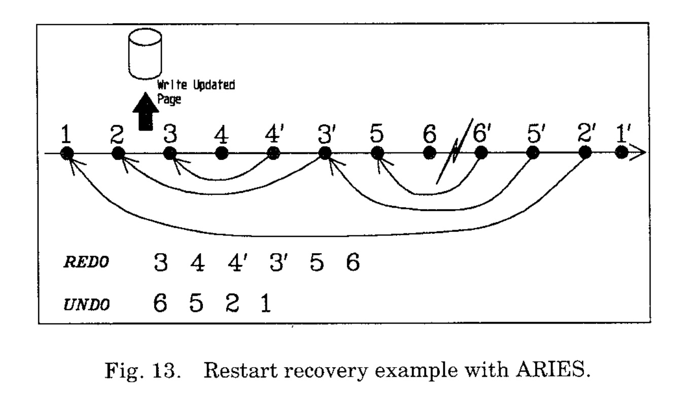
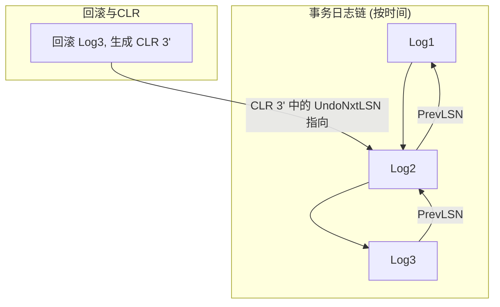

## AI论文解读 | ARIES: A Transaction Recovery Method Supporting Fine-Granularity Locking and Partial Rollbacks Using Write-Ahead Logging
        
### 作者        
digoal        
        
### 日期        
2025-09-06        
        
### 标签        
PostgreSQL , PolarDB , DuckDB , AI , 论文解读        
        
----        
        
## 背景  
      
https://dl.acm.org/doi/pdf/10.1145/128765.128770        
  
提示:          
```          
读懂《ARIES: A Transaction Recovery Method Supporting Fine-Granularity Locking and Partial Rollbacks Using Write-Ahead Logging》这篇论文需要提前掌握哪些基础知识, 请使用中文通熟易懂的讲解这些基础知识, 可以引用论文中的图、表或使用Markdown支持的图形(text,mermaid等)增加解释性. 
  
使用中文通熟易懂的解读《ARIES: A Transaction Recovery Method Supporting Fine-Granularity Locking and Partial Rollbacks Using Write-Ahead Logging》这篇论文, 其中的关键内容请着重讲解, 可以引用论文中的图、表或使用Markdown支持的图形(text,mermaid等)增加解释性. 
  
提取《ARIES: A Transaction Recovery Method Supporting Fine-Granularity Locking and Partial Rollbacks Using Write-Ahead Logging》这篇论文中的重要术语, 使用中文对这些术语进行通熟易懂的讲解, 可以引用论文中的图、表或使用Markdown支持的图形(text,mermaid等)增加解释性. 
```     
  
## 1 前置知识 
  
你好！要读懂《ARIES》这篇论文，你需要先掌握一些数据库事务处理和恢复机制的基础知识。这篇论文的核心在于介绍一种名为 ARIES（Algorithm for Recovery and Isolation Exploiting Semantics）的算法，它通过**预写日志（WAL）**、**细粒度锁**和**部分回滚**来实现高效的事务恢复。论文的第一部分已经很好地概括了这些基础概念 。

以下是阅读这篇论文前需要了解的关键知识点：

---

### 1. 事务和ACID特性
首先，你需要理解 **事务（Transaction）** 的概念，它是一系列操作的逻辑单元 。一个事务必须满足四个基本特性，通常缩写为 **ACID** ：
* **原子性（Atomicity）**：事务中的所有操作要么全部完成，要么全部不完成。
* **一致性（Consistency）**：事务执行前后，数据库从一个一致的状态转换到另一个一致的状态。
* **隔离性（Isolation）**：并发执行的多个事务互不影响，仿佛是串行执行的。
* **持久性（Durability）**：一旦事务提交，其对数据库的修改就是永久性的，即使发生系统故障也不会丢失。

---

### 2. 日志与预写日志（WAL）
**日志（Log）** 是数据库系统用来记录所有数据变更的“流水账” 。每条日志记录都有一个唯一的 **日志序列号（LSN）**，并且这些LSN是按升序分配的 。

**预写日志（Write-Ahead Logging, WAL）** 是一种核心协议，它确保日志记录在数据更新被写入到永久存储之前，就已经安全地写入到 **稳定存储（stable storage）** 中 。这意味着，当数据库中的一个页面被修改后，必须先将描述这个修改的日志记录写入日志文件，然后才能将这个“脏页”写回磁盘 。

论文中提到了 **影子分页（Shadow Page）** 技术作为WAL的对比 。影子分页通过写入一个全新的数据副本来进行更新，而WAL则是在原地进行更新（in-place updating） 。

---

### 3. 恢复过程：重做、撤销和“重复历史”
数据库恢复主要涉及两大操作：
* **重做（Redo）**：重新应用已提交事务的更新，以确保这些修改在系统崩溃后得以恢复。
* **撤销（Undo）**：撤销未提交事务的更新，将数据库状态恢复到事务开始前的状态。

ARIES 最独特的思想是 **“重复历史（Repeating History）”** 。当系统从故障中恢复时，它会首先“重复”所有在故障前已经发生的更新，无论这些更新是来自已提交还是未提交的事务 。之后，它再撤销那些在故障时还未完成的“失败者”事务（loser transactions） 。

此外，论文还引入了 **补偿日志记录（Compensation Log Record, CLR）** 的概念 。当一个事务进行撤销操作时，它会为撤销的每一个修改写入一个CLR。CLR的特点是它们本身是 **不可撤销（redo-only）** 的 ，这保证了即使在回滚过程中发生新的故障，也不会出现无休止地撤销-补偿的循环 。

---

### 4. 锁和闩
在并发环境中，数据库使用两种机制来控制对共享数据的访问：
* **锁（Lock）**：用于保证数据的**逻辑一致性** 。锁的粒度可以很细，比如记录级锁（record-level locking） 。锁通常在事务提交或回滚后才释放 。论文中提到了多种锁模式，如S（共享）、X（排他）以及意向锁（IS, IX, SIX）等 。

* **闩（Latch）**：用于保证内存中数据的**物理一致性** 。闩的持有时间通常比锁短得多，并且不参与死锁检测 。它更像是一种轻量级的信号量，用于保护内存中的数据结构，如缓冲区中的页面。

---

### 5. 缓冲管理策略
缓冲管理器（Buffer Manager, BM）负责管理内存中的数据缓冲区，并处理数据页面的读写I/O 。理解 ARIES，还需要了解两种重要的缓冲管理策略：
* **Steal vs. No-Steal**：
    * **Steal（允许偷）**：允许将一个未提交事务修改过的“脏页”写入到永久存储 。这种策略的缺点是，如果事务最终回滚，可能需要在磁盘上进行撤销操作 。
    * **No-Steal（禁止偷）**：只有事务提交后，其修改的页面才能被写回永久存储 。
* **Force vs. No-Force**：
    * **Force（强制）**：要求事务在提交前，将其所有修改过的页面都强制写入永久存储 。这种策略的好处是，系统恢复时，无需对已提交的事务进行重做操作 。
    * **No-Force（不强制）**：事务提交后，其修改的页面可以保留在内存中，不立即写回永久存储 。

ARIES 算法支持 `steal` 和 `no-force` 策略，这使其在性能和并发性方面具有很大的灵活性和优势 。

掌握了这些基础知识后，再去看论文中关于恢复的三步走（分析-重做-撤销）以及各种数据结构，就会更容易理解了。
  
## 2 解读论文 
  
好的，這篇名為《ARIES:一種支持細粒度鎖定和部分回滾的預寫日誌事務恢復方法》（ARIES: A Transaction Recovery Method Supporting Fine-Granularity Locking and Partial Rollbacks Using Write-Ahead Logging）的論文，是資料庫事務處理領域的里程碑式著作。我將為您深入解讀其核心思想與關鍵技術，並引用論文中的圖表來輔助說明。

### **ARIES論文核心目標與貢獻**

在ARIES出現之前，許多資料庫的恢復算法在支持高併發（如記錄級別的細粒度鎖）和複雜事務功能（如部分回滾）方面存在諸多限制和不足 。ARIES的設計目標就是提供一個簡單、高效且功能強大的恢復算法，解決這些痛點 。

其核心貢獻可以概括為以下幾點：

  * **靈活性**：對緩衝區管理策略限制極少（支持`steal`和`no-force`策略），能有效支持可變長度記錄 。
  * **高併發性**：支持記錄級別的細粒度鎖，並能通過操作日誌（Operation Logging）支持語義鎖（如對計數器的增減操作），極大提升併發性能 。
  * **功能完備**：高效支持事務的部分回滾（Partial Rollbacks），以及嵌套頂層操作（Nested Top Actions）等高級功能 。
  * **高效恢復**：通過優化恢復流程，支持並行恢復，簡化了媒體恢復過程，縮短了系統停機時間 。

### **ARIES的三個核心思想**

ARIES的精髓在於其三大核心思想，它們共同構成了算法的基石。

#### **1. 重複歷史 (Repeating History)**

這是ARIES與早期恢復算法（如System R）最顯著的區別之一 。在系統崩潰重啟後，ARIES的恢復過程會嚴格地**重複崩潰前發生過的所有操作**，即使是那些最終需要被回滾的「失敗者」事務（Loser Transactions）的操作，也會被重新執行一遍 。

**為什麼要這麼做？**
這樣做可以將資料庫的狀態精確地恢復到崩潰前的最後一刻 。這一步看似多餘（因為失敗者的操作終將被撤銷），但它極大地簡化了後續的回滾（Undo）邏輯。無論一個頁面（Page）的狀態如何，恢復程序都能確保在回滾開始前，所有已記錄的日誌操作都已在頁面上生效。這為後續的條件判斷和邏輯撤銷提供了確定性的基礎。

#### **2. 預寫日誌 (Write-Ahead Logging - WAL)**

這是許多現代資料庫恢復的基礎協議，ARIES也嚴格遵守。其核心原則是：

> 在一個數據頁（Page）的修改被寫入到非易失性存儲（如硬碟）之前，記錄這些修改的日誌記錄（Log Records）必須先被寫入到穩定的日誌存儲中 。

為了實現這一點，ARIES在每個數據頁的頭部都存儲了一個**日誌序列號（Log Sequence Number, LSN）**，即`page_LSN` 。這個`page_LSN`記錄了對該頁面進行**最新一次修改**的日誌記錄的LSN。當系統需要將一個「髒頁」（Dirty Page，即內存中被修改過但尚未寫回硬碟的頁面）寫回硬碟時，緩衝區管理器會比較該頁面的`page_LSN`和已經持久化的日誌。只有當`page_LSN`對應的日誌記錄及其之前的所有日誌都已經被寫入穩定存儲後，這個髒頁才被允許寫回硬碟 。

`page_LSN`的作用至關重要：它像一個版本戳，將數據頁的物理狀態與日誌記錄關聯起來，使得恢復程序可以精確判斷某個頁面是否已經包含了某個日誌所描述的更新 。

#### **3. 記錄回滾操作 (Logging Changes During Rollback)**

當一個事務需要回滾（全部或部分）時，ARIES會為其執行的每一個撤銷（Undo）操作生成一個特殊的日誌記錄，稱為**補償日誌記錄（Compensation Log Record, CLR）** 。

**CLR的關鍵特性**：

  * **只包含重做信息 (Redo-Only)**：CLR記錄的是一個補償操作（如將A加10後，補償操作是減10），這個操作本身是**永遠不需要被撤銷的** 。因此，CLR中只存儲重做（Redo）信息。
  * **鏈接前一個應撤銷的操作**：CLR中有一個非常關鍵的字段`UndoNxtLSN`。這個字段指向**觸發本次補償操作的日誌記錄**的前一條需要被撤銷的日誌記錄（即`PrevLSN`） 。

如下圖所示（改編自論文Fig. 5），假設一個事務的日誌記錄鏈是 `1 -> 2 -> 3`。當需要回滾時：   

1.  首先撤銷日誌`3`，生成補償日誌`3'`。`3'`的`UndoNxtLSN`會指向日誌`2`。
2.  接著撤銷日誌`2`，生成補償日誌`2'`。`2'`的`UndoNxtLSN`會指向日誌`1`。




這個`UndoNxtLSN`鏈的存在，確保了即使在回滾過程中系統反覆崩潰，ARIES也能準確地知道下一次恢復時應該從哪裡繼續回滾，避免了重複撤銷已經完成的Undo操作 。同時，由於CLR永不被撤銷，這保證了任何事務的回滾日誌量都是有界的，不會無限增長 。

### **ARIES的恢復流程**

ARIES的恢復過程分為三個有序的階段，如下圖所示（改編自論文Fig. 6）。   



#### **第一階段：分析 (Analysis Pass)**

此階段從最近一次檢查點（Checkpoint）開始，順向掃描日誌直到日誌末尾 。

  * **目標**：
    1.  確定在崩潰時哪些事務是活躍的（未提交），哪些頁面是髒的（可能未寫入硬碟）。
    2.  計算出後續Redo階段的起始點（`RedoLSN`） 。`RedoLSN`是所有髒頁記錄中最早的`RecLSN`（Recovery LSN）。
  * **產出**：
    1.  **活躍事務表（Transaction Table）**：記錄了系統崩潰時所有未完成事務的狀態，包括它們的最後一個日誌記錄LSN（`LastLSN`）以及下一個需要撤銷的日誌LSN（`UndoNxtLSN`） 。
    2.  **髒頁表（Dirty Page Table, DPT）**：記錄了可能存在於緩衝區中且未被持久化的所有髒頁及其`RecLSN` 。

#### **第二階段：重做 (Redo Pass)**

此階段從分析階段確定的`RedoLSN`開始，再次順向掃描日誌到末尾 。

  * **核心操作**：**重複歷史**。
  * **執行邏輯**：對掃描到的每一條可重做的日誌記錄（包括普通更新日誌和CLR），檢查其對應的頁面`P`。
      * 讀取頁面`P`的`page_LSN`。
      * **如果`page_LSN` \< 該日誌記錄的LSN**，說明這個更新操作的效果還沒有在頁面`P`的磁盤版本上體現，因此需要 **重新執行（Redo）** 這個操作，並將頁面的`page_LSN`更新為該日誌記錄的LSN 。
      * 如果`page_LSN` \>= 該日誌記錄的LSN，則跳過 。
  * **特點**：
      * Redo階段是對**所有**未持久化的更新進行重做，包括那些最終要被回滾的「失敗者」事務 。
      * Redo操作是 **冪等（Idempotent）** 的，因為有`page_LSN`的判斷，重複執行Redo階段不會產生錯誤 。
      * 重做操作本身**不產生新的日誌記錄** 。

#### **第三階段：撤銷 (Undo Pass)**

在前兩個階段完成後，資料庫狀態已經恢復到崩潰前的瞬間。此階段的任務是回滾所有在分析階段被確定為「失敗者」的事務。

  * **執行邏輯**：
    1.  從分析階段產出的活躍事務表中，找出所有需要回滾的事務。
    2.  以這些事務的`LastLSN`為起點，**逆向**追溯日誌鏈（通過`PrevLSN`和`UndoNxtLSN`字段）進行回滾。
    3.  每次撤銷一個普通更新日誌記錄，就生成一個對應的**CLR**，並寫入日誌 。
    4.  當遇到CLR時，直接跳過，並根據其`UndoNxtLSN`字段找到下一個要處理的日誌記錄 。
    5.  這個過程一直持續到所有「失敗者」事務的所有可撤銷操作都被撤銷為止。

### **一個完整的恢復案例 (改編自論文 Fig. 13)**

  

假設有一個頁面，發生了以下事件序列：

1.  **T1**: 執行操作1、2，`page_LSN`變為LSN(2)。
2.  頁面被寫入硬碟。此時硬碟上頁面的`page_LSN`是LSN(2)。
3.  **T1**: 執行操作3、4。
4.  **T1**: 發生部分回滾，撤銷操作4和3，生成了CLR 4' 和 3'。
5.  **T1**: 繼續執行操作5、6。
6.  **系統崩潰**。

**恢復流程如下**：

1.  **分析階段**：確定T1是活躍事務，頁面是髒頁。計算出`RedoLSN`應早於LSN(3)。
2.  **重做階段 (重複歷史)**：
      * 日誌3：頁面`page_LSN`(2) \< LSN(3)，重做操作3。
      * 日誌4：頁面`page_LSN`(3) \< LSN(4)，重做操作4。
      * CLR 4'：頁面`page_LSN`(4) \< LSN(4')，重做操作4'（即撤銷4）。
      * CLR 3'：頁面`page_LSN`(4') \< LSN(3')，重做操作3'（即撤銷3）。
      * 日誌5：頁面`page_LSN`(3') \< LSN(5)，重做操作5。
      * 日誌6：頁面`page_LSN`(5) \< LSN(6)，重做操作6。
      * 至此，頁面狀態完全恢復到崩潰前的一刻。
3.  **撤銷階段**：
      * T1是失敗者，從日誌6開始回滾。
      * 撤銷6 -\> 生成CLR 6'。
      * 撤銷5 -\> 生成CLR 5'。
      * 遇到CLR 3'和4'，直接跳過。
      * 撤銷2 -\> 生成CLR 2'。
      * 撤銷1 -\> 生成CLR 1'。
      * T1回滾完畢。

### **結論**

ARIES通過**重複歷史**、**基於LSN的頁面狀態跟蹤**和 **為回滾操作記錄補償日誌（CLR）** 這三個核心機制，構建了一個極其健壯和高效的恢復模型。它不僅優雅地解決了細粒度鎖定和部分回滾帶來的複雜問題，還為現代資料庫系統的並行恢復、媒體恢復和高併發事務處理奠定了堅實的理論基礎。時至今日，ARIES及其變種算法依然是許多主流資料庫系統恢復機制的基石。
  
## 3 术语 
  
好的，这是对论文《ARIES: A Transaction Recovery Method Supporting Fine-Granularity Locking and Partial Rollbacks Using Write-Ahead Logging》中关键术语的中文讲解。

### 核心术语

#### 1\. ARIES (Algorithm for Recovery and Isolation Exploiting Semantics)

ARIES 是一种为事务处理系统设计的高效、简单的恢复算法 。它利用预写日志 (Write-Ahead Logging) 协议，旨在支持细粒度锁定（如记录锁）和事务的部分回滚，同时保证工业级系统的性能和可靠性 。

它的三大核心思想是：

  * **重复历史 (Repeating History)**：在系统崩溃恢复时，重做所有日志中记录的操作（包括未提交的事务），将数据库恢复到崩溃前的确切状态 。
  * **记录回滚操作 (Logging Undo Actions)**：回滚（Undo）操作本身也会被记录在日志中，这些特殊的日志记录被称为补偿日志记录 (CLRs) 。
  * **页面LSN (Log Sequence Number on Pages)**：数据库的每个页面都包含一个日志序列号（LSN），用于精确追踪该页面的状态，使其与日志记录相关联 。

#### 2\. 预写日志 (Write-Ahead Logging - WAL)

WAL 是一项基本协议，要求在将已修改的数据页写入非易失性存储（如磁盘）之前，**必须**先将描述这些修改的日志记录写入稳定存储（如磁盘上的日志文件） 。

  * **目的**：确保即使系统在将脏页（dirty page）写回磁盘前崩溃，也能通过日志来恢复这些修改。
  * **实现**：系统通过比较页面上的 LSN 和日志记录的 LSN 来强制执行此协议 。

#### 3\. 日志序列号 (Log Sequence Number - LSN)

LSN 是分配给每条日志记录的唯一且单调递增的编号 。它通常是日志记录在日志文件中的逻辑地址 。

  * **页面LSN (page\_LSN)**：每个数据页的头部都会存储最后一次修改该页的日志记录的 LSN 。
  * **作用**：page\_LSN 就像是页面的“版本号”，它精确地指明了此页面反映了到哪一条日志为止的所有更新。在恢复的重做（Redo）阶段，ARIES 通过比较 page\_LSN 和日志记录的 LSN 来判断一个更新是否需要被重做，从而避免了不必要的 I/O 和重复操作 。

#### 4\. 重复历史 (Repeating History)

这是 ARIES 在崩溃恢复（Restart Recovery）时采用的核心范式 。恢复过程分为三个阶段，其中重做（Redo）阶段体现了“重复历史”的思想。

1.  **分析阶段 (Analysis Pass)**：从最后一个检查点开始向前扫描日志，确定哪些页面在崩溃时可能是脏页（即内存中的版本比磁盘新），以及哪些事务是“失败者”（Loser，即未提交的事务） 。
2.  **重做阶段 (Redo Pass)**：从分析阶段确定的起始点（RedoLSN）开始，重新执行所有日志记录的操作，将数据库恢复到崩溃前的状态。**关键在于，这个阶段会重做所有事务的操作，无论是已提交的还是未提交的（失败者事务）** 。
3.  **撤销阶段 (Undo Pass)**：在单一的日志反向扫描中，回滚所有在分析阶段被确定为“失败者”的事务 。

下图展示了 ARIES 的恢复流程与其他系统的对比，清晰地体现了 ARIES “重做所有，再撤销失败者”的特点。

```mermaid
gantt
    title 不同恢复方法的重启流程对比 
    dateFormat X
    axisFormat %s

    section ARIES
    重做所有更新(Redo ALL) : 0, 10
    撤销失败者(Undo Losers) : 10, 15
    
    section IMS
    分析/撤销非FP更新 : 0, 10
    重做FP更新 : 10, 15

    section DB2
    分析(Analysis) : 0, 5
    重做非失败者(Redo Nonlosers) : 5, 10
    撤销失败者(Undo Losers) : 10, 15

    section System R
    撤销失败者(Undo Losers) : 0, 8
    重做非失败者(Redo Nonlosers) : 8, 15
```



*注：FP 指 IMS Fast Path 更新。此图简化自原论文图6。*

  

#### 5\. 补偿日志记录 (Compensation Log Records - CLR)

当一个事务的操作被回滚时，系统会生成一条 CLR 来记录这个回滚（补偿）动作 。

  * **特性**：在 ARIES 中，CLR 是**只重做 (redo-only)** 的日志记录 。这意味着 CLR 本身描述的操作**永远不会被撤销**。
  * **优势**：这个特性极大地简化了恢复逻辑。即使在恢复过程中反复发生崩溃，或者出现嵌套回滚，ARIES 也能保证一个原始操作最多只被补偿一次，避免了无限的日志记录和回滚循环 。

#### 6\. UndoNxtLSN

这是 CLR 中一个非常关键的字段。它是一个指针，指向**被补偿的那条日志记录的前一条日志记录** 。

  * **工作原理**：假设一个事务有日志记录 `1 <- 2 <- 3`。当回滚记录 `3` 时，会生成 CLR `3'`。`3'` 中的 `UndoNxtLSN` 字段会指向记录 `2`。
  * **作用**：在回滚过程中，系统通过读取最新 CLR 的 `UndoNxtLSN` 字段，就能知道接下来应该从哪里继续回滚，从而可以跳过那些已经被补偿过的日志记录 。这保证了即使回滚过程被系统崩溃打断，重启后也能高效地从断点继续。

下图是原论文图5的简化版，展示了 `UndoNxtLSN` 的作用。

  



*当回滚操作进行到 `Log3` 时，系统生成 `CLR 3'`。如果此时系统崩溃，恢复后系统只需查看最新的 `CLR 3'`，通过其 `UndoNxtLSN` 指针就知道下一个要处理的是 `Log2`，而无需重新处理 `Log3`。*

-----

### 功能与特性术语

#### 7\. 细粒度锁定 (Fine-Granularity Locking)

指锁定的数据单元比数据页更小，例如行（记录）锁或键锁 。这允许不同事务同时修改同一页面上的不同记录，从而**显著提高并发度** 。ARIES 的设计能够高效地支持这种锁定策略。

#### 8\. 部分回滚 (Partial Rollback) 和保存点 (Savepoints)

事务可以在其执行过程中设置一个或多个“保存点” 。之后，事务可以选择只回滚到某个特定的保存点，而不是撤销整个事务的所有操作，然后从该保存点继续执行 。这对于处理用户错误或违反完整性约束非常有用 。下图展示了一个部分回滚的例子。

```
事务执行: 更新1 -> 更新2 -> 更新3 -> 设置保存点S -> 更新4 -> 更新5
部分回滚: (回滚到S) -> 生成CLR 5' -> 生成CLR 4'
继续执行: -> 更新6 ...
```

*这个特性由 ARIES 的 CLR 和 UndoNxtLSN 机制高效支持。*

#### 9\. 页面导向 (Page-Oriented) vs. 逻辑 (Logical) 撤销/重做

  * **页面导向 (Page-Oriented)**：重做或撤销操作直接作用于日志记录中指定的同一页面 。这非常高效，因为不需要访问其他任何页面 。ARIES 的**重做**过程是页面导向的 。
  * **逻辑 (Logical)**：撤销操作可能需要作用于与原始操作不同的页面 。例如，事务 T1 在索引页 P1 插入了一个键。之后，事务 T2 引发了页面分裂，导致 T1 插入的键被移动到了新页面 P2。如果 T1 此时回滚，系统必须能够“逻辑地”在 B+ 树中找到这个键（现在位于P2）并删除它。ARIES 支持**逻辑撤销**以实现更高的并发性 。

#### 10\. 模糊检查点 (Fuzzy Checkpoint)

检查点（Checkpoint）是为了缩短恢复所需扫描的日志长度。模糊检查点允许在执行检查点操作的同时，系统继续处理事务和进行数据更新，而无需暂停所有活动 。它仅仅记录检查点开始时活跃的事务列表和缓冲池中的脏页列表 。这大大降低了检查点对系统性能的影响 。

#### 11\. 缓冲区管理策略 (Buffer Management Policies)

ARIES 对缓冲区管理策略的限制很少，使其非常灵活 。

  * **Steal (窃取)**：允许将未提交事务修改的脏页写入磁盘。
  * **No-Force (不强制)**：事务提交时，不要求将该事务修改的所有脏页都强制写回磁盘。

ARIES 支持 `Steal/No-Force` 策略，这被认为是最高效的组合，因为它减少了对缓冲池大小的要求，并避免了热点数据页的频繁同步写入 。

#### 12\. 锁存器 (Latches) vs. 锁 (Locks)

这是两种不同的并发控制机制。
| 特性 | 锁存器 (Latch) | 锁 (Lock) |
| :--- | :--- | :--- |
| **保护对象** | 内存数据结构（如页面）的**物理一致性**  | 数据（如记录、表）的**逻辑一致性**  |
| **持续时间** | 非常短，通常仅限于一次操作的执行期间  | 较长，可能跨越多次操作，甚至整个事务  |
| **死锁检测** | 不参与  | 参与  |
| **开销** | 非常低（几十条指令）  | 相对较高（几百条指令）  |

简单来说，Latch 是数据库内部用来保护内存的轻量级“信号量”，而 Lock 是面向用户事务的、保证ACID属性的机制。

#### 13\. 嵌套顶层操作 (Nested Top Actions)

这是一种允许事务的**一部分操作被独立提交**的机制，即使之后整个外层事务被回滚，这部分操作的效果依然保留 。ARIES 通过一种巧妙的方式实现它：在该操作序列的末尾写入一个“伪 CLR (dummy CLR)”。这个伪 CLR 的 `UndoNxtLSN` 指向该操作序列开始之前的那条日志记录，从而在回滚时巧妙地“跳过”了整个操作序列 。这对于文件空间的扩展等操作非常有用 。

#### 14\. 影子分页技术 (Shadow Page Technique)

这是一种与 WAL 相对的恢复技术，被早期的 System R 等系统采用 。它不原地更新数据，而是将修改后的页面写入磁盘的一个新位置，然后通过更新一个页面映射表来切换到新版本 。旧版本的页面被称为“影子页”，用于在发生故障时进行恢复。ARIES 的作者认为，与 WAL 相比，影子分页在数据聚集性、检查点开销和存储效率方面存在劣势 。
  
## 参考        
         
https://dl.acm.org/doi/pdf/10.1145/128765.128770    
        
<b> 以上内容基于DeepSeek、Qwen、Gemini及诸多AI生成, 轻微人工调整, 感谢杭州深度求索人工智能、阿里云、Google等公司. </b>        
        
<b> AI 生成的内容请自行辨别正确性, 当然也多了些许踩坑的乐趣, 毕竟冒险是每个男人的天性.  </b>        
  
  
