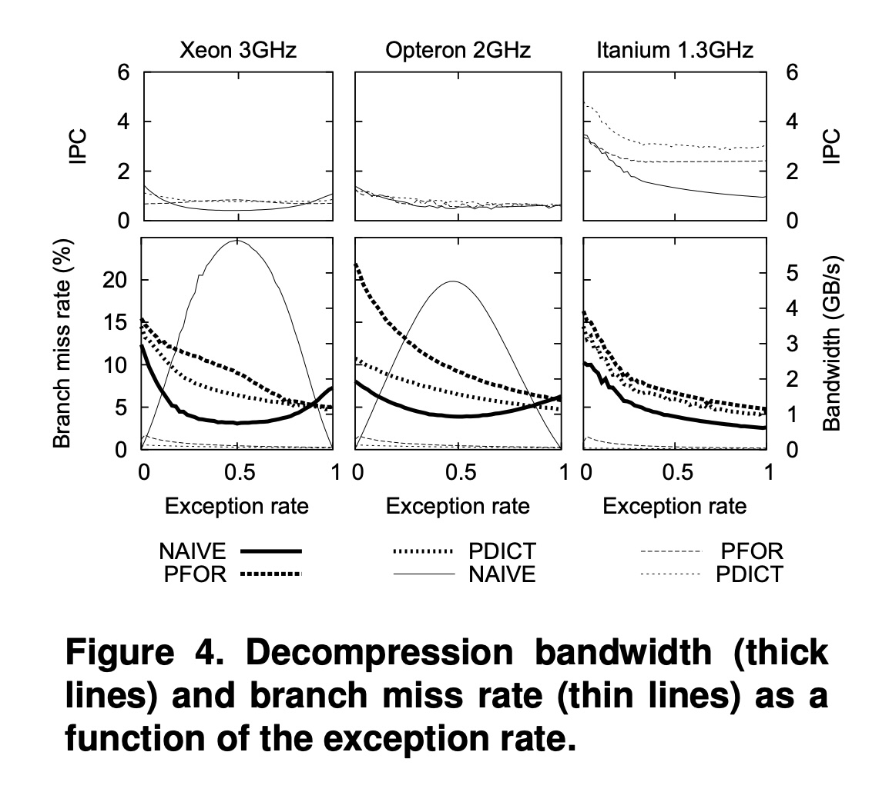

## AI论文解读 | Super-Scalar RAM-CPU Cache Compression
        
### 作者        
digoal        
        
### 日期        
2025-09-06        
        
### 标签        
PostgreSQL , PolarDB , DuckDB , AI , 论文解读        
        
----        
        
## 背景  
      
https://ir.cwi.nl/pub/15564/15564B.pdf        
  
提示:          
```          
读懂《Super-Scalar RAM-CPU Cache Compression》这篇论文需要提前掌握哪些基础知识, 请使用中文通熟易懂的讲解这些基础知识, 可以引用论文中的图、表或使用Markdown支持的图形(text,mermaid等)增加解释性. 
  
使用中文通熟易懂的解读《Super-Scalar RAM-CPU Cache Compression》这篇论文, 其中的关键内容请着重讲解, 可以引用论文中的图、表或使用Markdown支持的图形(text,mermaid等)增加解释性. 
  
提取《Super-Scalar RAM-CPU Cache Compression》这篇论文中的重要术语, 使用中文对这些术语进行通熟易懂的讲解, 可以引用论文中的图、表或使用Markdown支持的图形(text,mermaid等)增加解释性. 
```     
  
## 1 前置知识 
  
要读懂《Super-Scalar RAM-CPU Cache Compression》这篇论文，你需要提前了解以下几个方面的基础知识。这篇论文的核心思想是将CPU的性能优势（尤其是超标量架构）与数据压缩技术相结合，以解决大数据量处理中的I/O瓶颈问题。

---

### 1. 计算机体系结构基础

这部分是理解论文最关键的基础。论文的算法设计就是为了最大化利用现代CPU的性能。

#### CPU流水线 (CPU Pipeline)
想象一下一个工厂的流水线。在传统CPU中，一条指令从开始到完成需要一个完整的时钟周期。但现代CPU采用流水线技术，将指令的执行过程分解成多个阶段（比如：取指、译码、执行、写回）。每个时钟周期，新的指令都会进入流水线，而旧的指令则向前推进一个阶段，这大大提高了CPU的指令吞吐量。论文提到，早期的奔腾CPU有5级流水线，而2004年的奔腾4已经达到31级，流水线越长，处理速度就越快 。

#### 超标量处理器 (Super-Scalar CPU) 和 IPC
**超标量处理器**是一种能在一个时钟周期内同时执行多条指令的CPU 。只要这些指令彼此独立，CPU就可以将它们分派到多个并行的流水线中同时执行。因此，**IPC (Instructions Per Cycle)**，即“每时钟周期执行的指令数”，可以大于1 。

#### 流水线中的“冒险” (Hazards)
当指令之间存在依赖关系时，流水线的性能会受到影响，论文称之为“冒险”。
* **数据冒险 (Data Hazard)**: 当一条指令需要上一条指令的执行结果时，它必须等待，这会导致流水线停顿 。
* **控制冒险 (Control Hazard)**: 这是更昂贵的一种冒险。当程序中出现 `if-then-else` 这样的条件分支或函数调用时，CPU不知道接下来该执行哪条指令，会导致流水线完全停顿 。为了避免这种情况，现代CPU会使用 **分支预测 (Branch Prediction)** 技术 。它会根据过去的经验来预测条件分支的结果并提前执行。如果预测错误，CPU必须清空整个流水线，然后重新开始，这将导致巨大的性能损失 。

这篇论文提出的新算法正是通过 **避免内循环中的 `if-then-else`** 来解决控制冒险问题，从而提升IPC和性能 。

---

### 2. 数据库与数据压缩基础

论文提出新算法的目的是为了解决数据库中的I/O瓶颈，所以了解一些数据库和传统压缩方法是必要的。

#### I/O 瓶颈 (I/O Bound)
在大规模数据处理任务中（如OLAP、数据挖掘），CPU处理数据的速度远高于从磁盘读取数据的速度，因此程序大部分时间都在等待数据从磁盘加载到内存，这种情况被称为I/O瓶颈 。论文指出，压缩可以缓解这个瓶颈，前提是编码和解码速度要远超磁盘I/O带宽 。

#### 传统压缩方法
论文改进了两种传统的轻量级数据库压缩方法：
* **Frame-of-Reference (FOR) 压缩**: 这种方法通过存储每个数据块中的最小值，然后将所有值表示为与该最小值的差值，从而减少存储所需的位数 。
* **字典压缩 (Dictionary Compression)**: 如果一个数据列的值域很小（例如性别只有“男”、“女”），可以用一个整数代码来代替每个值，并将实际值保存在一个独立的“字典”中 。

这两种传统方法都无法很好地处理数据中的**异常值 (Outliers)**。例如，FOR压缩会因为一个异常值而需要更多的位数来编码整个数据块，而字典压缩则会因为不常见的值而需要更大的字典 。论文提出的新算法（PFOR、PDICT）通过将这些异常值单独存储来解决这个问题 ，这也是算法名称中“P”（Patched，修补）的由来 。

---

### 3. RAM-CPU 缓存压缩 (RAM-CPU Cache Compression)

这是论文的一个核心创新点。传统的压缩策略是在磁盘和内存之间进行压缩/解压缩（I/O-RAM），即数据从磁盘读到内存时是压缩的，一旦进入内存就会被解压缩 。

论文提出了一种新的策略：**RAM-CPU缓存压缩**。数据块从磁盘读到内存时保持压缩状态，只在需要时才以小粒度（例如一个向量或数组）被即时解压缩到CPU缓存中 。

这种方法的优势可以从论文中的图1（Figure 1）中直观地看出：   

* **传统 I/O-RAM 压缩 (图1左侧)**:
    1.  磁盘数据读取到内存（已压缩）。
    2.  数据从内存移动到CPU进行解压缩。
    3.  解压缩后的数据从CPU写回内存。
    4.  查询处理需要时，数据再次从内存移动到CPU缓存。
    *这导致数据在内存和CPU缓存之间多次不必要的移动，增加了开销 。*

* **论文提出的 RAM-CPU 压缩 (图1右侧)**:
    1.  磁盘数据读取到内存（已压缩）。
    2.  查询处理需要时，数据直接从内存中以小粒度解压缩到CPU缓存。
    *这种方法省去了数据在内存中的多次移动，并且由于数据在内存中是压缩的，可以缓存更多的数据，从而减少磁盘I/O 。*

了解以上基础知识，你将能够更好地理解论文中关于算法设计、性能瓶颈分析以及实验结果的详细内容。
  
## 2 解读论文 
  
好的，我们来通俗易懂地解读一下《Super-Scalar RAM-CPU Cache Compression》这篇经典论文。

### 论文核心思想一句话概括

这篇论文的核心思想是：为了解决大数据查询中磁盘读写速度跟不上CPU处理速度的“I/O瓶颈”问题，作者们设计了三种为现代CPU“量身定做”的超高速数据压缩算法（PDICT, PFOR, PFOR-DELTA），并且提出了一种新的压缩/解压位置——在内存和CPU缓存之间进行，从而极大地提升了数据库查询性能 。

-----

### 1\. 问题背景：为什么需要新的压缩技术？

在进行OLAP（联机分析处理）、数据挖掘或科学数据分析时，系统需要处理海量数据 。即使使用了高端的RAID磁盘阵列，CPU也常常因为等待数据从磁盘读入内存而“闲着”，这就是所谓的**I/O瓶颈**。

一个“简单粗暴”的解决方法是堆硬件，比如用上百块硬盘来存储一个100GB的数据库 。从论文的`表1`可以看出，在当时的TPC-H数据库性能测试中，硬件成本的60%-80%都花在了磁盘上 。这种方法成本高昂，且不切实际 。

  

```text
               TPC-H 100GB 配置成本分析 (表1简化版)
┌───────────────────────────┬──────────────────┬──────────────────────┐
│         CPU + RAM         │      硬盘存储      │   存储成本占比   │
├───────────────────────────┼──────────────────┼──────────────────────┤
│ 4xPower5 1.65GHz (22%)    │ 42块硬盘 (1.6TB) │         78%          │
│ 4xItanium2 1.5GHz (39%)   │ 112块硬盘 (1.9TB)│         61%          │
│ 4xXeon MP 2.8GHz (28%)    │ 74块硬盘 (1.2TB) │         72%          │
└───────────────────────────┴──────────────────┴──────────────────────┘
```

另一个思路是**数据压缩**。如果解压速度足够快，快到能超过磁盘的读取速度，那么就可以有效缓解I/O瓶颈 。但这要求解压速度达到每秒几个GB的级别，而当时像`gzip`, `lzrw1`这类通用或快速压缩算法远远达不到这个要求 。

-----

### 2\. 关键创新一：为超标量CPU设计的压缩算法

现代CPU（论文中称为超标量CPU）具有**流水线（Pipelining）和多指令发射**的能力，可以一个时钟周期内执行多条指令（IPC \> 1）。但是，`if-then-else`这样的条件分支语句会严重破坏CPU的流水线执行效率，导致性能急剧下降，这被称为**控制冒险（control hazards）** 。

作者们敏锐地抓住了这一点，设计了三种压缩算法，其核心原则就是：**在性能最关键的循环中，坚决避免使用`if-then-else`** 。

这三种算法分别是：

  * **PFOR (Patched Frame-of-Reference)**：适用于数值型数据。它为一批数据找一个基准值（Frame），然后存储每个值与这个基准的差值 。
  * **PFOR-DELTA**：在PFOR的基础上，存储的是相邻数值之间的差值（增量），特别适合存储有序的整数序列，比如倒排索引 。
  * **PDICT (Patched Dictionary Compression)**：字典压缩，将出现频率高的值编码成一个小的整数 。

#### “补丁”（Patched）思想的巧妙之处

这三种算法名字里都有个"P"，代表"Patched"（打补丁）。这是它们能避开`if-then-else`并高速运行的关键。

对于一批数据，总有些数值不符合压缩规律，比如PFOR里离基准值太远的“离群值”，或者PDICT里出现频率很低的“冷门值”。这些值被称为**异常值（Exceptions）**。

传统的处理方法（论文中称为`NAIVE`方法）是在解压时用`if`语句判断：

```c
// 传统NAIVE方法
if (是普通值) {
  正常解压;
} else { // 是异常值
  从特殊区域读取原值;
}
```

当异常值的比例不高不低（比如接近50%）时，CPU的分支预测会频繁出错，性能就会像论文`图4`中`NAIVE`曲线那样，在异常率为0.5时跌入谷底 。   

而“**打补丁**”方法的处理流程是：

1.  **解码一切 (Decode Regardless)**：先不管三七二十一，用同一个解码逻辑把所有数据都“解”出来。此时，异常值的位置上会被填上一个错误的、无意义的数据 。
2.  **打上补丁 (Patch It Up)**：通过一个预先构建好的“链表”快速定位到那些被错误解码的异常值位置，然后用它们真实的值进行覆盖（打补丁） 。


这种两阶段的处理方式，将一个带有`if-else`判断的复杂循环，拆分成了两个非常简单、没有分支判断的紧凑循环 。这使得编译器可以充分优化，CPU也能发挥出最高的流水线效率，实现了高达数 GB/s 的解压速度 。`图4`清晰地展示了PFOR和PDICT算法的性能（粗线）随着异常率增加而平滑下降，远胜于`NAIVE`方法 。

-----

### 3\. 关键创新二：RAM-CPU缓存压缩

传统的数据库压缩发生在**磁盘I/O和内存（RAM）之间** 。数据从磁盘读入内存后，先解压成原始大小，然后再被CPU拿去计算。 

**传统方式的弊端 (左图):**

1.  **占用更多内存**：内存中缓存的是解压后的大数据页，能缓存的数据量变少，可能导致更多的磁盘读取 。
2.  **数据反复横跳**：数据需要经历“内存 -\> CPU（解压） -\> 内存（存解压结果） -\> CPU（计算）”的漫长旅程，增加了CPU缓存的压力和数据移动开销 。

作者们提出了一个革命性的想法：让压缩发生在**内存（RAM）和CPU缓存之间** 。

**新方式的优势 (右图):**

1.  **节省内存**：内存的缓冲区里始终存放压缩状态的数据页，同样大小的内存可以缓存更多数据 。
2.  **即时解压、一步到位**：只有当CPU要计算某部分数据时，才“即时（just-in-time）”地将这一小块数据解压到CPU缓存里直接使用 。数据流路径变为“内存（压缩态） -\> CPU缓存（解压并计算）”，极大减少了数据移动，提升了效率。

  

论文图1: 左侧为传统I/O-RAM压缩，右侧为创新的RAM-CPU缓存压缩 

  

`图7`的实验也证明了这一点，RAM到Cache的解压方式（粗线）性能远高于传统的RAM到RAM的方式（细线） 。

-----

### 4\. 实验效果如何？

论文通过在MonetDB/X100数据库系统上进行的TPC-H基准测试，验证了这些技术的有效性 。

从`表2`可以看出：   

  * **解压神速**：在大部分查询中，解压速度都达到了**2GB/s**以上的目标，这比当时高端RAID系统的350MB/s读写速度快了一个数量级 。
  * **性能提升显著**：在磁盘性能较弱的系统上（Opteron 4磁盘RAID），查询性能的提升倍数与压缩比基本一致，说明I/O瓶颈被成功消除 。在磁盘性能较强的系统上（Pentium4 12磁盘RAID），查询也从I/O密集型变成了CPU密集型，获得了显著加速 。
  * **PAX存储模型同样受益**：即使在对I/O要求更高的PAX存储模型下，这些压缩技术依然带来了很好的性能提升 。

此外，在信息检索领域的倒排文件压缩测试中（`表3`），PFOR-DELTA算法的解压速度比当时新提出的`carryover-12`方案快了**6.5倍**，而压缩率仅略微降低了15% 。这证明了其在不同应用场景下的普适性和高效性。   

### 总结

《Super-Scalar RAM-CPU Cache Compression》是一篇里程碑式的论文，它不仅贡献了三种至今仍在广泛应用的超高速压缩算法，更重要的是，它提出了两个影响深远的思想：

1.  **算法设计要与硬件架构协同**：通过规避条件分支等方式，充分利用现代CPU的超标量和流水线特性，将软件性能压榨到极致 。
2.  **重新思考数据在存储层次中的形态**：将压缩/解压操作从传统的I/O层移到更靠近计算核心的CPU缓存层，优化了整个数据处理链路 。

这些思想对于今天我们设计高性能的数据密集型应用，仍然具有非常重要的指导意义。
  
## 3 术语 
  
这篇《Super-Scalar RAM-CPU Cache Compression》论文中，有一些核心术语是理解其创新点的关键。下面我将用通俗易懂的方式为你讲解这些术语，并结合论文思想进行阐述。

-----

### 1\. 超标量处理器 (Super-Scalar CPU)

**超标量**是指一种CPU架构，它能够在一个时钟周期内同时执行多条指令。这就像一个多车道的高速公路，可以同时让几辆车通过，而不是像单车道那样一辆接一辆。

这篇论文的算法设计正是为了充分利用这种超标量架构的并行能力。传统的解压算法通常是串行执行的，就像单车道一样，无法发挥超标量CPU的优势。而论文提出的新算法（PFOR、PDICT等）通过巧妙设计，使得CPU可以同时处理多条解压指令，从而大大提高了解压速度。

-----

### 2\. IPC (Instructions Per Cycle)

**IPC**，全称 **Instructions Per Cycle**，直译为“每时钟周期执行的指令数”。它是衡量CPU效率的一个重要指标。

  * **IPC = 1**: 意味着每个时钟周期只能执行一条指令。
  * **IPC \> 1**: 意味着CPU可以同时执行多条指令，这正是超标量处理器的能力。

这篇论文的核心目标之一就是**最大化 IPC**。论文指出，程序中的 `if-then-else` (条件分支) 等语句会造成昂贵的“控制冒险”，导致流水线停顿，从而严重降低 IPC。论文提出的算法正是通过**消除内循环中的条件分支**来避免这种问题，确保CPU能够持续高效地并行执行指令，从而将IPC推向理论极限。

-----

### 3\. I/O 瓶颈 (I/O Bound)

**I/O 瓶颈**是指，在数据处理任务中，数据从磁盘（或外部存储）传输到内存的速度，远慢于CPU处理数据的速度，导致CPU大部分时间都在等待数据，从而限制了整个系统的性能。

论文的出发点就是要解决这个瓶颈。它认为，如果数据能够被高效压缩，并且解压速度足够快，那么从磁盘传输的数据量就会减少，从而缓解I/O瓶颈，让CPU有更多的时间去处理计算任务，而不是空闲等待。

-----

### 4\. RAM-CPU 缓存压缩 (RAM-CPU Cache Compression)

这是论文最核心的创新点。它提出了一个全新的数据流模型，不同于传统的数据压缩方法。

**传统压缩模式 (I/O-RAM):**
数据从磁盘读取到内存时是压缩的，然后会在内存中被完全解压，再供CPU使用。


**论文提出的 RAM-CPU 缓存压缩:**
数据从磁盘读入内存后，仍然保持压缩状态。只有当CPU真正需要使用这部分数据时，才会以小块（例如一个缓存行的大小）为单位，直接在CPU缓存中进行即时解压。


**关键优势:**

  * **减少内存-缓存数据传输:** 避免了传统模式中，数据在内存中先解压、再从内存传输到CPU缓存的冗余步骤。
  * **更高效的缓存利用:** 由于内存中存储的是压缩数据，可以在相同容量的内存中装下更多的数据，增加了缓存命中率，进一步减少了磁盘I/O。

-----

### 5\. PFOR, PDICT 和 PFOR-DELTA

这三个是论文提出的三种新型压缩算法。它们的核心思想是在传统的轻量级压缩算法基础上，通过“**打补丁 (Patch)**”的方式来处理数据中的**异常值 (Outliers)**。

**PDICT (Patched Dictionary Compression):**

  * **传统字典压缩:** 如果一个数据列的值域很小，可以为每个值分配一个唯一的整数编码，然后用这个编码来代替原始值。
  * **PDICT 创新点:** 传统字典压缩不适合处理罕见的、不规律的值。PDICT将这些罕见值单独存储在一个“补丁列表 (Patch list)”中。这种方式既保留了字典压缩的高效性，又能灵活处理异常值。

**PFOR (Patched Frame-of-Reference) 和 PFOR-DELTA:**

  * **传统 FOR 压缩:** 通过存储数据块中的最小值，然后用每个值与最小值的差值进行编码。一个异常值会迫使整个数据块都使用更多的位数来编码，非常低效。
  * **PFOR 创新点:** PFOR 同样引入了一个“补丁列表”。它只用一个较小的位数（如4位或8位）来编码大部分数据，而那些需要更多位数的异常值（即超过位宽能表示的范围）则被移到补丁列表中单独存储。这大大提高了压缩率。
  * **PFOR-DELTA:** 它是 PFOR 的变种，用于处理排序后的数据。它不是编码与最小值的差值，而是编码与前一个值的差值（**Delta**），可以进一步提升压缩率。
  
## 参考        
         
https://ir.cwi.nl/pub/15564/15564B.pdf    
        
<b> 以上内容基于DeepSeek、Qwen、Gemini及诸多AI生成, 轻微人工调整, 感谢杭州深度求索人工智能、阿里云、Google等公司. </b>        
        
<b> AI 生成的内容请自行辨别正确性, 当然也多了些许踩坑的乐趣, 毕竟冒险是每个男人的天性.  </b>        
  
  
  
#### [期望 PostgreSQL|开源PolarDB 增加什么功能?](https://github.com/digoal/blog/issues/76 "269ac3d1c492e938c0191101c7238216")
  
  
#### [PolarDB 开源数据库](https://openpolardb.com/home "57258f76c37864c6e6d23383d05714ea")
  
  
#### [PolarDB 学习图谱](https://www.aliyun.com/database/openpolardb/activity "8642f60e04ed0c814bf9cb9677976bd4")
  
  
#### [PostgreSQL 解决方案集合](../201706/20170601_02.md "40cff096e9ed7122c512b35d8561d9c8")
  
  
#### [德哥 / digoal's Github - 公益是一辈子的事.](https://github.com/digoal/blog/blob/master/README.md "22709685feb7cab07d30f30387f0a9ae")
  
  
#### [About 德哥](https://github.com/digoal/blog/blob/master/me/readme.md "a37735981e7704886ffd590565582dd0")
  
  

  
