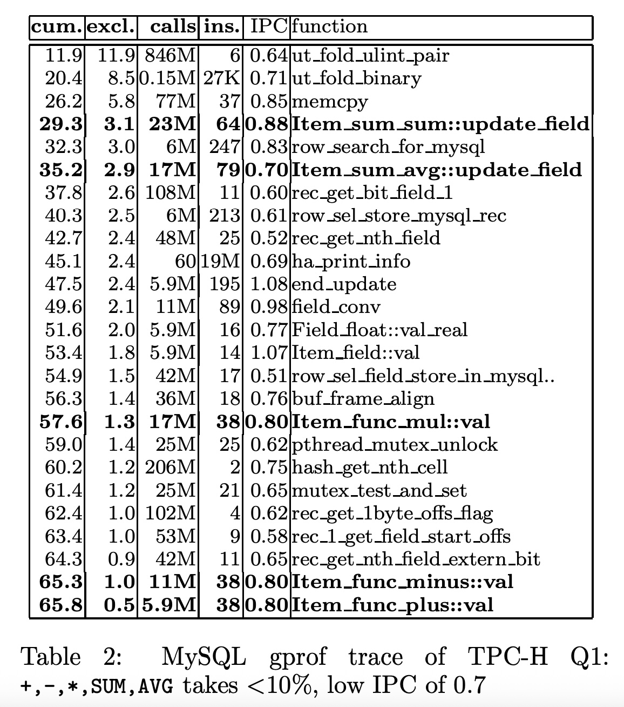
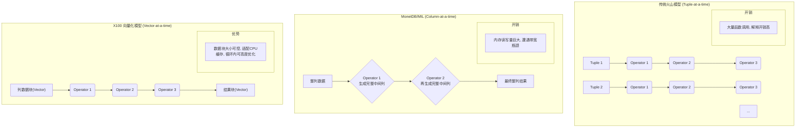
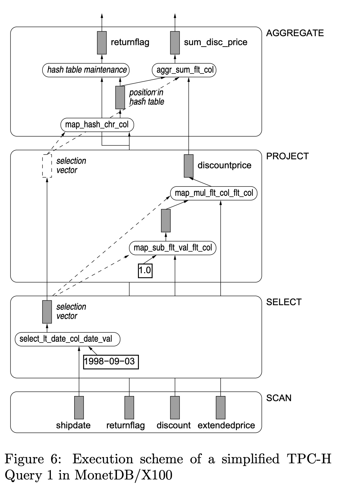
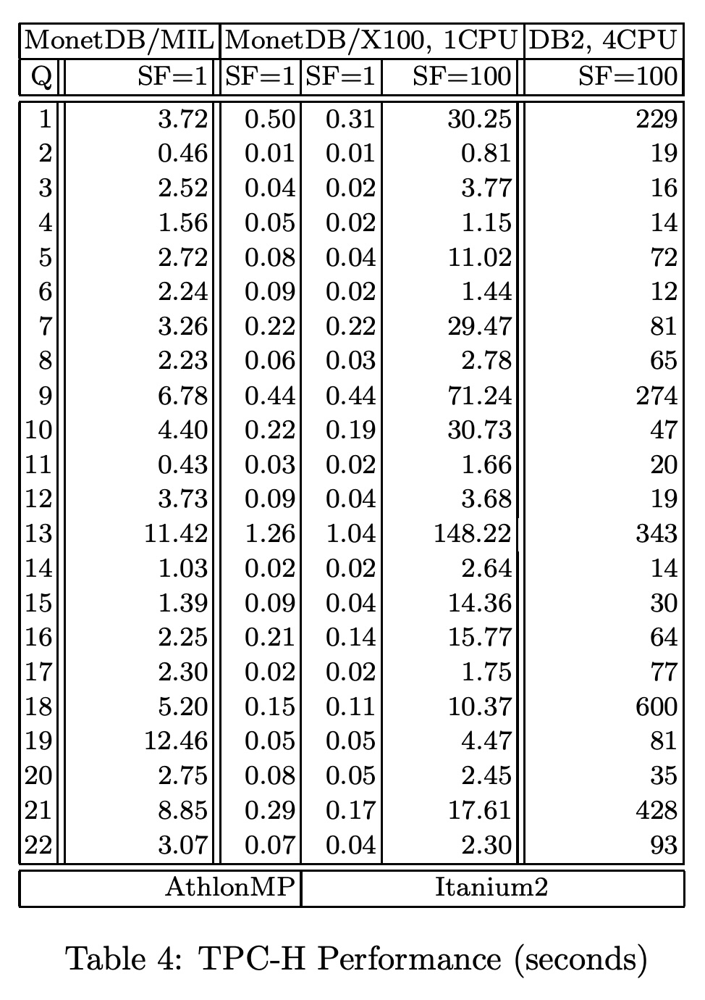
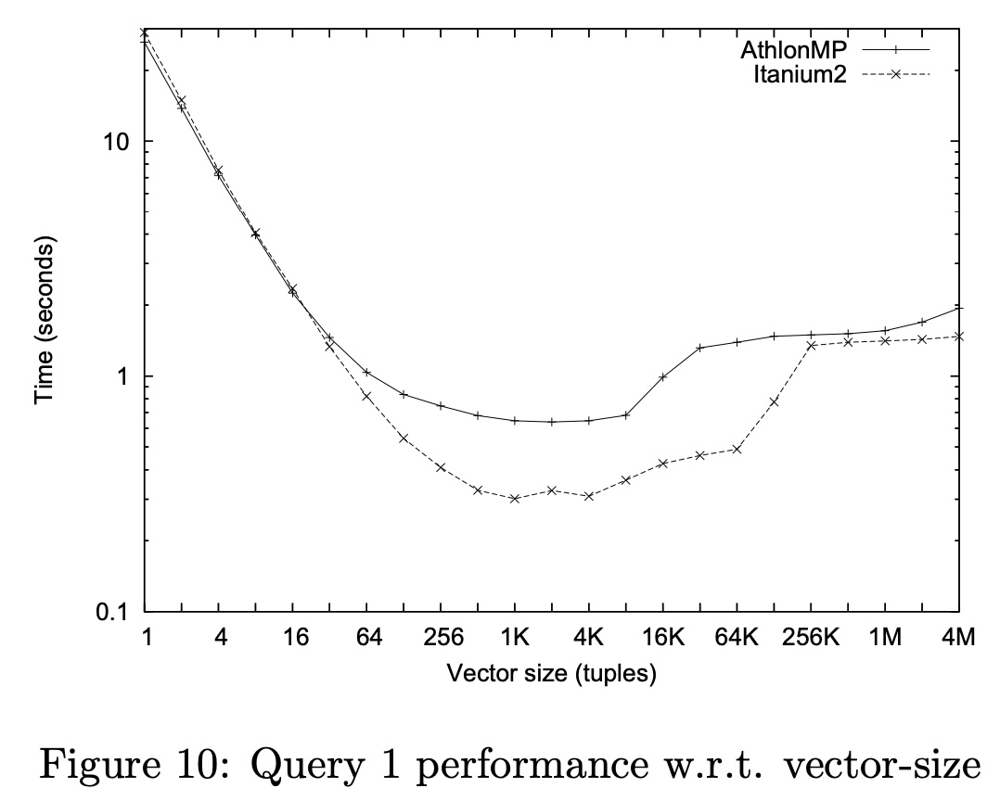
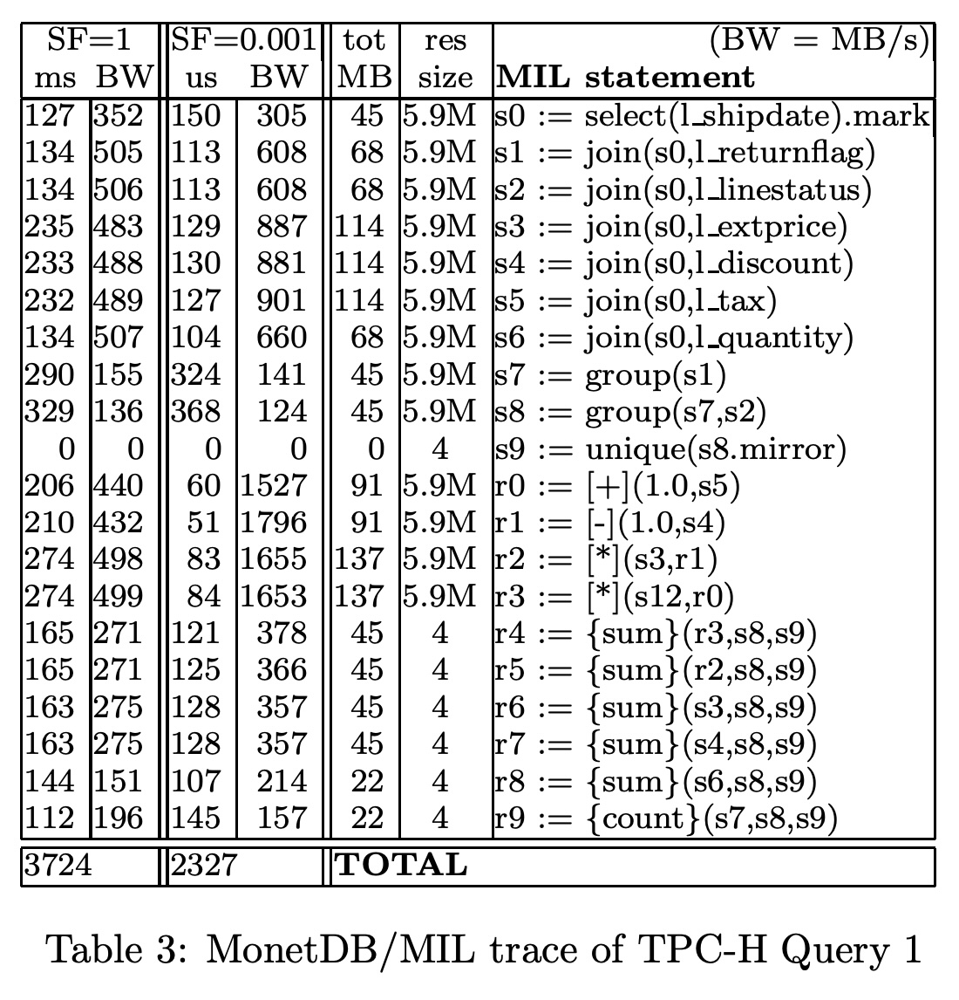
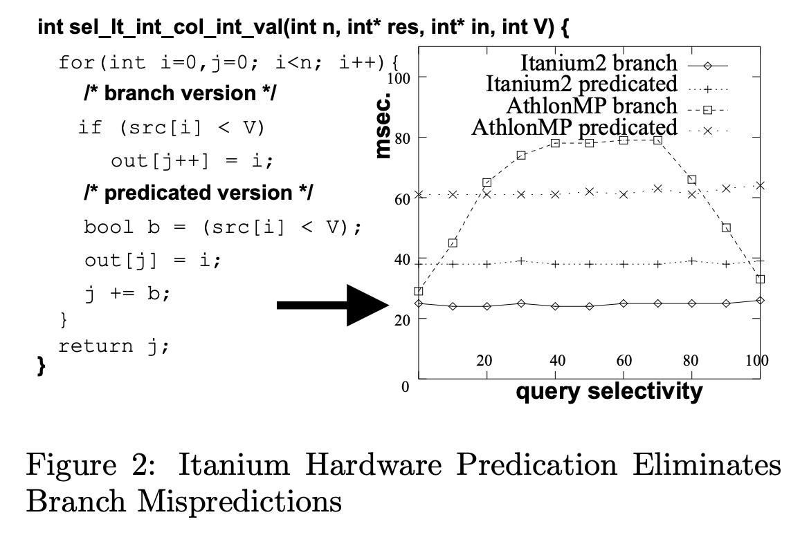

## AI论文解读 | MonetDB/X100: Hyper-Pipelining Query Execution
        
### 作者        
digoal        
        
### 日期        
2025-09-06        
        
### 标签        
PostgreSQL , PolarDB , DuckDB , AI , 论文解读        
        
----        
        
## 背景  
      
https://www.cidrdb.org/cidr2005/papers/P19.pdf        
  
提示:          
```          
读懂《MonetDB/X100: Hyper-Pipelining Query Execution》这篇论文需要提前掌握哪些基础知识, 请使用中文通熟易懂的讲解这些基础知识, 可以引用论文中的图、表或使用Markdown支持的图形(text,mermaid等)增加解释性. 
  
使用中文通熟易懂的解读《MonetDB/X100: Hyper-Pipelining Query Execution》这篇论文, 其中的关键内容请着重讲解, 可以引用论文中的图、表或使用Markdown支持的图形(text,mermaid等)增加解释性. 
  
提取《MonetDB/X100: Hyper-Pipelining Query Execution》这篇论文中的重要术语, 使用中文对这些术语进行通熟易懂的讲解, 可以引用论文中的图、表或使用Markdown支持的图形(text,mermaid等)增加解释性. 
```     
  
## 1 前置知识 
  
读懂《MonetDB/X100: Hyper-Pipelining Query Execution》这篇论文，需要提前理解一些关于现代CPU架构和数据库查询执行模型的基础知识。这篇论文的核心观点是，传统的数据库系统没有充分利用现代CPU的强大能力，而MonetDB/X100通过一种新的执行模型解决了这个问题。

下面，我将分两部分为您通俗地讲解这些基础知识。

---

### 第一部分：现代CPU的工作原理

这篇论文的引言和第二章详细介绍了现代CPU的两个关键特性：流水线（Pipelining）和超标量（Super-scalar）。

#### 1. 流水线（Pipelining）
流水线是一种提高CPU工作频率的技术 。您可以把它想象成一条工厂的流水线：
* 假设制造一件产品（执行一条指令）需要5个步骤。
* 如果没有流水线，第一件产品完成所有5个步骤后，第二件产品才能开始。
* 有了流水线，第一件产品完成第一个步骤后，马上进入第二个步骤，而第二件产品可以立即开始第一个步骤 。
* 这样，虽然完成单件产品的时间可能不变，但单位时间内生产出的产品（执行的指令）数量大大增加了，从而提高了CPU频率（主频） 。

但是，流水线有两个问题：
* **流水线停顿（Pipeline Stalls）：** 如果一条指令需要等待前一条指令的计算结果，它就必须暂停等待，这会造成流水线停顿 。
* **分支预测失败（Branch Misprediction）：** 当CPU遇到像`if...else`这样的条件分支时，它会猜测哪条路径会被执行，并提前加载指令到流水线中 。如果猜错了，整个流水线中的所有指令都必须被清空，并重新加载正确的指令，这会带来巨大的性能损失 。论文中指出，数据库查询中的数据依赖性分支（如`WHERE`子句）很难预测，因此会严重影响性能 。

#### 2. 超标量（Super-scalar）
超标量CPU可以并行执行多条指令 。这就像工厂里有多条并行的生产线 。
* 如果多条指令之间没有依赖关系，CPU就可以同时将它们放入不同的流水线中执行 。
* 这使得CPU在一个时钟周期内可以执行多于一条指令，这个指标被称为**IPC（Instructions Per Cycle，每周期指令数）** 。
* 论文中提到，科学计算可以达到很高的IPC，而传统的数据库系统通常IPC很低，仅为0.7左右 。

---

### 第二部分：数据库查询执行模型与瓶颈

这篇论文的核心论点是，传统数据库的执行模型导致了CPU IPC低下。

#### 1. Volcano迭代器模型（Volcano Iterator Model）
大多数传统数据库系统采用Volcano模型进行查询处理 。
* 这个模型将每个数据库操作（如`Scan`、`Select`、`Join`）都视为一个独立的“迭代器” 。
* 每个迭代器都通过`next()`函数向上层迭代器返回**一个元组** 。
* 这种“**逐元组（Tuple-at-a-time）**”的执行方式虽然灵活，但会带来巨大的解释器开销，并阻止编译器进行重要的优化，例如循环流水线（Loop Pipelining） 。论文中的表格（Table 2）分析了MySQL的执行开销，发现只有不到10%的时间用于实际计算，大部分时间都花在了元组的导航和数据拷贝上 。

  

#### 2. MonetDB/MIL 的逐列（Column-at-a-time）执行
为了解决上述问题，MonetDB的早期版本（MIL）采用了“**逐列（Column-at-a-time）**”的执行模型 。
* 它不逐个处理元组，而是每次处理一整列（或一个大块）。
* 这种方式避免了逐元组的解释器开销，让编译器可以对整个列进行优化，从而实现了高效的循环流水线 。
* 然而，它的问题是“**完整列数据实体化（Full Column Materialization）**”，即每个中间结果都会生成一整列的数据 。如果查询很复杂，会产生大量中间列数据，这会消耗巨大的内存带宽，导致性能瓶颈 。

#### 3. MonetDB/X100的解决方案：向量化查询处理（Vectorized Query Processing）
论文提出的MonetDB/X100引擎通过“**向量化查询处理**”解决了这些问题 。
* 它将Volcano模型的“流水线增量物化（incremental materialization）”思想与MonetDB的“逐列执行”模型结合起来 。
* MonetDB/X100不像Volcano那样每次处理一个元组，也不像MIL那样处理一整列，而是每次处理**一个元组向量（vector）**，通常包含几百或几千个元组 。
* 这种方式既保留了逐列处理的优点，允许编译器进行高效的循环优化，又避免了完整物化带来的内存带宽瓶颈，因为中间结果只在小块（向量）的范围内生成和传递 。

简单来说，要读懂这篇论文，您只需要记住：传统的数据库因为**逐元组处理**而效率低下，MonetDB的早期版本因为**逐列完整物化**而有内存瓶颈，而MonetDB/X100通过**向量化处理**，结合了两者的优点，实现了CPU和内存的协同高效利用。
  
## 2 解读论文 
  
好的，我们来通俗易懂地解读一下这篇经典的数据库领域论文——《MonetDB/X100: Hyper-Pipelining Query Execution》。

这篇论文的核心思想可以概括为：**为了让数据库查询在现代CPU上跑得飞快，我们不能再像以前那样“一个一个地”处理数据，也不能“一整列一整列地”处理，而是应该“一小撮一小撮地”处理。** 这个“一小撮”就是论文中反复提到的“向量（Vector）”。

-----

### 论文背景：为什么传统数据库在现代CPU上“跑不快”？

作者首先抛出了一个尖锐的问题：现代CPU的计算能力越来越强，拥有超长流水线（Pipelining）和多指令并行执行能力（Super-scalar），理论上应该能达到很高的IPC（每时钟周期执行的指令数）。然而，数据库系统在运行决策支持、数据分析（OLAP）这类计算密集型查询时，IPC却低得可怜，通常连1都不到 ，远不如科学计算等领域 。

作者通过研究发现，问题主要出在查询执行模型上：

1.  **传统模型：火山模型（Volcano Model / Tuple-at-a-time）**

      * **工作方式**：这是大多数关系型数据库使用的经典模型 。你可以把它想象成一条由多个操作员（Operator）组成的流水线，比如“扫描员”、“筛选员”、“计算员”。数据以“元组”（Tuple，也就是表中的一行）为单位，从一个操作员传递给下一个，直到处理完毕 。
      * **缺点**：
          * **解释开销巨大**：每处理一条数据，都要在各个操作员之间调用函数、传递参数，就像在工作中不停地切换任务和交接，真正干活的时间占比很小 。
          * **对编译器不友好**：由于每次函数调用只处理一条数据，编译器无法进行“循环流水线（loop pipelining）”这样的关键优化 。编译器看不到整体的循环，也就无法挖掘指令间的并行性，导致CPU的并行处理能力被严重浪费 。

2.  **早期列存数据库模型：MonetDB/MIL (Column-at-a-time)**

      * **工作方式**：作为对比，作者分析了他们自己开发的MonetDB系统。它采用列式存储，并且以“一整列数据”为单位进行计算 。
      * **缺点**：
          * **内存带宽瓶颈**：这种模型会产生巨大的中间结果 。例如，计算 `price * (1 - discount)`，它会先生成一个完整的 `(1 - discount)` 列，再生成一个完整的最终结果列 。这导致数据在内存和CPU之间来回拷贝，很快就达到了内存带宽的上限，CPU大部分时间都在等待数据，而不是在计算 。

我们可以用一个简单的图来理解这三种模型的区别：



### 关键论证：TPC-H Q1微基准测试剖析

为了证明上述观点，论文使用TPC-H基准测试中的第一个查询（Q1）作为案例 。这是一个非常典型的分析类查询，它对 `lineitem` 这张大表进行全表扫描，做一些过滤、计算和聚合操作 。

**1. 在MySQL上的表现：开销惊人，效率低下**

作者通过 `gprof` 工具分析了MySQL 4.1执行Q1的性能（见论文中的Table 2） 。    

  * **90%的时间在“摸鱼”**：分析发现，真正用于加、减、乘、聚合等核心计算的函数（论文中标粗的`Item_func_*`等）只占了总时间的不到10% 。
  * **62%的时间在“数据搬运”**：剩下大量的时间都花在了记录格式解析、字段提取等开销上 。
  * **一次加法=49个时钟周期**：一次简单的浮点数加法，在MySQL中需要消耗38条指令，最终折合49个时钟周期 。而一个优化的实现只需要3个周期左右 。这巨大的差异正是由于“Tuple-at-a-time”模型导致的解释开销和无法进行编译器优化 。

**2. 在MonetDB/MIL上的表现：遭遇“内存墙”**

MonetDB/MIL虽然比MySQL快很多，但当数据量大时（SF=1），它的性能被内存带宽牢牢限制在了500MB/s 。而当数据量很小，能完全放入CPU缓存时（SF=0.001），带宽可以飙升到1.5GB/s以上，性能也几乎翻倍 。这清晰地表明，**全列物化的策略导致了严重的内存带宽瓶颈** 。

**3. 手写C代码的极限性能**

作者用一个高度优化的C语言函数实现了Q1的核心逻辑，作为性能的“天花板” 。结果显示，这个手写代码的性能比当时的商用数据库快了将近100倍 。这证明了硬件本身潜力巨大，是数据库的执行架构没有有效利用它。

### 解决方案：X100向量化查询处理器

基于以上分析，作者设计了全新的查询引擎X100，它的核心就是**向量化执行（Vectorized Execution）**。

#### 核心架构

X100的执行过程类似于火山模型，仍然是操作员之间的数据流水线 。但关键区别在于，流水线中流动的不再是单个元组，而是一个个的**向量（Vector）** 。一个向量就是一列数据中的一小段，比如1000个值 。

我们通过论文中的Figure 6来理解这个过程（这是一个简化的Q1执行流程）：

  

*根据论文Figure 6改编的执行流程示意图*

1.  **SCAN**：从磁盘或内存中一次读取多个列的向量（数据块）。
2.  **SELECT**：`select_lt_date_col_date_val`原语对 `shipdate` 向量进行判断，生成一个“选择向量（selection vector）” 。这个向量不存具体数据，只记录了哪些位置的行是符合条件的。
3.  **PROJECT**：进行计算。例如，`map_sub_flt_val_flt_col`原语计算 `1.0 - discount`。它会利用上一步的“选择向量”，只对符合条件的那些行进行计算，并将结果写到输出向量的相应位置 。整个过程数据都在CPU缓存中，没有大规模的内存读写。
4.  **AGGREGATE**：最后，聚合操作员根据“选择向量”和分组键（`returnflag`）的值，更新哈希表中的聚合结果 。

#### 关键设计

  * **向量大小适配CPU缓存**：向量的大小（例如1024个元素）被精心选择，以确保一次处理涉及到的所有向量都能轻松放入CPU的L1或L2缓存 。这极大地降低了对内存带宽的依赖，因为大部分数据交换都发生在飞快的缓存内部 。
  * **向量化原语（Vectorized Primitives）**：X100的所有计算都由高度优化的“原语”函数完成 。这些原语函数，比如`map_plus_double_col_double_col`（两个浮点数列相加），其内部就是一个紧凑的循环 。
  * **对编译器极其友好**：因为原语函数是对一个数组（向量）进行循环操作，编译器可以清楚地看到循环结构，并应用**循环流水线**等优化技术，充分压榨CPU的并行计算能力 。作者还使用了 `__restrict__` 关键字告诉编译器输入和输出的内存区域不重叠，使其可以进行更激进的优化 。

#### 数据存储与更新

X100采用列式存储，并且为了解决列存更新慢的问题，设计了一种巧妙的机制 ：

  * 原始数据列被视为**不可变**的 。
  * 删除操作只是在一个专门的删除列表中标记一下被删除行的ID 。
  * 插入和更新操作则写入一个独立的增量结构（delta structures）中 。
  * 这样，更新操作的IO开销非常小，只在增量结构累积到一定程度后才进行一次性的数据重组 。

### 性能评测：X100的威力

最终的性能评测结果（见论文Table 4）是惊人的：   

  * **碾压前代**：在所有TPC-H查询上，MonetDB/X100都显著优于其前身MonetDB/MIL 。
  * **性能卓越**：在100GB数据集上，单核的MonetDB/X100的性能已经可以和当时使用4个更强CPU的DB2商业数据库相媲美 。
  * **接近理论极限**：在Q1上，X100的性能达到了手写C代码的一半左右 ，远超传统数据库两个数量级 ，证明了其架构的巨大成功。

论文中的Figure 10还展示了向量大小对性能的影响。可以看到，当向量太小（如1），性能很差，因为解释开销占比高 ；当向量太大，导致中间结果无法放入CPU缓存时，性能也会下降 。这完美地印证了其 **“大小刚刚好，能放进缓存”** 的设计理念。

  

### 总结

《MonetDB/X100》这篇论文通过深入分析现代CPU架构与数据库执行模型的矛盾，精准地指出了传统“Tuple-at-a-time”模型的解释开销和“Column-at-a-time”模型的内存带宽瓶颈问题。

它创新性地提出了**向量化执行模型**，通过将数据切分为能适配CPU缓存的向量进行处理，成功地在“流水线开销”和“数据移动成本”之间找到了最佳平衡点 。这不仅让编译器能够最大限度地优化代码、压榨硬件性能，也催生了后续一系列面向CPU效率的数据库系统设计，对整个行业产生了深远的影响。
  
## 3 术语 
  
好的，我们来从《MonetDB/X100: Hyper-Pipelining Query Execution》这篇论文中提取核心术语，并用通俗易懂的中文进行讲解。

-----

### 1\. IPC (Instructions-Per-Cycle) - 每周期执行指令数

  * **通俗讲解**：
    可以把CPU想象成一个工人，时钟周期（Cycle）就是工人的工作节拍，比如“嘀嗒”一下算一个周期。IPC就是这位工人在一个“嘀嗒”内能完成多少个动作（指令）。**IPC越高，代表CPU的工作效率越高**。
  * **论文中的意义**：
    这篇论文的出发点就是发现数据库系统在运行复杂查询时IPC非常低 ，通常小于1，意味着CPU在一个节拍内连一个有效动作都完不成。这说明CPU的强大能力被严重浪费了，而X100架构的核心目标就是大幅提升IPC 。

-----

### 2\. Volcano Model / Tuple-at-a-time - 火山模型 / 元组迭代模型

  * **通俗讲解**：
    这是传统关系型数据库（如MySQL, PostgreSQL）最经典的查询执行方式。你可以把它想象成一条处理流水线，数据以“一行”（元组）为单位，从一个算子（Operator，如“扫描”、“过滤”、“连接”）传递给下一个。整个过程就像这样：

    ```mermaid
    graph TD
        subgraph "处理第一行数据"
            A[扫描第一行] --> B[过滤第一行] --> C[计算第一行]
        end
        subgraph "处理第二行数据"
            D[扫描第二行] --> E[过滤第二行] --> F[计算第二行]
        end
        G[...]
    ```

  * **论文中的意义**：
    作者尖锐地指出，这种模型的最大弊病是 **解释开销（interpretation overhead）** 过高 。每处理一行数据，CPU都要在不同算子的函数之间来回跳转，真正用于计算的时间非常少 。同时，由于每次只处理一条数据，编译器无法进行“循环流水线”等关键性能优化 。

-----

### 3\. Column-at-a-time - 列迭代模型

  * **通俗讲解**：
    这是早期列式数据库（如MonetDB/MIL）采用的模型。与一次处理一行不同，它一次处理**一整列**数据。例如，要计算 `总价 = 单价 * 数量`，它会先把所有“单价”加载进来，再把所有“数量”加载进来，然后计算出完整的一列“总价”作为中间结果。
  * **论文中的意义**：
    这种模型的优点是避免了元组模型的解释开销。但缺点是会产生**巨大的中间结果**，当数据量很大时，反复读写这些中间结果会迅速耗尽内存带宽，导致CPU大部分时间都在等待数据，而不是在计算 。论文中的Table 3就清晰地展示了MonetDB/MIL在处理大数据量时受到了内存带宽的限制 。   

-----

### 4\. Vectorized Execution - 向量化执行

  * **通俗讲解**：
    这是X100的核心思想，是介于“一次一行”和“一次一列”之间的**最佳折中方案**。它将一列数据切分成若干个小批次，每个批次称为一个**向量（Vector）**，比如包含1024个值。查询处理时，数据就以“向量”为单位在算子之间流动。

    ```mermaid
    graph TD
        subgraph "处理流程"
            A[扫描<br>数据向量1] --> B[过滤<br>数据向量1] --> C[计算<br>数据向量1]
            C --> D[扫描<br>数据向量2] --> E[过滤<br>数据向量2] --> F[计算<br>数据向量2]
        end
    ```

  * **论文中的意义**：
    向量化执行的优势是多方面的：

      * **适配CPU缓存**：向量的大小被设计成可以完全载入CPU的高速缓存 。数据处理在飞快的缓存内完成，极大降低了对内存的访问压力。
      * **降低解释开销**：函数调用的开销被分摊到了向量中的每一条数据上，开销占比急剧下降 。
      * **对编译器友好**：处理向量的核心代码是一个紧凑的循环，这使得编译器可以施展 **循环流水线（Loop Pipelining）** 等优化手段，充分利用CPU的并行处理能力 。

-----

### 5\. Loop Pipelining - 循环流水线优化

  * **通俗讲解**：
    这是现代编译器和CPU的一项关键性能优化技术。想象一下，一个任务有两个步骤F和G。没有流水线优化时，是做完 `F(A[0])` 再做 `G(A[0])`，然后再开始处理 `A[1]`。而有了流水线优化，CPU可以在执行 `G(A[0])` 的同时，就开始执行 `F(A[1])`，让多个计算单元同时保持忙碌，极大提升了吞吐率。
  * **论文中的意义**：
    论文强调，传统数据库的“元组模型”因为没有明确的循环，导致编译器无法进行此项优化 。而X100的“向量化执行”天然就是在数组上循环，完美地将优化机会暴露给了编译器，这是其实现高CPU效率的关键之一 。

-----

### 6\. Branch Misprediction - 分支预测错误

  * **通俗讲解**：
    CPU的流水线很长，就像一条长长的火车。当遇到一个`if-else`条件判断（分支）时，CPU必须提前猜测会走`if`路径还是`else`路径，以便提前把指令装上“火车”。如果猜错了，整列“火车”上的指令都要被清空，然后从正确的路径重新开始，这会造成巨大的性能损失。
  * **论文中的意义**：
    数据库查询中的`WHERE`过滤条件就是典型的分支。论文中的Figure 2生动地展示了这个问题：对于一个选择率在50%左右的过滤条件，分支预测最困难，导致性能大幅下降。而通过代码重写（predicated version）或利用现代CPU的硬件谓词执行（如Itanium2），可以消除这种不确定性，获得稳定高效的性能 。

  

*上图源自论文Figure 2，AthlonMP branch曲线在50%选择率时性能最差，就是分支预测错误的典型表现 。*

-----

### 7\. Vertical Fragmentation & Delta Structures - 垂直分区与增量结构

  * **垂直分区 (Vertical Fragmentation)**：
    也叫**列式存储**。就是将一张表的每一列分开独立存储 。这样做的好处是，当查询只涉及少数几列时，数据库只需要读取这几列的数据，而不需要加载整张表，大大节省了I/O和内存带宽 。

  * **增量结构 (Delta Structures)**：
    列式存储的一个经典难题是更新、删除、插入操作很慢，因为它可能需要修改多个分离的列文件。X100的解决方案是，将主数据列视为**不可变的（immutable）**，所有的数据变更都写入一个独立的、小的**增量区域** 。例如，删除操作只是在一个列表中记录下被删除行的ID，而插入和更新则追加到增量列中 。只有当增量区域大到一定程度时，才和主数据进行合并。这种设计极大地提升了更新性能。
  
## 参考        
         
https://www.cidrdb.org/cidr2005/papers/P19.pdf    
        
<b> 以上内容基于DeepSeek、Qwen、Gemini及诸多AI生成, 轻微人工调整, 感谢杭州深度求索人工智能、阿里云、Google等公司. </b>        
        
<b> AI 生成的内容请自行辨别正确性, 当然也多了些许踩坑的乐趣, 毕竟冒险是每个男人的天性.  </b>        
  
  
  
#### [期望 PostgreSQL|开源PolarDB 增加什么功能?](https://github.com/digoal/blog/issues/76 "269ac3d1c492e938c0191101c7238216")
  
  
#### [PolarDB 开源数据库](https://openpolardb.com/home "57258f76c37864c6e6d23383d05714ea")
  
  
#### [PolarDB 学习图谱](https://www.aliyun.com/database/openpolardb/activity "8642f60e04ed0c814bf9cb9677976bd4")
  
  
#### [PostgreSQL 解决方案集合](../201706/20170601_02.md "40cff096e9ed7122c512b35d8561d9c8")
  
  
#### [德哥 / digoal's Github - 公益是一辈子的事.](https://github.com/digoal/blog/blob/master/README.md "22709685feb7cab07d30f30387f0a9ae")
  
  
#### [About 德哥](https://github.com/digoal/blog/blob/master/me/readme.md "a37735981e7704886ffd590565582dd0")
  
  

  
