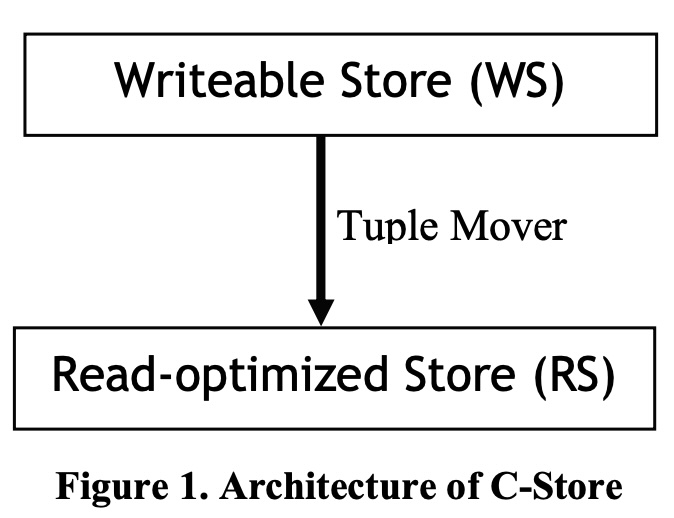
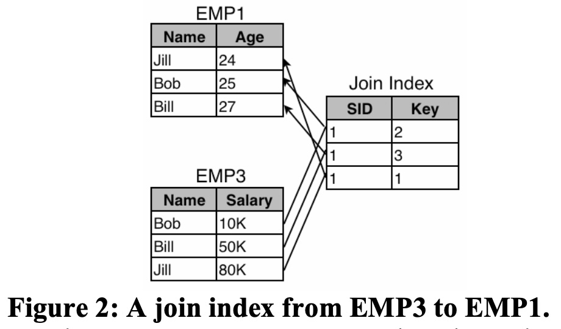
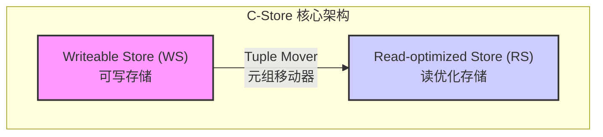
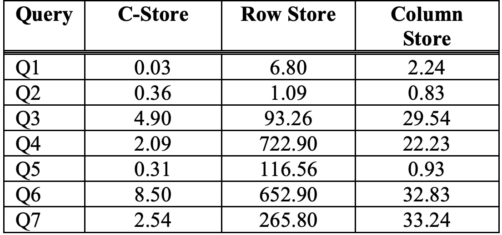
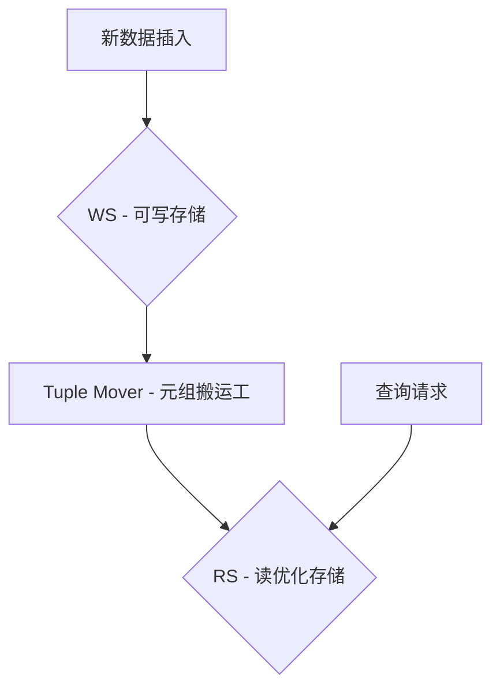

## AI论文解读 | C-Store: A Column-oriented DBMS
        
### 作者        
digoal        
        
### 日期        
2025-09-07        
        
### 标签        
PostgreSQL , PolarDB , DuckDB , AI , 论文解读        
        
----        
        
## 背景  
      
https://people.csail.mit.edu/tdanford/6830papers/stonebraker-cstore.pdf        
  
提示:          
```          
读懂《C-Store: A Column-oriented DBMS》这篇论文需要提前掌握哪些基础知识, 请使用中文通熟易懂的讲解这些基础知识, 可以引用论文中的图、表或使用Markdown支持的图形(text,mermaid等)增加解释性. 
  
使用中文通熟易懂的解读《C-Store: A Column-oriented DBMS》这篇论文, 其中的关键内容请着重讲解, 可以引用论文中的图、表或使用Markdown支持的图形(text,mermaid等)增加解释性. 
  
提取《C-Store: A Column-oriented DBMS》这篇论文中的重要术语, 使用中文对这些术语进行通熟易懂的讲解, 可以引用论文中的图、表或使用Markdown支持的图形(text,mermaid等)增加解释性. 
```     
  
## 1 前置知识 
  
这篇名为《C-Store: A Column-oriented DBMS》的论文介绍了 C-Store 这一面向读优化的关系型数据库管理系统（DBMS）的设计。要读懂这篇论文，您需要提前掌握以下几个核心基础知识。

### 1\. 关系型数据库基础知识

  * **行存储（Row Store） vs. 列存储（Column Store）：** 传统的关系型数据库（如大多数主流商业数据库）采用**行存储**架构，即同一条记录的所有字段（属性）连续存储在一起 。这种架构非常适合在线事务处理（OLTP）应用，因为它能高效地进行数据写入和更新 。
  * 相比之下，**列存储**是将每个列的所有值连续存储在一起 。这种架构特别适用于**面向读优化**的场景，比如数据仓库和分析查询，因为查询通常只需要读取少数几个列，而列存储可以避免加载无关的列数据，从而节省磁盘I/O 。

### 2\. 数据压缩与编码

  * 论文中提到，C-Store 充分利用 CPU 周期来换取磁盘带宽，其中一个主要方式就是对数据进行**编码和压缩** 。
  * **密集打包（Densepacking）：** 列存储天生就适合进行密集打包，比如将 N 个 K 位长的值打包成 N\*K 位，从而节省存储空间 。
  * **编码方案：** 论文提到了四种针对不同场景（列是否有序、值唯一性高低）的编码方案 ：
      * **Type 1（自排序，少数不同值）：** 适用于数据本身已排序且不同值较少的列，采用三元组 (v, f, n) 进行编码，表示值 v 在位置 f 开始出现，共重复 n 次 。
      * **Type 2（非自排序，少数不同值）：** 适用于非自排序但不同值较少的列，采用 (v, b) 键值对，其中 b 是一个位图，用来标记值 v 出现的位置 。
      * **Type 3（自排序，多数不同值）：** 适用于数据本身已排序但不同值较多的列，采用增量编码，即将每个值表示为与前一个值的差值 。

### 3\. C-Store 架构特有概念

  * **投影（Projections）：** C-Store 不直接存储物理表，而是存储**投影**。一个投影是基于一个逻辑表，包含一个或多个列的集合，并且以一个或多个列作为排序键进行存储 。同一列可以存在于多个投影中，并以不同的排序键进行排序 。
  * **WS 和 RS 混合架构：** 这是论文的核心创新之一 。
      * **WS (Writeable Store) - 可写存储：** 一个小型的、为频繁插入和更新优化的组件 。它使用 B-tree 等数据结构来支持高效的事务操作 。
      * **RS (Read-optimized Store) - 读优化存储：** 一个大型的、为查询性能优化的组件 。
      * **Tuple Mover（元组搬运工）：** 负责将 WS 中的记录批量移动到 RS 中 。
      * 这个混合架构解决了列存储在更新操作上的难题，平衡了读写性能。您可以通过图1来直观理解这一架构。   
        ```mermaid
        graph TD
            subgraph C-Store Architecture
                WS[Writeable Store]
                RS[Read-optimized Store]
                TM(Tuple Mover)
                WS --> TM
                TM --> RS
            end
        ```
  * **存储键（Storage Keys）和连接索引（Join Indexes）：** C-Store 需要能够从多个投影中重建完整的行记录 。
      * **存储键（SK）：** 在同一分段中，具有相同存储键的值属于同一逻辑行 。在 RS 中，存储键是隐式存在的（就是记录的物理序号）；在 WS 中，存储键是显式存储的 。
      * **连接索引（Join Index）：** 这是一个特殊的索引，用于连接不同投影中的分段 。它可以将一个投影的排序顺序映射到另一个投影的排序顺序，从而实现高效的行重建 。论文中图2展示了一个例子。   

### 4\. 事务与并发控制

  * **快照隔离（Snapshot Isolation）：** 为了避免大查询（读操作）和小的更新事务之间产生大量的锁冲突，C-Store 对只读查询采用了快照隔离 。这意味着只读查询可以访问数据库在某个历史时间点的数据，而不需要加锁 。
  * **高可用性（K-Safety）：** C-Store 支持将冗余数据（即重叠的投影）存储在不同的节点上，以提供 K-Safety，即在丢失 K 个节点的情况下仍能重建所有数据 。

希望这些基础知识能帮助您更好地理解这篇论文。
  
## 2 解读论文 
  
好的，我们来通俗易懂地解读这篇数据库领域的经典论文——《C-Store: A Column-oriented DBMS》。这篇论文由数据库界的传奇人物 Michael Stonebraker 及其团队于2005年发表，它提出的许多思想深刻地影响了后续的分析型数据库系统（如 Vertica、ClickHouse 等）。

### 核心思想：为什么需要 C-Store？

想象一下我们有两种常见的数据库使用场景：

1.  **在线交易处理 (OLTP)**：比如电商下单、银行转账。这类操作的特点是“写”操作频繁，每次操作只涉及少量数据（一行或几行）。
2.  **数据仓库/分析 (Data Warehousing/Analytics)**：比如分析过去一年所有商品的销售总额、某个区域用户的平均年龄等。这类操作的特点是“读”操作占绝大多数，每次查询需要扫描海量数据，但往往只关心其中的某几列。

传统的数据库（如 MySQL, Oracle）是为第一种场景设计的，它们被称为“**行存储 (Row Store)**”或“**写优化 (Write-optimized)**”系统。数据在磁盘上是一行一行连续存放的，这样写入一整条记录非常快。

然而，用行存储数据库来做数据分析，效率很低。比如，要计算所有用户（一亿人）的平均年龄，数据库不得不把包含姓名、地址、电话、注册时间等所有列的数据都从磁盘读入内存，而实际上我们只需要“年龄”这一列。这就造成了巨大的 I/O 浪费。

C-Store 的诞生就是为了解决这个问题。它专门为数据分析这类“**读密集 (Read-mostly)**”场景设计，是一种“**列存储 (Column Store)**”或“**读优化 (Read-optimized)**”的数据库 。

### C-Store 的关键设计与创新

C-Store 的设计中有几个非常核心的创新点，我们逐一来看。

#### 1\. 混合架构：巧妙地平衡读和写

列存储系统虽然读取性能超群，但写入和更新数据却很麻烦。因为数据是按列压缩并排序存储的，插入一条新记录可能意味着要重写多个巨大的列文件。

为了解决这个矛盾，C-Store 设计了一个巧妙的混合架构 ，包含三个关键部分：



  * **可写存储 (Writeable Store - WS)**：这是一个小型的、面向写入优化的存储区域 。所有新的数据插入（`INSERT`）和更新（`UPDATE`）都先进入 WS。WS 的结构相对传统，支持高效的写入 。
  * **读优化存储 (Read-optimized Store - RS)**：这是数据库的主体，一个巨大的、为读取优化的列式存储区域 。RS 中的数据是高度压缩和排序的，专门用于快速查询。
  * **元组移动器 (Tuple Mover)**：这是一个后台进程，它的任务是定期地将 WS 中积累的数据批量合并（`merge`）到 RS 中 。这个过程类似于数据整理，将零散的新数据高效地整合到主体数据中。

**一句话总结**：通过这种架构，C-Store 将频繁的写入操作限制在小范围的 WS 中，保证了写入性能；同时，绝大多数的查询都在经过优化的 RS 上执行，保证了读取性能。查询时会同时访问 WS 和 RS，确保能看到最新的数据 。

#### 2\. 物理数据模型：用“投影 (Projections)”替代“表 (Tables)”

在传统数据库中，物理存储的就是一张张完整的表。而 C-Store 认为，为了查询，我们并不总是需要整张表。因此，它引入了“**投影 (Projection)**”的概念 。

一个投影是表中的一个或多个列的子集，并且可以按照不同的列进行排序 。同一个列可以存在于多个不同的投影中，每个投影的排序方式都不同 。

**举个例子**：假设我们有一张员工表 `EMP(name, age, salary, dept)`。

在 C-Store 中，我们可以不存储完整的 `EMP` 表，而是存储以下几个投影 ：

  * `EMP1(name, age)`，按 `age` 排序
  * `EMP3(name, salary)`，按 `salary` 排序

**这样做的好处是什么？**

  * 如果查询是 `SELECT name FROM EMP WHERE age > 25`，C-Store 可以选择 `EMP1` 这个投影。因为它只包含 `name` 和 `age` 两列，并且已经按 `age` 排序，查询会非常快。
  * 如果查询是 `SELECT name FROM EMP ORDER BY salary DESC`，C-Store 则会选择 `EMP3` 投影。

通过创建多个不同排序的、只包含必要列的投影，C-Store 可以为各种查询提供最优的数据布局，避免读取无关列，并利用预排序的优势 。

#### 3\. 如何重构完整数据？连接索引 (Join Indexes)

既然数据被拆分到不同的投影里，那如何复原出一条完整的员工记录呢？C-Store 使用了“**连接索引 (Join Index)**” 。

连接索引的本质是一个映射表，它记录了一个投影中的记录对应到另一个投影中记录的位置 。

下面的图（源自论文 Figure 2）清晰地展示了这一点：它建立了一个从 `EMP3` 到 `EMP1` 的连接索引。`EMP3` 的第一行 `(Bob, 10K)` 对应 `EMP1` 的第二行 `(Bob, 25)`，所以索引的第一行记录的 `Key` 就是 2 。 

  

> **图解**：连接索引 `Join Index` 将投影 `EMP3` 中的每一行映射到 `EMP1` 中对应的行。

通过连接索引链，C-Store 可以在需要时，从分散的投影中准确、快速地重构出任何一条完整的逻辑记录。

#### 4\. 极致的性能优化：压缩与列式执行

C-Store 为了将读取性能推到极致，采取了两大策略：

1.  **重度压缩 (Heavy Compression)**：列存储天然适合压缩。因为同一列的数据类型相同，内容相似（比如“年龄”列都是数字，“国家”列只有几百个重复值），压缩率非常高。C-Store 提供了4种不同的编码方案，根据列的数据特点（如是否有序、唯一值多少）选择最优的压缩算法 。
2.  **在压缩数据上直接计算**：更厉害的是，C-Store 的查询执行器被设计为可以直接在压缩的数据上进行计算，而无需先解压 。例如，对一个经过编码的列做 `COUNT(*)` 操作，可以直接利用编码信息计算，速度极快。这大大减少了 CPU 的解压开销和内存占用 。

#### 5\. 事务处理：快照隔离 (Snapshot Isolation)

在读密集的系统中，传统的锁机制会是性能噩梦。一个需要扫描全表的大查询可能会锁住大量数据，阻塞所有写入操作。

C-Store 采用“**快照隔离 (Snapshot Isolation)**”来避免这个问题 。

  * 它通过 **时间戳 (Timestamp)** 来管理数据版本。系统维护一个“**高水位线 (High Water Mark - HWM)**”，这是一个时间点，在此之前的事务都已提交 。
  * 只读查询在 HWM 之前的某个时间点快照上运行，看到的是那一刻完全一致的数据，因此不需要加任何锁，不会和写入操作发生冲突 。
  * 更新操作被分解为一个 `INSERT` 和一个 `DELETE` 标记，而不是原地修改，从而保留了历史版本，为快照隔离提供了支持 。

这种机制确保了长时间运行的分析查询和短时间的更新事务可以互不干扰地并行执行。

### 惊人的性能表现

论文最后展示了 C-Store 与当时流行的商业行存储和列存储数据库的性能对比。测试基于简化的 TPC-H 基准，结果令人印象深刻。   

**在空间受限的情况下 (2.7 GB 预算)**：

| 查询 | C-Store (秒) | 商业行存储 (秒) | 商业列存储 (秒) |
| :--- | :--- | :--- | :--- |
| **Q1** | 0.03 | 6.80 | 2.24 |
| **Q2** | 0.36 | 1.09 | 0.83 |
| **Q3** | 4.90 | 93.26 | 29.54 |
| **Q4** | 2.09 | 722.90 | 22.23 |
| **Q5** | 0.31 | 116.56 | 0.93 |
| **Q6** | 8.50 | 652.90 | 32.83 |
| **Q7** | 2.54 | 265.80 | 33.24 |

*数据来源: 论文中的表格*

从表中可以看出，C-Store 的性能**远超**另外两个商业系统，平均比行存储快 **164 倍**，比列存储快 **21 倍** 。

**为什么 C-Store 这么快？**

  * **列式表示**：避免读取无用属性 。
  * **重叠投影**：可以为不同的查询提供最优的列排序 。
  * **更好的压缩**：在相同空间内可以存储更多冗余的、不同排序的投影 。
  * **在压缩数据上执行**：大大减少了 I/O 和 CPU 开销 。

### 总结

《C-Store》这篇论文是一份开创性的工作，它并非发明了单一的技术，而是**创新性地将列存储、数据压缩、物化视图（投影）、快照隔离以及混合读写架构等思想组合在一起** ，构建了一个逻辑自洽且性能卓越的系统。它证明了为特定场景（读密集型分析）设计的数据库架构，其性能可以远远超越“一刀切”的通用系统。C-Store 的思想后来成功商业化为 Vertica 数据库，并启发了无数现代分析型数据库的设计。
  
## 3 术语 
  
好的，我为您整理并解释了《C-Store: A Column-oriented DBMS》这篇论文中的一些重要术语，希望可以帮助您更好地理解这篇论文的核心思想。

### 1\. 投影（Projection）

  * **简单理解：** 投影不是我们传统意义上的“表”。它是一个或多个列的集合，这些列是按照一个或多个排序键（sorting key）进行物理存储的。
  * **为什么用它：** 传统的数据库存储的是行（row），而C-Store存储的是投影。这样做的最大好处是，当一个查询只需要用到少数几个列时，数据库只需要读取包含这些列的投影，而不需要加载整个行，大大减少了I/O操作。
  * **举例：** 假设一个`Sales`表有`ProductID`, `Region`, `Date`, `Revenue`等列。你可以创建一个投影，只包含`Region`和`Revenue`，并按`Region`进行排序。当你想查询每个区域的总收入时，数据库只需要读取这个小投影，而不需要扫描整个大表。

-----

### 2\. WS（Writable Store）和 RS（Read-optimized Store）

  * **WS（可写存储）：** 这是一个为频繁插入和更新操作设计的小型存储区。可以把它想象成一个“临时缓冲区”，所有新的数据和更新首先都落在这里。WS通常使用 B-tree 或类似的索引结构，以支持快速的事务处理。
  * **RS（读优化存储）：** 这是一个大型的、为查询性能优化的存储区。WS 中的数据会定期、批量地移动到 RS 中。RS 中的数据通常经过高度压缩和编码，并且是以列式方式存储的，非常适合进行大规模的分析查询。
  * **为什么要分开：** 这种双存储架构解决了列存储在处理频繁写入时性能不佳的问题。它将读写操作分离，让RS专心处理读查询，而WS专心处理写操作，从而实现了 **“读写分离”** ，但比简单的读写分离架构更复杂和高效。




-----

### 3\. 元组搬运工（Tuple Mover）

  * **简单理解：** 它是一个后台进程，负责将WS中累积的数据定期批量地转移到RS中。
  * **作用：** 这个“搬运”过程不仅仅是简单的移动，还会对数据进行排序、编码和压缩，使其以最高效的方式存储在RS中，从而为后续的分析查询做准备。

-----

### 4\. 存储键（Storage Keys）

  * **简单理解：** 存储键是一个逻辑上的标识符，用来将不同投影中的数据联系起来，以便在查询时重建完整的行。
  * **如何工作：** 在WS中，存储键是显式存在的；在RS中，存储键是隐式存在的，通常就是记录的物理序号。当需要从多个投影中读取数据并拼接成一行时，数据库会利用存储键来匹配和对齐来自不同投影的数据。

-----

### 5\. K-Safety

  * **简单理解：** 这是一种高可用性保障机制，确保系统在丢失最多K个节点的情况下，仍然可以正常运行，并且所有数据都能被恢复。
  * **如何实现：** 在C-Store中，实现K-Safety的方式是通过冗余存储。例如，将同一个表的几个不同投影分别存储在不同的节点上，如果某个节点故障，其上的数据可以通过其他节点的投影重建。这比简单的全数据备份更高效，因为它只备份了“一部分”的数据，但通过巧妙的设计实现了数据的完整性保障。

-----

### 6\. 快照隔离（Snapshot Isolation）

  * **简单理解：** 这是一种事务隔离级别，旨在解决长时间运行的只读查询（如分析查询）与频繁的更新事务之间的冲突。
  * **如何工作：** 当一个只读查询开始时，它会获得一个数据库的 **“快照”** 。这意味着，无论在其查询过程中数据库发生了多少更新，它看到的数据都是开始查询那一刻的状态。这样，只读查询就不需要和更新事务争抢锁，大大提高了并发性能。
  
## 参考        
         
https://people.csail.mit.edu/tdanford/6830papers/stonebraker-cstore.pdf    
        
<b> 以上内容基于DeepSeek、Qwen、Gemini及诸多AI生成, 轻微人工调整, 感谢杭州深度求索人工智能、阿里云、Google等公司. </b>        
        
<b> AI 生成的内容请自行辨别正确性, 当然也多了些许踩坑的乐趣, 毕竟冒险是每个男人的天性.  </b>        
  
  
#### [期望 PostgreSQL|开源PolarDB 增加什么功能?](https://github.com/digoal/blog/issues/76 "269ac3d1c492e938c0191101c7238216")
  
  
#### [PolarDB 开源数据库](https://openpolardb.com/home "57258f76c37864c6e6d23383d05714ea")
  
  
#### [PolarDB 学习图谱](https://www.aliyun.com/database/openpolardb/activity "8642f60e04ed0c814bf9cb9677976bd4")
  
  
#### [PostgreSQL 解决方案集合](../201706/20170601_02.md "40cff096e9ed7122c512b35d8561d9c8")
  
  
#### [德哥 / digoal's Github - 公益是一辈子的事.](https://github.com/digoal/blog/blob/master/README.md "22709685feb7cab07d30f30387f0a9ae")
  
  
#### [About 德哥](https://github.com/digoal/blog/blob/master/me/readme.md "a37735981e7704886ffd590565582dd0")
  
  

  
