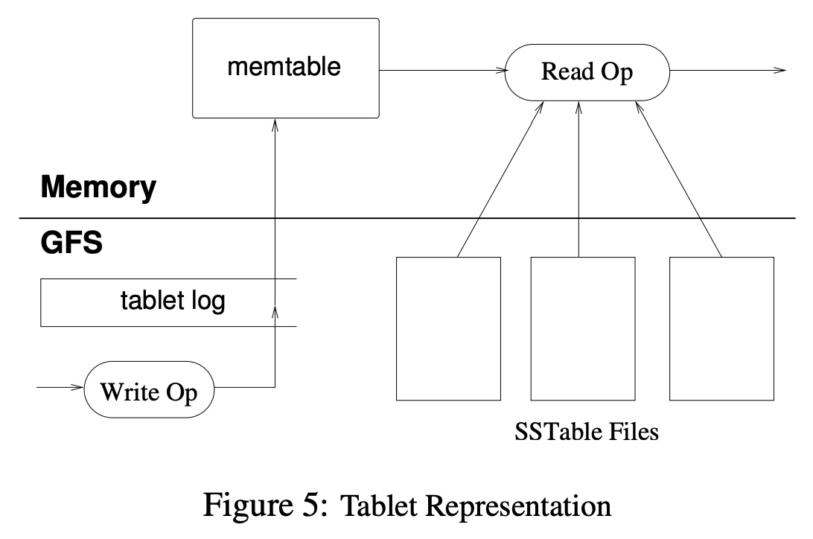

## AI论文解读 | Bigtable: A Distributed Storage System for Structured Data
        
### 作者        
digoal        
        
### 日期        
2025-09-07        
        
### 标签        
PostgreSQL , PolarDB , DuckDB , AI , 论文解读        
        
----        
        
## 背景  
      
https://classpages.cselabs.umn.edu/Spring-2018/csci8980/Papers/FileSystems/Bigtable%20Google.pdf        
  
提示:          
```          
读懂《Bigtable: A Distributed Storage System for Structured Data》这篇论文需要提前掌握哪些基础知识, 请使用中文通熟易懂的讲解这些基础知识, 可以引用论文中的图、表或使用Markdown支持的图形(text,mermaid等)增加解释性. 
  
使用中文通熟易懂的解读《Bigtable: A Distributed Storage System for Structured Data》这篇论文, 其中的关键内容请着重讲解, 可以引用论文中的图、表或使用Markdown支持的图形(text,mermaid等)增加解释性. 
  
提取《Bigtable: A Distributed Storage System for Structured Data》这篇论文中的重要术语, 使用中文对这些术语进行通熟易懂的讲解, 可以引用论文中的图、表或使用Markdown支持的图形(text,mermaid等)增加解释性. 
```     
  
## 1 前置知识 
  
要读懂《Bigtable: A Distributed Storage System for Structured Data》这篇论文，您需要提前掌握以下几个核心基础知识，这些知识是理解Bigtable设计思想和工作原理的关键。

### 1\. 分布式系统基础

Bigtable是一个**分布式**存储系统 。这意味着它的数据和计算能力不是集中在一台机器上，而是分散在成千上万台普通的服务器上 。因此，理解分布式系统的基本概念是必不可少的，例如：

  * **可扩展性（Scalability）**：系统如何通过增加机器来处理更多的数据和请求。
  * **容错性（Fault Tolerance）**：当部分机器或网络发生故障时，系统如何继续正常工作。
  * **一致性（Consistency）**：在分布式环境中，如何保证数据的读写操作保持一致。

-----

### 2\. NoSQL与数据模型

Bigtable的**数据模型**是理解这篇论文最重要的部分 。它不同于传统关系型数据库（如MySQL），不采用完整的关系数据模型 。相反，它是一种**稀疏的、分布式的、持久化的多维度排序映射** 。这个“映射”由以下三个维度索引：

  * **行键（Row Key）**：任意的字符串，用于唯一标识一行数据 。Bigtable按照行键的字典顺序存储数据 ，这使得行键设计对数据访问的局部性（Locality）至关重要。
  * **列键（Column Key）**：由 **列族（Column Family）** 和 **限定符（Qualifier）** 组成 。列族是访问控制和数据存储的最小单位 。同一列族中的数据通常是同类型的，并且会一起被压缩 。
  * **时间戳（Timestamp）**：64位整数，用于区分同一单元格（Cell）的不同版本 。

您可以通过论文中的图1来直观理解这个数据模型 。   

### 3\. Bigtable的底层技术栈

Bigtable不是凭空构建的，它依赖于Google内部已有的几项关键技术 。了解这些技术能帮助您更好地理解Bigtable的设计决策：

  * **Google文件系统 (GFS)**：一个**分布式文件系统**，Bigtable用它来存储所有的数据文件和日志文件 。
  * **SSTable (Sorted String Table)**：一种内部文件格式，它提供了从键到值的持久化、有序的**不可变**映射 。SSTable的设计非常高效，支持快速查找和范围扫描 。
  * **Chubby**：一个高度可用的**分布式锁服务** 。Bigtable利用Chubby来管理集群中的主服务器选举、Tablet服务器的发现和故障处理、以及存储元数据（如表结构） 。

-----

### 4\. 存储和读写原理

论文详细描述了Bigtable如何存储和处理数据，其中几个关键概念是理解其性能优化的基础：

  * **Tablet**：Bigtable中数据分布和负载均衡的基本单元 。一个表的数据被动态地划分为多个`tablet` 。
  * **Tablet 位置层级**：为了高效地查找`tablet`，Bigtable采用了一种类似于**B+树**的三层级结构来存储`tablet`的位置信息 。

  * **Memtable与SSTable**：这是Bigtable读写和数据存储的核心。新写入的数据首先被写入**提交日志（commit log）**，然后存放在内存中的**Memtable**（一个有序的缓冲区） 。当Memtable达到一定大小时，会被冻结并转换为一个**SSTable**文件并写入GFS 。读取操作会合并Memtable和SSTable中的数据来提供视图 。
  * **Compaction**：Bigtable会定期进行**压缩**操作 。这个过程会读取多个SSTable和Memtable，然后将它们合并成一个新的SSTable 。这有助于减少SSTable的数量，提高读取效率，并回收被删除数据所占用的空间 。

  
## 2 解读论文 
  
好的，我们来一起深入解读这篇开创性的论文——《Bigtable: A Distributed Storage System for Structured Data》。这篇论文是理解现代NoSQL数据库和大规模分布式存储系统设计的基石。

我将用通俗易懂的方式，为你剖析其核心思想、关键设计和深远影响。

-----

### 论文速览：Bigtable是什么？

简单来说，Bigtable是Google设计的一个用于**管理超大规模结构化数据**的分布式存储系统。想象一下，你需要存储整个互联网的网页、所有用户的搜索历史或者全球的卫星图像，数据量达到PB级别（1 PB = 1024 TB），并且要部署在上千台普通服务器上。传统的关系型数据库（如MySQL）在这种规模下会力不从心，而Bigtable正是为解决这类问题而生。

**核心目标**：实现极高的**可扩展性 (Scalability)**、**性能 (Performance)** 和 **可用性 (Availability)** 。

它被广泛应用于Google内部的六十多个产品，包括网页索引、Google Analytics、Google Earth和个性化搜索等 。

-----

### 1\. 核心基石：独特的数据模型

这是理解Bigtable的第一个关键，也是它与传统数据库最大的区别。论文将Bigtable的数据模型定义为：**一个稀疏、分布式、持久化的多维排序映射 (a sparse, distributed, persistent multi-dimensional sorted map)** 。

听起来很复杂？我们把它拆解成一个公式就清晰了：

$$(row:string, column:string, time:int64) \rightarrow string$$

这个公式意味着，每一个数据值（value）都是通过 **“行键 + 列键 + 时间戳”** 这三个维度来唯一确定的。值本身是一个未经解释的字节数组（字符串）。

让我们逐一解析这几个维度：

#### a. 行键 (Row Key)

  * **唯一索引**：行键是表中每行的唯一标识符，类似于关系数据库中的主键。
  * **排序存储**：这是Bigtable**最重要**的特性之一。所有数据都**按照行键的字典序（lexicographical order）排序**存储 。这个特性带来了巨大的好处：通过精心设计行键，可以将相关的数据存储在一起，从而极大地提高范围扫描（scan）的效率。
  * **应用案例**：论文中的`Webtable`（网页表）就是一个绝佳例子。为了让同一个网站的页面存储在一起，他们将URL反转作为行键。例如，`maps.google.com/index.html` 的行键是 `com.google.maps/index.html` 。这样，一次扫描就能高效地读取`google.com`域下的所有页面。

#### b. 列 (Column)

Bigtable的列设计非常灵活，它引入了**列族 (Column Family)** 的概念。

  * **列族 (Column Family)**：
      * 列的集合，是**访问控制和数据压缩的基本单位** 。
      * 在创建表时需要预先定义，且数量不宜过多（通常最多几百个）。
      * 同一列族下的数据通常类型相同，会被一起压缩存储。
  * **列限定符 (Column Qualifier)**：
      * 列族内部的具体列名。例如，`anchor`（锚文本）是一个列族，`anchor:cnnsi.com` 就是一个具体的列，其中 `cnnsi.com` 是限定符 。
      * 一个表可以有**无限数量**的列，可以随时向任何列族中添加新的限定符，无需预先定义 。

这种设计使得Bigtable的表是 **“稀疏”** 的。你不必为每一行都定义所有的列，某一行可以只有几列，而另一行可以有成千上万列，极大地节省了存储空间。

#### c. 时间戳 (Timestamp)

  * **数据版本控制**：Bigtable天然支持多版本数据。每个单元格（cell）可以存储同一份数据的多个版本，通过64位的时间戳来区分 。
  * **自动垃圾回收**：可以为每个列族设置垃圾回收策略，例如“只保留最近的N个版本”或“只保留最近7天内的数据” 。

#### 图解数据模型

论文中的**图1**完美地展示了这个模型：   

> **图1 解读**:
>
>   * **行键**: `com.cnn.www` (反转后的URL)。
>   * **列族**: `contents` (存储网页内容) 和 `anchor` (存储链接到该页面的锚文本)。
>   * **列 (列族:限定符)**: `contents:` (没有限定符)，`anchor:cnnsi.com`，`anchor:my.look.ca`。
>   * **时间戳**: `contents` 列有三个版本的数据，分别在时间戳 $t\_3$, $t\_5$, $t\_6$ 存入。`anchor` 列只有一个版本。

-----

### 2\. 宏观设计：系统架构

Bigtable的架构由三个主要部分组成 ：

1.  **客户端库 (Client Library)**：链接到每个客户端程序中，负责与Tablet服务器直接通信。
2.  **一个主服务器 (Master Server)**：
      * **核心职责**：为Tablet服务器分配Tablet、检测服务器的加入和故障、进行负载均衡、以及执行垃圾回收和模式修改（如创建表和列族）。
      * **关键点**：Master**不参与数据读写**。客户端直接与Tablet服务器通信，这使得Master的负载非常轻，避免了单点瓶颈 。
3.  **许多Tablet服务器 (Tablet Server)**：
      * **核心职责**：管理一组Tablet，处理对其的读写请求，并在Tablet过大时进行分裂 。
      * Tablet服务器可以动态地加入或移除集群，以适应工作负载的变化 。

这个架构可以用下面的Mermaid图来表示：


#### a. 底层依赖 (Building Blocks)

Bigtable并非凭空构建，它站在了Google其他几个强大基础设施的肩膀上：

  * **Google文件系统 (GFS)**：用于存储日志和数据文件（SSTable）。
  * **SSTable文件格式**：一种持久化、有序、不可变的键值对映射文件格式，是Bigtable数据存储的基础 。
  * **Chubby分布式锁服务**：用于确保任何时候只有一个活跃的Master、存储表的模式信息、发现Tablet服务器以及存储访问控制列表等关键元数据 。

#### b. Tablet：数据的分片与管理

一个表在水平方向上（按行键）被分割成若干个**Tablet**。每个Tablet包含一个连续的行键范围，是数据**分布和负载均衡的基本单位** 。当一个Tablet增长到一定大小（如100-200MB）时，它会自动分裂成两个更小的Tablet 。

-----

### 3\. 核心机制：数据如何读写与维护？

#### a. Tablet的定位 (Tablet Location)

客户端如何找到存储特定行的Tablet服务器？Bigtable采用了一种类似B+树的三层结构来定位Tablet 。

  

> **图4 解读**:
> 1.  **第一层**：Chubby中的一个文件，记录了**根Tablet (Root Tablet)** 的位置 。
> 2.  **第二层**：根Tablet是`METADATA`表的第一个Tablet。它包含了`METADATA`表中所有其他Tablet的位置信息 。
> 3.  **第三层**：`METADATA`表的每个Tablet，记录了一组**用户数据Tablet (User Tablets)** 的位置 。

客户端库会缓存Tablet的位置信息。如果缓存失效，它会沿着这个层级结构向上查找 。

#### b. Tablet的读写与存储 (Tablet Serving)

这是论文**图5**所描绘的核心流程。

  

> **图5 解读**:
> \* **写操作 (Write Op)** ：
> 1.  首先，将写操作记录追加到**提交日志 (commit log)** 中，该日志存储在GFS上，用于持久化和恢复 。
> 2.  然后，将数据写入内存中的一个有序数据结构——**Memtable** 。
> \* **读操作 (Read Op)** ：
> \* 读请求需要查询一个合并后的视图，这个视图包含了内存中的**Memtable**和持久化在GFS上的多个**SSTable**文件 。

#### c. Compaction机制：数据的整理与回收

随着写操作的进行，Memtable会变大，SSTable文件会增多。为了控制内存使用和SSTable文件数量，Bigtable引入了Compaction（压缩/合并）机制。

  * **Minor Compaction (次级压缩)**：当Memtable大小达到阈值时，它会被“冻结”，转换成一个新的SSTable文件，并写入GFS 。这个过程可以减少内存占用和服务器故障后的恢复时间 。
  * **Major Compaction (主压缩)**：定期将一个Tablet下的**所有SSTable**和Memtable合并，重写成一个全新的SSTable 。这个过程有两个重要作用：
    1.  彻底删除那些被标记为删除的数据，回收存储空间 。
    2.  减少SSTable文件数量，优化读取性能 。

-----

### 4\. 性能优化 (Refinements)

为了达到极致性能，Bigtable采用了一系列精巧的优化手段：

  * **局部性群组 (Locality Groups)**：允许客户端将多个列族组合在一起。每个局部性群组的数据会单独生成一个SSTable 。这样，如果不常一起访问的列族被分开存储，读取时就不需要扫描无关数据，大大提高效率 。
  * **压缩 (Compression)**：可以为每个局部性群组配置压缩算法。论文提到了一种效果很好的两遍压缩方案，对于Webtable中的网页内容，压缩比高达10:1 。
  * **缓存 (Caching)**：Tablet服务器使用两级缓存。**Scan Cache**缓存键值对，**Block Cache**缓存从GFS读取的SSTable块 。
  * **布隆过滤器 (Bloom Filters)**：通过创建布隆过滤器，可以快速判断一个SSTable文件**是否可能包含**某个特定的行/列数据。这能极大地减少不必要的磁盘访问，特别是对于查找不存在的数据的场景 。
  * **SSTable的不可变性 (Immutability)**：SSTable一旦生成就不会被修改。这个简单的设计带来了许多好处：
      * **简化缓存**：无需担心缓存的数据失效。
      * **简化并发**：读写可以并行，因为读操作永远不会修改数据。
      * **快速Tablet分裂**：子Tablet可以直接共享父Tablet的SSTable文件，无需重写数据 。

-----

### 5\. 性能与实践

论文通过实验展示了Bigtable惊人的线性扩展能力。从**图6**可以看出，随着Tablet服务器数量从1台增加到500台，系统的总吞吐量几乎成比例增长，证明了其架构的优越性。

  

> **图6 解读**:
>
>   * 该图展示了不同操作（随机读写、顺序读写、扫描）在不同服务器规模下的总吞吐量。
>   * **随机写**和**顺序写**性能很好，因为它们都是高效地追加到日志中。
>     \* **随机读**性能最差（如果数据不在内存），因为它需要从GFS读取一个64KB的数据块，而可能只用了其中的一小部分数据 。
>   * **顺序读**和**扫描**性能很好，因为可以有效利用缓存。
>   * **从内存中随机读**（`random reads (mem)`）性能极佳，说明瓶颈主要在磁盘I/O。
>     \* 最重要的结论是，随着服务器数量增加，**总吞吐量（图右）大幅提升**，证明了系统的可扩展性 。

-----

### 6\. 经验与教训 (Lessons)

论文最后总结了构建和维护Bigtable过程中学到的宝贵经验：

1.  **简单设计是王道 (value of simple designs)**：复杂的系统难以维护和调试。他们曾设计了一个复杂的Tablet服务器成员协议，最终因过于复杂而废弃，回归到了一个更简单的、依赖Chubby常用功能的协议上 。
2.  **延迟添加功能 (delay adding new features)**：在不清楚真实需求前，不要急于实现复杂功能。例如，他们最初计划支持通用的跨行事务，但发现绝大多数应用只需要单行事务，于是就没有实现前者，避免了不必要的复杂性 。
3.  **系统级监控至关重要**：强大的监控和追踪系统是发现和修复问题的关键。

### 总结

《Bigtable》这篇论文不仅介绍了一个强大的分布式存储系统，更重要的是，它提出的一系列设计理念和架构模式（如数据模型、日志+内存表+持久化文件、compaction机制、不可变数据结构等）对后来的分布式系统产生了深远的影响。HBase、Cassandra、LevelDB/RocksDB等众多知名项目都或多或少地借鉴了Bigtable的思想。

通过理解Bigtable，我们能够更好地把握现代大规模数据系统设计的精髓。
  
## 3 术语 
  
从《Bigtable: A Distributed Storage System for Structured Data》这篇论文中，可以提取出以下几个重要的术语：

-----

### 1\. Bigtable

一个**稀疏的、分布式的、持久化的多维度排序映射**。你可以把它想象成一个巨大的表格，这个表格可以存储非常多的数据，并且能分散在很多台机器上。

### 2\. Tablet

**Tablet**是Bigtable中数据分片的基本单元。Bigtable会将一个大表的数据按照行键（Row Key）的范围划分为多个**Tablet**。每个**Tablet**就像表格中的一个子集，通常包含100-200MB的数据。这些**Tablet**被分配到不同的服务器（称为Tablet服务器）上，以实现负载均衡和可扩展性。

### 3\. Row Key (行键)

用于唯一标识Bigtable中每一行数据。论文中提到，行键可以是任意的字符串，并且Bigtable会按照行键的字典顺序存储数据。这意味着如果你设计的行键是有序的，比如`com.google.www`, `com.google.maps`, `com.google.mail`，那么它们在物理存储上会彼此靠近，这对于范围扫描（range scan）操作非常高效。

### 4\. Column Family (列族)

**列族**是Bigtable中访问控制和数据存储的最小单位。同一列族中的数据通常是同类型的，比如一个网页信息的表中，可以有一个`contents`列族用于存储网页内容，另一个`anchor`列族用于存储外部链接。在论文的图1中，`info`和`contents`就是两个不同的列族。列族是Bigtable灵活性的关键，因为它允许你根据需要动态地添加新的列族。   

### 5\. Timestamp (时间戳)

Bigtable中的每个数据单元都可以有多个版本。**时间戳**就是一个64位整数，用于区分同一单元格（由行键、列族和列限定符共同标识）的不同版本。这使得你可以轻松地查询数据的历史版本，比如查看某个网页在过去某个时间点的快照。

### 6\. SSTable (Sorted String Table)

**SSTable**是Bigtable用来存储不可变数据的内部文件格式。它是一种从键（Key）到值（Value）的有序映射。Bigtable中的所有数据文件都以**SSTable**的形式存储在GFS（Google文件系统）上。SSTable的设计非常高效，支持快速的键查找和范围扫描。

### 7\. Memtable

**Memtable**是Bigtable中的内存缓冲区。所有新写入的数据都会先写入到**Memtable**中。当**Memtable**的大小达到一定阈值时，它会被冻结并转换为一个**SSTable**文件。**Memtable**的存在使得写入操作可以非常快，因为大部分写入都在内存中完成，而不是直接写入到磁盘。

### 8\. Chubby

**Chubby**是Google内部的一个**分布式锁服务**。Bigtable使用**Chubby**来管理集群中的各种元数据，比如：

  * 选举主服务器。
  * 存储表和Tablet的位置信息。
  * 处理Tablet服务器的故障。

**Chubby**确保在分布式环境中，各种重要的操作和数据能够保持一致性。
  
## 参考        
         
https://classpages.cselabs.umn.edu/Spring-2018/csci8980/Papers/FileSystems/Bigtable%20Google.pdf     
        
<b> 以上内容基于DeepSeek、Qwen、Gemini及诸多AI生成, 轻微人工调整, 感谢杭州深度求索人工智能、阿里云、Google等公司. </b>        
        
<b> AI 生成的内容请自行辨别正确性, 当然也多了些许踩坑的乐趣, 毕竟冒险是每个男人的天性.  </b>        
  
