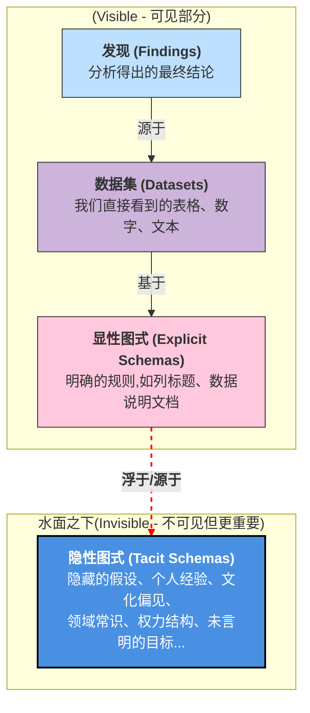
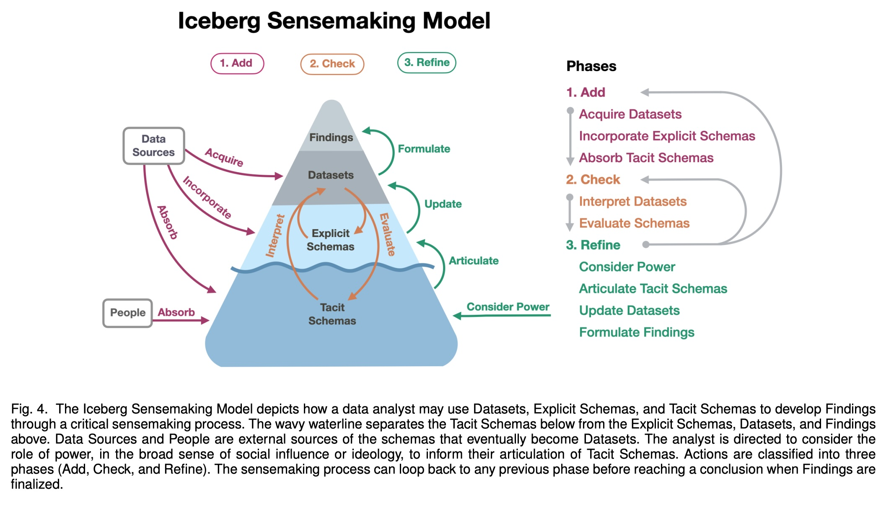
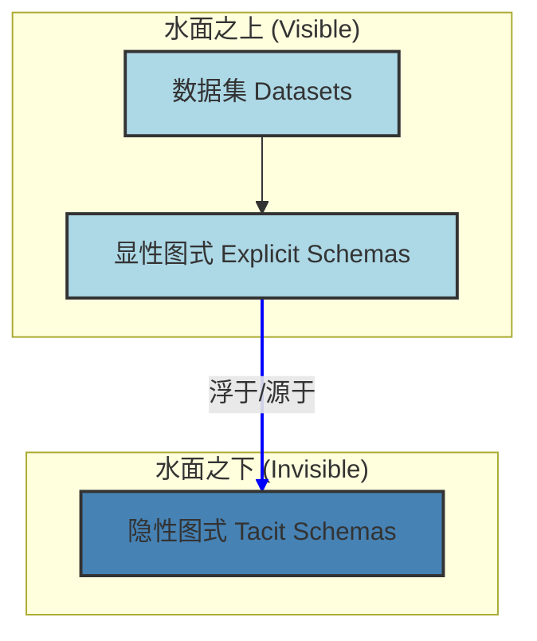

## AI论文解读 | Iceberg Sensemaking: A Process Model for Critical Data Analysis
        
### 作者        
digoal        
        
### 日期        
2025-09-07        
        
### 标签        
PostgreSQL , PolarDB , DuckDB , AI , 论文解读        
        
----        
        
## 背景  
      
https://arxiv.org/pdf/2204.04758        
  
提示:          
```          
读懂《Iceberg Sensemaking: A Process Model for Critical Data Analysis》这篇论文需要提前掌握哪些基础知识, 请使用中文通熟易懂的讲解这些基础知识, 可以引用论文中的图、表或使用Markdown支持的图形(text,mermaid等)增加解释性. 
  
使用中文通熟易懂的解读《Iceberg Sensemaking: A Process Model for Critical Data Analysis》这篇论文, 其中的关键内容请着重讲解, 可以引用论文中的图、表或使用Markdown支持的图形(text,mermaid等)增加解释性. 
  
提取《Iceberg Sensemaking: A Process Model for Critical Data Analysis》这篇论文中的重要术语, 使用中文对这些术语进行通熟易懂的讲解, 可以引用论文中的图、表或使用Markdown支持的图形(text,mermaid等)增加解释性. 
```     
  
## 1 前置知识 
  
您好！为了帮助您更好地理解《Iceberg Sensemaking: A Process Model for Critical Data Analysis》这篇论文，我将为您梳理并通俗地解释其中所需的几个核心基础知识。

---

### 1. 感知（Sensemaking）

“感知”是这篇论文的核心主题，指的是人们通过收集和分析数据来寻找新理解的过程 。这篇论文提出了一个全新的感知模型，但它建立在对过去模型的反思之上。

过去的感知模型，例如Pirolli和Card的模型 ，倾向于将数据分析视为一个相对线性的过程，其中“**模式（Schemas）**”是分析的最终结果。相比之下，这篇论文认为，**模式才是感知的起点**。

### 2. 实证主义（Positivism）与解释主义（Interpretivism）

这篇论文的核心论点是：过去的感知模型大多基于**实证主义**，而它自己则采用**解释主义**的视角来重构数据感知 。

* **实证主义**：这是一种哲学观点，认为客观真理可以通过基于经验观察的科学方法来获得 。在这种视角下，数据被视为独立于分析师个人观点和背景的客观事实 。
* **解释主义**：这是一种截然不同的观点，认为知识是通过“解释”行为创造出来的 。在解释主义者看来，你无法将数据与人类价值观、背景和实践分离开来，因为这些因素塑造了数据和知识本身 。数据分析过程中的各种复杂性，如偏见和意识形态，都是无法被消除的 。

这篇论文正是在解释主义的框架下，强调了数据分析中“背景、权力和其他纠缠”的重要性 。

### 3. 模式（Schemas）：冰山模型的核心

“**模式（Schemas）**”是这篇论文用来描述知识框架的核心概念 。这篇论文最大的贡献，就是提出了一个“**冰山（Iceberg）**”的比喻来解释模式。

这个比喻认为，**数据只是冰山露出水面的尖端**，而隐藏在水面之下的巨大冰山主体，就是决定数据意义的**模式** 。

论文将模式分为两种类型：

* **显性模式（Explicit Schemas）**：位于水面之上，是那些以人类或机器可读的方式被记录下来的模式 。例如，数据集附带的注释、元数据、列标题或数据字典 。
* **隐性模式（Tacit Schemas）**：位于水面之下，是那些未被明确记录的模式 。它可能包括数据集创建的未记录方面、数据创建者所认为的常识性领域知识，以及分析中未被考虑到的基本假设 。当你停下来审视数据集中某个被忽略的特征时，你就是在将一个隐性模式显性化 。

这篇论文强调，隐性模式会受到**权力**（power）的影响，例如社会结构、意识形态或机构权威 。它认为，只有通过批判性地审视这些隐性模式，才能揭示数据背后更深层次的偏见和问题 。

### 4. 冰山感知模型的三个阶段

该论文提出的冰山感知模型是一个包含三个主要阶段的循环过程 ：

* **Add（添加）阶段**：分析师获取数据集，并吸取其中的**显性模式**。同时，也要吸收数据本身和相关人员（如经理、同事等）的**隐性模式** 。
* **Check（检查）阶段**：分析师根据其所掌握的模式来解释数据，并评估这些模式是否与数据相符 。
* **Refine（精炼）阶段**：分析师考虑**权力**在数据中的作用，并将原先的**隐性模式**阐述为**显性模式**，然后更新数据并得出结论 。

这个过程可以迭代，分析师可以随时回到之前的阶段，直到得出最终的发现（Findings）。

总而言之，理解这篇论文的关键在于跳出“数据是客观的”这一传统思维，转而从**解释主义**的视角，认识到数据只是**冰山一角**，而隐藏在水下的**显性与隐性模式**才是真正塑造我们理解的深层基础。通过批判性地审视这些模式，我们才能进行更负责任、更全面的数据分析。
  
## 2 解读论文 
  
好的，我们来一起深入解读这篇非常有启发性的论文——《冰山释义：一种用于批判性数据分析的过程模型》。

这篇论文的核心思想是：我们通常看到的数据，仅仅是冰山的一角。要真正、负责任地理解和分析数据，我们必须探索隐藏在水面之下的巨大冰山主体，也就是那些塑造了数据的、未被言明的假设、背景和权力关系。

### 论文解决了什么问题？

传统的数据分析模型往往将数据视为客观、中立的“原始事实”，分析过程就像是从矿石中提炼黄金。但这种看法（即“实证主义”）忽略了一个根本问题：**数据是人创造的** 。从决定收集什么、如何分类，到最终如何呈现，每一步都充满了人的主观选择、价值观甚至是偏见 。

这导致了很多问题，比如算法偏见、数据误读等，尤其是在处理涉及社会、人类行为的复杂问题时（如犯罪率、公共卫生等），单纯相信“数据会说话”是非常危险的 。

因此，作者提出了一种新的模型，鼓励分析师像侦探一样，不仅要看证据（数据），更要审视证据从何而来，是谁提供的，以及背后可能有什么故事。这是一种“解释主义”的视角 。

-----

### 核心模型：冰山释义模型 (Iceberg Sensemaking Model)

这篇论文最核心、最形象的比喻就是“冰山”。它直观地展示了数据分析中可见与不可见的部分。



  * **水面之上 (可见的):**

      * **数据集 (Datasets):** 我们拿到的原始数据文件 。
      * **显性图式 (Explicit Schemas):** 伴随数据、明确可见的框架。比如Excel的列名、数据库的结构定义、官方提供的数据字典等。它们是数据的“使用说明书” 。
      * **发现 (Findings):** 分析过程最终产出的结论 。

  * **水面之下 (不可见但起决定作用):**

      * **隐性图式 (Tacit Schemas):** 这是模型的精髓。它指所有那些未被明确记录下来，但深刻影响数据产生和解读的背景因素 。这包括：
          * 数据收集者的**领域知识**和**未言明的假设** 。
          * 分析师自己的**个人经验、文化背景和偏见** 。
          * 项目背后的**权力关系**，比如管理层希望看到什么样的结果 。
          * 社会普遍存在的、被认为是“常识”的**刻板印象** 。

**核心观点：** 数据并非凭空出现，而是从庞大的“隐性图式”中“生长”出来的 。忽略水下部分，我们的分析就是无根之木，极易出错。

-----

### 模型运作的三大阶段

冰山模型将批判性的数据分析过程分为了一个可以循环往复的三个阶段。

  

*图源：论文图4*

1.  **添加 (Add) 阶段：**

      * **获取数据 (Acquire Datasets):** 收集数据。
      * **吸收图式 (Incorporate/Absorb Schemas):** 在获取数据的同时，我们不仅吸收了其“显性”的说明，也**不自觉地**吸收了其背后隐藏的“隐性”假设和我们自己的既有观念 。

2.  **检验 (Check) 阶段：**

      * **解读数据 (Interpret Datasets):** 使用我们脑中的图式（包括显性和隐性的）来理解数据，寻找规律、异常点等 。
      * **评估图式 (Evaluate Schemas):** 反过来用数据检验我们的图式是否合理。如果数据呈现的结果和我们的预期（图式）严重不符，就需要警惕了：是数据错了，还是我们的想法本身就有问题？ 。

3.  **精炼 (Refine) 阶段：**
    这是与传统模型**最不同、最关键**的一步。它要求分析师进行深刻的自我反思和批判性思考。

      * **思考权力 (Consider Power):** 强制性地停下来想一想：这份数据为谁服务？谁从这个分析结果中获益？数据收集过程中是否排除了某些群体的声音？ 。
      * **明确化隐性图式 (Articulate Tacit Schemas):** 这是整个模型的核心动作。**努力将那些模糊的、隐藏在水下的“隐性图式”用语言描述出来，让它们浮出水面，变成可以被审视和讨论的“显性图式”** 。比如，明确写下：“我假设这份犯罪数据是全面的，但实际上它可能只反映了警察重点巡逻区域的情况。”
      * **更新数据 (Update Datasets):** 基于以上思考，我们可能会决定去清洗数据、补充缺失的维度，甚至去寻找一份全新的、更能反映事实的数据 。
      * **形成结论 (Formulate Findings):** 在经历了上述批判性过程后，得出更为可靠和负责任的结论 。

-----

### 模型的四大指导原则

这四个原则概括了冰山模型与以往模型的根本不同：

1.  **区分隐性与显性图式 (Tacit and Explicit Schemas):** 首次清晰地将知识框架分为可见和不可见两个层面，并强调了从“隐性”到“显性”的转化过程 。
2.  **图式优先且无处不在 (Schemas First and Always):** 认为分析的起点不是数据，而是分析师脑中已经存在的图式。我们是戴着“有色眼镜”（图式）去寻找和解读数据的，不可能有完全“白纸”的状态 。
3.  **数据是图式的造物 (Data as a Schematic Artifact):** 旗帜鲜明地反对“原始数据”(raw data)这一概念。数据是经过设计和选择的产物，是一种“人造品”(artifact)，其本身就包含了创造者的世界观 。
4.  **图式多样性 (Schematic Multiplicity):** 强烈建议在分析中主动引入和对比多种不同的视角（图式），尤其是那些与主流观点不符的，以对抗“确认偏误”（只寻找支持自己观点的数据） 。

### 现实意义：为什么要拥抱“认知谦逊”？

这篇论文不仅仅是一个理论模型，它倡导的是一种更负责任、更具道德感的数据工作方式，即**认知谦逊 (Epistemic Humility)** 。

这意味着承认：

  * **事实并非中立 (Facts are never neutral)** 。
  * **没有人能绝对客观 (Nobody is truly impartial)** 。
  * 我们通过数据构建的知识，永远是**局部的、有条件的、可能出错的** 。

拥抱这种谦逊，并不会削弱数据分析的力量，反而能让我们变得更加严谨和可靠 。它促使我们去探究数据的深层背景，发现那些被主流叙事所掩盖的问题，从而做出更公正、更全面的判断。

**总而言之，这篇论文提供了一个强大的思维工具，它提醒我们：作为数据分析师，我们不仅是技术专家，更是意义的诠释者和社会责任的承担者。下一次面对数据时，不妨多问一句：水面之下，还隐藏着什么？**
  
## 3 术语 
  
好的，这篇论文《Iceberg Sensemaking: A Process Model for Critical Data Analysis》提出了一个看待数据分析的新视角。以下是其中一些重要术语的中文讲解，希望能帮助您更好地理解其核心思想。

### 核心术语讲解

#### 1\. 数据释义 (Sensemaking)

数据释义指的是分析师通过收集、组织和分析数据，从而发现理解、解答疑问的过程 。简单来说，就是“如何从数据中找出意义”。这就像侦探根据各种线索拼凑出案件的真相一样。

-----

#### 2\. 图式 (Schemas)

“图式”是这篇论文最核心的概念。您可以将其理解为我们用来组织信息和认识世界的“**知识框架**”或“**心智模型**” 。

  * **举例:** 当你看到一份销售报表时，你脑中关于“季度”、“同比增长”、“利润率”等概念的知识和理解，就是一种图式。它帮助你快速解读这份报表。

论文认为，过去的数据分析模型没有充分重视图式的复杂性。

-----

#### 3\. 显性图式 (Explicit Schemas) 与 隐性图式 (Tacit Schemas)

这是论文提出的一个关键创见，它将“图式”一分为二 ：

  * **显性图式 (Explicit Schemas):** 指那些**明确记录、清晰可见**的框架。例如，数据表格的列标题、数据集附带的说明文档（数据字典）、元数据等 。它们是摆在明面上的“官方规则”。
  * **隐性图式 (Tacit Schemas):** 指那些**未被言明、潜藏在背景中**的假设、价值观、个人经验、文化偏见和领域常识 。它们是影响数据分析的“潜规则”，往往不被察觉，但作用巨大。
      * **举例:** 在分析犯罪数据时，一个隐性图式可能是“警察多的地方犯罪就多”的普遍看法。但这种看法可能忽略了是因为某些地区被过度警力部署，才导致了更多犯罪事件被记录下来。

-----

#### 4\. 冰山释义模型 (Iceberg Sensemaking Model)

这是论文提出的核心模型，它用一个非常形象的比喻来解释数据分析的过程：**数据是冰山的一角** 。



  * **冰山尖 (水上部分):** 是我们直接接触到的**数据集**和**显性图式**。
  * **冰山主体 (水下部分):** 是庞大且通常被忽略的**隐性图式**。

这个模型的核心观点是：**任何数据都植根于其下庞大的图式，尤其是隐性图式** 。一次好的、负责任的数据分析，不能只看水面上的数据，更要深入探索水面之下的隐性假设和背景。

该模型包含三个循环阶段（如下图所示）：

  

*图源：论文图4*

1.  **添加 (Add):** 获取数据，并吸收与之相关的显性和隐性图式 。
2.  **检验 (Check):** 基于图式来解读数据，同时评估图式与数据是否匹配，是否存在矛盾 。
3.  **精炼 (Refine):** 在这个关键阶段，分析师需要：
      * **考虑权力 (Consider Power):** 思考是谁、出于什么目的创建了这份数据 。
      * **明确化隐性图式 (Articulate Tacit Schemas):** 努力将之前未被察觉的假设、偏见说出来，使其变成明确的、可供讨论的显性图式 。
      * **更新数据 (Update Datasets):** 基于新的认识清洗、调整或补充数据 。
      * **形成结论 (Formulate Findings):** 得出分析结果 。

-----

#### 5\. 实证主义 (Positivism) 与 解释主义 (Interpretivism)

这是论文讨论的两种对立的哲学立场，它们决定了我们如何看待“知识”和“数据”。

  * **实证主义 (Positivism):** 认为知识是客观的，真理可以通过科学、中立的观察和实验被发现 。它倾向于将数据视为独立于分析师主观判断的“原始事实”。论文指出，这是许多数据科学领域默认的、但很少被明确讨论的立场 。
  * **解释主义 (Interpretivism):** 认为知识是通过人的“解释”而构建的 。它强调数据无法与其产生的人类价值观、社会背景和具体情境相分离 。**冰山模型正是建立在解释主义的基础上**。

-----

#### 6\. 模型的四大原则 (Four Key Principles)

冰山模型有四个区别于以往模型的显著特点：

1.  **区分隐性与显性图式 (Tacit and Explicit Schemas):** 承认知识框架有“明”有“暗”两个层面 。
2.  **图式优先且无处不在 (Schemas First and Always):** 认为分析并非始于数据，而是始于分析师脑中已有的图式（无论是否察觉），图式贯穿分析过程的始终 。
3.  **数据是图式的造物 (Data as a Schematic Artifact):** 挑战“原始数据”(raw data)的概念，主张任何数据从被收集的那一刻起，就已经被其创造者的图式所塑造，是一种“人造物” 。
4.  **图式多样性 (Schematic Multiplicity):** 提倡在分析中主动引入和考虑多种不同的图式（即多种视角或假设），以避免单一视角的局限性和确认偏误 。

-----

#### 7\. 认知谦逊 (Epistemic Humility)

这是一种核心态度，即承认我们通过数据获得的知识是有限的、不完整的，并且是被人为建构的，可能存在缺陷 。它提醒数据分析师要对自己的结论保持谨慎，坦诚地面对数据和分析过程的局限性，而不是宣称掌握了唯一的、绝对的真相。
  
## 参考        
         
https://arxiv.org/pdf/2204.04758    
        
<b> 以上内容基于DeepSeek、Qwen、Gemini及诸多AI生成, 轻微人工调整, 感谢杭州深度求索人工智能、阿里云、Google等公司. </b>        
        
<b> AI 生成的内容请自行辨别正确性, 当然也多了些许踩坑的乐趣, 毕竟冒险是每个男人的天性.  </b>        
  
  
  
#### [期望 PostgreSQL|开源PolarDB 增加什么功能?](https://github.com/digoal/blog/issues/76 "269ac3d1c492e938c0191101c7238216")
  
  
#### [PolarDB 开源数据库](https://openpolardb.com/home "57258f76c37864c6e6d23383d05714ea")
  
  
#### [PolarDB 学习图谱](https://www.aliyun.com/database/openpolardb/activity "8642f60e04ed0c814bf9cb9677976bd4")
  
  
#### [PostgreSQL 解决方案集合](../201706/20170601_02.md "40cff096e9ed7122c512b35d8561d9c8")
  
  
#### [德哥 / digoal's Github - 公益是一辈子的事.](https://github.com/digoal/blog/blob/master/README.md "22709685feb7cab07d30f30387f0a9ae")
  
  
#### [About 德哥](https://github.com/digoal/blog/blob/master/me/readme.md "a37735981e7704886ffd590565582dd0")
  
  

  
