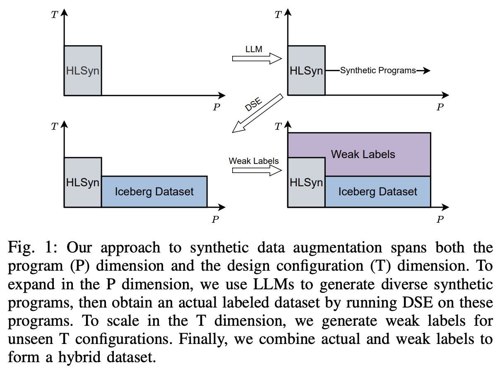
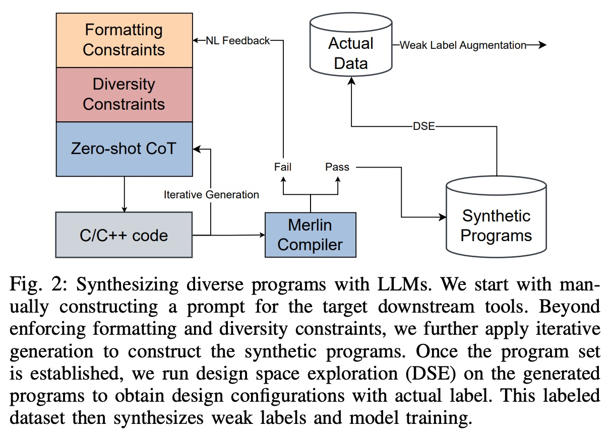
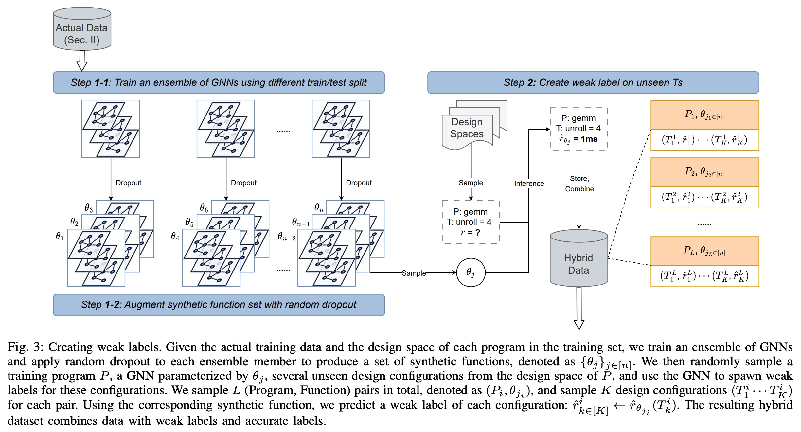
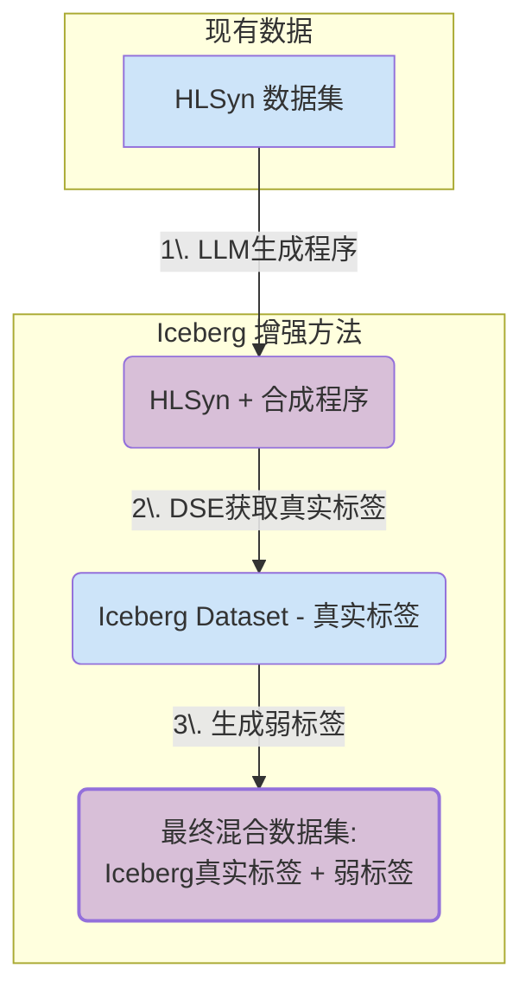
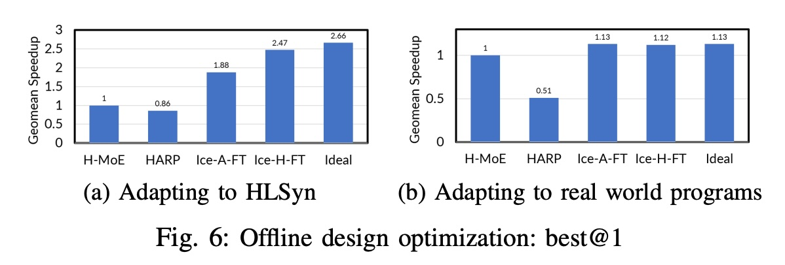

## AI论文解读 | Iceberg: Enhancing HLS Modeling with Synthetic Data
        
### 作者        
digoal        
        
### 日期        
2025-09-07        
        
### 标签        
PostgreSQL , PolarDB , DuckDB , AI , 论文解读        
        
----        
        
## 背景  
      
https://arxiv.org/pdf/2507.09948        
  
提示:          
```          
读懂《Iceberg: Enhancing HLS Modeling with Synthetic Data》这篇论文需要提前掌握哪些基础知识, 请使用中文通熟易懂的讲解这些基础知识, 可以引用论文中的图、表或使用Markdown支持的图形(text,mermaid等)增加解释性. 
  
使用中文通熟易懂的解读《Iceberg: Enhancing HLS Modeling with Synthetic Data》这篇论文, 其中的关键内容请着重讲解, 可以引用论文中的图、表或使用Markdown支持的图形(text,mermaid等)增加解释性. 
  
提取《Iceberg: Enhancing HLS Modeling with Synthetic Data》这篇论文中的重要术语, 使用中文对这些术语进行通熟易懂的讲解, 可以引用论文中的图、表或使用Markdown支持的图形(text,mermaid等)增加解释性. 
```     
  
## 1 前置知识 
  
您好，要读懂《Iceberg: Enhancing HLS Modeling with Synthetic Data》这篇论文，您需要提前掌握以下几个核心基础知识。这篇论文的核心是利用人工智能方法来解决硬件设计中的一个具体问题。

### 1\. 硬件设计基础知识 (High-Level Synthesis, HLS)

  * **什么是HLS?**
    HLS，即高级综合，是一种将用C/C++等高级语言编写的代码，自动转换成硬件描述语言（如RTL）的过程 。这就像是把我们写的普通软件代码，自动变成可以直接在芯片（FPGA或ASIC）上运行的电路设计。它大大简化了硬件设计的复杂性，让更多人能参与进来。
  * **为什么HLS很难？**
    虽然HLS很方便，但要设计出高性能的硬件仍然充满挑战。关键在于如何选择最优的参数组合，比如HLS的“**pragmas**”（指令），这些参数会影响最终硬件的性能、功耗和面积 。
  * **设计空间探索 (DSE)**
    由于参数组合众多，工程师通常需要进行“设计空间探索”（DSE）来寻找最佳设计。这个过程非常耗时，对每个设计配置（**T**）进行综合可能需要几分钟甚至几小时 。这就是论文要解决的核心问题：如何快速准确地预测这些参数组合的效果，从而避免漫长的DSE过程。

### 2\. 人工智能与机器学习基础

  * **预测模型 (Surrogate Model)**
    论文中的核心是构建一个预测模型（也叫“替代模型”），这个模型能够快速预测某个设计配置（T）的性能，从而替代耗时的HLS综合过程 。
  * **泛化能力**
    现有的预测模型面临一个主要问题：**泛化能力差** 。这意味着模型在训练时表现很好，但遇到新的、没见过的程序或设计时，性能会急剧下降。这篇论文的目标就是通过“**预训练**”（Pretraining）和“**合成数据增强**”（Synthetic Data Augmentation）来解决这个泛化问题 。
  * **少样本学习 (Few-shot learning)**
    在现实世界中，可用于训练HLS模型的**数据集非常稀缺** 。因此，模型需要能够在只有少量新程序或新设计样本（即“少样本”）的情况下，依然能有效工作。

### 3\. 论文中的核心技术概念

论文引入了几个关键概念和技术，形成了其独特的方法：

  * **两个维度：程序 (P) 和设计配置 (T)**
    论文指出，HLS设计有两个关键维度：程序（**P**）和设计配置（**T**） 。为了训练出好的模型，需要在这两个维度上都具备足够的多样性。

      * **P维度（程序）：** 论文使用 **大型语言模型（LLM）** 来生成大量多样化的、适用于HLS的C/C++程序，从而扩展了P维度 。
      * **T维度（设计配置）：** 论文开发了一种新颖的技术，利用模型本身来生成“**弱标签**”（Weak Labels），从而有效地扩展T维度 。

  * **实际标签 (Actual Labels) 和 弱标签 (Weak Labels)**
    这是理解论文方法非常关键的一点。

      * **实际标签（Actual Labels）：** 通过实际运行耗时的HLS工具（如Vitis HLS）进行综合和评估后得到的真实性能数据 。获取代价昂贵。
      * **弱标签（Weak Labels）：** 通过一个已经训练过的“**代理模型**”对未见过的设计配置进行预测后得到的性能数据 。这些数据比实际标签的准确性低，但获取代价极低。

  * **Transformer Neural Process (TNP)**
    这是一种支持“**情境学习**”（in-context learning）的神经网络架构 。

      * **情境学习：** 它的特点是，在测试时，模型可以根据给定的少量“**情境点**”（context points）来快速适应并预测“**目标点**”（target points） 。
      * **G-TNP：** 论文将图神经网络（**GNN**）编码器与TNP架构结合，创建了G-TNP模型，解决了HLS设计中输入大小可变的问题 。

### 4\. 论文方法工作流程

图1是论文的核心思想概括，图2和图3则分别展示了其具体实现流程：

  * **图1: Iceberg的数据增强方法**
    这幅图直观地展示了论文如何同时扩展P和T维度。   

    ```mermaid
    graph TD
        A[HLSyn数据集<br>有限的P和T] -->|LLM生成| B[HLSyn + 合成程序<br>P维度扩展];
        A -->|DSE| B;
        B -->|代理模型生成| C[HLSyn + 合成程序 + 弱标签<br>P和T维度都扩展];
    ```

    1.  从有限的HLSyn数据开始，LLM生成新的合成程序，扩展**P维度** 。
    2.  对这些程序运行DSE获取“实际标签” 。
    3.  利用代理模型生成未见过的设计配置（T）的“弱标签”，扩展**T维度** 。
    4.  最终，将实际标签和弱标签结合，形成一个**混合数据集**来训练模型 。

  * **图2: LLM生成合成程序流程**
    该图展示了如何通过迭代生成和反馈来确保LLM生成高质量、多样化的HLS程序 。   

    ```mermaid
    graph TD
        A[手动构建初始Prompt<br>包含格式和多样性约束] -->|迭代生成| B(C/C++代码);
        B -->|Merlin Compiler<br>验证| C{通过?};
        C -->|否| D[自然语言反馈<br>改进Prompt];
        D --> A;
        C -->|是| E[合成程序集];
        E --> F[DSE<br>获取实际标签];
    ```

  * **图3: 创建弱标签流程**
    该图展示了如何利用训练好的GNN模型，通过随机采样和dropout技术，为未见过的设计配置高效地生成弱标签 。   

    ```mermaid
    graph TD
        A[实际训练数据] --> B[训练GNN模型集合];
        B --> C[应用随机Dropout<br>生成合成函数集θj];
        D[程序设计空间] --> E(随机采样);
        E --> F[将P和未见过的T输入<br>GNN模型θj];
        F --> G[生成弱标签];
        H[混合数据集] --> I[用于训练G-TNP模型];
        G --> H;
    ```

通过理解这些核心概念和论文的工作流程，您就能更好地掌握这篇论文的核心思想：如何通过大规模生成程序（P）和廉价的弱标签（T）来构建一个庞大的混合数据集，从而有效提升HLS预测模型的泛化能力。
  
## 2 解读论文 
  
好的，我们来通俗易懂地解读一下这篇名为《Iceberg: Enhancing HLS Modeling with Synthetic Data》的论文。

可以把这篇论文的核心思想理解成：**为了训练出一个更聪明的AI模型来预测硬件设计（HLS）的性能，我们不能只让它做几道“真题”，而是要给它海量的、高质量的“模拟题”和“练习题”来刷。**

这篇论文主要解决了学术界和工业界在利用AI/ML来优化硬件设计（特别是高层次综合 HLS）时遇到的一个核心痛点：**高质量的训练数据太少，导致AI模型泛化能力差**，在新设计上预测不准。

-----

### 1\. 核心问题：AI模型的“偏科”现象

在高层次综合（HLS）中，工程师用C/C++等高级语言写代码，然后由工具自动转换成硬件电路。为了得到最佳性能的电路，需要设置很多参数（比如循环怎么展开、数据怎么流水化），这些参数的组合构成了庞大的“设计空间”（Design Space）。

传统方法是让工具一个个去尝试，这个过程叫设计空间探索（DSE），非常耗时（几小时到几天）。于是，大家想到用AI模型来当“先知”，直接预测哪种参数组合性能最好，从而替代耗时的DSE。

但问题来了，训练这个AI“先知”需要大量已知的“（程序+参数组合）-\> 性能”的数据。现有数据集（比如HLSyn）规模小，不够多样，导致训练出来的模型很“偏科”：

  * **在见过的程序上表现不错。**
  * **一遇到新的、没见过的程序，预测结果就一塌糊涂。**

这个问题可以从两个维度来看：

1.  **程序维度 (P - Program):** 缺乏足够多样的、适合HLS的程序代码。
2.  **设计配置维度 (T - design configuration):** 对于每一个程序，缺乏足够多的参数组合及其对应的真实性能数据（因为跑一次太慢了）。

### 2\. Iceberg的“双管齐下”解决方案

为了解决数据稀缺问题，Iceberg提出了一套合成数据增强方法，就像它的名字“冰山”一样，在小小的真实数据（冰山一角）之下，构建了庞大的合成数据（水下的冰山主体）。

它的方法是双管齐下的，正好对应了上面提到的两个维度。我们可以通过论文中的核心图 Fig. 1 来理解：   



  * **P维度（横轴）扩展 - 用LLM生成新程序**:

      * **怎么做？** 他们利用大语言模型（LLM，比如GPT系列）来自动编写大量适合HLS的C/C++程序 。他们精心设计了一套提示（Prompt），告诉LLM要生成什么样的代码：比如要符合特定HLS工具的格式、要有不同的计算类型（加密、信号处理等）、不同的内存占用等 。
      * **解决什么问题？** 解决了程序多样性不足的问题。而且为了避免LLM总是生成类似的代码（比如一提到强化学习就只写Q-learning），他们使用了一种迭代生成技术：把已经生成的代码再喂给LLM，让它“换个思路，写点不一样的” 。
      * **成果：** 生成了3000多个可用的新程序，极大地扩展了P维度 。这些程序跑完DSE后获得的真实性能数据，构成了**Iceberg数据集的核心部分** 。

  * **T维度（纵轴）扩展 - 生成“弱标签”**:

      * **为什么需要？** 对于每一个程序，我们依然无法承担遍历所有参数组合（T）的巨大时间成本。
      * **怎么做？** Iceberg想了个聪明的办法：**用“半吊子先知”来指导“未来先知”**。他们先用已有的少量真实数据训练出一组（比如19个）“还不错”的预测模型（GNN模型） 。然后，对于那些没跑过的、未知的参数组合，就让这一组模型去进行预测。这些预测出的性能值，就是所谓的“**弱标签**”（Weak Labels） 。
      * **弱标签有什么用？** 它虽然不是100%准确的真实性能，但它**成本极低**（模型推理远快于HLS综合），并且因为它来自预训练过的模型，所以比完全随机瞎猜要靠谱得多 。这为训练提供了海量的、近似正确的参考信息。

### 3\. G-TNP：一个能“吃”混合数据的强大模型

有了包含“真实标签”和“弱标签”的混合数据集，还需要一个能有效利用这些数据的模型架构。Iceberg为此提出了 **G-TNP**。

  * **TNP (Transformer Neural Process):** 这是一种支持“**情境学习**”（In-context Learning）的模型。你可以把它理解成一个很会“举一反三”的学生。在预测一个新问题时，你可以先给它几个“例子”（即Context Points，比如几个已知的“参数组合-\>性能”对），它能立刻利用这些例子来调整自己的预测，而无需重新训练模型参数 。这个特性非常适合“小样本学习”（Few-shot Learning）场景。

  * **G (Graph Neural Network):** HLS的程序代码可以很自然地表示成图结构。GNN是处理图数据的专家。这里GNN被用作一个**编码器**（Encoder），先把不同大小和结构的程序代码转换成一个固定维度的向量（embedding） 。

**G-TNP = GNN编码器 + TNP骨干**。这个架构的巧妙之处在于：

1.  GNN解决了不同程序输入大小不一的问题。
2.  TNP骨干则能够同时处理和学习来自真实数据和弱标签数据的模式，因为它能区分哪些是需要学习的“上下文”，哪些是需要预测的“目标” 。

### 4\. 实验结果：效果显著

论文通过大量实验证明了Iceberg方法的有效性：

1.  **Iceberg数据集本身价值巨大**：即使用传统的模型（如HARP, H-MoE），先在Iceberg数据集上进行预训练，再到目标任务上进行微调，模型的准确率也得到了大幅提升（HARP提升80%） 。这说明LLM生成的合成程序确实有效增强了模型的泛化能力。

2.  **弱标签能有效防止过拟合**：在训练数据很少的情况下（比如只用HLSyn数据集），G-TNP模型（Ice-A）会严重过拟合。但加入了弱标签进行混合训练后（Ice-H），模型的预测误差（MSE）降低了55% 。这说明弱标签虽然不完美，但能让模型见到更广阔的设计空间，避免“钻牛角尖”。

3.  **强强联合，效果最佳**：当 **在Iceberg数据集上预训练G-TNP模型，并结合弱标签（Ice-H）和微调（-FT）** 时，其性能全面超越了之前的最优模型（SOTA）。

      * 在HLSyn测试集上，几何平均MSE比之前的SOTA模型H-MoE低了**37.9%** 。
      * 在6个更具挑战性的真实世界应用上，优势更明显，几何平均MSE降低了**86.4%** 。

    下面这张图 (Fig. 6) 展示了在设计优化任务上的表现，数值越低越好，代表模型推荐的设计性能越高。可以看到Iceberg的方法（Ice-A-FT, Ice-H-FT）在大部分情况下都更接近理想值（Ideal）。   
    *这是一个根据论文Fig.6简化的示意图，展示了Iceberg模型在寻找最佳设计点（best@1）方面的优越性能。*

### 5\. 总结

总而言之，《Iceberg》这篇论文做出了以下关键贡献：

  * **提出了一种创新的、双管齐下的合成数据生成框架**，有效解决了HLS领域AI模型训练数据不足的核心难题。
  * **首次系统性地利用LLM生成多样化的、符合HLS要求的程序**，创建了宝贵的Iceberg数据集，极大地推动了相关研究。
  * **设计了一种巧妙的“弱标签”生成技术**，通过预训练模型来低成本地探索广阔的设计空间，有效提升了模型的泛化能力。
  * **将GNN与TNP相结合，构建了G-TNP架构**，使其能高效地从图结构的程序数据和混合标签（真实+弱）中进行学习。

这项工作不仅在HLS性能预测任务上取得了SOTA的结果，其关于“合成数据+弱标签+情境学习模型”的思想，也为其他数据稀疏的科学与工程领域提供了极具价值的借鉴。
  
## 3 术语 
  
要读懂《Iceberg: Enhancing HLS Modeling with Synthetic Data》这篇论文，理解其核心术语至关重要。以下是论文中一些重要术语的中文讲解：

### 1. 高级综合（High-Level Synthesis, HLS）

**HLS** 是一种自动化工具，它可以将用 C/C++ 等高级语言编写的软件代码，自动转换成用于制造硬件芯片（如 FPGA 或 ASIC）的硬件描述语言（如 RTL）。简单来说，它让硬件设计变得像写软件一样，大大降低了设计门槛。

---

### 2. Pragmas（编译指令）

在 HLS 中，**Pragmas** 是插入到 C/C++ 代码中的特殊指令。它们告诉 HLS 工具如何优化最终生成的硬件。不同的 Pragma 设置会导致硬件在性能（如吞吐量）、面积（占用的芯片空间）和功耗方面有巨大的差异。这就像给一个厨师提供指导，告诉他如何用最快的速度、最小的空间做出一道菜。

---

### 3. 设计空间探索（Design Space Exploration, DSE）

**DSE** 是在 HLS 设计中寻找最优 Pragma 组合的过程。由于 Pragma 组合非常多，手动尝试所有可能性几乎不可能。传统的 DSE 方法需要对每种组合进行一次完整的 HLS 综合，这个过程非常耗时（可能需要几分钟甚至几小时）。论文的最终目标就是用预测模型来加速这个过程，避免耗时的综合。

---

### 4. 预测模型（Surrogate Model）

**预测模型** 是一种机器学习模型，它能够快速地预测某个设计配置（即一组 Pragma 组合）的性能，而不需要进行实际的 HLS 综合。它就像一个“替身”或“代理”，通过快速预测来替代耗时的真实过程。

---

### 5. 泛化能力（Generalizability）

**泛化能力** 是指一个模型在面对它从未见过的新数据时，依然能够做出准确预测的能力。对于 HLS 预测模型来说，如果它只在训练过的程序上表现好，而在新的、未见过的程序上表现很差，我们就说它的泛化能力弱。论文的核心就是要通过各种方法来提升模型的泛化能力。

---

### 6. 合成数据增强（Synthetic Data Augmentation）

**合成数据增强** 是指通过算法或模型（比如大型语言模型）自动生成新的数据，以扩大训练数据集的规模和多样性。论文的创新点之一就是利用这种方法，生成大量的合成程序和设计配置，从而解决了 HLS 训练数据稀缺的问题。

---

### 7. 实际标签（Actual Labels）与弱标签（Weak Labels）

这是论文中非常关键的一对概念：
* **实际标签（Actual Labels）：** 真实、准确的性能数据，通过对某个设计配置进行完整的 HLS 综合和评估后获得。获取代价昂贵且耗时。
* **弱标签（Weak Labels）：** 由一个已经训练好的预测模型（代理模型）对新的设计配置进行预测后得到的数据。这些数据不如实际标签准确，但获取成本极低。论文通过结合这两类数据来训练模型，从而在保证模型效果的同时，解决了数据不足的问题。

---

### 8. Transformer Neural Process（TNP）

**TNP** 是一种能够进行“**情境学习**”的神经网络架构。
* **情境学习（In-context Learning）：** 这种学习方式允许模型在推理时，根据给定的少量“情境点”（即已知的输入-输出对），快速适应并预测新的“目标点”的输出。这使得模型能够仅使用少量的真实数据（情境点）来预测未知数据。

这篇论文将图神经网络（GNN）编码器与 TNP 架构结合，创建了 **G-TNP** 模型，使其特别适合处理 HLS 任务中输入数据结构复杂的特点。
  
## 参考        
         
https://arxiv.org/pdf/2507.09948    
        
<b> 以上内容基于DeepSeek、Qwen、Gemini及诸多AI生成, 轻微人工调整, 感谢杭州深度求索人工智能、阿里云、Google等公司. </b>        
        
<b> AI 生成的内容请自行辨别正确性, 当然也多了些许踩坑的乐趣, 毕竟冒险是每个男人的天性.  </b>        
  
  
  
#### [期望 PostgreSQL|开源PolarDB 增加什么功能?](https://github.com/digoal/blog/issues/76 "269ac3d1c492e938c0191101c7238216")
  
  
#### [PolarDB 开源数据库](https://openpolardb.com/home "57258f76c37864c6e6d23383d05714ea")
  
  
#### [PolarDB 学习图谱](https://www.aliyun.com/database/openpolardb/activity "8642f60e04ed0c814bf9cb9677976bd4")
  
  
#### [PostgreSQL 解决方案集合](../201706/20170601_02.md "40cff096e9ed7122c512b35d8561d9c8")
  
  
#### [德哥 / digoal's Github - 公益是一辈子的事.](https://github.com/digoal/blog/blob/master/README.md "22709685feb7cab07d30f30387f0a9ae")
  
  
#### [About 德哥](https://github.com/digoal/blog/blob/master/me/readme.md "a37735981e7704886ffd590565582dd0")
  
  

  
