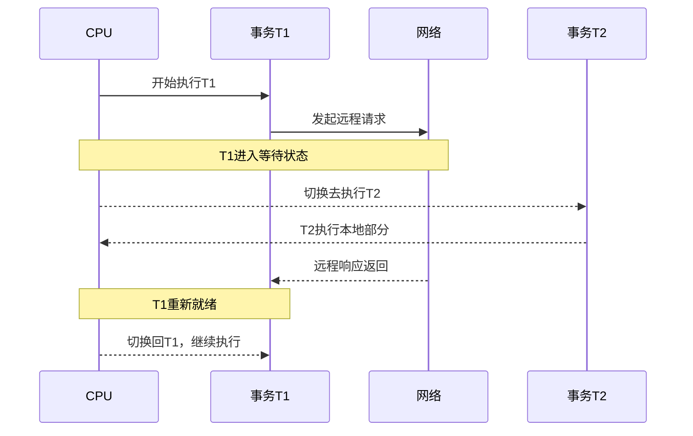
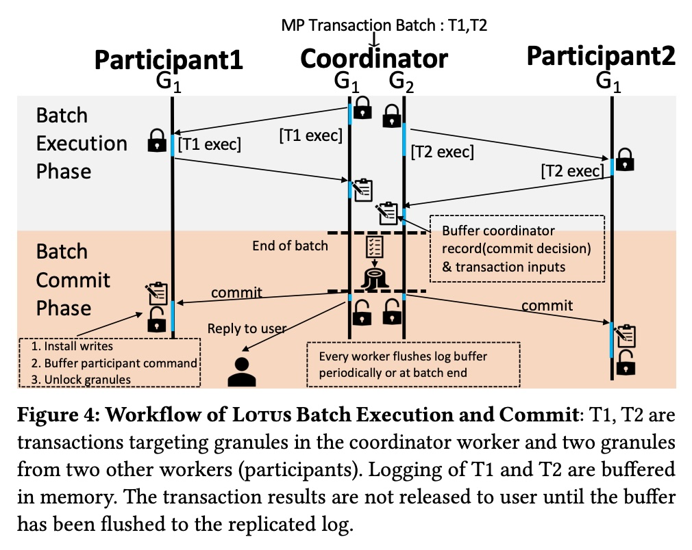
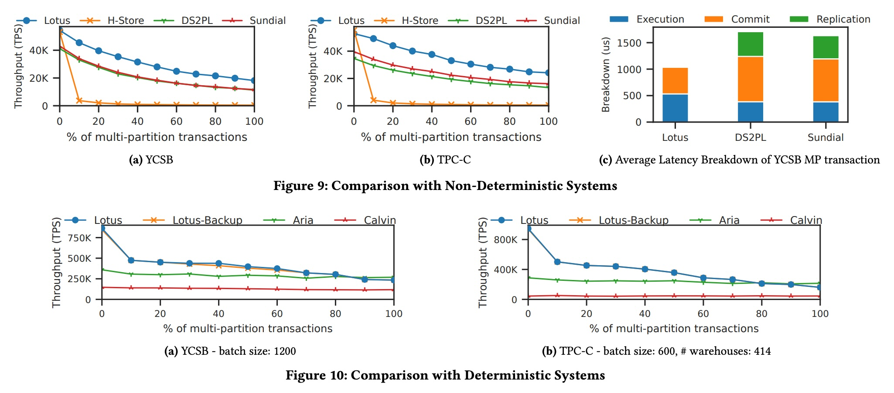
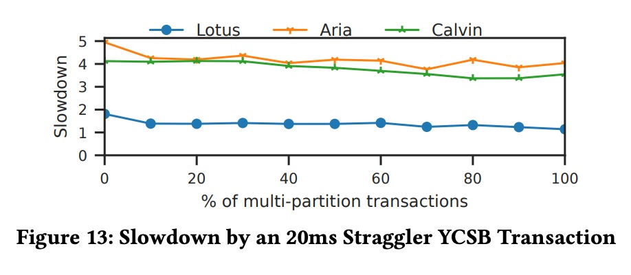

## AI论文解读 | Lotus: Scalable Multi-Partition Transactions on Single-Threaded Partitioned Databases
        
### 作者        
digoal        
        
### 日期        
2025-09-07        
        
### 标签        
PostgreSQL , PolarDB , DuckDB , AI , 论文解读        
        
----        
        
## 背景  
      
https://www.vldb.org/pvldb/vol15/p2939-zhou.pdf        
  
提示:          
```          
读懂《Lotus: Scalable Multi-Partition Transactions on Single-Threaded Partitioned Databases》这篇论文需要提前掌握哪些基础知识, 请使用中文通熟易懂的讲解这些基础知识, 可以引用论文中的图、表或使用Markdown支持的图形(text,mermaid等)增加解释性. 
  
使用中文通熟易懂的解读《Lotus: Scalable Multi-Partition Transactions on Single-Threaded Partitioned Databases》这篇论文, 其中的关键内容请着重讲解, 可以引用论文中的图、表或使用Markdown支持的图形(text,mermaid等)增加解释性. 
  
提取《Lotus: Scalable Multi-Partition Transactions on Single-Threaded Partitioned Databases》这篇论文中的重要术语, 使用中文对这些术语进行通熟易懂的讲解, 可以引用论文中的图、表或使用Markdown支持的图形(text,mermaid等)增加解释性. 
```     
  
## 1 前置知识 
  
读懂这篇关于 **LOTUS** 论文《Scalable Multi-Partition Transactions on Single-Threaded Partitioned Databases》需要一些核心的数据库基础知识，特别是关于分布式系统和事务处理的。以下是您需要掌握的关键概念，并结合论文内容进行通俗易懂的讲解。

### 1. 分区式数据库 (Partitioned Databases)

首先，您需要理解**分区（Partitioning）**的概念。传统数据库通常将所有数据存储在一个巨大的服务器上，但当数据量和访问量剧增时，单个服务器会成为瓶颈。分区式数据库通过将数据分散到多个节点或服务器上，实现了**横向扩展（Scalability）** 。每个节点只负责存储和处理数据库的一部分数据，这一部分数据就称为一个**分区** 。

例如，一个在线商城的数据库可以按地区进行分区：北京地区的订单数据放在节点1，上海地区的放在节点2，以此类推。

### 2. 数据库事务 (Database Transactions)

事务是数据库操作的基本单位，必须满足 **ACID** 特性，其中最重要的就是 **原子性（Atomicity）** 和 **隔离性（Isolation）**。

* **原子性**：一个事务中的所有操作要么全部成功，要么全部失败，不可能只完成一部分。
* **隔离性**：多个并发执行的事务，其结果必须与它们串行执行（一个接一个）的结果相同。这被称为**可串行化（Serializability）**，是论文中讨论的最高隔离级别 。

### 3. 单分区事务 (SP) 与跨分区事务 (MP)

这是论文的核心概念。

* **单分区事务 (Single-Partition, SP)**：如果一个事务只访问**一个**分区上的数据，它就是单分区事务。例如，用户在购物车中添加一件商品，这个操作只涉及用户数据所在的分区。
* **跨分区事务 (Multi-Partition, MP)**：如果一个事务需要访问**多个**分区上的数据，它就是跨分区事务。例如，用户转账，涉及从一个账户所在分区扣款，并向另一个账户所在分区加款。

论文指出，像 H-Store/VoltDB 这样的系统在处理单分区事务时效率极高，但面对跨分区事务时性能非常糟糕 。这是因为跨分区事务需要复杂的协调和通信，这正是 LOTUS 旨在改进的地方 。

---

### 4. 并发控制 (Concurrency Control)

为了确保事务的隔离性，数据库需要并发控制机制。论文中主要提到了两类：

#### a) 非确定性并发控制 (Non-Deterministic)
这类机制在事务执行过程中动态地决定执行顺序。论文中提到了两种经典方案：
* **两阶段锁（Two-Phase Locking, 2PL）**：事务在执行时需要获取锁，并分为两个阶段：增长阶段（获取锁）和收缩阶段（释放锁） 。
* **乐观并发控制（Optimistic Concurrency Control, OCC）**：事务在执行时不加锁，提交时才检查是否与其他事务冲突。如果没有冲突就提交，有冲突则回滚并重试 。

对于跨分区事务，这类系统通常需要 **两阶段提交（Two-Phase Commit, 2PC）** 协议来确保原子性 。这个协议需要多个网络往返，被认为是分布式事务的主要瓶颈 。

#### b) 确定性并发控制 (Deterministic)
这类系统通过在执行前预先决定一个全局的事务执行顺序来避免冲突 。LOTUS 和它所基于的 H-Store/VoltDB 都属于此类。

### 5. LOTUS 的核心思想

论文的核心在于 LOTUS 如何在 H-Store/VoltDB 的基础上，通过以下方式大幅提升跨分区事务的性能：

#### a) 粒度锁 (Granule-based Locking)
H-Store/VoltDB 使用的是**分区锁（Partition Locking）**，即一个跨分区事务在访问某个分区时，会锁定整个分区，阻止其他事务访问该分区 。这导致了并发性差，尤其是在跨分区事务频繁的情况下 。

LOTUS 引入了 **粒度（Granules）** 这个概念 。它将一个分区在逻辑上划分为多个更小的锁单元，而不是锁定整个分区。这样，一个跨分区事务只锁定它需要的特定粒度，而其他事务仍然可以访问该分区中未被锁定的其他粒度，从而显著提高了并发性 。

#### b) 批处理与多路复用执行 (Batch Execution & Multiplexed-Execution-Single-Thread, MEST)
传统方法通常一个接一个地处理跨分区事务，导致在等待网络响应时 CPU 处于空闲状态 。LOTUS 则将多个事务组织成一个 **批次（Batch）** 进行处理，并使用 **MEST** 算法，在一个线程内交错执行这些事务 。这样，当一个事务因为网络延迟而阻塞时，CPU 可以立即切换到执行批次中的另一个事务，从而隐藏网络延迟，提高 CPU 利用率 。

这篇论文可以被看作是对一个特定数据库架构（H-Store/VoltDB）的深入改进，如果您能理解上述基础知识，就能轻松把握论文中讨论的问题、提出的方案及其创新之处。
  
## 2 解读论文 
  
好的，我们来通俗易懂地解读一下《LOTUS: Scalable Multi-Partition Transactions on Single-Threaded Partitioned Databases》这篇论文。

### 核心思想一句话概括

这篇论文的核心目标是**解决一个经典数据库架构 (H-Store/VoltDB) 在处理“跨分区事务”时性能极差的问题**。它通过引入 **“Granule”粒度锁** 、**“MEST”乱序批处理**和**异步复制**这三大法宝，在不怎么牺牲其原有“单分区事务”高性能优势的前提下，极大地提升了“跨分区事务”的处理能力，使其在多种场景下超越了当时主流的数据库并发控制方案。

-----

### 1\. 背景：巨人的“阿喀琉斯之踵”

首先，我们要了解LOTUS想要改进的这个“巨人”是谁。它叫 **H-Store/VoltDB**，是一个基于内存和分区设计的数据库系统。它的设计哲学非常极端和纯粹，我们称之为 **RCST (Run-to-Completion-Single-Thread)** 。

  * **分区 (Partitioned):** 把数据切成一块块（分区），分散到不同服务器节点上。每个节点上的每个CPU核心只负责一个分区，井水不犯河水 。
  * **单线程 (Single-Threaded):** 每个分区内只有一个线程来处理所有事务，完全避免了多线程之间的锁竞争和上下文切换开销 。
  * **跑到完 (Run-to-Completion):** 一个事务一旦开始，就会占用整个CPU核心直到执行完毕，中间不会被打断。

这种设计的优点是：

  * **处理“单分区事务” (SP) 快到飞起**：如果一个事务只涉及一个分区内的数据，那它就是这个分区唯一的“王”，没有任何干扰，执行效率极高，每秒能处理百万级事务 。

但它的“阿喀琉斯之踵”（致命弱点）也非常明显：

  * **处理“跨分区事务” (MP) 慢到令人发指**：如果一个事务需要访问多个分区的数据（比如银行转账，A账户在分区1，B账户在分区2），情况就变得非常糟糕 。
      * **分区级锁定**：为了保证一致性，它会把事务所涉及的**整个分区**都锁住 。这就好比为了取一本书，把整个图书馆都封了，其他想看书的人只能干等着。
      * **串行执行**：跨分区事务一个接一个地执行，毫无并发性可言 。
      * **网络等待**：在等待其他分区的响应时，CPU核心只能空转，白白浪费资源 。

因此，这类数据库虽然在特定场景（如物联网数据采集）很强，但对于需要大量跨分区操作的应用（如金融、电商）就力不从心了 。LOTUS 的诞生，就是为了给这个巨人“治好腿”。

### 2\. LOTUS的三大关键创新

LOTUS 提出了三大核心改进，精准地打击了上述痛点。

#### 关键一：轻量级“Granule”锁——从封锁图书馆到只借一本书

为了解决“分区级锁定”导致的并发性差的问题，LOTUS 提出了 **Granule-based Locking** 。

  * **什么是Granule？** Granule是**逻辑上的**、比分区更小的锁单位 。你可以把它想象成图书馆里的“书架”。一个分区（图书馆）被逻辑上划分成很多个Granules（书架），比如通过对数据主键做哈希或范围分区来实现 。
  * **有什么好处？**
    1.  **提升并发**：现在，一个跨分区事务不再需要锁住整个分区，只需要锁住它所访问数据对应的Granule（书架）即可 。只要两个事务不访问同一个Granule，它们就可以并行执行，大大提高了并发度。
    2.  **开销可控**：相比于对每一行数据（每一本书）都加锁（即元组级锁），Granule锁的管理开销要小得多，是一个在并发度和管理开销之间的完美平衡 。
    3.  **灵活性**：由于Granule是逻辑划分，调整其数量不需要移动实际数据，比物理上重新分区要轻量得多 。

#### 关键二：MEST乱序批处理——CPU的“时间管理大师”

为了解决跨分区事务中CPU空等网络响应的问题，LOTUS 提出了 **MEST (Multiplexed-Execution-Single-Thread)** 方案 。

  * **核心思想**：将一堆跨分区事务（MP）打包成一个批次（Batch）。在一个批次内，当一个事务（如T1）因为需要等待远程分区的网络回复而“卡住”时，CPU不会傻等，而是立刻切换去执行这个批次里的另一个事务（如T2）。

我用一个 Mermaid 图来形象地展示这个过程：



  * **批量提交 (Batch Commit)**：当一个批次中的所有事务都执行完毕后，系统会将它们的日志记录一次性地刷入持久化存储中，从而将多次写盘的开销摊销到整个批次上，这被称为“批量提交” 。

通过MEST，LOTUS巧妙地将网络延迟“隐藏”在了其他事务的计算时间里，极大地提高了CPU的利用率。

#### 关键三：异步确定性复制——主节点“轻装上阵”

传统的H-Store/VoltDB为了保证高可用，采用的是**同步复制**，即主节点必须等到所有备份节点都确认收到并应用了操作后，才能认为事务提交成功 。这个等待过程严重影响了性能。

LOTUS 改进为**异步、确定性的复制**方案 。

  * **解耦**：主节点（Sequencer）在执行完一个批次的事务后，只需将包含了操作指令和**执行顺序信息**的“命令日志”持久化即可向客户端返回成功 。
  * **异步**：备份节点（Replica）独立地、异步地从这个命令日志中拉取指令并进行重放（Replay）。
  * **确定性**：如何保证异步重放后数据状态和主节点完全一致？奥秘在于“命令日志”里不仅记录了要做什么（`UPDATE`、`INSERT`），还记录了事务之间的**偏序关系**（Partial Ordering），这些信息是通过Granule锁的顺序捕获的 。备份节点严格按照这个顺序来重放，就能保证最终达到和主节点完全一致的状态 。

这种设计让主节点的负担大大减轻，不再被备份节点拖后腿，从而提升了整体吞吐量。

-----

### 3\. 工作流程：一个跨分区事务在LOTUS中的一生

结合论文中的 **Figure 4**，我们可以更直观地理解LOTUS的处理流程 。   

*对论文 Figure 4 的解读*

假设有一个事务批次，包含T1和T2，它们都需要访问协调者（Coordinator）和另外两个参与者（Participant1, Participant2）节点上的Granule。

1.  **批处理执行阶段 (Batch Execution Phase)**

      * 协调者开始执行T1，向P1发送锁定和执行请求 。
      * 在等待P1回复时，协调者利用MEST机制，切换去执行T2，并向P2发送请求 。
      * 各个节点在本地执行收到的子任务，并将结果返回。
      * 协调者将所有事务的日志记录（包含操作和顺序信息）缓存在内存中 。

2.  **批处理提交阶段 (Batch Commit Phase)**

      * 当整个批次执行结束，协调者将内存中的日志缓冲区**一次性**刷到**复制日志存储**中 。
      * 一旦刷盘成功，协调者就认为这整个批次的事务都已经**提交**了，并可以回复客户端 。
      * 随后，协调者向所有参与者发送`commit`和解锁指令 。
      * 参与者节点在收到指令后，安装写入（apply writes）、记录参与者日志、并释放Granule锁 。

-----

### 4\. 性能表现如何？

论文通过大量实验证明了LOTUS的优越性。     

  * **VS. 传统方案 (2PL, OCC)**: 如 **Figure 9** 所示，无论是在YCSB还是TPC-C基准测试中，随着跨分区事务比例的增加，LOTUS 的性能都**显著优于**传统的分布式锁（DS2PL）和乐观并发控制（Sundial）方案 。其主要优势在于更高效的提交和复制协议，延迟更低 。

  * **VS. 先进的确定性系统 (Calvin, Aria)**: 如 **Figure 10** 所示，在单分区事务（SP）占主导的场景下，LOTUS 凭借其极简的RCST模型，性能远超需要复杂预处理和调度的Calvin和Aria 。在跨分区事务（MP）场景下，也保持了相当的竞争力 。

  * **对“慢事务”（Straggler）的容忍度**: 这是LOTUS的一大亮点。如 **Figure 13** 所示，当批次中出现一个“拖后腿”的慢事务时，像Calvin和Aria这样的系统需要等待整个批次中最慢的那个完成，性能会急剧下降 。而LOTUS的批处理是基于单个工作线程的，一个节点的慢事务不会阻塞其他节点，因此受影响小得多，系统**鲁棒性更强** 。

### 5\. 局限性

论文同样坦诚地指出了LOTUS的局限性：

  * **高冲突场景**：虽然Granule锁提升了并发，但在冲突极其激烈的场景下，性能可能不如更细粒度的元组级锁 。
  * **异步复制的延迟**：虽然性能好，但异步复制意味着备份节点的数据可能存在微小的延迟。在主节点宕机切换时，新主节点需要一个短暂的时间来追平数据，无法做到瞬时切换 。
  * **分区内无物理并发**：每个分区依然是单线程处理，没有利用上多核处理单个分区内事务的能力 。

### 总结

LOTUS 是一篇非常经典的数据库系统优化论文。它没有推倒重来，而是基于一个成熟但有明显短板的架构（H-Store/VoltDB），通过一系列巧妙且务实的改进（Granule锁、MEST批处理、异步复制），成功地弥补了其在处理跨分区事务上的短板。这使得一个原本“偏科”的系统变得更加“全能”，在更广泛的业务场景中都具有强大的竞争力，并为后续的分布式数据库设计提供了宝贵的思路。
  
## 3 术语 
  
在《Lotus》这篇论文中，有几个关键术语是理解其核心思想的基础。以下是对这些重要术语的中文讲解，旨在帮助您通俗易懂地掌握论文精髓。

### 1\. 单线程分区式数据库 (Single-Threaded Partitioned Databases)

  * **通俗解释**：想象一个大型仓库，里面的货物（数据）被分成很多个小区域（分区）。每个小区域都有一个专门的工人（单线程）负责管理，他只处理自己区域内的货物。这个工人非常高效，一次只专注于一件任务，直到完成为止。
  * **论文关联**：这篇论文正是基于 **H-Store/VoltDB** 这类数据库系统。这类系统设计思想是：每个分区只用一个线程来处理所有事务请求，这使得处理**单分区事务**时效率极高，因为没有并发冲突的开销。然而，这也带来了挑战，尤其是在处理需要跨越多个分区的事务时。

-----

### 2\. 单分区事务 (Single-Partition Transactions, SP)

  * **通俗解释**：就像你在一个分区内的仓库区域里找一件货，你只需要和这一个区域的工人打交道，整个过程非常简单、迅速。
  * **论文关联**：这是这类数据库的“强项”。SP 事务只访问一个分区上的数据，因此在一个线程内就可以完整执行，不需要和其他分区协调，效率极高。论文指出，H-Store/VoltDB 在处理 SP 事务时可以达到每秒百万级的吞吐量。

-----

### 3\. 跨分区事务 (Multi-Partition Transactions, MP)

  * **通俗解释**：就像你要在仓库里找两件货，一件在北京分区，一件在上海分区。你需要先和北京的工人打交道，再和上海的工人打交道。这个过程复杂多了，需要协调和等待。
  * **论文关联**：这是论文要解决的**核心问题**。MP 事务需要访问多个分区的数据，因此必须跨越多个节点进行通信和协调。在 H-Store/VoltDB 的原始设计中，MP 事务的性能非常差，因为它们会长时间占用线程并导致网络延迟，从而阻塞其他事务的执行。

-----

### 4\. RCST (Run-to-Completion-Single-Thread)

  * **通俗解释**：这是 H-Store/VoltDB 原始的执行模式，可以直译为“运行到结束-单线程”。它的意思是，一旦一个事务开始执行，它会一直占用这个单线程直到完全完成（“运行到结束”），即使需要等待其他分区的响应，也不会释放线程。
  * **论文关联**：论文把这种原始模式称为 **RCST**，并明确指出它是导致 MP 事务性能低下的根本原因。当一个 MP 事务在等待远程分区响应时，整个单线程被“堵塞”，其他本来可以执行的事务（特别是高效的 SP 事务）也无法得到处理。

-----

### 5\. MEST (Multiplexed-Execution-Single-Thread)

  * **通俗解释**：可以理解为“多路复用执行-单线程”。这个新模式是 LOTUS 论文的核心创新之一。它改变了 RCST 的“死等”模式，让单线程可以同时“照顾”多个任务。当一个事务因为需要等待网络响应而停下来时，这个线程会立即切换到另一个准备好的事务继续执行，而不是空闲地等待。
  * **论文关联**：MEST 算法通过在单线程内**交错执行**多个事务，有效隐藏了跨分区事务的网络延迟。论文中的一个重要图形（通常是像下图这样的概念图）会展示这种区别：


```
+------------+     +------------+     +------------+
|  MP事务1  |     |  MP事务1  |     |  MP事务1  |
|  (执行)    | --> |  (等待)   |     |  (执行)   |
|            |     |  (堵塞)   |     |           |
+------------+     +------------+     +------------+
  RCST模式：MP事务1 堵塞了整个线程

+------------+     +------------+     +------------+
|  MP事务1  |     |  MP事务1  |     |  MP事务2  |
|  (执行)    | --> |  (等待)   | --> |  (执行)   |
|            |     |  (切换)   |     |           |
+------------+     +------------+     +------------+
  MEST模式：MP事务1 等待时，切换到 MP事务2
```

这种“切换”机制大大提高了 CPU 的利用率和整个系统的吞吐量，是 LOTUS 提升 MP 性能的关键。

-----

### 6\. 粒度 (Granules)

  * **通俗解释**：这是一个新的锁的概念。在传统的单线程分区数据库中，当一个 MP 事务访问某个分区时，通常会给这个分区**加锁**。这就像为了拿一件货，把整个仓库区域都锁起来了，其他人无法进入。而“粒度”的概念，就像是把锁的范围缩小到只锁住你需要的货架或小片区域。
  * **论文关联**：LOTUS 引入了基于“粒度”的并发控制，而不是使用粗粒度的分区锁。通过将一个分区逻辑上划分为更小的“粒度”，MP 事务在访问数据时只锁定需要的那些“粒度”，而不是整个分区。这使得一个分区内的不同事务可以同时访问不同的“粒度”，从而显著提高了系统的并发性。
  
## 参考        
         
https://www.vldb.org/pvldb/vol15/p2939-zhou.pdf    
        
<b> 以上内容基于DeepSeek、Qwen、Gemini及诸多AI生成, 轻微人工调整, 感谢杭州深度求索人工智能、阿里云、Google等公司. </b>        
        
<b> AI 生成的内容请自行辨别正确性, 当然也多了些许踩坑的乐趣, 毕竟冒险是每个男人的天性.  </b>        
  
  
  
#### [期望 PostgreSQL|开源PolarDB 增加什么功能?](https://github.com/digoal/blog/issues/76 "269ac3d1c492e938c0191101c7238216")
  
  
#### [PolarDB 开源数据库](https://openpolardb.com/home "57258f76c37864c6e6d23383d05714ea")
  
  
#### [PolarDB 学习图谱](https://www.aliyun.com/database/openpolardb/activity "8642f60e04ed0c814bf9cb9677976bd4")
  
  
#### [PostgreSQL 解决方案集合](../201706/20170601_02.md "40cff096e9ed7122c512b35d8561d9c8")
  
  
#### [德哥 / digoal's Github - 公益是一辈子的事.](https://github.com/digoal/blog/blob/master/README.md "22709685feb7cab07d30f30387f0a9ae")
  
  
#### [About 德哥](https://github.com/digoal/blog/blob/master/me/readme.md "a37735981e7704886ffd590565582dd0")
  
  

  
