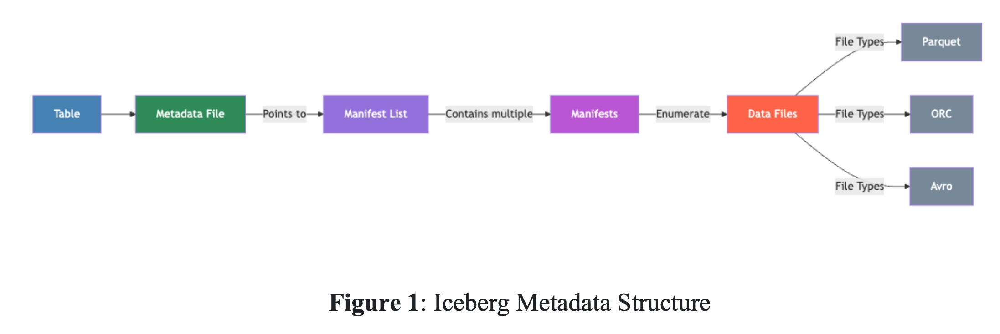
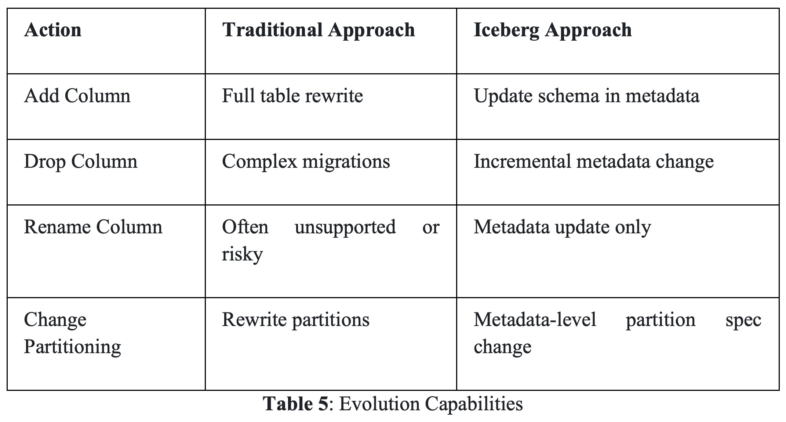
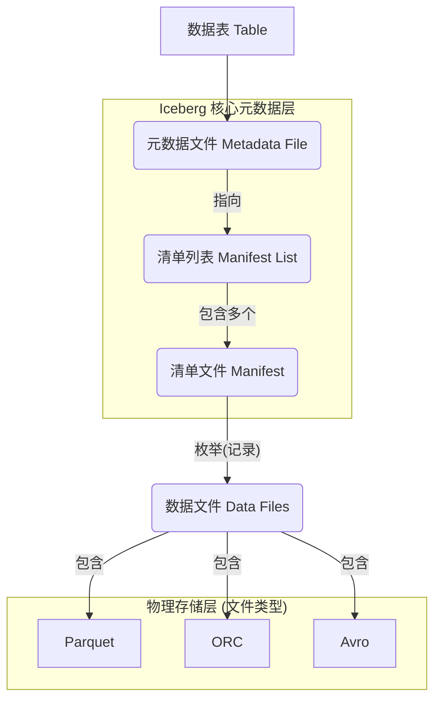
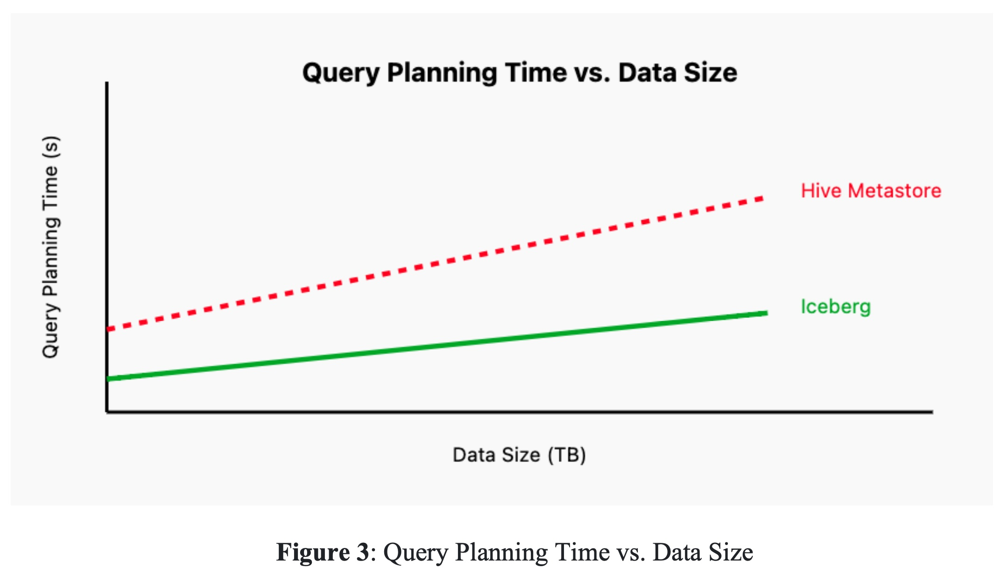
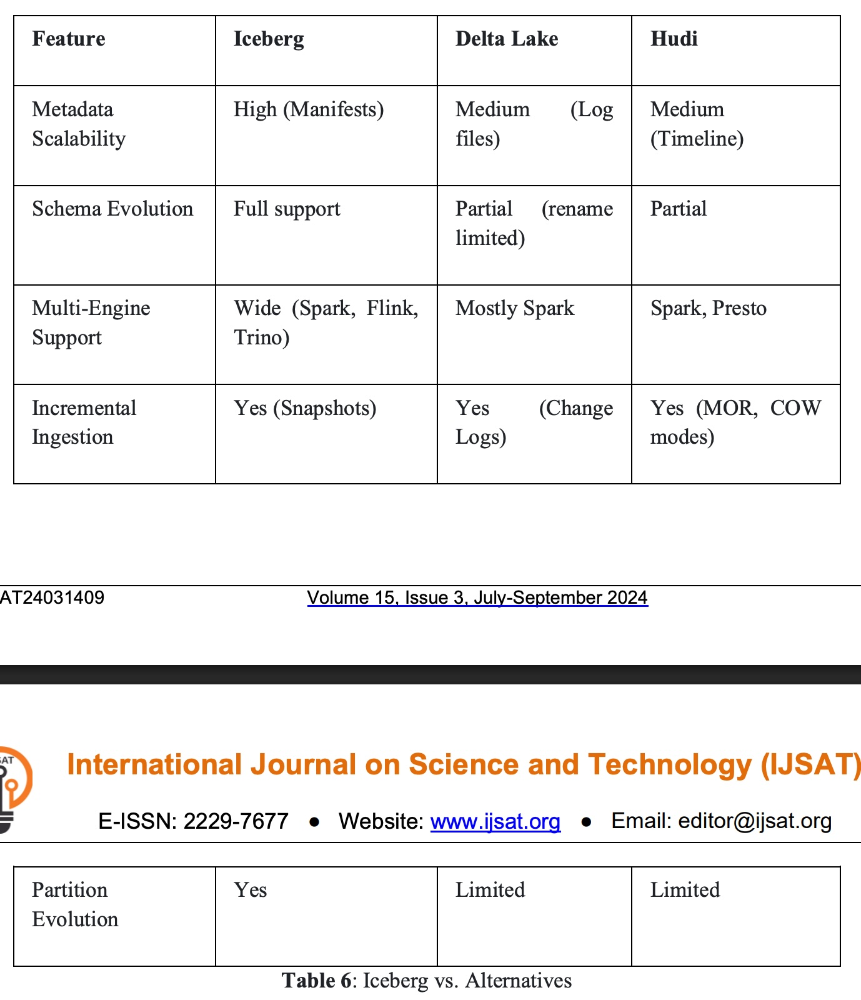
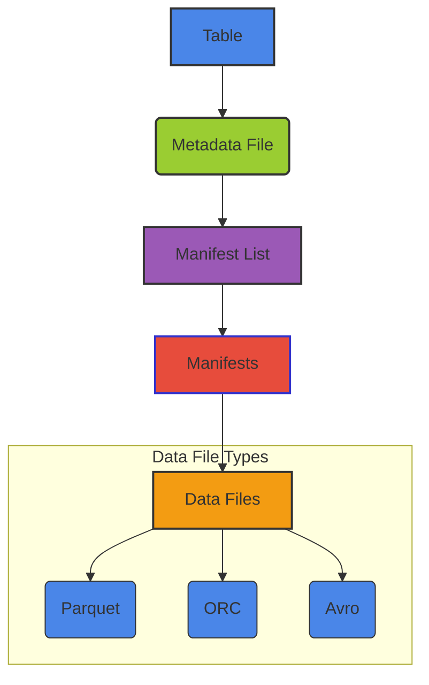

## AI论文解读 | Scalable Metadata Management in Data Lakes: The Role of Apache Iceberg
        
### 作者        
digoal        
        
### 日期        
2025-09-07        
        
### 标签        
PostgreSQL , PolarDB , DuckDB , AI , 论文解读        
        
----        
        
## 背景  
      
https://www.ijsat.org/papers/2024/3/1409.pdf        
  
提示:          
```          
读懂《Scalable Metadata Management in Data Lakes: The Role of Apache Iceberg》这篇论文需要提前掌握哪些基础知识, 请使用中文通熟易懂的讲解这些基础知识, 可以引用论文中的图、表或使用Markdown支持的图形(text,mermaid等)增加解释性. 
  
使用中文通熟易懂的解读《Scalable Metadata Management in Data Lakes: The Role of Apache Iceberg》这篇论文, 其中的关键内容请着重讲解, 可以引用论文中的图、表或使用Markdown支持的图形(text,mermaid等)增加解释性. 
  
提取《Scalable Metadata Management in Data Lakes: The Role of Apache Iceberg》这篇论文中的重要术语, 使用中文对这些术语进行通熟易懂的讲解, 可以引用论文中的图、表或使用Markdown支持的图形(text,mermaid等)增加解释性. 
```     
  
## 1 前置知识 
  
根据你提供的论文《Scalable Metadata Management in Data Lakes: The Role of Apache Iceberg》，要理解这篇论文的内容，你需要掌握以下几个核心基础知识。我会用通俗易懂的中文为你讲解，并结合论文内容进行说明。

### 1\. 数据湖（Data Lakes）

首先，你需要知道什么是**数据湖**。你可以把它想象成一个巨大的、原始的数据仓库，里面存放着各种各样的数据，包括结构化的（比如表格数据）、半结构化的（比如JSON、XML文件）和非结构化的（比如图片、视频）。

  * **为什么要用数据湖？** 论文中提到，数据湖的优势在于它能够将存储和计算解耦，并且可以大规模地存储数据，成本相对较低 。这使得企业可以先存储海量数据，之后再决定如何使用和分析它们。
  * **传统的数据仓库有什么不同？** 传统的数据仓库在存储数据前需要定义好严格的模式（schema），而数据湖采用“读时模式”（schema-on-read），这意味着你可以先存数据，查询时再定义模式 。这提供了更大的灵活性，但同时也带来了元数据管理的挑战，这也是这篇论文要解决的核心问题。

### 2\. 元数据（Metadata）

**元数据**就是“关于数据的数据”。它不包含实际的数据内容，而是描述数据的信息。在数据湖中，元数据至关重要，它决定了你如何找到、理解和使用数据。

  * **数据湖中需要管理哪些元数据？** 论文中列举了几个关键的元数据，比如：
      * **文件位置（File locations）**: 数据文件实际存储在哪里。
      * **模式（Schemas）**: 数据的结构是怎样的，包含哪些列，每列的数据类型是什么。
      * **分区布局（Partition layouts）**: 数据是如何被分区的，比如按日期、地区等。
      * **历史快照（Historical snapshots）**: 记录了数据在不同时间点的状态，用于“时间旅行查询”（time travel queries）。

### 3\. Hive 和 Hive Metastore

为了更好地理解 Iceberg 的优势，你需要知道它要解决的是什么问题。这篇论文提到，传统的元数据管理方法，比如基于 **Hive** 和 **Hive Metastore** 的方案，存在一些局限性 。

  * **Hive Metastore**: 它是一个外部目录，用来存储 Hive 表的元数据。
  * **局限性**: 传统的 Hive 模式依赖于目录结构来组织数据。当数据量和文件数量巨大时，这种方式会导致：
      * **查询规划变慢（Slow query planning）**: 查询引擎需要遍历大量目录来找到相关文件，这非常耗时 。论文中的图表“Query Planning Time vs. Data Size”很好地说明了这一点：随着数据量的增加，Hive Metastore 的查询规划时间呈线性增长，而 Iceberg 则保持相对平稳 。
      * **分区方案僵化（Rigid Partition Schemes）**: 如果你想改变分区方式，比如从按天分区改为按小时分区，需要手动进行大量工作，甚至可能导致现有查询失效 。
      * **模式演变困难（Difficult Schema Evolution）**: 比如增删列或修改列名，这些操作很容易出错，并且经常需要对整个表进行重写 。

### 4\. Apache Iceberg 的核心概念

现在，我们来看 Iceberg 如何解决这些问题。Iceberg 是一种**高性能的表格式**，它重新思考了元数据的存储和管理方式 。它将表本身视为一个自描述的对象，其核心概念包括：

#### 4.1. 元数据文件（Metadata File）和快照（Snapshots）

  * 每个 Iceberg 表都有一个**元数据文件**，它包含了表的当前模式、快照历史以及其他表级信息 。
  * 每次数据变更（比如追加新数据）都会生成一个新的**快照**。每个快照都记录了当时表的状态。这个特性使得**时间旅行查询**（查询历史数据）变得非常容易 。

#### 4.2. 清单列表（Manifest Lists）和清单文件（Manifest Files）

这是 Iceberg 架构中最重要的部分。论文中的图 1（Figure 1）可以帮助你理解这个层级结构 。   


  * **元数据文件（Metadata File）** 指向当前的**清单列表（Manifest List）** 。
  * **清单列表（Manifest List）** 包含了多个**清单文件（Manifests）** 。
  * **清单文件（Manifests）** 列出了属于该快照的所有**数据文件**，并且包含了这些文件的统计信息和分区信息 。

这种分层结构让查询引擎能够：

1.  首先读取一个很小的元数据文件，找到最新的快照。
2.  然后读取清单列表，找到相关的清单文件。
3.  最后，利用清单文件中的统计信息进行**谓词下推（predicate pushdown）** 和**分区裁剪（partition pruning）**，只读取包含需要的数据的那些清单文件和数据文件 。这大大减少了查询时的 I/O 和规划时间 。

#### 4.3. 分区演变（Partition Evolution）和模式演变（Schema Evolution）

Iceberg 成功地解决了 Hive 的痛点。

  * **分区演变**: Iceberg 将分区视为一个逻辑概念，与物理文件布局是分开的 。这意味着你可以在不重写现有数据的情况下，更改分区策略。例如，可以先按天分区，之后再切换为按小时分区，旧数据仍然可以被新查询高效访问 。
  * **模式演变**: 你可以轻松地进行增、删、改列等操作，而不需要重写整个表 。论文中的表格“Evolution Capabilities”（表 5）清晰地对比了 Iceberg 和传统方法的区别 。   

通过理解这些基础概念，你就能更好地掌握这篇论文的核心论点：**Apache Iceberg 通过其创新的元数据管理架构，解决了传统数据湖在大规模环境下遇到的性能和灵活性问题。**
  
## 2 解读论文 
  
好的，我们来一起通俗易懂地解读这篇关于 Apache Iceberg 的技术论文：《可扩展数据湖元数据管理：Apache Iceberg 的角色》。

这篇论文的核心思想是：随着数据越来越多，传统的数据湖技术在管理“数据的数据”（也就是元数据）方面遇到了巨大瓶颈，导致查询缓慢、维护困难 。而 Apache Iceberg 作为一种新型的表格格式，通过其创新的元数据管理方式，完美地解决了这些痛点 。

-----

### 第一部分：数据湖的“管理之痛”——传统方法的局限性

首先，我们需要理解什么是数据湖的“元数据管理”难题。

想象一下，一个巨大的图书馆，里面有数亿本书（数据文件）。

  * **传统方式 (类似 Hive 表)**：图书馆的管理方式很简单，就是在门口放一个登记本，记录“A区的书架上放着历史类书籍”、“B区放着科技类书籍”。但这种方式有很多问题：
      * **查找缓慢**：当你想找一本具体的书时，管理员需要先去对应的区域，然后一本一本地翻看书架上的所有书，才能找到你想要的 。当书的数量达到数百万甚至数十亿时，这个过程会变得极其缓慢 。
      * **难以调整**：如果想把“历史类”的书架换个位置，或者想把一个大书架分成几个小类，就需要把所有的书都搬动一遍，工程量巨大 。这在数据湖里被称为“分区变更困难”。
      * **信息更新麻烦**：如果一本书的内容有修改，或者增加了新的章节，更新登记信息会很麻烦，还容易出错 。这对应数据湖的“表结构变更困难”。

这些问题导致传统数据湖在数据量变大后，查询性能急剧下降，数据管理也变得异常复杂 。

-----

### 第二部分：Apache Iceberg 如何“对症下药”——核心概念与架构

Apache Iceberg 提出了一套全新的管理机制，彻底改变了游戏规则。它的核心思想是：**不要依赖物理位置（文件目录）来管理数据，而是为数据表本身建立一套精确、高效的“索引目录系统”** 。

我们可以通过论文中的**图1**来理解其架构，下面我用更直观的流程图来解释：   



  * **1. 元数据文件 (Metadata File)**：这是整个表的“总纲”或“目录首页” 。它是一个很小的文件，记录了表的当前结构（schema）、历史变更记录、当前指向哪个“快照”(snapshot)等核心信息 。查询引擎只需读取这一个文件，就能了解表的全局情况，避免了扫描海量目录 。

  * **2. 快照 (Snapshot)**：Iceberg 中每一次对表的修改（增加、删除、更新数据），都会生成一个新的“快照” 。快照本身是不可变的，它代表了表在某个时间点的完整状态 。这就像是给图书馆在每天关门时拍一张完整的照片，记录下所有书的位置。这个机制是实现“时间旅行”（查询历史数据）的基础 。

  * **3. 清单列表 (Manifest List)** 和 **清单文件 (Manifest)**：这是 Iceberg 高效查询的关键。

      * 一个**快照**会指向一个**清单列表** 。
      * 这个**清单列表**里记录了多个**清单文件**的路径 。
      * 每个**清单文件**则具体记录了一批数据文件的路径、文件大小、分区信息，甚至每列的最大/最小值等统计信息 。

**这个三层结构（元数据文件 -\> 清单列表 -\> 清单文件）就像一个高度优化的索引**。当你要查询某个特定条件的数据时，查询引擎可以：

1.  读取**元数据文件**，找到当前快照。
2.  通过快照找到**清单列表**。
3.  根据查询条件（比如日期范围），在清单列表和清单文件中快速过滤掉大量不相关的清单文件和数据文件。
4.  最后，只读取极少数相关的**数据文件**。

这个过程避免了对所有文件的扫描，大大提升了查询规划的速度 。

-----

### 第三部分：Iceberg 带来的革命性优势

基于以上架构，Iceberg 带来了几个显著的好处：

#### 1\. 闪电般的查询规划

传统方法需要遍历文件目录来确定要读哪些文件，当文件数达到百万级时，这个过程可能需要几分钟甚至更久 。Iceberg 只需读取几个小的元数据和清单文件，就能快速定位数据，将查询规划时间从分钟级缩短到秒级 。

论文中的**图3**直观地展示了这种性能差异：   

  * 这张图显示，随着数据总量的增加（横轴），基于 Hive Metastore 的传统方法其查询规划时间（纵轴）呈快速增长趋势 。
  * 而 Iceberg 的查询规划时间增长则非常平缓，始终保持在很低的水平，展现了其卓越的可扩展性 。

#### 2\. 灵活的“进化”能力

数据表在使用过程中总会发生变化，Iceberg 对此提供了强大的支持。论文中的**表5**清晰地对比了传统方法和 Iceberg 在处理这些变化时的差异：   

| 操作 | 传统方法 | Iceberg 方法 |
| :--- | :--- | :--- |
| **增加列** | 需要重写整个表的数据 | 只更新元数据中的表结构信息  |
| **删除列** | 复杂的数据迁移 | 增量式的元数据变更  |
| **重命名列** | 通常不支持或风险极高 | 仅更新元数据  |
| **更改分区** | 需要重写所有分区数据 | 元数据层面的变更，无需重写旧数据  |

  * **表结构演进 (Schema Evolution)**：在 Iceberg 中，增加、删除、重命名列等操作，都只是修改元数据文件中的记录，而不需要改动任何已存在的数据文件 。这使得表结构变更的成本极低且安全。
  * **分区演进 (Partition Evolution)**：Iceberg 将分区的逻辑与物理文件布局解耦 。你可以随时更改分区策略（例如，从按天分区改为按小时分区），而无需重写历史数据 。新旧数据可以使用不同的分区策略共存，查询时 Iceberg 会智能地处理 。

#### 3\. “时间旅行”与 ACID 事务

  * **时间旅行 (Time Travel)**：由于每次变更都会产生一个包含历史指针的快照，你可以轻松地查询到表在过去任意时间点的状态 。这对于数据回溯、审计和 A/B 测试结果复现等场景非常有用 。
  * **ACID 事务**：Iceberg 的提交操作是原子性的：通过原子地更新元数据文件指向的快照ID，一次写入操作要么完全成功，要么完全失败 。这保证了即使在并发读写的情况下，数据消费者也总能读到一致、完整的快照数据 。

-----

### 第四部分：Iceberg 与其他技术的对比

论文中也提到了 Iceberg 与另外两个主流数据湖表格格式 Delta Lake 和 Hudi 的对比。**表6** 总结了它们之间的关键区别：   

| 特性 | Iceberg | Delta Lake | Hudi |
| :--- | :--- | :--- | :--- |
| **元数据可扩展性** | 高（清单文件机制）  | 中等（日志文件）  | 中等（时间轴）  |
| **表结构演进** | 完全支持  | 部分支持（重命名受限）  | 部分支持  |
| **多引擎支持** | 广泛 (Spark, Flink, Trino)  | 主要集中于 Spark  | Spark, Presto  |
| **分区演进** | 支持  | 有限  | 有限  |

可以看出，Iceberg 在元数据扩展性、表结构演进的灵活性以及对多计算引擎的广泛支持方面具有明显优势 。

-----

### 第五部分：真实世界的应用案例

论文列举了几个真实的工业界应用场景来证明 Iceberg 的价值：

  * **Netflix 的流式分析**：作为 Iceberg 的创始者，Netflix 用它处理每天 PB 级的用户行为和视频日志数据，实现了在海量数据集上的秒级查询 。
  * **电商用户行为分析**：某电商平台利用 Iceberg 的时间旅行功能，可以方便地回溯到上周的数据状态，进行精准的 A/B 测试对比 。
  * **物联网（IoT）传感器数据湖**：在处理数百万设备的传感器数据时，工程师可以根据业务发展动态调整分区策略，而无需重写历史数据，同时增量扫描功能保证了近实时仪表盘的快速刷新 。

### 总结

这篇论文系统地阐述了 Apache Iceberg 如何通过其创新的元数据管理架构（元数据文件 + 快照 + 清单文件的层次结构），从根本上解决了传统数据湖在可扩展性、性能和灵活性方面的核心痛点 。

**简单来说，Iceberg 为混乱的数据湖带来了秩序，它为每一张数据表都建立了一个清晰、高效、可追溯的“档案系统”。** 这使得企业能够构建和运维支持动态分析和不断演进的业务需求的下一代数据湖 。
  
## 3 术语 
  
以下是论文《Scalable Metadata Management in Data Lakes: The Role of Apache Iceberg》中的重要术语，并附上通俗易懂的中文解释。

-----

### 1\. 数据湖（Data Lakes）

数据湖是一种灵活的存储解决方案，能够大规模地存储各种类型的数据，包括结构化、半结构化和非结构化数据 。你可以把它想象成一个巨大的湖泊，可以容纳任何形态的数据。与传统数据仓库不同的是，数据湖采用**读时模式（schema-on-read）**，这意味着你可以在数据被查询时才定义其模式，这为大规模数据存储和分析提供了极大的灵活性 。

### 2\. 元数据（Metadata）

元数据是“关于数据的数据”，它描述了数据本身的信息，而不是数据内容 。在数据湖中，元数据至关重要，它包含了文件位置、数据模式、分区布局、统计信息以及历史快照等 。当数据湖的规模增长到 PB 级别，并且数据文件达到数十亿个时，高效地管理这些元数据就成为一个巨大的挑战 。

### 3\. Hive 表（Hive Tables）

Hive 是一个用于管理大数据集的传统数据湖架构。它通常依赖于文件系统的目录结构来存储和管理元数据 。然而，这种方法存在一些局限性，比如：

  * **目录列表慢（Slow Directory Listing）**：当文件数量非常多时，查询引擎需要列出大量文件来找到相关数据，这会增加查询规划的开销 。
  * **分区方案僵化（Rigid Partition Schemes）**：更改分区列或格式需要手动操作，并且可能使现有查询失效 。
  * **模式演变困难（Difficult Schema Evolution）**：修改表模式（如增删字段）容易出错，并且通常需要完全重写数据 。

### 4\. Apache Iceberg

Apache Iceberg 是一种为数据湖设计的高性能表格式，它从根本上重新构想了元数据的存储、索引和演变方式 。它将元数据作为 **一等公民（first-class data）** 进行处理 。

### 5\. 核心概念

#### 5.1. 快照（Snapshots）

**快照**是表格数据和元数据在特定时间点的版本 。每次数据变更（如数据追加）都会创建一个新的快照 。这使得 **时间旅行查询（Time Travel Queries）** 成为可能，即用户可以查询历史版本的数据 。

#### 5.2. 清单列表（Manifest Lists）和清单文件（Manifest Files）

这是 Iceberg 元数据结构的核心。论文中的图 1（Figure 1）清楚地展示了它们之间的关系。   



  * **元数据文件（Metadata File）**：包含了表级别的元信息，如当前模式和快照历史 。
  * **清单列表（Manifest List）**：它是一个 Avro 文件，包含了多个清单文件的引用 。
  * **清单文件（Manifest File）**：也是一个 Avro 文件，它列出了包含在该快照中的具体数据文件，并附带了统计信息和分区信息 。

这种分层结构使查询引擎能够快速定位相关数据文件，避免了昂贵的全目录扫描 。论文中的图 3（Figure 3）表明，随着数据量的增加，Iceberg 的查询规划时间保持相对平稳，而 Hive Metastore 的规划时间则会显著增加 。   

### 6\. 演变能力（Evolution Capabilities）

Iceberg 的核心优势在于其强大的演变能力，它解决了传统方法的痛点。论文中的表格“Evolution Capabilities”（表 5）对此进行了详细对比：   

| Action | Traditional Approach | Iceberg Approach |
| :--- | :--- | :--- |
| **Add Column** | Full table rewrite | Update schema in metadata  |
| **Drop Column** | Complex migrations | Incremental metadata change  |
| **Rename Column** | Often unsupported or risky | Metadata update only  |
| **Change Partitioning** | Rewrite partitions | Metadata-level partition spec change  |

  * **模式演变（Schema Evolution）**：Iceberg 支持在不重写整个表的情况下，添加、删除、重命名列或改变数据类型 。
  * **分区演变（Partition Evolution）**：Iceberg 将分区视为一个逻辑概念，允许随着时间改变分区策略，而无需重写现有数据 。例如，可以先按天分区，再切换为按小时分区，新旧数据都可以被高效查询 。
  
## 参考        
         
https://www.ijsat.org/papers/2024/3/1409.pdf    
        
<b> 以上内容基于DeepSeek、Qwen、Gemini及诸多AI生成, 轻微人工调整, 感谢杭州深度求索人工智能、阿里云、Google等公司. </b>        
        
<b> AI 生成的内容请自行辨别正确性, 当然也多了些许踩坑的乐趣, 毕竟冒险是每个男人的天性.  </b>        
  
  
  
#### [期望 PostgreSQL|开源PolarDB 增加什么功能?](https://github.com/digoal/blog/issues/76 "269ac3d1c492e938c0191101c7238216")
  
  
#### [PolarDB 开源数据库](https://openpolardb.com/home "57258f76c37864c6e6d23383d05714ea")
  
  
#### [PolarDB 学习图谱](https://www.aliyun.com/database/openpolardb/activity "8642f60e04ed0c814bf9cb9677976bd4")
  
  
#### [PostgreSQL 解决方案集合](../201706/20170601_02.md "40cff096e9ed7122c512b35d8561d9c8")
  
  
#### [德哥 / digoal's Github - 公益是一辈子的事.](https://github.com/digoal/blog/blob/master/README.md "22709685feb7cab07d30f30387f0a9ae")
  
  
#### [About 德哥](https://github.com/digoal/blog/blob/master/me/readme.md "a37735981e7704886ffd590565582dd0")
  
  

  
