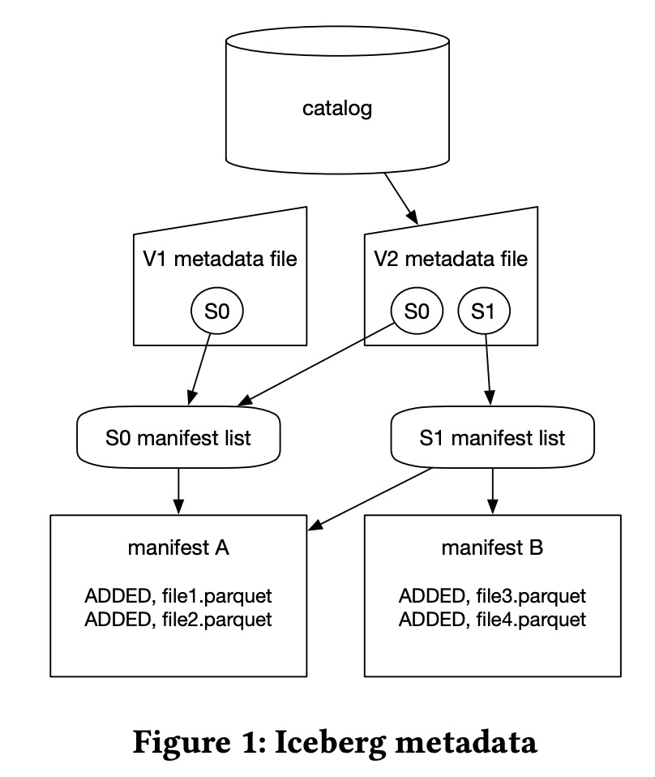
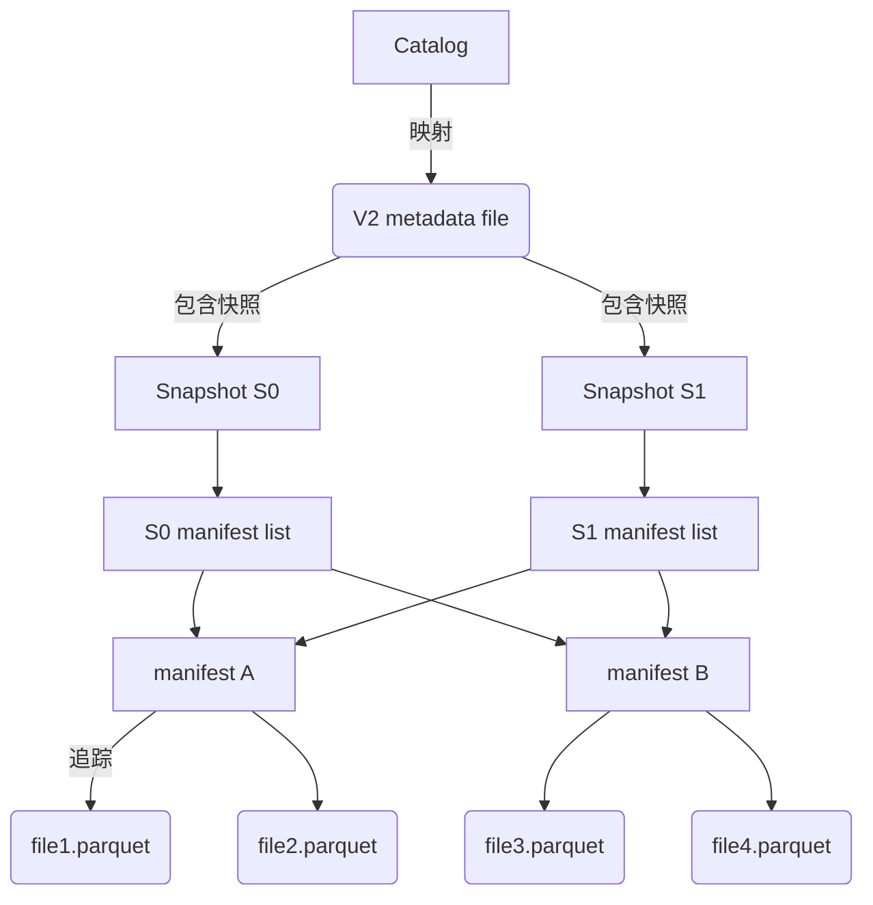
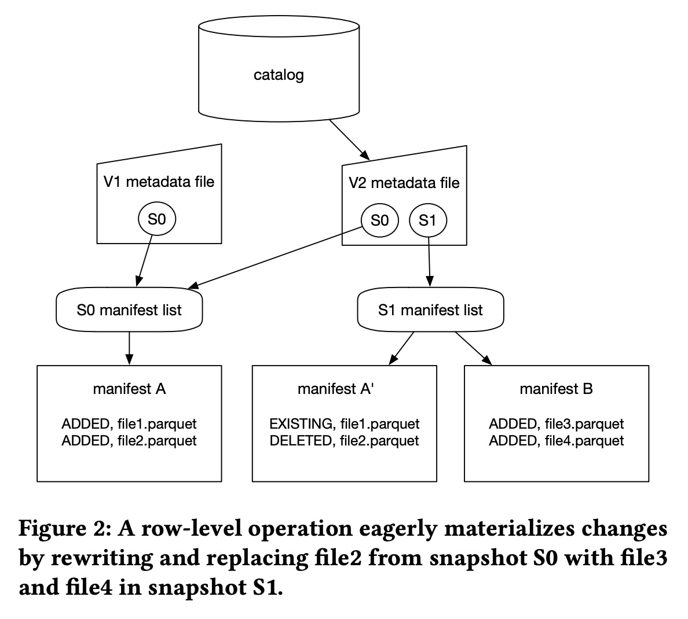
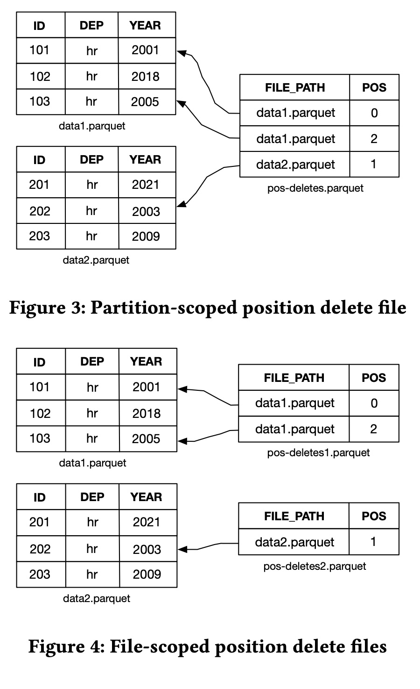
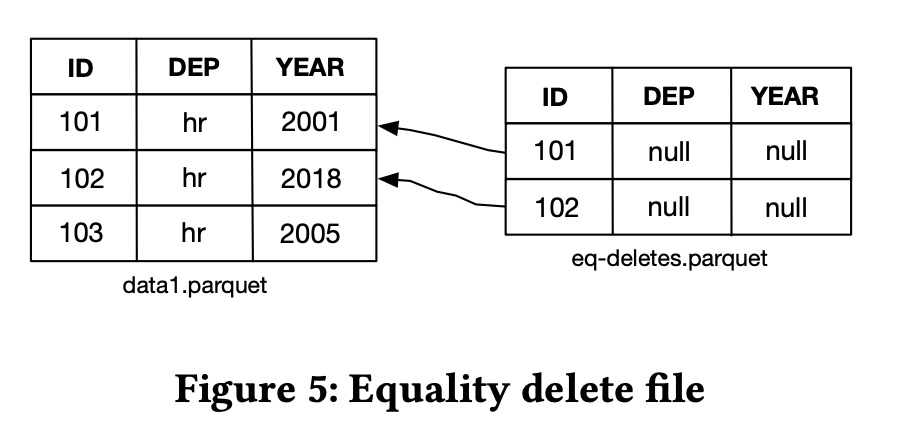
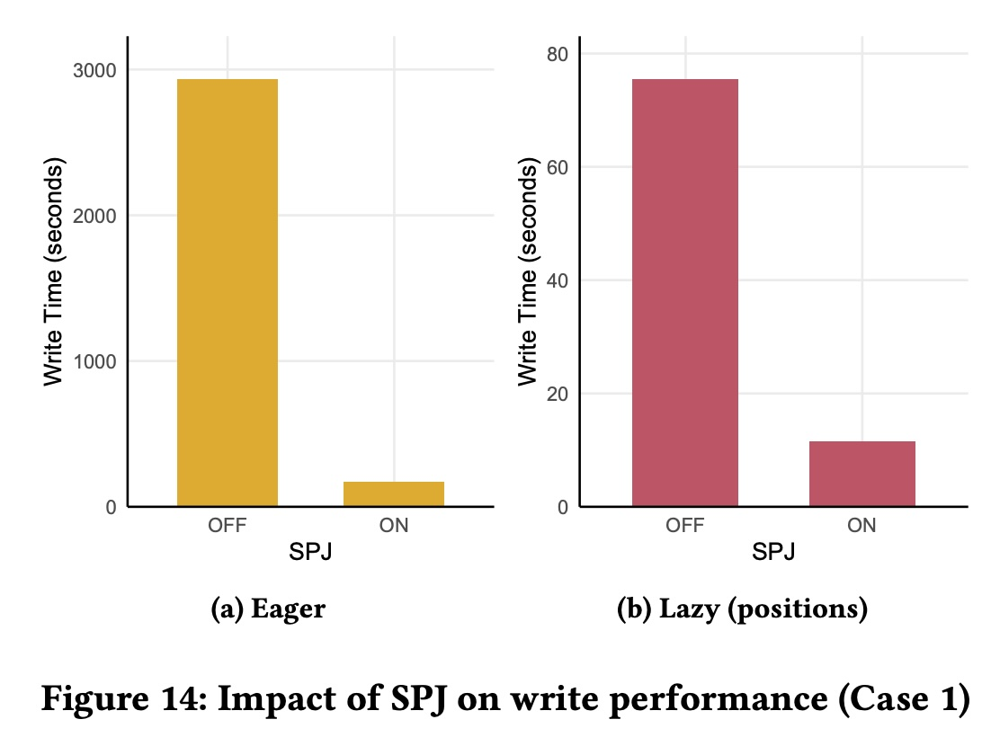
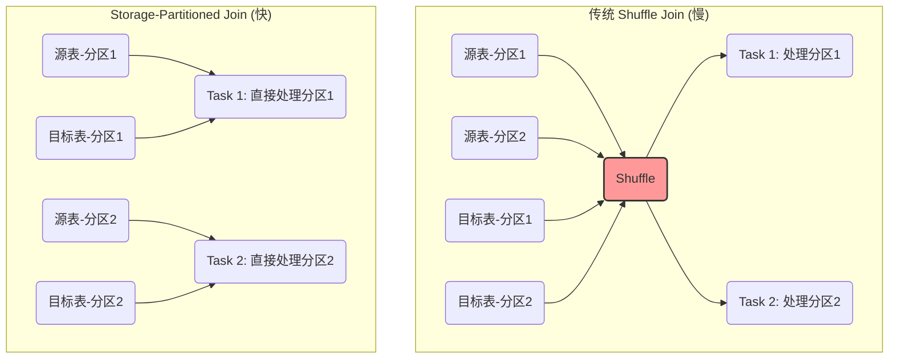
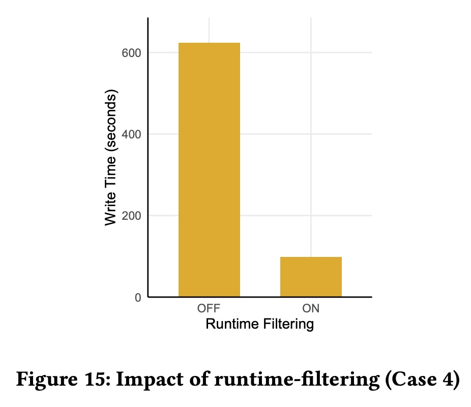
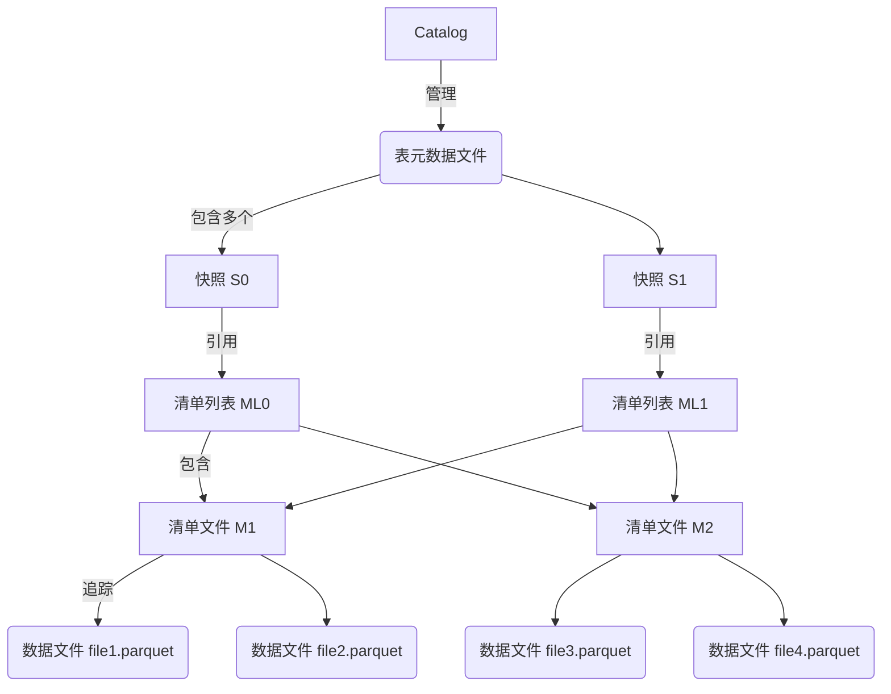

## AI论文解读 | Petabyte-Scale Row-Level Operations in Data Lakehouses
        
### 作者        
digoal        
        
### 日期        
2025-09-07        
        
### 标签        
PostgreSQL , PolarDB , DuckDB , AI , 论文解读        
        
----        
        
## 背景  
      
https://www.vldb.org/pvldb/vol17/p4159-okolnychyi.pdf        
  
提示:          
```          
读懂《Petabyte-Scale Row-Level Operations in Data Lakehouses》这篇论文需要提前掌握哪些基础知识, 请使用中文通熟易懂的讲解这些基础知识, 可以引用论文中的图、表或使用Markdown支持的图形(text,mermaid等)增加解释性. 
  
使用中文通熟易懂的解读《Petabyte-Scale Row-Level Operations in Data Lakehouses》这篇论文, 其中的关键内容请着重讲解, 可以引用论文中的图、表或使用Markdown支持的图形(text,mermaid等)增加解释性. 
  
提取《Petabyte-Scale Row-Level Operations in Data Lakehouses》这篇论文中的重要术语, 使用中文对这些术语进行通熟易懂的讲解, 可以引用论文中的图、表或使用Markdown支持的图形(text,mermaid等)增加解释性. 
```     
  
## 1 前置知识 
  
要读懂《Petabyte-Scale Row-Level Operations in Data Lakehouses》这篇论文，您需要提前掌握以下几个核心基础知识。这篇论文主要围绕 **Data Lakehouse** 架构、其核心技术 **Apache Iceberg** 和 **Apache Spark**，以及如何在这之上实现高效的行级别操作展开。

-----

### 1\. 数据架构：从数据湖到数据仓库再到数据湖仓一体

首先，您需要了解 **数据湖（Data Lake）** 和 **数据仓库（Data Warehouse）** 的概念，以及它们各自的优缺点 。

  * **数据湖**: 优点是能以几乎无限的规模存储海量、多样的数据，并支持各种工具进行分析 。然而，早期的开源数据湖（如基于 Hive 的架构）通常牺牲了事务一致性和易用性来换取可扩展性和容错性 。它们缺乏事务保障，容易因并发修改而导致数据损坏 。
  * **数据仓库**: 优点是提供可靠性、事务一致性和强大的 SQL 功能 。但其缺点是通常依赖于专有格式，无法共享存储，且分析能力受限于特定的查询引擎 。
  * **数据湖仓一体（Data Lakehouse）**: 这种架构结合了数据湖的无限可扩展性和多样化工具，以及数据仓库的可靠性和功能性 。它通过像 **Iceberg** 这样的开放表格式，在数据湖之上实现了 ACID 事务等数据仓库特性，允许不同的查询引擎在不影响性能和一致性的前提下并发访问同一张表 。

简而言之，数据湖仓一体就是用**开放标准**的方式，把数据仓库的功能带给了数据湖。

-----

### 2\. Apache Iceberg 的元数据架构

Apache Iceberg 是这篇论文的核心，它解决了早期数据湖的痛点。理解其元数据（Metadata）布局至关重要。

Iceberg 的元数据结构是一种持久化的树状数据结构 。每次对表进行修改（如添加数据文件），都会生成一个新的元数据树，并通过原子操作更新指向新元数据文件的指针，确保了历史记录的线性一致性 。

下面通过论文中的图1（稍作修改）来帮助您理解：   



  * **Catalog (目录)**: 它是表的入口点，将表名映射到最新的根元数据文件 。
  * **Metadata file (元数据文件)**: 它包含表的模式（schema）、分区规范、排序顺序以及有效的快照列表等信息 。
  * **Snapshot (快照)**: 它提供了表在某个时间点的只读视图，包含读取表所需的所有文件列表 。
  * **Manifest List file (清单列表文件)**: 它索引了某个快照下的所有清单文件 。
  * **Manifest file (清单文件)**: 它跟踪快照中的数据文件，并包含每个数据文件的位置、列统计信息和分区值等元数据 。
  * **Data file (数据文件)**: 实际存储数据的文件。

Iceberg 的设计关键在于，一个清单文件可以属于多个快照，这样当表发生修改时，无需重写所有未更改的元数据，从而能够快速生成新快照 。

-----

### 3\. Iceberg 的行级别操作策略

论文的核心在于解释 Iceberg 如何支持高效的 `DELETE`, `UPDATE`, 和 `MERGE` 操作，它提供了两种主要策略：

#### 3.1 预先物化（Eager Materialization），也称写时复制（Copy-on-Write）

  * **工作原理**: 它通过重写和替换需要修改的数据文件来物化变更 。
  * **优点**: 简单，读取时没有额外的开销 。它特别适合大规模批量更新，因为修改在写入时一次性完成 。
  * **缺点**: 对于稀疏更新（仅修改少量行）效率低下，因为即使只修改一行，也必须重写整个数据文件，导致**写放大（write amplification）** 。
  * **论文图2示例（Eager Materialization）**:   
      * 在 S0 快照中，存在 `file1.parquet` 和 `file2.parquet`。
      * 当需要对 `file2.parquet` 中的数据进行修改时，Iceberg 不会直接修改它，而是将修改后的数据写入新的数据文件 `file3.parquet` 和 `file4.parquet`。
      * 在 S1 快照中，Iceberg 用 `file3.parquet` 和 `file4.parquet` 替换了 `file2.parquet`，而 `file1.parquet` 保持不变 。

#### 3.2 延迟物化（Lazy Materialization），也称读时合并（Merge-on-Read）

  * **工作原理**: 由于数据文件是不可变的，该策略依赖于 **删除文件（delete files）** 来标记需要删除的行 。读取数据时，查询引擎会将这些差异与现有数据文件合并，以获得一致的表视图 。
  * **优点**: 对于稀疏更新非常高效 。
  * **缺点**: 读取时需要额外的合并开销，性能会受到影响 。

论文详细介绍了两种删除文件类型：

  * **位置删除文件（Position Delete Files）**: 包含需要删除的**文件路径**和**行在文件中的位置**列表 。它像一个索引，直接指向要删除的行，开销通常较低 。
  * **相等删除文件（Equality Delete Files）**: 通过一个或多个**列值**来标记需要删除的行 。读取器必须比较数据文件和删除文件中的列值来确定要删除哪些行，开销相对较高 。

-----

### 4\. Apache Spark 优化

除了 Iceberg，这篇论文还讨论了对 Apache Spark 的改进，这些改进对于在**PB 级别**实现高效行级操作至关重要 。

  * **Storage-Partitioned Joins (SPJ)**: 这种技术通过利用 Iceberg 的分区信息，在表连接（join）操作中避免了昂贵的**数据混洗（shuffle）**，从而显著提高了性能 。传统的数据混洗需要将数据在网络中重新分区和传输，是分布式处理中的常见瓶颈 。
  * **Runtime Filtering (运行时过滤)**: Spark 在运行时动态地过滤数据，减少了需要处理和重写的数据量 。这对于**预先物化**策略尤为重要，因为它确保 Iceberg 只重写那些真正包含需要修改的行的数据文件，避免了不必要的开销 。
  * **Adaptive Writes (自适应写入)**: 论文也提到了如何优化输出数据的布局 。这包括控制记录的排序和集群分布，以提高后续查询的性能 。
  
## 2 解读论文 
  
好的，很乐意为您解读这篇在数据工程领域非常重要的论文——《Petabyte-Scale Row-Level Operations in Data Lakehouses》。

这篇论文由苹果公司的工程师团队撰写，主要介绍了他们如何通过扩展开源项目 Apache Iceberg 和 Apache Spark，实现在 PB (Petabyte, 千万亿字节) 级别超大规模数据集上的高效行级操作（如 `UPDATE`, `DELETE`, `MERGE`）。

-----

### **核心思想概览**

想象一下，你有一个巨大的图书馆，藏书上亿册（相当于 PB 级数据）。现在，你的任务不是增加新书，而是在已有的书中找出特定的几页，修改几个错别字。

传统的“数据湖”技术处理这个问题的方式非常笨拙：

  * **找到包含错别字的那几本书（分区）。**
  * **把这几本书完整地复制一份。**
  * **在新复制的书里修正错别字。**
  * **用修正后的新书替换掉原来的旧书。**

如果只是改几个字，却要复制重写整本书，这个成本无疑是巨大的。这就是早期数据湖在行级操作上面临的困境。

这篇论文的核心贡献就是，**为这个“图书馆”设计了一套更智能、更高效的“勘误”系统**，它提供了两种截然不同的策略来应对不同的修改场景，并通过一系列对计算引擎 Spark 的深度优化，让整个过程快如闪电。

-----

### **关键内容深度解析**

我们可以将论文的精华提炼为 **“两大策略”** 和 **“三大优化”**。

#### **两大策略：如何记录和应用变更**

论文提出了两种截然不同的变更实现策略，用户可以根据自己的业务场景灵活选择。

##### 策略一：写时复制 (Copy-on-Write) - “快刀斩乱麻”

这种策略也叫**即时物化 (Eager Materialization)**，它的工作方式就如同我们上面提到的传统方法：直接重写包含变更的数据文件 。

  * **工作流程**：

    1.  **定位**：找到需要修改的行所在的数据文件。
    2.  **读取**：将这些文件中的所有数据（包括未被修改的行）读入内存。
    3.  **合并**：在内存中应用变更（更新或删除指定的行）。
    4.  **写回**：将合并后的结果写成一个或多个新的数据文件。
    5.  **提交**：在 Iceberg 的元数据中，将旧文件标记为“已删除”，并将新文件标记为“已添加”，完成一次原子性的替换 。

    论文中的 **图 2** 直观地展示了这个过程：`snapshot S0` 中的 `file2.parquet` 文件被修改，系统生成了新的 `file3.parquet` 和 `file4.parquet` 文件来替换它，最终生成了新的 `snapshot S1` 。   

  * **优点**：

      * **读取性能极佳**：因为所有变更都已“固化”到新的数据文件中，查询时不需要任何额外的合并操作，读取速度和普通的表一样快 。
      * **无需额外维护**：不会产生额外的“补丁”文件，表结构干净 。

  * **缺点**：

      * **写入成本高（写放大）**：即使只修改一个文件中的一行数据，也必须重写整个文件，导致大量的 I/O 操作 。

  * **适用场景**：

      * **批量更新**：当一次操作需要修改一个文件中大部分数据时，这种策略最划算。例如，每天一次的大批量数据修正作业 。

##### 策略二：读时合并 (Merge-on-Read) - “精打细算”

这种策略也叫**惰性物化 (Lazy Materialization)**，它引入了一种更聪明的机制：不直接修改原始数据，而是将“变更”记录在单独的**删除文件 (Delete Files)** 中 。当用户查询数据时，系统再将原始数据和这些删除文件进行合并，实时计算出最终结果 。

Iceberg 设计了两种类型的删除文件：

1.  **位置删除文件 (Position Deletes)**

      * **原理**：像一个精确的“勘误表”，记录了“哪个文件”的“第几行”需要被删除 。
      * **图示**：论文中的 **图 3** 和 **图 4** 展示了位置删除文件如何通过 `(FILE_PATH, POS)` 来精确定位到要删除的行 。   
      * **优点**：读取时合并成本低。因为位置信息非常明确，可以快速地过滤掉被删除的行 。
      * **缺点**：写入时需要先扫描原数据文件，找到待删除行的具体位置，因此写入过程相对较慢 。

2.  **等值删除文件 (Equality Deletes)**

      * **原理**：记录了需要被删除的行的“关键列的值”。例如，记录 `id = 101` 的行需要被删除 。
      * **图示**：论文中的 **图 5** 展示了等值删除文件如何通过 `ID` 列的值来标记删除 。   
      * **优点**：写入速度极快。因为它不需要扫描原始数据来定位，可以直接生成删除文件 。
      * **缺点**：读取时合并成本高。系统需要在读取数据时，将数据文件的行与删除文件的行按关键列进行比较（类似 Join 操作），开销较大 。


  * **适用场景**：
      * **稀疏、高频的更新**：例如，流式数据处理中，每秒钟只有少量数据需要更新或删除。此时，重写整个文件得不偿失 。

| 特性 | 写时复制 (Copy-on-Write) | 读时合并 (Merge-on-Read) - 位置删除 | 读时合并 (Merge-on-Read) - 等值删除 |
| :--- | :--- | :--- | :--- |
| **写入性能** | 慢 (写放大严重) | 中等 (需扫描定位) | 快 (无需扫描) |
| **读取性能** | 快 (无额外开销) | 中等 (合并开销小) | 慢 (合并开销大) |
| **核心机制** | 重写整个数据文件 | 记录 `(文件路径, 行号)` | 记录被删除行的 `(列值)` |
| **最佳场景** | 大批量、低频次更新 | 中等频率、少量更新 | 高频率、极少量更新 (流式) |

-----

#### **三大优化：让 Spark 引擎快如闪电**

为了让上述策略能够在 PB 级数据上真正高效运行，论文团队对 Spark 引擎做了三大关键增强。

##### 1\. 存储分区连接 (Storage-Partitioned Joins - SPJ)

这是**论文中最重要的性能优化**，带来了“数量级”的提升 。

  * **背景**：行级操作（特别是 `MERGE`）本质上是一次源数据（变更）和目标表（原数据）的连接 (Join) 操作。在分布式系统中，默认的连接方式是 **Shuffle Join**，需要将两边的数据在网络中大规模传输和重分区，这个过程非常昂贵，是主要的性能瓶瓶颈 。
  * **SPJ 原理**：如果源表和目标表具有相同或兼容的分区方式（例如都按日期分区），SPJ 就能**完全避免 Shuffle** 。Spark 可以智能地将两张表中相同分区的数据块直接发送到同一个计算节点上执行连接，省去了昂贵的网络传输和排序 。
  * **效果**：论文中的 **图 14** 显示，在启用 SPJ 后，无论是写时复制还是读时合并策略，写入性能都提升了**大约 10 倍** 。   

我们可以用下面的 Mermaid 图来形象地理解这个过程：



##### 2\. 运行时过滤 (Runtime Filtering)

  * **背景**：在使用“写时复制”策略时，我们不希望为一个文件中可能不存在的匹配项而重写整个文件。
  * **原理**：在正式执行昂贵的连接和重写操作之前，Spark 会先用一个轻量级的操作（例如构建一个布隆过滤器或 ID 集合）快速扫描变更数据，然后用这个结果去**动态地过滤**目标表 。这样，只有那些**确定**包含待修改数据的数据文件才会被读取和重写，大大减少了不必要的 I/O 。
  * **效果**：**图 15** 表明，对于稀疏更新，运行时过滤能显著减少需要重写的数据量，从而大幅提升性能 。   

##### 3\. 自适应写入 (Adaptive Writes)

  * **背景**：行级操作后生成的新文件大小可能不均匀，出现很多小文件，这会严重影响后续的查询性能。
  * **原理**：这项优化利用了 Spark 的自适应查询执行 (AQE) 框架，允许 Iceberg 在写入数据的最后阶段，根据实际的数据量和分布情况，**动态地调整并行度（即输出文件的数量）**，以确保生成大小均匀、布局合理的数据文件 。

-----

### **实验与结论**

论文通过在 TPC-DS 基准测试（1000 缩放因子，约 2.8 亿行数据）上模拟了三种典型的业务场景，得出了清晰的结论：

1.  **流式场景 (极稀疏更新)**：**读时合并（等值删除）** 的写入性能最佳，因为它完全不依赖于目标表的大小 。但其读取性能会随着删除文件的增多而下降 。
2.  **微批处理场景 (少量更新)**：**读时合并（位置删除）** 是一个很好的平衡点，写入速度远快于写时复制，同时读取性能下降也比等值删除慢得多 。
3.  **批量处理场景 (密集更新)**：当更新触及一个分区中超过 50% 的记录时，**写时复制** 的性能反超了读时合并 。因为此时重写整个文件的成本，已经低于维护和合并大量删除文件的成本。

**最终结论**：**不存在一种万能的策略**。一个成熟的数据湖仓系统必须同时支持多种物化策略，并辅以强大的查询引擎优化，才能灵活高效地应对各种复杂的业务需求 。

### **总结**

这篇论文不仅仅是一次技术实现，它为整个数据湖仓领域如何解决“修改”这一核心难题，提供了一套完整、高性能且经过生产环境验证的“参考答案”。它通过在 Iceberg 层面设计灵活的 **Copy-on-Write** 和 **Merge-on-Read** 策略，并在 Spark 层面通过 **SPJ**、**运行时过滤**等优化手段，成功地将数据仓库级别的强大功能，无缝地融入到了开放、可扩展的数据湖生态中，是数据湖仓 (Data Lakehouse) 理念走向成熟的关键一步。
  
## 3 术语 
  
《Petabyte-Scale Row-Level Operations in Data Lakehouses》这篇论文主要围绕数据湖仓一体架构和 Apache Iceberg 展开。下面为您总结并讲解论文中的几个重要术语，帮助您更好地理解这篇论文。

-----

### 1\. 数据湖仓一体 (Data Lakehouse)

  * **通俗解释**: 数据湖仓一体是一种新型的数据架构，它结合了**数据湖**（可以存储海量、多样化原始数据）和**数据仓库**（可以提供可靠、高性能的分析能力）的优点。
  * **它解决了什么问题**: 传统的数据湖虽然便宜且灵活，但缺乏事务能力（ACID），这意味着在多个用户同时读写时，数据可能会不一致或损坏。数据湖仓一体通过在数据湖之上增加一个“表格式”（如 Apache Iceberg），赋予了数据湖像数据仓库一样的可靠性和高性能，同时又保留了数据湖的开放性和低成本。

### 2\. Apache Iceberg

  * **通俗解释**: Iceberg 是一种开源的**表格式（Table Format）**，可以理解为数据湖上的“目录索引”。它不存储实际数据，而是记录了数据湖中哪些数据文件属于哪张表，以及每个文件的元数据（如大小、行数、分区信息等）。
  * **论文重点**: 论文详细介绍了 Iceberg 的**元数据架构**。这种架构采用分层设计，每次对表的修改都会生成一个新的**快照（Snapshot）**，这个快照记录了新旧数据文件的变动，并以原子操作的方式更新。

下面通过一个简化的 Mermaid 图来解释它的层级结构：



  * **表元数据文件 (Table Metadata File)**：表的总目录，记录了所有历史快照。
  * **快照 (Snapshot)**：表在某一时间点的完整视图，相当于“拍照”。
  * **清单列表 (Manifest List)**：快照的索引，指向所有**清单文件**。
  * **清单文件 (Manifest File)**：记录了一组**数据文件**及其元数据，如文件路径、行数、分区等。
  * **数据文件 (Data File)**：实际存储数据的文件。

Iceberg 的这种设计使得不同快照可以共享清单文件，从而让**快照的创建非常快**，并且可以高效地实现**时间旅行（time travel）**，即回溯到历史版本。

-----

### 3\. 行级别操作 (Row-Level Operations)

  * **通俗解释**: 指对表中的单行或多行数据进行修改的操作，主要包括 **DELETE (删除)**、**UPDATE (更新)** 和 **MERGE (合并)**。在 PB 级别（千兆字节）的数据上高效地执行这些操作是论文的核心挑战。

论文介绍了两种处理策略：

#### 3.1 写时复制 (Copy-on-Write) / 预先物化 (Eager Materialization)

  * **工作原理**: 这种策略就像“抄写本”，当你需要修改一个数据文件中的某一行时，Iceberg 会把整个数据文件**重写**，只保留未修改的行，然后把修改过的行写入新的数据文件中。
  * **优点**: 读取数据时非常快，因为所有修改都已在写入时完成，无需额外的处理。
  * **缺点**: 如果只修改少数几行，却要重写一个巨大的数据文件，会造成大量的磁盘 I/O，这被称为**写放大 (Write Amplification)**。

#### 3.2 读时合并 (Merge-on-Read) / 延迟物化 (Lazy Materialization)

  * **工作原理**: 这种策略就像“打补丁”，当要删除或更新一行时，它并不会重写数据文件，而是创建一个单独的**删除文件 (Delete File)**，里面记录了需要删除的行。当读取数据时，查询引擎会同时读取数据文件和删除文件，然后把需要删除的行“过滤掉”，从而得到最新的结果。
  * **优点**: 非常适合稀疏更新（只修改少量行）的场景，因为不需要重写大量数据，避免了写放大。
  * **缺点**: 读取时需要额外的合并步骤，可能会增加查询延迟。

论文还详细区分了两种删除文件：

  * **位置删除文件 (Position Delete Files)**：通过记录**文件路径**和**行在文件中的偏移位置**来标记要删除的行，效率高。
  * **相等删除文件 (Equality Delete Files)**：通过记录**列的值**来标记要删除的行，读取时需要比较列值，开销相对较大。

-----

### 4\. Apache Spark 优化

论文还提到了对 Apache Spark 引擎的三个重要优化，这些技术显著提升了在 PB 级别数据上的行级操作性能：

  * **存储分区连接 (Storage-Partitioned Joins, SPJ)**：通过利用 Iceberg 的分区信息，Spark 可以在进行表连接（join）时，避免昂贵的数据重新分发（**Shuffle**）操作，大大减少了网络传输和 I/O 开销。
  * **运行时过滤 (Runtime Filtering)**：在执行查询时，Spark 能够动态地生成过滤器，从而减少需要读取和处理的数据量。这对于写时复制策略尤其重要，因为它确保了只重写那些真正包含修改的数据文件，避免了不必要的浪费。
  * **自适应写入 (Adaptive Writes)**：这项技术可以根据数据的大小和分布动态调整写入策略，优化最终生成的数据文件布局，从而提高后续查询的性能。
  
## 参考        
         
https://www.vldb.org/pvldb/vol17/p4159-okolnychyi.pdf    
        
<b> 以上内容基于DeepSeek、Qwen、Gemini及诸多AI生成, 轻微人工调整, 感谢杭州深度求索人工智能、阿里云、Google等公司. </b>        
        
<b> AI 生成的内容请自行辨别正确性, 当然也多了些许踩坑的乐趣, 毕竟冒险是每个男人的天性.  </b>        
  
  
#### [期望 PostgreSQL|开源PolarDB 增加什么功能?](https://github.com/digoal/blog/issues/76 "269ac3d1c492e938c0191101c7238216")
  
  
#### [PolarDB 开源数据库](https://openpolardb.com/home "57258f76c37864c6e6d23383d05714ea")
  
  
#### [PolarDB 学习图谱](https://www.aliyun.com/database/openpolardb/activity "8642f60e04ed0c814bf9cb9677976bd4")
  
  
#### [PostgreSQL 解决方案集合](../201706/20170601_02.md "40cff096e9ed7122c512b35d8561d9c8")
  
  
#### [德哥 / digoal's Github - 公益是一辈子的事.](https://github.com/digoal/blog/blob/master/README.md "22709685feb7cab07d30f30387f0a9ae")
  
  
#### [About 德哥](https://github.com/digoal/blog/blob/master/me/readme.md "a37735981e7704886ffd590565582dd0")
  
  

  
