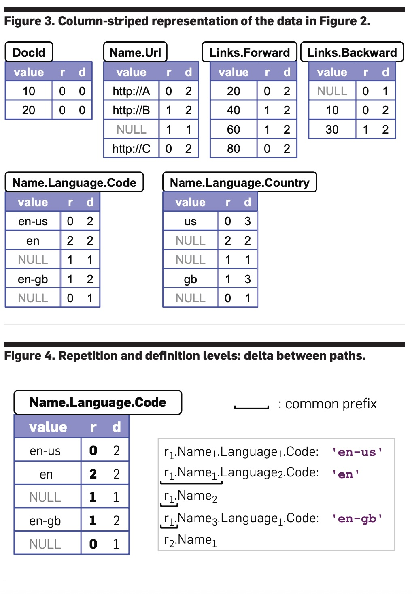

## AI论文解读 | Dremel: Interactive Analysis of Web-Scale Datasets
        
### 作者        
digoal        
        
### 日期        
2025-09-07        
        
### 标签        
PostgreSQL , PolarDB , DuckDB , AI , 论文解读        
        
----        
        
## 背景  
      
https://dl.acm.org/doi/pdf/10.1145/1953122.1953148        
  
提示:          
```          
读懂《Dremel: Interactive Analysis of Web-Scale Datasets》这篇论文需要提前掌握哪些基础知识, 请使用中文通熟易懂的讲解这些基础知识, 可以引用论文中的图、表或使用Markdown支持的图形(text,mermaid等)增加解释性. 
  
使用中文通熟易懂的解读《Dremel: Interactive Analysis of Web-Scale Datasets》这篇论文, 其中的关键内容请着重讲解, 可以引用论文中的图、表或使用Markdown支持的图形(text,mermaid等)增加解释性. 
  
提取《Dremel: Interactive Analysis of Web-Scale Datasets》这篇论文中的重要术语, 使用中文对这些术语进行通熟易懂的讲解, 可以引用论文中的图、表或使用Markdown支持的图形(text,mermaid等)增加解释性. 
```     
  
## 1 前置知识 
  
根据对论文内容的分析，要读懂《Dremel: Interactive Analysis of Web-Scale Datasets》这篇论文，需要掌握以下几个核心基础知识。

### 1\. 分布式文件系统（Distributed File System, DFS）

这篇论文讨论了Dremel如何处理“in situ”（原地）数据 ，这意味着它直接访问存储在分布式文件系统（例如 **Google File System (GFS)**）或Bigtable等其他存储层中的数据 。因此，了解分布式文件系统的工作原理、数据如何存储在多个节点上、以及数据复制（Replication）如何提供容错能力等基础概念是必要的 。

### 2\. MapReduce（MR）范式

论文多次将Dremel与MapReduce进行对比 。Dremel不是为了取代MapReduce，而是作为其补充，用于分析MapReduce管道的输出或快速原型设计大型计算 。理解MapReduce的Map（映射）和Reduce（归约）阶段，以及它如何处理大规模批处理作业，有助于理解Dremel在**交互式查询**方面的优势 。

### 3\. 列式存储（Columnar Storage）

这是Dremel的核心创新之一。与传统的面向行的存储（Record-oriented）不同，列式存储将同一列的所有值连续存储在一起 。这对于只访问部分列的查询（如聚合查询）非常高效，因为系统无需读取不相关的列 。论文中的图1（Figure 1）清晰地展示了这两种存储方式的区别：

  


  * **面向行（Record-oriented）**: 数据以完整的记录（record）为单位存储。例如，读取一个记录时，其所有字段（A, B, C, D, E）都会被读取，即使你只需要字段C。
  * **面向列（Column-oriented）**: 数据按列存储。如果要查询字段C，你只需读取C列的数据，而不需要读取A、B、D、E等列，这极大地减少了I/O操作 。

### 4\. 嵌套数据模型（Nested Data Model）

Dremel的一个关键挑战是为**嵌套数据**（如JSON、Protocol Buffers）实现列式存储 。论文为此引入了 **重复级别（repetition level）** 和 **定义级别（definition level）** 这两个概念 。

  * **重复级别（Repetition Level）**：表示当前值在哪个重复的父级字段中开始重复 。它有助于重建记录的层次结构。
  * **定义级别（Definition Level）**：表示路径中存在多少个可选（optional）和重复（repeated）字段 。它用于标记空值（NULL）或缺失字段 。

理解这两个级别是理解Dremel如何**在列式存储中无损地表示嵌套数据结构**的关键 。

### 5\. 多级执行树（Multilevel Execution Tree）

Dremel的查询执行架构类似于分布式搜索引擎中使用的“服务树”（serving tree） 。

  * **查询下推（Push-down）**：查询从根服务器（Root server）开始，逐级下推到中间服务器（Intermediate servers）和叶服务器（Leaf servers） 。
  * **并行聚合（Parallel Aggregation）**：叶服务器并行扫描数据并执行部分聚合 。中间服务器和根服务器则负责将这些部分结果聚合起来，最终得到完整的结果 。

这种架构的好处是高度并行化，可以处理故障和慢节点（stragglers），从而实现快速的交互式查询 。它特别适合于返回中小型结果的聚合查询 。

-----

总而言之，要读懂这篇论文，你最好具备以下背景知识：

  * **数据存储**: 分布式文件系统（如GFS）。
  * **大数据处理**: 了解MapReduce的工作方式。
  * **数据模型**: 理解嵌套数据结构（如JSON）的特点。
  * **数据库**: 了解面向行和面向列的存储方式。

有了这些基础，你就能更好地理解论文中提出的**列式存储如何适应嵌套数据**，以及**多级执行树如何实现大规模并行查询**这两个核心思想。
  
## 2 解读论文 
  
好的，我们来一起深入浅出地解读这篇里程碑式的论文——《Dremel: Interactive Analysis of Web-Scale Datasets》。

这篇论文介绍了谷歌内部一个名为 Dremel 的系统 ，它彻底改变了分析超大规模数据集的方式，也是今天谷歌云服务 BigQuery 背后的核心技术 。

### 核心思想概览：Dremel 要解决什么问题？

在 Dremel 出现之前，谷歌主要使用 MapReduce (MR) 来处理海量数据 。MR 非常强大，擅长进行大规模的批处理任务，但它有一个“缺点”：**慢**。一个 MR 任务从启动、调度到完成，通常需要几分钟甚至几小时 。这对于需要快速、反复试错的数据分析师来说，体验非常糟糕，无法做到“交互式”分析 。

此外，当时的大部分数据（例如网页文档、结构化日志等）都不是传统数据库喜欢的二维表格形式，而是具有层级嵌套结构的（non-relational 或 nested data）。强行将这些数据转换成二维表不仅困难，而且在 Web 规模上几乎是不可能完成的任务 。

因此，Dremel 的目标非常明确：

1.  **快 (Interactive Speed)**：查询万亿行级别的数据表，响应时间要在秒级 。
2.  **灵活 (Flexible Data Model)**：能直接处理原始的嵌套结构数据，无需转换 。
3.  **规模大 (Scalability)**：能够扩展到数千台服务器和 PB 级的数据 。

为了实现这些目标，Dremel 采用了两大核心技术：**针对嵌套数据的列式存储** 和 **大规模并行的查询执行树**。

-----

### 关键技术一：为“嵌套数据”量身定制的列式存储

这是 Dremel 最核心的创新之一 。

#### 1\. 传统行式存储 vs. 列式存储

首先，我们用论文中的图1来理解行式和列式存储的区别。   

```text
                      行式存储 (Record-Oriented)
+-------------------------------------------------------------------+
| Record 1: [ A | B | C | D | E ] | Record 2: [ A | B | C | D | E ] | ...
+-------------------------------------------------------------------+
  (一条记录的所有字段都连续存放在一起)

                      列式存储 (Column-Oriented)
+---------------------+---------------------+ ... +---------------------+
| Column A: [ R1 | R2 ]| Column B: [ R1 | R2 ]|     | Column E: [ R1 | R2 ]|
+---------------------+---------------------+ ... +---------------------+
  (同一字段(列)的所有值都连续存放在一起)
```

  * **行式存储**：一行数据的所有列都存在一起。优点是写入方便，或者当需要获取整行数据时效率高。
  * **列式存储**：一列数据的所有行都存在一起 。优点是当查询只涉及少数几列时，系统只需要读取这几列的数据，而无需扫描整张表，大大减少了 I/O 。对于数据分析场景（通常是`GROUP BY`、`SUM`等聚合查询），这能带来数量级的性能提升 。

#### 2\. Dremel 的创新：如何对嵌套数据进行列存？

Web 数据往往是嵌套的，比如论文图2中的 `Document` 结构，一个 `Document` 里可以有多个 `Name`，每个 `Name` 下又可以有多个 `Language`。   

**挑战**：如果我把 `Name.Language.Code` 这个最深层字段的所有值 (`'en-us'`, `'en'`, `'en-gb'`) 存在一起，我如何知道哪个值属于哪个 `Name`，哪个 `Name` 又属于哪条 `Document` 记录？换句话说，如何在拆分列的同时，完整地保留原始数据的嵌套结构？

**Dremel 的答案**：为每个字段的每个值，额外存储两个“魔法数字”：**重复级别 (Repetition Level)** 和 **定义级别 (Definition Level)** 。

下面我们结合论文中的图2、图3和图4来解释这两个概念。   

  * **定义级别 (Definition Level - d)**:

      * 它表示这个值存在于这条路径上，这条路径有多“完整”。
      * 具体来说，它计算从根节点到当前字段的路径上，到底出现了多少个**可选 (optional)** 或**重复 (repeated)** 的字段 。
      * 如果一个字段是 `required` 的，它不计入定义级别，因为它必须存在 。
      * 一个重要的用途是：如果某个值的定义级别小于这个字段路径上可能的最大定义级别，就说明这个值是 `NULL`（即数据缺失）。例如，在 `Name.Url` 这一列中，记录 `r2` 的 `Name` 字段下没有 `Url`，所以会有一个 `NULL` 值，其定义级别是1（代表 `Name` 存在），但小于最大定义级别2（代表 `Name` 和 `Url` 都存在）。

  * **重复级别 (Repetition Level - r)**:

      * 它告诉我们这个值是在哪个重复层级上“重启”的。
      * 具体来说，它表示当前值所属的路径和前一个值所属的路径，它们的共同前缀路径中包含了多少个**重复 (repeated)** 字段 。
      * 当一个新的重复项开始时，这个级别会告诉我们它是在哪个嵌套层级开始的。例如，对于 `Links.Forward` 字段，第一个值 `20` 的 `r` 是0，表示新记录的开始；而接下来的 `40` 和 `60` 的 `r` 都是1，表示它们和 `20` 同属于一个 `Links` 结构下的重复 `Forward` 字段 。

我们以 `Name.Language.Code` 字段为例，来看一下它的列式存储（简化自图3和图4）:   

| 值 (Value) | 重复级别 (r) | 定义级别 (d) | 解读 |
| :--- | :--- | :--- | :--- |
| 'en-us' | 0 | 2 | **r=0**: 新记录 `r1` 开始。**d=2**: 路径 `Name` (repeated) 和 `Language` (repeated) 都存在。 |
| 'en' | 2 | 2 | **r=2**: 与上一个值在 `Language` 级别重复。表示 `r1` 的第一个 `Name` 下的第二个 `Language`。|
| NULL | 1 | 1 | **r=1**: 与上一个值在 `Name` 级别重复。表示 `r1` 的第二个 `Name` 开始了，但它下面没有 `Language`。**d=1**: 路径只走到了 `Name`。|
| 'en-gb' | 1 | 2 | **r=1**: 与上一个值在 `Name` 级别重复。表示 `r1` 的第三个 `Name`。**d=2**: `Name` 和 `Language` 都存在。 |
| NULL | 0 | 1 | **r=0**: 新记录 `r2` 开始。**d=1**: `r2` 中只有一个 `Name`，但 `Name` 下没有 `Language`。|

通过 `r` 和 `d` 这两个数字，Dremel 就能在不读取任何其他列的情况下，精确地还原出任意一列或几列数据的原始嵌套结构。这就是它能够高效处理嵌套数据的秘密。

-----

### 关键技术二：大规模并行的“服务树”查询架构

有了高效的存储格式，还需要一个强大的执行引擎来发挥它的威力。Dremel 借鉴了分布式搜索引擎的“服务树 (Serving Tree)”架构 。

这个架构的核心思想是 **分而治之** 和 **层级聚合**。

我们可以用一个简化的流程图（参考论文图9）来说明一个聚合查询（如 `SELECT A, COUNT(B) FROM T GROUP BY A` ）是如何执行的：   


1.  **查询下发与改写**：用户的查询请求首先到达**根服务器** 。根服务器会将原始查询改写成针对下一层服务器的查询，例如，将 `COUNT` 改为 `SUM`，并将任务分发给多个**中间服务器** 。
2.  **并行扫描**：查询最终会到达成千上万的**叶服务器** 。每个叶服务器负责扫描存储在分布式文件系统（如 GFS）上的部分数据（称为 Tablet）。由于采用了列式存储，叶服务器只读取查询所需的列。
3.  **层级聚合**：叶服务器完成自己任务后，将部分结果返回给上一层的中间服务器。中间服务器对收到的结果进行**部分聚合**，然后再返回给更上一层 。
4.  **结果返回**：最终，所有部分结果汇集到根服务器，完成最终的聚合，返回给用户 。

这种树状架构有两个巨大的好处：

  * **高度并行**：查询的调度和数据的聚合都在整个树状结构中并行进行 。
  * **容错与处理慢节点**：如果某个叶服务器处理得特别慢（即“straggler”，慢节点），系统可以调度其他副本服务器来完成任务，或者在返回结果时忽略极少数未完成的慢任务（例如，只要求扫描98%的数据即可返回），从而保证查询的整体响应时间 。

-----

### 性能与影响

Dremel 的性能有多震撼？论文中的图12给出了一个直观的对比。   

**场景**：在一个包含850亿条记录的表上，计算某个字段的平均词数 。

  * **MR on Records (行存)**：耗时数小时。
  * **MR on Columns (列存)**：得益于列式存储，只需读取一列数据，时间缩短到几分钟，性能提升一个数量级 。
  * **Dremel**：由于没有 MR 的任务启动和调度开销，并且查询执行引擎高度优化，时间进一步缩短到**几秒钟**，又提升了一个数量级 。

这种从几小时到几秒钟的飞跃，真正让海量数据分析进入了“交互式”时代。

**总结来说，Dremel 的成功在于：**

  * **创新的嵌套数据列式存储** ：通过“重复/定义级别”完美解决了嵌套结构的表示问题，实现了高效的I/O。
  * **大规模并行处理架构** ：通过服务树实现了高效的查询分发和聚合，保证了低延迟和高可扩展性。
  * **与 MapReduce 互补** ：Dremel 不是要取代 MR，而是与之配合。通常，工程师会用 MR 进行复杂的数据清洗和转换（ETL），然后将结果数据交由 Dremel 进行快速、交互式的探索性分析 。

Dremel 在谷歌内部被数千名用户广泛使用 ，每月扫描的记录数达到千万亿（quadrillions）级别 。更重要的是，它作为谷歌云 BigQuery 服务的技术基石 ，将这种强大的交互式分析能力开放给了全世界的开发者和数据科学家。
  
## 3 术语 
  
根据对《Dremel: Interactive Analysis of Web-Scale Datasets》这篇论文的分析，以下是一些重要的术语及其通俗易懂的中文解释：

-----

### 1\. 多级执行树（Multilevel Execution Tree）

Dremel的查询架构就像一棵“树”，但它不是一棵普通的树，而是一棵用于执行查询任务的“服务树”。

  * **叶子节点（Leaf Nodes）**: 位于树的底层，它们直接存储和读取数据。当一个查询（比如`SELECT COUNT(*)`）被发送时，这些叶子节点会并行地从磁盘读取各自负责的数据，并执行初步的计算（比如计算各自的数据块中有多少条记录）。
  * **中间节点（Intermediate Nodes）**: 位于叶子节点和根节点之间，负责收集并合并来自其下层节点的部分结果。
  * **根节点（Root Node）**: 位于树的顶端，负责将所有中间节点的结果汇总，并返回最终的查询结果给用户。

这个架构的优势是**高度并行化**和**容错性**。即使某个叶子节点发生故障或运行缓慢，其他节点仍然可以继续工作，最终结果的延迟只会受到影响，而不会导致整个查询失败。这使得Dremel能够快速处理海量数据。

-----

### 2\. 列式存储（Columnar Storage）

这是Dremel的基石，也是它能实现快速查询的关键。想象一下，你有一个包含“姓名”、“年龄”、“地址”和“爱好”的表格。

  * **传统行式存储**: 就像我们通常看到的表格一样，每一行（一个人的所有信息）都作为一个完整的记录存放在一起。如果要统计所有人的平均年龄，你需要把整个表格从头到尾读一遍，读取每一行的所有信息，然后再从中提取年龄字段。
  * **列式存储**: 这种方式则把同一列的数据（比如所有的“年龄”）连续地存储在一起，而把“姓名”列、”地址“列等分开存放。如果要统计平均年龄，系统只需要读取“年龄”这一列的数据，而不需要碰其他列，这大大减少了I/O操作量，使查询速度飞快。

用一个简单的示意图来对比这两种存储方式：


-----

### 3\. 重复级别（Repetition Level）与定义级别（Definition Level）

这两个概念是Dremel用来在**列式存储中表示嵌套和重复数据**的创新方法。传统数据库通常无法直接处理像JSON或Protocol Buffers这类具有复杂嵌套结构的半结构化数据。

  * **重复级别（Repetition Level）**: 告诉我们一个新值属于哪一个父级的重复字段。它帮助系统在从列中读取数据时，重建原始记录的嵌套结构。
  * **定义级别（Definition Level）**: 告诉我们一个字段的路径中，有多少个可选（optional）或重复（repeated）的父级字段是存在的。它主要用来表示和识别空值（NULL）或缺失字段。

通过这两个级别，Dremel可以把嵌套的、具有重复字段的数据（比如一个人有多个电话号码）平铺成列式存储，同时又不会丢失原始数据的层级关系。

-----

### 4\. In situ 数据分析

这个术语翻译过来就是“**原地分析**”。Dremel不像传统的数据仓库那样需要把数据从一个地方导入到另一个地方，然后再进行分析。它能够直接在数据存放的地方（例如Google File System）进行查询和分析。这种模式的好处是：

  * **减少了数据移动**: 节省了大量的时间和网络资源。
  * **实时性**: 允许用户对最新的数据进行即时分析，而无需等待数据ETL（抽取、转换、加载）过程。

-----

### 5\. MapReduce

MapReduce是一种**批处理**计算模型，擅长处理超大规模的离线数据，但它的延迟通常较高（从几分钟到几个小时不等），不适合交互式查询。Dremel在论文中多次提到MapReduce，主要是在说明Dremel作为MapReduce的**补充**，用于快速、交互式地分析数据，而不是取代它。简单来说：

  * **MapReduce**：适合一次性处理海量数据，比如计算一整年所有网页的访问量。
  * **Dremel**：适合快速探索和分析小到中等规模的数据集，比如实时查看某个网站在过去一个小时内的流量趋势。
  
## 参考        
         
https://dl.acm.org/doi/pdf/10.1145/1953122.1953148    
        
<b> 以上内容基于DeepSeek、Qwen、Gemini及诸多AI生成, 轻微人工调整, 感谢杭州深度求索人工智能、阿里云、Google等公司. </b>        
        
<b> AI 生成的内容请自行辨别正确性, 当然也多了些许踩坑的乐趣, 毕竟冒险是每个男人的天性.  </b>        
  
  
  
#### [期望 PostgreSQL|开源PolarDB 增加什么功能?](https://github.com/digoal/blog/issues/76 "269ac3d1c492e938c0191101c7238216")
  
  
#### [PolarDB 开源数据库](https://openpolardb.com/home "57258f76c37864c6e6d23383d05714ea")
  
  
#### [PolarDB 学习图谱](https://www.aliyun.com/database/openpolardb/activity "8642f60e04ed0c814bf9cb9677976bd4")
  
  
#### [PostgreSQL 解决方案集合](../201706/20170601_02.md "40cff096e9ed7122c512b35d8561d9c8")
  
  
#### [德哥 / digoal's Github - 公益是一辈子的事.](https://github.com/digoal/blog/blob/master/README.md "22709685feb7cab07d30f30387f0a9ae")
  
  
#### [About 德哥](https://github.com/digoal/blog/blob/master/me/readme.md "a37735981e7704886ffd590565582dd0")
  
  

  
