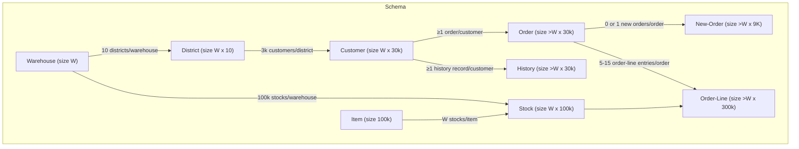
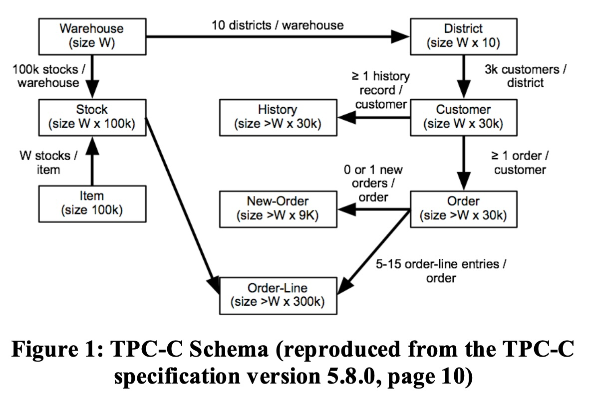
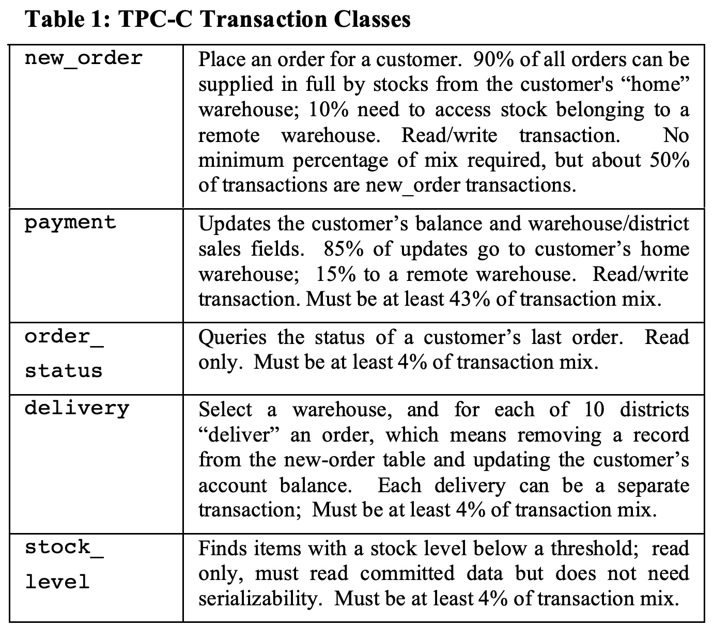

## AI论文解读 | The End of an Architectural Era (It’s Time for a Complete Rewrite)
        
### 作者        
digoal        
        
### 日期        
2025-09-07        
        
### 标签        
PostgreSQL , PolarDB , DuckDB , AI , 论文解读        
        
----        
        
## 背景  
      
https://www.vldb.org/conf/2007/papers/industrial/p1150-stonebraker.pdf        
  
提示:          
```          
读懂《The End of an Architectural Era (It’s Time for a Complete Rewrite)》这篇论文需要提前掌握哪些基础知识, 请使用中文通熟易懂的讲解这些基础知识, 可以引用论文中的图、表或使用Markdown支持的图形(text,mermaid等)增加解释性. 
  
使用中文通熟易懂的解读《The End of an Architectural Era (It’s Time for a Complete Rewrite)》这篇论文, 其中的关键内容请着重讲解, 可以引用论文中的图、表或使用Markdown支持的图形(text,mermaid等)增加解释性. 
  
提取《The End of an Architectural Era (It’s Time for a Complete Rewrite)》这篇论文中的重要术语, 使用中文对这些术语进行通熟易懂的讲解, 可以引用论文中的图、表或使用Markdown支持的图形(text,mermaid等)增加解释性. 
```     
  
## 1 前置知识 
  
想要读懂这篇名为《The End of an Architectural Era (It’s Time for a Complete Rewrite)》（一个架构时代的终结：是时候彻底重写了）的论文，你需要先掌握一些数据库领域的基础知识。这篇论文的核心观点是，几十年来，关系型数据库管理系统（RDBMS）的“一刀切”架构已经过时，无法满足现代硬件和应用的需求。

以下是理解这篇论文所需的基础知识，我会用通俗易懂的方式为你一一讲解。

### 1. 关系型数据库管理系统 (RDBMS) 和 “一刀切” 思想

- **RDBMS**: 这是指我们最常使用的数据库，例如 DB2、SQL Server 和 Oracle 。它们将数据组织成表格，并使用 SQL 语言进行操作。这篇论文指出，这些主流 RDBMS 都是源自上世纪70年代的 **System R** 架构 。
- **“一刀切” (One size fits all)**: 传统 RDBMS 的设计初衷是能处理所有类型的数据库任务，无论是复杂的查询还是高频的交易。然而，论文认为，这种“一刀切”的方案最终变得“样样通，样样不精” 。作者们通过实验证明，在数据仓库、流处理、文本和科学数据库等专业领域，专门设计的引擎能比传统 RDBMS 快1-2个数量级 。

### 2. OLTP (在线事务处理)

- **OLTP**: 这是论文重点关注的市场。它主要处理日常、高频、短小的事务，比如银行转账、电商网站的下单操作。这些事务通常只涉及少量数据的读写。
- **与 OLAP/数据仓库的区别**: 与 OLTP 相反，在线分析处理（OLAP）或数据仓库主要处理大规模、复杂的分析查询，例如年度销售报表分析，这类查询通常会扫描大量数据。论文强调，OLTP 和 OLAP 的需求截然不同 ，因此应该用不同的数据库系统来处理 。

### 3. 硬件和软件的巨大变化

这篇论文的核心论点之一是，RDBMS 的老旧架构无法适应过去25年间巨大的硬件变化 。

- **主内存 (Main Memory)**: 70年代，大型机的内存只有1MB左右，而如今高达100GB甚至更高 。这使得大多数 OLTP 数据库（通常小于1TB）可以完全加载到主内存中，而不需要频繁地读写磁盘 。
- **磁盘 vs. 内存**: 尽管磁盘的容量大幅增加，但磁盘与主内存之间的带宽增长却非常缓慢 。这意味着，对于 OLTP 应用，基于磁盘的架构已经不再适用 。

### 4. RDBMS 的传统架构弊端

论文详细列举了传统 RDBMS 的几个过时特性，并解释了为何它们在现代 OLTP 环境中会成为性能瓶颈 。

| 过时的传统架构特征 | 解释与弊端 | H-Store 的新方法 |
| :--- | :--- | :--- |
| **面向磁盘的存储和索引** | 设计初衷是为减少昂贵的磁盘IO。在数据能全部放入内存的今天，这带来了不必要的开销 。 | 采用面向内存的设计，数据常驻内存 。 |
| **多线程 (Multithreading)** | 用多线程来隐藏磁盘IO的延迟。在事务耗时极短（少于1毫秒）的内存环境中，多线程引入了额外的开销和复杂性，如锁竞争 。 | 采用单线程执行模型，每个SQL命令执行至完成，无需多线程开销 。 |
| **基于锁的并发控制 (Locking-based concurrency control)** | 传统的悲观锁机制会在高并发短事务环境下造成性能下降和死锁 。 | 倾向于乐观并发控制方法，因为事务短且冲突少 。 |
| **基于日志的恢复 (Log-based recovery)** | 强制写入重做日志 (redo log) 会显著增加每个事务的运行时间 。 | 在高可用（HA）系统中，可以取消持久化的重做日志，只保留易失性的撤销日志 (undo log) 。通过网络从其他副本恢复数据 。 |

### 5. H-Store: 论文提出的新架构原型

H-Store 是论文作者们构建的一个新的 OLTP 数据库原型，旨在解决上述传统架构的弊端 。它利用了以下几个关键思想来达到极高的性能（比传统 RDBMS 快82倍） ：

- **面向内存**: 数据全部在主内存中处理 。
- **网格计算和共享-无架构**: 在由多台机器组成的网格上运行，数据水平分区到不同节点，每个节点都是独立的 。
- **单站点事务 (Single-sited transactions)**: 论文提出了一种名为 **受限树应用 (CTA)** 的概念，即所有事务都可以在单个节点上完成，无需跨节点通信 。这样可以避免分布式事务的复杂性和网络延迟 。
- **预定义工作负载**: H-Store 假设所有事务类型都是预先定义的，这使其能够进行大量的优化，例如简化并发控制 。

通过理解这些核心概念，你就能更好地把握论文的精髓：它不仅批评了传统数据库架构的过时之处，更提出了一个专为现代硬件和 OLTP 应用设计的全新数据库设计蓝图。
  
## 2 解读论文 
  
好的，這是一篇對論文《The End of an Architectural Era (It's Time for a Complete Rewrite)》的通俗解讀。

### 論文核心論點：通用數據庫已死，專用數據庫當立

這篇由數據庫領域的泰斗 Michael Stonebraker 等人於 2007 年發表的論文，拋出了一個極具顛覆性的觀點：傳統的「一刀切」(one size fits all) 關係型數據庫管理系統 (RDBMS) 的時代已經結束 。儘管它們試圖滿足所有應用場景的需求，但事實上在任何一個專門領域都表現平平 。作者們認為，這些擁有超過 25 年歷史的數據庫系統，其架構早已過時，應該被一系列「從零開始」設計的專用數據庫引擎所取代 。

簡單來說，作者認為，與其用一個臃腫、陳舊的系統去應對所有問題，不如為不同類型的問題（如數據倉庫、文本搜索、事務處理等）分別設計最高效的專用工具 。

### 為什麼說傳統數據庫架構過時了？

作者指出，當今的數據庫應用環境與 25-30 年前相比，已經發生了翻天覆地的變化，但主流 RDBMS（如 DB2, SQL Server, Oracle）的底層架構卻依然沿襲自 1970 年代的 System R 。

主要變化體現在以下幾個方面：

1.  **硬件的巨變**：

      * **內存**：當年的大型機內存只有 1MB 左右，而如今數百 GB 甚至 TB 級別的內存已不罕見 。這意味著，絕大多數的線上事務處理 (OLTP) 數據庫完全可以整個放入內存中運行，而不再需要頻繁讀寫緩慢的磁盤 。
      * **架構**：計算架構從昂貴的單機、共享內存多處理器，演變為由大量廉價服務器組成的「網格計算」(Grid Computing) 或「刀片服務器」集群，也就是共享無（shared-nothing）架構 。

2.  **市場的分化**：

      * 最初，數據庫市場主要是商業數據處理（或稱 OLTP）。但後來分化出了許多新的、需求迥異的市場，例如：
          * **數據倉庫 (Data Warehouses)**：需要處理複雜的分析查詢。
          * **文本處理 (Text)**：如搜索引擎。
          * **流處理 (Stream Processing)**：需要實時處理數據流。
          * **科學計算數據庫 (Scientific databases)** 。
      * 論文引用先前的研究證明，在這些新興市場中，專用引擎的性能可以比傳統 RDBMS 高出一到兩個數量級 。

3.  **核心架構的沉重包袱**：

      * 傳統 RDBMS 的核心設計，如基於磁盤的存儲、鎖機制、日誌恢復等，都是為了解決當年內存小、磁盤慢的問題而設計的 。在內存為王的今天，這些機制反而成了巨大的性能瓶頸 。
      * 例如，為了保證數據持久性而設計的**重做日誌 (redo log)**，會強制將事務寫入磁盤，這在內存處理速度極快的情況下，耗時佔比極高 。

論文的驚人之處在於，它不僅論證了傳統 RDBMS 在新興市場力不從心，更進一步指出：**即使是在它們最初的主場——OLTP 市場，其表現也同樣糟糕** 。

### H-Store：為現代 OLTP 場景量身打造的新架構

為了證明觀點，作者團隊設計並構建了一個名為 **H-Store** 的新型 OLTP 數據庫原型 。H-Store 的設計完全拋棄了傳統 RDBMS 的包袱，充分利用了現代硬件和 OLTP 應用的特性。

#### H-Store 的核心設計理念

  * **完全基於內存 (Main Memory)**：假設整個數據庫都存儲在內存中，徹底告別磁盤 I/O 瓶頸 。
  * **單線程執行 (Single-threaded Execution)**：OLTP 事務通常非常輕量，執行時間極短（毫秒級）。與其使用複雜的多線程並發控制（會產生線程切換和鎖的開銷），不如讓每個 CPU 核心以單線程方式，一個接一個地高速完成事務，避免內部競爭 。
  * **無需重做日誌 (No Redo Log)**：通過數據庫副本實現高可用性 (High Availability)。當一台機器宕機，可以從另一台副本恢復數據，而不需要傳統的重做日誌 。這移除了系統中最大的性能瓶頸之一 。
  * **預先定義事務 (Pre-defined Transactions)**：OLTP 系統的業務邏輯通常是固定的（例如，下單、支付），很少有即席查詢 。H-Store 要求所有事務邏輯以存儲過程的形式預先註冊，以便系統進行分析和優化 。
  * **專為網格計算設計 (Grid Computing)**：數據被水平分區 (horizontally partition) 到集群中的多個節點上，天然支持擴展和高可用 。

### 性能對比：H-Store vs. 傳統商業數據庫

論文的殺手鐧來自於一場在標準事務處理基準測試 **TPC-C** 上的性能對決 。

  * **測試環境**：一台雙核 2.8GHz CPU、4GB 內存的普通計算機 。
  * **測試結果**：
      * **H-Store**: 每秒完成 **70,416** 個 TPC-C 事務 。
      * **某主流商業 RDBMS**: 即使經過專業 DBA 的多日調優，每秒也只能完成 **850** 個事務 。

**結論是：H-Store 的速度是傳統數據庫的 82 倍，接近兩個數量級的性能提升** ！

#### 為什麼差距如此之大？

論文分析指出，商業數據庫將大約 **2/3 的時間都花在了寫日誌上** 。即使關閉日誌，其吞吐量也只能提升到約 2500 tps，下一個瓶頸將是並發控制（鎖）系統 。而 H-Store 通過架構上的革新，幾乎完全消除了這些開銷 。

#### TPC-C 案例分析

TPC-C 模擬的是一個商品批發公司的業務，其數據庫模式如下圖所示：



  

*圖 1: TPC-C 數據庫模式圖 (根據論文 Figure 1 復現)*

TPC-C 包含五種核心事務類型，如下表所示：

| 事務類型 (Transaction) | 描述 | 混合比例要求 |
| :--- | :--- | :--- |
| **new\_order** (新訂單) | 為客戶下一個訂單，大部分庫存來自「本地」倉庫，少部分可能需要訪問遠程倉庫的庫存。是讀寫事務。 | 約 50% |
| **payment** (支付) | 更新客戶餘額和倉庫/地區的銷售額。大部分更新在本地倉庫，少部分在遠程。是讀寫事務。 | 至少 43% |
| **order\_status** (訂單狀態) | 查詢客戶的最後一個訂單的狀態。是只讀事務。 | 至少 4% |
| **delivery** (發貨) | 為每個地區「交付」一個訂單，即從新訂單表中刪除記錄並更新客戶餘額。 | 至少 4% |
| **stock\_level** (庫存水平) | 查詢庫存低於某個閾值的商品。是只讀事務。 | 至少 4% |

  

*表 1: TPC-C 事務類型總結 (根據論文 Table 1 整理)*

H-Store 通過一系列巧妙的策略（如複製只讀的 `Item` 表，對 `Stock` 表進行垂直分區等），將 TPC-C 的所有事務都轉化為 **「one-shot」** （一次性）和 **「strongly two-phase」** （強兩階段）事務 。這意味著每個事務的子任務都可以被直接分發到對應的數據庫節點並獨立完成，無需節點間的複雜協調，從而實現了無並發控制的高效執行 。

### 更深遠的影響：反思關係模型和 SQL

論文的結論並不止步於性能對比，作者們還對數據庫領域的兩個「聖牛」(sacred cow) 提出了質疑：

1.  **關係模型不是萬能的**：關係模型（即二維表）非常適合商業數據處理，但在其他領域，可能有更自然、更高效的模型 。例如：

      * 數據倉庫的星型/雪花型模式，用實體-關係 (E-R) 模型描述更簡單 。
      * 流處理中的數據可能是層級結構的 。
      * 科學計算更需要數組 (arrays) 而非表 (tables) 。

2.  **SQL 也不是唯一的答案**：作為一種「一刀切」的語言，SQL 變得異常複雜 。在 OLTP 場景中，人們只需要一小部分 SQL 功能，並且主要通過存儲過程來調用 。作者倡導使用與現代編程語言（如 Ruby, Python）更緊密集成的數據訪問方式，而不是笨重低效的 JDBC/ODBC 接口 。

### 總結

《The End of an Architectural Era》是一篇振聾發聵的論文。它精準地指出了傳統關係型數據庫在架構上的根本性缺陷，並通過 H-Store 的驚人性能，有力地證明了為特定場景設計專用數據庫引擎是未來發展的必然方向 。這篇論文預言了數據庫世界將從「一統天下」走向「百家爭鳴」，這個預言在今天（NoSQL、NewSQL 數據庫百花齊放）已經得到了充分的驗證。它不僅僅是一次技術上的革新，更是對整個數據庫設計哲學的一次深刻反思 。
  
## 3 术语 
  
通过阅读《The End of an Architectural Era (It’s Time for a Complete Rewrite)》这篇论文，我们可以总结出以下几个重要的核心术语和概念。理解了这些，你就能抓住论文的核心论点。

---

### 1. "一刀切" (One size fits all)

这是论文批判的**核心概念**。它指的是传统的关系型数据库管理系统（RDBMS），例如 Oracle、SQL Server 和 DB2，试图用同一种架构来处理所有类型的数据库工作负载，无论是高频的交易还是复杂的分析。

论文认为，这种“一刀切”的模式在现代已经失效，因为它导致数据库在任何一个特定领域都无法做到最优。作者通过实验证明，在数据仓库、流处理等专业领域，专门设计的数据库引擎可以比传统 RDBMS 快1-2个数量级。

### 2. OLTP (在线事务处理)

- **术语解释**: OLTP，全称 Online Transaction Processing，指的是日常、高频、小型的数据库事务处理。
- **例子**: 比如你在电商网站下单、银行转账、ATM 取款等操作，都属于 OLTP 范畴。这些操作的特点是：**数据量小、并发高、响应时间要求短**。
- **论文中的意义**: 论文指出，尽管传统 RDBMS 在数据仓库等领域已被专业引擎超越，但它们仍然主导着 OLTP 市场。然而，这篇论文的研究表明，即使在 OLTP 领域，传统 RDBMS 的架构也已过时，并且可以被新架构超越。

### 3. H-Store

- **术语解释**: H-Store 是论文作者们为了验证其“传统数据库架构已过时”的论点而构建的一个全新的**数据库原型**。
- **核心思想**: 它是一个专门为现代硬件和 OLTP 工作负载设计的、面向内存（in-memory）的数据库。它的设计抛弃了许多传统数据库为适应磁盘而做的设计，从而实现了惊人的性能提升。
- **意义**: H-Store 在论文中扮演着“挑战者”的角色，它用实验数据证明了新架构在处理 OLTP 任务时，可以比一个主流的传统 RDBMS 快**近两个数量级**。

### 4. 传统 RDBMS 的过时设计

论文详细分析了传统 RDBMS 中几个在现代硬件环境下变得低效的设计，这些都是理解论文论点的关键。以下表格对比了传统设计及其在 H-Store 中的替代方案。

| 过时的传统设计 | 解释与弊端 | H-Store 的新方法 |
| :--- | :--- | :--- |
| **面向磁盘的存储和索引** | 设计初衷是为减少昂贵的磁盘 I/O。在内存容量巨大的今天，这成为不必要的开销。 | **完全面向内存**：数据常驻内存，无需频繁读写磁盘。 |
| **多线程并发模型** | 用于隐藏磁盘 I/O 延迟。但在事务极短的内存环境中，多线程的锁竞争和协调开销反而成为瓶颈。 | **单线程执行**：每个 CPU 核心只运行一个执行线程，事务无需锁竞争，大大简化了并发控制。 |
| **基于锁的并发控制** | 传统的悲观锁机制在高并发短事务环境下会造成性能下降和死锁。 | **乐观并发控制**：假设冲突较少，先执行事务，若发生冲突再回滚。对于短事务，这种方式更高效。 |
| **基于日志的恢复** | 强制写入重做日志（redo log）会显著增加事务的延迟。 | **主-副本同步**：通过网络将事务结果同步到其他副本，无需频繁写入持久化日志，从而提高速度。 |

### 5. 单站点事务 (Single-sited transactions)

- **术语解释**: 单站点事务是指一个数据库事务的所有操作都可以在**一个数据库节点**上完成，而不需要与其他节点进行通信。
- **论文中的意义**: H-Store 采用了这种设计，它通过将相关数据存储在同一个节点上，避免了复杂的**分布式事务**开销（如两阶段提交），从而大幅提升了性能。论文认为，大多数 OLTP 任务都属于这种单站点事务。
  
## 参考        
         
https://www.vldb.org/conf/2007/papers/industrial/p1150-stonebraker.pdf    
        
<b> 以上内容基于DeepSeek、Qwen、Gemini及诸多AI生成, 轻微人工调整, 感谢杭州深度求索人工智能、阿里云、Google等公司. </b>        
        
<b> AI 生成的内容请自行辨别正确性, 当然也多了些许踩坑的乐趣, 毕竟冒险是每个男人的天性.  </b>        
  
  
  
#### [期望 PostgreSQL|开源PolarDB 增加什么功能?](https://github.com/digoal/blog/issues/76 "269ac3d1c492e938c0191101c7238216")
  
  
#### [PolarDB 开源数据库](https://openpolardb.com/home "57258f76c37864c6e6d23383d05714ea")
  
  
#### [PolarDB 学习图谱](https://www.aliyun.com/database/openpolardb/activity "8642f60e04ed0c814bf9cb9677976bd4")
  
  
#### [PostgreSQL 解决方案集合](../201706/20170601_02.md "40cff096e9ed7122c512b35d8561d9c8")
  
  
#### [德哥 / digoal's Github - 公益是一辈子的事.](https://github.com/digoal/blog/blob/master/README.md "22709685feb7cab07d30f30387f0a9ae")
  
  
#### [About 德哥](https://github.com/digoal/blog/blob/master/me/readme.md "a37735981e7704886ffd590565582dd0")
  
  

  
