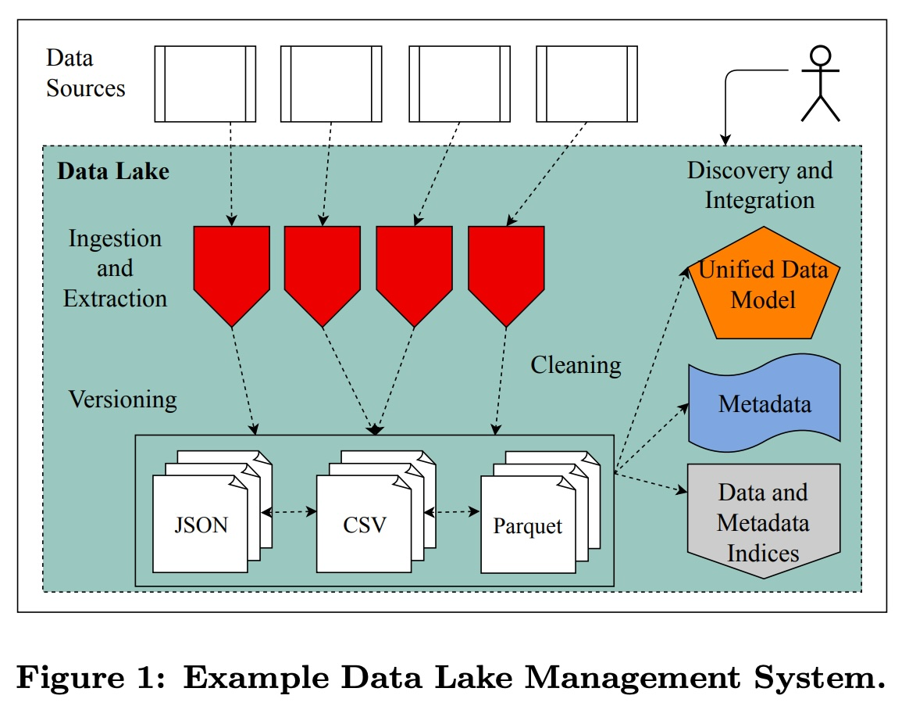
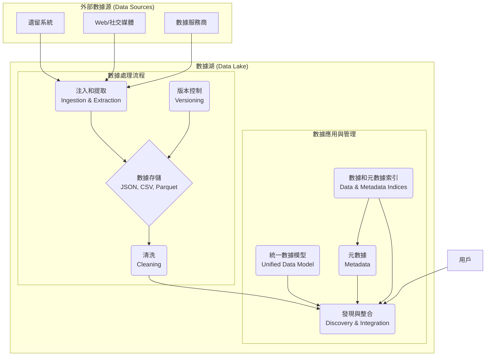
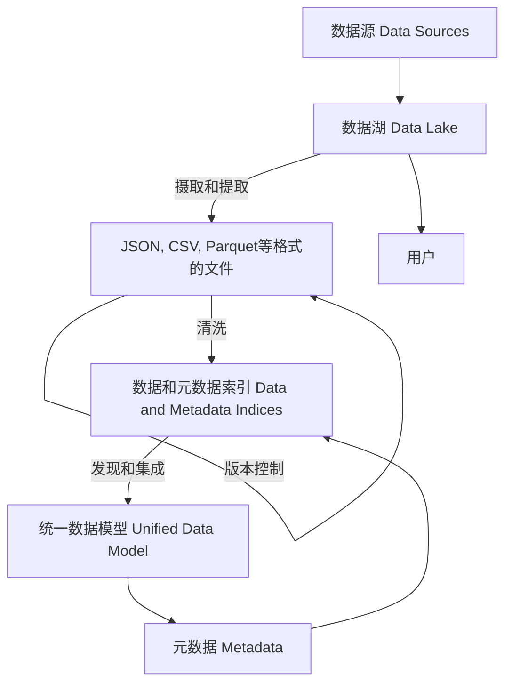

## AI论文解读 | Data Lake Management: Challenges and Opportunities
        
### 作者        
digoal        
        
### 日期        
2025-09-07        
        
### 标签        
PostgreSQL , PolarDB , DuckDB , AI , 论文解读        
        
----        
        
## 背景  
      
https://www.vldb.org/pvldb/vol12/p1986-nargesian.pdf        
  
提示:          
```          
读懂《Data Lake Management: Challenges and Opportunities》这篇论文需要提前掌握哪些基础知识, 请使用中文通熟易懂的讲解这些基础知识, 可以引用论文中的图、表或使用Markdown支持的图形(text,mermaid等)增加解释性. 
  
使用中文通熟易懂的解读《Data Lake Management: Challenges and Opportunities》这篇论文, 其中的关键内容请着重讲解, 可以引用论文中的图、表或使用Markdown支持的图形(text,mermaid等)增加解释性. 
  
提取《Data Lake Management: Challenges and Opportunities》这篇论文中的重要术语, 使用中文对这些术语进行通熟易懂的讲解, 可以引用论文中的图、表或使用Markdown支持的图形(text,mermaid等)增加解释性. 
```     
  
## 1 前置知识 
  
读懂《Data Lake Management: Challenges and Opportunities》这篇论文，你需要了解以下几个核心概念，这些都是数据管理和数据科学领域的基础知识。

### 1\. 什么是数据湖 (Data Lake)?

简单来说，**数据湖**是一个巨大的存储库，里面汇集了大量原始数据，这些数据来自不同的来源，格式也各不相同，比如文档、半结构化日志、社交媒体信息、以及来自传统数据库的数据等 。它就像一个“数据的大水塘”，不像传统的数据仓库那样，在数据存入之前就需要进行严格的清洗和格式化。

**数据湖的特点：**

  * **数据来源多样**：数据可能来自企业内部的运营系统（比如使用 COBOL 的老旧系统），也可能来自外部，比如网络爬虫抓取的网页或第三方数据提供商 。
  * **格式不一**：数据没有统一的格式，可以是纯文本、JSON、CSV 等，甚至可能没有有用的元数据（metadata）或元数据格式不统一 。
  * **随时间变化**：数据会自主地随时间变化 。

数据湖之所以被广泛使用，主要有以下几个原因：

  * **解耦**：它把数据生产者（如运营系统）和数据消费者（如分析系统）分离开来 。
  * **方便数据科学**：它为数据科学实验提供了便利的存储层，可以存放输入和输出的数据，而且创建和使用数据可以独立进行 。
  * **共享和重用**：虽然数据湖的数据格式不统一，但它提供了共享和重用大规模数据集的基础设施 。

### 2\. 传统数据管理系统 vs. 数据湖

传统的数据库管理系统 (DBMS) 和数据仓库 (Data Warehouse) 在处理数据时，通常需要先进行**ETL**（Extract, Transform, Load）过程。这意味着数据在加载到系统中之前，必须先经过提取和转换，使其符合预设好的严格模式（schema）。

而数据湖则遵循**ELT**（Extract, Load, Transform）模式。数据被直接提取并加载到数据湖中，而转换和清洗等操作则是在需要使用时才进行，而且可能不是全部数据都需要处理 。

文章指出，数据湖中的一些数据虽然最终会被清洗和集成到传统数据库或数据仓库中，但有些数据只会被编程环境按需使用，其价值可能是暂时的 。因此，如何在数据湖这个复杂的环境中管理数据，就成了新的研究挑战 。

### 3\. 数据湖管理的关键环节

论文中列举了数据湖管理的几个关键挑战和机遇，这些都对应着数据生命周期的不同阶段。你可以参考下图（论文中的图1）来理解这些环节之间的关系。

-----

  

Data Lake Management System

  * **数据源 (Data Sources)**：这是数据的起点，包括各种遗留系统、网页、社交媒体等 。
  * **摄取和提取 (Ingestion and Extraction)**：这是数据进入数据湖的第一步。
      * **摄取 (Ingestion)**：将数据从各种来源下载或复制到数据湖中 。这个过程需要并行化和低延迟，通常不进行深度分析 。
      * **提取 (Extraction)**：将原始数据转换为预设的数据模型，比如将网页中的表格数据抽象成具有属性的格式 。
  * **清洗 (Cleaning)**：由于数据湖中的数据质量参差不齐，清洗是必不可少的。与传统方法不同，数据湖中的数据可能没有模式（schema），这给清洗带来了挑战 。
  * **元数据管理 (Metadata Management)**：元数据是描述数据的数据，对于数据湖来说至关重要。没有元数据，数据湖就会变成“数据沼泽”（data swamp） 。元数据管理系统需要提取、丰富、存储元数据，并支持对元数据的查询 。
  * **数据集发现 (Dataset Discovery)**：在数据量巨大且缺乏统一模式的数据湖中，找到你需要的数据集是一个大问题 。发现方式包括基于查询的搜索和基于导航的探索 。
  * **数据集成 (Data Integration)**：将不同来源的数据整合成一个统一的视图。在数据湖中，这通常需要“按需集成”（on-demand integration），在查询时进行提取和清洗，以管理数据的异构性 。
  * **数据集版本控制 (Dataset Versioning)**：数据湖是动态的，文件和版本会不断变化。因此，需要有效的版本管理系统来跟踪和管理不同版本的数据，以避免错误和重复 。

掌握了这些基础概念后，你将能更好地理解论文中讨论的每个环节的具体挑战，以及作者提出的未来研究方向。
  
## 2 解读论文 
  
好的，這是一份對論文《Data Lake Management: Challenges and Opportunities》的通俗易懂的中文解讀。

-----

### 論文核心思想解讀：《數據湖管理：挑戰與機遇》

這篇由多倫多大學、Northeastern University 等機構的學者共同撰寫的論文，深入探討了「數據湖 (Data Lake)」這一新興數據管理模式帶來的巨大挑戰和未來機遇。

簡單來說，傳統的數據庫或數據倉庫 (Data Warehouse) 就像一個圖書館，所有書籍（數據）在入庫前都必須經過嚴格的分類、編目和整理，確保高度結構化。而**數據湖**則像一個真正的湖泊，它允許你將各種來源、各種格式的原始數據——無論是結構化的表格、半結構化的日誌文件，還是非結構化的文檔和圖片——先不加處理地「倒」進去。

這種「先存儲，後治理」(Schema-on-Read) 的模式極具靈活性，尤其受到數據科學家的青睞，因為他們可以自由探索最原始的數據 。但同時，如果管理不善，數據湖也很容易變成一個無法利用、混亂不堪的「數據沼澤」(Data Swamp) 。

論文的**核心挑戰 (Grand Challenge)** 在於：我們能否實現對數據湖的「按需查詢應答」(on-demand query answering) 。這意味著，當用戶提出一個查詢時，系統能夠在查詢的當下，自動完成數據的發現、提取、清洗和整合等一系列複雜操作，並立即返回可用的結果 。這將極大地釋放數據湖中數據的價值 。

### 數據湖的通用架構 (圖解)

為了更好地理解數據湖的運作模式，我們可以參考論文中的核心架構圖 (Figure 1)。  

  



  * **數據源 (Data Sources)**: 數據可以來自任何地方，比如公司內部的舊系統、網站抓取的公開信息、社交媒體數據等 。
  * **注入和提取 (Ingestion and Extraction)**: 這是數據進入湖泊的第一步 。數據被「注入」湖中，並可能經過初步「提取」，從原始格式（如日誌文件）轉換為更有組織的結構（如表格） 。
  * **版本控制 (Versioning)**: 數據湖中的數據是動態變化的 。版本控制系統負責追踪數據集的每一次變更，確保數據的歷史記錄清晰可查 。
  * **清洗 (Cleaning)**: 原始數據充滿了錯誤和不一致。清洗步驟旨在修正這些問題，提升數據質量 。
  * **發現與整合 (Discovery and Integration)**: 當用戶需要數據時，系統必須能從海量數據中「發現」相關的數據集，並將它們「整合」在一起以回答用戶的問題 。
  * **元數據與索引 (Metadata & Indices)**: 元數據是「關於數據的數據」（例如數據的來源、格式、所有者等） 。它是數據湖的「地圖」，幫助用戶和系統理解和定位數據 。索引則用於加速數據的搜索過程 。

### 七大關鍵挑戰與機遇

論文詳細闡述了數據湖管理中七個環環相扣的關鍵領域：

#### 1\. 數據注入 (Data Ingestion)

  * **挑戰**: 數據注入不僅僅是文件拷貝。它需要高效、並行地處理來自外部的、可能帶寬受限的數據源，並進行版本控制和基礎索引 。對於實時性要求高的高速數據流，挑戰更大 。
  * **機遇**: 未來的研究方向在於支持高速度數據的實時注入，並在注入的同時創建更複雜的索引，讓新數據能夠被立即分析和使用 。

#### 2\. 數據提取 (Data Extraction)

  * **挑戰**: 原始數據（如網頁、日誌、PDF）需要被轉換成結構化的數據模型（如關係型表格）才能被有效利用 。雖然從網頁中提取表格已經研究多年 ，但從非結構化文本或複雜電子表格中自動提取仍然困難 。
  * **機遇**: 論文提出了一個核心觀點——利用「湖的智慧」(wisdom of the lake) 。這意味著系統不應再孤立地一次只處理一個文件，而應該從過去成千上萬次的提取經驗（包括人工干預的經驗）中學習，從而更智能、更準確地完成未來的提取任務 。

#### 3\. 數據清洗 (Data Cleaning)

  * **挑戰**: 傳統的數據清洗方法嚴重依賴預先定義好的數據模式（Schema）和完整性約束（例如，年齡字段必須是數字） 。但在數據湖中，數據格式混亂，甚至沒有模式信息，這使得傳統方法難以奏效 。
  * **機遇**: 同樣可以利用「湖的智慧」。通過分析湖中海量的數據集，可以實現「集體數據清洗」(collective data cleaning) 。例如，如果發現成千上萬個文件都將「New York」寫成了「NY」，系統就可以自動學習到這條清洗規則。

#### 4\. 數據集發現 (Dataset Discovery)

  * **挑戰**: 在一個可能包含數百萬個數據集，且缺乏完整目錄的數據湖中，如何幫助用戶找到他們需要的數據是一個核心難題 。
  * **機遇**: 主要有兩種模式：
      * **查詢驅動發現 (Query-driven discovery)**: 用戶提供一個樣本數據集或一些關鍵字，系統返回與之相似或可以進行合併 (join/union) 的其他數據集 。
      * **分析驅動發現 (Analysis-driven discovery)**: 這是更前沿的方向，系統不僅是找到相似數據，而是主動為用戶的機器學習任務推薦有用的新數據（如新的訓練樣本或特徵），以提升模型性能 。

#### 5\. 元數據管理 (Metadata Management)

  * **挑戰**: 沒有元數據，數據湖就是數據沼澤 。挑戰在於如何自動地從各種來源提取元數據，並將其豐富化（例如，添加語義標籤、描述數據間的關係），同時還要支持對海量元數據的高效查詢 。
  * **機遇**: 未來的系統不僅要收集元數據，還需要從數據湖中提取「知識」，並將這些知識與現有的知識庫（無論是通用知識庫還是特定領域的知識庫）相關聯，從而實現對數據更深層次的理解 。

#### 6\. 數據整合 (Data Integration)

  * **挑戰**: 傳統的數據整合（如數據聯邦）在數據湖環境中作用有限 。真正的挑戰在於實現「按需整合」(on-demand integration)，即在查詢時才確定需要哪些數據，並即時將它們融合在一起 。這要求系統必須在整合的同時，動態地完成提取和清洗工作 。
  * **機遇**: 模式映射 (Schema mapping) 是關鍵技術之一，即如何自動發現和匹配不同數據集之間的列與列的對應關係 。未來的研究需要讓這個過程更加靈活，例如允許用戶只提供一些樣本數據或模糊的約束條件來引導系統完成映射 。

#### 7\. 數據集版本控制 (Dataset Versioning)

  * **挑戰**: 數據湖中的一切都在變化：新的數據集不斷被注入，現有的數據集會更新，甚至連提取數據的工具本身也在演進 。簡單地靠文件名來管理人們的版本是極其容易出錯且低效的 。
  * **機遇**: 需要像軟件開發中的 Git 一樣，為數據集提供強大的版本管理能力，支持創建版本、分支、合併、比較差異等操作 。未來的挑戰還包括如何有效管理數據模式（Schema）的演變 。

### 結論

這篇論文清晰地指出，數據湖雖然為數據科學和大規模數據分析提供了前所未有的靈活性，但也給傳統的數據管理帶來了根本性的挑戰。它描繪了一個宏偉的藍圖：未來的數據湖管理系統應該是一個高度智能化的平台，能夠在用戶需要時，自動、按需地完成從原始數據到可行動洞察的全過程。這其中每一個環節，都充滿了值得學術界和工業界深入研究的機遇。
  
## 3 术语 
  
基于您提供的论文《Data Lake Management: Challenges and Opportunities》，以下是其中几个重要术语的中文解释，旨在帮助您更好地理解这篇文献的核心内容。

### 数据湖 (Data Lake)

**数据湖**是一个巨大的数据集集合，它的主要特点是：

  * **存储系统多样**：数据可能分布在不同的存储系统中 。
  * **格式各异**：数据的格式可能不统一 。
  * **元数据缺乏**：数据可能没有附带任何有用的元数据，或者元数据格式不同 。
  * **自主变化**：数据会随着时间自主改变 。

这与传统数据库或数据仓库在数据摄入前就需要严格格式化和清洗的方式不同 。数据湖主要用于解耦数据生产者和消费者，并为数据科学实验提供便利的存储层 。

-----

### 数据湖管理系统 (Data Lake Management System)

数据湖管理系统是一套工具和框架，用于管理和处理数据湖中的海量数据 。根据论文中的图1，一个典型的数据湖管理系统包括以下几个核心环节：    



这些环节共同协作，使得数据能够从原始状态进入数据湖，并最终被有效地发现、清洗和集成，以供分析使用。

-----

### 数据摄取 (Data Ingestion)

**数据摄取**是将数据从外部数据源导入数据湖的过程 。这个阶段的主要任务是为文件进行簿记，以便于版本控制和索引 。因为需要与带宽有限的外部数据源交互，摄取过程通常需要高度并行化和低延迟 。它通常不会对数据进行深度分析，但可以进行浅层的数据草图绘制（data sketches），例如使用校验和（checksums）来检测重复数据 。

-----

### 数据提取 (Data Extraction)

**数据提取**是将原始数据集（如文本或二进制编码）转换为预设数据模型的任务 。例如，将网页中的表格数据抽象成可用于索引和发现的属性集（attributes） 。这项任务可以与数据发现、集成和清洗等后续操作交织在一起 。一个例子是 DeepDive，它能根据用户定义的模式和规则，从文本、表格和图像中提取关系型数据 。

-----

### 元数据管理 (Metadata Management)

**元数据**是关于数据的数据。在数据湖中，**元数据管理**至关重要，因为缺乏元数据会导致数据湖变成“数据沼泽”（data swamp） 。元数据管理系统负责：

  * **提取和丰富元数据**：从数据源提取并添加有意义的元数据，如数据描述和完整性约束 。
  * **高效存储和查询**：支持元数据的有效存储和查询 。

例如，谷歌数据集搜索（GOODS）项目就是通过收集和提取元数据来让数据集变得可访问和可搜索 。

-----

### 数据集发现 (Dataset Discovery)

在数据量庞大且缺乏统一模式的数据湖中，**数据集发现**是指找到所需数据的过程 。主要有两种方式：

  * **查询驱动发现**：用户通过查询（数据集或关键词）来寻找相似或可集成的数据集 。
  * **导航（或探索）**：用户通过导航一个链接图（linkage graph）或分层结构来探索数据湖 。

### 数据集成 (Data Integration)

**数据集成**是将来自不同来源的数据整合成一个有意义的整体 。传统的集成方法（如数据联邦和数据交换）在数据湖中的价值有限 。论文中讨论了一种新的范式——**按需集成 (on-demand integration)**，它在查询时才对数据湖中的原始数据进行发现、提取、清洗和集成 。这需要首先找到包含相关数据的有效数据集，然后以有意义的方式将它们集成起来 。

-----

### 数据集版本控制 (Dataset Versioning)

**数据集版本控制**是在数据湖的各个阶段中都存在的一个跨领域问题 。由于新数据集和现有文件的新版本会不断进入数据湖，版本控制变得非常重要 。简单地存储所有版本可能成本太高，并且仅使用文件名来跟踪版本容易出错 。一个好的版本控制系统需要有效地提供版本的存储和检索 。例如，DataHub 提供了一个类似 Git 的界面，支持版本创建、分支、合并以及查看数据集之间的差异等操作 。
  
## 参考        
         
https://www.vldb.org/pvldb/vol12/p1986-nargesian.pdf    
        
<b> 以上内容基于DeepSeek、Qwen、Gemini及诸多AI生成, 轻微人工调整, 感谢杭州深度求索人工智能、阿里云、Google等公司. </b>        
        
<b> AI 生成的内容请自行辨别正确性, 当然也多了些许踩坑的乐趣, 毕竟冒险是每个男人的天性.  </b>        
  
  
