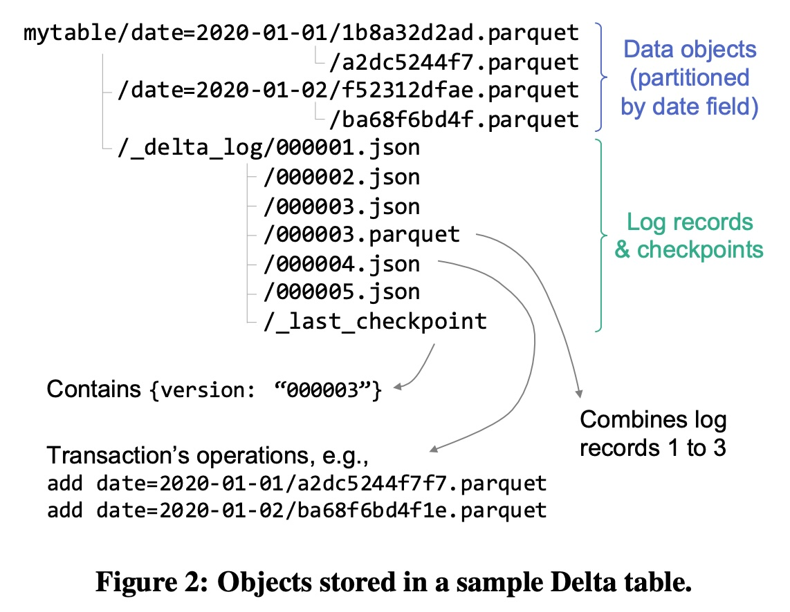
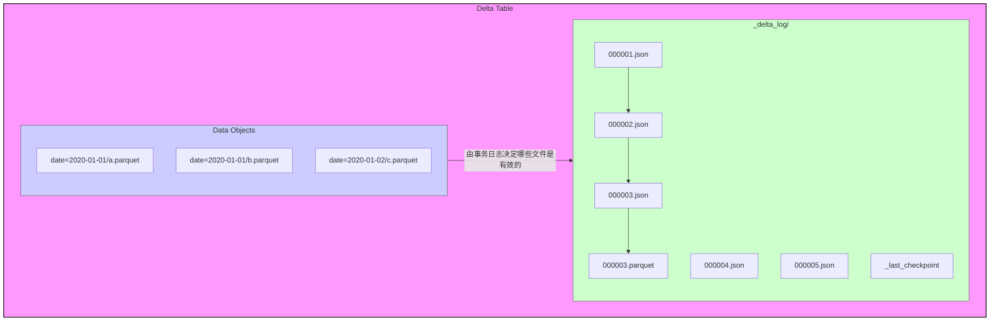
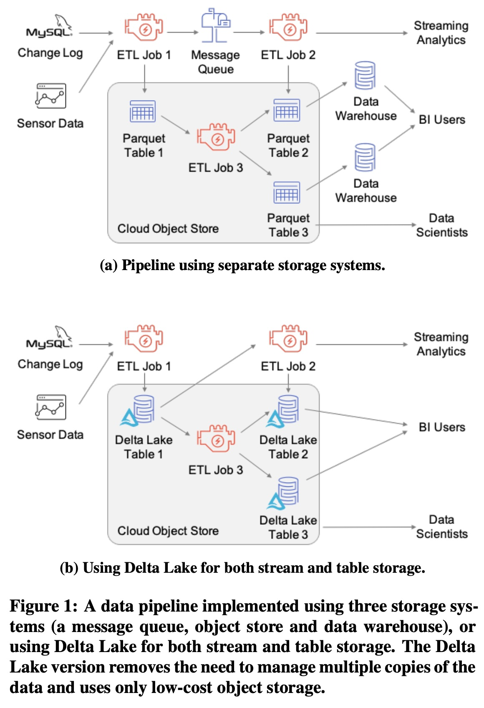
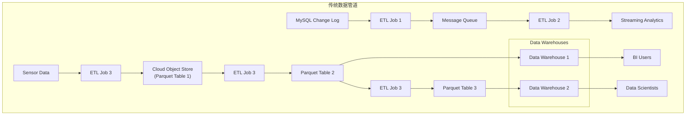
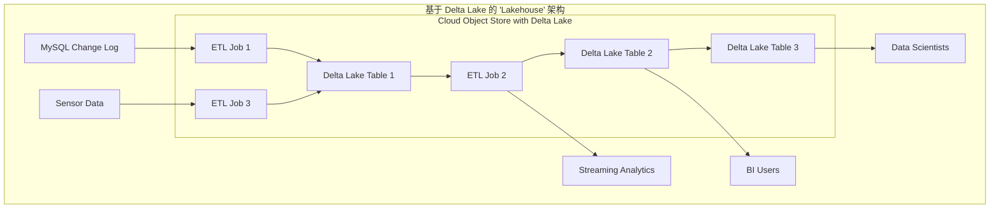
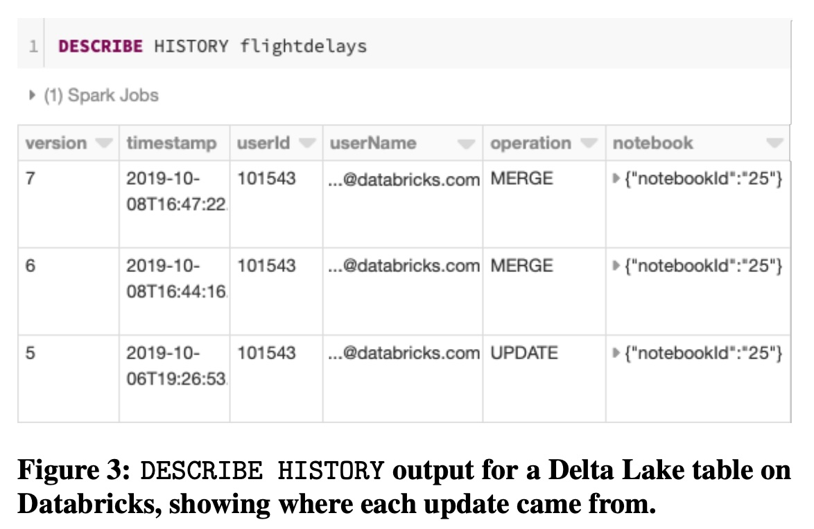
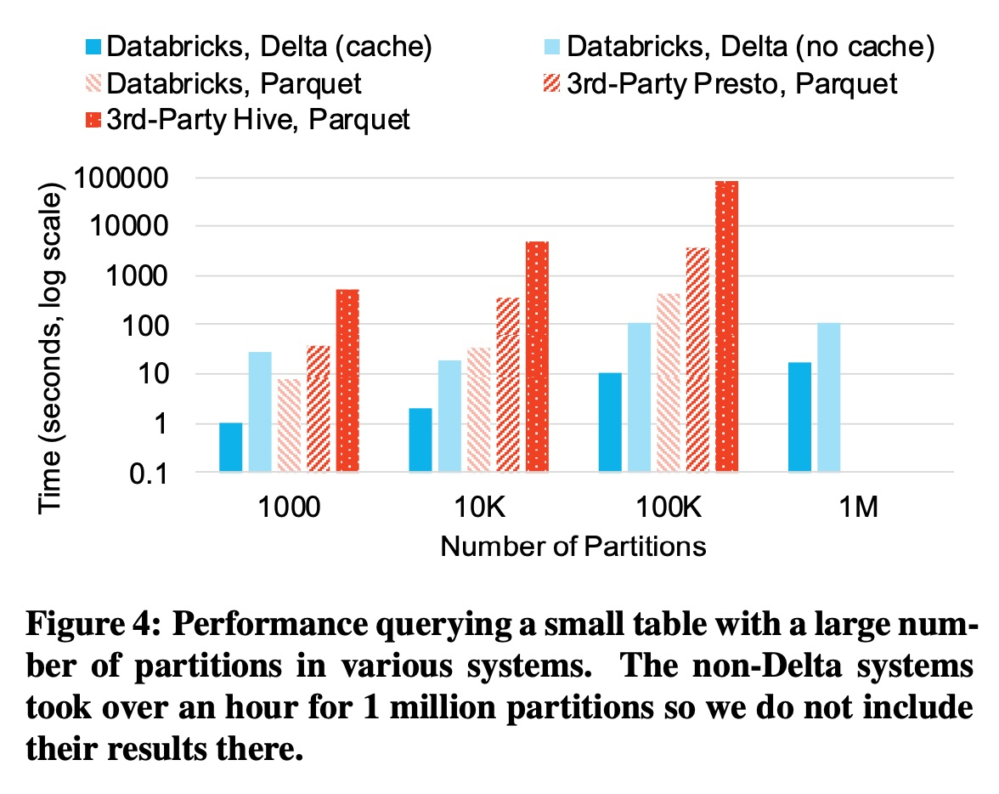
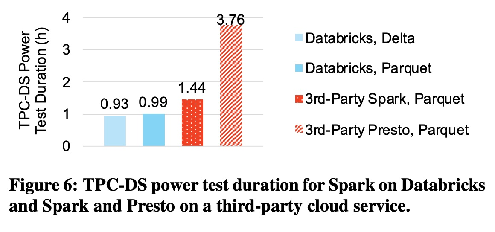
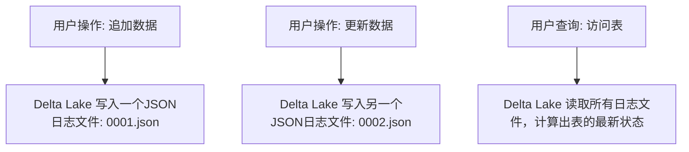

## AI论文解读 | Delta Lake: High-Performance ACID Table Storage over Cloud Object Stores
        
### 作者        
digoal        
        
### 日期        
2025-09-07        
        
### 标签        
PostgreSQL , PolarDB , DuckDB , AI , 论文解读        
        
----        
        
## 背景  
      
https://people.eecs.berkeley.edu/~matei/papers/2020/vldb_delta_lake.pdf        
  
提示:          
```          
读懂《Delta Lake: High-Performance ACID Table Storage over Cloud Object Stores》这篇论文需要提前掌握哪些基础知识, 请使用中文通熟易懂的讲解这些基础知识, 可以引用论文中的图、表或使用Markdown支持的图形(text,mermaid等)增加解释性. 
  
使用中文通熟易懂的解读《Delta Lake: High-Performance ACID Table Storage over Cloud Object Stores》这篇论文, 其中的关键内容请着重讲解, 可以引用论文中的图、表或使用Markdown支持的图形(text,mermaid等)增加解释性. 
  
提取《Delta Lake: High-Performance ACID Table Storage over Cloud Object Stores》这篇论文中的重要术语, 使用中文对这些术语进行通熟易懂的讲解, 可以引用论文中的图、表或使用Markdown支持的图形(text,mermaid等)增加解释性. 
```     
  
## 1 前置知识 
  
为了更好地理解《Delta Lake: 高性能云对象存储上的 ACID 表存储》这篇论文，您需要提前掌握以下几个核心基础知识。这些知识将帮助您理解论文中提出的问题，以及 Delta Lake 是如何解决这些问题的。

### 1\. 云对象存储 (Cloud Object Stores)

-----

这篇论文的讨论基础是**云对象存储**，例如 Amazon S3、Azure Blob Storage 或 Google Cloud Storage 。了解它的特性至关重要：

  * **键值存储 (Key-Value Store)**：云对象存储本质上是键值存储。每个数据块（文件）都像一个对象，通过一个唯一的“键”（通常是路径样式）来访问 。
  * **不提供多对象操作的原子性**：这是论文要解决的核心问题之一。云对象存储无法保证对多个对象的批量操作是原子性的。例如，如果您要删除一个表中的多条记录（这些记录分布在多个文件中），其他读取者可能会在您的操作中看到一个不完整的、已损坏的状态 。
  * **元数据操作成本高**：像 `LIST`（列出目录下的所有对象）这样的元数据操作速度很慢且成本高，这对于拥有数百万个小文件的“大数据”表来说是一个严重的性能瓶颈 。
  * **写后读一致性 (Read-After-Write Consistency)**：一些云对象存储只提供最终一致性，这意味着您写入一个文件后，可能无法立即通过 `LIST` 操作看到它 。

### 2\. ACID 事务

-----

**ACID** 是指数据库管理系统中，确保事务（一组操作）可靠执行的四个关键属性：

  * **原子性 (Atomicity)**：一个事务要么完全执行成功，要么完全不执行，不存在部分执行的状态 。
  * **一致性 (Consistency)**：事务将数据库从一个有效的状态转移到另一个有效的状态。
  * **隔离性 (Isolation)**：并发执行的事务是相互隔离的，一个事务的中间状态对其他事务不可见 。
  * **持久性 (Durability)**：一旦事务提交，其所做的更改将永久保存在数据库中。

在云对象存储上，因为缺乏多对象操作的原子性，实现 ACID 事务非常困难，而 Delta Lake 正是为了解决这一挑战而设计的 。

### 3\. 数据湖、数据仓库与 Lakehouse

-----

这篇论文的核心贡献是提出了 **Lakehouse (湖仓一体)** 的概念，它结合了数据湖和数据仓库的优点 。

  * **数据湖 (Data Lake)**：通常指将原始数据以原始格式（如 Parquet、ORC 文件）存储在低成本的云对象存储中，适合大规模、非结构化或半结构化数据的存储 。它的优点是成本低，缺点是缺乏事务支持和高效的查询管理 。
  * **数据仓库 (Data Warehouse)**：传统的数据仓库系统，通常运行在专有的数据库上，提供强大的 ACID 事务和高效的查询性能。但它的缺点是成本高、扩展性差，并且通常需要将数据从数据湖中复制一份 。
  * **Lakehouse (湖仓一体)**：论文中提出的新范式，旨在直接在数据湖之上构建数据仓库功能。它利用云对象存储的低成本和可扩展性，并通过一个事务日志层来提供 ACID 事务、数据版本管理和性能优化等功能 。

### 4\. 列式文件格式 (Apache Parquet)

-----

**Apache Parquet** 是一个被广泛使用的**列式存储文件格式**。论文提到，Delta Lake 将数据对象存储为 Parquet 文件 。

  * **列式存储**：与传统的行式存储（按行存储数据）不同，列式存储按列存储数据。这使得在只查询部分列时，可以大幅减少 I/O 操作，从而提升分析查询的性能 。
  * **数据跳过 (Data Skipping)**：Parquet 文件在其页脚中包含元数据（例如每列的最小值/最大值），查询引擎可以利用这些信息跳过不相关的文件，进一步提升查询效率 。

### 5\. Delta Lake 的存储格式 (事务日志)

-----

Delta Lake 的核心设计就是通过一个**事务日志**来解决云对象存储的原子性和性能问题。

您可以通过论文中的图 2 来直观地理解它的结构 。

  



  * **数据对象**：数据本身以 Parquet 格式存储在目录中，例如 `mytable/date=.../` 。
  * **事务日志**：这是 Delta Lake 的核心。它是一个位于 `_delta_log` 子目录下的有序 JSON 文件序列，记录了对表的所有操作（如添加或删除文件）。当需要更新表时，不是直接修改数据文件，而是在日志中添加一条新的操作记录 。
  * **检查点文件 (Checkpoint)**：为了防止日志文件过多，Delta Lake 会定期将日志记录压缩成一个高效的 Parquet 格式检查点文件 。
  * **乐观并发控制 (Optimistic Concurrency Control)**：Delta Lake 利用云对象存储提供的原子操作（如“如果不存在则放置”）来确保同一时间只有一个客户端可以成功写入新的日志记录，从而实现了事务的隔离性 。
  
## 2 解读论文 
  
好的，我们来一起深入解读这篇在数据工程领域具有重要影响力的论文——《Delta Lake: High-Performance ACID Table Storage over Cloud Object Stores》。

我会将论文的核心思想、技术细节和实践价值，用通俗易懂的方式为你讲解。

### 论文精髓概览

这篇论文的核心在于解决一个普遍存在于大数据领域的痛点：如何在廉价、可无限扩展的云对象存储（如 Amazon S3）之上，构建一个既能保证数据质量（ACID 事务）又能实现高性能查询的可靠数据存储层 。

传统的“数据湖”直接将大量文件（如 Parquet、ORC）堆放在对象存储上，虽然成本低，但存在诸多问题 ：

  * **缺乏原子性**：一个任务同时写入多个文件，如果中途失败，数据湖就处于“一半成功一半失败”的损坏状态 。
  * **一致性问题**：读取任务可能会看到部分更新的数据，导致结果不一致 。
  * **性能瓶颈**：当文件数量巨大时（例如数百万个），光是“列出文件”这个元数据操作就可能耗费数分钟，严重拖慢查询 。

**Delta Lake** 的诞生就是为了解决这些问题。它的核心思想非常巧妙：**将有关数据表的所有变更信息，以事务日志（Transaction Log）的形式，与数据文件一同存储在对象存储中** 。通过管理这份日志，Delta Lake 在看似简单的键值存储之上，构建出了一个功能强大的事务性数据表。

-----

### 关键内容深度解读

#### 1\. 核心设计：事务日志 (Transaction Log)

这是 Delta Lake 的灵魂所在。一个 Delta 表在存储上其实就是一个目录，里面包含两类东西 ：

1.  **数据文件 (Data Objects)**：采用 Parquet 格式存储的实际数据 。
2.  **事务日志目录 (`_delta_log`)**：记录了从表创建之初到当前状态的所有操作历史 。

让我们通过论文中的 `Figure 2` 来直观理解这个结构：

  

```
mytable/
├── date=2020-01-01/
│   ├── 1b8a32d2ad.parquet      <-- 数据文件 (Parquet)
│   └── a2dc5244f7.parquet      <-- 数据文件 (Parquet)
├── date=2020-01-02/
│   ├── f52312dfae.parquet      <-- 数据文件 (Parquet)
│   └── ba68f6bd4f.parquet      <-- 数据文件 (Parquet)
└── _delta_log/
    ├── 000001.json             <-- 事务日志 (JSON格式)
    ├── 000002.json
    ├── 000003.json
    ├── 000003.parquet          <-- 检查点 (Checkpoint)，加速读取
    ├── 000004.json
    ├── 000005.json
    └── _last_checkpoint        <-- 指向最新的检查点文件
```

  * **JSON 日志文件**：每个 JSON 文件代表一次事务提交（Commit），文件名是连续递增的数字 。文件内部记录了一系列“动作”（Actions），比如 ：

      * `add`: 新增一个数据文件到表中。这个记录里还包含了该文件的统计信息（如最大/最小值），用于后续查询优化 。
      * `remove`: 从表中移除一个数据文件（逻辑删除），并记录删除时间戳 。
      * `metaData`: 定义或更新表的元数据，如 Schema、分区信息等 。

  * **检查点 (Checkpoint)**：当 JSON 日志文件越来越多时，为了确定表的当前状态，查询引擎需要读取并解析所有日志，这会变慢 。因此，Delta Lake 会定期将截至某个版本的日志信息进行合并和压缩，生成一个 Parquet 格式的检查点文件 。这样，新来的查询只需读取最新的检查点，再应用其后的少量 JSON 日志，就能快速获取表的最新状态 。

#### 2\. 实现 ACID 事务的协议

Delta Lake 通过一套精心设计的读写协议，在对象存储上实现了 ACID 事务，尤其是原子性（Atomicity）和隔离性（Isolation）。

**写事务（Write Transaction）流程** ：

1.  **读取当前状态**：首先，确定当前表的最新版本号，比如是版本 `N` 。
2.  **写入新数据**：将本次事务要新增的数据写入新的 Parquet 文件 。
3.  **尝试提交**：尝试在 `_delta_log` 目录下创建一个名为 `N+1.json` 的新日志文件 。这是最关键的一步，它利用了大部分存储系统提供的“**put-if-absent**”（如果不存在则创建）的原子操作 。
4.  **处理冲突**：
      * **成功**：如果 `N+1.json` 文件成功创建，说明你是第一个提交版本 `N+1` 的客户端，事务成功 。
      * **失败**：如果创建失败（因为别的客户端已经创建了 `N+1.json`），说明发生了冲突。此时事务失败，客户端需要从头重试（回到第一步，读取新的最新版本） 。

这个过程被称为**乐观并发控制**（Optimistic Concurrency Control），它保证了在任何时刻，只有一个客户端能成功提交下一个版本的日志，从而实现了写操作的串行化（Serializable） 。

**读事务（Read Transaction）流程** ：

1.  **定位最新日志**：通过 `_last_checkpoint` 文件找到最近的检查点 。
2.  **发现新日志**：列出检查点之后的所有新日志文件 。
3.  **计算表状态**：结合检查点和新日志，计算出查询时刻表的“快照”（Snapshot），即哪些 Parquet 文件是有效的数据 。
4.  **读取数据**：根据计算出的文件列表，去读取相应的 Parquet 文件 。

这个过程保证了读操作总能看到一个一致性的数据快照（Snapshot Isolation），不会读到正在进行中的、未完成的写操作 。

#### 3\. 架构简化：从复杂到简单

Delta Lake 的引入可以极大地简化数据管道架构。论文中的 `Figure 1` 形象地展示了这一点。

  

**传统架构 (Before Delta Lake)**



在这个架构中，数据被复制多份，存储在消息队列、数据湖（对象存储）和多个数据仓库中，管理复杂且成本高昂 。

**使用 Delta Lake 的架构 (After Delta Lake)**



使用 Delta Lake 后，数据湖本身就具备了数据仓库的可靠性和管理功能，形成所谓的 **"Lakehouse"（湖仓一体）** 架构 。所有数据（流式、批处理）都可以统一存储在低成本的对象存储中，无需在多个系统间同步数据，大大降低了复杂性和成本 。

#### 4\. 强大的上层功能

基于其事务核心，Delta Lake 提供了一系列高级功能，解决了数据湖的常见痛点 ：

  * **时间旅行 (Time Travel)**：由于所有版本的元数据都保留在日志中，你可以轻松查询表的任意历史版本，这对于复现模型训练、修复错误数据至关重要 。
  * **高效的 `UPSERT`, `DELETE`, `MERGE`**：可以直接对数据湖中的数据进行更新、插入和删除操作，这对于实现 GDPR 等数据合规性要求或处理迟到数据非常关键 。
  * **流式处理支持**：
      * 可以作为流式任务的**数据源（Source）**，高效地“追踪”表的新增数据 。
      * 也可以作为流式任务的**数据汇（Sink）**，支持“仅一次”的精确写入 。这使得 Delta Lake 表可以像消息队列一样使用，但成本更低 。
  * **数据布局优化 (Z-Ordering)**：对于高维数据的查询，可以通过 Z-Ordering 技术对数据进行重新排序，使得在多个查询条件下都能有效进行数据裁剪（Data Skipping），大幅提升查询性能 。实验表明，在某些场景下，Z-Ordering 能跳过超过 93% 的数据读取 。
  * **审计日志 (Audit Logging)**：事务日志本身就是一份不可变的审计日志，可以清晰地追溯每一次数据变更的操作者和时间 。`Figure 3` 展示了通过 `DESCRIBE HISTORY` 命令查看变更历史的例子 。   
  * **Schema 演进与校验**：支持对表结构进行更改，并且在写入时会强制校验 Schema，防止脏数据污染数据表 。

-----

### 性能表现与应用场景

论文通过一系列实验证明了 Delta Lake 的性能优势：

  * **处理海量分区/文件性能** (`Figure 4`)：在分区数达到百万级别时，传统的 Hive 和 Presto 因元数据开销巨大而崩溃，而 Delta Lake 凭借集中的检查点机制，依然能保持高效查询，速度提升了几个数量级 。   
  * **TPC-DS 基准测试** (`Figure 6`)：在标准的 TPC-DS 数据仓库基准测试中，Delta Lake 的性能优于直接查询 Parquet 文件，也优于其他云厂商提供的 Spark 和 Presto 服务 。   

这些特性使得 Delta Lake 被广泛应用于多种场景 ：

  * **数据工程 (ETL)**：构建可靠、可维护的批处理和流式 ETL 管道 。
  * **数据仓库与商业智能 (BI)**：直接在数据湖上进行高性能的交互式查询和 BI 分析 。
  * **数据合规性与可复现性**：满足 GDPR 等法规要求，并为机器学习提供可复现的数据集 。
  * **专业领域**：如网络安全事件分析（SIEM）和生物信息学，这些领域数据量巨大且查询维度复杂，Z-Ordering 等优化特性优势明显 。

### 总结

《Delta Lake: High-Performance ACID Table Storage over Cloud Object Stores》这篇论文不仅仅是介绍了一个开源项目，更重要的是，它为如何在云原生时代构建下一代数据平台提供了一套行之有效的架构范式——**Lakehouse**。

通过将事务日志与数据本身一同存放在对象存储中，并设计一套巧妙的并发控制协议，Delta Lake 成功地将传统数据库的可靠性、管理性与数据湖的灵活性、低成本结合在一起，为解决大数据领域的诸多顽疾提供了优雅而强大的解决方案。
  
## 3 术语 
  
好的，我已经阅读了《Delta Lake: 高性能云对象存储上的 ACID 表存储》这篇论文，并为您整理了其中的重要术语，并用通俗易懂的中文进行了解释。这些术语是理解 Delta Lake 核心思想的关键。

-----

### 1\. **事务日志 (Transaction Log)**

这是 Delta Lake 的**核心**。您可以把它想象成一个**记账本**，它不是直接去修改数据文件，而是记录下对数据表的所有操作。

  * **工作原理**：当您要向表中添加、删除或修改数据时，Delta Lake 不会直接改动现有的 Parquet 数据文件，而是在 `_delta_log` 目录下，原子性地写入一个新的 JSON 文件。这个文件记录了这次操作的详细信息，比如“添加了文件A”、“删除了文件B”。
  * **作用**：正是这个日志，让 Delta Lake 能够实现 ACID 事务、版本控制和“时光旅行”等功能。通过按顺序读取这些日志文件，就可以重构出表的任何一个历史版本。




-----

### 2\. **ACID 事务 (ACID Transactions)**

这是数据库领域的一个核心概念，也是这篇论文要解决的主要问题。

  * **原子性 (Atomicity)**：就像银行转账，一个事务要么完全成功，要么完全失败，不存在只转了一半钱的情况。在 Delta Lake 中，通过原子性地写入事务日志文件来实现。
  * **一致性 (Consistency)**：确保事务执行后，数据从一个有效状态转移到另一个有效状态。
  * **隔离性 (Isolation)**：多个用户同时操作时，彼此之间互不影响。一个用户看不到另一个用户正在进行的、尚未完成的中间状态。Delta Lake 使用**乐观并发控制**（下面会解释）来实现这一点。
  * **持久性 (Durability)**：一旦事务完成，其更改会永久保存，即使系统崩溃也不会丢失。

-----

### 3\. **Lakehouse (湖仓一体)**

这是一个新的数据架构范式，由这篇论文提出。它旨在结合**数据湖**和**数据仓库**的优点。

  * **数据湖 (Data Lake)**：成本低、可扩展性好，但缺乏事务支持，查询性能差。
  * **数据仓库 (Data Warehouse)**：查询性能高，支持 ACID 事务，但通常成本高昂，且扩展性受限。
  * **Lakehouse (湖仓一体)**：在低成本、高扩展性的数据湖（云对象存储）之上，通过 Delta Lake 这样的事务层，构建出具备数据仓库特性的系统。**用一句话概括就是：数据存在数据湖里，但像数据仓库一样使用。**

-----

### 4\. **数据跳过 (Data Skipping)**

这是一种重要的查询性能优化技术。

  * **工作原理**：Delta Lake 会在事务日志中记录 Parquet 数据文件的元数据（如每一列的最小值、最大值）。当您进行查询时（例如 `SELECT * FROM table WHERE value > 100`），Delta Lake 会先检查元数据，跳过那些不包含符合条件数据的 Parquet 文件，从而大大减少需要读取的数据量，提升查询速度。
  * **比喻**：就像您在图书馆里找一本特定的书，如果知道它在哪个楼层、哪个书架，您就不需要从头到尾翻遍整个图书馆。

-----

### 5\. **乐观并发控制 (Optimistic Concurrency Control)**

这是 Delta Lake 解决并发写入问题的关键机制。

  * **工作原理**：当多个用户试图同时对表进行修改时，每个用户都会先假设自己可以成功，并开始准备新的事务日志文件。最后，它们会尝试原子性地将自己的日志文件写入 `_delta_log` 目录。云对象存储的原子写入操作确保**只有一个**写入会成功，其他失败的写入会收到错误，然后重试。重试的写入会读取最新的日志状态，重新准备自己的操作。
  * **比喻**：这就像赛跑，大家同时起跑，但只有第一个到达终点（成功写入日志）的人算赢。其他人需要回到起点，根据最新的情况重新规划路线再跑。

-----

### 6\. **时光旅行 (Time Travel)**

这是事务日志带来的一个独特功能。

  * **工作原理**：因为所有的操作都按顺序记录在事务日志中，所以您可以轻松地查询表的**任何历史版本**。例如，您可以查询“昨天上午10点的表是什么样子的”，或者“100个版本之前的表是什么样”。
  * **用途**：这个功能在数据审计、数据回滚和重现历史结果时非常有用。
  
## 参考        
         
https://people.eecs.berkeley.edu/~matei/papers/2020/vldb_delta_lake.pdf    
        
<b> 以上内容基于DeepSeek、Qwen、Gemini及诸多AI生成, 轻微人工调整, 感谢杭州深度求索人工智能、阿里云、Google等公司. </b>        
        
<b> AI 生成的内容请自行辨别正确性, 当然也多了些许踩坑的乐趣, 毕竟冒险是每个男人的天性.  </b>        
  
  
