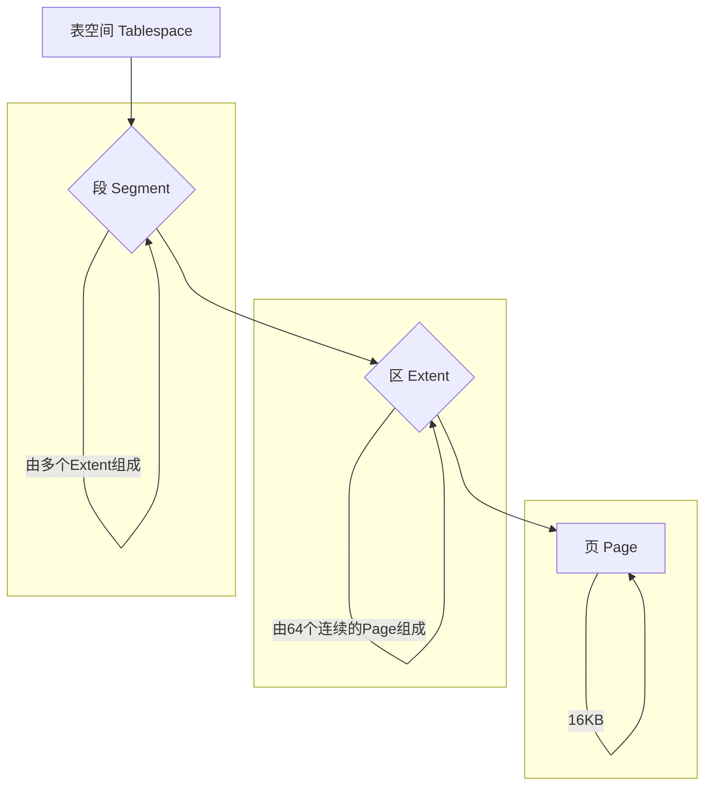
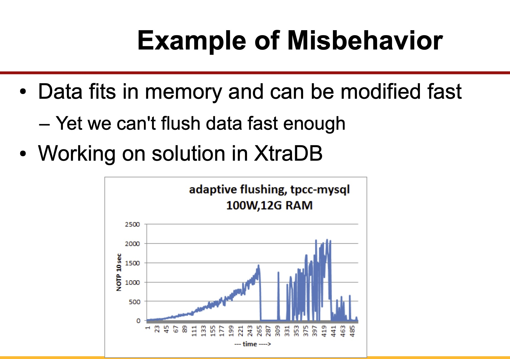

## AI论文解读 | Innodb Architecture and Internals
        
### 作者        
digoal        
        
### 日期        
2025-09-07        
        
### 标签        
PostgreSQL , PolarDB , DuckDB , AI , 论文解读        
        
----        
        
## 背景  
      
https://www.percona.com/sites/default/files/PLDC2012-innodb-architecture-and-internals.pdf        
  
提示:          
```          
读懂《Innodb Architecture and Internals》这篇论文需要提前掌握哪些基础知识, 请使用中文通熟易懂的讲解这些基础知识, 可以引用论文中的图、表或使用Markdown支持的图形(text,mermaid等)增加解释性. 
  
使用中文通熟易懂的解读《Innodb Architecture and Internals》这篇论文, 其中的关键内容请着重讲解, 可以引用论文中的图、表或使用Markdown支持的图形(text,mermaid等)增加解释性. 
  
提取《Innodb Architecture and Internals》这篇论文中的重要术语, 使用中文对这些术语进行通熟易懂的讲解, 可以引用论文中的图、表或使用Markdown支持的图形(text,mermaid等)增加解释性. 
```     
  
## 1 前置知识 
  
根据你提供的文件《Innodb Architecture and Internals》的内容，要理解这篇论文，你需要具备以下几个方面的基础知识。

### 1. 数据库基础知识
* **什么是OLTP（联机事务处理）**：论文中提到InnoDB是一个“传统OLTP引擎”。你需要知道OLTP系统主要处理大量的、短时的事务，比如银行交易、电商订单等。这些系统的特点是高并发、数据修改频繁，对数据完整性和事务处理速度要求很高。
* **什么是存储引擎**：InnoDB是MySQL的一个“存储引擎”。你需要理解存储引擎是数据库管理系统中负责数据存储和检索的核心组件。它决定了数据在磁盘上的组织方式、如何处理事务、如何加锁等。不同的存储引擎有不同的特性和优势。
* **什么是行级锁（Row Locking）和多版本并发控制（MVCC）**：论文中提到了“Row Locking”和“MVCC”。
    * **行级锁**：这是一种锁定数据的机制，它只锁定正在被访问的特定行，而不是整个表。这大大提高了并发性能，允许多个事务同时访问同一张表的不同行。
    * **多版本并发控制（MVCC）**：论文中提到，“多版本控制”允许一个读取事务在数据被修改时读取该行的旧版本，而不需要加锁。这避免了读操作和写操作之间的冲突，提高了读操作的并发性。论文进一步解释，最新版本的行存储在数据页中，而旧版本则存储在undo空间中。

### 2. InnoDB 架构核心概念
* **表空间（Tablespaces）**：论文中指出，所有数据都存储在表空间中。你需要知道，表空间是InnoDB存储数据文件的逻辑容器，它可以是单个文件（主表空间）或多个文件（每个表一个文件）。
* **日志文件（Log Files）**：InnoDB使用循环日志文件（circular log files）来存储变更记录。这些日志文件记录了对表空间的修改，确保即使系统崩溃也能恢复数据。论文提到，这些日志不是按页组织，而是按记录组织，并且只存储“REDO”操作。
* **缓冲池（Buffer Pool）**：论文提到，数据页作为“缓冲池”中的页进行处理。你需要理解，缓冲池是InnoDB在内存中的一个重要区域，用于缓存数据库中的数据和索引页。当需要读取数据时，InnoDB会首先检查缓冲池，如果数据在这里，就可以直接使用，避免了昂贵的磁盘I/O操作。
* **索引（Indexes）**：论文中指出，InnoDB表是“索引组织表”（Index Organized Tables），主键（PRIMARY KEY）包含了数据本身，而不是指向数据的指针。你需要理解，这意味着主键的数据和实际行数据是紧密关联的，这可以提高按主键查询的性能。同时，次级索引（Secondary Indexes）则通过主键来引用行。

### 3. I/O 和内存管理
* **读写机制**：论文中解释了InnoDB如何进行磁盘I/O操作。你需要知道：
    * **读操作**：大部分由执行线程完成。
    * **写操作**：大部分是后台进行的，除非没有可用的空闲缓冲区，这时会发生同步刷新。
* **双写缓冲区（Double Write Buffer）**：论文提到了“双写缓冲区”作为数据损坏的保护机制。你需要知道，这是InnoDB为了确保在发生部分页面写入失败时能恢复数据而引入的机制。它首先将数据写入一个独立的“双写缓冲区”，然后才写入其最终位置。
* **页面校验和（Page Checksums）**：为了保护数据不被损坏，InnoDB在将数据页读入缓冲池时进行校验，并在刷新到磁盘时更新校验和。

---

通过掌握这些基础知识，你将能够更好地理解论文中关于InnoDB架构、版本改进、线程工作、内存管理、I/O操作以及事务和锁机制的详细内容，从而更深入地理解这个数据库引擎的工作原理。
  
## 2 解读论文 
  
好的, 这是一份对《Innodb Architecture and Internals》这篇技术分享的通俗易懂的中文解读。

这篇文档源自 Percona 的技术专家 Peter Zaitsev 在2012年的一次演讲 ，它深入浅出地剖析了 MySQL 最核心的存储引擎——InnoDB 的内部架构和工作原理。虽然文档有些年头，提及的是 MySQL 5.5 和 5.6 版本 ，但其中阐述的核心设计思想至今仍然是理解 InnoDB 的基石。

-----

### 一、 InnoDB 宏观架构：为高并发事务而生

首先，我们要明白 InnoDB 的定位：它是一个为**传统在线事务处理 (OLTP, Online Transaction Processing)** 设计的引擎 。想象一下电商下单、银行转账这类需要大量、快速、准确读写的场景，这就是它的主场。

它的核心架构特点可以总结为以下几点：

  * **行级存储与锁定 (Row Based Storage, Row Locking)**：数据是按行存放的，当需要修改数据时，InnoDB 锁住的是具体的行，而不是整张表。这极大地提升了并发性能，允许多个用户同时操作一张表的不同行 。
  * **MVCC (多版本并发控制)**：这是 InnoDB 的一大特色。它通过保存数据的多个历史版本，实现了“读写不阻塞”。当一个事务在修改某行数据时，其他事务可以读取这行数据修改前的版本，从而避免了等待 。我们后面会详细讲解。
  * **数据与日志分离**：
      * **表空间 (Tablespaces)**：是数据的最终存储位置 。
      * **循环日志文件 (Circular log files)**：在数据写入表空间之前，所有的变更会先被记录到日志文件中 。这确保了数据库在崩溃后能够快速恢复。
  * **缓冲池 (Buffer Pool)**：为了加速读写，InnoDB 会把磁盘上的数据页加载到内存中的一个叫做“缓冲池”的区域进行缓存和操作 。

### 二、 物理存储结构：数据是如何落地的？

InnoDB 的数据文件并不是一个简单的文件，它有精密的层级结构。

#### 1\. 表空间 (Tablespaces)

表空间是存放所有实际数据和索引的逻辑容器 。它有两种主要模式：

  * **共享表空间**：所有表的数据都存放在一个或多个共享的大文件（通常是 `ibdata1`）中。系统信息总是存放在这里 。
  * **独立表空间**：通过设置 `innodb_file_per_table=1`，每张表的数据和索引会存放在一个独立的 `.ibd` 文件中 。这是目前推荐和默认的方式，因为它更易于管理（如备份、迁移、收缩空间）。

#### 2\. 段、区、页 (Segment, Extent, Page)

表空间内部的组织结构可以用下面的关系来理解：



  * **页 (Page)**：是 InnoDB 进行磁盘 I/O 的最小单位，通常为 16KB。所有数据都存储在页中。
  * **区 (Extent)**：为了高效管理，InnoDB 将64个连续的页划分为一个“区”，大小为 1MB 。
  * **段 (Segment)**：一个段由多个区组成，它类似于一个逻辑上的“文件” 。InnoDB 中，每个索引都有两个段：一个用于存放叶子节点（Leaf node segment），另一个用于存放非叶子节点（Non-leaf node segment）。此外还有回滚段（Rollback Segment）等特殊段 。

#### 3\. 日志文件 (Log Files)

日志文件（通常是 `ib_logfile` 开头的几个文件 ）是 InnoDB 的安全保障。

  * **用途**：只记录 **REDO** 操作，即“如何重做一次修改” 。比如，它会记录“在哪个页的哪个位置写入什么数据” 。这保证了即使数据库在把修改从内存写入磁盘前宕机，重启后也能通过日志恢复数据。
  * **循环写入**：日志文件是循环使用的。当写到文件末尾，会回到开头覆盖旧的日志 。前提是，被覆盖的日志所对应的“脏数据页”必须已经被刷回磁盘上的表空间了 。
  * **记录格式**：日志不是按页组织的，而是由一条条的日志记录（records）组成 。

### 三、 线程架构：谁在幕后工作？

InnoDB 依赖多种后台线程来处理不同的任务，从而避免阻塞用户请求。

  * **Main Thread (主线程)**：像一个总调度员，负责安排各种后台任务，如刷脏页、合并插入缓冲、执行检查点等 。
  * **IO Threads (IO线程)**：专门负责读写。分为读线程（Read Threads）和写线程（Write Threads） 。
  * **Log Thread (日志线程)**：专门负责将内存中的日志缓冲区内容刷新到磁盘上的日志文件 。
  * **Purge Thread(s) (清理线程)**：MVCC 的“垃圾回收员”。当一个数据的旧版本不再被任何活跃的事务所需要时，这个线程就会负责清理它 。

### 四、 内存管理：性能的加速器

  * **Buffer Pool (缓冲池)**：这是 InnoDB 最核心的内存区域 。它缓存了从磁盘读取的数据页和索引页。当需要访问数据时，InnoDB 首先在缓冲池里查找，如果命中，则无需访问慢速的磁盘，性能会极大提升。所有的数据修改也首先在缓冲池的页上进行。
  * **Log Buffer (日志缓冲区)**：这是一个较小的内存区域，用于暂存即将写入日志文件的记录 。通过先在内存中汇总，再批量写入磁盘，可以显著减少 I/O 次数。

### 五、 磁盘I/O：与硬盘的交互艺术

#### 1\. 写操作

  * **数据写入**：大部分数据写入是**后台异步**的。用户线程修改了缓冲池中的页后就可以返回了，脏页会由后台的 IO 线程在合适的时机刷回磁盘 。
  * **日志写入**：日志的写入策略由 `innodb_flush_log_at_trx_commit` 参数控制，对数据安全性至关重要：
      * `1` (默认)：每次事务提交时，都必须将日志刷到磁盘并调用 `fsync()` 确认落盘。最安全，但性能最低 。
      * `2`：每次提交时，只将日志写入操作系统的文件缓存，不保证立即落盘。MySQL 崩溃数据不丢，但操作系统宕机可能丢失数据 。
      * `0`：大约每秒刷一次日志到磁盘。性能最好，但服务器宕机时可能丢失最后一秒的事务 。

#### 2\. Double Write Buffer (双写缓冲)

这是一个防止数据页损坏的“双重保险”机制。由于页（16KB）的写入并非原子操作，在写入过程中宕机可能导致页只写了一部分，造成数据损坏（Partial Page Write）。

为解决此问题，InnoDB 在将脏页写入最终的数据文件前，会先**完整地**把它写入一个叫 Double Write Buffer 的连续磁盘区域。写完后，再把页写入它本来的位置 。万一在后一步写入时发生崩溃，InnoDB 重启后可以从 Double Write Buffer 中找到完好的页副本进行恢复，确保了数据页的一致性 。

#### 3\. 自适应刷新 (Adaptive Flushing)

这是一种智能的脏页刷新机制，InnoDB 会根据负载情况（特别是日志的产生速度）动态调整每秒要刷新的脏页数量，以避免日志空间被用尽而导致的性能抖动 。文档中第20页的图表演示了在刷新跟不上写入速度时，系统性能会出现剧烈的、断崖式的下跌 。

  

> *图表演示了当数据修改速度过快，后台的“自适应刷新”跟不上时，会导致系统性能周期性地剧烈抖动 。*

### 六、 索引：InnoDB 的核心是索引

  * **索引组织表 (Index Organized Tables)**：在 InnoDB 中，“表就是索引，索引就是表”。具体来说，每张表的数据都直接存储在主键索引（也叫聚簇索引）的叶子节点上 。
  * **主键 (Primary Key)**：
      * 因为数据和主键绑定存储，所以通过主键查找数据非常快，只需一次索引查找。
      * 强烈推荐使用**自增 ID** 作为主键。因为自增 ID 是顺序的，新数据总是追加到最后，写入效率很高。如果使用 UUID 这样的随机值做主键，会导致频繁的页分裂和数据移动，造成大量碎片和性能下降 。
  * **二级索引 (Secondary Indexes)**：
      * 二级索引的叶子节点存储的不是数据的物理地址，而是对应行的**主键值** 。
      * 因此，通过二级索引查找数据需要两步：1) 在二级索引中找到主键值。2) 用这个主键值去主键索引中查找完整的数据行。这个过程也叫“回表”。
      * 这也意味着，**过长的主键会让所有二级索引都变得臃肿**，浪费存储空间并影响性能 。

### 七、 多版本并发控制 (MVCC)：读写不加锁的奥秘

MVCC 是实现高性能并发读写的关键。

  * **工作原理**：当一行数据被修改时，InnoDB 不会直接覆盖旧数据，而是会创建一个新版本的数据 。旧版本的数据会被存放到一个叫做 **Undo Space (或 Rollback Segment)** 的地方 。这些版本通过指针连接成一个版本链。
  * **事务快照**：当一个事务开始时（在 `REPEATABLE-READ` 隔离级别下 ），它会获得一个数据“快照”。之后无论其他事务如何修改数据，这个事务看到的都是启动时刻的那个版本，它会沿着版本链去寻找对自己可见的那个旧版本 。
  * **垃圾回收**：当一个旧版本确认不再被任何活跃事务需要时，后台的 **Purge 线程**就会来把它彻底删除，回收空间 。如果更新非常频繁，而 Purge 线程跟不上，Undo Space 可能会急剧膨胀，影响性能 。

### 八、 锁机制：最后的防线

尽管 MVCC 解决了读写冲突，但在“写写”冲突时，仍然需要锁。

  * **行锁 (Row Lock)**：锁定单条记录。这是 InnoDB 锁的基本单位 。
  * **间隙锁 (Gap Lock)**：这是 InnoDB 的一个特色，也是很多死锁的根源。它不仅锁定符合条件的行，还会锁定这些行之间的“间隙” 。这样做是为了在 `REPEATABLE-READ` 隔离级别下防止“幻读”——即一个事务在两次查询之间，另一个事务插入了新的、符合查询条件的行。间隙锁把这个“缝隙”也锁住了，阻止了插入 。
  * **自增锁 (Auto-Increment Lock)**：在旧版 MySQL 中（5.0及之前），`INSERT` 语句会获取一个表级的 `AUTO_INC` 锁，这在高并发插入时会成为严重瓶颈 。从 MySQL 5.1 开始，通过 `innodb_autoinc_lock_mode` 参数引入了更轻量级的锁模式，大大提升了并发插入性能 。

-----

### 总结

这篇分享为我们描绘了一幅 InnoDB 内部工作的全景图。理解其核心组件——如**缓冲池**（性能核心）、**日志文件**（安全基石）、**MVCC**（并发关键）和以**主键为核心的索引结构**（数据组织方式）——对于我们进行 MySQL 数据库设计、性能优化和故障排查至关重要。虽然技术细节不断演进，但这些 foundational 的架构思想依然闪耀着光芒。
  
## 3 术语 
  
---

### 重要的 InnoDB 术语

根据《Innodb Architecture and Internals》这篇论文，以下是理解 InnoDB 架构和内部工作原理的一些重要术语：

#### 1. 存储和文件（Storage and Files）

* **表空间 (Tablespaces)**: 所有的 InnoDB 数据都存储在表空间中 。你可以把表空间想象成一个数据库数据的物理容器，它可以是一个单独的大文件，也可以是每个表对应一个文件 。系统元数据（如表和索引的定义）总是存储在主表空间中 。
* **日志文件 (Log Files)**: InnoDB 使用一系列日志文件（通常命名为 `ib_logfile?`）来存储对数据的更改记录 。这些日志文件是循环使用的，就像一个圆环 。更改记录必须在对应的表空间页面被刷新到磁盘前完成，否则日志文件不能被覆盖 。日志文件中的记录不是按页面组织的，而是按记录组织的，并且与磁盘扇区（512 字节）对齐 。

#### 2. 内存管理和线程（Memory Management and Threads）

* **缓冲池 (Buffer Pool)**: 这是 InnoDB 在内存中的主要缓存区域，由 `innodb_buffer_pool_size` 参数控制大小 。它不仅缓存数据页，还包含 Insert Buffer 和锁信息等 。论文指出，实际占用的内存会比设定的参数多，因为需要额外的空间来处理锁存器（Latches）和 LRU 列表等 。
* **主线程 (Main Thread)**: 这是一个后台线程，负责调度各种活动，如刷新数据（flush）、清理（purge）、检查点（checkpoint）和合并 Insert Buffer 等 。
* **I/O 线程 (IO Threads)**: InnoDB 有多个 I/O 线程用于不同的任务，包括：
    * **读线程**: 用于预读（read-ahead）操作 。
    * **写线程**: 用于后台写入数据 。
    * **日志线程**: 用于刷新日志文件 。

#### 3. 并发和事务（Concurrency and Transactions）

* **行级锁 (Row Locking) 和 MVCC (Multi-Version Concurrency Control)**: InnoDB 是一个支持行级锁和 MVCC 的数据库引擎 。
    * **MVCC**：它允许多个事务同时访问同一行数据 。当一个事务正在修改数据时，另一个读事务可以读取该行的旧版本，从而避免了锁的开销 。最新的行版本存储在数据页中，而旧版本则存储在 undo 空间里 。
* **事务隔离级别 (Transaction isolation Modes)**: 论文提到了 InnoDB 支持四种隔离级别，每种级别对数据读取的可见性有不同的影响 ：
    * **SERIALIZABLE**: 使用锁定读，绕过多版本控制 。
    * **REPEATABLE-READ**: （默认级别）读取事务开始时已提交的数据 。
    * **READ-COMMITED**: 读取语句开始时已提交的数据 。
    * **READ-UNCOMMITED**: 读取未提交的数据，可以看到实时变化 。
* **间隙锁 (Gap Locks)**: InnoDB 不仅锁定行本身，还会锁定行与行之间的“间隙” 。这对于在锁定模式下保持读取一致性非常重要，可以防止“幻读”问题 。
* **自增锁 (Auto Increment Locks)**: 论文指出，MySQL 5.1 之后，自增锁的行为发生了重大变化 。通过 `innodb_autoinc_lock_mode` 参数，可以配置在简单插入操作时不再持有表级锁，大大改善了并发插入的性能 。

#### 4. I/O 性能和优化（I/O Performance and Optimization）

* **双写缓冲区 (Double Write Buffer)**: 这是 InnoDB 保护数据不被损坏的机制 。当页面写入时，它会先写入双写缓冲区，然后同步到其原始位置 。这确保了在发生部分写入失败时，页面可以从双写缓冲区恢复，从而保证日志恢复过程中的页面一致性 。
* **刷新列表写入 (Flush List Writes)**: 这是 InnoDB 将脏页（即已修改但尚未写入磁盘的页面）从缓冲池刷新到磁盘的方式 。刷新脏页的目的是为了释放日志空间 。论文指出，Percona Server 提供了更多的刷新模式，并且如果刷新跟不上，可能会导致停顿 。
* **`innodb_flush_log_at_trx_commit`**: 这个参数控制日志文件何时被刷新到磁盘 。
    * `1`: 在每次事务提交时调用 `fsync` 。
    * `0`: 不调用 `fsync`，日志在后台每秒刷新一次 。
    * `2`: 刷新到操作系统缓存，但不安静 `fsync` 。

---
  
## 参考        
         
https://www.percona.com/sites/default/files/PLDC2012-innodb-architecture-and-internals.pdf    
        
<b> 以上内容基于DeepSeek、Qwen、Gemini及诸多AI生成, 轻微人工调整, 感谢杭州深度求索人工智能、阿里云、Google等公司. </b>        
        
<b> AI 生成的内容请自行辨别正确性, 当然也多了些许踩坑的乐趣, 毕竟冒险是每个男人的天性.  </b>        
  
