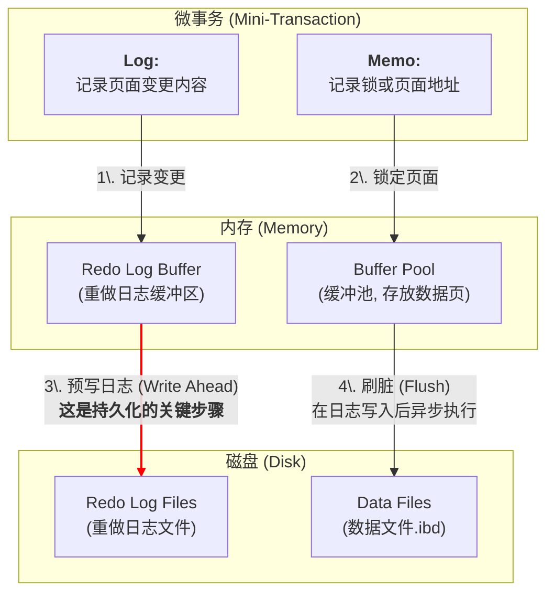
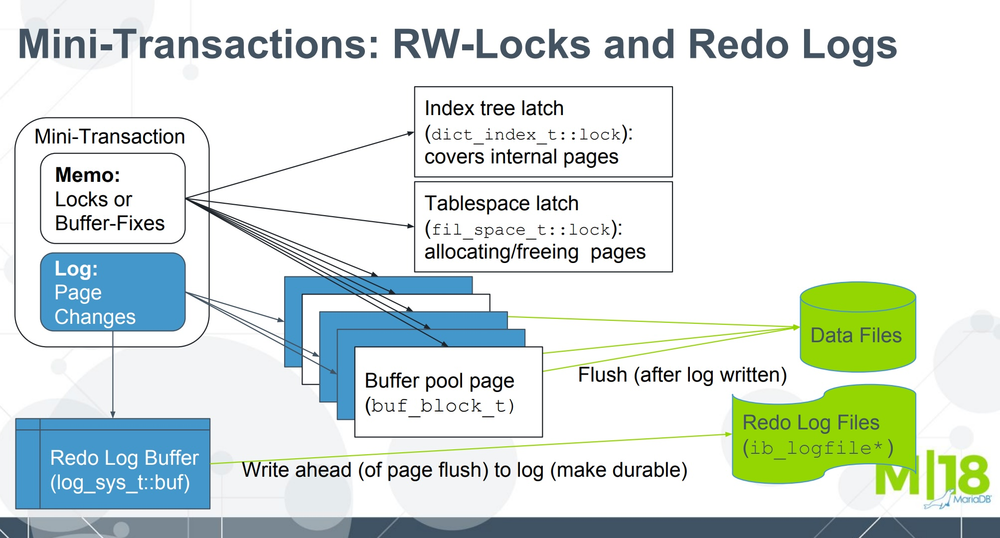
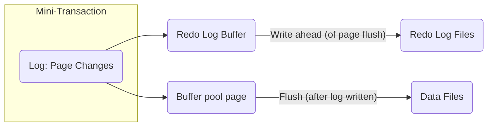

## AI论文解读 | Deep Dive: InnoDB Transactions and Write Paths
        
### 作者        
digoal        
        
### 日期        
2025-09-07        
        
### 标签        
PostgreSQL , PolarDB , DuckDB , AI , 论文解读        
        
----        
        
## 背景  
      
https://mariadb.org/wp-content/uploads/2018/02/Deep-Dive_-InnoDB-Transactions-and-Write-Paths.pdf        
  
提示:          
```          
读懂《Deep Dive: InnoDB Transactions and Write Paths》这篇论文需要提前掌握哪些基础知识, 请使用中文通熟易懂的讲解这些基础知识, 可以引用论文中的图、表或使用Markdown支持的图形(text,mermaid等)增加解释性. 
  
使用中文通熟易懂的解读《Deep Dive: InnoDB Transactions and Write Paths》这篇论文, 其中的关键内容请着重讲解, 可以引用论文中的图、表或使用Markdown支持的图形(text,mermaid等)增加解释性. 
  
提取《Deep Dive: InnoDB Transactions and Write Paths》这篇论文中的重要术语, 使用中文对这些术语进行通熟易懂的讲解, 可以引用论文中的图、表或使用Markdown支持的图形(text,mermaid等)增加解释性. 
```     
  
## 1 前置知识 
  
您好，根据您提供的《Deep Dive: InnoDB Transactions and Write Paths》这篇文档，要理解其内容，您需要提前掌握以下基础知识：

### 1. 数据库事务和ACID特性
理解这篇文档首先需要掌握数据库事务的基本概念以及ACID特性（原子性、一致性、隔离性、持久性）。

* **原子性（Atomicity）**：一个事务中的所有操作要么全部成功，要么全部失败回滚。文档中提到“Mini-transaction is an atomic set of page reads or writes” ，并且“An atomic mini-transaction becomes durable when its log is fully written to the redo log” 。这说明InnoDB通过Mini-transaction来实现部分操作的原子性。
* **持久性（Durability）**：事务提交后，其所做的修改会永久保存在数据库中。文档中提到“An atomic mini-transaction becomes durable when its log is fully written to the redo log” ，这说明InnoDB通过 **Redo Log（重做日志）** 来保证持久性。

### 2. InnoDB内部概念
文档中提到了许多InnoDB特有的概念，这些是理解文章核心内容的关键。

* **Mini-transaction（微事务）**：这不同于用户定义的事务。它是一个更小的、原子性的操作单元，用于执行一系列页面读写，并依赖于预写式重做日志（write-ahead redo log）来保证原子性和持久性 。文章提到一个用户事务可能包含多个微事务，例如，在B-树中插入一条记录并进行一系列页面分裂时，就涉及多个微事务 。
* **Redo Log（重做日志）**：用于记录数据页面的物理修改，确保在系统崩溃时可以恢复数据。文档中的图表清晰地展示了“Redo Log Buffer”和“Redo Log Files”如何通过“write ahead”的方式，在数据页面刷新（Flush）之前，将日志写入磁盘，从而保证数据持久化。
* **Undo Log（回滚日志）**：用于保存数据被修改前的信息，主要用于事务回滚和MVCC（多版本并发控制）。文章指出，一个事务在修改索引之前会写入回滚日志 。
* **Buffer Pool（缓冲池）**：InnoDB在内存中缓存数据和索引页面的区域。文档中的图表显示，数据页的修改首先发生在缓冲池中。
* **DB_TRX_ID**和**DB_ROLL_PTR**：这是InnoDB用于实现MVCC的两个重要隐藏字段。
    * **DB_TRX_ID**是一个全局递增的事务ID，每个记录都会带上修改它的事务ID 。
    * **DB_ROLL_PTR**是一个指针，指向该记录的上一版本在回滚日志中的位置，它们共同构成一个从新版本到旧版本的单向链表 。
* **Purge（清除）**：一个后台维护线程，用于清除旧版本的回滚日志和已删除的记录，当不再有事务需要访问它们时进行 。

### 3. 存储引擎和OSI模型
文档将InnoDB的层次结构与OSI模型进行了对比，这需要您对OSI模型（开放式系统互联模型）有基本的了解。

* **OSI模型对比**：文档将MariaDB服务器的层级与OSI模型的上层（应用层、表示层、会话层）进行对比，并将InnoDB存储引擎的层级与OSI模型的下层（传输层、网络层、数据链路层、物理层）进行对比 。这有助于从整体架构上理解InnoDB在整个数据库系统中的位置和作用。

### 4. 事务隔离级别和MVCC
理解InnoDB的事务隔离级别和MVCC（多版本并发控制）是掌握文档中读操作和锁机制的基础。

* **事务隔离级别**：文档中提到了 `READ UNCOMMITTED`、`READ COMMITTED`、`REPEATABLE READ` 和 `SERIALIZABLE` 这四种隔离级别，并解释了它们如何影响“读视图”（Read View）的创建和行为 。
* **多版本并发控制（MVCC）**：InnoDB通过读视图（Read View）和回滚日志（Undo Log）实现了非锁定的读操作 。一个读视图可以看作是数据库的一个虚拟快照，它只看到在视图创建时已经提交的事务的修改 。如果一个事务需要读取被其他未提交事务修改的记录，它会通过DB_ROLL_PTR指针去回滚日志中寻找旧版本 。

如果您掌握了以上这些概念，阅读这篇文档将会事半功倍，能够更好地理解InnoDB事务处理和写入路径的内部机制。
  
## 2 解读论文 
  
好的，我们来一起深入解读这篇由InnoDB首席开发者亲自撰写的技术分享——《Deep Dive: InnoDB Transactions and Write Paths》。这篇文档详细地剖析了当一个写操作（如UPDATE）发生时，数据是如何从客户端连接开始，经过层层处理，最终安全地落到物理硬盘上的。

理解 InnoDB 的内部工作原理，对于数据库管理员（DBA）和后端开发者进行性能优化、问题排查至关重要。

### 核心思想：InnoDB的“七层模型”

作者非常巧妙地借用了网络通信的OSI七层模型，来类比MariaDB/MySQL和InnoDB的内部结构，帮助我们理解其层次化的设计。

| OSI 模型 | MariaDB 服务器层 | InnoDB 存储引擎层 | 作用 |
| :--- | :--- | :--- | :--- |
| **应用层** | 客户端连接 | | 处理客户端的连接请求。 |
| **表示层** | SQL | | SQL解析、权限检查、查询优化和执行。 |
| **会话层** | 存储引擎接口 | | 定义了服务器与InnoDB等不同存储引擎交互的统一规范（如事务开始、提交、回滚）。 |
| **传输层** | | **事务 (Transaction)** | 提供了我们熟知的ACID特性，通过锁和读视图（Read View）实现多表的原子、一致、隔离的访问。 |
| **网络层** | | **微事务 (Mini-transaction)** | 这是InnoDB的基石。它负责**多个数据页**的原子性、持久性修改，并依赖Redo Log进行崩溃恢复。 |
| **数据链路层** | | **操作系统 (OS)** | 文件系统（如Ext4, XFS）和块设备管理。 |
| **物理层** | | **硬件 (Hardware)** | 最终存储数据的物理介质，如SSD、HDD。 |

这个分层模型清晰地告诉我们，一个简单的SQL请求，在数据库内部会经历一系列精心设计的、职责分明的处理层次。

-----

### InnoDB的基石：微事务 (Mini-Transaction, mtr)

这是理解InnoDB工作原理的**第一个关键概念**。

  * **它不是用户事务**：用户事务（`BEGIN...COMMIT`）可能包含很多操作，持续时间较长。而微事务是一个非常短暂的、内部的、底层的操作单元。
  * **原子性**：一个微事务包含了一系列对数据页的修改，这些修改要么全部成功，要么全部不成功。例如，B+树的一次页分裂，会涉及对多个页面的修改，这个过程必须由一个微事务来保证其原子性。 
  * **没有回滚**：微事务一旦提交，就不能回滚。  它的正确性由上层逻辑保证。
  * **持久性**：微事务的持久性（Durability）不依赖于数据页是否写入磁盘，而是依赖于它的 **重做日志（Redo Log）** 是否写入磁盘。  这就是著名的 **预写日志（Write-Ahead Logging, WAL）** 策略。

下图清晰地展示了微事务的工作流程，这是整篇文档中最重要的图之一：



  

*图解：微事务流程图（根据原文档Page 8重绘）*

**流程解读：**

1.  一个微事务开始，它会记录将要修改的页面（在Buffer Pool中）以及具体的变更内容。
2.  变更内容被写入内存中的 **Redo Log Buffer**。
3.  微事务提交时，会先将Redo Log Buffer中的内容写入到磁盘上的 **Redo Log File**。**一旦写入成功，这个微事务的修改就被认为是持久化的、安全的，即使数据库此时崩溃也不会丢失。** 
4.  之后，内存中被修改过的数据页（称为“脏页”）才会在未来的某个时刻，被异步地刷（Flush）到磁盘的 **Data File** 中。 

这种“日志先行”的机制，将随机、离散的数据页写入操作，转换为了对Redo Log文件的顺序追加写入，极大地提升了性能，同时保证了数据的持久性。

-----

### 事务的两大核心日志：Redo Log 与 Undo Log

| 日志类型 | 核心作用 | 解决什么问题 | 通俗比喻 |
| :--- | :--- | :--- | :--- |
| **Redo Log (重做日志)** | 保证 **持久性(Durability)** | 防止数据库崩溃（如断电）后，已提交事务的数据丢失。用于**崩溃恢复**。 | **账本**。记录了所有让数据“变新”的操作。断电重启后，InnoDB会翻开这个账本，把没来得及写入数据文件的操作重新做一遍，确保数据完整。 |
| **Undo Log (撤销日志)** | 保证 **原子性(Atomicity)** 和 **隔离性(Isolation)** | 1.  支持事务**回滚(Rollback)**。 \<br\>2.  实现**多版本并发控制(MVCC)**，让不同事务能看到数据的不同版本。  | **操作快照/悔棋谱**。记录了数据在修改**前**的样子。事务需要回滚时，就按照这个“悔棋谱”把数据恢复原状。当一个事务需要读取数据时，如果最新版本对它不可见，InnoDB也会用它来构建出合适的历史版本。 |

简单来说，**Redo Log是向前滚（Roll-Forward），用于崩溃恢复；Undo Log是向后滚（Roll-Back），用于事务回滚和MVCC。** 

-----

### 一次完整的写入之旅：`UPDATE`语句深度剖析

文档通过一个`UPDATE`语句的例子，详细拆解了整个内部流程。 

`UPDATE talk SET attendees = 25 WHERE conference="M|18" AND name="Deep Dive";`

#### 第1步：SQL层

  * MySQL服务器接收到SQL，进行解析、检查权限、获取表上的元数据锁（防止执行期间表结构被修改），并利用统计信息生成一个最优的查询执行计划。 

#### 第2步：读取与锁定 (Read & Lock)

  * InnoDB根据执行计划，通过索引找到匹配的记录。 
  * 在第一次读取时，如果还没有事务，InnoDB会“懒启动”一个事务，并为其分配一个全局递增的事务ID (`DB_TRX_ID`)。 
  * 为了防止其他事务修改，InnoDB会对找到的记录加上排他锁（X-Lock）。InnoDB的锁是加在索引记录上的，而不是物理行上。 

#### 第3步：执行更新 (关键步骤)

这是一个由多个微事务组成的过程：

1.  **写入Undo Log**：在修改数据**之前**，InnoDB会启动一个**微事务**，将这行数据**修改前**的样子（旧值）写入Undo Log页面。  这一步是后续能够回滚和实现MVCC的基础。
2.  **更新主键索引**：接着，启动**另一个微事务**来更新主键索引（聚簇索引）中的记录。  这次更新会：
      * 修改数据列的值（`attendees = 25`）。
      * 更新记录头部的隐藏列 `DB_TRX_ID` 为当前事务的ID。
      * 更新隐藏列 `DB_ROLL_PTR`，使其指向刚刚写入的Undo Log记录，形成一个版本链。 
3.  **更新二级索引** (如果被更新的列上有二级索引)：
      * 启动**一个微事务**，将二级索引中包含旧值的记录“标记为删除”（delete-mark）。 
      * 再启动**另一个微事务**，向二级索引中插入一条包含新值的新记录。 

#### 第4步：提交事务 (Commit)

  * 当SQL执行完毕，因为是`AUTOCOMMIT`模式，服务器会自动发起提交。 
  * InnoDB会启动**最后一个微事务**，将该事务的状态标记为“已提交”，这个信息会记录在Undo日志系统的相关页面中。 
  * 这个微事务的日志被写入Redo Log Buffer，并根据`innodb_flush_log_at_trx_commit`的设置，刷入磁盘上的Redo Log文件。**当这一步完成，事务的修改就真正实现了持久化**。 
  * 最后，释放该事务所持有的所有行锁，并唤醒可能在等待这些锁的其他事务。 

#### 第5步：后台清理 (Purge)

事务提交后，工作并没有完全结束。之前写入的Undo Log和被标记为删除的旧二级索引记录，变成了“历史版本”。

  * InnoDB有专门的后台**Purge线程**，会周期性地检查并清理那些不再被任何活跃事务的“读视图（Read View）”所需要的历史版本数据。 
  * **Purge Lag（清理延迟）**：如果系统中存在一个长时间运行的事务（例如一个耗时很长的`SELECT`），它会持有一个很早的Read View。这会导致Purge线程无法清理这个Read View之后产生的所有历史版本，造成Undo空间持续增长，性能下降。  这是DBA需要重点监控和避免的情况。

-----

### 数据安全与恢复的终极保障

#### 双写缓冲区 (Doublewrite Buffer)

  * **问题**：当InnoDB将内存中的脏页写入数据文件时，如果发生操作系统崩溃或断电，可能导致一个数据页只写了一半（a torn page），造成数据损坏，并且这种情况Redo Log也无法修复，因为Redo Log记录的是对页面的逻辑修改，而不是页面的完整镜像。 
  * **解决方案**：在将脏页写入其最终位置之前，InnoDB会先将其完整地写入到一个位于系统表空间内，名为“Doublewrite Buffer”的连续区域。  这是一个两步写操作：
    1.  `Buffer Pool -> Doublewrite Buffer` （顺序写，很快）
    2.  `Doublewrite Buffer -> Data File` （随机写）
  * **恢复**：在启动恢复时，如果InnoDB发现一个数据页是损坏的，它会直接从Doublewrite Buffer中找到该页的一个完好副本进行恢复，然后再应用Redo Log。 

#### 崩溃恢复 (Crash Recovery)

如果数据库异常宕机，重启时InnoDB会执行以下步骤来确保数据的一致性和持久性：

1.  **应用Redo Log**：从上一个检查点（Checkpoint）开始，扫描Redo Log文件，将所有已提交事务但未写入数据文件的修改，重新应用到内存的Buffer Pool中。  在此期间，会借助Doublewrite Buffer修复可能存在的损坏页。 
2.  **回滚未提交事务**：扫描Undo Log，找到所有在宕机时仍未提交的事务，并根据Undo Log记录的信息，执行回滚操作，撤销这些事务所做的所有修改。 

### 结论

《Deep Dive: InnoDB Transactions and Write Paths》为我们揭示了InnoDB作为一个高可靠、高性能事务存储引擎的精密设计。其核心在于：

  * **分层架构**：清晰地划分了不同组件的职责。
  * **微事务**：作为原子操作的基石，保证了底层修改的一致性。
  * **日志先行 (WAL)**：通过Redo Log将随机写优化为顺序写，并保证了数据的持久性。
  * **Undo Log 与 MVCC**：巧妙地实现了事务的回滚和高并发下的非锁定读。
  * **多重安全机制**：通过Doublewrite Buffer和严谨的崩溃恢复流程，最大限度地保障了数据的安全。

理解了这条贯穿内存与磁盘的“写入路径”，你就能更深刻地把握InnoDB的行为，从而更有效地设计应用、优化性能和处理棘手的数据库问题。
  
## 3 术语 
  
根据您提供的《Deep Dive: InnoDB Transactions and Write Paths》这篇文档，以下是其中一些重要术语的提取和通俗易懂的中文讲解：

### 1\. 迷你事务 (Mini-transaction)

迷你事务是InnoDB内部一个非常小的、原子性的操作单元 。它不是我们通常所说的用户事务，而是用于完成一系列页面读写任务的。例如，当你向一个B-树索引插入一条记录，可能需要进行页面分裂，这个过程就是由一系列迷你事务完成的 。

**重要特性：**

  * **原子性**：迷你事务是原子性的，要么全部完成，要么全部不执行 。
  * **无回滚**：与用户事务不同，迷你事务没有回滚机制 。一旦发生修改，它会通过 **Redo Log（重做日志）** 来保证持久性 。
  * **与用户事务的关系**：一个用户事务通常由多个迷你事务组成 。

### 2\. 重做日志 (Redo Log)

重做日志是InnoDB用于实现**持久性**的关键 。它记录了数据页面的物理修改，比如“某页面的第X个字节从A改成了B” 。

**运作方式：**

当迷你事务对数据页面进行修改时，它会先将这些修改记录到内存中的 **重做日志缓冲（Redo Log Buffer）** 中 。然后，这些日志记录会以“预写”（write ahead）的方式，在数据页面刷新（flush）到磁盘之前，先被写入到磁盘上的 **重做日志文件（Redo Log Files）** 中 。

文档中的图展示了这一流程:



这个过程保证了即使数据库在数据页面写入磁盘前崩溃，也可以通过重做日志来恢复数据，确保事务的持久性。

### 3\. 回滚日志 (Undo Log)

回滚日志主要用于两种情况：**事务回滚**和**多版本并发控制（MVCC）** 。它存储了数据被修改前的版本。

**运作方式：**

  * **事务回滚**：当一个事务需要回滚时，InnoDB会读取回滚日志，根据其中记录的旧数据版本来撤销之前的修改 。
  * **多版本并发控制**：InnoDB的 **读视图（Read View）** 会利用回滚日志来读取事务开始时的数据快照 。如果一个事务需要访问一个已经被更新或删除的记录，它会通过记录中的一个隐藏指针 **DB\_ROLL\_PTR** 来找到回滚日志中的旧版本，从而看到正确的“历史”数据 。

### 4\. 读视图 (Read View)

读视图是InnoDB实现MVCC的关键概念，它为非锁定读操作提供了一个“虚拟快照” 。

**重要特性：**

  * **快照时间**：它包含了当前事务的修改，以及在创建该视图时已经提交的所有事务的修改 。
  * **隔离级别**：不同的隔离级别会影响读视图的创建时机:
      * **`REPEATABLE READ`**：在事务的第一次读操作时创建读视图，并一直保持到事务结束 。
      * **`READ COMMITTED`**：在每个SQL语句的第一次读操作时创建新的读视图 。

### 5\. 脏页 (Dirty Pages)

脏页是指在 **缓冲池（Buffer Pool）** 中被修改过，但尚未写入磁盘的数据页面 。

**管理方式：**

InnoDB会维护一个脏页列表，按照迷你事务的结束日志序列号（LSN）排序 。后台线程会异步地将这些脏页刷新到数据文件中，以保证持久化 。

### 6\. 清除线程 (Purge)

清除线程是后台运行的，它的任务是回收那些不再被任何活动读视图引用的旧版本回滚日志和被标记为删除的记录 。

**重要性：**

  * **文件空间**：如果存在长时间运行的事务（持有旧的读视图），清除线程就无法工作 。这会导致回滚日志文件持续增长，因为旧版本的数据无法被清理 。
  * **性能影响**：过长的 **历史列表长度（History list length）** 会导致MVCC和隐式锁检查变慢，从而影响性能 。

-----

这些术语相互关联，共同构成了InnoDB事务和数据写入的核心机制。理解它们如何协同工作，能帮助我们更好地理解数据库的性能问题和故障恢复过程。
  
## 参考        
         
https://mariadb.org/wp-content/uploads/2018/02/Deep-Dive_-InnoDB-Transactions-and-Write-Paths.pdf    
        
<b> 以上内容基于DeepSeek、Qwen、Gemini及诸多AI生成, 轻微人工调整, 感谢杭州深度求索人工智能、阿里云、Google等公司. </b>        
        
<b> AI 生成的内容请自行辨别正确性, 当然也多了些许踩坑的乐趣, 毕竟冒险是每个男人的天性.  </b>        
  
