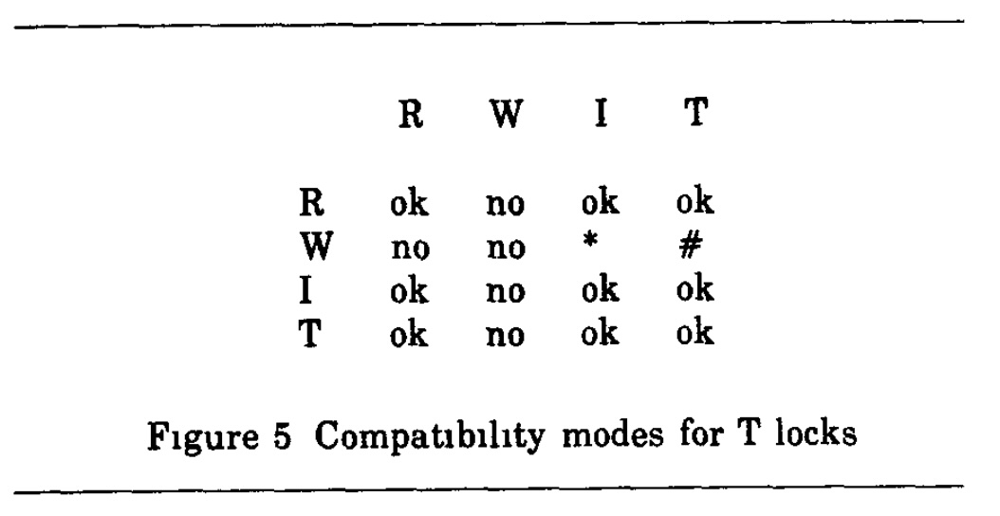

## AI论文解读 | THE DESIGN OF POSTGRES
        
### 作者        
digoal        
        
### 日期        
2025-09-07        
        
### 标签        
PostgreSQL , PolarDB , DuckDB , AI , 论文解读        
        
----        
        
## 背景  
      
https://dl.acm.org/doi/pdf/10.1145/16856.16888        
  
提示:          
```          
读懂《THE DESIGN OF POSTGRES》这篇论文需要提前掌握哪些基础知识, 请使用中文通熟易懂的讲解这些基础知识, 可以引用论文中的图、表或使用Markdown支持的图形(text,mermaid等)增加解释性. 
  
使用中文通熟易懂的解读《THE DESIGN OF POSTGRES》这篇论文, 其中的关键内容请着重讲解, 可以引用论文中的图、表或使用Markdown支持的图形(text,mermaid等)增加解释性. 
  
提取《THE DESIGN OF POSTGRES》这篇论文中的重要术语, 使用中文对这些术语进行通熟易懂的讲解, 可以引用论文中的图、表或使用Markdown支持的图形(text,mermaid等)增加解释性. 
```     
  
## 1 前置知识 
  
阅读《THE DESIGN OF POSTGRES》这篇论文需要提前掌握一些数据库系统的核心基础知识。这篇论文是 1985 年发表的，它是 PostgreSQL 数据库的早期设计理念，其中包含许多突破性的思想，但它建立在当时已有的数据库概念之上。

以下是理解这篇论文所需的一些关键基础知识：

### 1. 关系型数据库基础 (Relational Database Fundamentals)

首先，你需要对关系型数据库有基本的了解。这包括：

* **表 (Table)、行 (Row) 和列 (Column)：** 关系型数据库的核心是数据以二维表格的形式组织。
* **主键 (Primary Key) 和外键 (Foreign Key)：** 了解如何使用键来唯一标识一行数据以及建立表与表之间的关系。

---

### 2. 事务处理 (Transaction Processing)

这篇论文的核心内容之一是其独特的事务管理方式，这与传统的数据库设计有很大不同。因此，理解事务的基本概念是至关重要的：

* **事务 (Transaction)：** 数据库操作的基本单位，它要么全部成功，要么全部失败。
* **ACID 特性：** 理解事务的四个关键特性，即原子性 (Atomicity)、一致性 (Consistency)、隔离性 (Isolation) 和持久性 (Durability)，这是确保数据完整性的基石。
* **并发控制 (Concurrency Control)：** 在多用户同时访问数据库时，如何确保数据的一致性。论文中提到了 **锁 (Locks)** 和 **多版本并发控制 (MVCC)** 的概念。Postgres 的设计使用了 MVCC 的思想，通过保留数据的多个版本来实现“时间旅行” (time-varying data)，这使得恢复代码更简单，并且能够支持对历史数据的访问。
* **日志 (Logging)：** 传统数据库通常使用**预写日志 (Write-Ahead Log, WAL)** 来实现崩溃恢复。这篇论文提出了一种不同的方法，即**将日志视为由数据库管理系统管理的普通数据**。在论文的存储系统设计中，它没有使用传统的预写日志，而是通过更改日志中事务的状态（从“in progress”到“committed”）来提交事务。

---

### 3. 数据存储和索引 (Data Storage and Indexing)

理解数据如何在磁盘上存储以及如何高效检索是数据库设计的基础。

* **堆文件 (Heap Files)：** 论文中提到了 Postgres 将数据写入堆文件 (heap files) 中。你需要知道堆文件是一种常见的数据组织方式，其中数据以记录集合的形式存储，并且记录通常具有固定的长度。
* **索引 (Indexes)：** 索引是提高数据检索速度的关键。论文提到了 **B-树 (B-tree)** 和其他索引技术。理解索引如何工作，可以帮助你理解论文中如何通过索引来加速对数据的查询。
* **多版本元组 (Multi-version Tuples)：** 论文提出，当更新一个元组 (tuple) 时，它并不会被覆盖，而是会创建一个新的元组来代替。这需要理解元组的基本结构，例如在论文中提到的包含 **tmin**（元组有效的开始时间戳）和 **tmax**（元组失效的时间戳）等字段。这种设计是实现 MVCC 和支持历史数据访问的关键。

---

### 4. 论文中的创新点和延伸概念

理解了上述基础知识后，你将能更好地理解论文中那些新颖的设计思想：

* **可扩展性 (Extensibility)：** 论文提出允许用户定义自己的数据类型、操作符和访问方法。这是一个重要的突破，使得数据库不再局限于内置的类型。
* **活动数据库 (Active Databases) 和规则 (Rules)：** 这篇论文是“活动数据库”的先驱，提倡使用**触发器 (Triggers)** 和**警报 (Alerters)** 来自动响应数据变化。如果你理解触发器的概念，将更容易理解论文中关于这一部分的讨论。
* **对象关系型数据库 (Object-Relational Database)：** 论文的设计目标之一是更好地支持**复杂对象 (complex objects)**。理解对象-关系型数据库的基本概念，可以帮助你更好地理解 Postgres 如何在保留关系模型的同时，融入面向对象的特性，例如表的**继承 (inheritance)**。
  
## 2 解读论文 
  
好的，我们来一起深入解读这篇数据库领域的经典论文——《THE DESIGN OF POSTGRES》。这篇由数据库先驱 Michael Stonebraker 和 Lawrence A. Rowe 在1986年发表的论文，描绘了一个旨在接替其早期成功作品 INGRES 的、具有革命性设计理念的新一代关系数据库管理系统 (DBMS)——POSTGRES。

POSTGRES (即 "POST-INGRES") 的设计初衷是为了解决传统关系型数据库在处理日益复杂的应用场景（如工程设计、地理信息系统等）时所暴露出的种种不足。它在保留关系模型简洁性的基础上，引入了一系列极具前瞻性的功能。

-----

### **核心设计目标：POSTGRES 的六大支柱**

论文开宗明义，指出了 POSTGRES 项目的六个核心设计目标，这六大目标构成了其架构的基石，并深刻影响了后续数据库技术的发展。

1.  **更好地支持复杂对象 (Complex Objects)** 
    传统数据库善于处理结构规整的商业数据（如员工、部门），但面对工程应用中的复杂数据（如地理信息中的多边形、电路设计图）则力不从心。如果强行用多张表来模拟，查询会变得异常复杂且性能低下 。POSTGRES 的首要目标就是原生支持这些复杂对象，允许将一个对象直接存储在表的字段中，从而通过一次查询就能获取整个对象，极大地提升了效率 。

2.  **提供用户可扩展性 (User Extendibility)** 
    传统 DBMS 内置的数据类型、操作符和存取方法有限。POSTGRES 旨在打破这一限制，允许用户根据应用需求自定义新的数据类型（如`坐标`类型）、新的操作符（如计算`距离`）以及新的存取方法（如用于空间数据的 R-tree 索引） 。这使得数据库能够更好地适应各种新兴应用领域。

3.  **支持主动数据库与推理 (Active Databases and Inferencing)** 
    数据库不应仅仅是被动存储数据的容器。POSTGRES 计划引入“主动”能力，包括：

      * **警报器 (Alerters)**：当数据发生特定变化时，能主动通知应用程序 。
      * **触发器 (Triggers)**：当一个更新操作发生时，能自动触发另一个数据更新，以维护数据一致性 。
      * **规则与推理 (Rules and Inferencing)**：允许将复杂的业务逻辑（如员工薪酬计算规则）直接存储在数据库中，数据库可以根据这些规则“推理”出结果，而不是将数据作为静态值存储 。这为构建专家系统提供了底层支持。

4.  **简化崩溃恢复机制 (Simplified Crash Recovery)** 
    传统数据库的崩溃恢复代码非常复杂且难以调试 。POSTGRES 提出了一种创新的方法：**不覆盖旧数据**。更新或删除操作并不是直接修改磁盘上的数据，而是创建一条新的记录，并标记旧记录为“失效”。这种机制将日志（Log）的概念与数据本身融为一体，极大地简化了崩溃恢复的逻辑 。

5.  **利用新兴硬件技术 (Exploiting New Technologies)** 
    论文预见到了未来硬件发展的趋势，旨在设计一个能够充分利用这些新技术的系统，包括：

      * **光盘 (Optical Disks)**：作为廉价、大容量的归档存储介质 。
      * **多核处理器工作站 (Multi-processor Workstations)**：通过合理的进程架构发挥多 CPU 的优势 。
      * **定制 VLSI 芯片 (Custom VLSI Chips)**：设计能够通过专用硬件加速的架构 。

6.  **尽可能少地修改关系模型 (Minimal Changes to Relational Model)** 
    尽管 POSTGRES 增加了大量新功能，但其核心仍然是关系数据模型。设计者坚信关系模型的“斯巴达式简洁” (spartan simplicity) 依然强大 。目标是在这个简洁、被广泛接受的模型基础上进行扩展，而不是推倒重来，创造一个全新的、复杂的模型 。

-----

### **POSTQUEL：一个更强大的查询语言**

为了支持上述目标，POSTGRES 对其前身 INGRES 的查询语言 QUEL 进行了大幅扩展，新语言被称为 **POSTQUEL** 。

#### **创新的数据类型**

除了整数、浮点数、字符串等标准类型，POSTQUEL 引入了两个极具特色的数据类型：`POSTQUEL` 和 `procedure` 。

  * **POSTQUEL 类型**: 字段的值本身就是一条或多条 POSTQUEL 查询语句 。这正是实现“复杂对象”的关键。例如，一个“复杂图形”对象可以有一个类型为 `POSTQUEL` 的字段，里面存储着检索其所有组成部分（如多条线、一个圆）的查询 。

    下面的图表演示了如何用 `POSTQUEL` 字段来表示共享子对象的复杂对象。对象 "apple" 和 "orange" 都共享了 ID 为 10 的多边形 (POLYGON) 。

| Name | OBJ |
| :--- | :--- |
| **apple** | `retrieve (POLYGON all) where POLYGON.id = 10` \<br\> `retrieve (CIRCLE all) where CIRCLE.id = 40` |
| **orange**| `retrieve (LINE all) where LINE.id = 17` \<br\> `retrieve (POLYGON all) where POLYGON.id = 10` |

图 1：使用 POSTQUEL 字段表示复杂对象 

  

  * **Procedure 类型**: 字段的值可以是一个用通用编程语言（如 C 语言）写成的过程 。这使得复杂的计算逻辑可以被封装并存储在数据库中，实现了计算向数据的移动。

#### **对时间的支持：历史数据与版本**

POSTGRES 的存储系统设计天然支持**时间旅行**功能 。

  * **历史数据查询**: 由于数据永不覆盖，可以轻易查询到过去任意时间点的数据状态 。例如，查询1985年1月7日的员工信息 ：
    ```sql
    retrieve (E.all)
    from E in EMP["7 January 1985"]
    ```
  * **数据版本控制**: 类似于软件版本控制系统，可以从一个关系或快照创建出一个“版本” (Version)。对版本的修改不会影响到基础关系，并且提供 `merge` 命令将版本的修改合并回去 。

#### **迭代、触发器与规则的实现**

  * **迭代查询**: 在命令后加上 `*` 号，可以让查询迭代执行，直到结果集不再变化为止。这对于计算传递闭包（如“查询某人手下所有级别的员工”）非常有用 。
  * **触发器和警报器**: 通过在查询中加入 `always` 关键字来实现。例如，一个 `always` 的 `delete` 命令就定义了一个触发器 。
  * **规则 (向后链接)**: 通过 `demand` 关键字定义。这种命令用于定义“虚拟列”，这些列的值不是预先存储的，而是在被查询时，通过执行相应的 `demand` 命令动态“推理”出来的 。

-----

### **系统架构：实现创新的基石**

为了高效地实现上述功能，POSTGRES 设计了一套精巧的系统架构。

#### **进程结构**

系统采用“一用户一进程” (process-per-user) 的模型。一个中心协调进程 `POSTMASTER` 负责管理锁和各种后台“恶魔”进程（demon processes），例如负责异步编译用户查询的恶魔进程 。


  

图 2：POSTGRES 进程结构示意图 (基于论文图3) 

#### **查询处理与创新的锁机制**

POSTGRES 的查询处理器是可扩展的，能利用用户定义的存取方法 。而其实现“过程化数据”、“触发器”和“规则”的核心，是一套扩展的锁机制。除了传统的读(R)/写(W)锁，它还引入了三种特殊的锁：

  * **I 锁 (Invalidate-me locks)**: 用于缓存管理。当一个查询的结果被缓存后，系统会在所有被该查询读取过的数据对象上放置 I 锁。任何事务想要写入一个带有 I 锁的数据时，不会被阻塞，但会导致持有该 I 锁的缓存结果被标记为“失效” 。

  * **T 锁 (Trigger locks)**: 用于实现 `always` 命令（触发器/警报器）。当一个 `always` 命令被定义后，系统会在它将要读写的所有数据对象上放置 T 锁。当有事务写入一个带 T 锁的数据时，锁管理器会“唤醒”对应的 `always` 命令，使其重新执行 。

  * **D 锁 (Demand locks)**: 用于实现 `demand` 命令（规则）。规则会在它将要写入的虚拟列上放置 D 锁。当一个查询试图读取这个带有 D 锁的虚拟列时，该查询会被挂起，系统转而执行定义该虚拟列的 `demand` 命令（规则），以计算出所需的值，这个过程类似于 PROLOG 的统一过程 。

下面的表格展示了 I 锁和 T 锁与传统锁的兼容性矩阵（ok表示兼容, no表示不兼容）。

  

图 3: I 锁兼容性矩阵 (\* 表示写操作会使 I 锁失效)

  

图 4: T 锁兼容性矩阵 (\# 表示写操作会唤醒 T 锁对应的命令)


#### **存储系统：不可变数据的艺术**

POSTGRES 的存储系统是其设计的核心亮点。

  * **三层存储结构**: 系统设想了一个三层存储体系，包括内存、磁盘和光盘。当前数据存放在磁盘，而历史数据则由后台的“吸尘器” (vacuum) 进程迁移到光盘等归档介质上 。

  * **元组格式**: 每个元组（即表中的一行）都有一个在创建时分配且永不改变的唯一标识符 (IID) 。此外，每个元组还包含以下关键的系统字段 ：

      * `tmin`: 记录该元组版本生效的时间戳。
      * `tmax`: 记录该元组版本失效的时间戳。
      * `BXID`: 创建该元组版本的事务ID。
      * `EXID`: 使该元组版本失效的事务ID。

    当一个元组被`update`时，系统不会在原地修改它。而是：

    1.  将旧元组的 `tmax` 和 `EXID` 填上当前事务的信息。
    2.  插入一个带有新数据的新元组，其 `tmin` 和 `BXID` 为当前事务信息 。
        这种“无覆盖” (no-overwrite) 的策略是简化崩溃恢复和支持时间旅行的关键。

### **结论与影响**

《THE DESIGN OF POSTGRES》不仅仅是一篇论文，它更是一个宏伟的蓝图。它所提出的许多概念，如用户可扩展性、对复杂对象的支持、规则系统、时间旅行查询以及快照隔离（通过其存储模型实现），都远超其时代，并为后来的 PostgreSQL（一个实现了这些理念并获得巨大成功的开源数据库）以及整个数据库行业的发展奠定了坚实的基础。这篇论文展示了如何在不牺牲关系模型核心优势的前提下，构建一个功能强大、灵活且能适应未来挑战的数据库系统。
  
## 3 术语 
  
根据《THE DESIGN OF POSTGRES》这篇论文，以下是一些重要的术语及其通俗易懂的中文解释：

---

### 1. 关系模型 (Relational Model)

这是这篇论文的基础。关系模型是一种组织数据的方式，它将数据存放在一个个**表格**（或称为“关系”）中。每个表格由**行**（代表一条记录）和**列**（代表记录中的一个属性）组成。这是现代绝大多数数据库的核心思想。

### 2. 对象关系型数据库 (Object-Relational Database, ORDBMS)

论文的核心创新之一。传统的数据库只支持简单的类型，比如数字和字符串。而这篇论文提出了一种新的数据库类型，它在保留关系模型（表格、行、列）优点的同时，融入了面向对象编程的一些概念。这包括：
* **支持复杂对象**：列的数据类型不再局限于简单的数字或字符串，可以是更复杂的对象结构。
* **用户可扩展性**：允许用户自己定义新的数据类型、操作符和访问方法，从而使数据库的功能可以根据特定需求进行扩展。

### 3. 多版本并发控制 (Multi-Version Concurrency Control, MVCC)

这是论文中**存储系统**设计的核心。传统数据库在更新数据时，通常会直接覆盖旧数据。而 POSTGRES 的设计思想是，每次更新或删除数据时，并不会修改原来的数据，而是**创建一个新的数据版本**。

举个例子：
一个名为“张三”的员工记录，年龄是 30。当他的年龄更新为 31 时，数据库并不会修改原来的记录，而是在内部创建一个新的记录，新记录的年龄是 31，而旧的记录仍然保留。

这种设计带来了两个重要的好处：
1.  **“时间旅行” (Time-Varying Data)**：由于历史数据版本被保留，你可以查询某个时间点的数据，就像乘坐时光机一样。
2.  **简化的崩溃恢复**：因为它不需要复杂的“预写日志”（WAL），数据库崩溃后，只需要查看哪个事务完成了，哪些没完成，而不需要大量的回滚操作。

### 4. 元组 (Tuple)

在关系模型中，“元组”就是表格中的**一行数据**。在 POSTGRES 的设计中，每个元组都带有一些特殊的元数据，这些元数据是实现 MVCC 的关键。论文中提到了以下几个重要字段：
* **IID (Immutable ID)**: 元组的不可变 ID，一个唯一的标识符。
* **tmin**: 这个元组版本生效的时间戳。
* **tmax**: 这个元组版本失效的时间戳。
* **BXID**: 创建这个元组的事务 ID。
* **EXID**: 使这个元组失效的事务 ID。

这些字段共同决定了某个版本的元组在哪个时间段内是有效的。

### 5. 活动数据库 (Active Databases) 和规则 (Rules)

这部分设计使得数据库不仅仅是被动地存储数据，而是可以主动地响应某些事件。论文中提到了两种机制：
* **警报器 (Alerters)**：当数据库中发生某个事件（例如，某个值被改变）时，警报器会向应用程序发送通知。
* **触发器 (Triggers)**：当满足特定条件时（例如，向一个表插入一行数据），触发器会自动执行一个预定义的动作（例如，向另一个表也插入一行数据）。

这篇论文是现代数据库中 **存储过程** 和 **触发器** 机制的早期思想来源。

### 6. 存储系统 (Storage System)

这篇论文的设计中，存储系统是一个非常特别的部分。它提出了一个不同于传统 **预写日志 (Write-Ahead Log, WAL)** 的事务管理方法。

* **传统 WAL**：在数据被写入磁盘前，先将操作记录到日志文件中。如果系统崩溃，可以通过日志来恢复数据。
* **POSTGRES 存储系统**：通过保留数据的多个版本（MVCC），将事务日志本身也当作数据库中的“普通数据”来管理。这样，**崩溃恢复几乎是即时完成的**，因为它不需要重做或撤销操作，只需要检查事务的状态即可。

### 7. INGRES

论文在开头就提到了 INGRES。它是由 Michael Stonebraker（论文作者之一）在 1970 年代开发的另一个关系型数据库系统。POSTGRES 的设计目标就是**作为 INGRES 的继任者**，解决 INGRES 在处理复杂数据类型、事务和规则等方面的不足。了解 INGRES 的背景有助于理解 POSTGRES 设计的动机和目标。
  
## 参考        
         
https://dl.acm.org/doi/pdf/10.1145/16856.16888    
        
<b> 以上内容基于DeepSeek、Qwen、Gemini及诸多AI生成, 轻微人工调整, 感谢杭州深度求索人工智能、阿里云、Google等公司. </b>        
        
<b> AI 生成的内容请自行辨别正确性, 当然也多了些许踩坑的乐趣, 毕竟冒险是每个男人的天性.  </b>        
  
