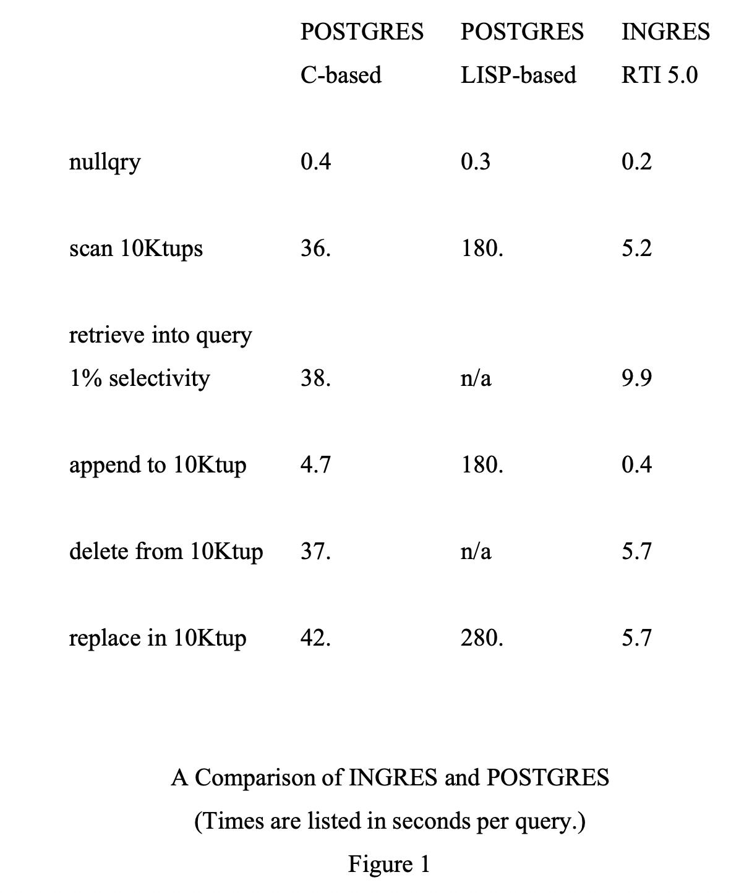

## AI论文解读 | THE IMPLEMENTATION OF POSTGRES
        
### 作者        
digoal        
        
### 日期        
2025-09-07        
        
### 标签        
PostgreSQL , PolarDB , DuckDB , AI , 论文解读        
        
----        
        
## 背景  
      
https://dsf.berkeley.edu/papers/ERL-M90-34.pdf        
  
提示:          
```          
读懂《THE IMPLEMENTATION OF POSTGRES》这篇论文需要提前掌握哪些基础知识, 请使用中文通熟易懂的讲解这些基础知识, 可以引用论文中的图、表或使用Markdown支持的图形(text,mermaid等)增加解释性. 
  
使用中文通熟易懂的解读《THE IMPLEMENTATION OF POSTGRES》这篇论文, 其中的关键内容请着重讲解, 可以引用论文中的图、表或使用Markdown支持的图形(text,mermaid等)增加解释性. 
  
提取《THE IMPLEMENTATION OF POSTGRES》这篇论文中的重要术语, 使用中文对这些术语进行通熟易懂的讲解, 可以引用论文中的图、表或使用Markdown支持的图形(text,mermaid等)增加解释性. 
```     
  
## 1 前置知识 
  
读懂《THE IMPLEMENTATION OF POSTGRES》这篇论文需要提前掌握以下几个方面的基础知识：

### 1. 数据库管理系统（DBMS）的基础概念
这篇论文是对传统关系型数据库管理系统（Relational DBMS）的扩展和改进，因此了解传统DBMS的核心概念是基础。
* **关系模型（Relational Model）**: 了解关系、属性、元组等基本概念 。论文提到，当前的商业关系型数据库系统主要面向高效支持商业数据处理应用，这些应用需要存储和访问大量固定格式的记录实例 。
* **查询语言（Query Language）**: 掌握SQL等关系型查询语言的基本语法和功能。论文的查询语言POSTQUEL是传统关系型查询语言的超集 。
* **事务管理（Transaction Management）**: 了解事务、并发控制、日志（write-ahead log, WAL）等概念。这篇论文提出了一种新颖的“无覆盖存储管理器”（no-overwrite storage manager），与传统的WAL方案不同，因此理解传统方案有助于对比和理解POSTGRES的创新之处 。
* **存储管理（Storage Management）**: 理解数据库如何将数据存储到磁盘上，以及索引（如B+-树）的作用 。论文讨论了POSTGRES的存储系统，这与传统系统有显著不同 。

### 2. 面向对象编程（OOP）的概念
POSTGRES旨在融合面向对象和关系型数据库的优点，因此了解OOP的几个核心概念至关重要。
* **抽象数据类型（Abstract Data Types）**: 了解如何定义新的数据类型以及相应的操作。POSTGRES提供了一个抽象数据类型工具，用户可以构建新的基本类型 。
* **对象标识符（Object Identifier, OID）**: 理解唯一标识一个对象的概念。POSTGRES为每个记录赋予一个唯一的OID，这使得在不同记录之间进行导航成为可能 。
* **类（Classes）与继承（Inheritance）**: 了解类如何定义数据结构以及继承如何创建类型层次结构。在POSTGRES中，用户可以创建“构造类型”（constructed types）并使其继承其他类型的数据元素 。
* **方法（Methods）与函数（Functions）**: 理解将行为封装在对象中的概念。论文中的函数（functions）就扮演了类似方法的角色 。

### 3. 数据库扩展与新一代数据库
论文讨论了如何将数据库扩展到新的应用领域（如CAD、工程应用），这需要了解当时数据库领域的发展趋势和面临的挑战。
* **数据管理（Data Management）**: 传统的面向商业应用的数据管理 。
* **对象管理（Object Management）**: 存储和操作非传统数据类型（如位图、图标、文本、多边形）的能力 。
* **知识管理（Knowledge Management）**: 存储和强制执行规则的能力，例如应用中的完整性约束 。

POSTGRES旨在提供一个三维的解决方案，即同时支持数据管理、对象管理和知识管理 。

---

为了更好地理解这些概念在论文中的应用，可以参考论文中的具体例子，例如：
- 定义一个名为`DEPT`的构造类型，其中包含一个`floorspace`属性，其类型为`polygon`（多边形），这展示了如何支持非传统数据类型 。
- 定义一个名为`SALESMAN`的类型，它继承了`EMP`类型的所有数据元素，这体现了继承的概念 。

***

**小贴士**: 论文中反复提到，为了简化概念，他们有意地让用户可以用"constructed type"、"relation"和"class"互换使用，以及"record"、"instance"和"tuple"互换使用 。这表明POSTGRES在设计上模糊了关系型和面向对象模型的界限，因此在阅读时不必过于纠结于这些术语的严格区分，理解其背后的概念即可。
  
## 2 解读论文 
  
好的，这是一份对经典论文《THE IMPLEMENTATION OF POSTGRES》的通俗易懂的解读。这篇论文由数据库领域的泰斗 Michael Stonebraker 等人撰写，它不仅介绍了 POSTGRES 的设计与实现，更宝贵的是，它坦诚地反思了项目中的设计决策、遇到的困难以及他们认为“做错了”的地方。这使其成为一篇极具学习价值的“经验教训”总结。

### 论文核心思想：构建一个“三维”数据库系统

在项目启动时，传统的关系型数据库主要用于商业数据处理，也就是“数据管理” 。但作者们预见到，未来的应用需要更强大的功能 。他们提出了一个“三维”数据库的构想，这也是 POSTGRES 的核心设计目标 。

我们可以用一个简单的文本图来理解这三个维度：

```text
                      ^ 知识管理 (Knowledge Management)
                      | - 规则 (Rules)
                      | - 推理 (Inference)
                      | - 约束 (Constraints)
                      |
                      |
<---------------------|---------------------> 对象管理 (Object Management)
 数据管理             |                       - 复杂数据类型 (e.g., a bitmap, text, polygon)
 (Data Management)    |                       - 对象标识 (Object ID)
 - 高效存储与访问     |                       - 继承 (Inheritance)
 - 传统事务处理       |
                      |
```

1.  **数据管理 (Data Management)**：这是传统数据库的基本功，负责高效地存储和访问标准格式的数据，如数字、字符串等 。
2.  **对象管理 (Object Management)**：指有效存储和操作非传统数据类型的能力，例如图像、文本、多边形等几何形状 。这是为了满足 CAD 等工程应用的需求 。
3.  **知识管理 (Knowledge Management)**：指存储和执行应用语义中的“规则”的能力 。这些规则不仅能定义完整性约束（例如，两个竞争对手的广告不能出现在对开页 ），还能用于派生数据 。

POSTGRES 的目标就是成为第一个同时提供这三种服务的“三维数据管理器” 。

-----

### 第一大支柱：扩展的数据模型与查询语言 (POSTQUEL)

为了实现“对象管理”维度，POSTGRES 对传统的关系模型进行了大幅扩展。

#### 关键特性

  * **丰富的类型系统**：

      * **基础类型 (Base Types)**：用户可以自定义新的基础数据类型，例如`money`、`compressed integers`等，而不仅限于内置的整数、字符串 。
      * **构造类型 (Constructed Types)**：类似于其他语言中的“类”或“结构体”，可以将多个基础类型或其他构造类型组合成一个新类型 。例如，`DEPT`类型可以包含`dname`（字符串）、`floor`（整数）和`floorspace`（多边形）。
      * **POSTQUEL 类型**：允许一个字段的值是另一条查询语句的结果，这可以用来模拟非规范化的嵌套关系 。

  * **强大的函数体系**：

      * **普通函数 (Normal Functions)**：可以用 C 或 LISP 等通用编程语言编写，处理复杂逻辑 。但缺点是优化器无法理解其内部逻辑，导致查询优化困难 。
      * **操作符 (Operators)**：是特殊的一元或二元函数，可以被查询优化器理解，并能利用索引进行加速 。例如，可以为多边形定义一个“面积大于”(AGT) 的操作符 。
      * **POSTQUEL 函数**：任何 POSTQUEL 查询本身都可以被定义成一个函数 。这非常强大，可以将复杂的逻辑（如TP1基准测试中的5条SQL命令）封装成一个函数，从而减少客户端与数据库之间的通信次数，提升性能 。

  * **继承 (Inheritance)**：构造类型可以从其他一个或多个类型继承属性 。例如，`SALESMAN`可以继承自`EMP`，自动获得`name`, `dept`等属性，并增加自己的`quota`属性 。

  * **高级查询能力**：

      * **路径表达式 (Path Expressions)**：可以直接通过点表示法访问嵌套构造类型中的属性，如`EMP.dept.floor`，而无需进行显式的连接（JOIN）操作 。
      * **及物闭包 (Transitive Closure)**：通过`retrieve*`语法，可以方便地处理层次结构数据，例如查询一个人的所有祖先 。
      * **时间旅行 (Time Travel)**：通过`EMP[T]`这样的语法，可以查询某个特定时间点的历史数据 。

#### 作者的反思：我们在这里犯了错

论文坦率地指出了数据模型设计中的五个缺陷：

1.  **联合类型 (Union Types)**：未能很好地支持“一个字段的类型可以是A或B”这样的需求 。虽然尝试通过`ANY`这种通用类型来绕过，但作者认为这不是一个令人满意的方案，正确的做法应该是直面其复杂性并完全支持它 。
2.  **访问方法接口 (Access Method Interface)**：允许用户添加新的索引类型（如R-tree）是一个很好的想法 ，但接口设计得过于复杂 。添加一个新索引需要开发者深刻理解锁、缓冲区管理等底层机制，编写13个复杂的函数 。这使得普通用户几乎不可能完成 。
3.  **函数 (Functions)**：POSTQUEL函数虽然方便，但缺乏`if-then-else`等编程逻辑控制能力 。作者反思，也许应该允许函数用一种增强了数据库查询能力的通用语言（如4GL）来编写，从而统一普通函数和POSTQUEL函数 。
4.  **大对象 (Big Objects)**：系统支持任意大小的数据类型（如大位图），但接口却无法让用户只获取对象的一部分 。这给应用程序带来了巨大的缓冲压力，因为必须一次性接收整个大对象 。
5.  **数组 (Arrays)**：虽然支持了基础类型的数组（如`float[12]`），但不支持构造类型的数组，也没有为数组元素提供内置的搜索机制 。作者认为，要么就全面支持数组，要么就完全不支持，目前这种“半成品”状态并不理想 。

-----

### 第二大支柱：强大的规则系统 (PRS)

为了实现“知识管理”维度，POSTGRES 设计了一套非常前卫的规则系统。

#### 设计哲学与第一版实现 (PRS I)

  * **统一语法**：目标是只用一套规则系统来同时满足用户需求（如完整性约束）和数据库内部需求（如视图），避免多套系统带来的复杂性 。

  * **混合实现**：

      * **查询重写 (Query Rewrite)**：在查询执行前，根据规则将其改写成另一种形式。适合少量、影响范围广的规则 。
      * **触发器 (Triggers)**：在数据被访问或修改时，在底层触发相应动作。适合大量、只影响少数实例的规则 。

  * **`always` 语法**：PRS I 的核心是一种非常强大的`always`语法，它声明一个命令逻辑上“永远在运行” 。例如，要让Joe的薪水永远和Fred保持一致，只需一条规则 ：
    `always replace EMP (salary = E.salary) where EMP.name = "Fred" and E.name = "Joe"`
    这条规则既能在Fred薪水变化时自动更新Joe的薪水，也能阻止用户直接修改Fred的薪水，比传统的“IF-THEN”规则更简洁 。

#### 作者的反思：第一版规则系统的问题

PRS I 的理念虽然先进，但实现后暴露了三大问题：

1.  **极度复杂 (Complexity)**：其底层实现依赖于在数据记录、字段甚至索引上设置各种“标记”(markers)来唤醒规则，这套机制非常复杂和难以理解，连开发者自己都觉得可能不完全正确 。
2.  **功能缺失 (Absence of Needed Function)**：尽管功能强大，PRS I 却无法很好地支持对非物化视图（non-materialized views）的更新操作，这是一个巨大的缺陷 。
3.  **效率问题 (Efficiency)**：标记机制在某些场景下会占用大量空间。例如，一条规则如果影响1000名员工，可能会产生数万字节的标记开销 。

#### 解决方案：第二版规则系统 (PRS II)

由于上述问题，团队决定设计 PRS II 。PRS II 回归了更传统的“生产规则”范式，以获得解决视图更新问题所需的控制力 。

  * **新语法**：`ON event TO object WHERE ... THEN DO ...` 。
  * **解决了视图更新**：通过为视图上的`retrieve`, `append`, `delete`, `replace`等不同事件分别定义规则，可以清晰地将视图操作映射到底层表的相应操作上，轻松解决了PRS I的难题 。
  * **保留了优点**：PRS II 同样可以被查询重写或触发器机制实现，并且保留了处理完整性约束、保护等所有功能 。代价是，像“Joe-Fred薪水联动”这样的规则需要写两条规则而不是一条 。

-----

### 第三大支柱：创新的“无覆盖”存储系统

这是POSTGRES在“数据管理”维度上最大胆的创新，完全摒弃了当时主流的预写日志（Write-Ahead Log, WAL）技术 。

#### 核心机制

当一条记录被更新时，传统数据库会用新数据覆盖旧数据，并将旧值写入日志文件以备回滚。而 POSTGRES 的“无覆盖”策略是：**从不删除或覆盖旧数据，而是将更新后的新版本数据写到新的位置** 。


#### 两大优势

1.  **即时恢复 (Instantaneous Recovery)**：事务中止或系统崩溃恢复几乎是瞬间完成的 。因为旧版本的数据本身就还在数据库里，不需要像传统数据库那样读取日志文件来执行“撤销”(undo)操作 。
2.  **时间旅行 (Time Travel)**：由于所有历史版本的数据都被保留了下来，系统可以轻易地支持查询过去任意时间点的数据状态，这是传统数据库无法做到的 。

#### 作者的反思：潜在的风险

  * **重负载下的不稳定性**：系统依赖一个名为“吸尘器”(vacuum cleaner)的后台进程，将过时的历史数据从主存储区移动到归档存储区 。但在高负载下，吸尘器可能没有足够的资源运行，导致主存储区膨胀，包含大量历史数据，从而拖慢对当前数据的查询性能，最终可能导致系统“熔断” 。
  * **对稳定内存的依赖**：在没有稳定主存（断电不丢数据）的情况下，无覆盖方案的性能会比WAL差 。因为它在事务提交时需要将所有被修改的**数据页**刷到磁盘（随机I/O），而WAL只需要刷**日志页**（顺序I/O），后者快得多 。

-----

### 实现中的惨痛教训：编程语言的选择

#### 为什么选择了 LISP + C？

项目初期，团队希望尝试新语言，避免再次使用C（之前开发INGRES时已用过）。他们认为LISP非常适合编写优化器和推理引擎等模块，并且被其“高编程效率”的说法所吸引 。对于底层模块如缓冲区管理器，他们决定使用C 。最终，系统由大约63000行C代码和17000行LISP代码构成 。

#### 为什么说这是“一个可怕的错误”？

作者们用非常直白的语言总结了使用LISP的弊端：

1.  **内存占用巨大 (Gigantic Footprint)**：一个空的LISP程序就需要3MB内存，导致整个POSTGRES体积超过4MB，而功能相同的纯C版本只有1MB 。
2.  **无法使用垃圾回收 (Garbage Collection)**：数据库系统不能容忍因垃圾回收导致的随机停顿，所以团队不得不手动管理内存，LISP的最大优势之一被浪费了 。
3.  **性能低下 (Slow Execution)**：LISP代码的执行速度比同等功能的C代码慢两倍以上 。
4.  **调试噩梦 (Debugging Nightmare)**：这是最致命的问题。在一个双语言系统中，C的调试器不认识LISP，LISP的调试器也不认识C 。调试跨语言的Bug，尤其是内存管理相关的Bug，是一项极其痛苦和令人沮丧的任务 。

最终，团队花费巨大精力将所有LISP代码移植到了C，以解决这些问题 。他们的结论是：**强烈建议其他人不要重蹈覆辙** 。

-----

### 性能表现

论文最后展示了POSTGRES与商业版INGRES在Wisconsin基准测试上的对比。

#### Wisconsin 基准测试对比 (运行于 SUN 3/280) 

| 查询 (Query) | POSTGRES (C-based) | POSTGRES (LISP-based) | INGRES (RTI 5.0) |
| :--- | :--- | :--- | :--- |
| **扫描1万元组** | 36.0 秒 | 180.0 秒 | 5.2 秒 |
| **追加1条记录** | 4.7 秒 | 180.0 秒 | 0.4 秒 |
| **替换1条记录** | 42.0 秒 | 280.0 秒 | 5.7 秒 |

  

*表格数据源自论文中的 Figure 1* 

从表中可以清晰地看到：

  * LISP版本的性能远低于C版本 。
  * 即使是C版本的POSTGRES，其性能也与当时的商业数据库有数倍的差距 。作者估计，其性能大约只有早期学术版INGRES的一半 。

### 总结与启示

这篇论文的伟大之处在于其深刻的自我剖析和坦诚。它给后来的数据库系统开发者留下了宝贵的财富：

  * **功能与复杂性的权衡**：POSTGRES提供了极其强大的功能，但也带来了巨大的复杂性，普通用户可能难以驾驭 。如何在提供高级功能和保持系统易用性之间找到平衡，是一个永恒的挑战。
  * **“第二系统效应”**：作者承认，他们在开发POSTGRES时，力求比之前的INGRES做得更通用、更完善（例如支持动态添加类型、完整的事务系统），但这大大增加了实现的难度和时间 。
  * **警惕技术选型的陷阱**：双语言开发的惨痛经历，为所有系统软件开发者敲响了警钟。
  * **学术原型与商业产品的差距**：论文清晰地展示了学术原型在性能上与经过优化的商业产品之间的现实差距。

总而言之，《THE IMPLEMENTATION OF POSTGRES》不仅是一份技术报告，更是一本充满智慧的“错题集”和“反思录”，它所揭示的设计原则、权衡和教训，至今仍在影响着数据库领域的发展。
  
## 3 术语 
  
在《THE IMPLEMENTATION OF POSTGRES》这篇论文中，为了理解POSTGRES系统的独特设计，有几个核心术语和概念是至关重要的。以下是对这些术语的通俗化解释：

### 1\. 无覆盖存储管理器（No-overwrite Storage Manager）

这是论文中最核心的创新之一。传统的数据库系统，当你更新一条记录时，会直接在原位置覆盖旧数据。而POSTGRES的**无覆盖存储管理器**则不同，它采用了一种“追加”（append-only）的方式。

-----

**工作原理：**

  * **更新不覆盖**：当你更新一条记录时，系统不是修改旧记录，而是在磁盘上写一条**新的、更新过的记录**。旧记录会被标记为“无效”。
  * **多版本共存**：这使得同一条逻辑记录在磁盘上可以有多个物理版本，每个版本代表在不同时间点的状态。这对于支持长事务和历史数据查询非常有用。
  * **后台清理**：为了防止磁盘空间被无效的旧记录耗尽，系统有一个后台进程，论文中称之为“垃圾收集器”（**vacuum cleaner**），它会定期清理那些不再需要的旧版本记录。

这个设计可以被形象地理解为：

> 传统数据库：你在笔记本上修改了一段文字，直接擦掉重写。
> POSTGRES：你在笔记本上修改了一段文字，不擦掉，而是在下一页重新抄写一遍，并标注“这是最新版”。之后会有个“清洁工”来把旧的废弃页面撕掉。

### 2\. POSTQUEL 查询语言

POSTQUEL 是 POSTGRES 的查询语言，它是传统关系型查询语言QUEL的超集，这意味着它在保留原有功能的基础上，增加了新的特性。

-----

**主要新增特性：**

  * **对嵌套数据结构的支持**：可以直接查询和操作复杂对象内部的数据。
  * **函数调用**：可以在查询语句中直接调用函数，这些函数可以是用户自定义的。

论文中提到，通过 POSTQUEL，你可以像下面这样查询一个部门（`dept`）中所有员工（`emp`）的姓名：
`range of d is dept`
`range of e is d.employees`
`retrieve (e.name)`

这展示了它如何优雅地处理嵌套对象（`d.employees`）。

### 3\. 数据、对象和知识管理（Data, Object, and Knowledge Management）

论文认为，为了满足更广泛的应用需求（如CAD、工程和科学），数据库需要超越传统的“**数据管理**”，扩展到另外两个维度：

  * **数据管理**：指传统数据库的核心功能，即高效存储和处理大量固定格式的记录。
  * **对象管理**：指处理复杂、非标准数据类型（如图像、多边形、文本）的能力，并支持面向对象的概念，如**抽象数据类型（ADT）和继承（Inheritance）**。
  * **知识管理**：指处理规则（**Rules**）的能力，例如，当满足某个条件时自动执行某个动作。这使得数据库不仅能存储数据，还能存储和强制执行业务逻辑。

POSTGRES旨在成为一个在这三个维度上都提供支持的系统，论文中的许多设计（如 ADT 和规则系统）都是为了实现这一目标。

### 4\. 抽象数据类型（Abstract Data Types, ADT）

抽象数据类型是 POSTGRES 实现“可扩展性”的核心机制。它允许用户定义全新的数据类型，并为这些类型编写操作函数。

-----

**举例**：
论文中举例说明了如何定义一个名为 `polygon`（多边形）的抽象数据类型，并为它定义操作函数，如 `area`（计算面积）和 `overlap`（判断多边形是否重叠）。


通过这种方式，数据库可以支持任何用户需要的复杂数据类型，而不仅仅是传统的整数、字符串和日期。
  
## 参考        
         
https://dsf.berkeley.edu/papers/ERL-M90-34.pdf    
        
<b> 以上内容基于DeepSeek、Qwen、Gemini及诸多AI生成, 轻微人工调整, 感谢杭州深度求索人工智能、阿里云、Google等公司. </b>        
        
<b> AI 生成的内容请自行辨别正确性, 当然也多了些许踩坑的乐趣, 毕竟冒险是每个男人的天性.  </b>        
  
