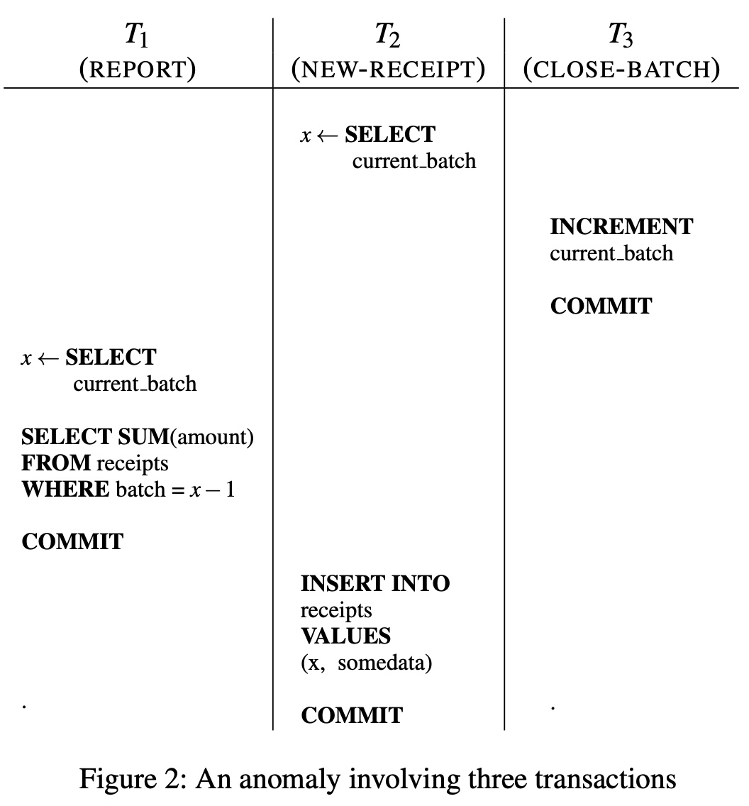

## AI论文解读 | Serializable Snapshot Isolation in PostgreSQL
        
### 作者        
digoal        
        
### 日期        
2025-09-07        
        
### 标签        
PostgreSQL , PolarDB , DuckDB , AI , 论文解读        
        
----        
        
## 背景  
      
https://arxiv.org/pdf/1208.4179        
  
提示:          
```          
读懂《Serializable Snapshot Isolation in PostgreSQL》这篇论文需要提前掌握哪些基础知识, 请使用中文通熟易懂的讲解这些基础知识, 可以引用论文中的图、表或使用Markdown支持的图形(text,mermaid等)增加解释性. 
  
使用中文通熟易懂的解读《Serializable Snapshot Isolation in PostgreSQL》这篇论文, 其中的关键内容请着重讲解, 可以引用论文中的图、表或使用Markdown支持的图形(text,mermaid等)增加解释性. 
  
提取《Serializable Snapshot Isolation in PostgreSQL》这篇论文中的重要术语, 使用中文对这些术语进行通熟易懂的讲解, 可以引用论文中的图、表或使用Markdown支持的图形(text,mermaid等)增加解释性. 
```     
  
## 1 前置知识 
  
了解《Serializable Snapshot Isolation in PostgreSQL》这篇论文需要提前掌握一些数据库事务和并发控制的基础知识，这些概念是理解论文核心思想的关键。论文的标题本身就包含了这些重要术语：“Serializable”（可串行化）、“Snapshot Isolation”（快照隔离）以及“PostgreSQL”，所以我们需要重点关注前两个概念，以及它们在数据库中是如何实现的。

以下是理解这篇论文所需的基础知识，我将结合论文内容和外部资料，用通俗易懂的方式为您讲解：

-----

### 1\. 事务（Transaction）与ACID属性

在数据库中，**事务**是一系列操作的逻辑单元，这些操作要么全部成功，要么全部失败。事务具有四个基本特性，通常被称为 **ACID**：

  * **原子性（Atomicity）**：一个事务中的所有操作要么都完成，要么都不完成。
  * **一致性（Consistency）**：事务执行前后，数据库从一个有效状态变为另一个有效状态。
  * **隔离性（Isolation）**：多个事务并发执行时，一个事务的执行不应影响其他事务的执行，就好像它们是串行执行的一样。这是这篇论文的核心主题。
  * **持久性（Durability）**：事务提交后，对数据库的修改是永久的，即使系统发生故障也不会丢失。

这篇论文主要讨论的是**隔离性**。

### 2\. 事务隔离级别与常见异常

为了在隔离性和性能之间取得平衡，SQL标准定义了四种隔离级别，从弱到强依次为：

1.  **读未提交 (READ UNCOMMITTED)**：可能出现“脏读”（Dirty Read），即一个事务读到了另一个未提交事务修改的数据。
2.  **读已提交 (READ COMMITTED)**：可以避免脏读，但可能出现“不可重复读”（Non-Repeatable Read）和“幻读”（Phantom Read）。这是许多数据库（如Oracle）的默认隔离级别。
3.  **可重复读 (REPEATABLE READ)**：可以避免脏读和不可重复读，但可能出现幻读。在MySQL的InnoDB引擎中，通过MVCC和间隙锁（Next-Key Locks）的结合，也在很大程度上解决了幻读问题。
4.  **可串行化 (SERIALIZABLE)**：最高的隔离级别，完全服从ACID，所有事务就好像是串行执行的，可以防止所有并发异常。

### 3\. 可串行化（Serializable）隔离级别

**可串行化**是最严格的隔离级别。它保证并发执行的一组事务，其最终结果与这些事务按照某种顺序一个个地串行执行所得到的结果完全一致。这意味着，你可以像编写单线程程序一样去编写事务，而不用担心并发带来的问题。

传统的实现方式是**两阶段锁（Two-Phase Locking, 2PL）**。

**两阶段锁（2PL）**
两阶段锁协议将事务的执行分为两个阶段：

1.  **增长阶段（Growing Phase）**：事务可以不断地获取所需的锁，但不能释放任何锁。
2.  **收缩阶段（Shrinking Phase）**：事务可以不断地释放所持有的锁，但不能再获取新的锁。

这种方法能保证可串行化，但由于事务需要持有锁直到其结束，可能会导致并发性降低，甚至出现**死锁**。这正是PostgreSQL过去没有实现可串行化隔离级别的原因之一，因为它被认为代价太高。

### 4\. 快照隔离（Snapshot Isolation）与多版本并发控制（MVCC）

**快照隔离（Snapshot Isolation, SI）** 是另一种隔离级别，它比可重复读更强，但比可串行化更弱。它是通过 **多版本并发控制（Multi-Version Concurrency Control, MVCC）** 来实现的。

**MVCC**的核心思想是：当一个事务修改数据时，系统不会直接覆盖旧数据，而是创建一个新版本。每个事务都只会看到其开始时的一个“快照”。

  * **快照读**：每个事务读取到的都是在它开始时，数据库的一个一致性快照，因此它看不到其他并发事务未提交或已提交的修改。这能有效避免脏读和不可重复读。
  * **写操作**：事务修改数据时，会创建新版本。它只会阻塞其他尝试修改同一行数据的事务，而不会阻塞读操作。这大大提高了并发性能。

然而，快照隔离并不等同于可串行化，它允许一种特殊的异常，即**写倾斜（Write Skew）**。

**写倾斜（Write Skew）**
这是快照隔离下最典型的异常之一，论文中用图1给出了一个例子。

  


假设初始状态有Alice和Bob两名医生在值班。

  * **T1** 读取到有2名医生，判断条件满足，准备将Alice下班。
  * **T2** 并发执行，它看到的也是T1开始时的快照，同样读取到2名医生，判断条件满足，准备将Bob下班。
  * 两个事务因为修改的是不同行（Alice和Bob），所以它们的写操作不会相互冲突，都可以提交。
  * 最终，数据库中没有医生值班，违背了“至少有一名医生值班”的业务逻辑。

如果这两个事务是串行执行的，无论哪个先执行，最终都至少会有一名医生在值班。这就是快照隔离的“非可串行化”之处。

### 5\. 可串行化快照隔离（SSI）与依赖关系

这篇论文的核心贡献就是 **可串行化快照隔离（Serializable Snapshot Isolation, SSI）**。SSI的思路是：在**快照隔离**的基础上，通过在运行时检查和追踪事务间的依赖关系来检测并中止可能导致异常的事务。

论文中提到的两种关键依赖是：

  * **读写反依赖（rw-antidependencies）**：如果事务T1写入了一个对象的新版本，而事务T2读取了该对象的旧版本，这表示在可串行化顺序中，T2必须在T1之前执行。
  * **危险结构（dangerous structure）**：论文指出，写倾斜等快照隔离异常可以被建模为事务依赖图中的“危险结构”。当检测到这种危险结构时，SSI会选择中止其中一个事务，从而打破这个结构，保证可串行化。

因此，理解这篇论文，您需要掌握以下知识点：

  * **事务隔离级别**：特别是可串行化和快照隔离的区别。
  * **并发控制机制**：MVCC和两阶段锁协议的工作原理。
  * **快照隔离下的异常**：例如写倾斜，以及它们为什么会发生。
  * **依赖图**：特别是读写反依赖（rw-antidependencies）的概念。

通过掌握这些基础知识，您将能更好地理解论文中PostgreSQL如何通过**SSI**技术，在保证可串行化隔离的同时，实现接近快照隔离的高性能。
  
## 2 解读论文 
  
好的，我们来用通俗易懂的中文解读一下这篇关于 PostgreSQL 可串行化快照隔离（Serializable Snapshot Isolation, SSI）的论文。

这篇论文的核心是：**如何让数据库在保持高性能（像快照隔离一样）的同时，提供最强的数据一致性保证（可串行化），并且做到这一点不需要让读写操作互相阻塞。**

想象一下，数据库就像一个繁忙的图书馆。很多读者（读事务）在查阅资料，同时也有图书管理员（写事务）在更新书籍（比如修改库存、添加新书）。我们希望保证，无论多少人同时操作，最终图书馆的记录（数据库状态）都像是大家一个接一个、排着队操作的结果，不会出现混乱。这就是“可串行化”。

### 1. 为什么需要 SSI？快照隔离（SI）有什么问题？

在 SSI 出现之前，PostgreSQL 的最高隔离级别叫“SERIALIZABLE”，但其实它提供的是“快照隔离”（Snapshot Isolation, SI）。SI 很快，因为它让每个事务都看到一个数据库的“快照”，读操作不会被写操作阻塞，反之亦然。

**但是，SI 有一个致命的缺点：它允许“写偏斜”（Write Skew）等异常，会导致数据在不知不觉中被破坏。**

论文里举了两个经典例子：

#### 例子1：值班医生问题 (图1)

  

假设医院规定必须至少有2名医生在值班。

*   **事务 T1**: 检查当前值班医生数（看到Alice和Bob都在），如果 >=2，就把Alice设为不值班。
*   **事务 T2**: 同样检查值班医生数（也看到Alice和Bob都在），如果 >=2，就把Bob设为不值班。

在 SI 下，这两个事务可以同时执行。它们都基于同一个“快照”看到有2个人值班，于是都执行了更新。结果就是，Alice和Bob都被设为不值班，违反了“至少2人值班”的规定！数据库悄无声息地进入了错误状态。


**问题根源**：T1 的写操作对 T2 不可见（因为 T2 有自己的快照），T2 的写操作对 T1 也不可见。它们修改的是不同行，所以普通的行级锁不会冲突。但在逻辑上，它们的操作是相互依赖的。

#### 例子2：批量处理问题 (图2)

  

这个例子更复杂，涉及三个事务，其中一个还是只读的！

*   **T1 (REPORT)**: 读取当前批次号 (比如是 5)，然后查询并汇总批次号为 4 的所有收据。
*   **T2 (NEW-RECEIPT)**: 读取当前批次号 (5)，然后插入一条新收据，标记为批次 5。
*   **T3 (CLOSE-BATCH)**: 将当前批次号从 5 增加到 6。

一个合理的期望是：一旦 T1 报告了批次 4 的汇总，就不应该再有新的收据被加入批次 4。

但在 SI 下，可能发生这样的顺序：
1.  T1 开始，读到当前批次是 5。
2.  T2 开始，也读到当前批次是 5，然后插入一条批次 5 的收据。
3.  T3 提交，将批次号改为 6。
4.  T1 继续执行，去查询批次 4 的收据进行汇总。
5.  T2 提交。

**问题出现了**：T1 的报告里没有包含 T2 插入的那条收据！因为 T1 是在 T3 提交前读取的“当前批次”，它认为要查的是批次 4。但实际上，在 T1 查询收据表时，T2 已经插入了一条属于“旧批次”（逻辑上应该是批次 4，但被标记为 5）的收据，而 T1 的快照看不到 T2 的这条新数据。

这个例子最让人惊讶的是，一个**只读**的 REPORT 事务 (T1) 居然也能参与到导致数据不一致的异常中！


  

图3b: 批量处理的依赖图   
- T1 读时，T2 的写不可见 (rw), T2 读时，T3 的写不可见 (rw)
- T3 的写对 T1 可见 (wr)
- 形成循环！

**总结一下 SI 的问题**：它只防止了脏读、不可重复读等基本问题，但对于像“写偏斜”这种更复杂的、涉及多个数据项逻辑约束的问题无能为力。对于像法院系统这样对数据准确性要求极高的场景，这是不可接受的。

### 2. SSI 是怎么工作的？

SSI 的核心思想非常聪明：**它依然使用快照隔离来执行事务（保证高性能和无阻塞），但在运行时动态地“监视”事务之间的读写冲突。一旦发现这些冲突可能形成一个会导致异常的“危险结构”，就立即中止其中一个事务。**

#### 关键概念：rw-反依赖 (rw-antidependency)

这是 SSI 的基石。当一个事务 T2 读取了某个数据的**旧版本**，而这个旧版本之所以存在，是因为另一个**并发**的事务 T1 **修改**了它（但 T1 的修改对 T2 不可见），那么我们就说存在一个从 T2 指向 T1 的 `rw-反依赖` (记作 T2 ->rw T1)。这表示在逻辑顺序上，T2 必须在 T1 之前发生。

在医生例子中：
*   T2 读到了 Alice “在值班”的旧状态，而这个状态会被 T1 的更新覆盖 -> T2 ->rw T1
*   同理，T1 读到了 Bob “在值班”的旧状态，而这个状态会被 T2 的更新覆盖 -> T1 ->rw T2

#### “危险结构”：两个相邻的 rw-反依赖

理论证明（论文中的定理1），任何导致非串行化结果的异常，其依赖图中必然包含一个“危险结构”：`T1 ->rw T2 ->rw T3`。   

SSI 要做的就是，在事务执行过程中，一旦发现某个事务（比如 T2）**同时**有 `rw-反依赖` 指向它（T1 ->rw T2）和从它指向别人（T2 ->rw T3），它就构成了这个危险结构的“支点”。这时，SSI 就会中止 T1、T2 或 T3 中的一个，来打破这个潜在的循环。

#### 如何检测 rw-反依赖？

PostgreSQL 的实现很巧妙，结合了其已有的 MVCC 机制和一个新的“锁管理器”：

1.  **写在读之前**：当一个事务读取数据时，通过检查数据的版本号（xmin/xmax），如果发现这个数据是被一个在自己快照之后才提交的事务所修改的，那么立刻就能知道存在一个 `rw-反依赖`。
2.  **读在写之前**：当一个事务要写数据时，需要去检查有没有其他**并发**的可串行化事务曾经读过这个数据（或相关范围，以防幻读）。这就需要一个新的“SIREAD 锁”机制。这个锁不阻塞写操作，只用于记录“谁读过这里”。当写操作发生时，系统会检查是否有 SIREAD 锁存在，如果有，就建立 `rw-反依赖`。

### 3. PostgreSQL SSI 的独特优化

论文不仅介绍了 SSI，还重点描述了 PostgreSQL 团队为使其在生产环境中高效、稳定运行所做的大量创新工作。

#### 优化1：针对只读事务的“安全快照” (Safe Snapshots) 和“可延迟事务” (Deferrable Transactions)

只读事务非常常见（比如报表、查询），而且往往运行时间很长。如果让它们全程参与 SSI 的冲突检测，会消耗大量内存，并且容易被中止。

**核心理论（论文定理3）**：一个只读事务 T1 如果要参与到一个异常中，那么在它获取快照**之前**，必须已经有一个相关的写事务 T3 提交了。   

基于这个理论，PostgreSQL 引入了“安全快照”的概念：
*   当一个只读事务启动时，系统会记录下当时所有正在运行的读写事务。
*   这个只读事务先正常执行，参与 SSI。
*   一旦所有在它启动时就在运行的读写事务都**提交完成**了，系统就可以检查：这些事务中，有没有哪个事务的 `rw-反依赖` 指向了一个在只读事务获取快照**之前**就提交的事务？
*   如果**没有**，那么恭喜，这个只读事务的快照是“安全”的！它可以立即丢掉所有 SSI 锁，像一个普通的快照隔离事务一样无负担地继续执行，并且**绝对不会被中止**！

**“可延迟事务”** 是“安全快照”的主动应用：
*   用户可以声明一个事务是 `BEGIN TRANSACTION READ ONLY, DEFERRABLE;`。
*   这个事务启动后，不会立即执行，而是会“等待”。
*   它会一直等到系统能为它分配一个“安全快照”时，才开始执行。
*   这样，这个长事务从一开始就没有任何 SSI 开销，也不会被中止。

这对于跑复杂报表、做数据库备份（pg_dump）等场景简直是福音！

#### 优化2：内存管理 - 事务摘要 (Summarization)

SSI 需要跟踪事务间的依赖关系，而且这些信息在事务提交后还不能马上删除（因为可能和后续的并发事务有关）。一个长时间运行的事务可能会“拖住”成千上万个已提交事务的信息，导致内存爆炸。

PostgreSQL 采用了“事务摘要”技术：
*   为已提交的事务预留的内存是有限的。
*   当内存快用完时，系统不会拒绝新事务，而是将一些老的已提交事务的信息进行“摘要”。
*   “摘要”意味着丢弃细节（比如具体和谁有依赖），只保留最关键的信息（比如“这个事务曾经读过某数据”、“它最早依赖的提交事务是哪个”）。
*   代价是可能会增加一点点“误杀”（False Positive）的概率，即中止一个其实不会导致异常的事务。但换来的是系统的稳定性和可扩展性。

#### 优化3：“安全重试” (Safe Retry) 策略

当发现危险结构 `T1 ->rw T2 ->rw T3` 时，该中止谁？PostgreSQL 有一套聪明的规则，确保被中止的事务在**立即重试**时，不会因为同样的原因再次被中止。

核心原则是：**优先中止那个与已提交事务有冲突的事务。**

*   规则1：等 T3 提交了再决定。
*   规则2：如果 T2 没提交，就中止 T2。因为 T2 重试时，T3 已经提交了，它们不再是并发关系，冲突自然消失。
*   规则3：如果 T2 和 T3 都提交了，只能中止 T1。同样，T1 重试时，T2 和 T3 都已成过去，冲突也不复存在。

这个策略让应用程序的自动重试机制变得非常有效，避免了无谓的循环重试。

### 4. 性能怎么样？

论文用多个基准测试证明了 SSI 的卓越性能。

*   **SIBENCH 微基准**：这个测试故意制造大量读写冲突。结果表明，SSI 的性能非常接近快照隔离（SI），只慢了不到20%，而传统的两阶段锁（S2PL）性能则惨不忍睹。
*   **DBT-2++ (类TPC-C)**：在一个更真实的交易处理场景中，SSI 的性能损失小于 7%，几乎可以忽略不计。而在读事务比例高的情况下，SSI 的性能远超 S2PL。
*   **RUBiS (电商网站)**：SSI 的性能与 SI 基本持平，而 S2PL 则因为锁竞争导致性能大幅下降。

**结论**：SSI 成功地在几乎不牺牲性能的前提下，提供了最强的数据一致性保证。

### 总结

这篇论文介绍的 SSI 技术，是数据库并发控制领域的一项重大突破。它让 PostgreSQL 这样的高性能、无阻塞的 MVCC 数据库，也能提供坚如磐石的可串行化隔离级别。

其核心价值在于：
1.  **无阻塞高性能**：读写不互相阻塞，继承了快照隔离的优点。
2.  **强一致性保证**：通过动态检测和中止，杜绝了“写偏斜”等隐蔽的数据异常。
3.  **生产级优化**：通过“安全快照”、“事务摘要”、“安全重试”等创新，解决了内存、长事务、易用性等实际部署中的关键难题。

对于开发者而言，这意味着你可以大胆地使用 `SERIALIZABLE` 隔离级别，编写更简单、更可靠的业务逻辑，而不用担心底层复杂的并发问题和性能损失。这正是数据库系统追求的终极目标：让用户专注于业务，把复杂性留给自己。
  
## 3 术语 
  
根据您提供的《Serializable Snapshot Isolation in PostgreSQL》这篇论文，我提取了几个重要的核心术语，并结合论文内容和相关知识，用通俗易懂的方式为您进行讲解。

-----

### 1\. 可串行化隔离（Serializable Isolation）

**可串行化**是数据库事务隔离的最高级别。它的核心思想是：即使多个事务并发执行，其结果也必须和它们按照某个顺序一个接一个地**串行**执行所得到的结果完全一样。

**为什么重要？**
它能让程序员在编写事务逻辑时，完全不用担心并发带来的问题，就像程序是单线程执行的一样，这极大地简化了应用开发，确保了数据的一致性。

**传统实现方式：两阶段锁（Two-Phase Locking, 2PL）**
传统上，实现可串行化隔离主要依赖**两阶段锁**协议。顾名思义，它把事务的加锁和解锁分为两个阶段：

1.  **增长阶段**：事务只申请锁，不释放锁。
2.  **收缩阶段**：事务只释放锁，不申请锁。

这种方式虽然能保证可串行化，但因为事务需要持有锁直到其结束，可能会导致并发性能下降，甚至引发**死锁**。这也是为什么许多数据库（包括PostgreSQL在过去）没有将它作为默认或主要隔离级别的原因。

-----

### 2\. 快照隔离（Snapshot Isolation, SI）

**快照隔离**是另一种常见的事务隔离级别，在性能和隔离性之间取得了很好的平衡。它的实现依赖于**多版本并发控制（MVCC）**。

**多版本并发控制（MVCC）**
MVCC是一种乐观并发控制机制。它的基本思想是：当一个事务要修改数据时，并不会直接在原数据上修改，而是创建一个新的版本。事务在读取数据时，只会看到它在开始时所能访问的那个**一致性快照**，而不会看到其他并发事务正在进行中的修改。

**优点：**

  * **非阻塞读**：读操作不会被写操作阻塞，因为读的是数据的旧版本。
  * **避免脏读和不可重复读**：由于每个事务都读取自己的快照，所以不会读到其他事务未提交的修改，也不会出现同一事务内多次读取结果不一致的问题。

**快照隔离的不足：写倾斜（Write Skew）**
尽管快照隔离很强大，但它并不等同于可串行化。它无法避免一种特殊的异常——**写倾斜**。

论文中的图1（下图）很好地解释了写倾斜。

  


  * **场景**：假设规定“至少要有一名医生值班”。初始有Alice和Bob两名医生在值班。
  * **事务1**：检查值班医生数量（读取到2人），然后决定将Alice下班。
  * **事务2**：几乎同时，它也检查值班医生数量（因为它看到的是事务1开始前的快照，所以也读取到2人），然后决定将Bob下班。
  * **结果**：两个事务都认为自己满足条件并提交，最终导致数据库中没有医生值班，违背了业务规则。

这在串行执行下是不可能发生的。

-----

### 3\. 可串行化快照隔离（Serializable Snapshot Isolation, SSI）

**可串行化快照隔离（SSI）是这篇论文的核心贡献，它是一种新的技术，旨在弥补快照隔离**的不足，同时避免传统**两阶段锁**的性能瓶颈。

**核心思想：**
SSI在快照隔离的基础上，引入了**冲突检测机制**。它不会在事务执行时通过加锁来阻塞其他事务，而是记录下事务间的依赖关系。当事务提交时，系统会检查这些依赖关系是否构成了**危险结构**（例如导致写倾斜的循环依赖），如果检测到危险，就会中止其中一个事务，强制其回滚。

**重要术语：读写反依赖（rw-antidependencies）**
论文中详细讨论了事务间的依赖关系。其中一种关键依赖就是**读写反依赖**。它指的是：如果事务T1读取了某个数据项，而另一个并发事务T2修改了同一个数据项，那么在可串行化的顺序中，T1必须在T2之前执行。SSI就是通过追踪和分析这些依赖关系，来判断是否存在非可串行化的异常。

SSI的优势在于，它利用了MVCC的高性能，让读操作几乎没有开销，只在事务提交时才进行轻量级的冲突检查，从而实现了既有高性能，又能保证可串行化的目标。
  
## 参考        
         
https://arxiv.org/pdf/1208.4179    
        
<b> 以上内容基于DeepSeek、Qwen、Gemini及诸多AI生成, 轻微人工调整, 感谢杭州深度求索人工智能、阿里云、Google等公司. </b>        
        
<b> AI 生成的内容请自行辨别正确性, 当然也多了些许踩坑的乐趣, 毕竟冒险是每个男人的天性.  </b>        
  
  
