## AI论文解读 | Citus: Distributed PostgreSQL for Data-Intensive Applications
        
### 作者        
digoal        
        
### 日期        
2025-09-07        
        
### 标签        
PostgreSQL , PolarDB , DuckDB , AI , 论文解读        
        
----        
        
## 背景  
      
https://dl.acm.org/doi/pdf/10.1145/3448016.3457551        
  
提示:          
```          
读懂《Citus: Distributed PostgreSQL for Data-Intensive Applications》这篇论文需要提前掌握哪些基础知识, 请使用中文通熟易懂的讲解这些基础知识, 可以引用论文中的图、表或使用Markdown支持的图形(text,mermaid等)增加解释性. 
  
使用中文通熟易懂的解读《Citus: Distributed PostgreSQL for Data-Intensive Applications》这篇论文, 其中的关键内容请着重讲解, 可以引用论文中的图、表或使用Markdown支持的图形(text,mermaid等)增加解释性. 
  
提取《Citus: Distributed PostgreSQL for Data-Intensive Applications》这篇论文中的重要术语, 使用中文对这些术语进行通熟易懂的讲解, 可以引用论文中的图、表或使用Markdown支持的图形(text,mermaid等)增加解释性. 
```     
  
## 1 前置知识 
  
读懂《Citus: Distributed PostgreSQL for Data-Intensive Applications》这篇论文，需要提前掌握两个核心领域的基础知识：**PostgreSQL数据库**和**分布式系统**。这篇论文的作者们通过将Citus作为PostgreSQL的扩展（extension）来实现其分布式功能，因此理解这篇论文的核心在于将这两个领域的知识点结合起来 。

以下是阅读该论文前需要掌握的基础知识，我会结合论文中的内容和图表进行通俗易懂的解释。

### PostgreSQL基础 (PostgreSQL Basics)

-----

首先，你需要对PostgreSQL（以及更广义的**关系型数据库**）有基本的了解。

  * **关系型数据库管理系统 (RDBMS)**：知道什么是关系型数据库，理解其通过表格（table）、行（row）和列（column）来组织数据，并使用SQL语言进行操作。
  * **PostgreSQL的特性**：论文中提到PostgreSQL的**可扩展性**是其核心特征之一 。Citus正是利用了这一特性，通过扩展API（如Planner/Executor Hooks、Transaction Callbacks等）来无缝地集成分布式功能，而不是从零开始构建新的数据库 。
  * **索引与数据类型**：了解PostgreSQL中常用的数据类型（如JSONB、数组类型）和索引类型（如GIN、GiST），这些在处理特定工作负载（如多租户SaaS和高性能CRUD）时非常重要 。
  * **MVCC（多版本并发控制）**：论文提到了PostgreSQL的MVCC模型，它允许并发读写操作，但也会带来一些维护成本（如`auto-vacuuming`） 。理解MVCC有助于理解Citus如何处理高并发写入。

### 分布式系统基础 (Distributed Systems Basics)

-----

论文的核心是解决**单一PostgreSQL服务器无法处理大规模数据和高并发需求**的问题 。这引出了分布式系统的概念。

  * **水平扩展 (Scaling Out)**：区别于垂直扩展（升级服务器硬件），水平扩展是通过增加更多的服务器来提升性能和容量。Citus就是一种典型的水平扩展解决方案 。
  * **分片 (Sharding)**：这是分布式数据库中最核心的概念之一。分片是将一个大型数据库表的数据分散到多个不同的物理服务器（或称为**分片**，shard）上。论文中解释了Citus如何通过**哈希分片**（hash-partitioning）来自动将数据分散到多个分片上，以实现负载均衡 。
  * **分布式事务与查询**：理解在多个服务器上执行一个完整的事务（如ACID特性）和复杂查询的挑战。论文中提到Citus如何利用PostgreSQL的API来实现**分布式事务**和**分布式查询规划器**，将查询分解并发送到不同的工作节点并行执行 。

### Citus的核心概念

-----

在掌握上述基础知识后，你可以更轻松地理解Citus的独特架构和表类型。

#### 1\. 协调器与工作节点 (Coordinator & Worker Nodes)

Citus集群由一个**协调器节点**（Coordinator）和零个或多个**工作节点**（Worker）组成 。

  * **协调器节点**：扮演整个集群的入口。客户端通常连接到协调器，由它来存储分布式表的元数据（如哪些分片在哪个工作节点上） 。协调器负责接收SQL查询，并根据查询类型将其路由或分解成多个子任务，然后将这些子任务发送到相应的工作节点执行 。
  * **工作节点**：存储实际的数据分片。当协调器发送子任务后，工作节点并行地执行这些任务，并将结果返回给协调器进行聚合 。

下面的图表展示了这种架构，协调器将查询路由到两个不同的工作节点上，而每个工作节点都持有部分数据分片。

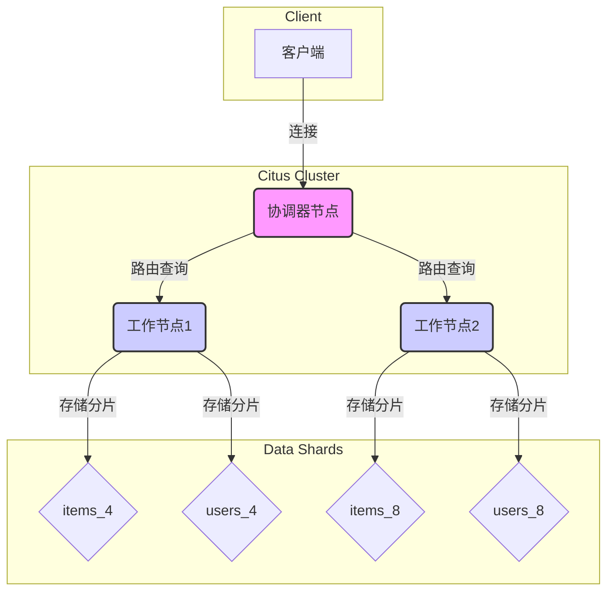

#### 2\. 表类型 (Table Types)

Citus提供了三种表类型来适应不同的工作负载 ：

  * **分布式表 (Distributed Tables)**：这是Citus最核心的表类型。数据通过一个**分发列**（distribution column）进行哈希分片，并分散到不同的工作节点上 。这种设计特别适用于大规模数据集，例如论文中提到的多租户SaaS和实时分析工作负载 。
  * **引用表 (Reference Tables)**：这些表的数据被完整地复制到所有工作节点上 。它们通常用于存储小型、跨租户共享的数据，例如国家列表、产品类别等。由于数据在每个节点上都有副本，因此分布式表与引用表之间的关联查询可以在**本地**执行，无需跨网络传输数据，从而大大提升性能 。
  * **本地表 (Local Tables)**：这其实就是普通的PostgreSQL表，仅存储在协调器节点上，不进行分片 。它们适用于一些不需要扩展的小型管理类表格。

#### 3\. 协同定位 (Co-location)

这是Citus中一个非常重要的性能优化概念 。当多个分布式表使用相同的**分发列**进行分片时，Citus会确保同一分发列值的所有数据行（例如，同一`tenant_id`的所有行）都位于同一个工作节点上 。

这种设计的好处是，当你在这些表之间执行JOIN或使用外键时，Citus可以只在本地分片上执行操作，而不需要在网络上移动数据 。论文中的图1很好地说明了这一点，不同租户（用蓝色和橙色代表）的数据被保存在各自的分片上，同一租户的`messages`、`users`和`channels`表的数据都位于同一个物理服务器上，从而实现了高效的本地JOIN 。

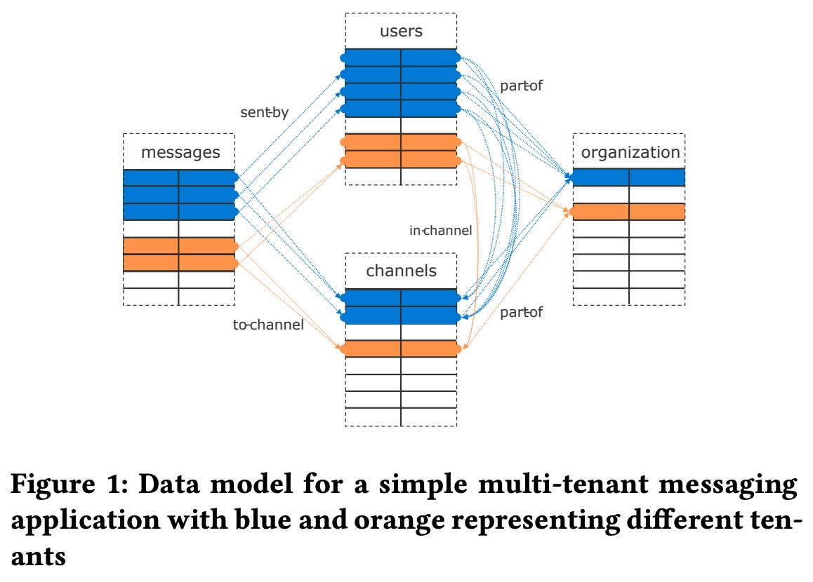  

通过理解以上基础知识和Citus特有的架构设计，你就可以顺利地理解论文中关于不同工作负载（如多租户SaaS、实时分析等）如何利用Citus的特性来解决扩展性问题的详细论述了 。
  
## 2 解读论文 
  
好的，我们来用通俗易懂的中文解读一下这篇关于 **Citus** 的论文。

你可以把 Citus 想象成一个“魔法插件”，它能把一个普通的 PostgreSQL 数据库（单机版）瞬间变成一个强大的“分布式数据库集群”，从而处理海量数据和超高并发的请求。它的核心目标就是：**让 PostgreSQL 能够轻松地“长大”，应对各种数据密集型应用的挑战，同时尽量不改变你原有的使用习惯。**

---

### **1. 为什么需要 Citus？**

PostgreSQL 是一个非常强大、功能丰富的开源数据库，深受开发者喜爱。但它的“原生形态”是单机的，当数据量太大（比如TB、PB级别）或者访问量太高（比如每秒几万、几十万次查询）时，单台服务器的CPU、内存、磁盘I/O就会成为瓶颈，导致系统变慢甚至崩溃。

传统的解决方案要么是“分库分表”（手动把数据切碎放到不同服务器，应用层自己管理，非常麻烦），要么是换一个全新的分布式数据库（但可能丧失了PostgreSQL的丰富功能和生态）。

**Citus 的妙处在于，它不是一个独立的新数据库，而是一个 PostgreSQL 的“扩展插件”（Extension）**。这意味着：

*   **无缝兼容**：你原来在 PostgreSQL 里用的 SQL 语法、函数、索引（比如强大的 `JSONB`、`GiST` 索引）、甚至其他插件，在 Citus 里基本都能用。
*   **易于升级**：因为是插件，它能紧跟 PostgreSQL 主版本的更新，新功能出来就能很快用上，维护成本低。
*   **架构简单**：底层还是标准的 PostgreSQL 服务器，通过标准的 PostgreSQL 协议通信。

> **论文摘要提到**：Citus 是第一个通过 PostgreSQL 扩展 API 实现功能的分布式数据库，这使得它能以极低的工程成本保持与最新 PostgreSQL 特性和工具的兼容性。

---

### **2. Citus 主要解决哪几类问题？（四大工作负载模式）**

论文的核心洞察是，不是所有应用都需要“分布式”，但需要分布式的应用，大致可以分为四类。Citus 的设计就是围绕这四类需求展开的。

我们可以用一个简单的表格来概括这四种模式：

| 工作负载模式 | 典型场景 | 关键需求 | Citus 如何应对 |
| :--- | :--- | :--- | :--- |
| **多租户 (Multi-tenant/SaaS)** | 企业软件、在线商城（每个客户/商户是一个“租户”） | 低延迟 (10ms)、高吞吐 (10k/s)、租户间数据隔离、复杂SQL（JOIN, 事务） | **按租户ID分片**，将同一租户的数据放在同一台服务器（**Co-location**），这样租户内的查询和事务都在本地完成，速度飞快。 |
| **实时分析 (Real-time Analytics)** | 用户行为分析、监控大屏、广告点击流 | 高写入吞吐、亚秒级查询响应 (100ms)、支持预聚合 | **数据分片 + 并行加载/查询**。利用 `INSERT..SELECT` 快速做数据预聚合（Rollup），查询时并行扫描所有分片。 |
| **高性能 CRUD** | 用户资料、游戏道具、物联网设备状态 | 超高吞吐 (100k/s)、极低延迟 (1ms)、按主键读写 | **按主键分片**，读写请求直接路由到对应的分片，几乎无网络开销。同时，分片后 `VACUUM`（垃圾回收）可以并行，避免单机性能下降。 |
| **数据仓库 (Data Warehousing)** | 企业BI、历史数据分析 | 处理超大数据量 (10TB+)、复杂Ad-hoc查询、不追求低延迟 (10s+) | **并行分布式扫描 + 列式存储**。把大表扫描任务分发到所有节点并行执行，再汇总结果。支持广播（Broadcast）和重分区（Re-partition）来处理复杂的跨分片JOIN。

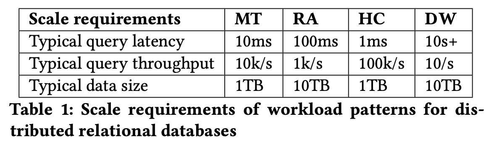 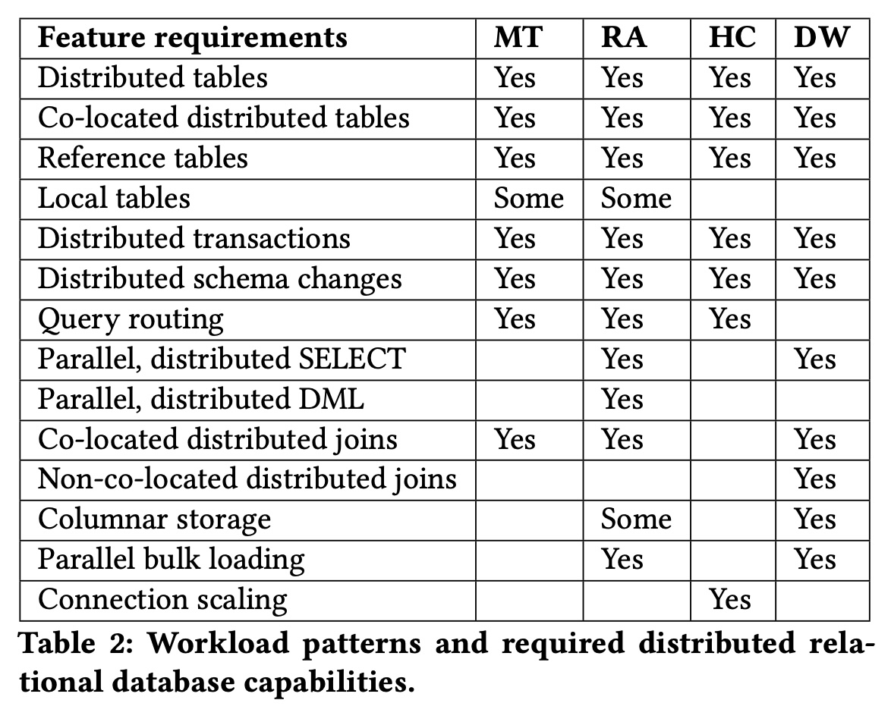   

> **论文表1和表2** 详细列出了这四种模式在延迟、吞吐、数据量以及所需分布式能力（如分布式表、引用表、分布式事务等）上的不同要求。Citus 的架构设计就是为了满足这张“能力清单”。

---

### **3. Citus 是怎么工作的？（核心架构）**

一个 Citus 集群通常由两类节点组成：

1.  **协调器 (Coordinator)**: 门面担当。应用程序连接到这里。它不存储实际数据（或只存少量元数据），负责接收SQL、生成分布式执行计划、协调各个Worker干活、汇总最终结果。
2.  **工作节点 (Worker)**: 干活的苦力。它们存储实际的数据分片（Shard），执行具体的查询和写入操作。每个Worker本身就是一个标准的 PostgreSQL 服务器。

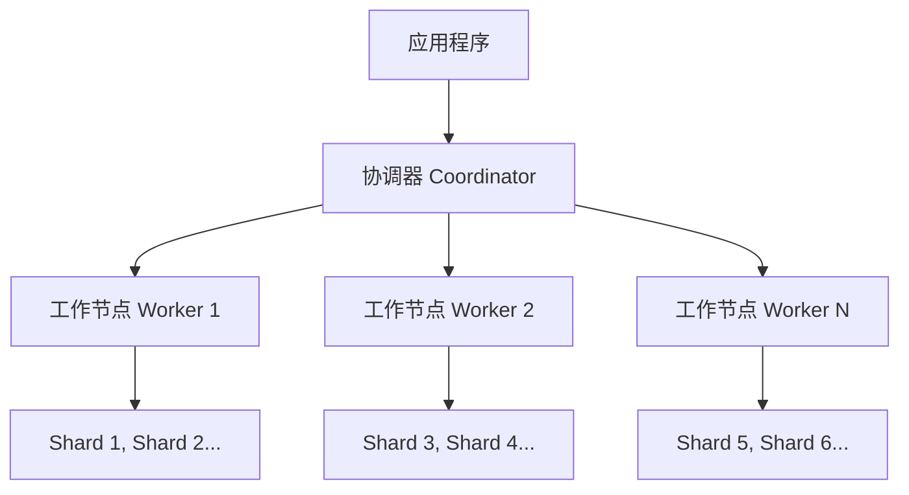

#### **关键概念：**

*   **分布式表 (Distributed Table)**: 这是 Citus 的核心。你告诉 Citus 一个表要按哪个字段（比如 `user_id` 或 `tenant_id`）进行分片，Citus 会自动把这个表的数据根据这个字段的哈希值，打散成多个“逻辑分片”（Shard），然后把这些分片分配到不同的 Worker 节点上。
    ```sql
    -- 创建一个按 user_id 分片的分布式表
    CREATE TABLE users (user_id int, name text, ...);
    SELECT create_distributed_table('users', 'user_id');
    ```

*   **共置 (Co-location)**: 这是 Citus 高性能的“秘密武器”。如果你有两个表（比如 `users` 和 `orders`）都按 `user_id` 分片，Citus 会确保同一个 `user_id` 的数据，无论在哪张表里，都一定在同一个 Worker 节点上。这样，当你执行 `JOIN users ON users.user_id = orders.user_id` 时，这个 JOIN 可以在每个 Worker 节点本地完成，**完全不需要跨网络传输数据**，速度极快！ 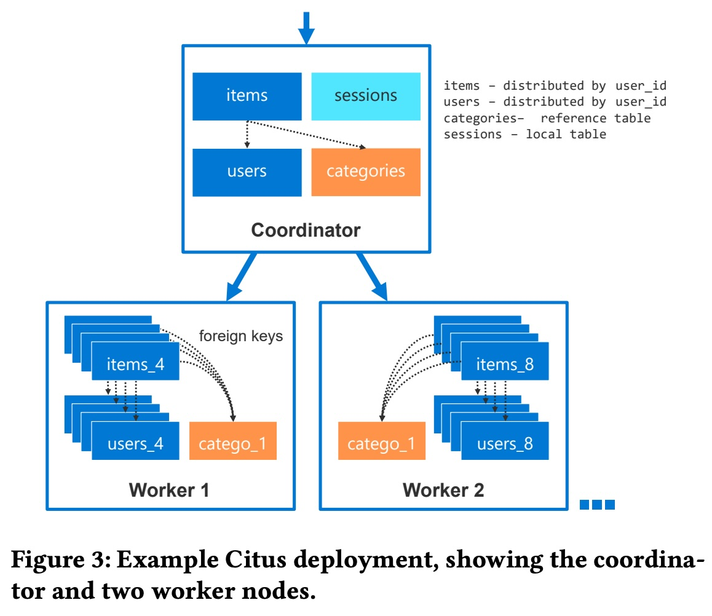  
    > **论文图3** 展示了一个典型的部署，`items` 和 `users` 表都按 `user_id` 分布，实现了共置，它们之间的外键关联可以在本地完成。

*   **引用表 (Reference Table)**: 一些小的、不怎么变的表（比如“国家/地区表”、“商品分类表”），会被 Citus **复制**到**所有** Worker 节点上。这样，大表和小表做 JOIN 时，也可以在每个 Worker 本地完成，避免了数据移动。
    ```sql
    -- 创建一个引用表
    CREATE TABLE categories (id int, name text);
    SELECT create_reference_table('categories');
    ```

*   **自适应执行器 (Adaptive Executor)**: 这是 Citus 的“智能调度中心”。它负责把协调器生成的分布式计划，变成实际在 Worker 上执行的任务。
    *   对于简单的单分片查询（比如按主键查），它就开一个连接，直奔目标 Worker。
    *   对于复杂的、需要扫描所有分片的分析查询，它会采用“慢启动”策略：先开少量连接试探，如果任务执行时间长，再逐步增加并行连接数，以充分利用所有 Worker 的 CPU 资源，同时避免在简单查询上浪费资源。 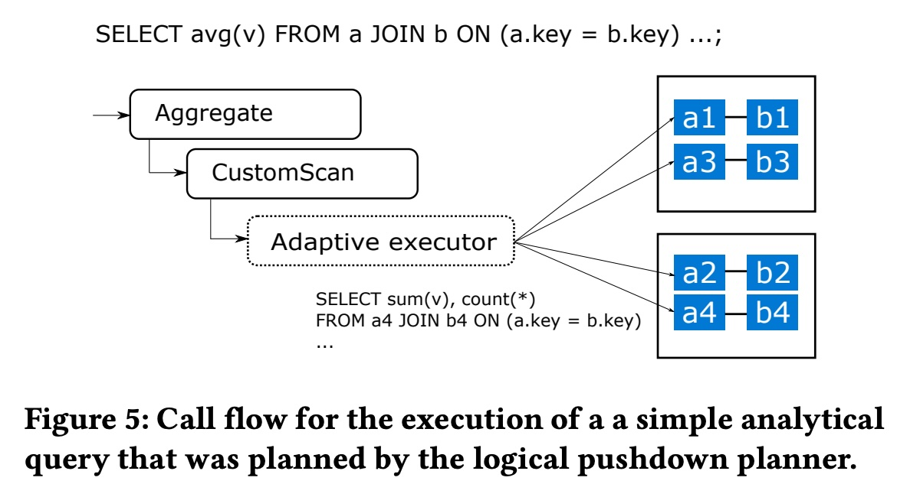  
    > **论文图5** 展示了执行器如何调用 Worker 节点并汇总结果。

*   **分布式事务**: 当一个事务需要修改多个分片（可能在不同Worker上）的数据时，Citus 使用 **两阶段提交 (2PC)** 来保证原子性（要么全成功，要么全失败）。同时，它还有一个后台进程来检测和解决跨节点的死锁问题。

---

### **4. 性能到底怎么样？（基准测试）**

论文第4章用几个标准或自定义的基准测试证明了 Citus 的扩展能力。

*   **多租户 (TPC-C)**: 在 5 倍硬件（4个Worker）的情况下，性能提升了 **13倍**！这是因为数据能全放内存了，减少了磁盘I/O。从4个Worker加到8个，性能还能继续提升，虽然不是完全线性（因为有7%的跨租户事务会产生网络开销）。 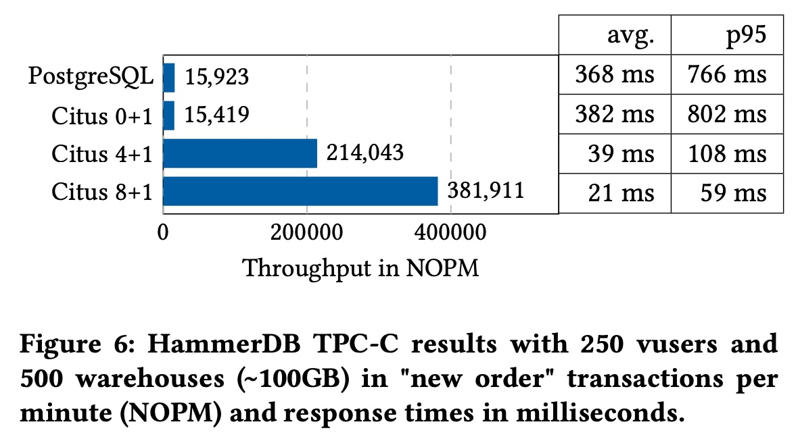  
    > **论文图6** 直观地显示了随着节点增加，吞吐量（NOPM）的显著提升。

*   **实时分析 (GitHub数据)**:
    *   **数据加载**: 4个Worker比单机快3倍。
    *   **查询速度**: 8个Worker比单机快近10倍。
    *   **数据转换 (`INSERT..SELECT`)**: 8个Worker比单机快 **20多倍**！ 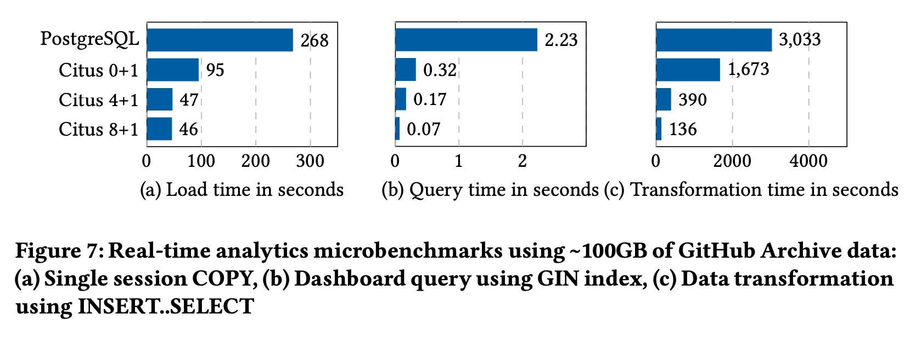  
    > **论文图7** 的 (a)(b)(c) 三张图分别展示了加载、查询、转换的性能飞跃。

*   **高性能 CRUD (YCSB)**: 性能基本随着Worker节点数（即I/O能力）线性增长。 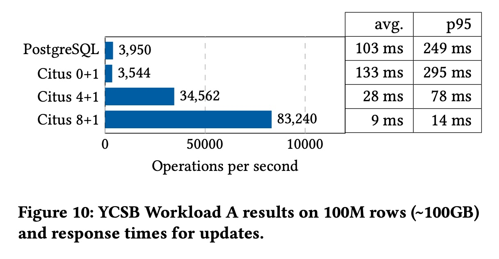  
    > **论文图10** 显示了操作每秒数（OPS）随节点增加而稳定上升。

*   **数据仓库 (TPC-H)**: 在8个Worker的集群上，性能比单机 PostgreSQL 快了 **两个数量级**（100倍）！这是因为复杂的全表扫描和聚合操作被完美地并行化了。 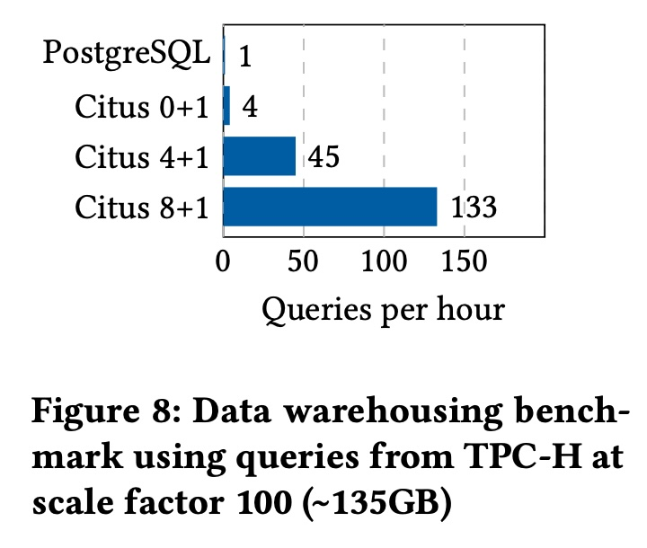  
    > **论文图8** 的柱状图差距巨大，充分体现了分布式并行的力量。

---

### **5. 真实案例：微软的 VeniceDB**

论文第5章介绍了一个重量级案例：微软内部的 **VeniceDB** 项目。

*   **规模**: 两个超过 **1000核** 的 Citus 集群，存储 **超过1PB** 的数据。
*   **用途**: 分析来自数亿台 Windows 设备的遥测数据，为“发布质量视图”（RQV）仪表板提供支持。这个仪表板对微软工程师至关重要，每天有数百用户，要处理 **超过600万次查询/天**，且要求 **P95延迟在1秒内**。
*   **挑战**: 每天要摄入 **约10TB** 新数据，并在 **20分钟内** 让新数据在仪表板上可见。查询非常复杂，包含高基数分组、嵌套子查询等。
*   **Citus 如何应对**:
    *   原始数据按 `device_id` 分片存储。
    *   用 `COPY` 命令并行加载数据。
    *   用分布式 `INSERT..SELECT` 进行设备级别的预聚合。
    *   利用 Citus 的“逻辑下推规划器”，将复杂的、按 `device_id` 分组的子查询直接下推到各个Worker节点并行执行，再汇总结果。

这个案例证明了 Citus 不仅能处理理论上的基准测试，更能胜任超大规模、要求严苛的生产环境。

---

### **6. 总结与未来**

**Citus 的核心价值**在于它找到了一个绝佳的平衡点：**在保留 PostgreSQL 几乎全部功能和生态的前提下，提供了强大的水平扩展能力**。它不是一个“万能药”，而是精准地解决了四类最常见的、需要扩展的 PostgreSQL 工作负载。

**未来工作**：Citus 团队还在不断完善，比如支持更多复杂的SQL特性（如非共置的关联子查询）、优化混合数据模型、以及针对特定领域（如时空数据）做深度优化。

总而言之，如果你的应用是基于 PostgreSQL，并且遇到了单机瓶颈，那么 Citus 是一个非常值得考虑的、成熟且强大的解决方案。它让你既能享受 PostgreSQL 的便利，又能拥有分布式系统的威力。
  
## 3 术语 
  
《Citus: Distributed PostgreSQL for Data-Intensive Applications》这篇论文的核心在于介绍Citus如何将PostgreSQL打造成一个高性能、可扩展的分布式数据库。以下是论文中几个非常重要的术语，我将使用中文进行通俗易懂的解释，并结合图示帮助你理解。

-----

### Citus扩展 (Citus Extension)

**解释**: 这是理解Citus一切的起点。Citus不是一个独立的、全新的数据库，而是作为PostgreSQL的一个**扩展**（extension）存在的。这意味着它通过利用PostgreSQL本身提供的扩展API（如查询规划器和执行器钩子），在不修改PostgreSQL核心代码的情况下，为其增加了分布式能力。你可以把Citus想象成PostgreSQL的一个“超级插件”，它让一个普通的PostgreSQL数据库瞬间具备了处理海量数据的能力。

-----

### 协调器节点与工作节点 (Coordinator & Worker Nodes)

**解释**: Citus集群的架构由两种类型的节点构成：

  * **协调器节点 (Coordinator Node)**：它是整个Citus集群的“大脑”和“指挥官”。客户端的连接都首先到达这里，由它接收、解析SQL查询，并根据查询内容决定如何分发。协调器节点不存储实际的数据分片，但会保存所有分布式表的元数据（例如，哪些数据分片存储在哪个工作节点上）。
  * **工作节点 (Worker Node)**：它们是集群的“劳力”，负责存储实际的数据分片。当协调器节点下达任务后，工作节点会并行执行这些任务，并将结果返回给协调器。

这种架构实现了**职责分离**，协调器负责管理和调度，工作节点负责存储和计算，使得整个系统可以高效地水平扩展。

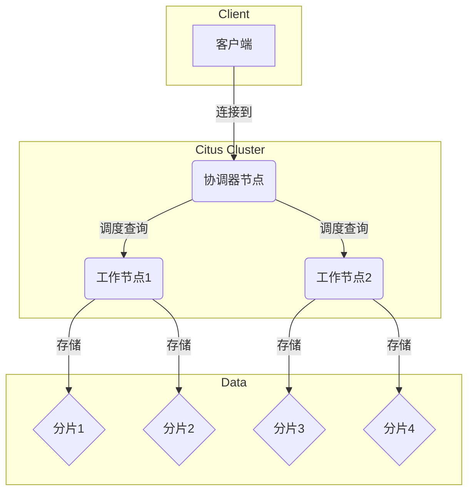

-----

### 分布式表与分发列 (Distributed Table & Distribution Column)

**解释**:

  * **分布式表 (Distributed Table)**: 顾名思义，这是一种数据被切分后分散存储在多个工作节点上的表。它是处理大规模数据集的核心。
  * **分发列 (Distribution Column)**: 这是决定数据如何分片的关键。当你创建一个分布式表时，你需要指定一个列作为“分发列”。Citus会根据这个列的值，通过哈希算法，自动决定每一行数据应该被发送到哪个工作节点上的分片中。例如，在多租户SaaS应用中，通常会使用`tenant_id`（租户ID）作为分发列。

-----

### 引用表 (Reference Table)

**解释**: 引用表是一种特殊类型的分布式表。它的数据非常小，并且被**完整地复制**到集群中的每一个工作节点上。它们通常用于存储所有工作节点都需要的共享数据，比如国家列表、产品类别等。由于每个工作节点都有引用表的完整副本，因此当分布式表与引用表进行联接（JOIN）时，查询可以在工作节点本地完成，无需进行跨网络的昂贵数据传输，极大地提高了查询效率。

-----

### 协同定位 (Co-location)

**解释**: 协同定位是Citus中最重要的性能优化概念之一。如果多个分布式表使用**相同的分发列**进行分片，并且分发算法也相同，Citus会确保相同分发列值的所有数据行都位于同一个工作节点上。

例如，如果你有两个表：`users`和`orders`，都使用`tenant_id`作为分发列。Citus会确保某个特定租户（比如`tenant_id = 123`）的所有用户数据和所有订单数据都存储在同一个工作节点上。这样一来，当你想查询“某个租户的所有用户及其订单”时，这个查询可以直接在单个工作节点上执行，避免了网络开销，大大提升了`JOIN`查询的性能。

下图展示了不同租户的数据如何通过协同定位被聚集在不同的工作节点上：

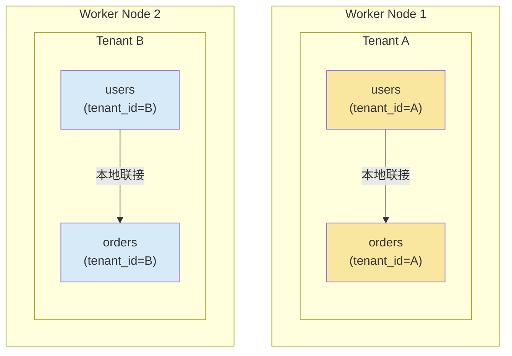
  
## 参考        
         
https://dl.acm.org/doi/pdf/10.1145/3448016.3457551    
        
<b> 以上内容基于DeepSeek、Qwen、Gemini及诸多AI生成, 轻微人工调整, 感谢杭州深度求索人工智能、阿里云、Google等公司. </b>        
        
<b> AI 生成的内容请自行辨别正确性, 当然也多了些许踩坑的乐趣, 毕竟冒险是每个男人的天性.  </b>        
  
  
  
#### [期望 PostgreSQL|开源PolarDB 增加什么功能?](https://github.com/digoal/blog/issues/76 "269ac3d1c492e938c0191101c7238216")
  
  
#### [PolarDB 开源数据库](https://openpolardb.com/home "57258f76c37864c6e6d23383d05714ea")
  
  
#### [PolarDB 学习图谱](https://www.aliyun.com/database/openpolardb/activity "8642f60e04ed0c814bf9cb9677976bd4")
  
  
#### [PostgreSQL 解决方案集合](../201706/20170601_02.md "40cff096e9ed7122c512b35d8561d9c8")
  
  
#### [德哥 / digoal's Github - 公益是一辈子的事.](https://github.com/digoal/blog/blob/master/README.md "22709685feb7cab07d30f30387f0a9ae")
  
  
#### [About 德哥](https://github.com/digoal/blog/blob/master/me/readme.md "a37735981e7704886ffd590565582dd0")
  
  

  
