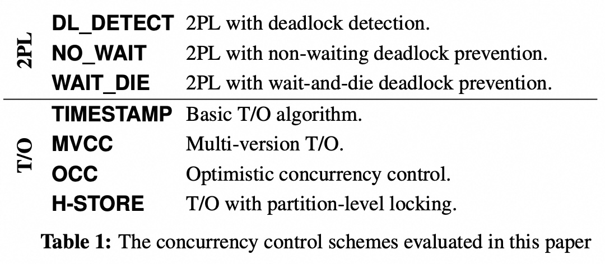
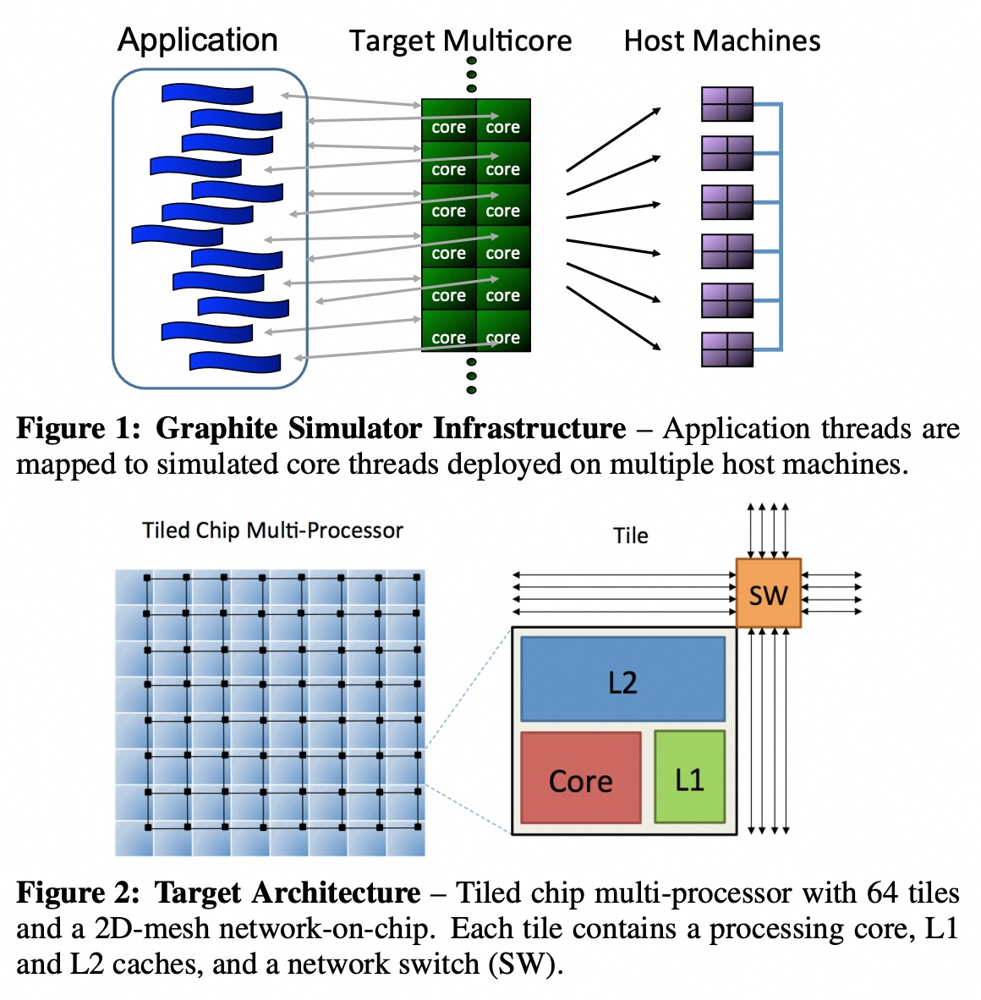
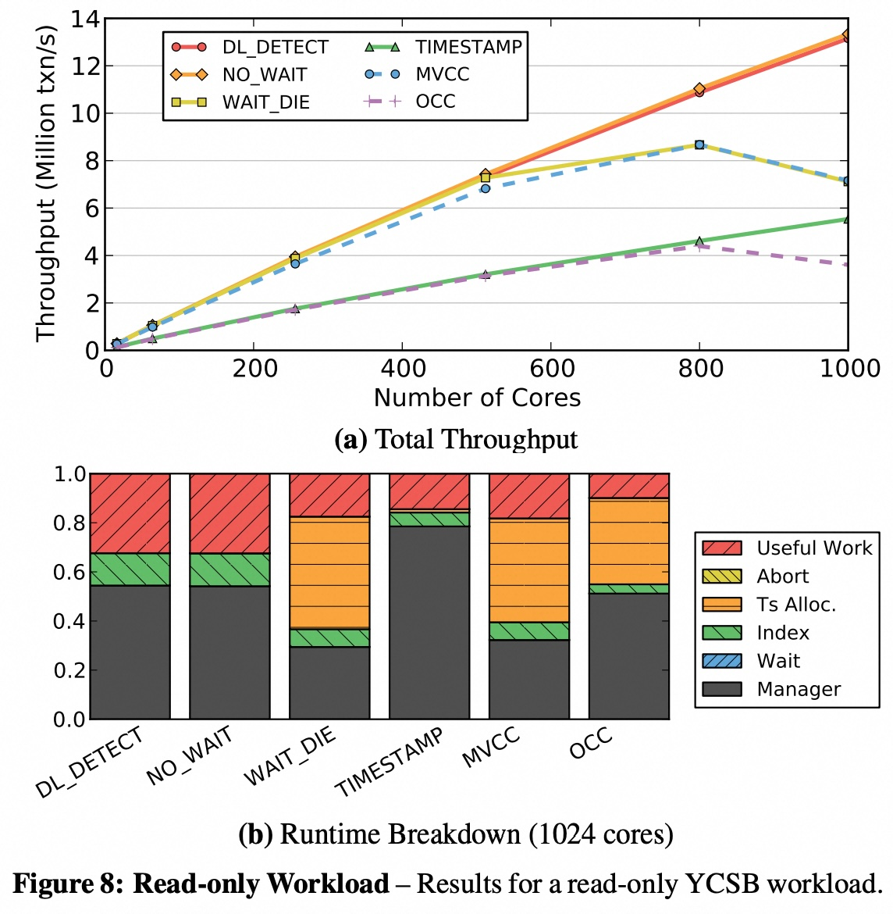
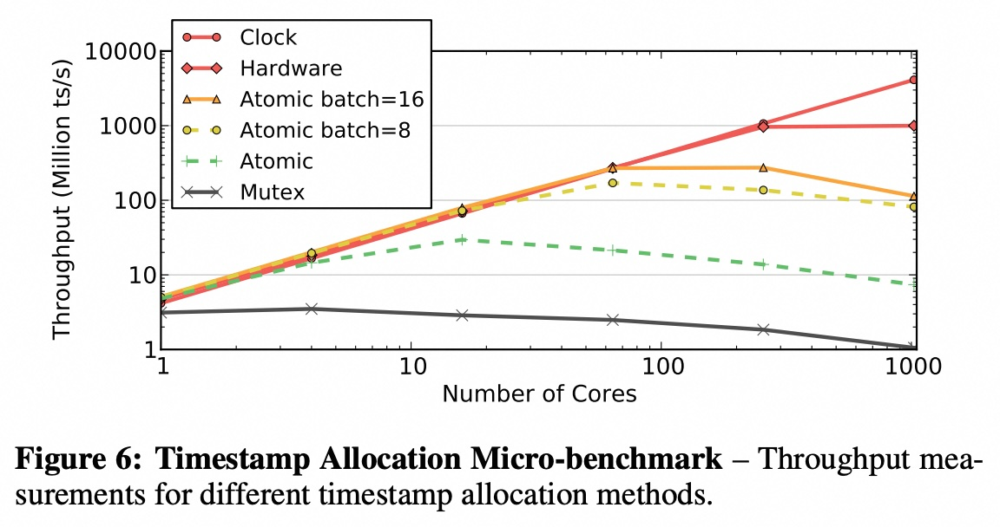
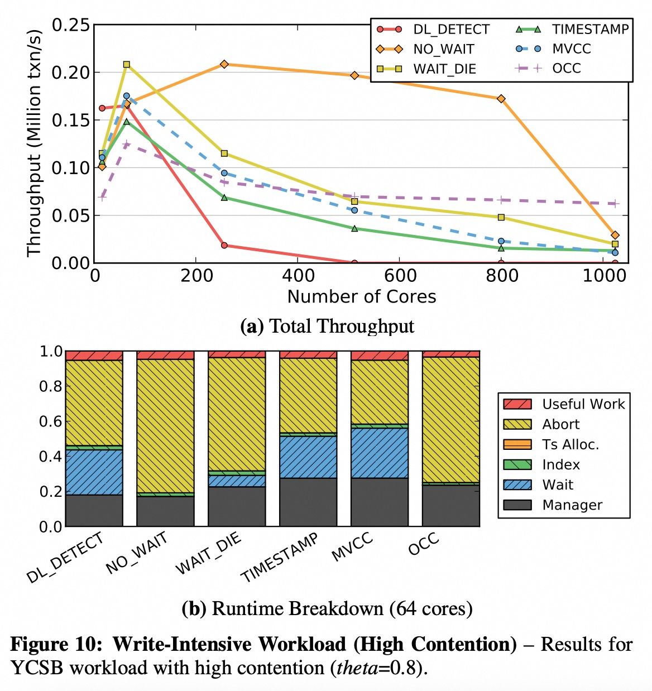
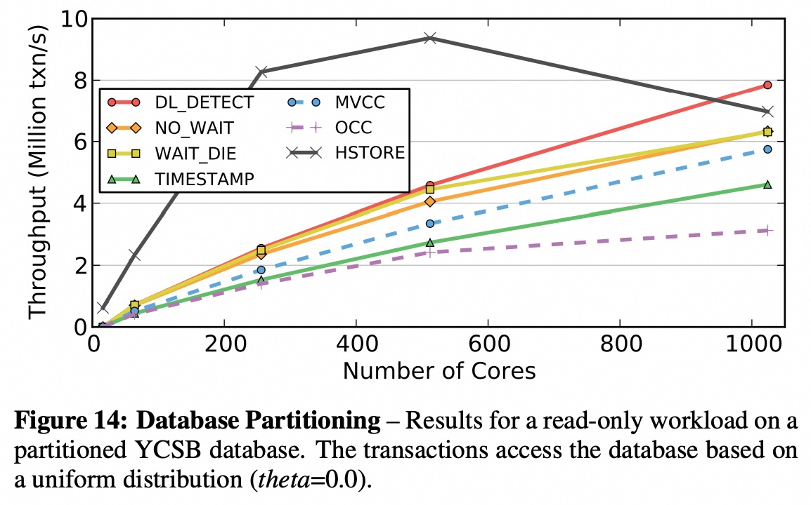
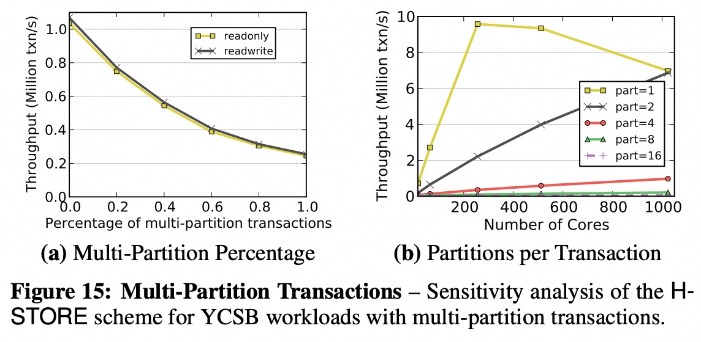
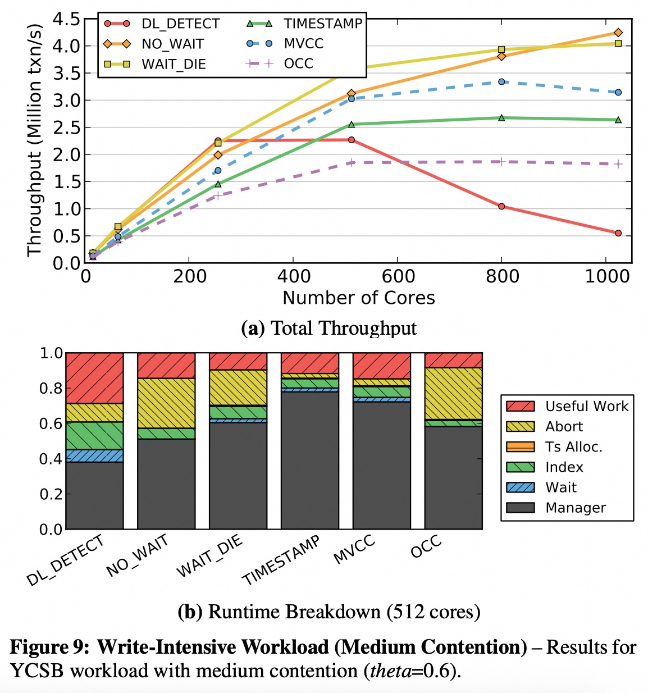

## AI论文解读 | Staring into the Abyss: An Evaluation of Concurrency Control with One Thousand Cores
        
### 作者        
digoal        
        
### 日期        
2025-09-08       
        
### 标签        
PostgreSQL , PolarDB , DuckDB , AI , 论文解读        
        
----        
        
## 背景  
      
https://github.com/yxymit/DBx1000  
  
https://www.vldb.org/pvldb/vol8/p209-yu.pdf          
  
提示:          
```          
读懂《Staring into the Abyss: An Evaluation of Concurrency Control with One Thousand Cores》这篇论文需要提前掌握哪些基础知识, 请使用中文通熟易懂的讲解这些基础知识, 可以引用论文中的图、表或使用Markdown支持的图形(text,mermaid等)增加解释性. 
  
使用中文通熟易懂的解读《Staring into the Abyss: An Evaluation of Concurrency Control with One Thousand Cores》这篇论文, 其中的关键内容请着重讲解, 可以引用论文中的图、表或使用Markdown支持的图形(text,mermaid等)增加解释性. 
  
提取《Staring into the Abyss: An Evaluation of Concurrency Control with One Thousand Cores》这篇论文中的重要术语, 使用中文对这些术语进行通熟易懂的讲解, 可以引用论文中的图、表或使用Markdown支持的图形(text,mermaid等)增加解释性. 
```     
  
## 1 前置知识 
  
要读懂《Staring into the Abyss: An Evaluation of Concurrency Control with One Thousand Cores》这篇论文，你需要掌握数据库系统和计算机体系结构的一些基础知识。论文的两位作者是数据库领域的知名专家，所以论文中的概念非常专业，但我们可以用通俗易懂的方式来解释。

这篇论文的核心在于探讨当CPU核心数量增加到上千个时，传统的数据库**并发控制**（Concurrency Control）技术面临的挑战和瓶颈 。

---

### 1. 基础概念：OLTP、事务与ACID

首先，你需要了解论文所研究的场景：**联机事务处理 (OLTP)** 。
* **OLTP (On-Line Transaction Processing)**：这是一种数据库工作负载类型，例如你在线购物时提交订单、银行转账、机票预订等。它的特点是短事务、访问的数据量小、且重复性高 。
* **事务 (Transaction)**：这是OLTP中的基本工作单元 。它由一个或多个数据库操作（如SQL查询）组成，是一个不可分割的整体 。事务要么全部成功执行，要么全部失败回滚，不会出现部分执行的情况 。
* **ACID 特性**：事务处理必须保证四个关键特性，合起来叫做 ACID 。
    * **原子性 (Atomicity)**：一个事务是不可分割的最小工作单位，要么全做，要么全不做 。
    * **一致性 (Consistency)**：事务完成后，数据库必须从一个一致性状态转换到另一个一致性状态。
    * **隔离性 (Isolation)**：多个并发执行的事务互不干扰，每个事务感觉自己是在独占地访问数据库 。
    * **持久性 (Durability)**：一旦事务提交，它对数据库的修改就是永久性的，即使系统发生故障也不会丢失。

---

### 2. 核心问题：并发控制

在多核环境下，为了提高性能，数据库需要同时执行多个事务。**并发控制**就是为了解决这个“并发”问题，确保多个事务在同时执行时，数据库的ACID特性（尤其是**隔离性**）能够得到保证 。这篇论文的重点就是评估七种不同的并发控制方案，看它们在“一千个核心”的极端环境下表现如何 。

论文将这些方案分为两大类，你可以参考论文中的**Table 1**：

  

#### a) 两阶段封锁 (Two-Phase Locking, 2PL)
这是一种悲观的并发控制方法 。它假定事务之间会发生冲突，所以必须先**加锁**。事务在对数据进行读写操作前，必须先获得相应的锁。2PL分为两个阶段：
* **增长阶段 (Growing Phase)**：事务可以不断地获取所需的锁，但不能释放任何锁 。
* **收缩阶段 (Shrinking Phase)**：一旦事务释放了某个锁，它就不能再获取任何新的锁了 。
* **死锁 (Deadlock)**：当一个事务等待另一个事务释放锁，而另一个事务又在等待它释放锁时，就会发生死锁 。论文评估了三种处理死锁的2PL变种:
    * **DL_DETECT**：死锁检测，通过监控“等待图”来发现循环等待并主动中断其中一个事务 。
    * **NO_WAIT**：死锁预防，当锁请求被拒绝时，事务会立即被终止并重启 。
    * **WAIT_DIE**：死锁预防，如果请求锁的事务比持有锁的事务“年轻”（时间戳晚），则它会被终止 。

#### b) 时间戳排序 (Timestamp Ordering, T/O)
这是一种乐观的并发控制方法。它通过为每个事务分配一个唯一的时间戳，来预先确定事务的执行顺序 。数据库系统随后会强制按照这个时间戳顺序来处理事务中的冲突操作 。论文评估的T/O方案包括：
* **TIMESTAMP**：基本的T/O算法。
* **MVCC (Multi-Version Concurrency Control)**：多版本并发控制 。它允许多个事务同时访问同一数据，通过为每个写入操作创建新的数据版本来实现 。
* **OCC (Optimistic Concurrency Control)**：乐观并发控制 。它假设冲突很少发生，事务在私有工作区中执行所有修改，只有在提交时才进行冲突检查 。
* **H-STORE**：通过对数据库进行分区来提高性能的T/O方案 。

---

### 3. 硬件背景：众核处理器

这篇论文之所以特别，是因为它研究的是在“**众核**”（Many-core）机器上的数据库 。
* **众核**：指的是单个芯片上集成几十甚至上百个核心的处理器 。这种架构不同于传统的服务器CPU，后者通常只有少数几个核心 。
* **挑战**：在众核环境下，由于共享数据结构和缓存一致性开销，传统的并发控制算法会遇到严重的**瓶颈**，无法充分利用并行计算的优势 。
* **研究方法**：由于当时没有真正的千核处理器，作者们使用了名为**Graphite**的高性能CPU模拟器来模拟千核环境，并在上面运行一个自定义的内存数据库系统来评估这些并发控制算法 。你可以通过论文中的**Figure 1**和**Figure 2**来了解这个模拟环境和目标架构 。    

总而言之，读懂这篇论文，你只需掌握上述几个概念。论文的主要贡献在于证明了在未来的众核世界里，现有的并发控制方案都将失效，并识别了导致性能瓶颈的根本原因，为未来数据库系统的设计指明了方向 。
  
## 2 解读论文 
  
好的，我们来通俗易懂地解读这篇数据库领域的经典论文——《Staring into the Abyss: An Evaluation of Concurrency Control with One Thousand Cores》（凝视深渊：千核环境下并发控制评估）。

这篇论文的标题非常形象。“深渊”指的就是拥有成百上千个核心（many-core）的未来CPU架构。作者们预见到，当CPU核心数达到1000个时，现有的数据库管理系统（DBMS）可能会因为无法有效管理并发而“跌入深渊”，性能不升反降。

### **核心思想：为什么写这篇论文？**

在过去，CPU性能的提升主要靠提高单个核心的时钟频率。但由于功耗和散热的限制，这条路已经走到了尽头 。现在以及未来的CPU性能提升，将依赖于在单个芯片上集成越来越多的核心 。

这就带来一个严峻的挑战：如何让数据库软件充分利用这成百上千个核心？当1000个线程同时运行时，它们会频繁地争抢访问和修改同一份数据。负责协调这种争抢的“交通警察”——**并发控制（Concurrency Control）**——将面临前所未有的压力，很可能自身就成为系统的最大瓶颈 。

作者们想做的，就是通过模拟一个1000核的环境，提前“凝视”一下这个“深渊”，看看现有的主流并发控制算法表现如何，并找出它们的根本问题所在 。

### **参赛选手：七种主流的并发控制算法**

为了进行全面评估，作者们在一个自研的轻量级内存数据库中实现了七种经典的并发控制算法 。这些算法主要分为两大派别：

#### **1. 悲观派：两阶段锁定 (Two-Phase Locking, 2PL)**

这个派别的核心思想是“先加锁，再访问”，它假设冲突很可能会发生，所以提前做好准备。

  * **DL\_DETECT (死锁检测)**: 事务获取不到锁就等待，系统有一个专门的检测器定期检查有没有形成死锁环，有的话就牺牲一个事务来解锁 。
  * **NO\_WAIT (从不等待)**: 简单粗暴，只要申请的锁被占用了，立即放弃（Abort）并重启事务，以此避免等待和死锁 。
  * **WAIT\_DIE (等待或牺牲)**: 基于事务的时间戳决定。如果一个年长的事务（时间戳小）想获取一个被年轻事务（时间戳大）占有的锁，它会等待。反之，如果年轻事务想获取年长事务的锁，它就会被“牺牲”掉（Abort）。

#### **2. 乐观派：时间戳排序 (Timestamp Ordering, T/O)**

这个派别的核心思想是“先执行，后验证”，它假设冲突很少发生，直到最后提交时才检查是否有问题。

  * **TIMESTAMP (基本时间戳)**: 每个事务开始前都分配一个唯一的时间戳。在读写数据时，会检查数据上的时间戳，以确保操作顺序符合事务的时间戳顺序，否则就中止事务 。
  * **MVCC (多版本并发控制)**: 写入操作不直接覆盖旧数据，而是创建一个新版本 。这样一来，读操作可以去读取它那个时间点对应的旧版本，不会被写操作阻塞，极大地提升了“读”的性能 。
  * **OCC (乐观并发控制)**: 事务期间的所有修改都先在自己的私有空间进行。到提交时，再统一进行“验证”，检查其读写的数据是否与其它已提交的事务冲突。如果没有冲突，则应用修改；否则，中止 。
  * **H-STORE (分区锁定)**: 这是一种混合方法。它将数据库切分成很多“分区”，每个分区由一个独立的线程管理。事务在执行前必须声明它需要访问哪些分区并获取这些分区的锁 。

### **实验环境：在“未来”的计算机上运行**

由于当时并不存在1000核的商用CPU，研究者们使用了名为 **Graphite** 的高性能CPU模拟器来构建一个虚拟的千核环境 。他们还特地开发了一个轻量级的内存数据库，目的是为了排除日志、恢复等其他组件的干扰，确保所有性能瓶颈都只来自于并发控制算法本身 。

### **关键发现：所有算法都失败了，但“死法”各不相同**

论文最核心的结论是：**在扩展到1000个核心的过程中，所有七种算法都未能实现良好的扩展性，但它们失败的原因截然不同** 。

#### **瓶颈一：锁的“踩踏”效应 (Lock Thrashing) - 2PL的噩梦**

当核心数和数据竞争压力（高争用）增加时，基于锁的协议（特别是`DL_DETECT`）会遇到一个严重问题：**锁踩踏**。

  * **现象**：大量事务都在等待别的事务释放锁，CPU虽然在高速运转，但绝大部分时间都耗费在空等上，真正“干活”的时间很少。这导致系统吞吐量在核心数达到某个点后（比如16或64核）非但不再增长，反而急剧下降 。

  * **图表演示**：论文中的 **Figure 4** 完美地展示了这一点。    

    从上图可以看出，在高争用（`theta=0.8`）场景下，吞吐量在16个核心时达到顶峰，之后随着核心数增加反而暴跌。这就是锁踩踏的直观表现。

#### **瓶颈二：时间戳的“高速收费站” (Timestamp Allocation) - T/O的阿喀琉斯之踵**

所有基于时间戳的算法都需要一个全局唯一的、单调递增的时间戳。在低核心数下这不是问题，但在千核环境下，成百上千个线程同时向一个中央分配器请求时间戳，这个分配器就成了一个巨大的瓶颈，就像一个只有一个窗口的高速公路收费站 。

  * **现象**：即使在数据完全不冲突的只读场景下（**Figure 8**），T/O家族的算法（`TIMESTAMP`, `MVCC`, `OCC`）的性能也无法线性增长 。从它们的运行时分解图（**Figure 8b**）中可以看到，"Ts Alloc."（时间戳分配）占用了大量时间 。   

  * **解决方案的局限**：作者们测试了多种时间戳分配方案（**Figure 6**），发现即便是使用CPU原子指令（Atomic Add）来优化，在高核心数下也会因为缓存一致性协议的开销而性能下降 。最好的方案是依赖特殊的硬件支持（如硬件计数器或同步时钟），但这在当时的通用CPU上并不存在 。   

#### **瓶颈三：高数据争用 - 所有算法的“滑铁卢”**

当工作负载中存在“热点数据”（即一小部分数据被绝大多数事务所访问）时，所有算法的性能都会急剧恶化 。

  * **现象**：在模拟高数据争用的YCSB测试中（**Figure 10**），几乎所有算法的吞吐量都在超过64核后开始崩溃或停滞不前 。这表明，无论并发控制的策略是悲观还是乐观，当竞争激烈到一定程度时，协调成本本身就会压垮系统。   

#### **H-STORE的成与败：分区的双刃剑**

H-STORE的设计理念是通过分区来消除跨区的争用。

  * **成功之处**：当所有事务都只访问单个分区时，它的性能无与伦比，因为不同分区的事务可以完美并行  (见 **Figure 14**)。   
  * **失败之处**：一旦出现需要访问多个分区的“跨分区事务”，其性能就会断崖式下跌 。因为一个跨分区事务会同时锁定多个分区，导致这些分区上的其他事务都无法进行，严重破坏了并行性  (见 **Figure 15a**)。   

### **结论与启示：路在何方？**

论文的结论有些“悲观”，但非常深刻：

1.  **没有银弹**：没有任何一种单一的并发控制算法能够在所有场景下都扩展到千核规模 。2PL在低争用短事务下表现好，而T/O更适合高争用长事务 。

2.  **软件的尽头是硬件**：像时间戳分配这样的瓶颈，单靠软件优化已经很难解决，可能需要CPU提供新的硬件支持，比如高效的硬件计数器 。

3.  **需要重新设计**：为“多核”时代设计的数据库，可能不适用于“众核”（Many-core）时代。我们需要从根本上重新思考数据库的架构，使其能与底层硬件紧密耦合，协同设计 。

这篇论文就像一声警钟，它告诉数据库社区，不能再用传统的方法来应对核心数爆炸式增长的未来。它指明了现有算法的根本局限性，并为后来的研究（例如，设计更具扩展性的算法、利用新硬件特性等）开辟了新的方向。
  
## 3 术语 
  
你好，很高兴为你解析这篇论文。这篇论文的核心在于探讨**数据库并发控制**在**众核**（Many-core）处理器环境下的性能问题。为了读懂这篇论文，你需要理解以下几个关键术语：

---

### 1. OLTP（联机事务处理）

这是论文研究的**工作负载**类型。
* **概念**：你可以把它想象成我们日常生活中频繁发生的短小、高频的数据库操作，比如网上购物时的提交订单、银行转账、机票预订等。
* **特点**：OLTP工作负载的特点是**短事务**、**访问的数据量小**、**操作重复性高**。这篇论文使用的**TPC-C**基准测试，就是一种经典的OLTP工作负载。

---

### 2. 事务（Transaction）与 ACID 特性

* **事务**：是数据库操作的最小逻辑单位，由一个或多个SQL语句组成。一个事务要么全部成功执行（提交，**commit**），要么全部失败回滚（**abort**）。
* **ACID 特性**：事务处理必须保证的四个基本特性：
    * **原子性 (Atomicity)**：事务是不可分割的，要么全做，要么全不做。
    * **一致性 (Consistency)**：事务执行前后，数据库状态都必须是合法的。
    * **隔离性 (Isolation)**：并发执行的事务之间互不干扰，每个事务感觉自己是独立运行的。
    * **持久性 (Durability)**：事务一旦提交，其修改就是永久性的。

论文主要关注的是**隔离性**，因为并发控制技术就是为了在多个事务并行执行时，保证其隔离性不被破坏。

---

### 3. 并发控制（Concurrency Control）

这是论文的核心主题。
* **概念**：当多个事务同时访问和修改数据库中的同一份数据时，可能会产生数据不一致的问题。**并发控制**就是用来协调这些并发访问，确保事务的ACID特性（尤其是隔离性）得到保障的技术。
* **论文分类**：论文评估了七种不同的并发控制算法，并将它们分为两大类，可以参考论文的 **Table 1**。

  

#### a) 两阶段封锁（2PL - Two-Phase Locking）
这是一种**悲观**的并发控制方法，它假设事务之间会经常发生冲突。
* **原理**：事务在读写数据前必须先获得锁，分为**增长阶段**（获取锁，不能释放）和**收缩阶段**（释放锁，不能获取）。
* **死锁（Deadlock）**：2PL最大的问题是可能导致死锁，即两个或多个事务互相等待对方释放锁，形成循环依赖。论文评估了三种处理死锁的变种：
    * **NO_WAIT**：死锁预防。当无法立即获得锁时，事务立即被终止并重启。
    * **WAIT_DIE**：死锁预防。如果请求锁的事务比持有锁的事务“年轻”（时间戳晚），则它会被终止。
    * **DL_DETECT**：死锁检测。通过维护一个“等待图”来发现死锁，并主动中断一个事务。

#### b) 乐观与多版本并发控制（Optimistic & MVCC）
这类方法假设冲突很少发生。
* **MVCC (Multi-Version Concurrency Control)**：**多版本并发控制**。当事务修改数据时，它会创建一个新的版本，而不是原地修改。这样，读操作就不需要加锁，可以直接读取旧版本的数据，从而提高并发度。
* **OCC (Optimistic Concurrency Control)**：**乐观并发控制**。事务在执行期间不加锁，将所有修改都缓存在一个私有工作区。只有在事务提交时，才进行冲突检查。如果发生冲突，事务将被回滚。

---

### 4. 众核（Many-core）架构与瓶颈（Bottlenecks）

这是论文研究的**硬件环境**。
* **众核**：指的是单个芯片上集成几十甚至上百个核心的处理器。这与传统的服务器CPU（通常只有少数几个核心）不同。
* **论文挑战**：当时的千核处理器还不存在，所以作者们使用了一个名为**Graphite**的CPU模拟器来模拟这种极端环境。
* **瓶颈（Bottlenecks）**：论文最大的贡献在于揭示了在众核环境下，现有的并发控制算法的**性能瓶颈**。论文中提到，当核心数量增加时，以下两个因素成为主要的性能障碍：
    * **缓存一致性开销（Cache Coherency Overhead）**：当多个核心同时访问同一份数据时，为了保证数据在不同核心的本地缓存中保持一致，会产生大量的通信开销。
    * **共享数据结构上的锁竞争（Lock Contention on Shared Data Structures）**：随着核心数量增加，对共享数据结构（如全局哈希表、锁管理器等）的访问也急剧增加，导致严重的锁竞争，使得大部分核心都在等待，而不是执行任务。

论文的 **Figure 9** 和 **Figure 10** 展示了在不同核心数量下，锁竞争如何成为性能的主要瓶颈。     

掌握了这些术语，你就能理解这篇论文的核心论点：传统的并发控制技术在千核时代都将失效，因为它们无法解决众核架构带来的新的性能瓶颈。
  
## 参考        
         
https://github.com/yxymit/DBx1000  
  
https://www.vldb.org/pvldb/vol8/p209-yu.pdf       
        
<b> 以上内容基于DeepSeek、Qwen、Gemini及诸多AI生成, 轻微人工调整, 感谢杭州深度求索人工智能、阿里云、Google等公司. </b>        
        
<b> AI 生成的内容请自行辨别正确性, 当然也多了些许踩坑的乐趣, 毕竟冒险是每个男人的天性.  </b>        
  
  
#### [期望 PostgreSQL|开源PolarDB 增加什么功能?](https://github.com/digoal/blog/issues/76 "269ac3d1c492e938c0191101c7238216")
  
  
#### [PolarDB 开源数据库](https://openpolardb.com/home "57258f76c37864c6e6d23383d05714ea")
  
  
#### [PolarDB 学习图谱](https://www.aliyun.com/database/openpolardb/activity "8642f60e04ed0c814bf9cb9677976bd4")
  
  
#### [PostgreSQL 解决方案集合](../201706/20170601_02.md "40cff096e9ed7122c512b35d8561d9c8")
  
  
#### [德哥 / digoal's Github - 公益是一辈子的事.](https://github.com/digoal/blog/blob/master/README.md "22709685feb7cab07d30f30387f0a9ae")
  
  
#### [About 德哥](https://github.com/digoal/blog/blob/master/me/readme.md "a37735981e7704886ffd590565582dd0")
  
  

  
