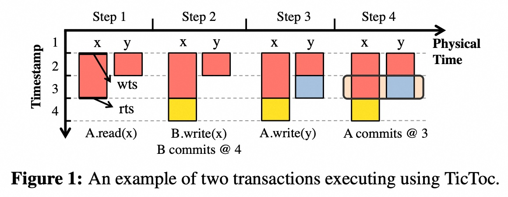
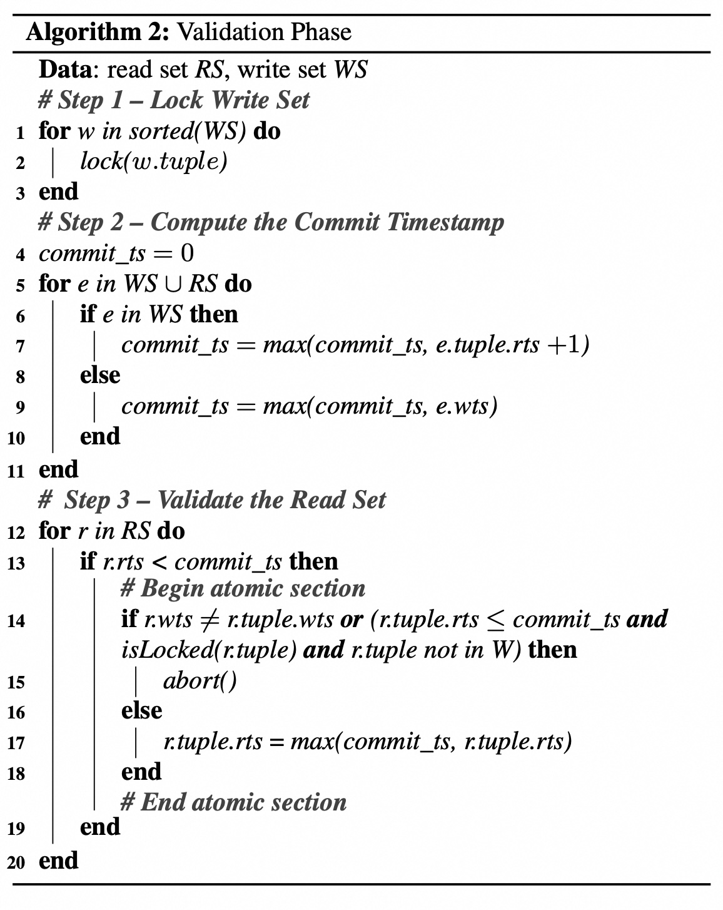
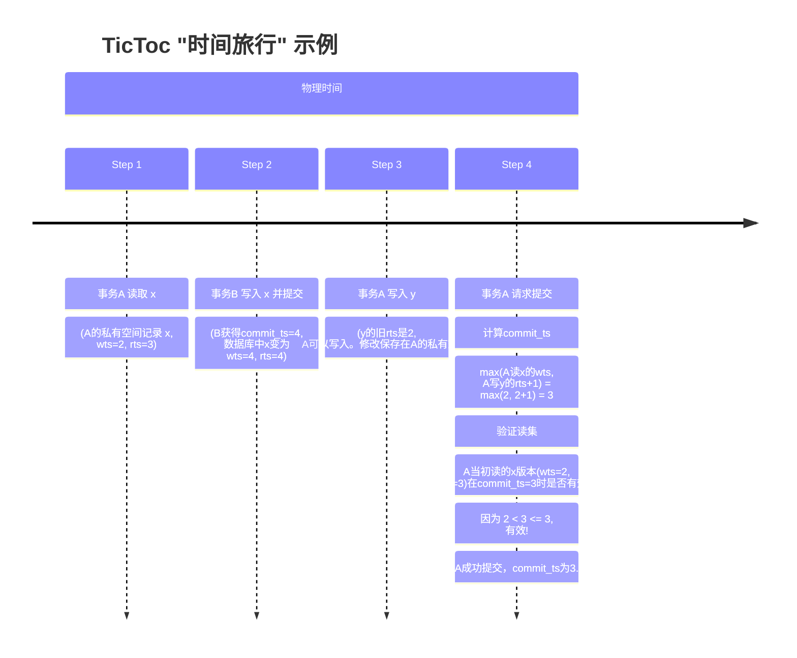
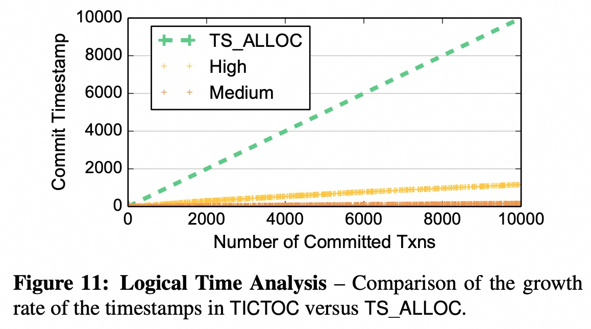

## AI论文解读 | TicToc: Time Traveling Optimistic Concurrency Control
        
### 作者        
digoal        
        
### 日期        
2025-09-08       
        
### 标签        
PostgreSQL , PolarDB , DuckDB , AI , 论文解读        
        
----        
        
## 背景  
      
https://github.com/yxymit/DBx1000  
  
https://dl.acm.org/doi/pdf/10.1145/2882903.2882935        
  
提示:          
```          
读懂《TicToc: Time Traveling Optimistic Concurrency Control》这篇论文需要提前掌握哪些基础知识, 请使用中文通熟易懂的讲解这些基础知识, 可以引用论文中的图、表或使用Markdown支持的图形(text,mermaid等)增加解释性. 
  
使用中文通熟易懂的解读《TicToc: Time Traveling Optimistic Concurrency Control》这篇论文, 其中的关键内容请着重讲解, 可以引用论文中的图、表或使用Markdown支持的图形(text,mermaid等)增加解释性. 
  
提取《TicToc: Time Traveling Optimistic Concurrency Control》这篇论文中的重要术语, 使用中文对这些术语进行通熟易懂的讲解, 可以引用论文中的图、表或使用Markdown支持的图形(text,mermaid等)增加解释性. 
```     
  
## 1 前置知识 
  
要读懂《TicToc: Time Traveling Optimistic Concurrency Control》这篇论文，您需要先掌握一些数据库和并发控制的基础知识。这篇论文的核心在于其提出的新颖的“乐观并发控制”算法，而该算法正是为了解决传统数据库在多核系统上遇到的性能瓶颈。

下面我将以通俗易懂的方式为您讲解这些基础概念。

### 1. 什么是并发控制？
---
在数据库中，并发控制（Concurrency Control）指的是一种管理多项事务同时访问数据库的机制。其目的是确保这些事务的执行结果与它们按照某个顺序依次执行的结果一致。这就像多个人同时编辑一个共享文档，需要一种规则来避免他们相互覆盖对方的修改，确保最终文档的正确性 。

论文提到，有两种主要的并发控制算法：
* **两阶段锁定（Two-Phase Locking, 2PL）**：这是一种**悲观**的方法。它假设事务之间会发生冲突，所以在执行读或写操作前，事务必须先获取相应的锁。如果获取不到锁，事务就会等待，这可能导致死锁 。
* **时间戳排序（Timestamp Ordering, T/O）**：这是一种基于时间戳的**乐观**方法。它为每个事务分配一个唯一且单调递增的时间戳，并用这个时间戳来确定事务的序列执行顺序，从而解决冲突 。

### 2. 什么是乐观并发控制（OCC）？
---
TicToc 论文的核心是一种 **乐观并发控制（Optimistic Concurrency Control, OCC）** 算法 。它是一种乐观的策略，假设事务之间发生冲突的可能性很低，因此在事务执行期间不加锁。OCC 通常分为三个阶段:

1.  **读取阶段 (Read Phase)**：事务自由地读取数据，并将所有修改操作写入一个临时的私有工作区（称为“写集合”），这些修改对其他事务是不可见的 。
2.  **验证阶段 (Validation Phase)**：当事务完成所有操作后，进入这个阶段。数据库会检查该事务是否与任何其他正在运行或已提交的事务存在冲突 。
3.  **写入阶段 (Write Phase)**：如果验证通过，事务的所有修改将被一次性写入数据库，并对其他事务可见。如果验证失败，事务则会被中止（abort），所有修改都会被撤销 。

### 3. TicToc 的核心思想：数据驱动的时间戳管理
---
论文指出，传统 T/O 算法的一个主要瓶颈在于**时间戳分配** 。通常，这依赖于一个中心化的组件，例如一个全局计数器，每当一个新事务开始时就给它分配一个时间戳。这种中心化的设计在多核系统上会因为竞争而严重影响性能 。

TicToc 的创新之处在于它**完全消除了这种中心化时间戳分配的瓶颈** 。它的核心思想是 **“数据驱动的时间戳管理”** 。

**具体来说，TicToc 的做法是：**

* **将时间戳赋予数据项**：不像传统方法为每个事务分配时间戳，TicToc 为每个数据项（元组，tuple）分配两个时间戳：**写入时间戳（wts）**和**读取时间戳（rts）** 。
* **延迟计算提交时间戳**：每个事务的提交时间戳并不是在开始时分配的，而是在它准备提交时（验证阶段）**延迟计算**出来的 。这个计算是基于它所访问的所有元组（读取集合和写入集合）的 `wts` 和 `rts` 。
* **实现更高的并发度**：由于时间戳是根据数据访问情况动态确定的，TicToc 可以让事务找到一个有效的逻辑时间顺序来提交，即使它们在物理时间上是重叠的 。这减少了不必要的事务中止，从而提高了系统的吞吐量 。

例如，论文中的图 1 描述了两个事务 A 和 B 的执行。事务 A 先读取了数据 `x`，然后事务 B 写入并提交了数据 `x`。最后，事务 A 写入数据 `y` 并提交 。在传统的 OCC 算法中，如果事务 A 的时间戳比 B 高，它就会因为 `x` 被修改而中止 。然而，TicToc 算法会动态计算 A 的提交时间戳，使其能够找到一个逻辑时间，使得 A 排在 B 之前，从而成功提交，避免了中止 。

  

希望这些基础知识能帮助您更好地理解这篇论文。如果您有其他问题，随时可以提出。
  
## 2 解读论文 
  
好的，我们来一起深入浅出地解读这篇经典的数据库并发控制论文——《TicToc: Time Traveling Optimistic Concurrency Control》。

### 引言：一场关于数据库效率的“ nasty game ”

首先，论文开篇就风趣地指出，为在线交易处理（OLTP）数据库设计并发控制是一场“讨厌的游戏”（a nasty game） 。随着CPU核心数量从几十个增长到未来的上千个 ，传统的数据库管理系统（DBMS）在多核环境下的性能扩展性变得非常差 。

**核心问题是什么？** 论文指出，关键的性能瓶颈在于**时间戳管理（timestamp management）** 。

传统的并发控制算法，特别是基于时间戳排序（Timestamp Ordering, T/O）的算法，通常需要一个中央“发号器”——一个全局的、原子性的计数器，为每个新来的事务分配一个独一无二、单调递增的时间戳 。这就像在一个繁忙的银行，所有人都必须去同一个窗口取号，这个窗口的效率决定了整个银行的效率。在多核CPU上，所有核心频繁地争抢访问这一个全局计数器，会导致严重的性能瓶颈，限制系统每秒只能处理几百万个事务，远低于现代应用的需求 。

### TicToc的核心思想：数据驱动的“时间旅行”

为了彻底打破这个瓶颈，作者们提出了TicToc算法。TicToc的核心思想可以概括为：**从事后诸葛亮，到事前就聪明**的转变，或者更形象地说，**“先办事，后定序”**。

  * **传统方法（如Hekaton, Silo的部分机制）**：像“先领号，再办事”。事务一开始就被分配了一个固定的时间戳（号码），这个时间戳决定了它在所有事务中的“辈分”。在后续操作中，如果发现它的行为与这个“辈分”冲突（比如一个“辈分”大的事务读取了被“辈分”小的事务修改后的数据），就只能被“牺牲”掉（Abort，即回滚）。

  * **TicToc的方法**：像“先办事，后定序”。事务在执行期间不关心自己的时间戳。它只管读取和修改数据。直到事务准备提交时，TicToc才会**根据它所访问过的数据上的时间戳信息，“懒加载”地计算出一个最合适的提交时间戳** 。这个时间戳保证了该事务的执行结果是可串行化的。因为这个时间戳是在最后才确定的，所以它有更大的灵活性来避免冲突，就好像在“时间中旅行”，为自己找到一个最有利的位置。

这种“数据驱动”的策略带来了两大好处：

1.  **消除了中央时间戳分配器**：每个事务的时间戳是分布式计算出来的，访问不相交数据的事务之间无需任何通信，彻底解决了扩展性瓶颈 。
2.  **减少了不必要的事务中止**：通过灵活地选择提交时间戳，很多在传统T/O方案中本会因为“辈分”冲突而被中止的事务，在TicToc中可以成功提交，大大提高了并发度 。

### TicToc协议详解：三步走

和标准的乐观并发控制（OCC）一样，TicToc的事务执行也分为三个阶段：读取、验证和写入 。

#### 1\. 读取阶段（Read Phase）

事务自由地读取和写入数据。所有修改都先保存在自己的私有工作空间里，对其他事务不可见 。当读取一个数据项（tuple）时，它不仅会复制数据的值，还会**原子性地复制该数据项上绑定的两个关键时间戳**：

  * `wts` (write timestamp)：写入时间戳，表示这个数据版本是在哪个时间点被创建的。
  * `rts` (read timestamp)：读取时间戳，表示这个数据版本已经被读取到了哪个时间点。

一个数据版本的生命周期可以看作是一个时间戳范围 `[wts, rts]` 。

#### 2\. 验证阶段（Validation Phase）

这是TicToc最关键的阶段，当事务请求提交时触发 。此阶段也分为三步（参考论文中的`Algorithm 2` ）：   

  * **第一步：锁定写入集**
    按主键顺序锁定所有该事务修改过的数据项，以避免在验证和写入过程中被其他事务干扰。顺序锁定是为了防止死锁 。

  * **第二步：计算提交时间戳 `commit_ts`**
    这是TicToc的魔法核心。`commit_ts` 的计算规则如下：
    `commit_ts` 必须大于等于它**读取**的所有数据版本的 `wts`。
    `commit_ts` 必须大于等于它**写入**的所有数据版本的 `rts + 1`。
    所以，`commit_ts` 被计算为这两组值中的最大值 。这保证了事务的读取发生在该数据版本创建之后，且事务的写入发生在该数据版本最后一次被读取之后。

  * **第三步：验证读取集**
    遍历所有只读的数据项，检查在计算出的 `commit_ts` 时刻，当初读取的版本是否依然有效。

      * 如果当初记录的 `rts` 大于等于 `commit_ts`，说明版本有效，验证通过 。
      * 如果当初记录的 `rts` 小于 `commit_ts`，说明当初的版本可能已经“过期”。此时需要检查数据库中该数据项的最新 `wts`。
          * 如果最新的 `wts` 仍等于当初读取时的 `wts`，说明在 `rts` 和 `commit_ts` 之间没有其他事务写入新版本。此时可以安全地将数据库中该数据项的 `rts` “扩展”到 `commit_ts`，验证通过 。
          * 如果最新的 `wts` 已经变了，说明数据已经被其他事务修改，发生了写后读冲突，当前事务必须中止（Abort） 。

#### 3\. 写入阶段（Write Phase）

如果验证成功，事务就进入写入阶段。将私有工作区中的修改正式写入数据库，并将这些新数据版本的 `wts` 和 `rts` 都设置为刚刚计算出的 `commit_ts`，最后释放所有锁 。

### 一个直观的例子：TicToc如何“穿越时空”

论文中的图1完美地展示了TicToc的优势。让我们用文字和图表来重现这个过程。   

**场景**: 事务A和事务B，数据x和y。

  * x的初始状态: `wts=2, rts=3`
  * y的初始状态: `wts=1, rts=2`




**分析**:

1.  **物理时间上**，B先于A提交。
2.  **传统OCC下**：当A在第4步提交时，它会去检查x是否被修改过。它发现x的 `wts` 已经从2变成了4，与自己当初读到的不一致，因此A必须中止 。
3.  **TicToc下**：A在提交时计算出自己的`commit_ts`应该是3 。然后它验证自己当初读到的x版本（`[wts=2, rts=3]`）在时间点3是否有效。由于`commit_ts`（3）落在了这个版本的生命周期内，验证通过！A成功提交 。

最终，我们得到了一个逻辑上的串行顺序 **A -\> B**，尽管在物理提交时间上是 **B -\> A**。这就是“时间旅行”的精髓：TicToc不关心物理提交的先后，而是为事务在逻辑时间轴上找到了一个合法的位置，从而避免了不必要的冲突。

### 关键优化与性能评测

论文还提出了几项关键优化来进一步提升性能 ：

  * **无等待锁定 (No-Wait Locking)**: 在验证阶段锁定写入集时，如果锁被占用，不等待，而是立即中止并重试，避免了在高并发下锁等待造成的“拥堵”问题 。
  * **抢占式中止 (Preemptive Aborts)**: 在锁定写入集之前，先用本地缓存的时间戳粗略估算一下 `commit_ts`，并检查读取集。如果发现很可能冲突，就提前中止，避免了加锁等一系列无效操作的开销 。
  * **时间戳历史 (Timestamp History)**: 为数据项保存一小段历史 `wts`，可以帮助识别并提交一些在基本协议下会被误判为冲突的事务 。

**性能评测亮点**:

  * 在**高冲突的TPC-C**基准测试中，TicToc的吞吐量比当时最先进的OCC算法Silo高出**1.8倍**，中止率降低了27% 。因为它能巧妙地解决`NewOrder`（读）和`Payment`（写）事务之间的冲突。
  * 在**YCSB**基准测试中，中等冲突下，TicToc的中止率比Silo**低3.3倍** 。
  * **逻辑时间分析 (图11)**  非常有趣：它显示TicToc的逻辑时间戳增长速度远慢于事务提交的数量。例如，在高冲突负载下，事务提交了约800万次，但逻辑时间戳只增长到约80万 。这说明TicToc成功地将许多事务“安排”在了相同的逻辑时间点提交，极大地发掘了工作负载中的内在并行性 。   

### 结论

《TicToc》这篇论文提出了一个创新且高效的乐观并发控制算法。它通过 **“数据驱动”** 和 **“懒加载”** 的方式管理时间戳，彻底移除了传统T/O算法中的中央分配器瓶颈，并通过灵活的“时间旅行”能力显著减少了事务中止率。实验结果有力地证明了TicToc在多核环境下的卓越性能和扩展性，使其成为现代内存数据库并发控制领域的一个里程碑式的工作。
  
## 3 术语 
  
好的，根据《TicToc: Time Traveling Optimistic Concurrency Control》这篇论文的内容，我为您整理并解释了几个重要的术语，帮助您更好地理解这篇论文的核心思想。

### 1. 乐观并发控制（Optimistic Concurrency Control, OCC）
---
**乐观并发控制**是一种假设事务冲突很少发生、因此在执行过程中不对数据加锁的并发控制方法。它有三个主要阶段：
* **读取阶段**：事务自由地执行读写操作，但所有修改都只写入私有内存，对其他事务不可见。
* **验证阶段**：在事务即将提交时，系统检查其读写的数据是否与其他已提交或正在执行的事务冲突。
* **写入阶段**：如果验证成功，事务的所有修改将被一次性提交到数据库中；如果验证失败，事务则会被中止（Abort）并回滚。

### 2. 时间戳排序（Timestamp Ordering, T/O）
---
这是一种**悲观**的并发控制方法，通过为每个事务分配一个唯一的时间戳来解决冲突。所有事务都必须按照它们的时间戳顺序来执行。如果一个事务试图访问一个已经被另一个时间戳更高的事务修改的数据，它就会被中止。论文指出，传统 T/O 方案的瓶颈在于**集中式的时间戳分配**，这在多核系统上会成为性能瓶颈。

### 3. 数据驱动的时间戳管理（Data-driven Timestamp Management）
---
这是 **TicToc 算法的核心创新**。它解决了传统 T/O 方案中集中式时间戳分配的问题。简单来说，TicToc **不给事务分配时间戳，而是给数据项（元组）分配时间戳**。一个事务的提交时间戳不是一开始就确定的，而是在它**即将提交时**（验证阶段）根据它所访问的所有数据项的时间戳来“计算”出来的。

这个方法的优势在于：
* **没有中心化的时间戳分配器**，消除了一个主要的性能瓶颈。
* **允许事务“穿越时空”**：事务的提交时间戳可以晚于其开始时间，也可以早于其开始时间，从而允许它以一种有效的逻辑顺序提交，即使在物理时间上与其他事务有重叠。

### 4. 读/写时间戳（Read/Write Timestamps）
---
这是**数据驱动的时间戳管理**的具体实现。在 TicToc 算法中，每个数据项 `(tuple)` 都会关联两个时间戳：
* **写入时间戳（wts）**：表示最近一次修改该数据项的事务的提交时间戳。
* **读取时间戳（rts）**：表示最近一次读取该数据项的事务的提交时间戳。

事务在验证阶段，会根据自己读写的**所有数据项的 `rts` 和 `wts`** 来计算一个有效的提交时间戳，如果计算成功，就以该时间戳提交。这种基于数据项的时间戳管理，是 TicToc 能够实现“时间旅行”的关键。

### 5. 逻辑时间（Logical Time）与物理时间（Physical Time）
---
这是理解 TicToc 算法的一个重要概念。
* **物理时间**：就是我们日常生活中流逝的时间，是单调递增的。
* **逻辑时间**：是事务在数据库中被“感知”到的顺序。

传统的并发控制算法（如 2PL 和传统 T/O）通常试图让事务的逻辑执行顺序与物理时间保持一致。然而，TicToc 算法通过其**数据驱动的时间戳管理**，可以**让事务的逻辑时间与物理时间不一致**。这意味着，一个在物理时间上稍晚开始的事务，其计算出的逻辑时间可能比一个先开始的事务更早。这使得系统能够以更灵活的方式处理事务，减少不必要的冲突和中止，从而提升性能。

总而言之，TicToc 通过将时间戳从事务转移到数据项，并允许事务的逻辑时间与物理时间分离，实现了比传统算法更高的并发度和吞吐量。
  
## 参考        
         
https://github.com/yxymit/DBx1000  
  
https://dl.acm.org/doi/pdf/10.1145/2882903.2882935    
        
<b> 以上内容基于DeepSeek、Qwen、Gemini及诸多AI生成, 轻微人工调整, 感谢杭州深度求索人工智能、阿里云、Google等公司. </b>        
        
<b> AI 生成的内容请自行辨别正确性, 当然也多了些许踩坑的乐趣, 毕竟冒险是每个男人的天性.  </b>        
    
#### [期望 PostgreSQL|开源PolarDB 增加什么功能?](https://github.com/digoal/blog/issues/76 "269ac3d1c492e938c0191101c7238216")
  
  
#### [PolarDB 开源数据库](https://openpolardb.com/home "57258f76c37864c6e6d23383d05714ea")
  
  
#### [PolarDB 学习图谱](https://www.aliyun.com/database/openpolardb/activity "8642f60e04ed0c814bf9cb9677976bd4")
  
  
#### [PostgreSQL 解决方案集合](../201706/20170601_02.md "40cff096e9ed7122c512b35d8561d9c8")
  
  
#### [德哥 / digoal's Github - 公益是一辈子的事.](https://github.com/digoal/blog/blob/master/README.md "22709685feb7cab07d30f30387f0a9ae")
  
  
#### [About 德哥](https://github.com/digoal/blog/blob/master/me/readme.md "a37735981e7704886ffd590565582dd0")
  
  

  
