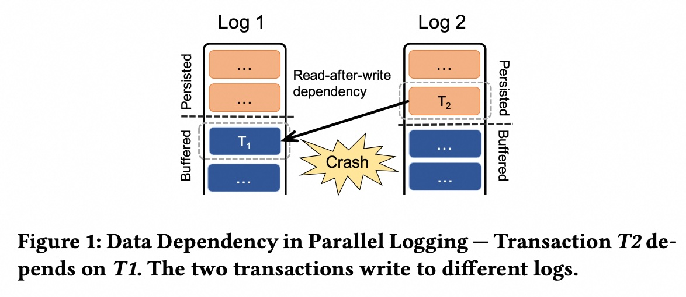
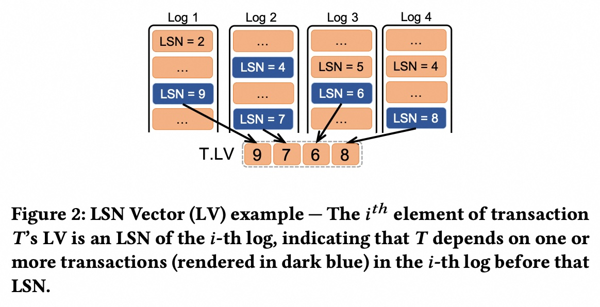
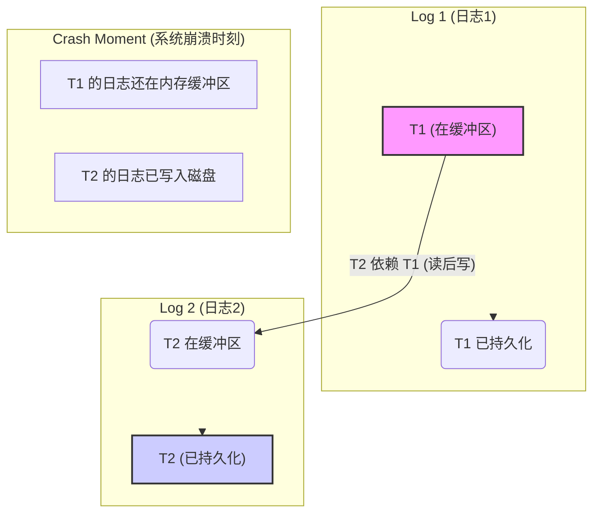
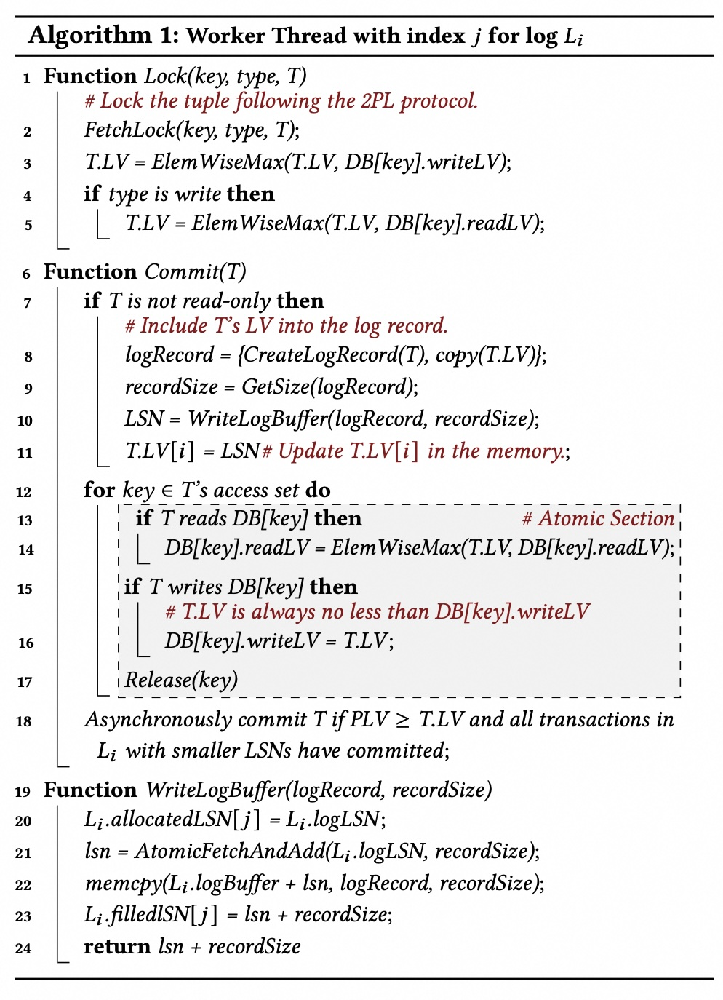
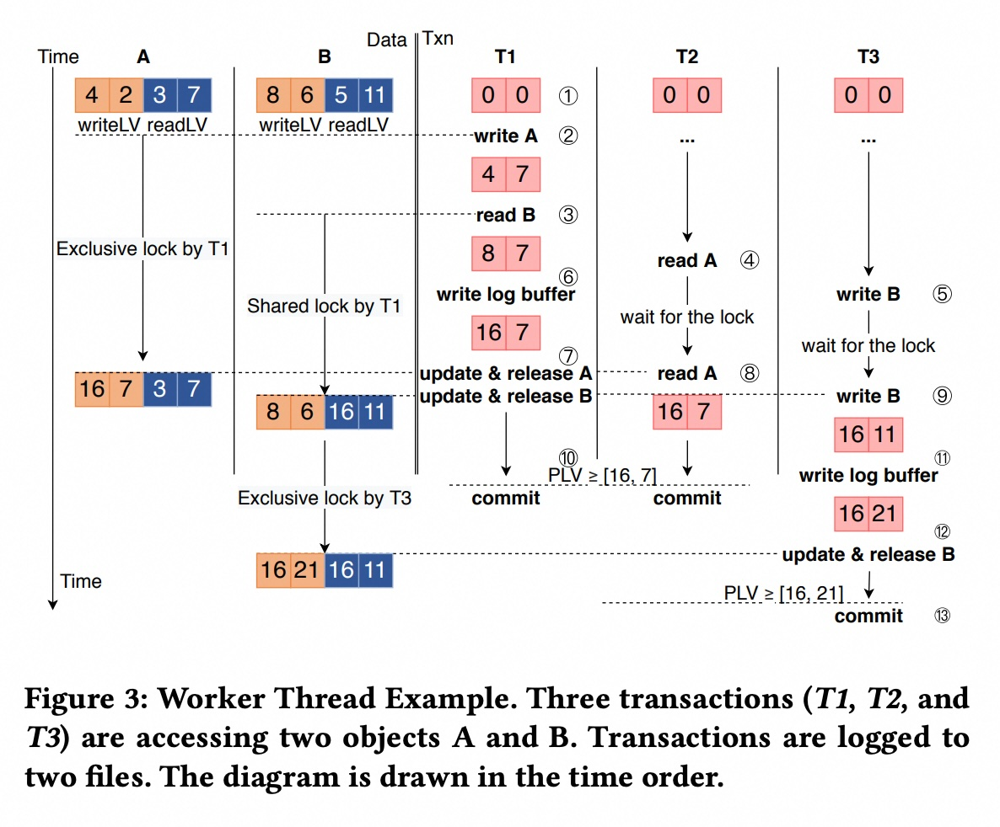
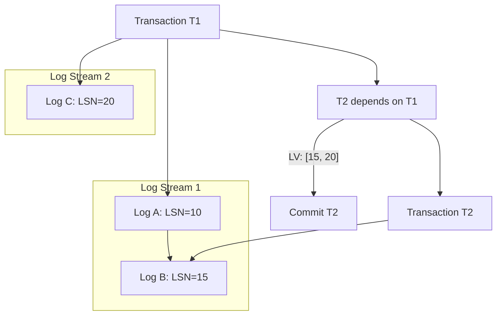

## AI论文解读 | Taurus: Lightweight Parallel Logging for In-Memory Database Management Systems
        
### 作者        
digoal        
        
### 日期        
2025-09-08       
        
### 标签        
PostgreSQL , PolarDB , DuckDB , AI , 论文解读        
        
----        
        
## 背景  
      
https://github.com/yxymit/DBx1000      
  
https://vldb.org/pvldb/vol14/p189-xia.pdf      
  
提示:          
```          
读懂《Taurus: Lightweight Parallel Logging for In-Memory Database Management Systems》这篇论文需要提前掌握哪些基础知识, 请使用中文通熟易懂的讲解这些基础知识, 可以引用论文中的图、表或使用Markdown支持的图形(text,mermaid等)增加解释性. 
  
使用中文通熟易懂的解读《Taurus: Lightweight Parallel Logging for In-Memory Database Management Systems》这篇论文, 其中的关键内容请着重讲解, 可以引用论文中的图、表或使用Markdown支持的图形(text,mermaid等)增加解释性. 
  
提取《Taurus: Lightweight Parallel Logging for In-Memory Database Management Systems》这篇论文中的重要术语, 使用中文对这些术语进行通熟易懂的讲解, 可以引用论文中的图、表或使用Markdown支持的图形(text,mermaid等)增加解释性. 
```     
  
## 1 前置知识 
  
为了理解《Taurus: 轻量级内存数据库管理系统并行日志记录》这篇论文，您需要掌握以下几个核心基础知识。这篇论文的核心在于解决传统数据库日志记录在现代内存数据库中遇到的性能瓶颈，并提出了一种新的解决方案。

-----

### 1\. 数据库事务与持久化 (Durability)

首先，你需要了解**数据库管理系统（DBMS）中的核心概念：事务（Transaction）。一个事务是一系列操作的集合，它要么全部成功执行，要么全部不执行。数据库的持久性**是事务的ACID特性之一，它确保一旦事务提交，其所做的修改就永久保存在数据库中，即使系统发生故障或崩溃也不会丢失 。

### 2\. 日志记录（Logging）与预写日志（WAL）

为了实现持久性，数据库通常使用 **预写日志（Write-Ahead Logging, WAL）** 技术 。简单来说，WAL 要求事务在将数据修改写入磁盘之前，必须先将其修改的日志记录（Log Records）写入到持久化存储（如硬盘、SSD或NVM）中。这样，即使系统在数据写入前崩溃，也可以通过日志进行恢复。

  * **数据日志（Data Logging）**：记录事务对数据的物理修改，例如 "将数据项A从1改为2" 。
  * **命令日志（Command Logging）**：只记录执行的高级命令，例如 "执行存储过程 `transfer(user1, user2, 100)`" 。命令日志的记录通常比数据日志小，但在恢复时需要重新执行所有命令，计算开销更大 。

### 3\. 单流日志（Serial Logging）的局限性

传统的数据库日志记录使用**单流日志**，所有事务都顺序地将它们的修改写入一个单一的日志流中 。这种方法简单直接，因为它使用 **日志序列号（Log Sequence Number, LSN）** 来明确定义事务的顺序 。

然而，在现代多核硬件和高吞吐量的内存数据库中，这种单流日志会成为一个严重的**性能瓶颈** 。由于所有事务都必须竞争这一个日志流，这会因缓存一致性（Cache Coherence）流量而影响性能 。

### 4\. 并行日志（Parallel Logging）的挑战

为了解决单流日志的瓶颈，**并行日志**应运而生，它允许事务将日志记录写入多个日志流（例如，每个磁盘一个日志流）。然而，这带来了一个新问题：由于没有一个天然的全局顺序，系统必须确保在恢复时，事务的执行顺序是正确的 。

论文中引用图1说明了这一挑战：

  

*图1：并行日志中的数据依赖。事务 T2 依赖于事务 T1。两个事务写入不同的日志。* 

如图所示，如果事务T2（依赖于T1）的日志记录已持久化到磁盘，而T1的日志记录仍在缓冲区（未持久化），数据库在崩溃后就无法正确恢复。因此，并行日志必须：

  * **挑战1：何时提交事务**：一个事务只有在它自身以及它所依赖的所有事务都已持久化后才能提交 。
  * **挑战2：是否恢复事务**：如果系统崩溃，恢复进程必须能够判断哪些事务已成功提交，并跳过未提交的事务 。
  * **挑战3：确定恢复顺序**：恢复时必须按照事务的依赖关系顺序执行 。

### 5\. LSN 向量（LSN Vector, LV）

为了应对上述挑战，论文提出了核心创新——**LSN 向量（LV）** 。LV 是一个由 LSN 组成的向量，其维度等于日志流的数量 。它被用来跟踪和编码事务间的依赖关系 。

LV 的概念类似于分布式系统中的**向量时钟（Vector Clock）**，用于强制实现消息传递中的偏序 。通过记录 LV，Taurus 协议能够在运行时跟踪事务依赖，并在恢复时根据 LV 的偏序关系来确定正确的恢复顺序 。

例如，论文中图2展示了一个LV的例子，它是一个包含 `(9, 7, 6, 8)` 的向量，表明该事务可能依赖于第一、二、三、四号日志流中，LSN分别不大于9、7、6和8的事务 。

  

### 6\. 并发控制（Concurrency Control）

论文假设了**两阶段锁协议（Two-Phase Locking, 2PL）** ，这是一种广泛使用的并发控制协议，通过获取和释放锁来保证事务的隔离性。此外，论文还讨论了如何扩展Taurus来支持**乐观并发控制（OCC）**  和**多版本并发控制（MVCC）** 。理解这些并发控制协议的基本工作原理，将有助于您理解 Taurus 如何在不同的系统环境下工作。
  
## 2 解读论文 
  
好的，我们来通俗易懂地解读一下这篇关于高性能数据库日志系统的论文：《Taurus: Lightweight Parallel Logging for In-Memory Database Management Systems》。

### 引言：为什么需要一个新的日志系统？

现代数据库，尤其是**内存数据库 (In-Memory DBMS)**，速度非常快，因为它们的数据主要都放在内存里。这些数据库通常运行在拥有几十甚至上百个核心的强大服务器上 。

为了保证数据的**持久性**（即事务一旦提交，即使系统崩溃数据也不会丢失），数据库普遍采用一种叫做**预写式日志 (Write-Ahead-Logging, WAL)** 的技术 。简单来说，就是在修改数据库之前，先把要做的修改操作记录到一个日志文件里。

传统日志系统的问题在于，它是一个**单通道**的串行操作 。想象一下一个多车道的高速公路，最后汇入了一个单车道的收费站。无论前方有多少辆车（并发事务），最终都必须排成一队，一个一个地通过收费站（写入日志）。这个单通道的日志就成了整个高性能数据库的性能瓶颈 。

因此，研究者们提出了**并行日志**方案：将一个日志通道扩展成多个，让事务可以同时写入不同的日志文件，就像把单车道收费站改造成多车道收费站一样 。

-----

### 并行日志的挑战

虽然并行日志听起来很美好，但实现起来有三个核心挑战 ：

1.  **何时提交事务？** 在串行日志中，只要一个事务的日志成功写入磁盘，就意味着它依赖的所有前序事务肯定也已经写入了。但在并行日志中，一个事务 T2 可能依赖于 T1，但 T2 的日志先于 T1 写到了磁盘上。这时系统不能冒然地告诉用户 T2 已经提交，因为它的“前置依赖” T1 还没落地 。
2.  **崩溃后是否要恢复某个事务？** 紧接上一个问题，如果系统在 T2 日志写完、T1 日志没写完时崩溃了。在恢复时，系统必须能识别出 T2 是一个“无效”的提交，不应该被恢复，否则数据就会出错 。
3.  **恢复顺序是什么？** 如果 T1 和 T2 的日志在崩溃前都成功写入了磁盘，那么在恢复时，系统必须保证先恢复 T1，再恢复 T2，这个依赖顺序不能乱 。

我们可以用论文中的**图1**来直观理解这个依赖问题：   
  


在这个场景中，事务 T2 依赖于 T1。它们被分配到两个不同的日志流。在系统崩溃时，T2 的日志已经持久化到磁盘，但 T1 的日志还在内存里。如果恢复系统不知道这个依赖关系，它可能会错误地恢复 T2，导致数据不一致。

-----

### Taurus 的核心思想：LSN 向量 (LSN Vector)

为了解决上述挑战，Taurus 引入了一个核心机制——**LSN 向量 (LSN Vector, 简称 LV)** 。

  * **什么是 LSN？** LSN (Log Sequence Number) 是日志序列号，可以理解为一条日志记录在日志文件中的物理位置或偏移量 。
  * **什么是 LSN 向量？** 如果系统有 n 个并行日志流，那么 LSN 向量就是一个长度为 n 的数组 。例如，有4个日志流，一个事务 T 的 LV 可能看起来像这样：`T.LV = [LSN1, LSN2, LSN3, LSN4]`。

这个向量的含义是：**事务 T 依赖于第 i 个日志流中，所有 LSN 小于等于 `LSN_i` 的事务，但不依赖任何 LSN 大于 `LSN_i` 的事务** 。

我们可以参考论文中的**图2**来理解：    

```text
       Log 1      Log 2      Log 3      Log 4
         |          |          |          |
LSN=...  +----------+----------+----------+----------+
LSN=9    |          |          |          |    T_j   |
LSN=8    |          |          |          |----------|
LSN=7    |          |    T_k   |          |          |
LSN=6    |          |----------|    T_m   |          |
LSN=5    |   T_p    |          |----------|          |
LSN=4    |----------|          |          |          |
LSN=...  +----------+----------+----------+----------+

假设某个事务 T 的 LSN 向量是: T.LV = [9, 7, 6, 8]

这表示:
- T 依赖 Log 1 中 LSN <= 9 的所有事务 (比如 T_p)。
- T 依赖 Log 2 中 LSN <= 7 的所有事务 (比如 T_k)。
- T 依赖 Log 3 中 LSN <= 6 的所有事务 (比如 T_m)。
- T 依赖 Log 4 中 LSN <= 8 的所有事务 (比如 T_j)。
```

通过这个 LSN 向量，Taurus 将事务间的依赖关系（偏序关系）巧妙地编码了下来 。

#### LSN 向量如何解决挑战？

1.  **何时提交？** Taurus 维护一个全局的**持久化 LSN 向量 (PLV)**，`PLV[i]` 记录了第 i 个日志流已经刷到磁盘的 LSN 位置 。一个事务 T 只有在 `PLV >= T.LV` （即 PLV 的每个元素都大于等于 T.LV 的对应元素）时，才能最终确认提交 。
2.  **是否恢复？** 恢复开始时，系统首先检查每个日志文件的实际大小，形成一个**文件结尾 LSN 向量 (ELV)** 。只有满足 `T.LV <= ELV` 的事务，才被认为是崩溃前完整提交的，才会被纳入恢复流程 。
3.  **恢复顺序？** 在恢复过程中，Taurus 维护一个**已恢复 LSN 向量 (RLV)**，`RLV[i]` 记录了第 i 个日志流中已成功恢复到的 LSN 位置 。一个事务 T 只有在 `T.LV <= RLV` 时才能被恢复，这确保了它的所有依赖项都已经被恢复了 。

-----

### Taurus 协议详解

#### 1\. 日志写入操作（运行时）

当一个事务 T 在运行时，它会执行以下操作（参考论文算法1和图3）：       

  * **捕获依赖**：当事务 T 访问（读或写）一个数据元组时，它会读取该元组上记录的 `readLV` 和 `writeLV`（这两个LV记录了最近读/写该元组的事务的LV）。然后，T 会用自己的 `T.LV` 和元组的LV做一个 **“按元素取大值” (ElemWiseMax)**  的操作来更新自身的LV 。`T.LV = ElemWiseMax(T.LV, tuple.writeLV)`。这样一来，依赖关系就通过LV传递和累积起来了。
  * **写入日志**：当事务 T 准备提交时，它会把自己的最终 `T.LV` 的一个副本连同日志内容（修改的数据或执行的命令）一起写入分配给它的日志流的缓冲区 。写入后，它会获得一个在这条日志流中的唯一 LSN。
  * **更新自身 LV**：事务 T 会用这个新获得的 LSN 更新自己内存中 `T.LV` 的对应维度。例如，如果 T 被分配到第2个日志流，获得的 LSN 是 100，那么 `T.LV[2] = 100` 。
  * **更新元组 LV 并释放锁**：T 会用它更新后的 `T.LV` 去更新它访问过的所有元组的 `readLV` 或 `writeLV`，然后释放锁 。这样，后续访问这些元组的事务就能捕获到对 T 的依赖。
  * **异步等待提交**：事务释放锁后就可以立即返回（这被称为**提前释放锁 ELR** ），不需要等待日志完全刷盘，从而提高性能。系统会异步地检查何时 `PLV >= T.LV` 成立，届时才算真正完成提交。

#### 2\. 恢复操作

当系统从崩溃中恢复时：

1.  **扫描日志**：每个日志流由一个线程负责，从头扫描日志文件，将在崩溃前完整提交的事务（即 `T.LV <= ELV` 的事务）读入一个待恢复的队列 `pool` 中 。
2.  **并行恢复**：多个工作线程会并行地从所有 `pool` 中寻找“可恢复”的事务。一个事务 T 是可恢复的，当且仅当 `T.LV <= RLV` 。
3.  **更新 RLV**：每当一个事务被成功恢复，工作线程就会去更新全局的 `RLV` 。`RLV` 的更新会“解锁”更多依赖于刚刚完成恢复的事务，使它们变为“可恢复”状态。

这个过程本质上是在依赖关系图上进行并行的拓扑排序 。

-----

### 关键优化与扩展

1.  **LSN 向量压缩**：

      * **元组 LV 压缩**：为数据库中每一个元组都保存 `readLV` 和 `writeLV` 会占用大量空间。优化方法是，只在锁管理器中为当前活跃的（被加锁的）元组保存 LV，而不是永久存储 。
      * **日志记录 LV 压缩**：在日志中为每条记录都存储一个完整的 LV 也很占空间。Taurus 的优化是，在日志中定期写入一个“锚点” `LPLV`（即当时的全局 PLV）。对于每个事务的 `T.LV`，只记录那些比 `LPLV` 中对应值更大的维度，其他维度在恢复时用 `LPLV` 的值填充即可 。这大大减少了日志大小，特别是对于命令日志。

2.  **向量化 (SIMD)**：LV 的核心操作 `ElemWiseMax` 是高度并行的。现代 CPU 提供了 SIMD 指令（单指令多数据流），可以一次性完成对整个向量的计算，比如一条指令同时计算16个整数的最大值 。这使得 LV 计算的开销变得极低，论文显示开销降低了高达 89.5% 。

3.  **支持多种并发控制**：Taurus 设计得很通用，除了支持传统的基于锁的协议 (2PL) ，它也可以扩展到支持**乐观并发控制 (OCC)**  和**多版本并发控制 (MVCC)** ，这让它能适用于更广泛的数据库系统。

-----

### 实验结果与结论

论文在 NVMe SSD、HDD 和模拟持久内存（RAM Disk）上进行了详尽的实验，对比了多种方案。

  * **碾压串行日志**：Taurus 的并行日志在运行时吞吐量和崩溃恢复速度上都远超传统的单流日志。在 NVMe SSD 上，运行时吞吐量最高提升了 **9.9倍**（数据日志）和 **2.9倍**（命令日志），恢复速度则最高提升了 **22.9倍** 和 **75.6倍** 。
  * **命令日志的优势**：Taurus 的一个巨大优势是同时支持**数据日志**（记录修改后的值）和**命令日志**（记录执行的存储过程和参数）。命令日志的记录通常更小 。在磁盘带宽成为瓶颈时（如 HDD），命令日志性能优势巨大。实验表明，Taurus 的命令日志比当时最先进的并行数据日志方案（如 Silo-R）在 NVMe 上快 **2.8倍** ，在 HDD 上快 **9.2倍** 。
  * **可扩展性好**：实验图表显示，随着 CPU 核心数（工作线程）的增加，Taurus 的性能能够很好地线性扩展，而串行日志很快就达到了瓶颈 。

**核心贡献总结** ：

1.  提出了一种轻量级的并行日志方案 Taurus，它同时支持数据日志和命令日志。
2.  核心机制是 LSN 向量，它能有效追踪事务依赖，确保正确恢复。
3.  设计了多种优化（如 LV 压缩），显著降低了存储和计算开销。
4.  实验证明，Taurus 在性能和可扩展性上均优于现有的串行和并行日志方案。

总而言之，Taurus 通过 LSN 向量这个巧妙的设计，成功解决了并行日志带来的一致性难题，为现代高性能内存数据库提供了一个高效、可扩展且通用的持久化方案。
  
## 3 术语 
  
为了帮助你更好地理解《Taurus: 轻量级内存数据库管理系统并行日志记录》这篇论文，我提取并用通俗易懂的中文讲解了其中的一些重要术语，你可以把它们看作是理解整篇论文的“钥匙”。

-----

### 1\. 并行日志（Parallel Logging）

在传统的数据库中，所有事务的日志记录都像排队一样，一个接一个地写入一个单一的日志流中。这被称为**单流日志（Single-stream Logging）**。然而，当事务量非常大时，这个单一的日志流就会成为整个系统的瓶颈。

**并行日志**是 Taurus 论文的核心思想，它打破了这种“排队”模式。它允许数据库同时使用多个日志流（想象成多条并行的马路），不同的事务可以将它们的日志记录写入不同的日志流中，从而大大提高日志写入的吞吐量，减少了系统的性能瓶颈。

### 2\. 预写日志（Write-Ahead Logging, WAL）

这是一个所有现代数据库都使用的基础技术。它是一种确保数据库 **持久性（Durability）** 的机制。它的核心原则是：**在数据真正写入到磁盘之前，必须先将修改的日志记录写入到磁盘。**

这就像你在记账时，先在草稿本上记下每一笔收支，然后再去修改正式账本。如果中间停电了，你至少可以根据草稿本上的记录来恢复。WAL 就是这个“草稿本”，它确保了即使系统在数据写入完成前崩溃，也能通过日志来恢复数据。

### 3\. 日志序列号（Log Sequence Number, LSN）

你可以把 **LSN** 看作是日志记录的“身份证号”，它是一个单调递增的数字，每个日志记录都有一个唯一的 LSN。它最主要的作用就是用来**定义日志记录的顺序**。

在单流日志中，LSN 就像一个天然的全局时钟，所有日志记录都按 LSN 的大小顺序排列。但在并行日志中，由于有多个流，单个 LSN 已经不足以表示全局的顺序了。

### 4\. 事务依赖（Transaction Dependency）

当一个事务的操作依赖于另一个事务的操作结果时，我们就说它们之间存在**事务依赖**。例如：

  * 事务T1：将用户A的余额从1000减去100。
  * 事务T2：查询用户A的余额，并进行其他操作。

T2 的结果依赖于T1是否成功，所以T2依赖于T1。在并行日志中，如果T1和T2的日志记录写入了不同的日志流，那么在系统崩溃恢复时，必须先恢复T1，再恢复T2，否则就会出错。如何追踪和保证这种依赖关系，是并行日志面临的最大挑战。

-----

### 5\. LSN 向量（LSN Vector, LV）

为了解决并行日志中追踪事务依赖的难题，Taurus 论文提出了最关键的创新：**LSN 向量（LV）**。

LV 是一个包含多个 LSN 的向量，其维度等于日志流的数量。它巧妙地将事务的依赖关系编码在了这个向量中。

当一个事务准备提交时，它会生成一个 LV，这个向量的每个分量都记录了该事务在每个日志流上的“依赖边界”。

例如，一个 LSN 向量 `[15, 20, 8]` 表示这个事务：

  * 依赖于日志流1中所有 LSN 小于等于 15 的日志记录。
  * 依赖于日志流2中所有 LSN 小于等于 20 的日志记录。
  * 依赖于日志流3中所有 LSN 小于等于 8 的日志记录。

通过在每个事务的日志记录中存储这个 LV，Taurus 就可以在恢复时，根据 LSN 向量来确定正确的事务恢复顺序，即使这些事务的日志记录分散在不同的日志流中。

下面是一个简单的示意图，展示了两个事务 T1 和 T2 的依赖关系如何用 LV 表示：



在这个例子中，T2 依赖于 T1，T1 的日志记录分别在日志流1（LSN=10）和日志流2（LSN=20）中。当T2提交时，它的 LSN 向量就会记录它所依赖的最高 LSN，即 `[15, 20]`，以确保在恢复时 T1 的日志先于 T2 被处理。

-----

### 6\. 分组提交（Group Commit）

分组提交是一种常见的日志优化技术。它不是让每个事务单独提交日志，而是将多个已完成的事务日志收集在一起，一次性地批量写入持久化存储。

这种方式可以减少对磁盘的写入次数，从而减少 I/O 操作的开销。Taurus 论文中的并行日志也利用了分组提交，将其与异步日志结合，进一步提高了整体性能。

如果对这些术语还有疑问，或者想了解论文的其他部分，请随时告诉我！
  
## 参考        
         
https://github.com/yxymit/DBx1000      
  
https://vldb.org/pvldb/vol14/p189-xia.pdf  
        
<b> 以上内容基于DeepSeek、Qwen、Gemini及诸多AI生成, 轻微人工调整, 感谢杭州深度求索人工智能、阿里云、Google等公司. </b>        
        
<b> AI 生成的内容请自行辨别正确性, 当然也多了些许踩坑的乐趣, 毕竟冒险是每个男人的天性.  </b>        
    
#### [期望 PostgreSQL|开源PolarDB 增加什么功能?](https://github.com/digoal/blog/issues/76 "269ac3d1c492e938c0191101c7238216")
  
  
#### [PolarDB 开源数据库](https://openpolardb.com/home "57258f76c37864c6e6d23383d05714ea")
  
  
#### [PolarDB 学习图谱](https://www.aliyun.com/database/openpolardb/activity "8642f60e04ed0c814bf9cb9677976bd4")
  
  
#### [PostgreSQL 解决方案集合](../201706/20170601_02.md "40cff096e9ed7122c512b35d8561d9c8")
  
  
#### [德哥 / digoal's Github - 公益是一辈子的事.](https://github.com/digoal/blog/blob/master/README.md "22709685feb7cab07d30f30387f0a9ae")
  
  
#### [About 德哥](https://github.com/digoal/blog/blob/master/me/readme.md "a37735981e7704886ffd590565582dd0")
  
  

  
