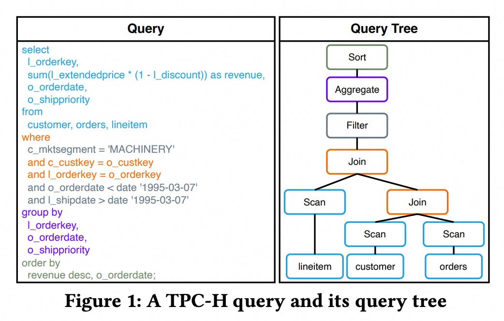
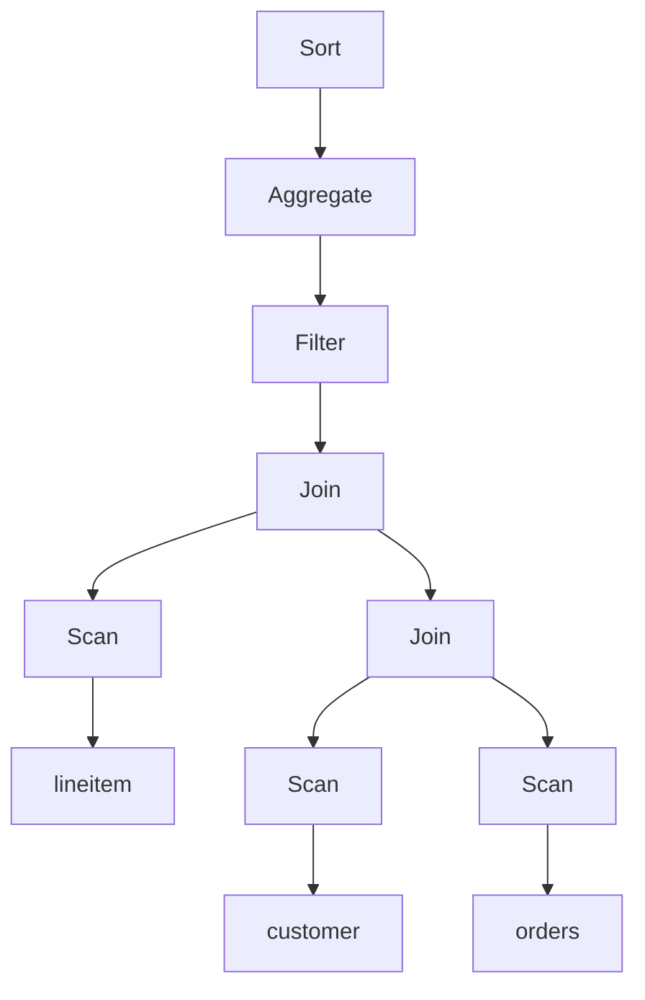
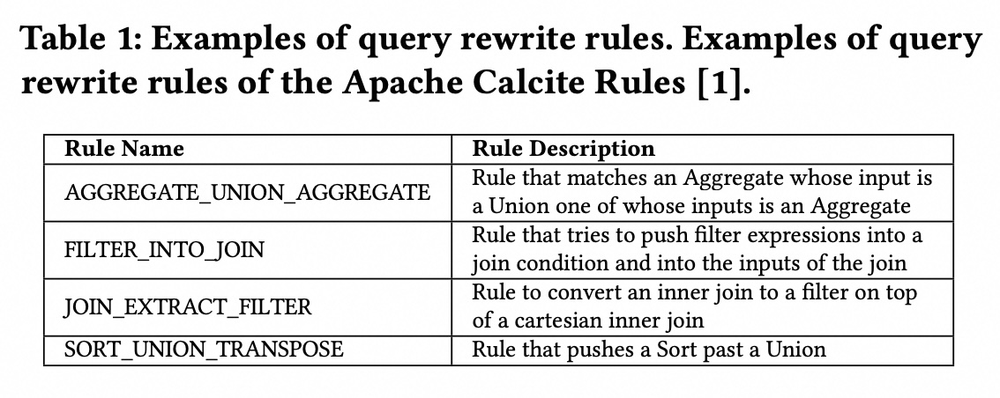
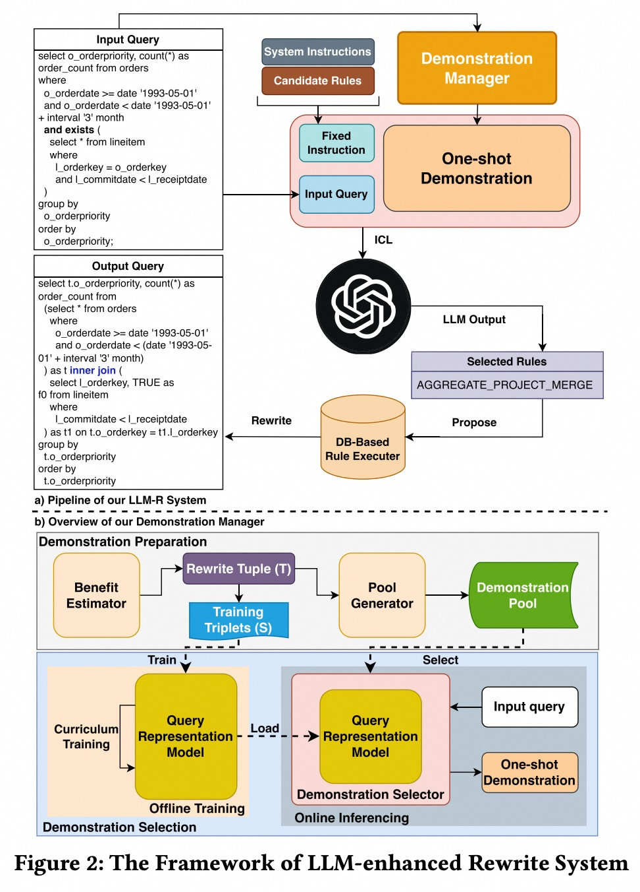
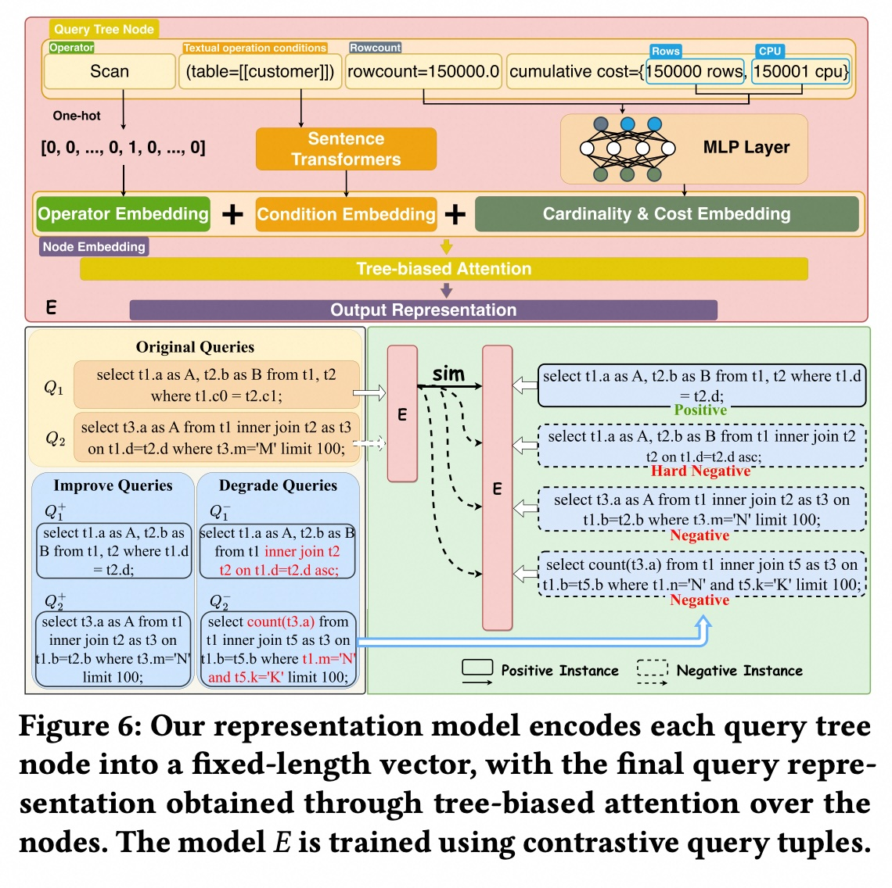
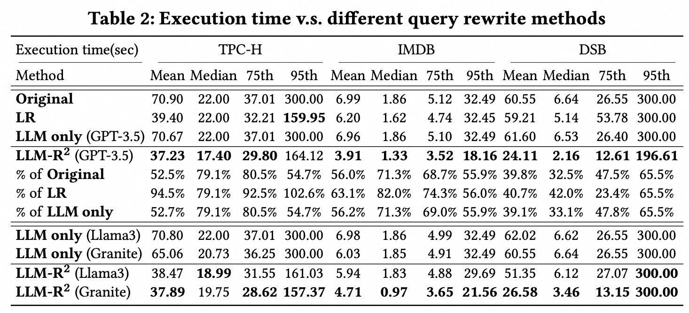
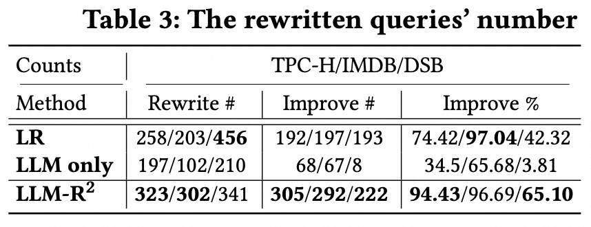
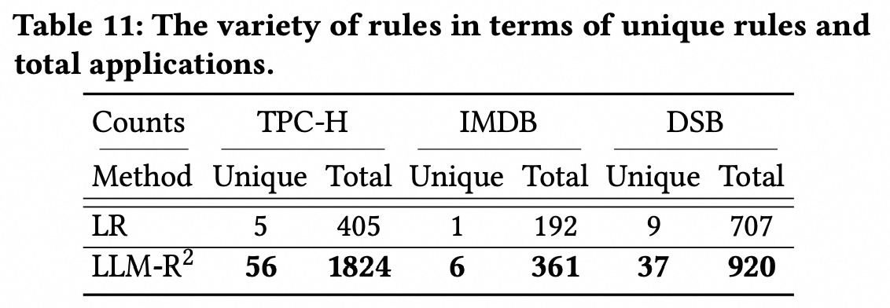
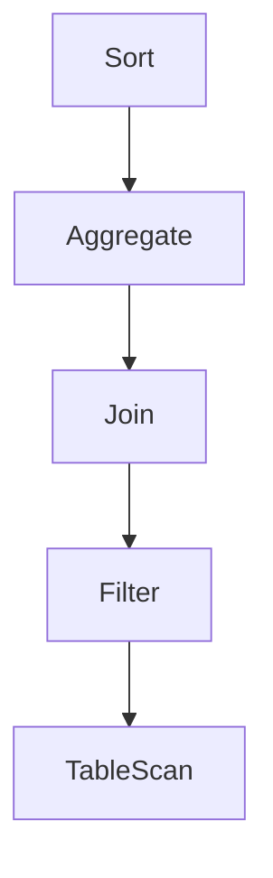

## AI论文解读 | LLM-R²: A Large Language Model Enhanced Rule-based Rewrite System for Boosting Query Efficiency
        
### 作者        
digoal        
        
### 日期        
2025-09-08       
        
### 标签        
PostgreSQL , PolarDB , DuckDB , AI , 论文解读        
        
----        
        
## 背景  
      
https://www.vldb.org/pvldb/vol18/p53-yuan.pdf        
  
提示:          
```          
读懂《LLM-R²: A Large Language Model Enhanced Rule-based Rewrite System for Boosting Query Efficiency》这篇论文需要提前掌握哪些基础知识, 请使用中文通熟易懂的讲解这些基础知识, 可以引用论文中的图、表或使用Markdown支持的图形(text,mermaid等)增加解释性. 
  
使用中文通熟易懂的解读《LLM-R²: A Large Language Model Enhanced Rule-based Rewrite System for Boosting Query Efficiency》这篇论文, 其中的关键内容请着重讲解, 可以引用论文中的图、表或使用Markdown支持的图形(text,mermaid等)增加解释性. 
  
提取《LLM-R²: A Large Language Model Enhanced Rule-based Rewrite System for Boosting Query Efficiency》这篇论文中的重要术语, 使用中文对这些术语进行通熟易懂的讲解, 可以引用论文中的图、表或使用Markdown支持的图形(text,mermaid等)增加解释性. 
```     
  
## 1 前置知识 
  
理解《LLM-R: A Large Language Model Enhanced Rule-based Rewrite System for Boosting Query Efficiency》这篇论文，需要提前掌握以下几个核心基础知识。

### 1\. 数据库查询优化（Database Query Optimization）

这是论文研究的大背景。在数据库系统中，查询优化器（Query Optimizer）的主要任务是找到一个执行效率最高的查询执行计划。查询重写（Query Rewrite）是查询优化的一个重要部分，其目标是在不改变查询结果的前提下，生成一个执行时间更短的新查询 。

论文中提到的查询重写应满足三个关键标准 ：

  * **可执行性（Executability）**：重写后的查询必须是可执行的，且没有语法错误。
  * **等价性（Equivalence）**：重写后的查询必须与原始查询产生完全相同的结果。
  * **高效性（Efficiency）**：重写过程本身（计算效率）和重写后查询的执行（执行效率）都应是高效的。

### 2\. SQL查询与查询树（SQL Query and Query Tree）

这篇论文的许多概念都建立在查询树之上。查询树是一种将SQL查询转换为树状结构的方式，树中的每个节点代表一个特定的数据库操作符，例如`Sort`（排序）、`Join`（连接）和`Scan`（扫描）等 。

论文中引用了图1来展示一个SQL查询如何被表示成查询树。这个概念是理解论文中“基于规则的重写”如何工作的关键，因为重写规则实际上是在这个树状结构上进行操作的 。

  



**图：一个简化的查询树示例**

### 3\. 基于规则的查询重写（Rule-based Query Rewrite）

传统的查询重写方法主要依赖于预先定义好的重写规则。这些规则的作用是转换查询树中的节点或改变操作符的执行顺序，从而生成一个等价但可能更高效的新查询 。

论文在表1中列举了一些常见的重写规则，例如`FILTER_INTO_JOIN`（将过滤器推入连接中）和`SORT_UNION_TRANSPOSE`（将排序操作推到联合操作之后）等 。理解这些规则对于掌握论文核心思想至关重要，因为论文中的`LLM-R²`系统就是利用大型语言模型来推荐这些规则的 。

  

### 4\. 大型语言模型（LLM）与情境学习（In-context Learning）

这部分是论文的创新之处。传统的基于规则的重写方法在选择最佳规则时，计算成本高且依赖于不准确的成本估计器。而直接使用LLM进行SQL重写又容易出现“幻觉”问题，即模型生成看似合理但语法或逻辑不正确的查询 。

为了解决这些问题，论文提出了利用LLM的情境学习（In-context Learning，ICL）能力 。情境学习是一种在不更新模型权重的情况下，通过在提示中提供示例来引导模型执行特定任务的技术 。在`LLM-R²`系统中，LLM的任务不是直接生成新的SQL，而是根据一个好的示例（“示范”），推荐一组有效的重写规则 。

### 5\. 对比学习与课程学习（Contrastive Learning and Curriculum Learning）

情境学习的效果高度依赖于所提供的示例质量 。为了找到最适合给定查询的示例，论文设计了一个名为 **示范管理器（Demonstration Manager）** 的模块 。

这个模块使用 **对比学习（Contrastive Learning）** 来训练一个查询表示模型。对比学习的目标是使相似的数据点在表示空间中距离更近，而不相似的数据点距离更远 。在这里，相似的查询是那些重写后能带来相似效率提升的查询。

此外，为了应对训练数据有限的挑战，论文还采用了 **课程学习（Curriculum Learning）** 方法。这种方法会循序渐进地训练模型，先从简单的数据开始，然后逐步引入难度更高的数据，这有助于模型更有效地学习 。

总而言之，理解这篇论文需要您具备数据库系统、SQL查询、基本数据结构（如树）、以及一些核心的机器学习概念，特别是**大型语言模型、情境学习、对比学习和课程学习**。掌握这些基础知识，将有助于您深入理解`LLM-R²`系统如何巧妙地结合了传统数据库技术和现代机器学习方法来提升查询效率。
  
## 2 解读论文 
  
好的，我们来用通俗易懂的中文解读一下《LLM-R²: A Large Language Model Enhanced Rule-based Rewrite System for Boosting Query Efficiency》这篇论文。

这篇论文的核心思想是：**利用大型语言模型（LLM，例如GPT-3.5）的强大推理能力，来帮助数据库更智能地进行“查询重写”（Query Rewrite），从而大幅提升数据库查询的执行效率。**

-----

### **1. 问题背景：什么是查询重写？为什么需要优化？**

想象一下，你问数据库一个问题：“请找出所有A公司的订单”，这句问话就是一条SQL查询。数据库在执行这个查询之前，会先在内部进行一个叫“查询优化”的过程，其中一个关键步骤就是“查询重写”。

**查询重写（Query Rewrite）**  指的是，在不改变查询结果的前提下，把原始的SQL语句改写成另一种写法，让数据库执行起来更快、更省资源 。

**传统方法的痛点** ：

1.  **规则选择困难**：数据库内部有很多重写规则，但怎么组合这些规则才能达到最佳效果，就像解一个复杂的魔方，非常耗时耗力 。
2.  **依赖不准的成本估算器**：传统方法严重依赖数据库自己的成本估算模型来判断哪种写法更好，但这个估算器常常不准 。
3.  **发现新规则很难**：要创造新的、有效的重写规则，需要复杂的逻辑证明和大量的人工介入 。

**直接用LLM重写的弊端** ：
有人可能会想，能不能直接让GPT这样的LLM来重写SQL？比如直接把原始SQL丢给它，说“帮我优化一下”。这种方法虽然可行，但有一个致命问题——**幻觉（Hallucination）** 。LLM可能会一本正经地“创造”出语法错误或者逻辑不通的SQL，导致查询失败或结果错误 。

-----

### **2. 论文的核心方案：LLM-R² 系统**

为了解决上述问题，作者们提出了一个创新的系统，叫做 **LLM-R²**。这个名字的意思是“大型语言模型增强的基于规则的重写系统”。

它的核心思路非常巧妙：**我们不让LLM直接“写”SQL，而是让它当一个“军师”，从已有的、绝对安全的重写规则库里，推荐出一个最佳的规则组合。然后，再由数据库自己去执行这些规则的重写操作。**

这样既利用了LLM的“智慧”，又通过数据库内置的规则执行器保证了重写的**可执行性（Executability）和等价性（Equivalence）** ，完美规避了LLM的幻觉问题。

#### **系统工作流程**

我们可以通过论文中的图2(a)来理解它的工作流程：

  

```text
+----------------------+      +--------------------------+
|      用户输入SQL       |----->|         LLM-R² 系统      |
+----------------------+      +--------------------------+
                             |             |
                             |  1. 准备"提示" (Prompt)   |
                             |  /         |         \   |
                             | System   Candidate    One-shot |
                             | Instr.   Rules       Demo.    |
                             +--------------------------+
                             |             |
                             |  2. 发送给 LLM            |
                             v             |
                      +-----------+  <-----------+
                      |    LLM    |
                      +-----------+
                             |
                             |  3. LLM 输出推荐的规则  |
                             v
                  [ AGGREGATE_PROJECT_MERGE ]
                             |
                             |  4. 数据库执行重写      |
                             v
                 +---------------------------+
                 | DB-Based Rule Executer    |
                 +---------------------------+
                             |
                             |  5. 输出优化后的SQL     |
                             v
                 +---------------------------+
                 |       高效的新SQL         |
                 +---------------------------+
```

1.  **输入 (Input Query)**：用户给出一个待优化的SQL查询。
2.  **构建Prompt**：系统会精心构造一个Prompt（给LLM的指令），这个Prompt包含三个部分 ：
      * **固定指令 (Fixed Instruction)**：告诉LLM它的任务是什么，以及一个包含所有可用重写规则的列表和解释 。
      * **输入查询 (Input Query)**：把用户的SQL放进去 。
      * **一次性演示 (One-shot Demonstration)**：这是关键！为了让LLM更好地理解任务，系统会给它看一个“成功案例” 。这个案例包含一个示例查询和应用在它身上的、效果很好的重写规则组合 。
3.  **LLM推理**：LLM在理解了整个Prompt后，会输出它认为最适合当前输入查询的一组重写规则 。
4.  **执行重写**：数据库的规则执行器（DB-Based Rule Executer）会应用LLM推荐的这些规则，对原始SQL进行转换 。
5.  **输出 (Output Query)**：最终得到一个和原始查询结果相同，但执行效率更高的新查询 。

-----

### **3. 关键技术：如何找到最好的“成功案例”？—— Demonstration Manager**

上面流程中，选择一个高质量的“成功案例”（Demonstration）至关重要。一个好的案例能启发LLM做出正确的决策，而一个坏的案例则会误导它 。为此，作者设计了一个核心模块，叫做**Demonstration Manager（演示管理器）** 。

这个管理器分为两个阶段，如论文图2(b)所示：   

#### **阶段一：演示准备 (Demonstration Preparation) - 离线进行**

这个阶段的目标是建立一个高质量的“案例库”（Demonstration Pool）和一个用于训练的数据集。

1.  **生成候选案例**：首先，系统会用一些基础方法（包括不带演示的LLM-R²）去尝试重写大量的训练查询，并记录下哪些重写是有效的（即查询速度变快了）。
2.  **评估与筛选**：通过一个**效益评估器（Benefit Estimator）** ，精确计算每种重写组合带来的性能提升幅度（论文中定义为 `α = 原始耗时 / 重写后耗时`）。
3.  **构建案例库和训练数据**：
      * **案例库（Pool Generator）**：将那些性能提升最大的“输入查询-规则组合”存入案例库，作为日后给LLM看的范例 。
      * **训练三元组（Training Triplets）**：为了训练后续的模型，系统会为每个查询`Q`生成一个数据三元组 `(Q, Q+, Q-)` 。其中：
          * `Q+` (Improve Query): 是一个与`Q`相似且重写效果好的案例查询。
          * `Q-` (Degrade Query): 是一个与`Q`相似但重写效果差的案例查询。

#### **阶段二：演示选择 (Demonstration Selection) - 线上推理**

当一个新查询到来时，需要从案例库中挑选出最匹配的那个案例。

1.  **查询表示模型（Query Representation Model）**：作者设计了一个精巧的模型，用来学习如何“理解”一个SQL查询。这个模型会把一个查询（准确地说是查询的内部结构“查询树”）转换成一个数学向量 。这个向量包含了查询的操作类型、条件、预计成本等多种信息 。
2.  **对比学习（Contrastive Learning）**：利用第一阶段准备的 `(Q, Q+, Q-)` 三元组数据来训练表示模型 。训练的目标是：
      * 让查询`Q`的向量与“好案例”`Q+`的向量在空间上**更接近**。
      * 让查询`Q`的向量与“坏案例”`Q-`的向量在空间上**更疏远**。
      * 如下图所示（改编自论文图6）：   
    
    ```mermaid
    graph LR
        subgraph 训练过程
            Q["查询Q的向量"]
            Q_plus["好案例Q+的向量"]
            Q_minus["坏案例Q-的向量"]

            Q -- "拉近距离" --> Q_plus
            Q -- "推远距离" --> Q_minus
        end
    ```
3.  **课程学习（Curriculum Learning）**：由于高质量的训练数据有限，为了让模型学得更好，作者还引入了“课程学习”的策略 。即先让模型学习简单的案例，再逐步增加难度，就像我们上学一样，从易到难 。
4.  **线上选择**：模型训练好后，当新查询到来时，系统会计算它与案例库中所有案例的向量相似度，并选择最相似的那个作为“一次性演示”提供给LLM 。

-----

### **4. 实验效果：LLM-R² 到底有多强？**

作者在TPC-H, IMDB, DSB三个不同类型的数据集上进行了充分的实验。

  * **执行效率显著提升**：从论文的**表2**可以看出，LLM-R² 的性能非常出色。    

      * 相比原始查询，在三个数据集上平均只花费了 **52.5%**, **56.0%**, **39.8%** 的时间 。
      * 相比当时最先进的基线方法（LR），也只花费了 **94.5%**, **63.1%**, **40.7%** 的时间 。

  * **重写成功率和改进率更高**：如**表3**所示，LLM-R² 不仅尝试重写的次数更多，而且重写后带来性能提升的查询比例也最高 。相比之下，“LLM only”方法由于幻觉问题，成功率很低 。   

  * **鲁棒性好**：

      * **跨数据集能力（Transferability）**：在TPC-H上训练的模型，直接用到IMDB数据集上，效果依然很好，证明了其强大的泛化能力 。
      * **数据规模适应性（Flexibility）**：随着数据量从1G增长到100G，LLM-R² 的优势愈发明显 。

  * **更智能的规则选择**：如**表11**所示，LLM-R² 能够发现和使用更多样化的重写规则（Unique列的数值远高于LR），说明它比传统方法更“灵活”和“聪明” 。   

### **5. 总结**

《LLM-R²》这篇论文提出了一个非常实用且创新的框架，它巧妙地将大型语言模型强大的推理能力与传统数据库系统的稳定性和精确性结合起来。通过让LLM扮演“推荐规则”的军师角色，而不是直接“编写”SQL，成功地解决了LLM的幻觉问题，并显著提升了查询重写的质量和数据库的执行效率。其设计的Demonstration Manager模块，特别是基于对比学习和课程学习的演示选择机制，是整个系统能够取得优异性能的关键。这项工作为LLM在严肃、复杂的数据库内核优化领域的应用开辟了一条新的道路。
  
## 3 术语 
  
在《LLM-R²: A Large Language Model Enhanced Rule-based Rewrite System for Boosting Query Efficiency》这篇论文中，有几个关键术语是理解其核心思想的基础。下面我将用通俗易懂的方式对这些术语进行讲解。

-----

### **1. 查询重写（Query Rewrite）**

**概念：** 简单来说，查询重写就是在不改变一个SQL查询最终结果的前提下，改变它的结构，让它跑得更快。

**例子：** 比如你问数据库：“找出所有在中国居住、且年龄大于30岁的客户”。查询重写可能会把它变成：“先找出所有年龄大于30岁的客户，再从中筛选出居住在中国的人”。这两种方式得到的结果一样，但如果数据库中年龄大于30岁的人很少，第二种方式的效率就可能更高。

-----

### **2. 基于规则的重写系统（Rule-based Rewrite System）**

**概念：** 这是传统的查询优化方法。它依赖于一套预先定义好的规则库，就像一本“武功秘籍”。查询优化器会根据这些规则对查询进行转换，直到找到一个它认为最优的执行计划。

**例子：** 论文中提到的规则（如表1所示）包括：    

  * **`FILTER_INTO_JOIN`**: 将过滤条件（`WHERE`子句）推入到连接（`JOIN`）操作之前。这通常能减少需要连接的数据量，从而提高效率。
  * **`AGG_TRANSPOSE_JOIN`**: 调整聚合（`AGGREGATE`）和连接操作的顺序，以减少中间结果的大小。

**挑战：** 这种方法的挑战在于，规则库是固定的，而且很难知道哪条规则或哪一组规则的组合对当前查询是最佳的，这常常需要耗费大量计算资源来尝试。

-----

### **3. LLM-R² 系统**

**概念：** 这是论文提出的核心系统名称，是 **LLM-R**ule-based **R**ewrite 的缩写。它是一个创新的查询重写系统，巧妙地结合了传统的**基于规则的重写**和现代的**大型语言模型（LLM）**。

**工作原理：** 这个系统不是让LLM直接生成新的SQL，而是让它作为“军师”，为传统的重写系统推荐最佳的重写规则。这既利用了LLM强大的理解和推理能力，又避免了它可能产生的“幻觉”（即生成语法错误或逻辑不正确的SQL）。

-----

### **4. 大型语言模型（LLM）与情境学习（In-context Learning）**

**概念：** **LLM**是像GPT-4这样的模型。在LLM-R²系统中，它不被用于直接重写SQL，而是用于理解一个查询，并根据学习到的经验，推荐一套最可能有效的重写规则。

**情境学习（ICL）：** 这是LLM-R²利用LLM的关键技术。它就像给LLM一个“范本”或“示例”，告诉它：“看，对于这种类型的查询，我们通常会使用这些规则来优化。”LLM通过学习这个范本，就能为新的查询推荐类似的规则。

-----

### **5. 查询树（Query Tree）**

**概念：** 查询树是一种将SQL查询转换成树状结构的方法，它能清晰地表示查询中的操作符（如连接、排序、过滤）及其执行顺序。论文中的重写规则都是在这个树形结构上进行操作的。

**示例：** 论文的图1展示了如何将一个SQL查询表示为查询树。以下是一个简化的概念图： 

  



**图：一个简化的查询树**

-----

### **6. 对比学习（Contrastive Learning）与课程学习（Curriculum Learning）**

**概念：** 这两种是训练LLM-R²系统中 **示范管理器（Demonstration Manager）** 模块的重要机器学习技术。

  * **对比学习（Contrastive Learning）：** 它的核心思想是“物以类聚，人以群分”。在训练过程中，它会让“相似”的查询（即那些用同样规则能得到相似优化效果的查询）在模型表示空间中距离更近，而“不相似”的查询则距离更远。这能帮助系统快速找到最匹配的范本。

  * **课程学习（Curriculum Learning）：** 这种训练方法模拟了人类学习过程，先从简单的数据（容易优化的查询）开始训练，然后逐步引入难度更大的数据。这有助于模型更稳定、有效地学习。

-----

### **7. 示范管理器（Demonstration Manager）**

**概念：** 这是LLM-R²系统中的一个关键模块，它的任务是为给定的新查询，从一个预先构建的数据库中，找到最佳的“示范”（即最相似的已优化查询）。这个模块的准确性直接决定了LLM推荐规则的质量。
  
## 参考        
         
https://www.vldb.org/pvldb/vol18/p53-yuan.pdf    
        
<b> 以上内容基于DeepSeek、Qwen、Gemini及诸多AI生成, 轻微人工调整, 感谢杭州深度求索人工智能、阿里云、Google等公司. </b>        
        
<b> AI 生成的内容请自行辨别正确性, 当然也多了些许踩坑的乐趣, 毕竟冒险是每个男人的天性.  </b>        
    
#### [期望 PostgreSQL|开源PolarDB 增加什么功能?](https://github.com/digoal/blog/issues/76 "269ac3d1c492e938c0191101c7238216")
  
  
#### [PolarDB 开源数据库](https://openpolardb.com/home "57258f76c37864c6e6d23383d05714ea")
  
  
#### [PolarDB 学习图谱](https://www.aliyun.com/database/openpolardb/activity "8642f60e04ed0c814bf9cb9677976bd4")
  
  
#### [PostgreSQL 解决方案集合](../201706/20170601_02.md "40cff096e9ed7122c512b35d8561d9c8")
  
  
#### [德哥 / digoal's Github - 公益是一辈子的事.](https://github.com/digoal/blog/blob/master/README.md "22709685feb7cab07d30f30387f0a9ae")
  
  
#### [About 德哥](https://github.com/digoal/blog/blob/master/me/readme.md "a37735981e7704886ffd590565582dd0")
  
  

  
