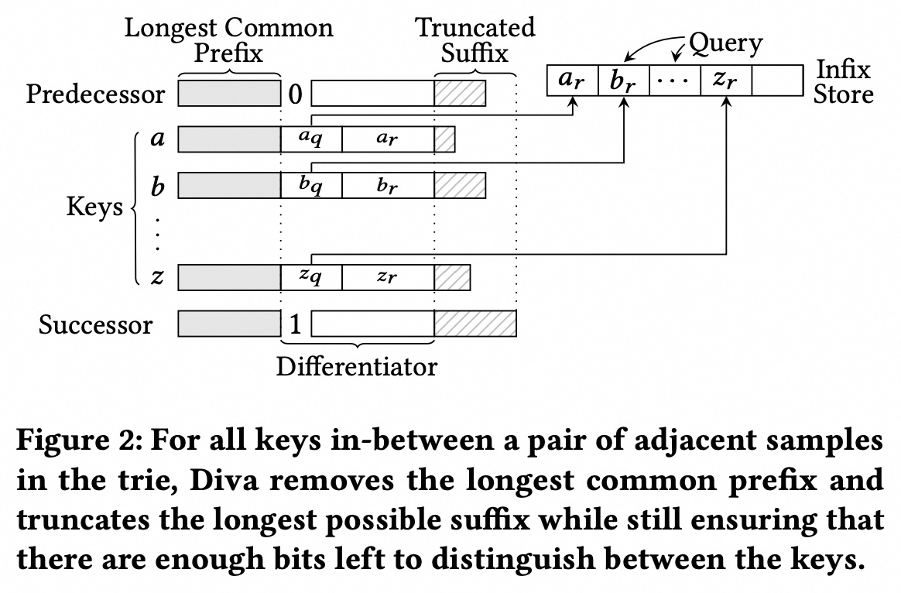
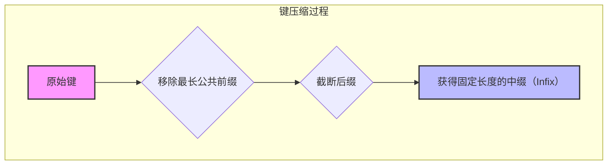
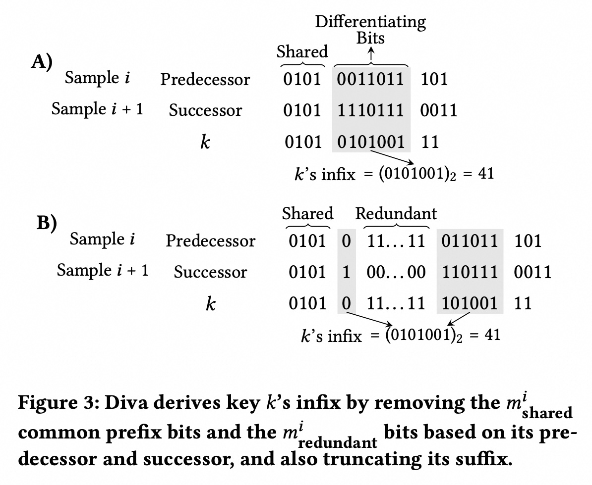
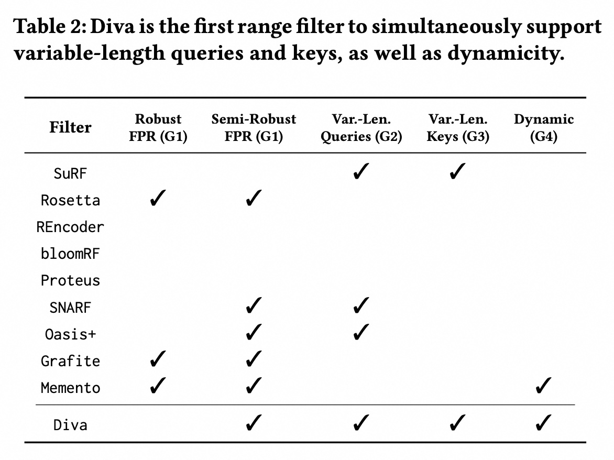
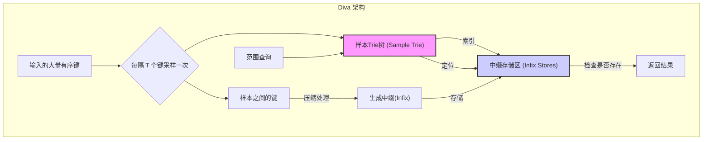
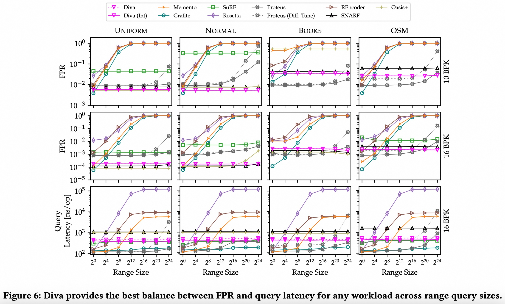
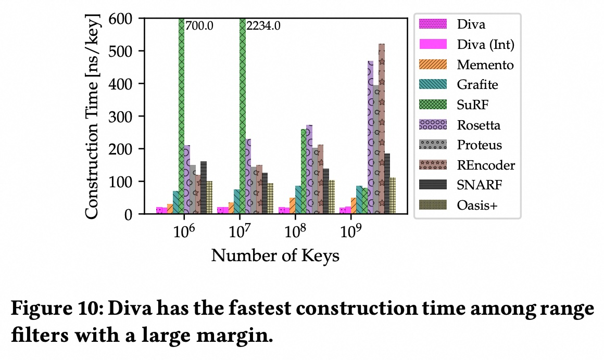
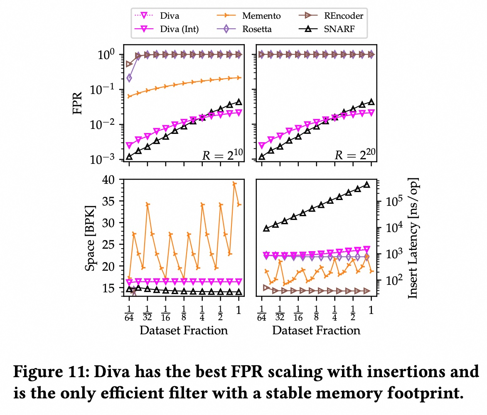
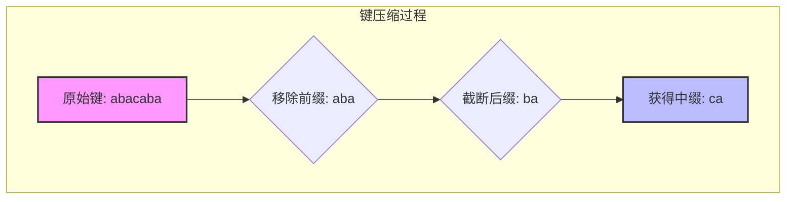

## AI论文解读 | Diva: Dynamic Range Filter for Var-Length Keys and Queries
        
### 作者        
digoal        
        
### 日期        
2025-09-08       
        
### 标签        
PostgreSQL , PolarDB , DuckDB , AI , 论文解读        
        
----        
        
## 背景  
      
https://www.vldb.org/pvldb/vol18/p3923-eslami.pdf        
  
提示:          
```          
读懂《Diva: Dynamic Range Filter for Var-Length Keys and Queries》这篇论文需要提前掌握哪些基础知识, 请使用中文通熟易懂的讲解这些基础知识, 可以引用论文中的图、表或使用Markdown支持的图形(text,mermaid等)增加解释性. 
  
使用中文通熟易懂的解读《Diva: Dynamic Range Filter for Var-Length Keys and Queries》这篇论文, 其中的关键内容请着重讲解, 可以引用论文中的图、表或使用Markdown支持的图形(text,mermaid等)增加解释性. 
  
提取《Diva: Dynamic Range Filter for Var-Length Keys and Queries》这篇论文中的重要术语, 使用中文对这些术语进行通熟易懂的讲解, 可以引用论文中的图、表或使用Markdown支持的图形(text,mermaid等)增加解释性. 
```     
  
## 1 前置知识 
  
为了帮助您理解《Diva: Dynamic Range Filter for Var-Length Keys and Queries》这篇论文，我已阅读了您提供的论文内容。这篇论文提出了一种新的、高效的范围过滤器（Range Filter），旨在解决现有过滤器在可变长度键、动态操作和性能方面所面临的挑战。要读懂这篇论文，您需要提前掌握以下几个核心基础知识。

-----

### 1\. 过滤器（Filter）与布隆过滤器（Bloom Filter）

首先，您需要理解什么是“过滤器”（Filter）。在计算机科学中，过滤器是一种**内存高效的概率数据结构** 。它能快速回答一个查询键是否可能存在于一个给定的数据集中 。

  * **优点**：过滤器非常紧凑，可以放入比它所代表的完整数据集更高的内存层级（例如CPU缓存），从而实现快速查询 。
  * **特性**：过滤器永远不会产生**假阴性**（False Negative），即如果一个键确实存在于数据集中，过滤器一定会给出肯定的回答 。但是，它可能会产生**假阳性**（False Positive），即对于一个不存在的键，过滤器可能会错误地回答“存在” 。这个发生假阳性的概率被称为**假阳性率（FPR）**，它取决于过滤器的内存占用 。

**布隆过滤器**是过滤器的一种常见类型。它通过将键哈希（hash）到一组位图中来工作。这篇论文中提到的许多现有范围过滤器，如`Rosetta`和`Proteus`，其核心就是布隆过滤器的变体 。了解布隆过滤器的工作原理（插入、查询、删除的局限性）将有助于您理解为什么现有过滤器难以支持动态操作（如删除或扩展）。

### 2\. 范围过滤器（Range Filter）

范围过滤器是过滤器的延伸，其查询形式更复杂。它接受一个由两个键 **$q\_{l}$** 和 **$q\_{r}$** 定义的范围 **$q=[q\_{l}, q\_{r}]$** ，并判断该范围内是否至少包含一个来自数据集的键 。

论文提到，现有的范围过滤器通常存在至少一个缺点：无法提供可靠的假阳性率（FPR）保证、不支持可变长度的键和查询、不支持插入/删除等动态操作 。理解这些局限性是理解Diva为什么创新的关键。

### 3\. 数据结构：前缀树（Trie）

前缀树，又称**Trie**，是一种用于高效存储和检索字符串的数据结构。Diva论文的核心创新之一就是使用了**前缀树**来**学习数据集的分布** 。

  * **工作原理**：Diva每隔`T`个键就抽取一个键作为**样本**，并将其存储在前缀树中 。
  * **作用**：前缀树的结构能够反映键的分布。相邻样本在字典序上越接近，说明它们对应的键空间区域越**密集**；反之，则越**稀疏** 。这使得Diva可以根据不同的区域密度来采用不同的编码策略，从而在内存占用和过滤精度之间找到平衡 。

论文中还提到了Diva使用了**y-Fast trie**，这是一种优化的前缀树，可以实现`O(logL)`（L为键的平均长度）的快速前驱（predecessor）和后继（successor）查询，从而加速了查询操作 。

-----

### 4\. 论文核心概念：Infix（中缀）

**Infix（中缀）是Diva论文中的一个独有概念，理解它至关重要。Diva对前缀树中每两个相邻样本之间的键进行压缩 。它首先移除这些键的最长公共前缀**，因为这些信息已经由前缀树本身隐含 。然后，它会截断键的**后缀**，只保留中间足够区分这些键的位序列，这个位序列就称为**中缀**（Infix）。

这篇论文的图2很好地解释了这个过程：   



通过这种方式，Diva将可变长度的键转化为固定长度的中缀，从而实现了对可变长度键的支持 。在查询时，Diva会遍历前缀树并检查目标查询范围内的中缀是否包含在内，以判断是否存在键 。

### 5\. 其他相关概念

  * **LSM-Tree（Log-Structured Merge-Tree）**：论文中多次提到LSM-Tree，它是一种在数据库中常用的索引结构，尤其适用于写密集型场景 。范围过滤器常用于LSM-Tree中，以避免不必要的磁盘I/O 。了解LSM-Tree的基本工作原理将有助于您理解Diva的应用场景。
  * **Well-behaved distribution（良好分布）**：论文指出，Diva的假阳性率（FPR）保证适用于“良好分布”的数据集 。这些分布通常是实际应用中常见的平滑分布，如正态分布、泊松分布等 。
  * **BPK（Bits Per Key）**：衡量每个键所占用的比特数，用于评估过滤器的内存效率 。论文中的图3对此进行了详细比较 。   
  * **Cache Misses（缓存未命中）**：当CPU需要的数据不在其高速缓存（Cache）中时，就会发生缓存未命中，需要从较慢的内存或磁盘中读取数据 。Diva的设计考虑了缓存局部性（cache locality），以减少缓存未命中，从而提高性能 。了解这一概念有助于您理解论文中性能分析的部分。
  
## 2 解读论文 
  
好的，我们来通俗易懂地解读一下这篇技术论文《Diva: Dynamic Range Filter for Var-Length Keys and Queries》。

### 论文一句话总结

**Diva** 是一种全新的、高性能的**范围过滤器（Range Filter）**，它首次同时解决了现有技术面临的六大挑战，能够高效处理任意长度的查询范围和可变长度的键（比如字符串），并且完全支持动态的数据插入和删除，是目前功能最全面的通用范围过滤器。

-----

### 1\. 什么是范围过滤器？为什么我们需要它？

想象一下你在一个巨大的数据库里查询“所有年龄在25到30岁之间的用户”。数据库为了找到这些用户，可能需要扫描大量存储在硬盘上的数据，这个过程非常慢。

**范围过滤器**就像一个“数据地图”或“内容摘要”，它体积很小，可以放在内存里。在访问硬盘之前，数据库会先问这个过滤器：“嘿，硬盘上那个文件里，有没有年龄在25到30岁之间的用户？” 。

  * 如果过滤器说“**绝对没有**”，那数据库就省事了，根本不用去读那个硬盘文件 。
  * 如果过滤器说“**可能有**”，那数据库再去访问硬盘确认一下。

这种过滤器允许“误报”（False Positive，即它说“可能有”，但其实没有），但绝不允许“漏报”（False Negative，即它说“没有”，但其实有）。通过避免大量不必要的硬盘读写，过滤器极大地提升了查询性能。

### 2\. 现有范围过滤器有什么问题？

在Diva出现之前，所有的范围过滤器都或多或少存在“硬伤”。一个理想的范围过滤器应该同时满足以下六个目标（论文中称为 G1-G6）：

1.  **(G1) 低误报率 (FPR)**：在有限的内存下，误报率越低越好。
2.  **(G2) 支持任意长度的查询范围**：能处理 `[1, 100]` 也能处理 `[1, 1000000]`。
3.  **(G3) 支持可变长度的键**：不仅能处理数字，还能处理像 "apple" 和 "banana" 这样长度不同的字符串。
4.  **(G4) 动态性**：支持随时插入新数据、删除旧数据。
5.  **(G5) 查询速度快**。
6.  **(G6) 构建速度快**。

论文中的 **表2** 非常清晰地展示了，在Diva之前，没有任何一个过滤器能同时满足所有这些，特别是 **(G3) 可变长度键** 和 **(G4) 动态性** 这两点，几乎是所有高性能过滤器的“死穴” 。

| Filter | 支持任意范围查询 (G2) | 支持可变长度键 (G3) | 支持动态更新 (G4) |
| :--- | :---: | :---: | :---: |
| SURF | ✓ | ✓ | ✗ |
| Rosetta | ✗ | ✗ | ✗ |
| SNARF | ✓ | ✗ | ✗ |
| Memento | ✗ | ✗ | ✓ |
| **Diva** | **✓** | **✓** | **✓** |

    

（根据论文 表2 简化）

### 3\. Diva的核心思想：“采样学习 + 中缀压缩”

Diva的设计非常巧妙，它的核心策略可以概括为：**用少量样本学习数据的大致分布，然后极度压缩样本之间的数据**。

它主要由两部分组成：**样本Trie树（Sample Trie）** 和 **中缀存储区（Infix Stores）**。

我们可以用下面的架构图来理解：



#### 关键机制一：样本Trie树 - 数据的“骨架地图”

Diva首先会从排好序的数据中，每隔 `T` 个键（例如，每隔1024个）就抽取一个作为“样本” 。然后，它把这些样本存入一个叫做 **Trie树**（一种高效的树状数据结构）中。

这棵Trie树就像是整个数据集的“骨架”或“地图索引”。

  * 如果数据分布密集，样本之间的值会很接近。
  * 如果数据分布稀疏，样本之间的值会相距很远。

通过这种方式，Diva“学习”到了数据的整体分布情况 。

#### 关键机制二：中缀（Infix）- 数据的“极致压缩”

对于落在两个样本之间的所有键，Diva会进行一次非常聪明的压缩，生成一个固定长度的“**中缀（Infix）**”。这个过程如论文中的 **图2** 所示 ：

  

来源：论文 Figure 2 

1.  **移除最长公共前缀 (Longest Common Prefix)**：位于两个相邻样本（比如 "sample\_1024" 和 "sample\_2048"）之间的所有键，它们开头的部分往往是相同的。这部分信息可以从样本中推断出来，所以直接丢掉，不用重复存储 。
2.  **截断后缀 (Truncated Suffix)**：键的末尾部分也被截断 。
3.  **保留中间部分**：只保留键中间的一段二进制位作为“中缀” 。这段中缀的长度是固定的，但它包含足够的信息来区分不同的键。

这个“中缀”技术是Diva能够 **支持可变长度键（G3）** 的关键。无论原始键是8个字节的数字还是256个字节的字符串，最终都被转换成一个短的、固定长度的中缀。

#### 关键机制三：中缀存储区（Infix Store）- 高效的“数据抽屉”

生成的中缀被存放在一个叫做 **Infix Store** 的紧凑数据结构中 。每个Infix Store负责管理两个样本之间的所有键的中缀。

它内部使用了**商余切分（Quotienting）**、位图（bitmaps）和 `rank/select` 等高级技术，使得查询一个中缀是否存在于其中的速度极快，几乎是常数时间 。这保证了Diva的**高查询性能（G5）**。

### 4\. Diva如何实现动态更新？

Diva的动态性（G4）是它超越许多前辈的另一大亮点。

  * **插入数据**：当一个新键插入时，Diva会计算出它的中缀，并将其添加到对应的Infix Store中。Infix Store在设计时就预留了一些空间来应对插入 。
  * **Store分裂**：如果一个Infix Store变得太满了，Diva会执行一个“分裂”操作：它会从这个Store中选择一个键，将它“提升”为一个新的样本并插入到Trie树中。原来的Infix Store就此一分为二，分别管理新样本前后的数据 。这个过程保证了过滤器能持续适应数据的增长和分布变化。
  * **删除数据**：删除则相反，移除中缀后，如果两个相邻的Infix Store变得过于稀疏，它们可能会被合并 。

这种自适应的“分裂-合并”机制，使得Diva在动态环境下依然能保持低误报率和高性能。

### 5\. Diva的性能到底有多强？

论文通过大量的实验证明了Diva的优越性。

  * **又快又稳**：在各种数据集和查询负载下，Diva在误报率和查询延迟之间取得了最佳的平衡。如 **图6** 所示，对于长范围查询，很多过滤器的误报率会飙升到接近100%，而Diva始终保持稳定 。   
  * **构建速度极快**：如 **图10** 所示，Diva的构建速度比最接近的对手还要快2.7倍以上，因为它主要进行顺序内存访问，并且极少使用昂贵的哈希计算 。   
  * **动态环境下的王者**：如 **图11** 所示，在持续插入新数据的场景下，其他过滤器的误报率要么急剧恶化，要么内存占用不稳定。而Diva的误报率和内存占用始终保持平稳，插入和删除性能也远超对手 。   
  * **端到端性能提升**：将Diva集成到真实的键值存储系统WiredTiger（MongoDB使用的存储引擎）中，查询性能提升了最多**三个数量级**（约1000倍），并且远超其他支持动态性的过滤器 。

### 结论

Diva通过创新的“**样本Trie树 + 中缀压缩存储**”架构，成功地解决了范围过滤器领域长期存在的多个核心挑战。它不仅在理论上是完备的，在实际测试中也表现出了全面的领先优势，是第一个真正意义上实现了**低误报率、支持任意范围和可变长度键、完全动态、查询和构建速度快**这六大目标的通用范围过滤器，为现代数据库和存储系统提供了一个强大的性能优化工具。
  
## 3 术语 
  
为了帮助您理解《Diva: Dynamic Range Filter for Var-Length Keys and Queries》这篇论文，我已提取并整理了其中的重要术语，并用通俗易懂的中文进行了解释。

-----

### 1\. 范围过滤器（Range Filter）

范围过滤器是一种紧凑、基于概率的数据结构，用于回答“给定一个查询范围 **$[q\_l, q\_r]$**，数据集中是否存在任何一个键落在这个范围内？”这样的问题。

  * **它的核心作用**：在不读取整个数据集的情况下，快速判断一个范围是否“可能”包含数据。这在数据库系统（如LSM-Tree）中尤其重要，可以避免不必要的磁盘I/O，从而大幅提升查询性能。
  * **它的特性**：和布隆过滤器一样，范围过滤器永不产生**假阴性**（False Negative），但可能会产生**假阳性**（False Positive）。

### 2\. 假阳性率（False Positive Rate, FPR）

**假阳性率**指的是，当一个查询范围实际为空时，过滤器却错误地报告“该范围包含数据”的概率。

  * **重要性**：FPR是衡量过滤器性能的关键指标。FPR越低，过滤器的精度越高，误报的查询越少，系统整体性能越好。Diva的创新之一是它能提供可保证的FPR。

### 3\. 可变长度键（Variable-Length Keys）

许多现有过滤器（如`Rosetta`和`Proteus`）的设计都假设键的长度是固定的。然而，在实际应用中，键的长度往往是变化的（例如，URL、文件名或UUID）。Diva正是为了解决这一挑战而设计的，它能够高效处理长度不一的键。

### 4\. 动态操作（Dynamic Operations）

在许多现代系统中，数据集是动态变化的，需要频繁进行键的**插入**（insert）和**删除**（delete）操作。Diva支持这些操作，使其比那些只能在静态数据集上工作的过滤器更加灵活和实用。

### 5\. 中缀（Infix）

这是Diva论文中独有的、也是最核心的概念之一。为了处理可变长度键并提高效率，Diva没有直接存储整个键，而是提取了键的 **“中缀”** 。

简单来说，Diva会执行以下两个步骤：

1.  **移除最长公共前缀**：Diva使用一个前缀树来存储键的样本。前缀树的结构本身就编码了键的前缀信息，因此可以移除键的共同前缀，节省空间。
2.  **截断后缀**：Diva只保留键的中间部分，即足够区分该键与相邻键的位序列，从而实现固定长度的表示。这个中间的位序列就被称为“中缀”。

论文中的图2形象地解释了这一过程：   



通过这种中缀表示，Diva将可变长度的键有效地压缩成固定长度的位序列，这使得后续的存储和查询变得更加高效。

### 6\. 前缀树（Trie）

Diva使用前缀树来学习数据集的分布。它通过每隔`T`个键就抽取一个键作为**样本**，并将其存储在前缀树中。

  * **作用**：前缀树的结构能够反映出键在字典序上的分布情况。例如，如果两个样本键在前缀树中非常接近，则意味着它们之间的键空间区域非常密集，反之则很稀疏。Diva正是利用这一信息，对不同密度的区域采用不同的编码策略，以达到最佳的内存效率。

### 7\. 位/键（Bits Per Key, BPK）

**BPK**是衡量过滤器内存效率的指标，表示存储一个键平均需要多少位（bits）。BPK越低，过滤器在相同数据集上的内存占用就越小。论文中的图3对此进行了详细比较，显示Diva在相同的FPR下，BPK显著低于现有方法。   

### 8\. 缓存未命中（Cache Misses）

现代计算机的CPU具有多级缓存（Cache），访问缓存的速度远快于主内存。如果CPU需要的数据不在缓存中，就会发生**缓存未命中**。Diva的设计旨在减少缓存未命中，因为它将前缀树存储在紧凑的内存中，使得在查询时能够最大程度地利用缓存，从而提升性能。
  
## 参考        
         
https://www.vldb.org/pvldb/vol18/p3923-eslami.pdf    
        
<b> 以上内容基于DeepSeek、Qwen、Gemini及诸多AI生成, 轻微人工调整, 感谢杭州深度求索人工智能、阿里云、Google等公司. </b>        
        
<b> AI 生成的内容请自行辨别正确性, 当然也多了些许踩坑的乐趣, 毕竟冒险是每个男人的天性.  </b>        
    
#### [期望 PostgreSQL|开源PolarDB 增加什么功能?](https://github.com/digoal/blog/issues/76 "269ac3d1c492e938c0191101c7238216")
  
  
#### [PolarDB 开源数据库](https://openpolardb.com/home "57258f76c37864c6e6d23383d05714ea")
  
  
#### [PolarDB 学习图谱](https://www.aliyun.com/database/openpolardb/activity "8642f60e04ed0c814bf9cb9677976bd4")
  
  
#### [PostgreSQL 解决方案集合](../201706/20170601_02.md "40cff096e9ed7122c512b35d8561d9c8")
  
  
#### [德哥 / digoal's Github - 公益是一辈子的事.](https://github.com/digoal/blog/blob/master/README.md "22709685feb7cab07d30f30387f0a9ae")
  
  
#### [About 德哥](https://github.com/digoal/blog/blob/master/me/readme.md "a37735981e7704886ffd590565582dd0")
  
  

  
