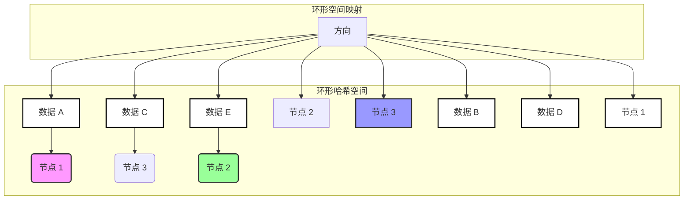
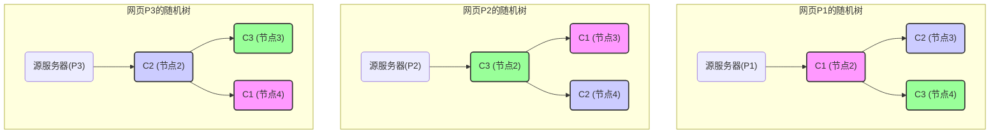
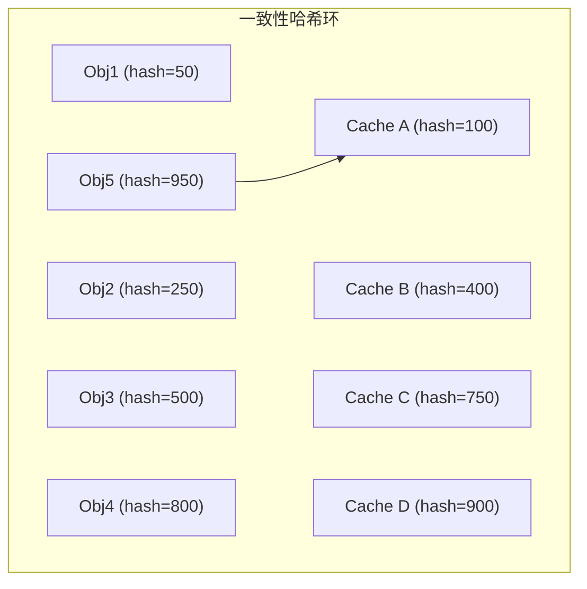
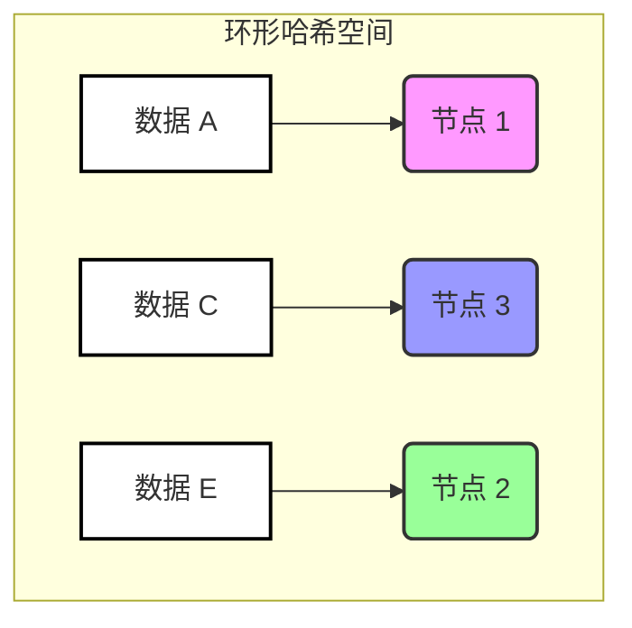

## AI论文解读 | Consistent Hashing and Random Trees: Distributed Caching Protocols for Relieving Hot Spots on the World Wide Web
        
### 作者        
digoal        
        
### 日期        
2025-09-09       
        
### 标签        
PostgreSQL , PolarDB , DuckDB , AI , 论文解读        
        
----        
        
## 背景  
      
https://dl.acm.org/doi/pdf/10.1145/258533.258660        
  
提示:          
```          
读懂《Consistent Hashing and Random Trees: Distributed Caching Protocols for Relieving Hot Spots on the World Wide Web》这篇论文需要提前掌握哪些基础知识, 请使用中文通熟易懂的讲解这些基础知识, 可以引用论文中的图、表或使用Markdown支持的图形(text,mermaid等)增加解释性. 
  
使用中文通熟易懂的解读《Consistent Hashing and Random Trees: Distributed Caching Protocols for Relieving Hot Spots on the World Wide Web》这篇论文, 其中的关键内容请着重讲解, 可以引用论文中的图、表或使用Markdown支持的图形(text,mermaid等)增加解释性. 
  
提取《Consistent Hashing and Random Trees: Distributed Caching Protocols for Relieving Hot Spots on the World Wide Web》这篇论文中的重要术语, 使用中文对这些术语进行通熟易懂的讲解, 可以引用论文中的图、表或使用Markdown支持的图形(text,mermaid等)增加解释性. 
```     
  
## 1 前置知识 
  
您好，我已经仔细阅读了您上传的论文。要理解这篇名为《Consistent Hashing and Random Trees: Distributed Caching Protocols for Relieving Hot Spots on the World Wide Web》的论文，您需要掌握以下几个核心基础知识。

### 1\. 热点问题（Hot Spots）

-----

在分布式系统中，“热点”是指当大量客户端同时请求访问某个特定数据或服务器时，导致该服务器或数据流量过载的现象 。这就像大家同时涌向一个热门网站查看突发新闻，导致网站因无法处理所有请求而瘫痪一样 。论文中提到，解决热点问题的一个常见方法是**数据复制（Replication）**，即将热门数据在多个服务器上进行备份，从而将负载分散到多个服务器上 。

### 2\. 分布式缓存（Distributed Caching）

-----

分布式缓存是一种将数据存储在多个机器上以提高性能和可用性的系统 。它通常位于客户端和原始服务器之间，用于存储经常访问的数据的副本 。当客户端需要数据时，首先会向缓存发送请求。如果缓存中有该数据的副本，就直接返回给客户端，而无需访问原始服务器 。这种方式可以显著减轻原始服务器的压力。

### 3\. 一致性哈希（Consistent Hashing）

-----

这是论文的核心思想之一。传统的哈希（例如，取模哈希）在缓存节点（服务器）数量发生变化时，会导致几乎所有缓存的数据都需要重新映射和迁移 。

**一致性哈希**解决了这个问题。它是一种特殊的哈希函数，当哈希函数的范围（即缓存节点集合）发生变化时，它只会引起**最小程度的变化** 。

我们可以用一个简单的比喻来理解它：
想象一个圆环，哈希值的范围从0到最大值顺时针排列。我们将缓存节点（服务器）和数据（例如，网页）都通过哈希函数映射到这个圆环上的一个点。

  * **缓存节点的映射**：将每个缓存节点的哈希值计算出来，并放置在圆环上。
  * **数据的映射**：将每个数据的哈希值计算出来，并放置在圆环上。

**映射规则：**
要找到一个数据应该由哪个缓存节点负责，我们从数据在圆环上的位置开始，沿顺时针方向查找，遇到的第一个缓存节点就是负责存储该数据的节点。

#### 示例图示（使用 Markdown Mermaid 图形）：



**为什么它很“一致”？**
假设现在节点2（`Node 2`）出现故障下线了。

  * 传统哈希：所有数据都需要重新哈希，导致大规模的数据迁移。
  * 一致性哈希：只有原本应该由节点2负责的数据需要重新映射。根据顺时针查找原则，这些数据现在会由节点3（`Node 3`）负责。对于其他数据，它们的负责节点没有改变。

这种方式极大地减少了节点增删时的数据迁移量，使系统更加稳定和可扩展 。

### 4\. 随机树（Random Trees）

-----

这是论文中提出的另一个工具，用于构建缓存协议。论文的作者借鉴了前人的“缓存树”（tree of caches）思想 。

  * **基本思想**：为每一个网页（或数据）生成一个**不同的、随机的树状结构**。
  * **如何工作**：当客户端请求一个网页时，该请求会沿着这个随机树从叶子节点逐级向上发送，直到找到一个拥有该网页副本的缓存节点，或者最终到达原始服务器（树的根节点） 。
  * **解决热点问题**：因为每个网页都有一个不同的树，所以热门网页的请求会通过其独特的树结构进行分散，避免了所有请求都集中到少数几个节点上，从而解决了热点问题 。

### 总结

-----

为了读懂这篇论文，您需要先理解以下知识点：

  * **热点问题**：分布式系统中因访问量过大而导致的性能瓶颈。
  * **分布式缓存**：通过在多个机器上存储数据副本以提高性能。
  * **哈希函数**：将数据映射到固定范围的函数。
  * **一致性哈希**：哈希函数的一种，在节点增删时能最小化数据迁移。
  * **随机树**：一种用于分发请求的树状结构，通过随机化来平衡负载。

论文的精髓就在于如何将**一致性哈希**和**随机树**这两个工具结合起来，构建一个既能解决热点问题，又能在互联网这种动态且不可靠的环境中高效运作的分布式缓存协议 。
  
## 2 解读论文 
  
好的，我们来一起深入解读这篇分布式系统领域的经典论文：《Consistent Hashing and Random Trees: Distributed Caching Protocols for Relieving Hot Spots on the World Wide Web》。

这篇论文在1997年发表，极具开创性。它提出的“一致性哈希” (Consistent Hashing) 思想，至今仍是构建大规模分布式系统的基石技术之一。

我将为你分解这篇论文的核心思想，力求通俗易懂。

### 核心摘要 (TL;DR)

这篇论文主要为了解决一个问题：**如何应对互联网上的“热点”现象**。所谓热点，就是某个网站或资源（比如一个热门视频、一篇头条新闻）在短时间内被海量用户集中访问，导致其源服务器不堪重负甚至崩溃的现象 。

为了解决这个问题，论文提出了一个由两大核心技术组成的分布式缓存协议：

1.  **随机树 (Random Trees)**：通过为每一个网页（数据对象）构建一棵不同的、随机的缓存服务器树，来分散请求压力，避免了传统缓存树中根节点成为新瓶颈的问题 。
2.  **一致性哈希 (Consistent Hashing)**：这是一种特殊的哈希算法。当缓存服务器集群发生变化（增加或减少服务器）时，它能保证只有极少数的数据需要重新映射，从而解决了传统哈希算法在服务器增删时导致大规模缓存失效的问题 。

简单来说，**随机树决定了请求的转发路径，而一致性哈希决定了树上的节点具体由哪台缓存服务器来承担**。两者结合，构建了一个高效、可扩展且容错的分布式缓存系统。

-----

### 第一部分：问题背景 —— 恼人的“热点”

想象一下，在没有高效缓存的年代，当一个网站，比如IBM的“深蓝”超级计算机与国际象棋世界冠军卡斯帕罗夫进行比赛时，全世界的目光都聚焦在这个网站上 。

```text
              大量用户 (Browsers)
                  │
                  │
                  │ (海量并发请求)
                  ▼
          ┌──────────────────┐
          │  单一的源服务器  │ (被压垮！)
          └──────────────────┘
```

结果就是服务器被流量“冲垮”(swamped)，大部分用户都无法访问，体验极差 。

**过去的解决方案及其缺陷：**

  * **共享代理缓存 (Proxy Cache)**：让一堆用户共享一个缓存服务器。但这治标不治本，如果用户量太大，这个缓存服务器自己就成了新的热点 。

  * **缓存树 (Tree of Caches)**：像Harvest Cache项目那样，将缓存组织成一棵树。用户的请求先到叶子节点，如果缓存未命中，就向父节点请求，层层向上直到根节点，最后才到源服务器 。这种方法能有效合并对同一个资源的重复请求 。 但它的**致命缺陷**是：对于所有不同的网页，都使用同一棵固定的树。这意味着树的根节点需要处理所有最终未命中的请求，导致根节点成为新的、巨大的性能瓶颈 。


-----

### 第二部分：关键技术一 —— 随机树 (Random Trees)

为了解决“缓存树”中根节点瓶颈的问题，论文提出了一个巧妙的改进：**为每个网页（Page）都生成一棵独一无二的、随机的树** 。

这意味着，服务器A可能是网页P1的根节点，但同时是网页P2的一个叶子节点。从宏观上看，所有缓存服务器承担的角色是均衡的，没有哪一台服务器会固定地处在“树根”这个高负载的位置上 。

**工作流程如下：**

1.  **为每个网页生成抽象树**：对于网页P，系统会生成一个逻辑上的d叉树，树的节点数量与缓存服务器数量相等 。
2.  **节点映射**：
      * 树的根节点固定映射到该网页的**源服务器** 。
      * 树的其他所有节点，通过一个哈希函数 `h(网页P, 节点编号)`，随机地映射到某一台**缓存服务器** (Cache) 。
3.  **用户请求**：
      * 当一个用户想访问网页P时，它会在这棵专属于P的树上，随机选择一条从叶子到根的路径 。
      * 然后，用户的浏览器将请求发送给该路径上处于最底端（叶子节点）的缓存服务器 。
4.  **请求在树上传递**：
      * 收到请求的缓存服务器，会检查自己是否已经缓存了网页P。
      * **如果已缓存**：直接返回给用户 。
      * **如果未缓存**：它会向路径上的**上一个节点**（它的父节点）发起请求 。这个过程会一直重复，直到某个节点有缓存，或者最终到达根节点（源服务器）。
      * **触发缓存**：论文还设计了一个阈值`q`。一个缓存节点只有在收到了`q`次对同一个网页的请求后，才会决定自己存储一份该网页的副本 。这避免了为冷门网页创建大量不必要的缓存副本。

**可视化理解：**

使用Mermaid图来展示这个概念。假设我们有3台缓存服务器 C1, C2, C3。



从上图可以看出，对于不同的网页（P1, P2, P3），缓存服务器C1, C2, C3扮演的角色完全不同。这就实现了负载的宏观均衡，从根本上解决了固定树根的瓶颈问题。

-----

### 第三部分：关键技术二 —— 一致性哈希 (Consistent Hashing)

随机树解决了负载均衡问题，但它依赖一个重要的组件：哈希函数 `h`。在真实的互联网环境中，缓存服务器会动态变化：有的会宕机下线，有的会新增上线。

**传统哈希算法的问题：**

假设我们使用一个简单的哈希算法，比如 `hash(对象) % N`，其中N是服务器的数量。

  * 开始有4台服务器 (N=4)。对象A通过哈希计算，被分配到 `hash(A) % 4 = 2` 号服务器。
  * 现在，增加一台服务器，总数变为5台 (N=5)。此时再计算对象A，它被分配到 `hash(A) % 5`，结果很可能不再是2号服务器了。

**当服务器数量N变化时，几乎所有对象的哈希值都会改变，这意味着整个缓存系统几乎全部失效，所有数据都需要重新缓存。** 这在大规模系统中是不可接受的“缓存雪崩” 。

**一致性哈希的解决方案：**

一致性哈希通过一个巧妙的设计，将这种“雪崩”效应降到了最低。

**核心思想：**

1.  **构造哈希环**：它将整个哈希值的空间想象成一个闭合的圆环。比如，一个`2^32`的哈希空间，就可以看作一个从0到`2^32-1`首尾相连的环。
2.  **服务器上环**：将每一台缓存服务器（比如根据其IP地址或机器名）进行哈希，得到一个哈希值，然后将它“放置”在这个环上。
3.  **对象上环**：将需要缓存的每一个数据对象（比如网页URL）也进行哈希，得到一个哈希值，同样将它“放置”在环上。
4.  **确定归属**：从数据对象在环上的位置开始，**顺时针**寻找，遇到的第一台服务器，就是这个对象应该被缓存的服务器。

**可视化理解：**



**一致性哈希的魔力在于服务器增删时的表现：**

  * **增加一台服务器 (Cache E)**：假设新增的Cache E哈希值在C和D之间。

      * **影响**：只有原本应该归属于D，但其哈希值落在C和E之间的对象（比如Obj4）需要被重新定位到E。其他所有对象的归属完全不变！
      * **结论**：只会影响到环上的一小段弧，实现了最小化的数据迁移。

  * **移除一台服务器 (Cache C)**：假设Cache C宕机了。

      * **影响**：原本归属于C的所有对象（比如Obj3），现在顺时针寻找，会找到下一台服务器D。它们会被重新定位到D。其他对象的归属也完全不变！
      * **结论**：影响范围被精确地控制在失效服务器所管辖的那一段弧上。

论文中还定义了一致性哈希的几个重要属性 ：

  * **平衡性 (Balance)**：对象能被均匀地分布到各个服务器上。
  * **单调性 (Monotonicity)**：当增加新服务器时，已存在的对象要么不动，要么从旧服务器迁移到新服务器，绝不会从一个旧服务器迁移到另一个旧服务器 。
  * **散布 (Spread)**：即使不同客户端对服务器列表的认知略有不同（“视图不一致”），同一个对象最终被映射到的服务器集合也很小 。
  * **负载 (Load)**：在各种不一致的视图下，一个服务器需要负责的对象总数不会太多 。

-----

### 第四部分：两大技术的完美结合

现在，我们可以把这两个强大的工具结合起来了。

在“随机树”协议中，需要一个哈希函数`h`来将抽象树的节点映射到物理的缓存服务器上。这里，**论文就用“一致性哈希”来作为这个函数`h`** 。

**这样做的好处是：**

整个分布式缓存系统现在不仅能通过随机树来均衡地处理高并发请求，还能通过一致性哈希来优雅地应对服务器的动态增删和网络中“视图不一致”的现实问题 。即使某些客户端看到的服务器列表和另一些客户端不同，或者有服务器宕机，系统也能保持高度的可用性和稳定性。

### 总结与深远影响

《Consistent Hashing and Random Trees》这篇论文提出了一个理论完备且高度实用的分布式缓存架构。

  * **随机树**解决了请求的宏观负载均衡问题。
  * **一致性哈希**解决了系统在动态变化环境下的稳定性和数据扰动问题。

尤其是**一致性哈希**，它的思想已经远远超出了Web缓存的范畴，成为现代分布式系统的标准组件之一，被广泛应用于：

  * **分布式数据库/键值存储**：如 Amazon DynamoDB, Apache Cassandra, Riak等，用于决定数据分片（Shard）存储在哪台节点上。
  * **内容分发网络 (CDN)**：用于将用户请求路由到最近或负载最低的边缘节点。
  * **分布式消息队列**：用于分发消息到不同的消费者分区。

可以说，这篇20多年前的论文，为我们今天构建高可用、高可扩展的互联网服务打下了坚实的基础。
  
## 3 术语 
  
您好，我已经阅读了您上传的论文，并为您提取并解释了其中的几个关键术语。为了方便理解，我将用通俗易懂的方式为您讲解，并配上图示。

-----

### 1\. 一致性哈希（Consistent Hashing）

**核心概念**：这篇论文最核心的贡献之一。简单来说，它是一种特殊的哈希函数，当分布式系统中的服务器数量发生变化时（比如增加或减少服务器），**只需要重新映射极少一部分的数据**，而不是像传统哈希那样需要重新映射绝大多数数据。

**为什么重要**：在大型分布式缓存系统中，服务器可能会因为故障而下线，也可能因为负载增加而扩容。如果每次服务器数量变动都导致所有缓存数据失效，那么系统将变得非常不稳定和低效。一致性哈希解决了这个问题，使得系统具有更好的**可扩展性（Scalability）和稳定性**。

**工作原理**：
想象一个环形的哈希空间，哈希值从0到最大值顺时针排列。数据（例如一个网页的URL）和服务器（缓存节点）都会被哈希到这个环上的某个点。

  * **数据如何找到服务器**：要确定一个数据应该由哪个服务器负责存储，从数据在环上的哈希点开始，沿顺时针方向找到遇到的第一个服务器，该服务器就是它的存储位置。

  * **服务器增删的影响**：

      * **增加服务器**：新服务器会分担其逆时针方向上第一个服务器的部分数据，只有这部分数据需要迁移。
      * **移除服务器**：该服务器所负责的数据会顺时针移动到下一个服务器上，也只有这部分数据需要迁移。

#### 示例图示（使用 Markdown Mermaid）：



上图中的圆环代表哈希空间，B、D、F代表服务器节点，A、C、E代表数据。根据顺时针查找规则，数据A由节点1负责，数据E由节点2负责，数据C由节点3负责。如果节点2下线，那么数据E将由节点3负责，而其他数据的位置保持不变。

-----

### 2\. 随机树（Random Trees）

**核心概念**：一种用于缓解热点的、去中心化的请求路由机制。论文提出，为每个可能被访问的数据（如网页）动态地生成一个**随机的树状结构**。

**为什么重要**：传统的缓存协议可能导致热门数据的所有请求都集中在少数几个服务器上，形成**热点（Hot Spots）**。通过为每个数据生成独特的随机树，可以使得对同一个热门数据的请求通过不同的路径分发到不同的缓存节点，从而有效地分散负载。

**工作原理**：

  * **路由请求**：当一个客户端想要获取一个网页时，该请求会沿着该网页对应的随机树结构向上发送，直到找到一个拥有该网页副本的缓存，或者最终到达原始服务器。
  * **去中心化**：每个节点只需要知道其在树中的父节点即可，不需要了解整个网络的完整信息，这使得该协议非常适合大规模、动态的网络环境，如互联网。

-----

### 3\. 热点（Hot Spot）

**核心概念**：在分布式系统中，指当一个特定的数据或服务器被**大量客户端同时请求**，导致该数据或服务器因无法承受高负载而成为系统瓶颈的现象。这就像一个热门视频被所有人同时点击，导致托管它的服务器崩溃。

**论文中的解决**：这篇论文的主要目标就是通过其提出的**一致性哈希**和**随机树**协议来缓解和消除网络中的热点问题。

-----

### 4\. 分布式缓存协议（Distributed Caching Protocol）

**核心概念**：定义了在分布式网络中，多个缓存服务器如何协同工作来存储和检索数据的一套规则。

**论文中的协议特点**：
这篇论文的协议具有以下特点：

  * **基于局部控制**：每个服务器只需要根据本地信息做出决策，不需要了解整个网络的全局状态。
  * **高效利用资源**：通过动态缓存数据，可以减少对原始服务器的请求，节省带宽。
  * **可伸缩性**：得益于一致性哈希，当服务器数量增减时，协议可以优雅地扩展或收缩。

这些术语共同构成了论文的核心思想，即通过一种创新的哈希方法和请求路由机制，构建一个高效、可扩展且能有效缓解网络热点的分布式缓存系统。
  
## 参考        
         
https://dl.acm.org/doi/pdf/10.1145/258533.258660    
        
<b> 以上内容基于DeepSeek、Qwen、Gemini及诸多AI生成, 轻微人工调整, 感谢杭州深度求索人工智能、阿里云、Google等公司. </b>        
        
<b> AI 生成的内容请自行辨别正确性, 当然也多了些许踩坑的乐趣, 毕竟冒险是每个男人的天性.  </b>        
    
#### [期望 PostgreSQL|开源PolarDB 增加什么功能?](https://github.com/digoal/blog/issues/76 "269ac3d1c492e938c0191101c7238216")
  
  
#### [PolarDB 开源数据库](https://openpolardb.com/home "57258f76c37864c6e6d23383d05714ea")
  
  
#### [PolarDB 学习图谱](https://www.aliyun.com/database/openpolardb/activity "8642f60e04ed0c814bf9cb9677976bd4")
  
  
#### [PostgreSQL 解决方案集合](../201706/20170601_02.md "40cff096e9ed7122c512b35d8561d9c8")
  
  
#### [德哥 / digoal's Github - 公益是一辈子的事.](https://github.com/digoal/blog/blob/master/README.md "22709685feb7cab07d30f30387f0a9ae")
  
  
#### [About 德哥](https://github.com/digoal/blog/blob/master/me/readme.md "a37735981e7704886ffd590565582dd0")
  
  

  
