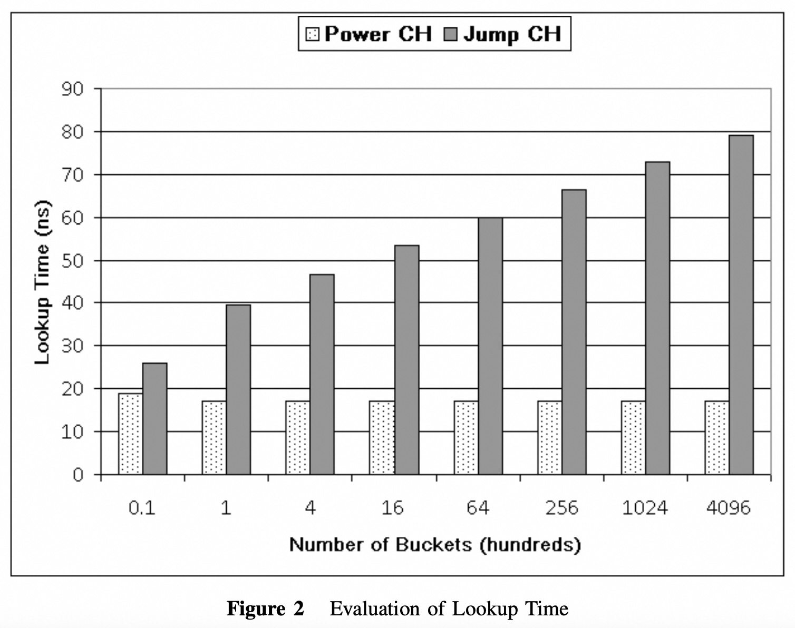
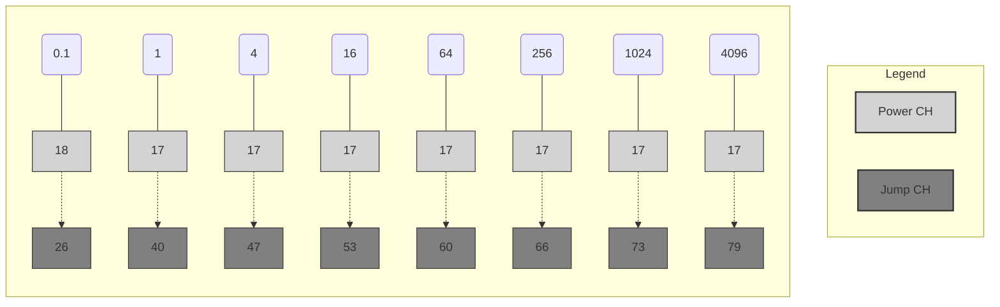
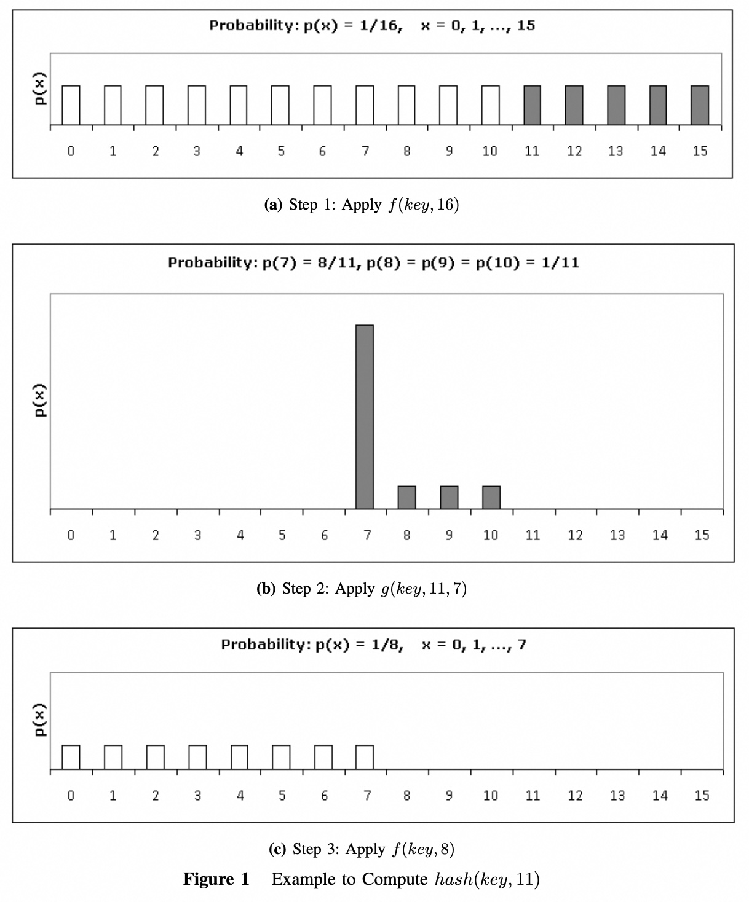
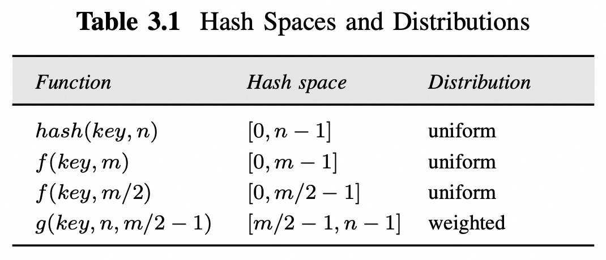
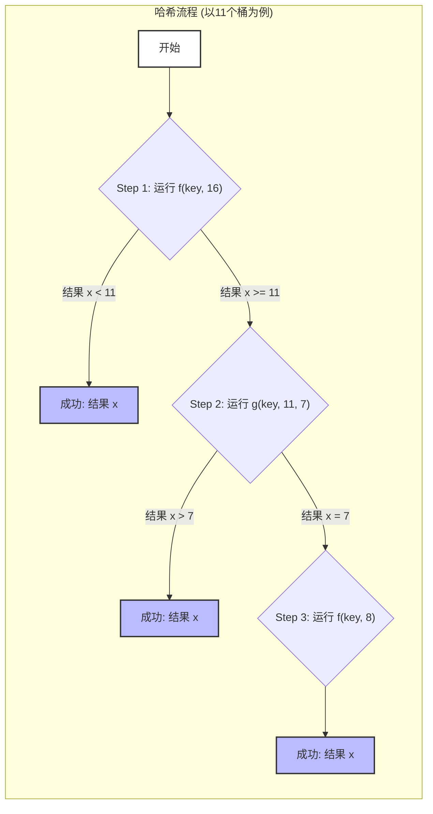

## AI论文解读 | Fast Consistent Hashing in Constant Time
        
### 作者        
digoal        
        
### 日期        
2025-09-09       
        
### 标签        
PostgreSQL , PolarDB , DuckDB , AI , 论文解读        
        
----        
        
## 背景  
      
https://arxiv.org/pdf/2307.12448        
  
提示:          
```          
读懂《Fast Consistent Hashing in Constant Time》这篇论文需要提前掌握哪些基础知识, 请使用中文通熟易懂的讲解这些基础知识, 可以引用论文中的图、表或使用Markdown支持的图形(text,mermaid等)增加解释性. 
  
使用中文通熟易懂的解读《Fast Consistent Hashing in Constant Time》这篇论文, 其中的关键内容请着重讲解, 可以引用论文中的图、表或使用Markdown支持的图形(text,mermaid等)增加解释性. 
  
提取《Fast Consistent Hashing in Constant Time》这篇论文中的重要术语, 使用中文对这些术语进行通熟易懂的讲解, 可以引用论文中的图、表或使用Markdown支持的图形(text,mermaid等)增加解释性. 
```     
  
## 1 前置知识 
  
好的，为了更好地理解《Fast Consistent Hashing in Constant Time》这篇论文，你需要掌握以下几个核心概念，我会用通俗易懂的中文进行解释。

-----

### 1\. 什么是哈希（Hashing）？

哈希，也叫散列，是一种将任意长度的输入（比如一串文字、一个文件）通过一个哈希函数转换成固定长度输出（通常是一个数字）的过程。这个输出就是**哈希值**。

**普通哈希（Ordinary Hashing）**
最简单的哈希方法就是取模运算。例如，你有10个“桶”（可以理解为10个存储节点或服务器），你想把一个“键”（key）分配到其中一个桶里。你可以用以下公式：
$$x = key \mod n$$
其中：

  * $x$ 是分配到的桶的编号。
  * $key$ 是你的输入。
  * $n$ 是桶的数量。

这个方法的优点是计算非常快，只需要 $O(1)$ 时间（常数时间）。但它的主要缺点是，当桶的数量 $n$ 发生变化时（比如增加或减少一个服务器），几乎所有的键都需要重新计算哈希值，导致数据需要大规模地重新分配，这会给系统带来很大的开销和中断 。

### 2\. 什么是哈希一致性（Consistent Hashing）？

哈希一致性是用来解决普通哈希的缺点的。它的核心思想是：当桶的数量发生变化时，**只重新映射（remap）一小部分键**，而不是所有键 。

这篇论文中提到了哈希一致性的两个核心要求：

  * **均衡性（Balance）**: 键能均匀地分布在所有桶里 。
  * **单调性（Monotonicity）**: 当桶的数量改变时，键的重新映射要尽可能少 。

想象一下，你有一堆书（键），你想把它们放进几个书架（桶）里。

  * **普通哈希**就像是，如果你买了一个新书架，你需要把几乎所有书都拿出来，重新分配到所有书架上。
  * **哈希一致性**就像是，如果你买了一个新书架，你只需要从一个或两个旧书架上移动一些书到新书架上，大部分书都还在原来的位置。

这篇论文提出的 **Power Consistent Hash** 算法就满足了这两个要求 。

### 3\. 时间复杂度（Time Complexity）和空间复杂度（Space Complexity）

这是衡量算法效率的两个重要指标。

  * **时间复杂度（$O(T)$）**: 衡量算法运行时间随输入规模增长的趋势。
      * $O(1)$（常数时间）: 无论输入多大，算法运行时间都基本不变。这是最快的。
      * $O(\\log\~n)$（对数时间）: 随着输入规模 $n$ 的增大，运行时间缓慢增长。
  * **空间复杂度（$O(S)$）**: 衡量算法所需内存空间随输入规模增长的趋势。
      * $O(1)$（常数空间）: 无论输入多大，所需内存都基本不变。这是最省空间的。
      * $O(n)$（线性空间）: 随着输入规模 $n$ 的增大，所需内存呈线性增长。

该论文提出的算法，在查找一个键对应的桶时，时间复杂度为 **$O(1)$**，空间复杂度也为 **$O(1)$** 。这比其他一些哈希一致性算法（如Jump Consistent Hash）的 $O(\\log\~n)$ 查找时间要快得多 。

下面这张图（来自论文图2）直观地展示了这一点：

  



**图：查找时间对比**

  * **Power CH** (浅色柱): 查找时间几乎是平的，不随桶的数量增加而变化，符合 $O(1)$ 的特点 。
  * **Jump CH** (深色柱): 查找时间随着桶的数量增加而增长，符合 $O(\\ln\~n)$ 的特点 。
  * 这个图清晰地表明了 Power CH 在速度和可扩展性上的巨大优势 。

### 4\. 辅助哈希函数 f() 和 g()

这篇论文中提出的算法巧妙地使用了两个辅助哈希函数：**$f()$** 和 **$g()$** 。

  * **$f(key, m)$**: 这是一个基础的哈希函数，它将一个键 $key$ 映射到一个大小为 $m$ 的哈希空间，其中 $m$ 必须是2的幂。它的特点是能将键**均匀**地分布在哈希空间 $[0, m-1]$ 内 。
  * **$g(key, n, s)$**: 这是一个特殊的哈希函数，它将键映射到哈希空间 $[s, n-1]$，但不是均匀分布，而是遵循**加权概率分布** 。

论文的核心思想就是通过结合这两个函数，实现了在 $O(1)$ 时间内，既能保持键的均匀分布，又能满足哈希一致性的要求 。

### 5\. 论文中的示例流程（以 n=11 个桶为例）

为了理解 $f()$ 和 $g()$ 是如何协同工作的，我们来看看论文中提供的例子，目标是将键映射到 $[0, 10]$ 这11个桶里 。

**第一步：应用 $f(key, 16)$**

  * 首先，找到一个最小的2的幂 $m$，使得 $m \\ge n$。这里 $n=11$，所以 $m=16$。
  * 调用 $f(key, 16)$ 将键映射到哈希空间 $[0, 15]$。
  * 如果结果 $x$ 在 $[0, 10]$ 范围内，哈希完成，直接返回结果 。这步成功的概率是 $11/16$ 。
  * 如果结果 $x$ 在 $[11, 15]$ 范围内，说明这次映射失败了，需要进入下一步 。

**第二步：应用 $g(key, 11, 7)$**

  * 如果第一步失败了，需要重新映射。论文使用 $g(key, 11, 7)$ 来处理这部分键，将它们映射到 $[7, 10]$ 范围 。
  * 这个映射是**加权概率**的，其中7被选中的概率是 $8/11$，而8、9、10被选中的概率都是 $1/11$ 。
  * 如果结果 $x$ 在 $[8, 10]$ 范围内，哈希完成，返回结果 。
  * 如果结果是7，需要进入第三步 。

**第三步：应用 $f(key, 8)$**

  * 如果第二步的结果是7，则应用 $f(key, 8)$ 将键映射到哈希空间 $[0, 7]$ 。
  * 因为 $f()$ 是均匀分布的，所以这步会将键均匀地映射到 $[0, 7]$ 中的某个值。

通过这三个步骤的巧妙组合，论文保证了所有键最终都能**均匀地**映射到 $[0, 10]$ 这11个桶里 。这种设计避免了使用复杂的数据结构来存储桶的范围，因此实现了 $O(1)$ 的时间和空间复杂度 。
  
## 2 解读论文 
  
好的，我们来一起通俗易懂地解读这篇名为《Fast Consistent Hashing in Constant Time》（在常数时间内实现快速一致性哈希）的论文。

这篇论文的核心是提出了一种名为 **幂一致性哈希 (Power Consistent Hash, 简称 Power CH)** 的新型一致性哈希算法。它的最大亮点是，无论有多少个存储节点（桶），查找一个键（key）应该被放到哪个节点上，其预期的计算时间都是一个固定的常数，即 $O(1)$ 复杂度。这比许多知名的一致性哈希算法（如环形哈希、Jump Consistent Hash）在节点数量增多时查找速度会变慢（如 $O(log\~n)$ 复杂度）的情况要快得多，扩展性也更强 。

-----

### 1\. 为何需要一致性哈希？

在解读这个新算法之前，我们先快速回顾一下为什么需要一致性哈希。

想象一下你有一个分布式缓存系统，有3台服务器（我们称之为桶/bucket）。你使用一个简单的哈希算法，比如 `hash(key) % 3`，来决定某个数据（key）应该存到哪台服务器上。

  - `hash("userA") % 3 = 0` -\> 存到服务器0
  - `hash("userB") % 3 = 1` -\> 存到服务器1
  - `hash("userC") % 3 = 2` -\> 存到服务器2

这个方案在服务器数量固定时运行良好。但问题是，如果增加一台服务器，总数变成4台，那么算法就变成了 `hash(key) % 4`。你会发现，几乎所有之前计算的哈希值都变了：

  - `hash("userA") % 4` 可能不再是0
  - `hash("userB") % 4` 可能不再是1

这意味着几乎所有的数据都需要重新计算哈希并从旧的服务器迁移到新的服务器上。这种大规模的数据迁移是昂贵且影响系统稳定性的 。

**一致性哈希 (Consistent Hashing)** 就是为了解决这个问题而生的。它的核心目标是：当服务器数量发生变化时，只迁移最少量的数据，而绝大部分数据的映射保持不变 。

-----

### 2\. Power CH 算法的核心思想

传统的很多一致性哈希算法，为了维护节点信息，需要构建一个数据结构（比如一个环或一棵树）来存储节点范围，查找时需要在这个结构上进行搜索，因此带来了 $O(log\~n)$ 的时间和 $O(n)$ 的空间开销 。

Power CH 算法独辟蹊径，它**不构建任何外部数据结构**，而是纯粹通过数学计算来实时得出哈希值 。它巧妙地运用了两个辅助哈希函数，我们称之为 `f()` 和 `g()`，来实现三大目标 ：

1.  **均匀分布 (Balance)**：把键（key）公平地、均匀地分布到各个桶中 。
2.  **映射一致性 (Monotonicity)**：当桶的数量变化时，尽可能少地移动数据 。
3.  **常数时间查找 (Constant Time)**：查找操作的预期时间复杂度为 $O(1)$，空间复杂度也为 $O(1)$ 。

-----

### 3\. Power CH 算法如何工作？(一个实例)

理解 Power CH 最好的方式就是通过论文中的例子。假设我们现在有 **11** 个桶（`n=11`），编号从 0 到 10。

算法的计算过程最多分为三步，它会用到两个辅助函数 `f()` 和 `g()`。

**第一步：初步映射到一个“理想”空间**

算法首先会找到一个比 `n=11` 大且最接近的 2 的幂次方数，这个数是 **16**（$2^4$），我们称之为 `m` 。

然后，它调用第一个辅助函数 `f(key, 16)`。这个函数的作用是将 `key` 均匀地映射到 `[0, 15]` 这个包含16个整数的区间里 。

  - **情况 A (大概率事件)**：计算出的结果 `r1` 恰好落在 `[0, 10]` 的范围内。比如 `f(key, 16) = 5`。因为 5 在我们的目标范围 `[0, 10]` 内，那么计算就此结束，这个 `key` 就被分配到 5 号桶 。发生这种情况的概率是 $11/16$ 。

  - **情况 B (小概率事件)**：计算出的结果 `r1` 落在了 `[11, 15]` 的范围内。这个范围超出了我们的 11 个桶。这时，算法需要进行“再分配”，进入第二步 。这种情况发生的概率是 $5/16$ 。

下面的图示（引用自论文图1(a)）清晰地展示了第一步的均匀分布：

  

```text
               f(key, 16) -> [0, 1, 2, 3, 4, 5, 6, 7, 8, 9, 10, 11, 12, 13, 14, 15]
              +--------------------------------------------------+------------------+
              |                 有效范围 (直接返回)              |  无效范围 (进入下一步)  |
              +--------------------------------------------------+------------------+
概率:          1/16 1/16 .................................... 1/16 1/16 ............ 1/16
```

*图解：第一步中，每个数字被选中的概率都是 1/16。*

**第二步 & 第三步：对“无效”范围进行再分配**

对于那些在第一步中被映射到 `[11, 15]` 的 `key`，算法需要把它们重新均匀地分配到 `[0, 10]` 中去。这里就轮到辅助函数 `g()` 和 `f()` 再次出场。

  - **第二步**：调用第二个辅助函数 `g(key, 11, 7)`。这个函数很特别，它会以一种**加权的概率**将 `key` 映射到 `[7, 10]` 这个区间 。根据论文的定义（Property 4.3），其概率分布如下 ：

      - 映射到 7 的概率是 $8/11$
      - 映射到 8, 9, 10 的概率分别是 $1/11$

    如果 `g()` 函数返回的结果是 8, 9 或 10，那么计算结束，这就是最终的桶编号。

  - **第三步**：如果第二步的结果是 7（这是一个高概率事件 $8/11$），算法会继续调用 `f(key, 8)`。这个函数会将 `key` 均匀地映射到 `[0, 7]` 这个区间 。这次返回的结果就是最终的桶编号。

你可能会问，这样折腾一轮，最终结果还均匀吗？答案是**均匀的**。我们来算一下：

对于一个 `key`，最终被映射到 `[8, 9, 10]` 中任意一个数字（比如 8）的概率是：
$P(最终=8) = P(第一步无效) \\times P(第二步=8) = (5/16) \\times (1/11) = 5 / (16 \\times 11)$

对于一个 `key`，最终被映射到 `[0, 7]` 中任意一个数字（比如 5）的概率是：
$P(最终=5) = P(第一步无效) \\times P(第二步=7) \\times P(第三步=5) = (5/16) \\times (8/11) \\times (1/8) = 5 / (16 \\times 11)$

可以看到，对于所有从“无效”范围重新分配的 `key`，它们最终落到 `[0, 10]` 中任何一个桶的概率是完全相同的。这样就保证了整体的均匀性 。

-----

### 4\. 算法的伪代码和结构

论文中给出了 Power CH 算法的伪代码，可以更清晰地看到它的逻辑 。

```
POWER-CONSISTENT-HASH (key, n)
  m = smallest power of 2 >= n
  
  r1 = f(key, m)
  if r1 < n
    return r1
  
  s = m/2 - 1
  r2 = g(key, n, s)
  if r2 > s
    return r2
  
  return f(key, m/2)
```

*注：此为伪代码的简化理解版本。*

  - `m` 是大于等于 `n` 的最小2的幂次方。
  - `r1 = f(key, m)` 是第一步的尝试。如果 `r1` 在 `[0, n-1]` 范围内，直接返回。
  - 否则，调用 `g()` 函数进行加权映射。如果结果大于 `s`（即 `m/2 - 1`），则直接返回。
  - 否则，调用 `f()` 函数在更小的范围 `m/2` 内做一次均匀映射并返回。

下表（源自论文 Table 3.1）总结了各个函数负责的哈希空间和分布类型：

  

| 函数 | 哈希空间 | 分布类型 |
| :--- | :--- | :--- |
| `hash(key, n)` | $[0, n-1]$ | 均匀 (uniform) |
| `f(key, m)` | $[0, m-1]$ | 均匀 (uniform) |
| `f(key, m/2)` | $[0, m/2-1]$ | 均匀 (uniform) |
| `g(key, n, s)` | $[s, n-1]$ | 加权 (weighted) |

**

-----

### 5\. 性能表现如何？

这篇论文最核心的贡献就是实现了 $O(1)$ 的预期时间复杂度。这意味着无论你有100个桶还是100万个桶，平均查找时间几乎是不变的。

论文中的图2给出了 Power CH 和另一个知名无外部存储的一致性哈希算法 Jump Consistent Hash (Jump CH) 的性能对比。

  

*(图源自论文 Figure 2)*

从图中可以清晰地看到：

  - **Power CH** 的查找时间（浅色柱）几乎是一条水平线，不受桶数量增加的影响，这验证了其 $O(1)$ 的特性 。
  - **Jump CH** 的查找时间（深色柱）随着桶数量的增加而线性增长（在对数坐标下），这符合其 $O(log\~n)$ 的复杂度 。

在桶数量达到几十万时，Power CH 的速度优势非常明显，显示了其卓越的扩展能力 。

-----

### 6\. 总结

《Fast Consistent Hashing in Constant Time》这篇论文提出的 **Power Consistent Hash** 算法具有以下关键优势：

  - **极致的性能**：实现了 $O(1)$ 的预期查找时间，性能远超许多同类算法，尤其是在大规模集群中 。
  - **轻量级设计**：无需额外的数据结构来存储节点信息，空间复杂度为 $O(1)$，节省了内存并避免了更新数据结构带来的系统开销 。
  - **强大的理论保证**：通过两个巧妙设计的辅助哈希函数 `f()` 和 `g()`，同时保证了哈希结果的均匀分布和桶数量变化时的映射一致性（最小化数据迁移）。
  - **实用性强**：非常适用于分布式缓存、分布式键值存储和负载均衡等需要动态增删节点的场景 。

总而言之，Power CH 算法通过纯粹的数学计算，优雅地解决了在动态分布式系统中如何实现既快速又稳定的一致性哈希这个核心问题。
  
## 3 术语 
  
为了更好地理解这篇论文，掌握以下几个核心术语非常关键。

-----

### 哈希 (Hashing)

哈希是一种将任意大小的数据（比如一个键 `key`）通过哈希函数转换成一个固定大小的数字（哈希值）的过程。

  * **普通哈希 (Ordinary Hashing)**: 这是最简单的哈希方法，通常使用取模运算来实现，例如 `x = key mod n`，其中 `n` 是桶的数量 。它的优点是计算速度快，只需 $O(1)$ 时间 。但是，当桶的数量变化时，几乎所有键都需要重新映射到不同的桶，这会导致大规模的数据重新分配和系统中断，非常低效 。
  * **一致性哈希 (Consistent Hashing)**: 这是一种更高级的哈希技术 。它旨在最小化因桶数量变化而导致的键重新映射 。一致性哈希有两个核心要求：
    1.  **均衡性 (Balance)**：键要均匀地分布在所有桶中 。
    2.  **单调性 (Monotonicity)**：当哈希空间改变时，键的重新映射要尽可能少 。

这篇论文提出的 **Power Consistent Hash** 算法正是为了同时满足这两个要求，并在此基础上实现更快的查找速度 。

-----

### 复杂度 (Complexity)

复杂度是衡量算法效率的指标，分为时间和空间两个方面。

  * **时间复杂度 (Time Complexity)**: 衡量算法运行所需时间随输入规模增长的趋势。
      * **$O(1)$ (常数时间)**: 无论输入数据量有多大，算法的运行时间都保持不变 。这是最快的理想情况。
      * **$O(log n)$ (对数时间)**: 随着输入规模 `n` 的增大，运行时间缓慢增长 。这是许多传统一致性哈希算法的查找时间复杂度 。
  * **空间复杂度 (Space Complexity)**: 衡量算法运行所需内存空间随输入规模增长的趋势。
      * **$O(1)$ (常数空间)**: 算法所需的内存空间不随输入规模变化 。
      * **$O(n)$ (线性空间)**: 算法所需的内存空间与输入规模 `n` 成正比增长 。

**Power Consistent Hash** 的一个主要贡献就是实现了 **$O(1)$ 预期时间**的键查找，且只占用 **$O(1)$ 空间** 。这使得它比其他需要 $O(log n)$ 查找时间和 $O(n)$ 空间的算法（如环形哈希算法）更具优势 。

-----

### 辅助哈希函数 (Auxiliary Hash Functions)

**Power Consistent Hash** 算法的核心在于使用了两个辅助哈希函数 **f()** 和 **g()** 。

  * **函数 f()**:
      * 作用：将键 `key` 映射到一个大小为 **m** 的哈希空间，其中 **m** 必须是2的幂 。
      * 分布：它能将键**均匀**地分布在哈希空间 $[0, m-1]$ 中 。
      * 示例：如下图 (a) 所示，`f(key, 16)` 将键均匀映射到 $[0, 15]$ 的16个值上，每个值的概率都是1/16。
  * **函数 g()**:
      * 作用：在特定情况下，将键映射到一个较小的范围 $[s, n-1]$ 。
      * 分布：它采用**加权概率分布**，而不是均匀分布 。
      * 示例：如下图 (b) 所示，`g(key, 11, 7)` 将键映射到 $[7, 10]$ 范围，其中 `p(7)` 的概率为8/11，而 `p(8)`、`p(9)` 和 `p(10)` 的概率各为1/11 。

  



**图：Power Consistent Hash 算法流程示例**

这个流程图展示了 `f()` 和 `g()` 如何协同工作，最终将所有键均匀地映射到目标范围 $[0, 10]$ 内 。这种分步计算的方式是算法能够实现 $O(1)$ 预期时间的关键。
  
## 参考        
         
https://arxiv.org/pdf/2307.12448    
        
<b> 以上内容基于DeepSeek、Qwen、Gemini及诸多AI生成, 轻微人工调整, 感谢杭州深度求索人工智能、阿里云、Google等公司. </b>        
        
<b> AI 生成的内容请自行辨别正确性, 当然也多了些许踩坑的乐趣, 毕竟冒险是每个男人的天性.  </b>        
    
#### [期望 PostgreSQL|开源PolarDB 增加什么功能?](https://github.com/digoal/blog/issues/76 "269ac3d1c492e938c0191101c7238216")
  
  
#### [PolarDB 开源数据库](https://openpolardb.com/home "57258f76c37864c6e6d23383d05714ea")
  
  
#### [PolarDB 学习图谱](https://www.aliyun.com/database/openpolardb/activity "8642f60e04ed0c814bf9cb9677976bd4")
  
  
#### [PostgreSQL 解决方案集合](../201706/20170601_02.md "40cff096e9ed7122c512b35d8561d9c8")
  
  
#### [德哥 / digoal's Github - 公益是一辈子的事.](https://github.com/digoal/blog/blob/master/README.md "22709685feb7cab07d30f30387f0a9ae")
  
  
#### [About 德哥](https://github.com/digoal/blog/blob/master/me/readme.md "a37735981e7704886ffd590565582dd0")
  
  

  
