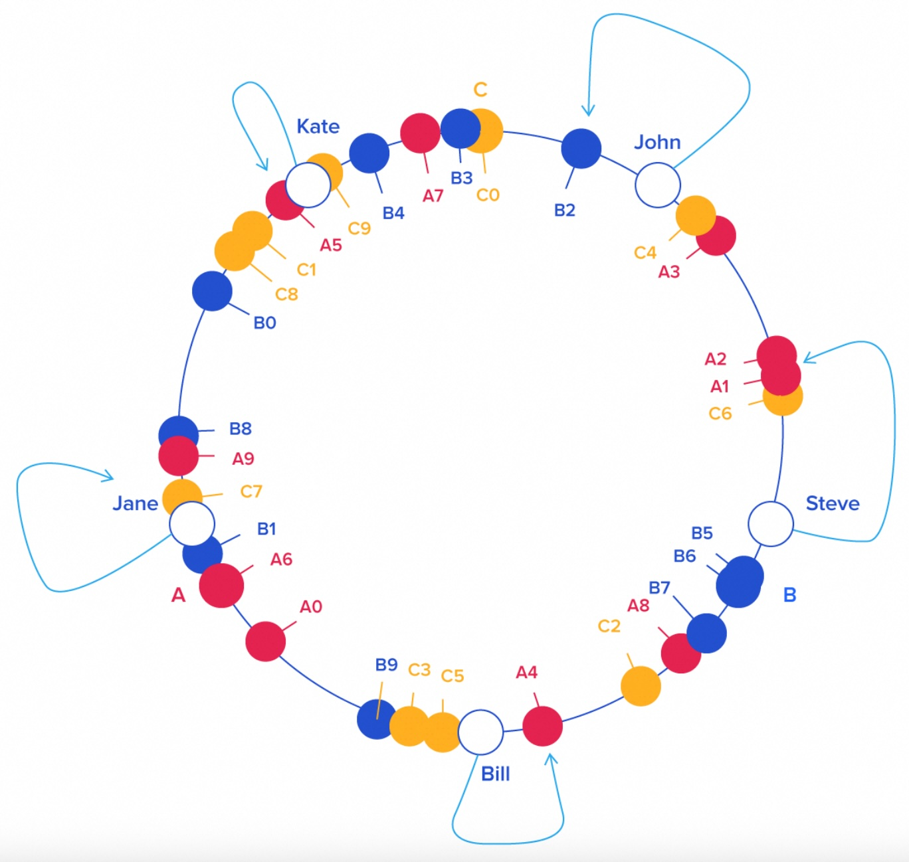
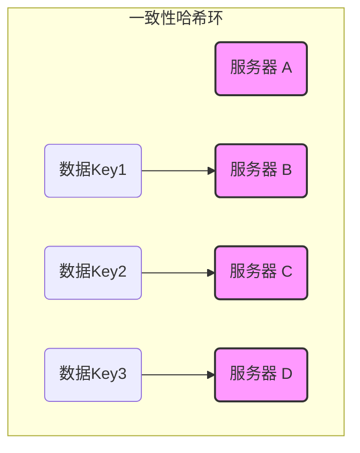
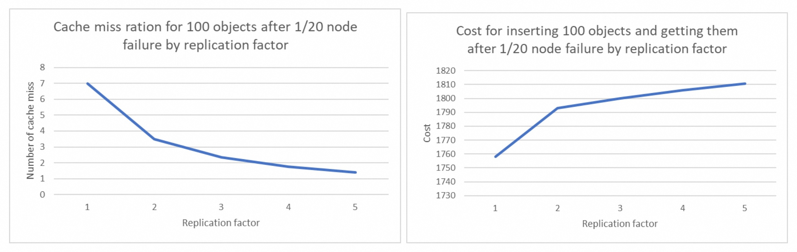

## AI论文解读 | Scalable Distributed Cache Using Consistent Hashing
        
### 作者        
digoal        
        
### 日期        
2025-09-09       
        
### 标签        
PostgreSQL , PolarDB , DuckDB , AI , 论文解读        
        
----        
        
## 背景  
      
https://www.scs.stanford.edu/22sp-cs244b/projects/Scalable%20Distributed%20Cache%20Using%20Consistent%20Hashing.pdf        
  
提示:          
```          
读懂《Scalable Distributed Cache Using Consistent Hashing》这篇论文需要提前掌握哪些基础知识, 请使用中文通熟易懂的讲解这些基础知识, 可以引用论文中的图、表或使用Markdown支持的图形(text,mermaid等)增加解释性. 
  
使用中文通熟易懂的解读《Scalable Distributed Cache Using Consistent Hashing》这篇论文, 其中的关键内容请着重讲解, 可以引用论文中的图、表或使用Markdown支持的图形(text,mermaid等)增加解释性. 
  
提取《Scalable Distributed Cache Using Consistent Hashing》这篇论文中的重要术语, 使用中文对这些术语进行通熟易懂的讲解, 可以引用论文中的图、表或使用Markdown支持的图形(text,mermaid等)增加解释性. 
```     
  
## 1 前置知识 
  
读懂这篇关于**可扩展分布式缓存与一致性哈希**的论文，你需要了解一些基础概念。我将用通俗易懂的方式，结合论文中的内容，为你讲解这些知识。

-----

### 1\. 什么是分布式缓存？

首先，想象一下你有一个很大的网站，每天有成千上万的用户访问。这些用户请求的数据可能都存放在一个单一的服务器上。当访问量暴增时，这台服务器就会因为内存和处理能力有限而变得非常慢，甚至崩溃。

**分布式缓存**就是为了解决这个问题而诞生的。它的核心思想是：不把所有数据都放在一台服务器上，而是把数据分散存储在多台服务器上，这些服务器共同组成一个“缓存集群”。

  * **优点：** **解决内存限制：** 你可以轻松地增加服务器来扩展总内存，而不必购买昂贵的单个大内存服务器。
      * **提高性能：** 当用户请求数据时，系统可以从离用户更近或负载更低的服务器上获取数据，加快响应速度。

这篇论文将分布式缓存分为两部分：一个**主缓存服务器（Primary Cache Server）** 和多个**工作缓存服务器（Cache Worker Servers）** 。主服务器负责接收所有请求，然后将请求路由到具体的工作服务器上。

### 2\. 什么是哈希（Hashing）？

哈希是一种将任意大小的数据（比如一个文件名、一个网页链接）映射成一个固定大小的“哈希值”的算法。你可以把这个哈希值想象成一个独一无二的指纹。

在一个简单的哈希表中，我们用哈希函数来决定一个键值对（key-value pair）应该存放在哪里。

> 例如：
> `hash(key) % N`
>
> 这里的 `N` 是服务器的数量。

如果你的服务器数量不变，这个公式很好用。但如果增加或移除了一台服务器，`N` 的值就变了。这意味着几乎所有数据的哈希值都需要重新计算，导致大量数据需要迁移到新的服务器上。这种大规模的数据迁移是低效且耗时的。

### 3\. 一致性哈希（Consistent Hashing）

**一致性哈希**正是为了解决服务器增减时的大规模数据迁移问题而出现的。它将服务器和数据都映射到一个环形的“哈希环”上，如下图所示（这正是论文第一页的图）。   

  * **工作原理：**

      * 首先，将每台服务器（如 John, Kate, Jane, Bill, Steve）和每个数据对象（如 A1, A2, B3, C4）都通过哈希函数映射到环上的一个点。
      * 要找到一个数据对象（比如 A1）应该存放在哪台服务器上，系统会沿着哈希环顺时针方向，找到第一个遇到的服务器。
      * 在上面的图中，A1 的哈希值落在了 John 和 Steve 之间，顺时针方向第一个遇到的服务器是 Steve。所以，A1 将被分配给 Steve。

  * **一致性哈希的优势：**

      * **平滑扩展：** 当你新增一台服务器时，它只会影响到哈希环上相邻的一小部分数据需要重新分配。
      * **节点故障处理：** 当一台服务器（比如 Steve）宕机时，原来分配给它的数据（比如 A1, B5, B6）会顺时针移动到下一台服务器（Bill）上。同样，这只影响到一小部分数据。

论文中提到，为了让数据在服务器之间分布得更均匀，通常每台物理服务器会在哈希环上创建多个虚拟节点。

### 4\. 负载感知（Load-Aware）

在一致性哈希中，如果某个数据对象（例如一个热门的视频或新闻）被频繁访问，它所在的服务器可能会因为负载过高而成为“热点”。这会导致请求处理变慢。

论文提到了**负载感知一致性哈希（Load-Aware Consistent Hashing）**，这是谷歌 Zanzibar 系统中的一个概念。它的思想是，当一个数据对象变得非常热门时，系统可以主动地为它创建更多的副本，并分发到不同的工作服务器上，以分担负载。

论文中用一个**负载阈值（load threshold）L**来衡量一个对象的热度。当对某个对象发起的请求数达到 L 时，系统就会增加一个新的节点来处理后续的请求。这样可以减少对单个热点服务器的依赖，提高可用性，并降低读取请求的平均延迟。

### 5\. 请求类型（Request Types）

论文还比较了两种处理并行请求的方式：

  * **请求对冲（Request Hedging）**：同时向多个工作服务器发送请求。一旦第一个请求成功返回，就立即使用这个结果，并取消其他请求。
  * **等待所有请求（Awaiting All Requests）**：等待所有并行请求都返回结果后，再进行下一步操作。

论文的结果显示，在某些情况下，“等待所有请求”比“请求对冲”更有效，因为它能让数据更稳定地驻留在缓存中，减少缓存丢失率，尽管这可能会引入更高的尾部延迟（即最慢的响应时间）。

理解了这些基础概念后，你就能更好地理解论文中关于不同 **扩展策略（Scaling Strategies）** 的讨论，比如：

  * **无副本（No Replication）**：最简单的实现，每个对象只在一个服务器上有一个副本。
  * **按因子复制（Replication by Factor）**：每个对象都有 N 个副本。
  * **负载感知一致性哈希（Load-Aware Consistent Hashing）**：根据对象热度动态增加副本。

希望这些基础知识能帮助你顺利读懂这篇论文。
  
## 2 解读论文 
  
好的，我们来一起通俗易懂地解读一下《Scalable Distributed Cache Using Consistent Hashing》这篇论文。

这篇论文的核心思想是探讨如何构建一个可以**弹性伸缩的分布式缓存系统**。你可以把它想象成一个“无限大”的内存数据库，当一台机器的内存不够用时，可以方便地增加更多普通机器来扩展整个系统的容量和性能。论文不仅介绍了原理，还通过一个自己实现的系统，模拟了各种情况下的性能表现。

-----

### 1\. 核心问题：为什么需要分布式缓存？

想象一下，一个热门网站（比如微博或Twitter）有数亿用户，每秒钟都有海量的读写请求。如果用单一的、巨大的服务器来处理，成本会高得惊人，而且一旦这台服务器宕机，整个服务就瘫痪了。

分布式缓存就是为了解决这个问题 。它把数据分散存储在许多普通的、廉价的服务器上，组成一个集群 。这样做有两大好处：

  * **可扩展性（Scalability）**：内存不够了？加几台机器就行。
  * **高可用性（High Availability）**：一台机器坏了？数据在其他机器上还有备份，服务不会中断。

但随之而来的挑战是：当数据被分散到成百上千台机器上时，我们如何快速地知道“某个数据具体存在哪台机器上”呢？ 这就是 **一致性哈希（Consistent Hashing）** 要解决的核心问题。

-----

### 2\. 关键技术一：一致性哈希 (Consistent Hashing)

这是整篇论文的基石。传统的哈希算法（如 `hash(key) % N`，N是服务器数量）在增删服务器时会引发灾难：几乎所有的数据都需要重新计算位置并迁移，导致整个缓存系统瞬间失效。

一致性哈希则巧妙地避免了这个问题。我们可以把它理解成一个环：

1.  **构建哈希环**: 想象一个闭环，范围从 0 到 $2^{32}-1$（或其他足够大的数值）。
2.  **服务器上环**: 将每台服务器（比如通过它们的IP地址）进行哈希计算，得到一个值，然后将它们标记在环上的对应位置。
3.  **数据上环**: 当要存一个键值对（Key-Value）时，对 Key 进行哈希计算，同样得到一个环上的位置。
4.  **顺时针寻找**: 从 Key 在环上的位置开始，**顺时针**走，遇到的第一个服务器，就是负责存储这个 Key 的服务器。




**一致性哈希最大的优点：**
当增加或删除一台服务器时（比如服务器 C 宕机了），只有原来存储在 C 上的数据（如 Key2）需要重新定位（顺时针找到下一台服务器 D）。绝大部分其他数据的位置不受影响，大大减少了数据迁移的成本。

论文中还提到了一个优化：为了避免数据倾斜（即某些服务器负载过高），系统会给一台物理服务器创建多个“虚拟节点”（论文图1中的 John, Steve 等就是物理节点），让数据分布更均匀 。   

-----

### 3\. 系统架构：一个聪明的“总管” + 一群“工人”

论文设计的系统分为两个角色 ：

  * **主缓存服务器 (Primary Cache Server)**：这是“总管”。它不亲自存储数据，但负责路由和管理 。当一个读/写请求进来时，它通过一致性哈希算法计算出数据应该由哪个“工人”处理，然后把任务派发过去 。它还负责在需要时增加新的工人服务器 。
  * **工作服务器 (Worker Servers)**：这些是埋头干活的“工人”，它们真正地存储着键值对数据。

这个架构的请求流程大致如下：

1.  客户端向“总管”（Primary Server）发送一个写请求 `SET(key, value)`。
2.  “总管”计算 `hash(key)`，在哈希环上找到对应的“工人”（Worker Server）。
3.  “总管”命令这位“工人”存储数据。如果工人的内存满了，总管会启动一个新工人，然后重试存储 。

-----

### 4\. 核心策略对比：如何实现高可用和高性能？

当一台服务器宕机时，如何保证数据不丢失？当某个数据（比如一条热搜）被疯狂访问时，如何避免服务器被打垮？论文重点研究和对比了三种策略：

#### 策略一：无复制 (No Replication)

最简单的模式，一个数据只存在一台服务器上 。

  * **优点**：最大化地利用了缓存空间 。
  * **缺点**：任何一台服务器宕机，它上面的数据就全部丢失了，可用性差。

#### 策略二：按因子复制 (Replication by Factor - RF)

写入数据时，不只写一份，而是同时写入到哈希环上顺时针方向的 N 个服务器上 。这个 N 就是“复制因子”。

  * **优点**：极大地提高了可用性。一台服务器宕机，可以从其他副本读取数据。
  * **缺点**：写入成本变高（要写多次），并且占用了更多存储空间 。

论文在第5页的图表清晰地展示了这个权衡：   

| 实验结果 (参照论文图表) | 描述 |
| :--- | :--- |
| **缓存未命中率 vs. 复制因子** | 左图显示，随着复制因子从1增加到5，节点故障后的缓存未命中次数从7次急剧下降到1次左右 。**结论：复制越多，数据越不容易丢失** 。 |
| **成本 vs. 复制因子** | 右图显示，随着复制因子增加，完成“插入并读取100个对象”的总成本（可以理解为时间或资源消耗）也随之上升 。**结论：更高的可用性是有代价的** 。 |

这个结果揭示了一个经典的**系统设计权衡（Trade-off）**：**可用性**和**成本/性能**之间需要根据业务需求来做取舍 。

#### 策略三：负载感知一致性哈希 (Load-Aware Consistent Hashing - LA-CH)

这是论文的亮点，灵感来源于谷歌的 Zanzibar 系统 。它认为不是所有数据都一样重要，我们应该把资源用在“刀刃”上。

  * **核心思想**：动态地、按需地为“热点数据”增加副本。
  * **工作方式**：
    1.  “总管”会监控每个数据的请求次数 。
    2.  当一个数据的请求数超过一个阈值 `L`（比如1秒内1000次），系统就认为它是一个“热点数据” 。
    3.  系统会自动为这个热点数据增加一个新的副本节点来分担读取压力，而其他“冷”数据则不受影响 。
    4.  对于“超级热”的数据（比如请求超过 `2*L`），系统还会缓存其副本节点的位置信息，实现更快的访问 。

这种策略非常智能，它兼顾了**资源效率**和**高可用性**，只为真正需要的数据进行复制，避免了“一刀切”式复制带来的资源浪费。

-----

### 5\. 其他重要发现

  * **请求对冲 (Hedging) vs. 等待所有请求 (Awaiting)**：在读取副本数据时，可以有两种模式。一种是“对冲”，同时向所有副本发请求，谁先返回就要谁的结果 。另一种是“等待”，必须等所有请求都返回 。实验发现，**“等待”模式的缓存命中率（0%未命中）远高于“对冲”模式** 。这是因为“对冲”模式下，读请求可能在所有副本都完成写入前就发出了，导致读取失败 。
  * **哈希函数的选择**：论文对比了Python内置的 `hash()` 函数和更安全的 `SHA256` 算法，发现在他们的实验场景中，两者对最终性能和数据分布的影响不大 。

### 总结

这篇论文通过理论结合实践，清晰地展示了如何从零开始构建一个可扩展的分布式缓存系统。它的核心贡献在于：

1.  **阐明了一致性哈希**在分布式系统中的关键作用。
2.  **量化了“复制因子”策略中的权衡**：更高的可用性需要付出更高的性能成本。
3.  **提出并验证了“负载感知”策略的优越性**：通过动态识别和复制热点数据，实现了资源效率和高性能的平衡，是更先进、更智能的解决方案。

对于任何想要了解分布式系统、后端架构的开发者来说，这篇论文中探讨的理念和权衡都具有非常高的实践指导价值。
  
## 3 术语 
  
好的，以下是这篇论文中提到的重要术语，并附上通俗易懂的中文解释。

### 核心术语

-----

**1. 分布式缓存 (Distributed Cache)**
分布式缓存是一种将数据存储在多台服务器上以绕过单机内存限制的技术 。你可以把它想象成一个大型的、由多台计算机组成的协作式存储系统，这些计算机共同构成了一个巨大的哈希表 。这样做的好处是，你可以使用多台价格更便宜的服务器来构建一个非常大的缓存系统，而不是依赖一台昂贵的高配置服务器 。

**2. 一致性哈希 (Consistent Hashing)**
一致性哈希是一种特殊的哈希技术，它将服务器和数据对象都映射到一个虚拟的环形空间上 。这个环可以称为“哈希环”。当需要存储一个数据时，系统会计算它的哈希值，并将它放置在环上。然后，它会顺时针找到环上最近的那个服务器，并将数据分配给它。

论文的第一页有一张图，完美地展示了这个概念：   

图中，白色的圆圈代表不同的服务器 (Kate, John, Steve, Bill, Jane)，彩色的圆点代表数据对象 (A1, B2, C3 等)。例如，数据对象 A1 位于 John 和 Steve 之间，它顺时针遇到的第一个服务器是 Steve，所以 A1 就由 Steve 负责存储。

**重要性：** 这种技术的主要优势在于，当有服务器增加或移除时，只需要移动一小部分数据，而不会像传统哈希那样导致几乎所有数据都需要重新分配，从而实现了平滑的扩展和容错 。

**3. 哈希环上的虚拟节点 (Multiple Hashes for a Single Machine)**
为了让数据在哈希环上的分布更均匀，避免某些服务器因为哈希值分布不均而负载过重（也就是所谓的“热点”），每台物理服务器都会在哈希环上拥有多个哈希值，从而代表多个虚拟节点 。论文的第一页图中，每个服务器（白点）附近都有几个彩色的圆点，这些就是它的虚拟节点。这样做能让对象在不同的工作服务器之间更均匀地分布 。

**4. 主缓存服务器 (Primary Cache Server)**
主缓存服务器是整个分布式缓存系统的入口 。它主要负责以下任务：

  * 接收客户端发送的 **SET (写入)** 和 **GET (读取)** 请求 。
  * 将请求路由到具体负责存储数据的 **工作缓存服务器** 。
  * 根据需要自动启动或关闭工作服务器 。
  * 执行负载均衡 。

**5. 工作缓存服务器 (Cache Worker Servers)**
工作缓存服务器是真正存储数据的节点 。它们根据主服务器的指令来执行数据的写入、读取、删除等操作 。

### 性能与扩展术语

-----

**6. 复制因子 (Replication Factor, RF)**
复制因子指的是每个数据对象在缓存中拥有的副本数量 。如果复制因子为 N，那么每当你写入一个新对象时，这个对象都会被写入到 N 个不同的工作服务器上 。

**好处：** 增加复制因子可以显著提高数据的可用性，即使某个工作服务器发生故障，数据仍然可以在其他副本上找到 。这对于频繁被访问的“热点”对象尤其有利 。

**代价：** 写入操作的延迟会变高，因为需要将数据写入多个节点 。此外，也会占用更多的存储空间 。

**7. 负载感知一致性哈希 (Load-Aware Consistent Hashing, LA-CH)**
这是一种更智能的复制策略，源自 Google 的 Zanzibar 系统 。它不是为所有对象都创建固定数量的副本，而是根据对象的热度（访问频率）来动态地增加副本。当一个对象变得非常热门，以至于单个工作服务器无法处理其负载时，系统会为它分配更多的副本，从而将请求分散到多个服务器上 。

**8. 请求对冲 (Request Hedging)**
这是一种处理并行请求的方式 。当你需要读取一个数据时，系统会同时向多个可能包含该数据的服务器发送请求。一旦其中任何一个请求成功返回结果，系统就会立即使用这个结果，并取消其他所有未完成的请求 。

  * **优点：** 能够有效降低读取请求的尾部延迟（即最慢的响应时间），尤其是在某些服务器响应慢或发生故障时 。
  * **代价：** 论文结果显示，这种方式可能成本更高 。

**9. 等待所有请求 (Awaiting All Requests)**
与请求对冲不同，这种方式会等待所有并行发出的请求都返回结果后，才继续进行下一步操作 。论文中指出，在某些情况下，这种方式可以帮助数据更长时间地驻留在缓存中，即使复制因子很小，也能获得很好的缓存命中率 。

-----

### 成本与指标

-----

**10. 负载模型 (Load Modeling)**
论文用一个简单的模型来评估每个工作服务器的负载 。当一个工作服务器被写入时，它的负载值增加 2；当被读取时，负载值增加 1 。如果一个新请求的负载会导致服务器的总负载超过预设的**负载阈值**，这个请求就会被阻塞，从而防止服务器过载 。

**11. I/O 操作成本模型 (I/O Operation Cost Modeling)**
为了量化不同操作的性能，论文为各种操作定义了成本 。

  * **读取对象/写入对象：** 成本与对象的大小成正比 。
  * **缓存未命中 (Cache Miss)：** 成本为 5 。
  * **读取数据库 (Read Database)：** 成本为 500（远高于缓存读取） 。
  * **增加节点 (Adding Node)：** 成本为 300 。
  * **计算哈希 (Computing hash)：** 成本为 5 。

**12. 缓存未命中率 (Cache Miss Ratio)**
这是衡量缓存性能的一个重要指标，表示请求数据时在缓存中没有找到的比率 。未命中率越低，说明缓存的效率越高。论文的图表显示，当复制因子增加时，缓存未命中率会显著降低 。   

**13. 总情景成本 (Total Scenario Cost)**
这个指标用来衡量完成一组特定操作（例如写入和读取 100 个对象）所需要的总成本 。这个成本是根据 I/O 成本模型计算出来的。总成本越小，通常意味着缓存的可用性越高，性能越好 。
  
## 参考        
         
https://www.scs.stanford.edu/22sp-cs244b/projects/Scalable%20Distributed%20Cache%20Using%20Consistent%20Hashing.pdf    
        
<b> 以上内容基于DeepSeek、Qwen、Gemini及诸多AI生成, 轻微人工调整, 感谢杭州深度求索人工智能、阿里云、Google等公司. </b>        
        
<b> AI 生成的内容请自行辨别正确性, 当然也多了些许踩坑的乐趣, 毕竟冒险是每个男人的天性.  </b>        
    
#### [期望 PostgreSQL|开源PolarDB 增加什么功能?](https://github.com/digoal/blog/issues/76 "269ac3d1c492e938c0191101c7238216")
  
  
#### [PolarDB 开源数据库](https://openpolardb.com/home "57258f76c37864c6e6d23383d05714ea")
  
  
#### [PolarDB 学习图谱](https://www.aliyun.com/database/openpolardb/activity "8642f60e04ed0c814bf9cb9677976bd4")
  
  
#### [PostgreSQL 解决方案集合](../201706/20170601_02.md "40cff096e9ed7122c512b35d8561d9c8")
  
  
#### [德哥 / digoal's Github - 公益是一辈子的事.](https://github.com/digoal/blog/blob/master/README.md "22709685feb7cab07d30f30387f0a9ae")
  
  
#### [About 德哥](https://github.com/digoal/blog/blob/master/me/readme.md "a37735981e7704886ffd590565582dd0")
  
  

  
