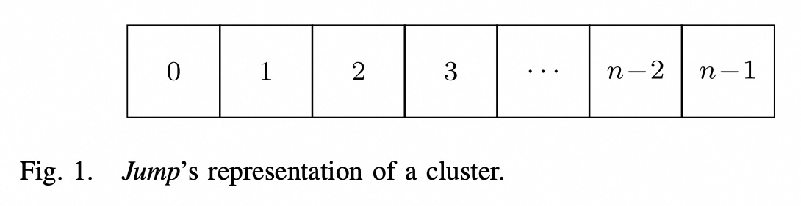
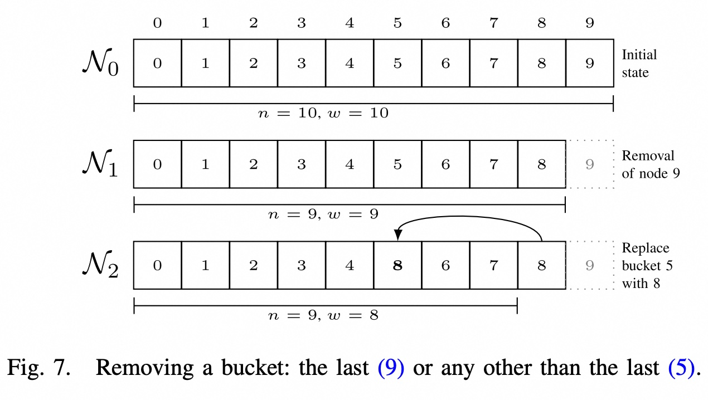
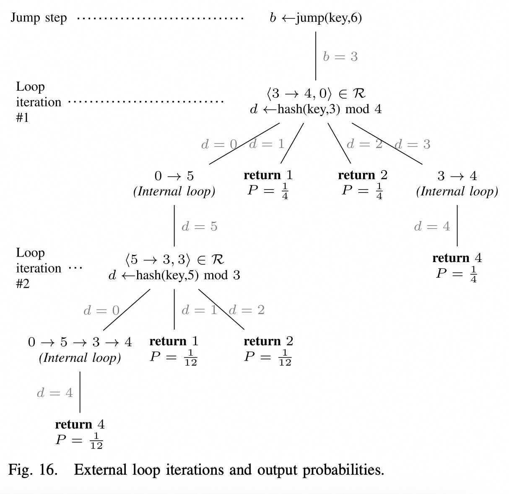
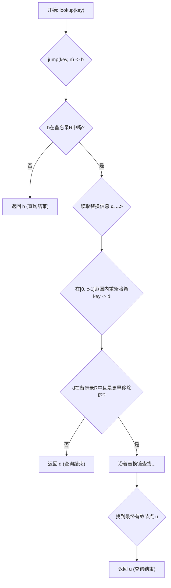
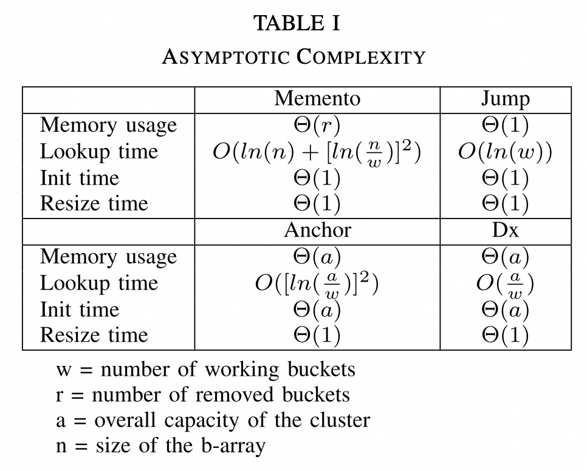

## AI论文解读 | MementoHash: A Stateful, Minimal Memory, Best Performing Consistent Hash Algorithm
        
### 作者        
digoal        
        
### 日期        
2025-09-09       
        
### 标签        
PostgreSQL , PolarDB , DuckDB , AI , 论文解读        
        
----        
        
## 背景  
      
https://ieeexplore.ieee.org/stamp/stamp.jsp?tp=&arnumber=10510260        
  
提示:          
```          
读懂《MementoHash: A Stateful, Minimal Memory, Best Performing Consistent Hash Algorithm》这篇论文需要提前掌握哪些基础知识, 请使用中文通熟易懂的讲解这些基础知识, 可以引用论文中的图、表或使用Markdown支持的图形(text,mermaid等)增加解释性. 
  
使用中文通熟易懂的解读《MementoHash: A Stateful, Minimal Memory, Best Performing Consistent Hash Algorithm》这篇论文, 其中的关键内容请着重讲解, 可以引用论文中的图、表或使用Markdown支持的图形(text,mermaid等)增加解释性. 
  
提取《MementoHash: A Stateful, Minimal Memory, Best Performing Consistent Hash Algorithm》这篇论文中的重要术语, 使用中文对这些术语进行通熟易懂的讲解, 可以引用论文中的图、表或使用Markdown支持的图形(text,mermaid等)增加解释性. 
```     
  
## 1 前置知识 
  
要理解《MementoHash: A Stateful, Minimal Memory, Best Performing Consistent Hash Algorithm》这篇论文，您需要提前掌握以下几个核心基础知识。

-----

### 1\. 什么是分布式系统？

分布式系统简单来说，就是由多台计算机（节点）协同工作来管理数据（例如分布式存储中的文件、分布式数据库中的记录等）的系统 。在这样的系统中，一个关键挑战是如何将数据均匀地分配给这些节点，以防止某个节点因数据过多而过载 。一致性哈希就是为了解决这个问题的。

### 2\. 哈希算法与简单取模的局限性

**哈希算法（Hashing）** 是一种确定性函数，它将任意长度的数据作为输入，并生成一个固定长度的哈希值（通常是一个数字）。哈希算法的目的是将数据均匀地分配到不同的桶（bucket，在论文中代表一个节点）中 。

最简单的哈希分配方法是使用哈希值对节点数进行取模运算：`hash(key) % n`。
然而，这种方法的致命缺点在于，当节点数量 `n` 发生变化时，几乎所有数据的映射都会改变 。这意味着，当分布式系统增加或移除一个节点时，几乎所有数据都需要重新定位，导致大规模的数据迁移，效率极低。

### 3\. 一致性哈希（Consistent Hashing）

一致性哈希是一种**分布式哈希算法**，旨在解决简单哈希取模的局限性 。它的核心思想是在节点数量变化时，将需要重新映射的数据单元（key）数量降到最低 。

一篇优秀的一致性哈希算法需要具备以下几个特性：

  * **均衡性（Balance）**：键（key）应该在所有桶（节点）之间均匀分布 。
  * **最小化扰动（Minimal Disruption）**：当一个桶被移除时，只有原本映射到该桶的键会重新映射，而其他键的位置保持不变 。
  * **单调性（Monotonicity）**：当添加一个新桶时，键只从旧桶迁移到新桶，不会在旧桶之间互相迁移 。

-----

### 4\. 了解现有一致性哈希算法的优缺点

论文在介绍 MementoHash 之前，首先分析了三种当前主流算法的优缺点，这有助于理解 MementoHash 的创新之处。

#### **JumpHash**

JumpHash 算法非常高效，因为它不需要任何内部数据结构，因此内存占用极小，查找速度也最快 。它将集群表示为一个有序的桶数组（b-array），如论文图1所示：

  

*图1：JumpHash的集群表示*

**局限性**：JumpHash 只能移除最后添加的桶 。如果集群中任意一个节点失效，JumpHash 无法处理，这使得它在实际生产环境中不实用 。

#### **AnchorHash & DxHash**

为了解决 JumpHash 无法处理随机故障的问题，AnchorHash 和 DxHash 算法通过维护一个内部数据结构来追踪所有节点（包括工作和不工作的节点）。

**局限性**：这种方法导致它们比 JumpHash 占用更多的内存，并且查找速度更慢 。此外，它们需要在初始化时预先定义集群的最大容量，这限制了集群的无限扩展性 。

### 5\. MementoHash 的核心思想

MementoHash 的设计理念是，在继承 JumpHash 优点的同时，解决其无法处理随机故障的缺点。它不再像 AnchorHash 和 DxHash 那样记录所有潜在的节点，而是仅仅**记录那些已经移除的节点** 。

当一个节点被随机移除时，MementoHash 会用最后一个工作节点来填补这个空缺，并记录下这个“替换”关系 。例如，论文图7展示了这一过程：

  

*图7：移除一个桶：最后一个（9）或任何一个非最后一个（5）*

通过这种方式，MementoHash 能够保持一个“紧凑”的桶数组（b-array），从而继续利用 JumpHash 算法的高效性 。论文指出，这种方法既能处理随机故障，又能保持接近 JumpHash 的性能，并且只使用极少的额外内存 。
  
## 2 解读论文 
  
好的，我们来一起用通俗易懂的方式解读《MementoHash: 一种有状态、内存占用极小、性能最佳的一致性哈希算法》这篇论文。

### **引言：为什么需要新的一致性哈希算法？**

在分布式系统（比如分布式数据库、缓存、负载均衡器）中，我们需要把数据或者请求均匀地分散到不同的服务器节点上 。一致性哈希就是解决这个问题的关键技术 。它能保证当服务器数量发生变化（增加或减少）时，尽可能少地移动数据，从而实现平滑的扩容和缩容 。

现有的算法各有优劣：

  * **JumpHash**: 速度飞快，几乎不占内存 。但它有个致命缺陷：只能移除最后加入的节点，无法处理集群中任意一个节点随机宕机的情况，这在真实生产环境中是完全不可接受的 。
  * **AnchorHash** 和 **DxHash**: 解决了JumpHash的随机宕机问题 。但它们需要在一开始就设定一个集群的最大容量，并且始终跟踪所有节点（无论是否在线）的状态 。这不仅导致内存占用大，性能较慢，还限制了集群的无限扩展能力 。

**论文的核心思想**：能不能结合JumpHash的极致性能和处理随机故障的能力，同时又避免AnchorHash和DxHash的缺点呢？

作者们由此提出了**MementoHash**。其名字"Memento"（备忘录）非常形象，它的核心思想就是：**平时像JumpHash一样运行，只在有节点随机下线时，才用一个极简的数据结构“备忘”一下这个变化** 。

-----

### **关键内容精讲**

#### **1. MementoHash的核心机制：保持“紧凑”与“备忘”**

为了理解MementoHash，我们首先要把服务器集群想象成一个从0开始编号的数组，论文中称为**b-array** (bucket-array) 。

  * **初始状态**：一个有10个节点的集群，就像一个长度为10的数组，位置0上是0号节点，位置1上是1号节点，以此类推。这被称为 **“紧凑” (Dense)** 。JumpHash算法就依赖于这种完美的“紧凑”状态 。

    ```
    索引: 0  1  2  3  4  5  6  7  8  9
    节点: [0, 1, 2, 3, 4, 5, 6, 7, 8, 9]   (初始状态 N₀, 紧凑)
    ```

  * **随机节点下线**：问题来了，如果5号节点突然宕机了，数组在位置5就出现了一个“空洞”，不再“紧凑”。JumpHash就没法正常工作了。

  * **MementoHash的解决办法：移花接木 + 备忘录**

    1.  **填补空洞 (保持紧凑)**：为了维持数组的“紧凑性”，MementoHash会拿当前**最后一个**有效的节点来填补这个空洞。假设初始有10个节点（0-9），先移除了9号，再移除5号。移除5号时，最后一个有效节点是8号。于是，把8号节点“复制”到5号的位置上 。

          * 引用论文中的 **图7** 进行说明：    
              * **N₀ (初始)**: `[0, 1, 2, 3, 4, 5, 6, 7, 8, 9]` (n=10, w=10个工作节点)
              * **N₁ (移除9号)**: `[0, 1, 2, 3, 4, 5, 6, 7, 8]` (n=9, w=9个工作节点，依然紧凑)
              * **N₂ (移除5号)**: `[0, 1, 2, 3, 4, **8**, 6, 7, 8]` (n=9, w=8个工作节点)。注意，位置5现在被节点8占据，保持了`0`到`w-1`（即0到7）范围内的紧凑性。

    2.  **建立备忘录 (记录替换关系)**：光填补还不行，我们得记住这个操作。MementoHash会记录一条“替换信息”：`<被移除的节点 → 填补它的节点, 上一个被移除的节点>` 。

          * 移除5号节点后，记录为 `<5 → 8, 9>` 。意思是：5号被8号替换了，在5号被移除之前，上一个被移除的是9号。这个“上一个”信息是为了后续恢复节点时能按正确的顺序操作 。
          * 这个备忘录就是MementoHash的核心状态，论文中称为**Replacement Set (R)** 。它通常用哈希表实现，增删查都是O(1)的常数时间复杂度，非常高效 。

通过这种方式，MementoHash巧妙地将一个有“空洞”的复杂问题，转换为了一个“紧凑”的、JumpHash可以处理的问题，外加一个简单的“备忘录”来处理例外情况。

#### **2. MementoHash的查询 (Lookup) 过程**

这是算法最核心的部分。当需要查找一个key应该映射到哪个节点时，过程如下 (对应论文中的 **Algorithm 4** )：

1.  **首先，乐观地使用JumpHash**：假设所有节点都正常，直接调用`jump(key, n)`计算出一个目标位置b 。
2.  **检查“备忘录”**：
      * 如果位置b没有被替换过（即“备忘录”里没有b的记录），那么查询结束，返回b 。这是**最佳情况**，性能和JumpHash一样快。
      * 如果“备忘录”里有b的记录，说明b号节点已经下线了。
3.  **重定向 (Rehash)**：
      * 从备忘录中查出b被移除时，有多少个工作节点（这个数量也记录在替换信息里） 。
      * 然后对key进行一次**普通哈希**，将它映射到当时那些有效的工作节点范围内的一个新位置d 。
      * 这个过程可能会触发连锁反应（比如d也被移除了），算法会沿着替换链一直查找，直到找到一个真正可用的节点为止 。

**一个形象的比喻**：
你（key）要去一个大厦（集群）的508房间（bucket 5）办事。

1.  你直接按电梯到了5楼（`jump(key, n)`）。
2.  到了508门口，发现门上贴着一张纸条（“备忘录”R）："此房间已搬迁，请到8楼前台咨询" (`<5 → 8, ...>`)。
3.  你到了8楼前台（`rehash`），前台工作人员（普通hash函数）根据你的办事号码（key），告诉你应该去203房间 (`d=2`)。
4.  你到203房间，发现可以正常办事了（找到工作节点），查询结束。

论文中的 **图16** 直观地展示了这个过程，当`jump(key, 6)`计算结果为3时，由于3号节点已被移除，会触发一次重定向，最终有1/4的概率直接找到4号节点，另外的概率会继续迭代，但最终会将key均匀地分散到其他有效节点上。

  



#### **3. 性能与复杂度**

MementoHash的优雅之处在于它在不同场景下的表现：

| 场景 | MementoHash 表现 |
| --- | --- |
| **最佳情况** (无节点移除或按顺序移除) | 性能几乎等同于JumpHash，速度极快，内存占用极小 。 |
| **平均/最差情况** (随机节点移除) | 内存使用量仅与**被移除**的节点数成正比，而不是像Anchor/Dx那样与集群**总容量**成正比 。在节点移除比例不高时（例如低于65%），其查询性能优于AnchorHash和DxHash 。 |

**复杂度总结** (参考论文 **Table I**)

  

| 算法 | 查询时间复杂度 | 内存空间复杂度 | 是否限制最大容量 |
| --- | --- | --- | --- |
| JumpHash | $O(ln(w))$ | $O(1)$ | 是 (隐式) |
| AnchorHash | $O([ln(\\frac{a}{w})]^2)$ | $O(a)$ | 是 |
| DxHash | $O(\\frac{a}{w})$ | $O(a)$ | 是 |
| **MementoHash** | $O(ln(n) + [ln(\\frac{n}{w})]^2)$ | $O(r)$ | **否** |

  * `n`: 初始节点数
  * `w`: 当前工作节点数
  * `a`: Anchor/Dx预设的集群最大容量
  * `r`: MementoHash中被移除的节点数 (`r = n - w`)

虽然MementoHash的理论最差复杂度看起来不低，但在实际场景中，`ln(n/w)`这个值增长非常缓慢。**论文的基准测试（Benchmark）部分用大量实验数据证明了，在真实世界中（节点失败率通常低于20%），MementoHash的实际性能是三者中最快的** 。

**基准测试核心结论** (参考论文 **图17-图32**)

  * **稳定无变化时**: MementoHash和JumpHash并列最快，远超Anchor和Dx 。内存占用也和JumpHash一样，几乎为零 。
  * **移除少量节点时 (例如20%)**: MementoHash的查询速度和内存控制仍然是最佳的 。
  * **移除大量节点时 (例如65%)**: 其性能会下降，与另两者相当 。但这种情况在生产环境中非常极端 。
  * **对Anchor/Dx的容量预设不敏感**: MementoHash最大的优势之一是它不需要预估集群未来的最大规模，可以无限扩展，而Anchor/Dx一旦预估不准，要么浪费大量内存，要么严重影响性能 。

-----

### **总结：MementoHash的贡献**

MementoHash算法可以看作是对JumpHash的一次完美“补完”，它继承了JumpHash的**高速和低内存占用**的优点，同时通过一个巧妙的“备忘录”机制，弥补了其无法处理**随机节点故障**的致命短板 。

与AnchorHash和DxHash相比，它解决了以下两个核心痛点：

1.  **无需预设容量**：消除了对集群规模的上限限制，实现了真正的弹性伸缩 。
2.  **更优的资源利用**：内存开销仅与故障节点数相关，而非集群总容量，这在超大规模集群中意义重大 。

**最佳实践**：
论文建议，在日常扩缩容时，应尽量使用“后进先出”（LIFO）的方式添加和移除节点，这样MementoHash的内部“备忘录”就一直是空的，性能达到最优。只有在节点发生意外故障时，才触发其替换机制 。

总而言之，MementoHash是一款非常适合现代云环境的、在理论优雅性和工程实用性之间取得了极佳平衡的新一代一致性哈希算法。
  
## 3 术语 
  
《MementoHash》这篇论文的核心在于介绍一种新的**一致性哈希算法**，它通过创新性地解决现有算法的局限性，在性能上做到了最优。以下是理解这篇论文所需掌握的重要术语及其通俗易懂的解释。

---

### 1. 一致性哈希 (Consistent Hashing)

一致性哈希是一种特殊的哈希算法，它主要应用于**分布式系统**中，用来解决数据或请求在多台计算机（**节点**或**桶**）之间进行分配的问题。

想象一下，你有一个巨大的图书馆，里面有成千上万本书（数据），需要分配给不同的书架（节点）。

* **传统哈希取模**：如果你有10个书架，可以用 `图书编号 % 10` 的方法来决定书放在哪个书架。但如果图书馆增加或减少一个书架，所有书的位置都需要重新计算，导致大范围的搬运，这在计算机系统中意味着昂贵的数据迁移。

* **一致性哈希**：它能做到在书架数量变化时，只会影响极少数书的位置。例如，增加一个书架，只会有一部分书从旧书架搬到新书架；减少一个书架，也只有该书架上的书需要重新分配，其他书的位置不受影响。这种特性在论文中被称为**最小化扰动（Minimal Disruption）**。

### 2. MementoHash 之前的算法

论文通过与三种主流算法的对比，凸显了 **MementoHash** 的优越性。

* **JumpHash**：
    * **核心思想**：这是一种非常聪明的算法，它不存储任何状态（**无状态**），只通过一个数学公式就能确定数据应该去哪个节点。
    * **优点**：查找速度极快，内存占用几乎为零。
    * **局限性**：致命的缺点是它无法处理**随机故障**。如果一个位于中间的节点突然宕机，JumpHash 就不知道如何处理，因为它依赖于一个连续的节点列表。

* **AnchorHash 和 DxHash**：
    * **核心思想**：为了解决 JumpHash 的问题，这些算法会维护一个内部数据结构来记录所有节点的状态，包括正在工作的和已经移除的。
    * **优点**：可以处理节点的随机移除。
    * **局限性**：这种“记录所有状态”的方式导致了额外的内存开销，并且在查找时效率低于 JumpHash。此外，它们需要事先确定集群的最大容量，无法**无限扩展（Scale Indefinitely）**。

### 3. MementoHash 的关键术语

**MementoHash** 的设计目标是在兼顾 JumpHash 的性能优势的同时，解决其无法处理随机故障的缺点。

* **有状态 (Stateful)**：这是 MementoHash 名称中 “Stateful” 的来源。与无状态的 JumpHash 不同，MementoHash 会记录**被移除的节点**。论文中提到，当一个节点被移除时，它会用最后一个正常工作的节点来填补空缺，并记住这个“替换”关系。这种状态的记录是它能够处理随机故障的关键。

* **桶数组 (b-array)**：这是 JumpHash 和 MementoHash 的核心数据结构，它本质上是一个有序的、紧凑的节点列表。正是因为这个列表是紧凑的，这两个算法才能做到极高的性能。当一个节点被移除时，MementoHash 通过用最后一个节点来填补空缺，从而保持了这个数组的紧凑性。

* **均衡性 (Balance)**：这是衡量所有一致性哈希算法优劣的重要指标，指的是数据能够尽可能均匀地分布到所有节点上，避免某些节点数据过多而过载。论文通过实验证明，在不同的节点移除场景下，MementoHash 都能保持极佳的均衡性。

---

总而言之，**MementoHash** 的精妙之处在于它找到了一个平衡点：它只存储最少量的“状态”（被移除的节点信息），就能获得几乎与最快算法 JumpHash 一样的性能，同时还克服了 JumpHash 的核心缺陷，并且不像 AnchorHash 和 DxHash 那样受限于固定的集群容量。
  
## 参考        
         
https://ieeexplore.ieee.org/stamp/stamp.jsp?tp=&arnumber=10510260    
        
<b> 以上内容基于DeepSeek、Qwen、Gemini及诸多AI生成, 轻微人工调整, 感谢杭州深度求索人工智能、阿里云、Google等公司. </b>        
        
<b> AI 生成的内容请自行辨别正确性, 当然也多了些许踩坑的乐趣, 毕竟冒险是每个男人的天性.  </b>        
    
#### [期望 PostgreSQL|开源PolarDB 增加什么功能?](https://github.com/digoal/blog/issues/76 "269ac3d1c492e938c0191101c7238216")
  
  
#### [PolarDB 开源数据库](https://openpolardb.com/home "57258f76c37864c6e6d23383d05714ea")
  
  
#### [PolarDB 学习图谱](https://www.aliyun.com/database/openpolardb/activity "8642f60e04ed0c814bf9cb9677976bd4")
  
  
#### [PostgreSQL 解决方案集合](../201706/20170601_02.md "40cff096e9ed7122c512b35d8561d9c8")
  
  
#### [德哥 / digoal's Github - 公益是一辈子的事.](https://github.com/digoal/blog/blob/master/README.md "22709685feb7cab07d30f30387f0a9ae")
  
  
#### [About 德哥](https://github.com/digoal/blog/blob/master/me/readme.md "a37735981e7704886ffd590565582dd0")
  
  

  
