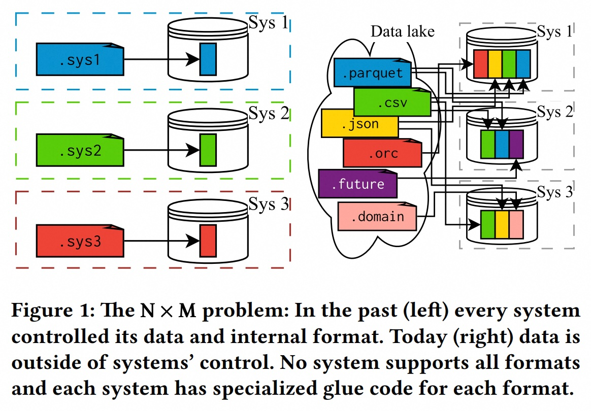
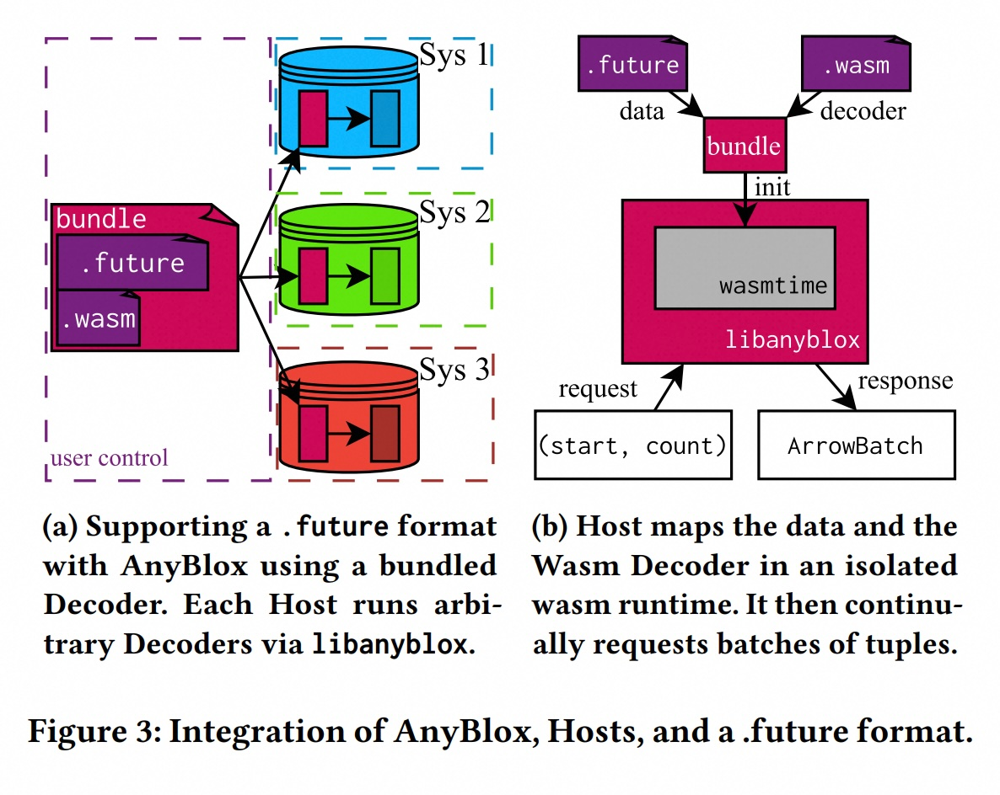
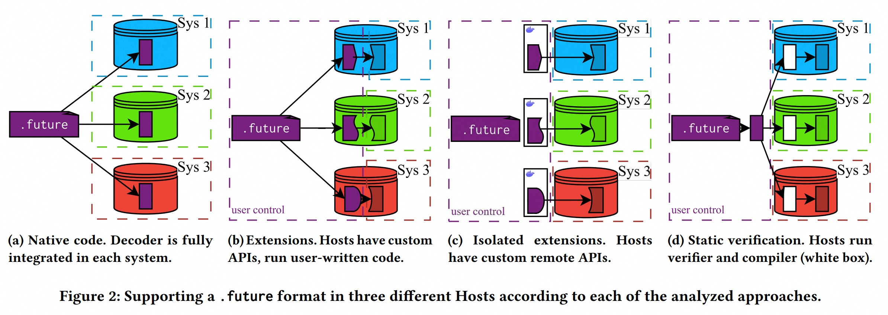
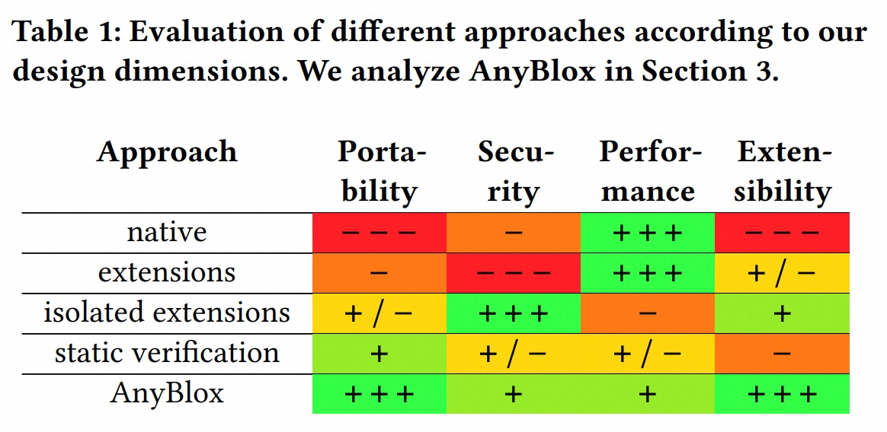
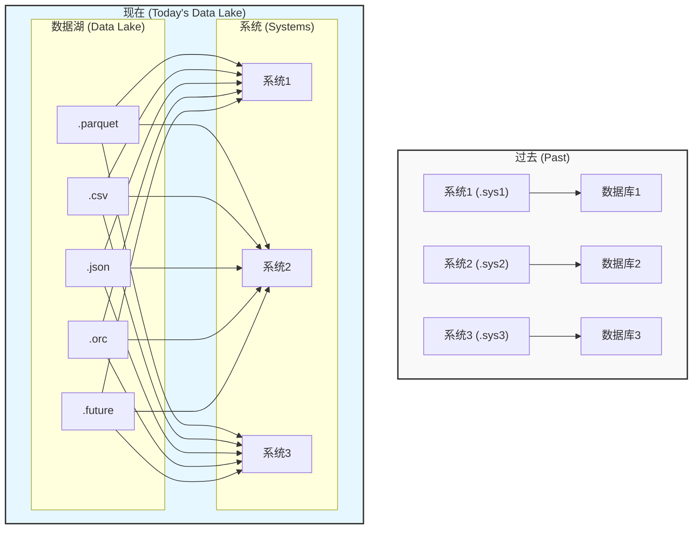
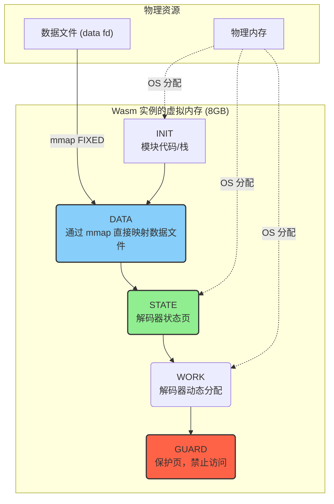
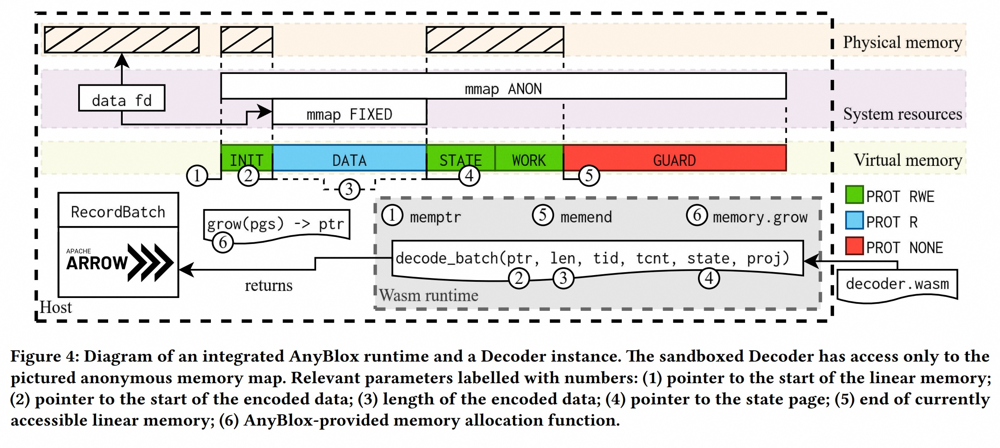
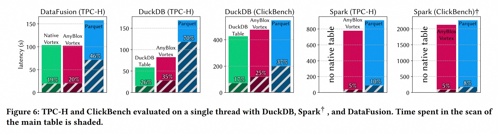

## AI论文解读 | AnyBlox: A Framework for Self-Decoding Datasets
        
### 作者        
digoal        
        
### 日期        
2025-09-09       
        
### 标签        
PostgreSQL , PolarDB , DuckDB , AI , 论文解读        
        
----        
        
## 背景  
      
https://www.vldb.org/pvldb/vol18/p4017-gienieczko.pdf        
  
提示:          
```          
读懂《AnyBlox: A Framework for Self-Decoding Datasets》这篇论文需要提前掌握哪些基础知识, 请使用中文通熟易懂的讲解这些基础知识, 可以引用论文中的图、表或使用Markdown支持的图形(text,mermaid等)增加解释性. 
  
使用中文通熟易懂的解读《AnyBlox: A Framework for Self-Decoding Datasets》这篇论文, 其中的关键内容请着重讲解, 可以引用论文中的图、表或使用Markdown支持的图形(text,mermaid等)增加解释性. 
  
提取《AnyBlox: A Framework for Self-Decoding Datasets》这篇论文中的重要术语, 使用中文对这些术语进行通熟易懂的讲解, 可以引用论文中的图、表或使用Markdown支持的图形(text,mermaid等)增加解释性. 
```     
  
## 1 前置知识 
  
理解《AnyBlox: A Framework for Self-Decoding Datasets》这篇论文需要掌握一些关于现代数据处理系统和数据存储格式的基础知识。这篇论文的核心在于解决一个被称为“N×M问题”的痛点，并提出了一个新颖的解决方案。

以下是理解这篇论文所需掌握的基础知识和核心概念，我将结合论文中的图表进行解释。

---

### 1. 核心问题：N×M 问题

在过去，传统数据库系统通常是封闭的，它们完全控制数据的存储格式和解码方式。然而，随着数据湖（Data lake）和开放数据格式（如 Parquet, CSV, JSON 等）的兴起，数据开始脱离单一系统的控制 。

这带来了一个巨大的问题：如果一个数据处理系统（N 个系统）需要支持多种数据格式（M 种格式），那么它就需要为每种格式开发和维护一个专门的解码器。这导致了 **N × M** 的工作量 。

**图 1**（论文首页左侧）展示了过去的情况：每个系统（Sys 1, Sys 2, Sys 3）都有自己的内部格式和解码器。而图 1（右侧）展示了现在的情况：数据湖中有多种格式的数据，每个系统都需要为这些不同的格式（如 Parquet, CSV, JSON 等）开发专门的代码来处理，从而导致了繁重的工作量和格式演进的困难 。

  

### 2. 论文的解决方案：AnyBlox

AnyBlox 框架旨在解决 N×M 问题，其核心思想是让数据“自我解码”（self-decoding datasets）。这篇论文认为，解码器不应由系统来提供，而应该与数据本身捆绑在一起。

**AnyBlox** 是一个框架，它将编码过的数据和轻量级的 **WebAssembly** 解码器（Decoder）打包在一起 。任何支持 AnyBlox 库（`libanyblox`）的系统（称为 **Host**，宿主系统）都可以读取这些数据，而无需了解其具体编码细节 。

**图 3**（论文第 4 页）展示了 AnyBlox 的架构。
* **图 3a** 描述了 AnyBlox 的工作方式：`.future` 数据文件和`.wasm` 解码器被捆绑成一个 **bundle** 文件 。任何支持 `libanyblox` 的系统（Host）都可以读取这个 bundle，从而读取数据 。
* **图 3b** 展示了更详细的内部流程：Host 使用 `libanyblox` 库，在一个独立的 WebAssembly 运行时（`Wasmtime`）中执行 `.wasm` 解码器，并以 **Apache Arrow** 格式接收解码后的数据批次（batch）。

  

### 3. 关键技术基础

要深入理解 AnyBlox，你需要了解以下几个核心技术概念：

#### a) WebAssembly (Wasm)

* **什么是 Wasm？** WebAssembly 是一种虚拟机的规范，及其可移植的二进制字节码格式 。它最初是为 Web 浏览器设计的，但现在已被广泛用于非 Web 场景。
* **为什么用 Wasm？** 论文中强调了 Wasm 的几个关键优势：
    * **可移植性 (Portability)：** Wasm 字节码可以在多种硬件和操作系统架构上运行，因为它被即时编译（JIT-compiled）为本机指令 。
    * **安全性 (Security)：** Wasm 提供强大的安全隔离保证，可以防止恶意或有缺陷的代码损害宿主系统。它具有内存安全和隔离特性 。
    * **性能 (Performance)：** Wasm 可以实现接近本机的性能，因为其字节码会被即时编译为宿主机的原生指令 。AnyBlox 甚至通过一种内存管理方案实现了零拷贝（zero-copy）数据传输，进一步提升了性能 。

#### b) Apache Arrow

* **什么是 Arrow？** Apache Arrow 是一种用于内存中数据的跨语言开发平台，它定义了一种标准化、列式（columnar）的内存格式 。
* **为什么用 Arrow？** AnyBlox 选择 Arrow 作为解码器的输出格式，因为它满足了以下要求：列式存储、支持标准 SQL 类型、与现有数据处理系统的低开销转换、可移植性和可扩展性 。

#### c) 内存管理：内存映射（mmap）与零拷贝

论文在第 3.6 节详细讨论了内存管理方案。理解这个部分需要一些关于操作系统内存管理的基础知识，特别是 **mmap**（内存映射）的概念。

简单来说，`mmap` 是一种系统调用，它能将一个文件或设备映射到进程的虚拟内存空间中。这使得对文件的读写操作就像访问内存一样，无需显式调用 `read()` 或 `write()` 。

AnyBlox 利用这一特性，将编码过的数据文件映射到 Wasm 解码器的线性内存空间中。解码器可以直接在内存中读取和处理数据，然后将解码后的结果（Arrow 格式）写到另一个内存区域 。由于 Host 系统和 Wasm 运行时共享相同的内存映射，数据从解码器返回给 Host 时，只需要传递一个指针，而不需要进行昂贵的内存复制，这就是“零拷贝”。

### 4. 相关的其他方法

论文在第 2 节分析了四种现有方法，你可以通过 **图 2**（论文第 2 页）和 **表 1**（论文第 2 页）来理解为什么这些方法不足以解决 N×M 问题：
* **Native Code（原生代码）：** 性能最好但移植性最差，需要为每个系统重新编写代码 。
* **Extensions（扩展）：** 改善了可扩展性，但安全性极差，因为扩展代码与宿主系统在同一特权级别运行 。
* **Isolated Extensions（隔离扩展）：** 提供了很好的安全性，但由于进程间数据传输开销大，性能较差 。
* **Static Verification（静态验证）：** 理论上能兼顾安全和性能，但在实践中存在验证器 bug、性能限制和编码困难等问题 。

  

  

通过理解这些现有方法的优缺点，你就能更好地 appreciate 为什么 AnyBlox 这种基于 WebAssembly 的新方法，能够更好地平衡可移植性、安全性、性能和可扩展性，从而解决 N×M 问题。
  
## 2 解读论文 
  
好的，我们来通俗易懂地解读一下这篇名为《AnyBlox：一个用于自解码数据集的框架》的论文。

这篇论文的核心思想是：**让数据自己“开口说话”，告诉我们该如何读取它**。通过这种方式，来解决当前数据处理领域一个非常棘手的问题。

### 1\. 论文要解决的核心问题： $N \\times M$ 困境与格式僵化

想象一下现在的数据世界：我们有各种各样的数据处理系统（比如 DuckDB、Spark、Umbra 等），我们称之为 N 个系统。同时，我们也有各式各样的数据存储格式（如 Parquet、CSV、JSON、ORC 等），我们称之为 M 种格式。

**问题来了**：为了让 N 个系统都能读取 M 种格式，理论上需要开发和维护 $N \\times M$ 个不同的读取程序（解码器）。如下图左侧所示，过去每个系统只管自己的数据格式，井水不犯河水；而如今在数据湖的架构下（右侧），所有系统都希望能读取所有格式的数据 。



图 1: 论文中描述的 N x M 问题示意图

  

这种 $N \\times M$ 的组合爆炸带来了两个严重的后果：

1.  **高昂的开发成本**：每出现一种新格式，所有系统都得跟进开发；每出现一个新系统，它又得努力去支持所有现存的格式 。
2.  **格式僵化 (Format Ossification)**：一个新发明的、性能更好的数据格式，很难被广泛采用。因为它需要足够流行，才值得大家去为它写解码器；但如果没有系统支持它，它又怎么可能流行起来呢？这陷入了一个“先有鸡还是先有蛋”的死循环 。最终导致大家只能继续使用那些虽然老旧但兼容性好的格式。

### 2\. 现有解决方案及其缺点

论文分析了当前解决数据读取问题的几种主流方法，并指出了它们的不足之处 。我们可以通过下表来直观理解：

| 方案 | 可移植性 | 安全性 | 性能 | 扩展性 | 核心问题 |
| :--- | :---: | :---: | :---: | :---: | :--- |
| **原生代码 (Native Code)** | 差 | 一般 | +++ | 差 | 每个系统都要重写一遍解码逻辑，无法复用 。 |
| **扩展插件 (Extensions)** | 差 | --- | +++ | 一般 | 每个系统的插件API都不同，且插件代码和系统本身运行在同一权限，非常危险，容易导致系统崩溃或被攻击 。 |
| **隔离扩展 (Isolated Ext.)** | 一般 | +++ | ++ | 好 | 虽然安全，但数据需要在系统和隔离环境（如Docker）之间来回传输，对于解码这种数据密集型任务，传输开销巨大 。 |
| **静态验证 (Static Ver.)** | 好 | 一般 | 一般 | 差 | 通过在运行前验证代码来确保安全。但目前的验证器（如eBPF）仍有漏洞，且为了通过验证，能写的代码功能受限，开发难度高 。 |

  

表 1: 不同方案的优劣对比 (基于论文 Table 1) 

可以看到，现有方案无法同时满足“可移植、安全、高性能、易扩展”这四个关键要求 。

### 3\. AnyBlox 的核心思想：让数据“自带”解码器

为了打破僵局，AnyBlox 提出了一个全新的范式：**自解码数据集 (Self-Decoding Datasets)** 。

这个想法很简单：**我们不再让系统去适配数据，而是把解码数据的逻辑（即解码器）和数据本身打包在一起。** 无论数据走到哪里，它都带着自己的“说明书”，任何系统只要遵循一套标准流程，就能让这份“说明书”自己运行起来，从而读出数据 。

AnyBlox 的架构如下图所示：

图 2: AnyBlox 架构示意图 (基于论文 Figure 3)

  

1.  **打包 (Bundle)**：数据 (`.future`) 和它的解码器 (`.wasm`) 被打包在一起 。
2.  **统一接口 (libanyblox)**：所有系统（Sys 1, Sys 2, Sys 3）都集成一个名为 `libanyblox` 的标准库 。
3.  **解码**：当系统需要读取数据时，它通过 `libanyblox` 调用数据包里的 `.wasm` 解码器。解码器在一个安全的隔离环境中运行，读取数据并返回解码后的内容 。

这样一来， $N \\times M$ 的问题就变成了 $N \\times 1$（每个系统集成一次 `libanyblox`）+ $M \\times 1$（每种格式写一个标准解码器），极大地降低了复杂性。

### 4\. AnyBlox 的关键技术

AnyBlox 的成功依赖于几个关键的技术选择和创新：

#### 4.1. 为什么选择 WebAssembly (Wasm)？

WebAssembly 是一个为浏览器设计的便携式、高性能的二进制指令格式，但它同样适用于非 Web 环境 。AnyBlox 选择 Wasm 作为解码器的载体，因为它完美地满足了四大需求：

  * **可移植性 (Portability)**：Wasm 代码是平台无关的，可以运行在几乎所有的硬件架构和操作系统上 。一次编写，到处运行。
  * **安全性 (Security)**：Wasm 在一个严格的沙箱环境中运行，它无法访问宿主系统的内存、文件或网络，除非被明确授权 。这从根本上杜绝了恶意解码器攻击系统的可能性。
  * **高性能 (Performance)**：Wasm 代码可以被即时编译 (JIT) 为接近宿主机器的原生代码来运行，性能非常高 。
  * **扩展性 (Extensibility)**：几乎所有主流编程语言（如 C++, Rust, Go）都可以编译成 Wasm，开发者可以使用自己熟悉的工具链来编写复杂的解码器 。

#### 4.2. 核心创新：零拷贝内存管理

解码任务通常需要处理大量数据，如果每次都把数据从文件拷贝到解码器的内存中，开销会非常大。AnyBlox 设计了一套巧妙的**零拷贝 (zero-copy) 内存管理机制** 。

其工作原理如下图所示：



  

图 3: AnyBlox 内存布局示意图 (基于论文 Figure 4) 

关键点在于，AnyBlox 不是将数据文件内容“复制”进来，而是使用操作系统提供的 `mmap` (内存映射) 功能，直接将文件“挂载”到 Wasm 实例的虚拟内存空间中 。

  * **对解码器透明**：解码器访问这块内存就像访问普通内存一样，完全不知道背后是文件映射 。
  * **极高性能**：`mmap` 操作本身非常快，而且只有当解码器实际访问到某部分数据时，操作系统才会真正地将这部分文件内容从磁盘加载到物理内存。这避免了巨大的、不必要的预先拷贝开销 。

这个设计是 AnyBlox 能够实现高性能的核心技术贡献之一 。

#### 4.3. 标准化的数据输出格式：Apache Arrow

解码器把数据读出来后，需要用一种标准格式交给上层系统。AnyBlox 选择了 **Apache Arrow** 作为其标准输出格式 。Arrow 是一种为分析型系统设计的内存列式数据格式，它被众多数据库和数据处理框架支持 。使用 Arrow 的好处是，如果上层系统内部也使用 Arrow（如 DataFusion），那么数据传递也可以实现零拷贝，进一步提升效率 。

### 5\. 实践效果如何？

论文通过大量的实验证明了 AnyBlox 的有效性。

  * **成功解决 $N \\times M$ 问题**：研究人员成功地将 AnyBlox 集成到了四个架构迥异的系统中（Umbra, DuckDB, Spark, DataFusion），并且只用了很少的代码（几百到一千多行）和很短的时间（2到15个人天）就完成了集成 。同时，他们为多种复杂格式（如最新的列式格式 Vortex、高能物理领域的专用格式 CERN ROOT）编写了 Wasm 解码器 。这证明了该框架的易用性和可扩展性。

  * **性能表现优异**：大家可能会担心 Wasm 的沙箱会带来性能损失。实验结果打消了这一疑虑。

      * 在 DataFusion 上的 TPC-H 基准测试中，使用 AnyBlox + 高效的 Vortex 格式，其扫描性能远超原生的 Parquet 阅读器（快了2倍以上）。
      * 与完全原生的 Vortex 解码器相比，运行在 AnyBlox (Wasm) 中的版本只慢了约 5%，这点开销在整个查询的总耗时中几乎可以忽略不计 (仅占1%) 。
      * 在更复杂的 DuckDB 系统中，即使与经过高度优化的原生表格式相比，AnyBlox+Vortex 依然展现出了强大的竞争力 。

  

图 4: DataFusion 和 DuckDB 上的 TPC-H 性能对比 (基于论文 Figure 6) 

上图中的 shaded (阴影) 部分代表数据扫描时间。可以看到，无论是 DataFusion 还是 DuckDB，使用 AnyBlox (Vortex) 的扫描时间（红色和紫色柱子中的阴影）都远小于使用 Parquet 的扫描时间（蓝色柱子中的阴影），甚至接近或优于 DuckDB 的原生表格式（绿色柱子中的阴影）。

### 6\. 总结与展望

AnyBlox 框架通过“自解码数据集”这一创新理念，优雅地解决了数据处理系统中的 $N \\times M$ 难题和格式僵化问题。它利用 WebAssembly 提供了强大的**可移植性、安全性、高性能和扩展性**，并通过**零拷贝内存管理**等技术创新，确保了其在实际应用中的高效表现。

这篇论文为构建一个更加模块化、开放和“面向未来”的数据系统生态系统铺平了道路。我们可以想象，未来的数据格式（比如“Parquet v3”）可能会原生集成 AnyBlox，允许格式本身不断进化，甚至可以根据数据的具体特点采用最优的“实例优化”压缩算法，而不用担心破坏兼容性 。
  
## 3 术语 
  
要理解《AnyBlox: A Framework for Self-Decoding Datasets》这篇论文，掌握其中的核心术语至关重要。这些术语共同描述了论文提出的问题、解决方案及其背后的技术。

---

### 1. N×M 问题（N×M Problem）

这是论文试图解决的核心痛点。

* **什么是 N×M 问题？**
    * 在现代数据生态系统中，有 **N** 种数据处理系统（例如，Spark、DuckDB、Presto 等），以及 **M** 种开放数据格式（例如，Parquet、ORC、CSV、JSON 等）。
    * 为了让每个系统都能处理所有数据格式，需要为每种组合开发一个解码器，这导致了 **N × M** 的工作量。
    * 此外，当一种数据格式需要更新时，所有 N 个系统都需要同步更新，这使得格式演进变得异常缓慢。

**论文中的图1**形象地解释了这个问题：左图是传统的单一系统，右图则是现代数据湖，每个系统都需要为多种数据格式编写适配代码，任务繁重。

  

### 2. 自我解码数据集（Self-Decoding Datasets）

这是论文提出的创新概念，也是 AnyBlox 框架的核心思想。

* **什么是自我解码数据集？**
    * 它颠覆了传统的“系统拥有解码器”的模式。
    * 在这种新模式下，数据文件本身就包含了用于解码自己的代码（即解码器）。
    * 这样一来，任何支持这一框架的系统，都能直接使用数据自带的解码器来读取数据，从而不再需要为每种数据格式维护专门的代码。

### 3. AnyBlox

AnyBlox 是实现“自我解码数据集”这一概念的框架。

* **AnyBlox 如何工作？**
    * 它将编码后的数据和用于解码数据的轻量级 **WebAssembly** 解码器打包成一个独立的 **Bundle** 文件。
    * 任何集成 AnyBlox 库的系统（**Host**，宿主系统）都可以直接读取这个 bundle。
    * 宿主系统调用 AnyBlox 库，在隔离的环境中运行解码器，并将解码后的数据以标准格式（**Apache Arrow**）传递给宿主系统。

### 4. WebAssembly (Wasm)

WebAssembly 是 AnyBlox 框架得以实现的关键技术。

* **什么是 WebAssembly？**
    * WebAssembly，简称 Wasm，是一种可移植的二进制指令格式。它最初是为 Web 浏览器设计的，但现在被广泛用于各种场景。
    * 它可以被即时编译（JIT）成机器代码，从而获得接近原生代码的执行性能。

* **AnyBlox 为什么选择 Wasm？**
    * **可移植性：** Wasm 可以在多种硬件和操作系统上运行，解决了不同系统之间代码移植的难题。
    * **安全性：** Wasm 运行在一个沙盒环境中，与宿主系统严格隔离，这能有效防止恶意或有缺陷的解码器代码损害系统。
    * **高性能：** Wasm 的设计目标就是高性能，通过零拷贝等优化，可以实现高效的数据传输。

### 5. Apache Arrow

这是 AnyBlox 框架中用于数据交换的标准格式。

* **什么是 Apache Arrow？**
    * Apache Arrow 是一个跨语言的开发平台，定义了内存中数据的列式（columnar）表示格式。
    * 这种格式可以实现高效的数据分析和处理，并且在不同的系统和语言之间无缝转换。

* **为什么 AnyBlox 选用 Arrow？**
    * AnyBlox 的解码器将数据解码后，以 Arrow 格式输出给宿主系统。这使得解码器和宿主系统之间的数据传输标准化，避免了格式转换的开销。
    * **论文中的图3b**展示了这一流程：Host System 通过 `libanyblox` 库调用 Wasm 解码器，解码器在 Wasmtime 运行时中工作，并将解码后的 Apache Arrow 数据批次（batch）返回给 Host。   

---
### 6. 零拷贝（Zero-copy）

这是论文为了提高性能而采用的一种重要技术。

* **什么是零拷贝？**
    * 通常，当数据在不同进程或组件间传递时，需要进行内存复制，这会消耗 CPU 资源和时间。
    * **零拷贝**是一种技术，它通过共享内存或内存映射等方式，避免了数据在内核空间和用户空间之间的不必要复制。
    * 论文提到，AnyBlox 利用了内存映射（`mmap`）技术，使得 Wasm 解码器可以直接访问宿主系统映射的文件内存，从而实现了零拷贝的数据传输，极大提高了效率。
  
## 参考        
         
https://www.vldb.org/pvldb/vol18/p4017-gienieczko.pdf    
        
<b> 以上内容基于DeepSeek、Qwen、Gemini及诸多AI生成, 轻微人工调整, 感谢杭州深度求索人工智能、阿里云、Google等公司. </b>        
        
<b> AI 生成的内容请自行辨别正确性, 当然也多了些许踩坑的乐趣, 毕竟冒险是每个男人的天性.  </b>        
    
#### [期望 PostgreSQL|开源PolarDB 增加什么功能?](https://github.com/digoal/blog/issues/76 "269ac3d1c492e938c0191101c7238216")
  
  
#### [PolarDB 开源数据库](https://openpolardb.com/home "57258f76c37864c6e6d23383d05714ea")
  
  
#### [PolarDB 学习图谱](https://www.aliyun.com/database/openpolardb/activity "8642f60e04ed0c814bf9cb9677976bd4")
  
  
#### [PostgreSQL 解决方案集合](../201706/20170601_02.md "40cff096e9ed7122c512b35d8561d9c8")
  
  
#### [德哥 / digoal's Github - 公益是一辈子的事.](https://github.com/digoal/blog/blob/master/README.md "22709685feb7cab07d30f30387f0a9ae")
  
  
#### [About 德哥](https://github.com/digoal/blog/blob/master/me/readme.md "a37735981e7704886ffd590565582dd0")
  
  

  
